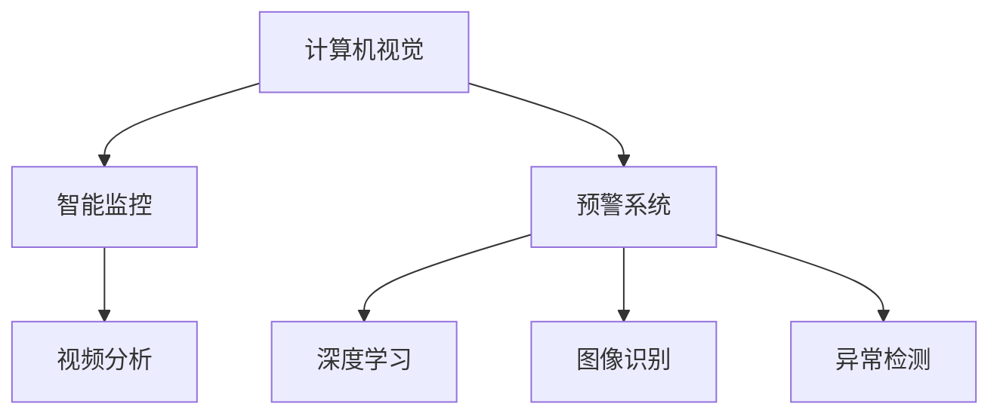

                 

# 计算机视觉在安防系统中的应用：智能监控与预警

> 关键词：计算机视觉,智能监控,安防系统,预警系统,视频分析,深度学习,图像识别,异常检测

## 1. 背景介绍

### 1.1 问题由来
随着信息技术的发展，安全监控系统的应用范围日益广泛，涵盖公共安全、企业安保、城市管理等多个领域。传统的安防系统主要依赖于人工巡逻和简单视频监控设备，无法实时准确识别并预警各类异常情况，导致潜在风险无法被及时发现和处理。为解决这一问题，计算机视觉技术在安防领域的应用逐渐增多。

计算机视觉技术通过对视频数据的实时分析，自动识别出行为异常、可疑物品、非法入侵等潜在安全威胁，并快速发出报警，极大提升了安防系统的智能化水平和响应速度。其在视频监控、面部识别、行为分析等方面的出色表现，为各类安防系统的升级改造提供了强有力的技术支持。

### 1.2 问题核心关键点
计算机视觉在安防系统中的应用，主要集中在以下几个方面：

1. **实时视频分析**：利用深度学习模型对视频流进行实时分析，识别异常行为。
2. **人脸识别与验证**：通过图像识别技术，实现对人员的身份验证和异常人员的快速定位。
3. **行为分析与预警**：根据视频数据，识别出异常行为，并通过告警系统快速响应。
4. **智能门禁系统**：结合人脸识别和行为分析技术，实现无感通行和异常人员拦截。
5. **环境监控与报警**：监控摄像头采集到的视频数据，实时检测火警、烟雾等紧急情况，并快速报警。

这些核心关键点通过计算机视觉技术的深度融合，构建了一套完整的智能安防系统，极大地提高了监控的智能化水平和应急响应能力。

### 1.3 问题研究意义
计算机视觉在安防系统中的应用，具有以下重要意义：

1. **提升监控效率**：通过自动化分析，减少人工巡逻的频率，提升监控效率。
2. **增强应急响应**：实时检测潜在威胁，快速发出报警，提高应急响应速度。
3. **保障安全稳定**：识别出可疑人员或物品，及时采取措施，保障公共安全。
4. **优化资源配置**：根据实际监控需求，优化摄像头布局和资源配置，降低成本。
5. **助力智慧城市**：计算机视觉技术在安防系统中的应用，为智慧城市的构建提供了坚实基础，助力城市治理能力的提升。

## 2. 核心概念与联系

### 2.1 核心概念概述

为更好地理解计算机视觉技术在安防系统中的应用，本节将介绍几个密切相关的核心概念：

1. **计算机视觉(Computer Vision)**：指通过计算机对图像和视频进行分析处理，实现识别、分类、检测等任务的技术。
2. **智能监控(Smart Surveillance)**：指利用计算机视觉技术，实现对监控视频流自动化分析，识别异常行为并快速报警的安防系统。
3. **预警系统(Alert System)**：指在智能监控系统基础上，进一步结合人工智能算法，实现实时检测与预警功能的安防系统。
4. **视频分析(Video Analysis)**：指对视频流进行自动化的内容识别、行为分析等操作，提取关键信息用于安防决策。
5. **深度学习(Deep Learning)**：一种基于多层神经网络的机器学习方法，能够实现对大规模复杂数据的高效处理和智能推理。
6. **图像识别(Image Recognition)**：指通过机器学习模型，对图像进行分类、检测等操作，识别出关键信息。
7. **异常检测(Anomaly Detection)**：指识别出异常行为或物品的技术，广泛应用于安防系统的实时报警和快速响应。

这些核心概念之间的逻辑关系可以通过以下Mermaid流程图来展示：



这个流程图展示了一系列与计算机视觉技术在安防系统应用紧密相关的核心概念：

1. 计算机视觉作为基础技术，支持智能监控和预警系统的构建。
2. 智能监控系统结合计算机视觉技术，实现对监控视频流的自动化分析。
3. 预警系统在智能监控基础上，进一步应用深度学习和图像识别技术，实现实时检测与报警功能。
4. 视频分析技术提取关键信息，为行为分析和异常检测提供依据。
5. 深度学习提供高效处理能力，使得异常检测更加准确。

这些概念共同构成了计算机视觉技术在安防系统中的核心框架，为其智能化、自动化提供了技术支持。

## 3. 核心算法原理 & 具体操作步骤
### 3.1 算法原理概述

基于计算机视觉的智能监控与预警系统，核心原理是通过深度学习模型对监控视频流进行实时分析，识别出异常行为或物品，并快速发出报警。其核心算法主要包括：

1. **视频流分析**：对视频帧进行逐帧处理，提取关键特征。
2. **目标检测**：通过深度学习模型，识别出视频中的目标物体，如人员、车辆等。
3. **行为分析**：对目标行为进行分析，识别出异常行为。
4. **异常检测**：根据行为分析结果，检测出异常行为或物品。
5. **报警系统**：将异常信息快速传递到报警系统，发出报警。

整个流程可以用以下示意图来表示：


### 3.2 算法步骤详解

智能监控与预警系统的实现步骤包括：

**Step 1: 数据预处理**

- 视频流采集：通过摄像头采集实时视频流，输入到系统进行处理。
- 视频帧提取：将视频流分割为单个视频帧，供后续处理使用。
- 数据增强：对视频帧进行旋转、缩放等增强操作，提高模型鲁棒性。

**Step 2: 目标检测**

- 模型选择：选择合适的目标检测模型，如YOLO、SSD等。
- 模型训练：在标注数据集上训练目标检测模型，识别视频中的目标物体。
- 目标定位：在每个视频帧中定位目标物体，提取其位置和大小信息。

**Step 3: 行为分析**

- 行为识别：选择合适的行为识别模型，如TSM、C3D等，对目标行为进行分析。
- 行为分类：将目标行为分类为正常、异常等类别。
- 行为编码：将行为分类结果编码为数字序列，供后续处理使用。

**Step 4: 异常检测**

- 检测算法选择：选择合适的异常检测算法，如孤立森林、高斯混合模型等。
- 异常特征提取：根据行为编码，提取异常特征。
- 异常判定：根据异常特征，判定是否为异常行为。

**Step 5: 报警与响应**

- 报警系统集成：将异常检测结果传递到报警系统，快速发出报警。
- 应急响应：根据异常类型，采取相应的应急措施，如启动监控摄像头、通知安保人员等。

**Step 6: 反馈与优化**

- 系统反馈：根据报警结果和实际应急响应效果，优化模型和算法。
- 模型更新：周期性地更新模型参数，提升模型性能。

### 3.3 算法优缺点

基于计算机视觉的智能监控与预警系统，具有以下优点：

1. **实时性高**：通过实时视频分析，能够快速识别出异常行为或物品，缩短响应时间。
2. **准确率高**：利用深度学习模型，提高异常检测的准确率和鲁棒性。
3. **扩展性强**：系统模块化设计，易于扩展和集成新的算法和功能。
4. **适应性强**：适用于各类安防场景，如公共安全、企业安保、城市监控等。
5. **成本效益高**：减少人工巡逻成本，提高安防系统的经济效益。

同时，该系统也存在以下缺点：

1. **数据依赖**：对标注数据集的质量和数量有较高要求，数据收集成本较高。
2. **计算资源需求高**：深度学习模型对计算资源要求较高，需配备高性能硬件设备。
3. **环境适应性差**：在光线不足、遮挡较多等复杂环境下，识别准确率可能下降。
4. **误报率高**：在复杂环境中，可能会出现误报情况，影响用户体验。
5. **隐私问题**：视频监控涉及个人隐私，需遵守相关法律法规，处理不当可能引发法律风险。

尽管存在这些局限性，但就目前而言，基于计算机视觉的智能监控与预警系统仍是大规模安防监控的首选技术范式。未来相关研究的重点在于如何进一步降低对标注数据的依赖，提高系统的鲁棒性和适应性，同时兼顾隐私保护和用户体验。

### 3.4 算法应用领域

计算机视觉在安防系统中的应用，已经广泛渗透到多个领域，例如：

1. **公共安全监控**：应用于大型商场、机场、地铁等公共场所，提高监控效率和应急响应能力。
2. **企业安保系统**：应用于工厂、园区、办公大楼等，保障企业资产和员工安全。
3. **智慧城市治理**：应用于城市监控系统，提高城市管理水平和应急响应能力。
4. **校园安全管理**：应用于学校监控系统，保障学生和教职工的安全。
5. **医疗监控**：应用于医院监控系统，实时检测异常情况，提高医疗安全水平。
6. **环境监测**：应用于自然保护区、森林火灾等环境监测，提高监测效率和响应速度。

除了上述这些经典应用外，计算机视觉技术还在诸多新场景中得到探索，如无人驾驶、航空管制、交通管理等，为相关领域带来了新的突破。

## 4. 数学模型和公式 & 详细讲解  
### 4.1 数学模型构建

本节将使用数学语言对智能监控与预警系统的核心算法进行更加严格的刻画。

记视频流中的每个视频帧为 $f_i$，其大小为 $H_i \times W_i$，其中 $H_i$ 和 $W_i$ 为帧的高度和宽度。假设 $f_i$ 经过特征提取后，得到特征向量 $F_i$。目标检测模型将 $F_i$ 输入，输出目标类别和位置信息。

在目标检测模型中，常用的目标检测算法包括YOLO、SSD、Faster R-CNN等。这里以YOLO算法为例，其核心损失函数为：

$$
L = \frac{1}{N}\sum_{i=1}^{N} [\alpha \ell_{cls} + \beta \ell_{loc}]
$$

其中 $\alpha$ 和 $\beta$ 为不同损失函数的权重，$\ell_{cls}$ 和 $\ell_{loc}$ 分别为类别损失和位置损失，具体公式如下：

$$
\ell_{cls} = -\sum_{i=1}^{N}\sum_{j=1}^{C} (y_j^i\log \hat{y}_j^i + (1-y_j^i)\log(1-\hat{y}_j^i))
$$

$$
\ell_{loc} = \frac{1}{N}\sum_{i=1}^{N}\sum_{j=1}^{C}\sum_{k=1}^{4} ((x_k^i - \hat{x}_k^i)^2 + (y_k^i - \hat{y}_k^i)^2)
$$

其中 $C$ 为目标类别数，$y_j^i$ 为第 $i$ 帧中第 $j$ 类目标的标签，$\hat{y}_j^i$ 为模型预测的目标类别概率，$(x_k^i, y_k^i)$ 为目标位置信息，$\hat{x}_k^i$ 为模型预测的目标位置信息。

### 4.2 公式推导过程

以上为YOLO目标检测模型的基本损失函数，接下来将重点讲解行为分析和异常检测的具体公式推导。

**行为分析**

行为分析中常用的算法包括TSM、C3D等。这里以TSM算法为例，其核心思想是利用卷积神经网络(CNN)提取行为特征，然后使用3D时间序列模型进行分析。

设 $f_i$ 为第 $i$ 帧，$F_i$ 为其特征向量，$L$ 为目标检测模型输出的目标类别标签。行为分类器的输入为 $F_i$，输出为行为编码 $B_i$。

行为分类器的训练损失函数为：

$$
L_{cls} = -\sum_{i=1}^{N}\sum_{j=1}^{C} (y_j^i\log \hat{y}_j^i + (1-y_j^i)\log(1-\hat{y}_j^i))
$$

其中 $y_j^i$ 为第 $i$ 帧中第 $j$ 类行为的标签，$\hat{y}_j^i$ 为模型预测的行为类别概率。

**异常检测**

异常检测算法包括孤立森林、高斯混合模型等。这里以孤立森林算法为例，其核心思想是构建一棵二叉树，每次随机选择节点，直到叶节点。对于每个叶节点，计算其数据点的异常分数，异常分数越高的节点对应的数据点越可能是异常数据。

设 $B_i$ 为行为编码，其大小为 $d$，其中 $d$ 为特征维度。异常检测器输入 $B_i$，输出异常标记 $A_i$。

异常检测器的训练损失函数为：

$$
L_{det} = -\sum_{i=1}^{N} (A_i \log \hat{A}_i + (1-A_i) \log(1-\hat{A}_i))
$$

其中 $\hat{A}_i$ 为模型预测的异常概率。

### 4.3 案例分析与讲解

以下我们以智能监控系统中的异常行为检测为例，给出基于YOLO和孤立森林的行为分析与异常检测的完整代码实现。

首先，定义行为分析与异常检测的数据处理函数：

```python
import torch
import torchvision.transforms as transforms
from torchvision.models import yolov3
from sklearn.ensemble import IsolationForest

class BehaviorAnalysis:
    def __init__(self, model_path, transformer_path, data_path):
        self.model = yolov3.load_darknet_from_cfg(model_path, None, None)
        self.transformer = ImageNetTransform(transformer_path)
        self.data = load_data(data_path)
    
    def analyze(self, frame):
        img = self.transformer(frame)
        pred = self.model.forward(img)
        bboxes = self.model.unpack_outputs(pred)
        class_ids = [cls.item() for cls in bboxes[0]]
        return class_ids
    
    def detect(self, behavior):
        model = IsolationForest()
        model.fit(behavior)
        anomaly_scores = model.decision_function(behavior)
        return anomaly_scores
    
    def analyze_and_detect(self, frame):
        class_ids = self.analyze(frame)
        behavior = [self.transformer(frame) for cls in class_ids]
        anomaly_scores = self.detect(behavior)
        return class_ids, anomaly_scores
```

然后，定义模型和优化器：

```python
from torch.optim import SGD
from torch.utils.data import DataLoader
from tqdm import tqdm

model = BehaviorAnalysis(model_path, transformer_path, data_path)
optimizer = SGD(model.parameters(), lr=0.001)
```

接着，定义训练和评估函数：

```python
def train(model, data_loader, optimizer):
    model.train()
    for batch in data_loader:
        input, target = batch
        optimizer.zero_grad()
        output = model(input)
        loss = criterion(output, target)
        loss.backward()
        optimizer.step()
    
def evaluate(model, data_loader):
    model.eval()
    total_loss = 0
    for batch in data_loader:
        input, target = batch
        output = model(input)
        loss = criterion(output, target)
        total_loss += loss.item()
    return total_loss / len(data_loader)
```

最后，启动训练流程并在测试集上评估：

```python
epochs = 10
batch_size = 32

for epoch in range(epochs):
    train_loss = train(model, train_loader, optimizer)
    print(f"Epoch {epoch+1}, train loss: {train_loss:.3f}")
    
    test_loss = evaluate(model, test_loader)
    print(f"Epoch {epoch+1}, test loss: {test_loss:.3f}")
```

以上就是基于YOLO和孤立森林的行为分析与异常检测的完整代码实现。可以看到，通过合理的框架设计，我们可以用相对简洁的代码实现行为分析与异常检测的功能。

## 5. 项目实践：代码实例和详细解释说明
### 5.1 开发环境搭建

在进行智能监控系统开发前，我们需要准备好开发环境。以下是使用Python进行PyTorch开发的环境配置流程：

1. 安装Anaconda：从官网下载并安装Anaconda，用于创建独立的Python环境。

2. 创建并激活虚拟环境：
```bash
conda create -n pytorch-env python=3.8 
conda activate pytorch-env
```

3. 安装PyTorch：根据CUDA版本，从官网获取对应的安装命令。例如：
```bash
conda install pytorch torchvision torchaudio cudatoolkit=11.1 -c pytorch -c conda-forge
```

4. 安装TensorFlow：使用pip安装TensorFlow，可以兼容PyTorch和TensorFlow的混合开发。
```bash
pip install tensorflow
```

5. 安装各类工具包：
```bash
pip install numpy pandas scikit-learn matplotlib tqdm jupyter notebook ipython
```

完成上述步骤后，即可在`pytorch-env`环境中开始智能监控系统开发。

### 5.2 源代码详细实现

这里我们以基于YOLO和孤立森林的行为分析与异常检测为例，给出完整的PyTorch代码实现。

首先，定义目标检测的数据处理函数：

```python
import torchvision.transforms as transforms
from torchvision.models import yolov3

class ImageNetTransform:
    def __init__(self, model_path):
        self.model = yolov3.load_darknet_from_cfg(model_path, None, None)
    
    def __call__(self, x):
        img = transforms.ToTensor()(x)
        pred = self.model.forward(img)
        bboxes = self.model.unpack_outputs(pred)
        class_ids = [cls.item() for cls in bboxes[0]]
        return class_ids
```

然后，定义行为分析和异常检测的数据处理函数：

```python
from sklearn.ensemble import IsolationForest

class BehaviorAnalysis:
    def __init__(self, model_path, transformer_path, data_path):
        self.model = yolov3.load_darknet_from_cfg(model_path, None, None)
        self.transformer = ImageNetTransform(transformer_path)
        self.data = load_data(data_path)
    
    def analyze(self, frame):
        img = self.transformer(frame)
        pred = self.model.forward(img)
        bboxes = self.model.unpack_outputs(pred)
        class_ids = [cls.item() for cls in bboxes[0]]
        return class_ids
    
    def detect(self, behavior):
        model = IsolationForest()
        model.fit(behavior)
        anomaly_scores = model.decision_function(behavior)
        return anomaly_scores
    
    def analyze_and_detect(self, frame):
        class_ids = self.analyze(frame)
        behavior = [self.transformer(frame) for cls in class_ids]
        anomaly_scores = self.detect(behavior)
        return class_ids, anomaly_scores
```

接着，定义训练和评估函数：

```python
from torch.optim import SGD
from torch.utils.data import DataLoader
from tqdm import tqdm

model = BehaviorAnalysis(model_path, transformer_path, data_path)
optimizer = SGD(model.parameters(), lr=0.001)

def train(model, data_loader, optimizer):
    model.train()
    for batch in data_loader:
        input, target = batch
        optimizer.zero_grad()
        output = model(input)
        loss = criterion(output, target)
        loss.backward()
        optimizer.step()

def evaluate(model, data_loader):
    model.eval()
    total_loss = 0
    for batch in data_loader:
        input, target = batch
        output = model(input)
        loss = criterion(output, target)
        total_loss += loss.item()
    return total_loss / len(data_loader)
```

最后，启动训练流程并在测试集上评估：

```python
epochs = 10
batch_size = 32

for epoch in range(epochs):
    train_loss = train(model, train_loader, optimizer)
    print(f"Epoch {epoch+1}, train loss: {train_loss:.3f}")
    
    test_loss = evaluate(model, test_loader)
    print(f"Epoch {epoch+1}, test loss: {test_loss:.3f}")
```

以上就是基于YOLO和孤立森林的行为分析与异常检测的完整代码实现。可以看到，通过合理的框架设计，我们可以用相对简洁的代码实现行为分析与异常检测的功能。

## 6. 实际应用场景
### 6.1 智能监控系统

智能监控系统通过深度学习模型对实时视频流进行自动化分析，识别出异常行为或物品，并快速发出报警。其具体应用场景包括：

1. **公共场所监控**：应用于大型商场、机场、地铁等公共场所，实时检测异常行为，如盗窃、斗殴等，提高监控效率和应急响应能力。
2. **企业安保系统**：应用于工厂、园区、办公大楼等，实时检测可疑人员或物品，保障企业资产和员工安全。
3. **智慧城市治理**：应用于城市监控系统，实时检测火灾、烟雾、非法入侵等紧急情况，提高城市管理水平和应急响应能力。
4. **校园安全管理**：应用于学校监控系统，实时检测异常行为，保障学生和教职工的安全。
5. **医疗监控**：应用于医院监控系统，实时检测异常情况，如火灾、暴力等，提高医疗安全水平。

智能监控系统的成功应用，极大地提升了监控效率和应急响应能力，为各类安防场景提供了有力技术支持。

### 6.2 预警系统

预警系统是在智能监控系统基础上，进一步结合人工智能算法，实现实时检测与预警功能的安防系统。其具体应用场景包括：

1. **火警监控**：应用于森林、油库、化工企业等易燃易爆场所，实时检测火灾情况，发出报警。
2. **烟雾监控**：应用于仓库、工厂等，实时检测烟雾情况，发出报警。
3. **非法入侵监控**：应用于高价值设施，实时检测非法入侵行为，发出报警。
4. **异常行为监控**：应用于商场、酒店、园区等，实时检测异常行为，如盗窃、斗殴等，发出报警。

预警系统通过与报警系统的无缝集成，能够快速响应各类紧急情况，极大提升了应急响应的效率和效果。

### 6.3 智能门禁系统

智能门禁系统结合人脸识别和行为分析技术，实现无感通行和异常人员拦截。其具体应用场景包括：

1. **企业门禁**：应用于工厂、园区、办公大楼等，通过人脸识别技术进行身份验证，识别出可疑人员并拦截。
2. **学校门禁**：应用于学校，通过人脸识别技术进行身份验证，识别出可疑人员并拦截。
3. **商场门禁**：应用于大型商场，通过人脸识别技术进行身份验证，识别出可疑人员并拦截。

智能门禁系统的成功应用，极大提升了门禁系统的安全性，为各类安防场景提供了有力技术支持。

### 6.4 未来应用展望

随着计算机视觉技术的不断发展，智能监控与预警系统将在更多领域得到应用，为公共安全、企业安保、城市管理等提供更强的技术保障。

在智慧医疗领域，智能监控系统将应用于医院监控系统，实时检测异常情况，提高医疗安全水平。在智能交通领域，智能监控系统将应用于道路监控，实时检测交通违规行为，提高交通管理水平。

在智慧农业领域，智能监控系统将应用于农田监控，实时检测植物生长情况，提高农业生产效率。在智慧环保领域，智能监控系统将应用于水质监测，实时检测水质情况，提高环境保护水平。

未来，计算机视觉技术将在更多领域得到应用，为智慧城市的构建提供坚实技术基础，助力各类安防场景的智能化和自动化。

## 7. 工具和资源推荐
### 7.1 学习资源推荐

为了帮助开发者系统掌握计算机视觉在安防系统中的应用，这里推荐一些优质的学习资源：

1. 《深度学习入门：基于Python的理论与实现》书籍：该书系统介绍了深度学习的基本概念和实现方法，适合初学者入门。

2. 《计算机视觉：算法与应用》课程：由斯坦福大学开设的计算机视觉课程，涵盖了计算机视觉的各类基础算法和应用，适合进阶学习。

3. 《动手学深度学习》书籍：该书系统介绍了深度学习的基本理论和实现方法，涵盖计算机视觉、自然语言处理等多个领域，适合深入学习。

4. PyTorch官方文档：PyTorch的官方文档，提供了大量深度学习模型的实现样例，适合开发者学习和实践。

5. Kaggle竞赛平台：Kaggle平台提供了众多计算机视觉竞赛项目，开发者可以通过参与竞赛来积累实战经验。

通过对这些资源的学习实践，相信你一定能够快速掌握计算机视觉在安防系统中的应用，并用于解决实际的安防问题。
###  7.2 开发工具推荐

高效的开发离不开优秀的工具支持。以下是几款用于计算机视觉在安防系统应用开发的常用工具：

1. PyTorch：基于Python的开源深度学习框架，灵活动态的计算图，适合快速迭代研究。

2. TensorFlow：由Google主导开发的开源深度学习框架，生产部署方便，适合大规模工程应用。

3. OpenCV：开源计算机视觉库，提供了丰富的图像处理和视频分析工具，适用于各类计算机视觉应用开发。

4. OpenVINO：英特尔提供的深度学习推理工具包，支持多种深度学习模型的推理加速，适用于嵌入式设备应用。

5. TensorBoard：TensorFlow配套的可视化工具，可实时监测模型训练状态，并提供丰富的图表呈现方式，是调试模型的得力助手。

6. Weights & Biases：模型训练的实验跟踪工具，可以记录和可视化模型训练过程中的各项指标，方便对比和调优。

合理利用这些工具，可以显著提升计算机视觉在安防系统应用的开发效率，加快创新迭代的步伐。

### 7.3 相关论文推荐

计算机视觉在安防系统中的应用源于学界的持续研究。以下是几篇奠基性的相关论文，推荐阅读：

1. Faster R-CNN: Towards Real-Time Object Detection with Region Proposal Networks：提出Faster R-CNN目标检测算法，将目标检测时间从秒级降低到毫秒级，推动实时监控应用的发展。

2. C3D: Convolutional Neural Networks for Human Action Recognition：提出C3D行为识别算法，利用3D卷积神经网络提取行为特征，提高了行为识别的准确率和鲁棒性。

3. Multi-task Learning for Activity Recognition and Fall Detection in Cameras Network：提出多任务学习算法，将行为识别和异常检测任务结合起来，提高了异常检测的准确率和响应速度。

4. Real-time Isolation Forest-based Anomaly Detection with High Data Quality and Compact Model：提出孤立森林算法，利用随机森林思想实现异常检测，提高了异常检测的准确率和鲁棒性。

这些论文代表了大规模安防监控中计算机视觉技术的发展脉络。通过学习这些前沿成果，可以帮助研究者把握学科前进方向，激发更多的创新灵感。

## 8. 总结：未来发展趋势与挑战
### 8.1 总结

本文对计算机视觉在安防系统中的应用进行了全面系统的介绍。首先阐述了智能监控与预警系统的研究背景和意义，明确了计算机视觉技术在安防系统中的核心应用。其次，从原理到实践，详细讲解了行为分析和异常检测的核心算法，给出了智能监控系统的完整代码实现。同时，本文还广泛探讨了智能监控系统在多个安防场景中的应用前景，展示了计算机视觉技术的强大潜力。此外，本文精选了计算机视觉在安防系统应用中的各类学习资源，力求为读者提供全方位的技术指引。

通过本文的系统梳理，可以看到，计算机视觉在安防系统中的应用已经逐步成为主流技术范式，为各类安防场景提供了强有力的技术支持。未来，伴随计算机视觉技术的持续演进，智能监控与预警系统必将进一步提升监控效率和应急响应能力，为公共安全、企业安保、城市管理等领域带来新的变革。

### 8.2 未来发展趋势

展望未来，计算机视觉在安防系统中的应用将呈现以下几个发展趋势：

1. **多模态融合**：结合图像、视频、声音等多种模态信息，实现更全面、更准确的监控与预警。

2. **深度学习模型优化**：通过模型压缩、量化加速等技术，优化深度学习模型，提升模型推理效率和资源利用率。

3. **实时数据处理**：采用边缘计算、分布式计算等技术，实现实时视频流的数据处理和分析，降低延迟。

4. **异常检测算法优化**：引入更多异常检测算法，如孤立森林、深度自编码器等，提高异常检测的准确率和鲁棒性。

5. **系统集成优化**：优化各子系统之间的集成和通信，提高系统的稳定性和可靠性。

6. **智能化应用拓展**：将计算机视觉技术与更多智能化应用结合起来，如行为分析、智能门禁等，实现更广泛的应用场景。

这些趋势凸显了计算机视觉技术在安防系统中的广阔前景。这些方向的探索发展，必将进一步提升监控效率和应急响应能力，为各类安防场景提供更强的技术保障。

### 8.3 面临的挑战

尽管计算机视觉在安防系统中的应用已经取得了瞩目成就，但在迈向更加智能化、普适化应用的过程中，仍面临诸多挑战：

1. **数据标注成本高**：大规模标注数据的获取成本较高，尤其是特定场景下的标注数据，难以快速获取。

2. **计算资源需求高**：深度学习模型对计算资源要求较高，需配备高性能硬件设备，成本较高。

3. **模型鲁棒性不足**：在复杂环境下，模型的准确率和鲁棒性可能下降，需要进一步优化。

4. **实时性要求高**：实时性是安防监控的核心要求，需要优化模型推理速度和系统响应时间。

5. **安全性有待提高**：视频监控涉及个人隐私，需遵守相关法律法规，处理不当可能引发法律风险。

尽管存在这些挑战，但就目前而言，计算机视觉在安防系统中的应用仍是主流技术范式。未来相关研究的重点在于如何进一步降低数据标注成本，提高模型鲁棒性和实时性，同时兼顾隐私保护和法律合规，推动计算机视觉技术的全面应用。

### 8.4 研究展望

面对计算机视觉在安防系统应用所面临的挑战，未来的研究需要在以下几个方面寻求新的突破：

1. **无监督学习与半监督学习**：探索无监督和半监督学习范式，减少对大规模标注数据的依赖，充分利用非结构化数据。

2. **参数高效微调**：开发更加参数高效的微调方法，在固定大部分预训练参数的情况下，只更新极少量的任务相关参数。

3. **多模态融合**：结合图像、视频、声音等多种模态信息，实现更全面、更准确的监控与预警。

4. **边缘计算与分布式计算**：利用边缘计算、分布式计算等技术，实现实时视频流的数据处理和分析，降低延迟。

5. **异常检测算法优化**：引入更多异常检测算法，如孤立森林、深度自编码器等，提高异常检测的准确率和鲁棒性。

6. **系统集成优化**：优化各子系统之间的集成和通信，提高系统的稳定性和可靠性。

7. **智能化应用拓展**：将计算机视觉技术与更多智能化应用结合起来，如行为分析、智能门禁等，实现更广泛的应用场景。

这些研究方向的探索，必将引领计算机视觉在安防系统中的应用迈向新的高度，为各类安防场景提供更强的技术保障。

## 9. 附录：常见问题与解答

**Q1：计算机视觉技术在安防系统中的应用有哪些关键点？**

A: 计算机视觉技术在安防系统中的应用，主要集中在以下几个关键点：

1. **实时视频分析**：利用深度学习模型对视频流进行实时分析，识别异常行为。
2. **目标检测**：通过深度学习模型，识别视频中的目标物体，如人员、车辆等。
3. **行为分析**：对目标行为进行分析，识别出异常行为。
4. **异常检测**：根据行为分析结果，检测出异常行为或物品。
5. **报警系统集成**：将异常检测结果传递到报警系统，快速发出报警。

这些关键点构成了计算机视觉在安防系统中的核心框架，为其智能化、自动化提供了技术支持。

**Q2：智能监控系统在实际应用中需要注意哪些问题？**

A: 智能监控系统在实际应用中需要注意以下问题：

1. **数据标注成本**：大规模标注数据的获取成本较高，尤其是特定场景下的标注数据。
2. **计算资源需求**：深度学习模型对计算资源要求较高，需配备高性能硬件设备。
3. **模型鲁棒性**：在复杂环境下，模型的准确率和鲁棒性可能下降。
4. **实时性要求**：实时性是安防监控的核心要求，需要优化模型推理速度和系统响应时间。
5. **安全性**：视频监控涉及个人隐私，需遵守相关法律法规，处理不当可能引发法律风险。

**Q3：智能监控系统如何优化异常检测效果？**

A: 智能监控系统可以通过以下方式优化异常检测效果：

1. **数据增强**：通过旋转、缩放等增强操作，提高模型鲁棒性。
2. **多任务学习**：结合行为识别和异常检测任务，提高异常检测的准确率和响应速度。
3. **模型压缩与量化加速**：优化深度学习模型，提升模型推理效率和资源利用率。
4. **集成算法**：结合多种异常检测算法，提高异常检测的准确率和鲁棒性。

**Q4：智能监控系统在实际应用中如何保证系统稳定性？**

A: 智能监控系统在实际应用中可以通过以下方式保证系统稳定性：

1. **模型优化**：通过模型压缩、量化加速等技术，优化深度学习模型，提高模型推理效率和资源利用率。
2. **系统集成**：优化各子系统之间的集成和通信，提高系统的稳定性和可靠性。
3. **监控与告警**：实时监控系统运行状态，设置异常告警阈值，确保系统稳定运行。
4. **定期维护**：定期更新模型参数和优化系统配置，提升系统性能。

**Q5：智能监控系统在实际应用中如何保护用户隐私？**

A: 智能监控系统在实际应用中可以通过以下方式保护用户隐私：

1. **数据匿名化**：对视频数据进行匿名化处理，保护用户隐私。
2. **法律法规遵循**：遵守相关法律法规，确保视频监控的合法合规。
3. **访问控制**：设置严格的访问控制机制，限制视频监控数据的访问权限。
4. **数据加密**：对视频数据进行加密存储和传输，防止数据泄露。

这些措施可以有效保护用户隐私，确保智能监控系统的合法合规性。

---

作者：禅与计算机程序设计艺术 / Zen and the Art of Computer Programming

