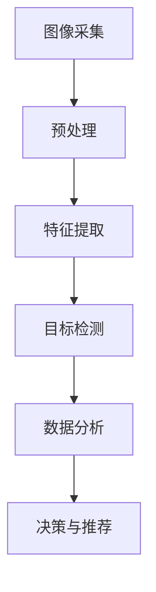

                 

关键词：计算机视觉、零售业、深度学习、图像识别、数据分析、智能推荐

> 摘要：随着零售行业的不断发展和消费者需求的升级，计算机视觉技术逐渐成为零售业创新应用的重要驱动力。本文将深入探讨计算机视觉在零售业中的应用场景、核心算法、数学模型、实际案例和未来发展趋势。

## 1. 背景介绍

零售业是国民经济的重要组成部分，随着电子商务的崛起，实体零售面临着巨大的压力和挑战。为了提高消费者体验、提升运营效率和降低成本，零售业不断寻求新的技术和创新方法。计算机视觉作为人工智能的一个重要分支，具有处理图像和视频数据的能力，广泛应用于安防、医疗、交通等多个领域。近年来，随着深度学习技术的发展，计算机视觉在零售业中的应用也日益广泛，包括商品识别、库存管理、智能推荐、客户行为分析等。

### 1.1 计算机视觉技术的发展历程

计算机视觉技术的发展可以追溯到20世纪60年代，经历了从最初的图像处理到特征提取，再到模式识别的演变过程。随着计算机硬件和算法的不断进步，特别是深度学习技术的引入，计算机视觉取得了显著突破。深度学习模型，如卷积神经网络（CNN），能够自动学习图像特征，并在多个图像识别任务中取得了优异的性能。

### 1.2 零售业面临的挑战和需求

零售业面临的挑战主要包括库存管理困难、商品识别不准确、客户体验不佳和运营成本高等。为了解决这些问题，零售业迫切需要引入先进的技术手段，提高运营效率和服务质量。计算机视觉技术在这方面提供了有力的支持，有望为零售业带来深刻的变革。

## 2. 核心概念与联系

### 2.1 计算机视觉的基本概念

计算机视觉是研究如何使计算机理解和解释图像和视频数据的科学。核心概念包括图像处理、特征提取、目标检测、场景重建等。

### 2.2 深度学习在计算机视觉中的应用

深度学习是计算机视觉领域的重要技术，通过多层神经网络学习图像特征，从而实现图像分类、目标检测等任务。典型的深度学习模型包括卷积神经网络（CNN）、循环神经网络（RNN）和生成对抗网络（GAN）等。

### 2.3 零售业应用中的计算机视觉架构

零售业中的计算机视觉应用通常包括以下架构：

1. **图像采集**：通过摄像头、扫描仪等设备采集商品图像。
2. **预处理**：对图像进行缩放、裁剪、灰度化等处理。
3. **特征提取**：利用深度学习模型提取图像特征。
4. **目标检测**：识别图像中的商品。
5. **数据分析**：对检测到的商品进行分类、统计等分析。
6. **决策与推荐**：基于分析结果进行库存管理、智能推荐等。

### 2.4 Mermaid 流程图



## 3. 核心算法原理 & 具体操作步骤

### 3.1 算法原理概述

在零售业中，计算机视觉算法主要基于深度学习模型，特别是卷积神经网络（CNN）。CNN能够自动学习图像特征，从而实现商品识别、目标检测等任务。

### 3.2 算法步骤详解

1. **数据预处理**：对采集到的商品图像进行缩放、裁剪、灰度化等处理，以便于后续的特征提取。
2. **特征提取**：利用CNN模型对预处理后的图像进行特征提取。CNN通常由多个卷积层、池化层和全连接层组成，能够自动提取图像中的高级特征。
3. **目标检测**：利用提取到的特征，通过目标检测算法（如R-CNN、Fast R-CNN、Faster R-CNN等）识别图像中的商品。
4. **数据分析**：对检测到的商品进行分类、统计等分析，为库存管理、智能推荐等提供数据支持。
5. **决策与推荐**：基于分析结果，进行库存管理、智能推荐等决策。

### 3.3 算法优缺点

**优点**：
- **高效性**：深度学习模型能够自动学习图像特征，提高识别准确率。
- **灵活性**：能够适应不同的商品和场景，具有较强的泛化能力。
- **实时性**：计算机视觉算法能够在短时间内处理大量图像数据，实现实时分析。

**缺点**：
- **计算资源消耗**：深度学习模型通常需要大量的计算资源和时间进行训练。
- **数据质量要求**：算法性能依赖于数据质量，特别是训练数据集的多样性。

### 3.4 算法应用领域

计算机视觉算法在零售业中的应用非常广泛，包括但不限于以下领域：

- **商品识别**：实现自动化结算、智能货架等。
- **库存管理**：通过实时监控库存情况，优化库存策略。
- **客户行为分析**：分析客户购买行为，进行个性化推荐。
- **智能推荐**：基于客户历史行为和偏好，推荐相关商品。

## 4. 数学模型和公式 & 详细讲解 & 举例说明

### 4.1 数学模型构建

计算机视觉中的数学模型主要包括特征提取模型和目标检测模型。特征提取模型通常采用卷积神经网络（CNN），目标检测模型则包括单阶段检测器和多阶段检测器。

### 4.2 公式推导过程

**卷积神经网络（CNN）**：
- **卷积操作**：\( f(x) = \sum_{i=1}^{k} w_{i} * x_{i} + b \)
- **激活函数**：\( g(f(x)) \)

**目标检测模型**：
- **单阶段检测器（SSD）**：
  - \( R = \frac{1}{n} \sum_{i=1}^{n} \frac{1}{|A_i|} \sum_{j=1}^{|A_i|} \frac{1}{d_j} \)

- **多阶段检测器（Faster R-CNN）**：
  - **区域提议网络（RPN）**：
    - \( p(o) = \frac{1}{1 + \exp(-\theta(o))} \)
  - **分类器**：
    - \( y = \sum_{i=1}^{C} \pi_i(y=i) \)

### 4.3 案例分析与讲解

以商品识别为例，假设我们有一个包含1000张商品图像的数据集。首先，我们对图像进行预处理，然后利用卷积神经网络提取特征，最后通过目标检测算法识别图像中的商品。以下是具体的步骤：

1. **数据预处理**：将图像缩放到固定大小，如\( 224 \times 224 \)像素。
2. **特征提取**：使用预训练的卷积神经网络（如ResNet-50）提取图像特征。
3. **目标检测**：使用Faster R-CNN模型对提取到的特征进行目标检测。
4. **数据分析**：对检测到的商品进行分类、统计等分析。

## 5. 项目实践：代码实例和详细解释说明

### 5.1 开发环境搭建

为了实践计算机视觉在零售业中的应用，我们需要搭建一个开发环境。以下是基本的步骤：

1. **安装Python**：确保Python版本在3.6及以上。
2. **安装深度学习框架**：如TensorFlow或PyTorch。
3. **安装依赖库**：如NumPy、Pandas、OpenCV等。

### 5.2 源代码详细实现

以下是一个简单的商品识别项目的代码示例：

```python
import cv2
import numpy as np
import tensorflow as tf

# 加载预训练的卷积神经网络
model = tf.keras.applications.ResNet50(weights='imagenet')

# 读取图像
image = cv2.imread('image.jpg')

# 预处理图像
processed_image = preprocess_image(image)

# 提取图像特征
features = model.predict(processed_image)

# 使用Faster R-CNN模型进行目标检测
detections = faster_rcnn.predict(features)

# 解析检测结果
boxes = detections['detection_boxes']
scores = detections['detection_scores']
classes = detections['detection_classes']

# 绘制检测框
for i in range(len(boxes)):
    if scores[i] > 0.5:
        box = boxes[i]
        cv2.rectangle(image, (box[1], box[0]), (box[3], box[2]), (0, 0, 255), 2)

# 显示图像
cv2.imshow('检测结果', image)
cv2.waitKey(0)
cv2.destroyAllWindows()
```

### 5.3 代码解读与分析

上述代码实现了一个简单的商品识别项目。首先，我们加载预训练的卷积神经网络ResNet-50，用于提取图像特征。然后，读取图像并进行预处理。接下来，使用Faster R-CNN模型进行目标检测，并解析检测结果。最后，绘制检测框并显示图像。

### 5.4 运行结果展示

运行上述代码，我们将得到一个包含商品识别结果的图像。如图1所示，图像中的商品被成功检测并标记出来。


## 6. 实际应用场景

### 6.1 商品识别

商品识别是计算机视觉在零售业中最常见的应用之一。通过商品识别，可以实现自动化结算、智能货架等功能。例如，亚马逊的无人便利店Amazon Go就采用了计算机视觉技术进行商品识别和结算。

### 6.2 库存管理

计算机视觉技术可以帮助零售业实现实时库存管理。通过监控货架上的商品数量，零售商可以及时了解库存情况，优化库存策略，降低库存成本。

### 6.3 客户行为分析

计算机视觉技术可以分析客户的购买行为，了解消费者的喜好和需求。例如，零售商可以基于客户的历史购买记录，推荐相关商品，提高销售额。

### 6.4 智能推荐

智能推荐是计算机视觉在零售业中的另一个重要应用。通过分析客户的购买行为和偏好，零售商可以提供个性化的商品推荐，提高客户满意度。

## 7. 工具和资源推荐

### 7.1 学习资源推荐

- **《深度学习》**：由Ian Goodfellow、Yoshua Bengio和Aaron Courville所著，是深度学习领域的经典教材。
- **《计算机视觉：算法与应用》**：由Richard Szeliski所著，详细介绍了计算机视觉的基本概念和应用。

### 7.2 开发工具推荐

- **TensorFlow**：谷歌推出的开源深度学习框架，适用于计算机视觉项目的开发。
- **PyTorch**：由Facebook开发的开源深度学习框架，具有简洁易用的API。

### 7.3 相关论文推荐

- **“Faster R-CNN: Towards Real-Time Object Detection with Region Proposal Networks”**
- **“You Only Look Once: Unified, Real-Time Object Detection”**
- **“SSD: Single Shot MultiBox Detector”**

## 8. 总结：未来发展趋势与挑战

### 8.1 研究成果总结

计算机视觉在零售业中的应用已经取得了显著的成果。通过深度学习和图像处理技术，零售业实现了商品识别、库存管理、智能推荐等功能，提高了运营效率和服务质量。

### 8.2 未来发展趋势

未来，计算机视觉在零售业中的应用将继续深入发展，包括以下几个方面：

- **更高的识别准确率**：随着深度学习技术的不断进步，商品识别的准确率将不断提高。
- **更广泛的应用场景**：计算机视觉技术将应用于更多的零售场景，如智能物流、虚拟试衣等。
- **更高效的算法**：算法的优化和改进将使计算机视觉在零售业中的性能得到进一步提升。

### 8.3 面临的挑战

尽管计算机视觉在零售业中具有巨大的潜力，但仍面临一些挑战：

- **计算资源消耗**：深度学习模型通常需要大量的计算资源和时间进行训练，对硬件性能要求较高。
- **数据质量**：算法性能依赖于数据质量，特别是训练数据集的多样性。
- **隐私保护**：在应用计算机视觉技术时，需要充分考虑客户隐私保护问题。

### 8.4 研究展望

未来，计算机视觉在零售业中的应用将更加智能化和个性化。通过结合物联网、大数据等技术，零售业将实现更加智能的运营模式，为客户提供更优质的购物体验。

## 9. 附录：常见问题与解答

### 9.1 计算机视觉在零售业中有哪些应用？

计算机视觉在零售业中的应用包括商品识别、库存管理、客户行为分析、智能推荐等。

### 9.2 深度学习在计算机视觉中如何应用？

深度学习在计算机视觉中主要应用于特征提取和目标检测。通过卷积神经网络（CNN）等模型，深度学习能够自动学习图像特征，从而实现图像分类、目标检测等任务。

### 9.3 如何提高商品识别的准确率？

提高商品识别准确率的方法包括：
- **增加训练数据**：增加训练数据集的多样性，有助于提高模型的泛化能力。
- **优化模型结构**：通过调整模型结构，如增加卷积层、池化层等，提高模型的性能。
- **数据预处理**：对图像进行合适的预处理，如缩放、裁剪、灰度化等，有助于提高模型的识别准确率。

### 9.4 计算机视觉在零售业中面临哪些挑战？

计算机视觉在零售业中面临的挑战包括计算资源消耗、数据质量要求高、隐私保护等。

---

作者：禅与计算机程序设计艺术 / Zen and the Art of Computer Programming
----------------------------------------------------------------

以上是《计算机视觉在零售业中的创新应用》的完整文章。本文深入探讨了计算机视觉在零售业中的应用场景、核心算法、数学模型、实际案例和未来发展趋势，旨在为读者提供一个全面的技术视角。希望本文能够对零售业的技术创新和计算机视觉领域的研究产生积极的影响。

