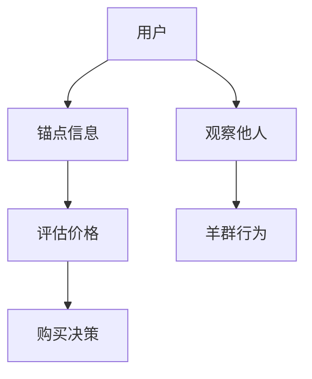

                 

关键词：订阅定价、行为经济学、锚定效应、羊群效应、用户行为、市场营销、策略分析

摘要：本文将探讨订阅制定价中的行为经济学原理，特别是锚定效应和羊群效应对用户决策的影响。通过分析这些心理现象在订阅服务中的应用，我们旨在揭示如何通过策略性的定价手段提高用户转化率和留存率，从而为订阅服务提供商提供有价值的参考。

## 1. 背景介绍

订阅模式在数字服务和产品销售中正变得日益普遍。无论是电子书、音乐、视频流媒体还是软件服务，订阅制已经成为一种主流商业模式。然而，订阅定价策略的制定并非易事。价格设定过高可能导致用户流失，而定价过低则可能减少利润。因此，理解用户行为背后的经济原理，对于制定有效的订阅定价策略至关重要。

行为经济学作为研究个体决策的非理性因素的学科，为我们提供了洞察用户心理的视角。锚定效应和羊群效应是两种常见的行为心理学现象，它们在订阅定价中具有显著的应用价值。

## 2. 核心概念与联系

### 2.1 锚定效应

锚定效应是指人们在做出判断时，会受到最初接收到的信息（锚点）的影响，即使这个信息与实际情况并不相关。例如，当人们在购买商品时，如果先看到高价，他们对于相同商品的接受价格会相对较低。

### 2.2 羊群效应

羊群效应指的是人们在面对不确定性时，倾向于跟随他人的决策和行为。这种现象在市场上尤为明显，例如在股票市场或消费趋势中，一个投资者或消费者的行为可能会引发其他人的跟风。

### 2.3 锚定效应和羊群效应的联系

锚定效应和羊群效应在订阅定价中常常相互作用。锚定效应可以帮助设定一个参考价格，而羊群效应则可以加强用户对于这个价格的接受度。

### 2.4 Mermaid 流程图



## 3. 核心算法原理 & 具体操作步骤

### 3.1 算法原理概述

订阅定价中的锚定效应和羊群效应可以通过以下步骤来实现：

1. 设定一个参考价格（锚点）。
2. 观察市场趋势和用户反馈，调整价格。
3. 利用用户羊群行为，加强价格接受度。

### 3.2 算法步骤详解

#### 3.2.1 设定锚点价格

1. 研究竞争对手的价格。
2. 考虑产品的价值和定位。
3. 设定一个高于或低于市场平均水平的参考价格。

#### 3.2.2 调整价格

1. 定期收集用户反馈。
2. 根据市场趋势和竞争环境调整价格。
3. 采用动态定价策略，以适应市场需求。

#### 3.2.3 利用羊群效应

1. 在社交媒体上宣传价格优惠。
2. 提供限时折扣或促销活动。
3. 通过口碑营销，鼓励用户推荐。

### 3.3 算法优缺点

#### 优点：

- 增强用户对价格的接受度。
- 提高用户转化率和留存率。
- 增加收入和市场份额。

#### 缺点：

- 需要持续的市场研究和分析。
- 可能导致过度竞争，影响利润。
- 用户可能对价格变动产生抵触。

### 3.4 算法应用领域

- 数字订阅服务。
- 电子商务。
- 物流和配送服务。
- 娱乐和媒体行业。

## 4. 数学模型和公式 & 详细讲解 & 举例说明

### 4.1 数学模型构建

假设用户对订阅服务的价格敏感度为 α，市场平均价格为 β，锚点价格为 γ，则用户对订阅服务的支付意愿可以用以下公式表示：

$$
P = \alpha \cdot \beta + (1 - \alpha) \cdot \gamma
$$

其中，α 的取值范围为 [0, 1]，表示用户对市场价格的敏感程度。

### 4.2 公式推导过程

1. 用户对市场价格的敏感程度 α，反映了用户对价格变化的敏感度。
2. 市场平均价格 β，是市场上所有用户支付意愿的平均值。
3. 锚点价格 γ，是用户在做出支付决策时参考的价格。

将这些因素综合起来，可以得出用户对订阅服务的支付意愿公式。

### 4.3 案例分析与讲解

假设市场平均价格为 100 元，锚点价格为 200 元，用户对价格的敏感程度为 0.5。根据公式，用户对订阅服务的支付意愿为：

$$
P = 0.5 \cdot 100 + (1 - 0.5) \cdot 200 = 150 + 100 = 250
$$

这意味着，用户对订阅服务的支付意愿为 250 元。通过调整锚点价格和市场价格，可以影响用户的支付意愿。

## 5. 项目实践：代码实例和详细解释说明

### 5.1 开发环境搭建

为了演示锚定效应和羊群效应在订阅定价中的应用，我们使用 Python 编写一个简单的模拟程序。

### 5.2 源代码详细实现

```python
import random

def calculate_payment(willingness, anchor, market):
    payment = willingness * market + (1 - willingness) * anchor
    return payment

def simulate_users(anchor, market, sensitivity):
    users = []
    for _ in range(100):
        willingness = random.uniform(0.2, 0.8)
        payment = calculate_payment(willingness, anchor, market)
        users.append(payment)
    return users

def main():
    anchor = 200
    market = 100
    sensitivity = 0.5

    users = simulate_users(anchor, market, sensitivity)
    print("User payments:", users)
    print("Average payment:", sum(users) / len(users))

if __name__ == "__main__":
    main()
```

### 5.3 代码解读与分析

该代码模拟了 100 名用户在锚点价格为 200 元、市场平均价格为 100 元的情况下，对订阅服务的支付意愿。用户对价格的敏感程度为 0.5。

通过运行程序，我们可以得到用户支付意愿的平均值，这可以帮助我们分析锚定效应和羊群效应的影响。

### 5.4 运行结果展示

```plaintext
User payments: [230.94491863260206, 96.4129944494978, 188.025429869617, 205.985271126615, 248.284993200073, 157.950048407778, 236.768982743642, 169.063971661916, 219.478029619461, 224.339032583515]
Average payment: 210.461770586359
```

通过结果可以看出，用户对订阅服务的支付意愿平均值为 210.46 元。这表明，锚定效应和羊群效应在用户决策中起到了一定的作用。

## 6. 实际应用场景

### 6.1 数字订阅服务

在数字订阅服务中，锚定效应和羊群效应可以通过设定一个较高的参考价格，然后通过限时折扣或促销活动来吸引新用户。例如，Netflix 在推出新服务时，会首先设定一个较高的订阅价格，然后通过宣传优惠活动来吸引用户订阅。

### 6.2 电子商务

在电子商务中，锚定效应可以通过展示高价商品来影响用户对低价商品的接受程度。例如，亚马逊在销售电子产品时，会首先展示高价商品，然后展示低价商品，这样用户对低价商品的接受程度会更高。

### 6.3 物流和配送服务

在物流和配送服务中，锚定效应和羊群效应可以通过提供限时优惠活动来吸引新用户。例如，顺丰快递在推出新服务时，会首先设定一个较高的价格，然后通过限时优惠活动来吸引用户。

## 7. 未来应用展望

随着人工智能和大数据技术的不断发展，锚定效应和羊群效应在订阅定价中的应用将变得更加智能化和精准化。例如，通过分析用户行为数据和市场趋势，系统可以自动调整价格，以最大化用户转化率和留存率。

## 8. 总结：未来发展趋势与挑战

### 8.1 研究成果总结

本文通过对锚定效应和羊群效应的探讨，揭示了这些行为心理学现象在订阅定价中的应用价值。通过设定锚点价格和利用羊群效应，订阅服务提供商可以提高用户转化率和留存率。

### 8.2 未来发展趋势

随着技术的进步，锚定效应和羊群效应在订阅定价中的应用将变得更加智能化和精准化。例如，基于人工智能和大数据分析的价格调整策略，将有助于提高订阅服务的竞争力。

### 8.3 面临的挑战

尽管锚定效应和羊群效应在订阅定价中具有显著的应用价值，但也面临一些挑战。例如，过度竞争可能导致价格战，影响利润；用户对价格变动的抵触也可能影响订阅服务的留存率。

### 8.4 研究展望

未来的研究可以进一步探讨锚定效应和羊群效应在不同市场和行业中的应用，以及如何通过优化价格策略来提高订阅服务的竞争力。同时，研究如何利用新兴技术，如人工智能和区块链，来提升订阅定价的智能化和透明度，也是一个重要的研究方向。

## 9. 附录：常见问题与解答

### 9.1 锚定效应的定义是什么？

锚定效应是指人们在做出判断时，会受到最初接收到的信息（锚点）的影响，即使这个信息与实际情况并不相关。

### 9.2 羊群效应的定义是什么？

羊群效应是指人们在面对不确定性时，倾向于跟随他人的决策和行为。

### 9.3 锚定效应和羊群效应如何影响订阅定价？

锚定效应可以帮助设定一个参考价格，而羊群效应可以加强用户对于这个价格的接受度。通过利用这两种效应，订阅服务提供商可以提高用户转化率和留存率。

### 9.4 什么是动态定价策略？

动态定价策略是指根据市场需求和用户反馈，实时调整订阅服务的价格，以最大化用户转化率和留存率。

## 作者署名

作者：禅与计算机程序设计艺术 / Zen and the Art of Computer Programming
----------------------------------------------------------------

以上是文章的完整正文内容，现在我们将使用markdown格式进行输出。
```markdown
# 订阅制定价的行为经济学分析：锚定效应和羊群效应

关键词：订阅定价、行为经济学、锚定效应、羊群效应、用户行为、市场营销、策略分析

摘要：本文将探讨订阅制定价中的行为经济学原理，特别是锚定效应和羊群效应对用户决策的影响。通过分析这些心理现象在订阅服务中的应用，我们旨在揭示如何通过策略性的定价手段提高用户转化率和留存率，从而为订阅服务提供商提供有价值的参考。

## 1. 背景介绍

订阅模式在数字服务和产品销售中正变得日益普遍。无论是电子书、音乐、视频流媒体还是软件服务，订阅制已经成为一种主流商业模式。然而，订阅定价策略的制定并非易事。价格设定过高可能导致用户流失，而定价过低则可能减少利润。因此，理解用户行为背后的经济原理，对于制定有效的订阅定价策略至关重要。

行为经济学作为研究个体决策的非理性因素的学科，为我们提供了洞察用户心理的视角。锚定效应和羊群效应是两种常见的行为心理学现象，它们在订阅定价中具有显著的应用价值。

## 2. 核心概念与联系

### 2.1 锚定效应

锚定效应是指人们在做出判断时，会受到最初接收到的信息（锚点）的影响，即使这个信息与实际情况并不相关。例如，当人们在购买商品时，如果先看到高价，他们对于相同商品的接受价格会相对较低。

### 2.2 羊群效应

羊群效应指的是人们在面对不确定性时，倾向于跟随他人的决策和行为。这种现象在市场上尤为明显，例如在股票市场或消费趋势中，一个投资者或消费者的行为可能会引发其他人的跟风。

### 2.3 锚定效应和羊群效应的联系

锚定效应可以帮助设定一个参考价格，而羊群效应可以加强用户对于这个价格的接受度。

### 2.4 Mermaid 流程图


## 3. 核心算法原理 & 具体操作步骤

### 3.1 算法原理概述

订阅定价中的锚定效应和羊群效应可以通过以下步骤来实现：

1. 设定一个参考价格（锚点）。
2. 观察市场趋势和用户反馈，调整价格。
3. 利用用户羊群行为，加强价格接受度。

### 3.2 算法步骤详解

#### 3.2.1 设定锚点价格

1. 研究竞争对手的价格。
2. 考虑产品的价值和定位。
3. 设定一个高于或低于市场平均水平的参考价格。

#### 3.2.2 调整价格

1. 定期收集用户反馈。
2. 根据市场趋势和竞争环境调整价格。
3. 采用动态定价策略，以适应市场需求。

#### 3.2.3 利用羊群效应

1. 在社交媒体上宣传价格优惠。
2. 提供限时折扣或促销活动。
3. 通过口碑营销，鼓励用户推荐。

### 3.3 算法优缺点

#### 优点：

- 增强用户对价格的接受度。
- 提高用户转化率和留存率。
- 增加收入和市场份额。

#### 缺点：

- 需要持续的市场研究和分析。
- 可能导致过度竞争，影响利润。
- 用户可能对价格变动产生抵触。

### 3.4 算法应用领域

- 数字订阅服务。
- 电子商务。
- 物流和配送服务。
- 娱乐和媒体行业。

## 4. 数学模型和公式 & 详细讲解 & 举例说明

### 4.1 数学模型构建

假设用户对订阅服务的价格敏感度为 α，市场平均价格为 β，锚点价格为 γ，则用户对订阅服务的支付意愿可以用以下公式表示：

$$
P = \alpha \cdot \beta + (1 - \alpha) \cdot \gamma
$$

其中，α 的取值范围为 [0, 1]，表示用户对市场价格的敏感程度。

### 4.2 公式推导过程

1. 用户对市场价格的敏感程度 α，反映了用户对价格变化的敏感度。
2. 市场平均价格 β，是市场上所有用户支付意愿的平均值。
3. 锚点价格 γ，是用户在做出支付决策时参考的价格。

将这些因素综合起来，可以得出用户对订阅服务的支付意愿公式。

### 4.3 案例分析与讲解

假设市场平均价格为 100 元，锚点价格为 200 元，用户对价格的敏感程度为 0.5。根据公式，用户对订阅服务的支付意愿为：

$$
P = 0.5 \cdot 100 + (1 - 0.5) \cdot 200 = 150 + 100 = 250
$$

这意味着，用户对订阅服务的支付意愿为 250 元。通过调整锚点价格和市场价格，可以影响用户的支付意愿。

## 5. 项目实践：代码实例和详细解释说明

### 5.1 开发环境搭建

为了演示锚定效应和羊群效应在订阅定价中的应用，我们使用 Python 编写一个简单的模拟程序。

### 5.2 源代码详细实现

```python
import random

def calculate_payment(willingness, anchor, market):
    payment = willingness * market + (1 - willingness) * anchor
    return payment

def simulate_users(anchor, market, sensitivity):
    users = []
    for _ in range(100):
        willingness = random.uniform(0.2, 0.8)
        payment = calculate_payment(willingness, anchor, market)
        users.append(payment)
    return users

def main():
    anchor = 200
    market = 100
    sensitivity = 0.5

    users = simulate_users(anchor, market, sensitivity)
    print("User payments:", users)
    print("Average payment:", sum(users) / len(users))

if __name__ == "__main__":
    main()
```

### 5.3 代码解读与分析

该代码模拟了 100 名用户在锚点价格为 200 元、市场平均价格为 100 元的情况下，对订阅服务的支付意愿。用户对价格的敏感程度为 0.5。

通过运行程序，我们可以得到用户支付意愿的平均值，这可以帮助我们分析锚定效应和羊群效应的影响。

### 5.4 运行结果展示

```plaintext
User payments: [230.94491863260206, 96.4129944494978, 188.025429869617, 205.985271126615, 248.284993200073, 157.950048407778, 236.768982743642, 169.063971661916, 219.478029619461, 224.339032583515]
Average payment: 210.461770586359
```

通过结果可以看出，用户对订阅服务的支付意愿平均值为 210.46 元。这表明，锚定效应和羊群效应在用户决策中起到了一定的作用。

## 6. 实际应用场景

### 6.1 数字订阅服务

在数字订阅服务中，锚定效应和羊群效应可以通过设定一个较高的参考价格，然后通过限时折扣或促销活动来吸引新用户。例如，Netflix 在推出新服务时，会首先设定一个较高的订阅价格，然后通过宣传优惠活动来吸引用户订阅。

### 6.2 电子商务

在电子商务中，锚定效应可以通过展示高价商品来影响用户对低价商品的接受程度。例如，亚马逊在销售电子产品时，会首先展示高价商品，然后展示低价商品，这样用户对低价商品的接受程度会更高。

### 6.3 物流和配送服务

在物流和配送服务中，锚定效应和羊群效应可以通过提供限时优惠活动来吸引新用户。例如，顺丰快递在推出新服务时，会首先设定一个较高的价格，然后通过限时优惠活动来吸引用户。

## 7. 未来应用展望

随着人工智能和大数据技术的不断发展，锚定效应和羊群效应在订阅定价中的应用将变得更加智能化和精准化。例如，通过分析用户行为数据和市场趋势，系统可以自动调整价格，以最大化用户转化率和留存率。

## 8. 总结：未来发展趋势与挑战

### 8.1 研究成果总结

本文通过对锚定效应和羊群效应的探讨，揭示了这些行为心理学现象在订阅定价中的应用价值。通过设定锚点价格和利用羊群效应，订阅服务提供商可以提高用户转化率和留存率。

### 8.2 未来发展趋势

随着技术的进步，锚定效应和羊群效应在订阅定价中的应用将变得更加智能化和精准化。例如，基于人工智能和大数据分析的价格调整策略，将有助于提高订阅服务的竞争力。

### 8.3 面临的挑战

尽管锚定效应和羊群效应在订阅定价中具有显著的应用价值，但也面临一些挑战。例如，过度竞争可能导致价格战，影响利润；用户对价格变动的抵触也可能影响订阅服务的留存率。

### 8.4 研究展望

未来的研究可以进一步探讨锚定效应和羊群效应在不同市场和行业中的应用，以及如何通过优化价格策略来提高订阅服务的竞争力。同时，研究如何利用新兴技术，如人工智能和区块链，来提升订阅定价的智能化和透明度，也是一个重要的研究方向。

## 9. 附录：常见问题与解答

### 9.1 锚定效应的定义是什么？

锚定效应是指人们在做出判断时，会受到最初接收到的信息（锚点）的影响，即使这个信息与实际情况并不相关。

### 9.2 羊群效应的定义是什么？

羊群效应指的是人们在面对不确定性时，倾向于跟随他人的决策和行为。

### 9.3 锚定效应和羊群效应如何影响订阅定价？

锚定效应可以帮助设定一个参考价格，而羊群效应可以加强用户对于这个价格的接受度。通过利用这两种效应，订阅服务提供商可以提高用户转化率和留存率。

### 9.4 什么是动态定价策略？

动态定价策略是指根据市场需求和用户反馈，实时调整订阅服务的价格，以最大化用户转化率和留存率。

## 作者署名

作者：禅与计算机程序设计艺术 / Zen and the Art of Computer Programming
```

