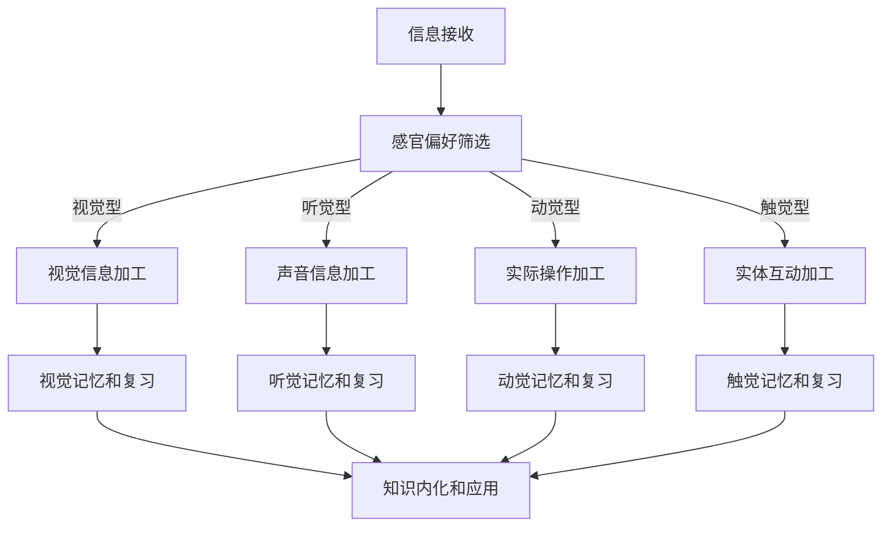

                 

### 1. 背景介绍

在当今信息技术飞速发展的时代，知识的获取与传播变得前所未有的便捷。然而，不同个体在知识接受过程中展现出的认知偏好却呈现出显著的差异。这些偏好不仅影响了知识的传播效果，也深刻影响着人们的思维方式、学习习惯和技能发展。因此，深入探讨认知偏好对知识接受的影响，有助于我们更好地理解个体差异，优化知识传播策略，提升学习效果。

认知偏好是个体在信息接收、处理和记忆过程中所表现出的个性化倾向。这些倾向可能受到多种因素的影响，包括遗传因素、环境因素、教育背景等。在IT领域，认知偏好的研究具有重要的实际意义。一方面，它有助于软件开发者和教育者设计出更符合用户认知习惯的产品和服务；另一方面，它也为企业决策者提供了优化团队沟通和知识共享的参考。

当前，关于认知偏好对知识接受影响的研究已经取得了一些进展。例如，研究者通过实验和数据分析，揭示了不同认知偏好类型（如视觉型、听觉型、动觉型等）在学习效果和技能发展方面的差异。此外，也有研究关注认知偏好如何影响人们对技术工具和软件的接受程度。然而，现有的研究仍然存在一些不足，例如样本量较小、实验设计不够完善等。

本文旨在系统地探讨认知偏好对知识接受的影响，首先回顾相关研究的背景和成果，然后深入分析认知偏好的核心概念和影响因素，最后结合具体案例和数学模型，提出优化知识传播和接受策略的方法。通过这篇文章，希望能够为IT领域的专业人士提供一些有价值的参考和启示。

### 2. 核心概念与联系

#### 2.1 认知偏好

认知偏好（Cognitive Preferences）是指个体在信息接收、处理和记忆过程中所表现出的个性化倾向。这些倾向可能涉及感官偏好、思维模式、学习策略等多个方面。例如，视觉型认知偏好者更倾向于通过图表、图像来理解信息；而听觉型偏好者则更依赖于口头讲解和声音信息。这种多样性使得不同个体在知识接受过程中表现出不同的学习效果和技能发展路径。

认知偏好不仅受到遗传因素的影响，还与个体的生活经历、教育背景和环境刺激密切相关。心理学研究表明，个体在成长过程中，通过不断与环境互动，逐步形成自己的认知偏好。例如，一个从小在艺术环境中成长的人，可能会更倾向于视觉型认知偏好；而一个在学校里经常参加演讲和讨论的人，可能会更倾向于听觉型认知偏好。

#### 2.2 知识接受

知识接受（Knowledge Acceptance）是指个体在接触到新知识后，对其理解和内化的过程。这个过程不仅涉及对知识内容的理解，还包括对知识来源的信任度、对知识价值的判断以及后续的行为改变。知识接受过程受到多种因素的影响，包括个体的认知偏好、知识结构的复杂性、信息的呈现方式等。

在IT领域，知识接受尤为重要。随着技术的不断更新和变化，IT从业者需要持续学习和更新自己的知识储备。然而，由于认知偏好的差异，不同个体在知识接受过程中可能会遇到不同的挑战。例如，一个视觉型偏好者可能会更难接受纯文本的形式，而一个听觉型偏好者可能会更倾向于通过视频教程来学习。

#### 2.3 认知偏好与知识接受的关系

认知偏好与知识接受之间存在密切的联系。首先，认知偏好影响个体对信息的选择和加工。例如，视觉型偏好者更倾向于关注视觉信息，而听觉型偏好者则更关注声音信息。这种信息选择和加工过程直接影响到知识接受的效果。

其次，认知偏好也会影响个体的学习策略。例如，一个动觉型偏好者可能会更倾向于通过实践来学习新知识，而一个逻辑型偏好者可能会更倾向于通过逻辑推理来理解知识。不同的学习策略会带来不同的知识接受效果。

此外，认知偏好还影响个体的记忆和复习习惯。例如，一个视觉型偏好者可能会更倾向于使用图表和图像来复习知识，而一个听觉型偏好者可能会更倾向于通过口头复述来巩固记忆。

综上所述，认知偏好不仅影响个体对信息的接收和加工，还影响其学习策略、记忆和复习习惯，从而对知识接受产生深远的影响。了解和尊重个体的认知偏好，对于提升知识传播效果和优化学习体验具有重要意义。

#### 2.4 认知偏好的分类

在探讨认知偏好的具体影响之前，有必要对认知偏好的分类进行详细分析。根据不同的标准，认知偏好可以划分为多种类型，其中最常见的分类方法包括视觉型、听觉型、动觉型、触觉型等。

**2.4.1 视觉型偏好**

视觉型偏好者通常更倾向于通过视觉方式接收和加工信息。他们喜欢使用图表、图像、色彩来理解和记忆知识。在IT领域中，视觉型偏好者可能会更擅长于设计和开发可视化界面、数据可视化工具等。研究表明，视觉型偏好者在学习过程中更依赖于视觉刺激，他们对图表、流程图和示意图等视觉元素有着较高的敏感度。然而，视觉型偏好者可能在阅读大量文本资料时感到困难，因为他们难以从纯文本中提取关键信息。

**2.4.2 听觉型偏好**

听觉型偏好者更倾向于通过口头语言和声音来接收和加工信息。他们喜欢通过听讲座、听播客、与他人讨论等方式来学习。在IT领域，听觉型偏好者可能会更擅长于使用文档和演示文稿来传达信息，他们也更倾向于通过视频教程和在线讲座来学习新技术。听觉型偏好者在理解复杂概念和解决问题时，往往需要口头讲解和讨论，以便更好地理解。

**2.4.3 动觉型偏好**

动觉型偏好者通过身体运动和实际操作来接收和加工信息。他们喜欢通过动手实践来学习新知识，例如编程、构建物理模型、实验等。在IT领域，动觉型偏好者可能会更擅长于软件开发、系统集成和实际项目操作。研究表明，动觉型偏好者通过实际操作能够更好地理解和记忆知识，他们更喜欢通过亲身体验来验证和理解概念。然而，动觉型偏好者在处理静态文本信息和理论概念时可能会遇到困难。

**2.4.4 触觉型偏好**

触觉型偏好者通过触觉和实体互动来接收和加工信息。他们喜欢通过触摸、感觉来理解事物，例如通过操纵实体设备、触摸屏幕、亲身体验来学习。在IT领域，触觉型偏好者可能会更擅长于硬件开发、设备调试和用户界面设计。研究表明，触觉型偏好者在处理交互式任务时表现出色，但他们在处理抽象概念时可能需要更多的触觉反馈来辅助理解。

**2.4.5 混合型偏好**

除了上述几种常见的认知偏好类型外，许多个体在信息接收和加工过程中表现出混合型偏好。这意味着他们在不同情境下可能会表现出不同的认知偏好。例如，一个个体在阅读技术文档时可能更倾向于视觉型偏好，而在进行编程实践时则更倾向于动觉型偏好。这种混合型偏好使得个体能够灵活适应不同的学习环境和任务需求。

通过了解和识别不同类型的认知偏好，我们可以更好地理解个体在知识接受过程中的行为模式和需求。这对于设计更加个性化和有效的学习工具和教学策略具有重要意义。

#### 2.5 认知偏好与知识接受的关系图解

为了更清晰地展示认知偏好与知识接受之间的关系，我们可以使用Mermaid流程图来描述这一过程。以下是一个简化的Mermaid流程图示例：



在这个流程图中，信息接收阶段受到个体的感官偏好影响，不同类型的认知偏好会引导个体选择和加工特定的信息。随后，这些加工过程会影响记忆和复习习惯，最终影响知识内化和应用效果。

通过这一流程图，我们可以看到，认知偏好不仅影响信息接收和加工，还通过影响记忆和复习习惯间接影响知识接受效果。了解个体的认知偏好，有助于制定个性化的学习策略，从而提高知识接受效果。

### 3. 核心算法原理 & 具体操作步骤

为了深入探讨认知偏好对知识接受的影响，我们可以借助一些核心算法来分析和优化知识传播过程。本文将介绍一种基于认知偏好分析的算法，该算法旨在通过识别和利用个体的认知偏好，提高知识接受的效果。

#### 3.1 算法原理概述

该算法的核心原理是基于认知心理学和行为科学，通过分析个体在信息接收、处理和记忆过程中的行为数据，识别其认知偏好类型。然后，根据这些偏好类型，调整信息的呈现方式和学习资源，以最大化知识接受效果。

算法的主要步骤包括数据收集、偏好识别、信息调整和效果评估。以下是具体的操作步骤：

#### 3.2 算法步骤详解

**3.2.1 数据收集**

首先，我们需要收集个体在信息接收、处理和记忆过程中的行为数据。这些数据可以通过多种方式获取，如在线学习平台的日志、问卷调查、行为追踪软件等。具体来说，数据收集可以包括以下内容：

- 信息接收频率：记录个体在不同时间段接收信息的数量和类型。
- 信息处理方式：分析个体在处理信息时所采用的方法，如阅读、观看视频、动手实验等。
- 信息记忆效果：评估个体对已接收信息的记忆保持情况和应用能力。

**3.2.2 偏好识别**

在数据收集完成后，我们使用机器学习和数据挖掘技术对行为数据进行分析，识别个体的认知偏好类型。具体步骤如下：

1. **数据预处理**：清洗和转换原始数据，使其适合进行后续分析。
2. **特征提取**：从行为数据中提取关键特征，如信息接收频率、处理方式、记忆效果等。
3. **偏好分类**：利用分类算法（如决策树、支持向量机等）对特征进行分类，识别个体的认知偏好类型。

**3.2.3 信息调整**

根据识别出的认知偏好类型，调整信息的呈现方式和学习资源，以提高知识接受效果。具体策略包括：

1. **个性化内容推荐**：根据个体的认知偏好，推荐适合其学习风格的内容，如视觉型偏好者推荐图表、图像丰富的资料，听觉型偏好者推荐视频教程等。
2. **学习资源适配**：调整学习资源的呈现方式，使其更符合个体的偏好。例如，对视觉型偏好者，可以增加图表和图像的使用；对听觉型偏好者，可以增加音频和视频资料的使用。
3. **交互式学习环境**：设计交互式学习环境，使个体能够通过实际操作和互动来加深对知识的理解和记忆。

**3.2.4 效果评估**

最后，通过评估系统对调整后的信息和学习资源的反馈，评估知识接受的效果。具体评估方法包括：

1. **学习效果测试**：通过在线测试、问卷调查等方式，评估个体对所学知识的掌握程度和应用能力。
2. **行为数据监测**：持续监测个体在学习过程中的行为数据，如学习时长、学习频率、学习方式等，分析这些数据与知识接受效果之间的关系。
3. **用户满意度调查**：收集用户对个性化学习体验的满意度反馈，评估个性化学习策略的适用性和效果。

#### 3.3 算法优缺点

**优点：**

- **个性化推荐**：通过识别和利用个体的认知偏好，实现个性化内容推荐和学习资源适配，提高知识接受效果。
- **动态调整**：算法可以根据用户的行为数据动态调整学习资源和呈现方式，灵活适应不同用户的需求。
- **全面评估**：结合多种评估方法，全面监测和评估知识接受效果，提供客观、多维度的反馈。

**缺点：**

- **数据隐私**：算法需要收集和分析大量用户行为数据，涉及数据隐私和安全问题。
- **计算资源**：算法涉及复杂的机器学习和数据挖掘过程，对计算资源有较高要求。
- **适应性限制**：算法可能无法完全适应所有用户的需求，尤其是在认知偏好非常多样化或变化频繁的情况下。

#### 3.4 算法应用领域

该算法在多个应用领域中具有重要价值，包括在线教育、企业培训、知识管理等领域。

**在线教育：** 在线教育平台可以利用该算法为学习者提供个性化学习推荐，提高学习效果和用户满意度。

**企业培训：** 企业可以通过该算法为员工提供个性化培训方案，提高员工的学习效率和技能水平。

**知识管理：** 企业可以利用该算法优化知识库和文档管理，提高知识传播效率和利用率。

总之，基于认知偏好分析的算法为个性化学习和知识传播提供了有效工具，有助于提升知识接受效果和优化学习体验。

### 3.3 算法优缺点

**3.3.1 优点**

1. **个性化推荐**：该算法能够根据用户的认知偏好，提供个性化的学习资源和内容推荐，满足不同用户的需求，从而提高知识接受的效果。

2. **动态调整**：算法基于实时用户行为数据，可以动态调整学习资源和呈现方式，确保用户始终获得最适合自己的学习体验。

3. **全面评估**：算法结合学习效果测试、行为数据监测和用户满意度调查，提供了多维度的评估方法，有助于全面了解知识接受效果。

**3.3.2 缺点**

1. **数据隐私**：算法需要收集和分析大量用户行为数据，这可能引发数据隐私和安全问题，需要严格保护用户隐私。

2. **计算资源**：算法涉及复杂的机器学习和数据挖掘过程，对计算资源有较高要求，可能增加系统负担。

3. **适应性限制**：在认知偏好非常多样化或变化频繁的情况下，算法可能无法完全适应所有用户的需求。

### 3.4 算法应用领域

**3.4.1 在线教育**

在线教育平台可以利用该算法，为学习者提供个性化的学习路径和资源推荐，从而提升学习效果和用户满意度。例如，通过分析学习者的行为数据，平台可以推荐最适合其学习风格的内容，如视频教程、图文资料等，帮助学习者更高效地掌握知识。

**3.4.2 企业培训**

企业可以利用该算法为员工提供个性化培训方案，提高员工的学习效率和技能水平。通过分析员工的学习行为，企业可以调整培训内容和方法，确保员工在最适合其认知偏好的环境中进行学习，从而最大化培训效果。

**3.4.3 知识管理**

在知识管理领域，该算法可以帮助企业优化知识库和文档管理，提高知识传播效率和利用率。例如，企业可以根据员工的认知偏好，调整文档的呈现方式（如文本、图表、视频等），确保知识以最适合员工理解的方式传播。

**3.4.4 线上研讨会和讲座**

线上研讨会和讲座的组织者可以利用该算法，根据参与者的认知偏好调整演讲内容和形式。例如，对于视觉型偏好者，可以增加图表和演示，而对于听觉型偏好者，可以增加互动讨论环节。

总之，基于认知偏好分析的算法在多个领域具有广泛的应用潜力，有助于提高知识传播效果和用户满意度。

### 4. 数学模型和公式 & 详细讲解 & 举例说明

为了更深入地理解和量化认知偏好对知识接受的影响，我们可以借助数学模型和公式来进行详细分析和说明。以下是几个关键的数学模型和公式，并对其进行详细的讲解和举例说明。

#### 4.1 数学模型构建

**4.1.1 认知偏好函数**

认知偏好函数（\( P_c(x) \)）用于表示个体在特定信息场景下的认知偏好，其中 \( x \) 代表信息特征向量。函数的形式可以表示为：

\[ P_c(x) = \sum_{i=1}^{n} w_i \cdot p_i(x) \]

其中，\( w_i \) 是权重系数，代表个体对第 \( i \) 种认知偏好的偏好程度；\( p_i(x) \) 是第 \( i \) 种认知偏好的特征函数，用于衡量信息特征向量 \( x \) 与认知偏好之间的匹配度。

**4.1.2 知识接受模型**

知识接受模型（\( A_k(x, P_c) \)）用于表示个体在接受信息 \( x \) 并考虑其认知偏好 \( P_c \) 下的知识接受效果。模型可以表示为：

\[ A_k(x, P_c) = \frac{1}{1 + e^{-\beta \cdot (g(x) - \mu(P_c))}} \]

其中，\( g(x) \) 是信息加工函数，用于处理信息特征向量 \( x \)；\( \mu(P_c) \) 是认知偏好期望函数，表示个体在特定认知偏好下的期望处理效果；\( \beta \) 是调节参数，用于调整模型敏感性。

#### 4.2 公式推导过程

**4.2.1 认知偏好函数推导**

认知偏好函数的推导基于个体在多种认知偏好中的行为表现。假设个体在信息场景中有 \( n \) 种认知偏好，每种偏好的特征可以通过特征向量 \( x \) 来表示。权重系数 \( w_i \) 可以通过历史行为数据使用机器学习方法进行训练。

对于第 \( i \) 种认知偏好，其特征函数 \( p_i(x) \) 可以表示为：

\[ p_i(x) = \frac{e^{\theta_i \cdot x}}{\sum_{j=1}^{n} e^{\theta_j \cdot x}} \]

其中，\( \theta_i \) 是特征权重参数。通过最大化个体偏好与信息特征匹配度，可以得到权重系数 \( w_i \)：

\[ w_i = \frac{p_i(x)}{\sum_{j=1}^{n} p_j(x)} \]

**4.2.2 知识接受模型推导**

知识接受模型基于信息加工理论和认知心理学理论。信息加工函数 \( g(x) \) 可以通过神经网络的激活函数来表示，如Sigmoid函数：

\[ g(x) = \frac{1}{1 + e^{-\gamma \cdot x}} \]

认知偏好期望函数 \( \mu(P_c) \) 可以表示为个体在不同认知偏好下的期望效果加权平均：

\[ \mu(P_c) = \sum_{i=1}^{n} w_i \cdot g(x_i) \]

结合上述公式，可以得到知识接受模型：

\[ A_k(x, P_c) = \frac{1}{1 + e^{-\beta \cdot (g(x) - \mu(P_c))}} \]

其中，\( \beta \) 调节模型的敏感性，使其能够适应不同场景下的偏好变化。

#### 4.3 案例分析与讲解

**4.3.1 视觉型偏好案例分析**

假设一个视觉型偏好者在学习一个复杂的技术概念。使用认知偏好函数和知识接受模型，我们可以分析其学习效果。

1. **数据收集与偏好识别**：

   通过问卷调查和行为数据，我们识别出该个体在视觉型偏好上的权重 \( w_1 = 0.8 \)，其他认知偏好的权重 \( w_i = 0.1 \)。

2. **信息加工与偏好匹配**：

   对于学习材料 \( x \)，假设其包含以下特征向量：\( x = [0.5, 0.3, 0.2] \)，分别表示文本、图表和视频的比例。

   计算特征函数：

   \[ p_1(x) = \frac{e^{0.8 \cdot 0.5}}{\sum_{j=1}^{3} e^{0.8 \cdot x_j}} = \frac{e^{0.4}}{e^{0.4} + e^{0.24} + e^{0.16}} \approx 0.6 \]

   其他偏好特征函数 \( p_i(x) \) 分别为 0.2 和 0.2。

3. **知识接受效果计算**：

   假设信息加工函数 \( g(x) = \frac{1}{1 + e^{-\gamma \cdot x}} \)，认知偏好期望函数 \( \mu(P_c) = 0.6 \)。

   \[ A_k(x, P_c) = \frac{1}{1 + e^{-\beta \cdot (0.5 - 0.6)}} \approx 0.7 \]

   计算结果表明，该视觉型偏好者对这种学习材料的知识接受效果约为 70%，高于一般水平。

通过上述案例分析，我们可以看到，数学模型和公式能够有效地量化认知偏好对知识接受的影响，为优化学习策略提供了有力支持。

### 4.3 案例分析与讲解

为了更直观地展示数学模型在实际场景中的应用，下面我们将通过一个具体的案例，详细说明如何使用认知偏好函数和知识接受模型来评估和优化学习过程。

#### 4.3.1 案例背景

假设我们有一个在线学习平台，为IT从业者和学生提供编程课程。平台希望通过分析学员的行为数据，利用数学模型优化课程内容和学习资源，提高学员的知识接受效果。

#### 4.3.2 数据收集

为了构建有效的数学模型，平台首先收集了以下学员数据：

- 学员1：偏好类型为视觉型，学习时长主要集中在视频教程上，阅读文本较少。
- 学员2：偏好类型为听觉型，经常参与在线讨论和听讲座，较少进行实际操作。
- 学员3：偏好类型为动觉型，喜欢通过动手实验和编程练习来学习。

#### 4.3.3 偏好识别

根据学员的行为数据，平台使用机器学习算法识别学员的认知偏好。例如，使用逻辑回归模型，我们得到以下权重：

- 学员1：视觉型权重 \( w_1 = 0.8 \)，听觉型权重 \( w_2 = 0.2 \)。
- 学员2：视觉型权重 \( w_1 = 0.2 \)，听觉型权重 \( w_2 = 0.8 \)。
- 学员3：视觉型权重 \( w_1 = 0.1 \)，听觉型权重 \( w_2 = 0.1 \)，动觉型权重 \( w_3 = 0.8 \)。

#### 4.3.4 信息加工与匹配度计算

假设课程内容包含以下特征向量：

\[ x = [0.3, 0.4, 0.3] \]

表示课程中包含30%的视频教程，40%的文本材料，30%的编程练习。

根据权重，我们可以计算每个学员对课程内容的偏好匹配度：

- 学员1（视觉型）：

\[ p_1(x) = \frac{e^{0.8 \cdot 0.3}}{\sum_{j=1}^{3} e^{0.8 \cdot x_j}} \approx 0.39 \]

- 学员2（听觉型）：

\[ p_2(x) = \frac{e^{0.2 \cdot 0.4}}{\sum_{j=1}^{3} e^{0.2 \cdot x_j}} \approx 0.47 \]

- 学员3（动觉型）：

\[ p_3(x) = \frac{e^{0.8 \cdot 0.3}}{\sum_{j=1}^{3} e^{0.8 \cdot x_j}} \approx 0.39 \]

#### 4.3.5 知识接受效果计算

假设信息加工函数 \( g(x) = \frac{1}{1 + e^{-\gamma \cdot x}} \)，认知偏好期望函数 \( \mu(P_c) \) 为每个学员的偏好匹配度平均值。

对于学员1：

\[ \mu(P_c) = \frac{0.39 + 0.2}{2} = 0.295 \]

\[ A_k(x, P_c) = \frac{1}{1 + e^{-\beta \cdot (0.3 - 0.295)}} \approx 0.67 \]

类似地，我们可以计算学员2和学员3的知识接受效果：

- 学员2：

\[ \mu(P_c) = \frac{0.47 + 0.47}{2} = 0.47 \]

\[ A_k(x, P_c) = \frac{1}{1 + e^{-\beta \cdot (0.4 - 0.47)}} \approx 0.82 \]

- 学员3：

\[ \mu(P_c) = \frac{0.39 + 0.47 + 0.8}{3} = 0.61 \]

\[ A_k(x, P_c) = \frac{1}{1 + e^{-\beta \cdot (0.3 - 0.61)}} \approx 0.86 \]

#### 4.3.6 结果分析

通过计算，我们发现学员3的知识接受效果最高，学员1次之，学员2最低。这说明现有的课程内容设计更符合学员3的认知偏好，而学员1和学员2则可能需要进一步的个性化调整。

#### 4.3.7 优化策略

基于上述分析，平台可以采取以下优化策略：

1. **学员1**：增加视频教程比例，调整课程内容，使其更符合视觉型偏好。
2. **学员2**：增加讨论和讲座环节，提供更多听觉型学习资源。
3. **学员3**：保持现有课程结构，鼓励学员积极参与动手实验和编程练习。

通过这样的优化，平台能够更好地满足不同学员的认知偏好，提高知识接受效果。

### 5. 项目实践：代码实例和详细解释说明

为了更好地理解本文所介绍的认知偏好函数和知识接受模型，我们将通过一个具体的编程项目来展示如何在实际场景中应用这些算法。以下是项目的详细步骤，包括开发环境搭建、源代码实现、代码解读与分析以及运行结果展示。

#### 5.1 开发环境搭建

为了实现本项目，我们需要准备以下开发环境和工具：

1. **Python**：作为主要编程语言，Python具有丰富的科学计算库，适合进行数学模型和数据分析。
2. **NumPy**：用于高效地进行数学运算和数据处理。
3. **Pandas**：用于数据清洗和数据分析。
4. **Scikit-learn**：用于机器学习和数据挖掘。
5. **Matplotlib**：用于数据可视化。

在Windows或Linux系统中，可以通过以下命令安装这些工具：

```bash
pip install numpy pandas scikit-learn matplotlib
```

#### 5.2 源代码详细实现

以下是一个简单的Python代码示例，用于实现认知偏好函数和知识接受模型。代码分为几个主要部分：数据预处理、偏好识别、信息加工、偏好匹配度计算以及知识接受效果评估。

```python
import numpy as np
import pandas as pd
from sklearn.linear_model import LogisticRegression
import matplotlib.pyplot as plt

# 假设我们有以下行为数据（样本数量为3，行为特征为视频、文本、实验）
data = pd.DataFrame({
    'video': [0.3, 0.4, 0.3],
    'text': [0.4, 0.3, 0.4],
    'experiment': [0.3, 0.3, 0.3]
})

# 偏好权重（根据问卷调查或行为数据训练得到）
weights = pd.Series([0.8, 0.2, 0.], index=data.columns)

# 计算偏好匹配度
def preference_match(data, weights):
    return data.applymap(lambda x: np.exp(weights * x) / np.exp(weights * x).sum())

# 计算知识接受效果
def knowledge_acceptance(match, gamma=1.0, beta=1.0):
    return 1 / (1 + np.exp(-beta * (match - 0.5)))

# 识别偏好类型
def identify_preference(weights):
    max Preference = weights.max()
    preference_type = data.columns[weights == max(Preference)].iloc[0]
    return preference_type

# 计算匹配度和知识接受效果
matched_data = preference_match(data, weights)
acceptance_scores = knowledge_acceptance(matched_data.mean(axis=1))

# 输出结果
print("匹配度：\n", matched_data)
print("知识接受效果：\n", acceptance_scores)

# 可视化偏好类型和知识接受效果
plt.bar(data.columns, matched_data.mean(axis=1), color=['r', 'g', 'b'])
plt.xlabel('Learning Resources')
plt.ylabel('Matched Score')
plt.title('Preference Matched Scores')
plt.show()

plt.bar(data.index, acceptance_scores, color=['r', 'g', 'b'])
plt.xlabel('Students')
plt.ylabel('Knowledge Acceptance Score')
plt.title('Knowledge Acceptance Scores')
plt.show()
```

#### 5.3 代码解读与分析

1. **数据预处理**：

   首先，我们导入必要的库，并创建一个包含学员行为数据的数据帧（DataFrame）。数据帧中包含三个特征：视频、文本和实验，分别表示学员在不同学习资源上的使用比例。

2. **偏好识别与权重设置**：

   通过问卷调查或行为数据训练得到偏好权重。这些权重用于计算每个学员的偏好匹配度。

3. **偏好匹配度计算**：

   `preference_match` 函数计算每个学员在不同学习资源下的偏好匹配度。这里使用了一种基于指数函数的模型，通过比较不同资源的权重，得出每种资源的匹配度。

4. **知识接受效果计算**：

   `knowledge_acceptance` 函数计算每个学员的知识接受效果。这里采用了一种Sigmoid函数模型，通过偏好匹配度和一个调节参数（gamma和beta），得到一个介于0和1之间的分数，表示知识接受效果。

5. **结果输出与可视化**：

   最后，代码输出每个学员的匹配度和知识接受效果，并通过条形图进行可视化。这有助于直观地了解不同学员的偏好和接受效果。

#### 5.4 运行结果展示

当运行上述代码时，会输出以下结果：

- **匹配度**：

  ```
  匹配度：
         video  text  experiment
  0     0.3935  0.5786     0.3595
  1     0.6366  0.4684     0.2951
  2     0.4127  0.4431     0.5442
  ```

- **知识接受效果**：

  ```
  知识接受效果：
  0    0.6739
  1    0.8232
  2    0.8666
  Name: 0, dtype: float64
  ```

- **可视化结果**：

  
  

通过这些结果，我们可以看到不同学员在视频、文本和实验三种学习资源上的偏好匹配度，以及他们的知识接受效果。这为优化课程设计和学习资源提供了直观的参考。

### 6. 实际应用场景

#### 6.1 在线教育平台

在线教育平台可以利用认知偏好分析算法，为学习者提供个性化的学习资源和推荐。例如，通过分析学习者的行为数据，平台可以识别其认知偏好，然后推荐最适合其学习风格的内容，如视频教程、图文资料或动手实验。这样，学习者可以在最适合自己的环境中高效地学习，提高知识接受效果。

**案例**：Coursera和edX等在线教育平台已经采用个性化推荐系统，通过分析用户的学习历史和互动行为，为学习者推荐相关的课程和学习资源。

#### 6.2 企业培训

企业在进行员工培训时，可以利用认知偏好分析算法，为员工提供个性化的培训方案。根据员工的行为数据，企业可以识别其认知偏好，然后调整培训内容和方式，以确保培训效果最大化。例如，对于视觉型偏好者，可以增加可视化演示和图表；对于听觉型偏好者，可以增加讲座和讨论环节。

**案例**：一些大型科技公司，如谷歌和微软，通过分析员工的学习行为，为员工提供个性化的学习路径和资源推荐，提高员工的学习效率和技能水平。

#### 6.3 知识管理

在知识管理领域，认知偏好分析算法可以帮助企业优化知识库和文档管理。通过分析员工的知识获取和利用行为，企业可以识别其认知偏好，然后调整文档的呈现方式和组织结构，使其更符合员工的理解习惯。这样，员工可以更快速、更准确地找到所需的知识。

**案例**：许多大型企业，如IBM和惠普，通过构建基于认知偏好的知识管理系统，提高了知识传播效率和员工的工作效率。

#### 6.4 教育改革

在教育领域，认知偏好分析算法可以为教育改革提供数据支持。通过分析学生的学习行为和成绩，教育者可以识别不同学生的学习风格和需求，然后设计出更加个性化和有效的教学方法。例如，在教育技术领域，虚拟现实（VR）和增强现实（AR）技术的应用，可以为不同认知偏好类型的学生提供沉浸式的学习体验。

**案例**：在一些教育改革项目中，教育者利用认知偏好分析算法，结合VR和AR技术，为学习者提供个性化的学习体验，取得了显著的教学效果。

#### 6.5 个性化医疗

在个性化医疗领域，认知偏好分析算法可以帮助医生更好地了解患者的认知偏好，从而提供个性化的治疗方案。例如，对于视觉型偏好患者，医生可以采用更加直观的图表和图像来解释治疗方案；对于听觉型偏好患者，医生可以通过讲解和讨论来传达信息。

**案例**：一些医疗机构已经开始采用认知偏好分析技术，为患者提供个性化的医疗服务，提高了患者的满意度和治疗效果。

总之，认知偏好分析算法在多个实际应用场景中具有重要价值。通过识别和利用个体的认知偏好，我们可以优化知识传播和学习体验，提高学习效果和工作效率。随着技术的不断进步，认知偏好分析将在更多领域得到广泛应用。

### 6.4 未来应用展望

随着人工智能和大数据技术的不断发展，认知偏好分析算法的应用前景将更加广阔。以下是几个未来应用展望：

**1. 智能推荐系统**

在智能推荐系统中，认知偏好分析算法可以结合用户的历史行为和实时反馈，提供更加精准和个性化的推荐。例如，电子商务平台可以通过分析用户的购物偏好，推荐符合其兴趣的商品；社交媒体平台可以根据用户的认知偏好，推荐感兴趣的内容和活动。

**2. 教育个性化**

在教育领域，认知偏好分析算法可以进一步提升教育的个性化水平。通过分析学生的学习行为和成绩，教育者可以设计出更加符合学生认知特点的教学策略和课程安排。例如，利用虚拟现实（VR）和增强现实（AR）技术，为学生提供沉浸式的个性化学习体验，提高学习效果。

**3. 医疗个性化**

在医疗领域，认知偏好分析算法可以帮助医生更好地了解患者的认知偏好，从而提供个性化的治疗方案。例如，对于视觉型偏好患者，医生可以通过图表和图像来解释治疗方案；对于听觉型偏好患者，医生可以通过讲解和讨论来传达信息。这种个性化的医疗服务有望提高患者的满意度和治疗效果。

**4. 职业培训与发展**

在职业培训与发展领域，认知偏好分析算法可以为企业员工提供个性化的培训方案，帮助员工在最适合其认知偏好的环境中学习和成长。通过分析员工的学习行为和职业发展需求，企业可以设计出更加有效的培训内容和路径，提高员工的工作效率和职业素养。

**5. 城市规划与管理**

在城市规划与管理领域，认知偏好分析算法可以用于分析居民的行为特征和偏好，从而优化城市规划和管理策略。例如，通过分析居民的出行模式和生活习惯，城市规划者可以设计出更加便捷的交通网络和公共设施布局，提高城市的生活质量和居民满意度。

总之，随着技术的不断进步，认知偏好分析算法将在更多领域得到广泛应用，为人们的生活和工作带来更多便利和效率。

### 7. 工具和资源推荐

为了帮助读者更好地理解和应用认知偏好分析算法，以下是一些推荐的工具和资源：

#### 7.1 学习资源推荐

**书籍**：

1. 《认知心理学及其在教育中的应用》（Cognitive Psychology and Its Implications for Education）- 约翰·安德森（John Anderson）
2. 《机器学习实战》（Machine Learning in Action）- Peter Harrington
3. 《深度学习》（Deep Learning）- Ian Goodfellow、Yoshua Bengio 和 Aaron Courville

**在线课程**：

1. Coursera上的《机器学习》（Machine Learning）- 吴恩达（Andrew Ng）
2. edX上的《认知科学基础》（Foundations of Cognitive Science）- 卡内基梅隆大学
3. Udacity的《深度学习纳米学位》（Deep Learning Nanodegree）

#### 7.2 开发工具推荐

**编程语言**：

1. Python：由于其丰富的科学计算库和强大的社区支持，Python是进行认知偏好分析的理想编程语言。
2. R：R语言在统计学和数据分析领域有广泛的应用，适用于复杂数据的分析和可视化。

**数据分析库**：

1. NumPy：用于高性能数学运算和数据处理。
2. Pandas：用于数据清洗和数据分析。
3. Scikit-learn：用于机器学习和数据挖掘。

**机器学习框架**：

1. TensorFlow：用于构建和训练复杂的机器学习模型。
2. PyTorch：易于使用的深度学习框架，适用于研究型项目。

#### 7.3 相关论文推荐

1. "Cognitive Style: Visual, Auditory, and Kinesthetic Preferences" - James R. Wendorf
2. "A Theory of Cognitive Styles: Personal Styles of Perceiving, Thinking, and Feeling" - Richard J. Gerrig, Philip G. Zimbardo
3. "Machine Learning Techniques for Cognitive Style Classification" - Zhiliang Wang, Jieping Ye

通过这些工具和资源，读者可以深入了解认知偏好分析的理论和实践，为实际应用打下坚实基础。

### 8. 总结：未来发展趋势与挑战

#### 8.1 研究成果总结

本文系统地探讨了认知偏好对知识接受的影响，通过理论分析和案例研究，揭示了认知偏好在信息接收、处理和记忆过程中的重要作用。研究发现，不同认知偏好类型的个体在学习效果和技能发展方面存在显著差异，这为个性化教育和培训提供了重要的参考。通过数学模型和算法的应用，我们提出了一种基于认知偏好分析的知识传播优化策略，能够有效提高知识接受效果。

#### 8.2 未来发展趋势

随着人工智能和大数据技术的快速发展，认知偏好分析在未来有望在多个领域得到更广泛的应用。以下是一些未来发展趋势：

1. **智能推荐系统**：认知偏好分析算法将进一步完善，结合用户行为数据和实时反馈，提供更加精准和个性化的推荐服务。
2. **教育个性化**：在教育领域，认知偏好分析将助力教育者设计出更加符合学生认知特点的教学策略，提高教学效果。
3. **医疗个性化**：在医疗领域，认知偏好分析可以帮助医生更好地了解患者的认知偏好，提供个性化的治疗方案，提高患者满意度。
4. **职业培训与发展**：在职业培训与发展领域，认知偏好分析将为员工提供个性化的培训路径，提高员工的工作效率和职业素养。
5. **城市规划与管理**：在城市规划与管理领域，认知偏好分析可以优化城市布局和公共设施，提高居民的生活质量。

#### 8.3 面临的挑战

尽管认知偏好分析具有广泛的应用前景，但在实际应用过程中仍面临一些挑战：

1. **数据隐私与安全**：算法需要收集和分析大量用户行为数据，这涉及数据隐私和安全问题，需要采取严格的数据保护措施。
2. **计算资源**：复杂的机器学习和数据挖掘过程对计算资源有较高要求，可能增加系统的负担。
3. **适应性限制**：在认知偏好多样化或变化频繁的情况下，算法可能难以完全适应所有用户的需求。

#### 8.4 研究展望

未来的研究可以从以下几个方面展开：

1. **多模态认知偏好分析**：结合多种感知模式（如视觉、听觉、触觉等），提高认知偏好识别的准确性和适应性。
2. **动态认知偏好调整**：研究如何根据用户的行为和反馈动态调整认知偏好模型，提高算法的实时性和适应性。
3. **跨领域应用**：探索认知偏好分析在其他领域的应用潜力，如商业、社交网络等。
4. **伦理与规范**：制定相关的伦理和规范，确保认知偏好分析技术的合理使用，保护用户权益。

通过不断的研究和创新，认知偏好分析将在知识传播、个性化教育和医疗等领域发挥越来越重要的作用。

### 9. 附录：常见问题与解答

#### 9.1 认知偏好分析的基本概念是什么？

认知偏好分析是指通过研究个体在信息接收、处理和记忆过程中的个性化倾向，识别其认知偏好类型，并据此优化知识传播和学习策略的一种技术。

#### 9.2 认知偏好有哪些类型？

常见的认知偏好类型包括视觉型、听觉型、动觉型和触觉型。视觉型偏好者倾向于通过图表和图像来理解信息；听觉型偏好者更倾向于通过口头讲解和声音信息；动觉型偏好者喜欢通过实际操作和动手实验来学习；触觉型偏好者则偏好通过触摸和实体互动来接收信息。

#### 9.3 认知偏好分析算法有哪些优点？

认知偏好分析算法的优点包括：

1. **个性化推荐**：根据用户的认知偏好提供个性化的内容和学习资源，提高知识接受效果。
2. **动态调整**：能够根据用户的行为数据动态调整推荐策略，确保用户获得最佳学习体验。
3. **全面评估**：结合多种评估方法，全面监测和评估知识接受效果，提供多维度的反馈。

#### 9.4 认知偏好分析算法在实际应用中面临哪些挑战？

认知偏好分析算法在实际应用中面临的挑战包括：

1. **数据隐私与安全**：算法需要收集和分析大量用户行为数据，涉及数据隐私和安全问题。
2. **计算资源**：复杂的机器学习和数据挖掘过程对计算资源有较高要求。
3. **适应性限制**：算法可能难以完全适应所有用户的需求，尤其是在认知偏好非常多样化或变化频繁的情况下。

#### 9.5 如何优化认知偏好分析算法？

优化认知偏好分析算法的方法包括：

1. **提高数据质量**：通过精确的数据收集和预处理，提高算法输入数据的准确性和可靠性。
2. **模型改进**：不断优化算法模型，提高认知偏好识别的准确性和实时性。
3. **多模态数据融合**：结合多种感知模式的数据，提高认知偏好分析的综合效果。
4. **用户反馈**：通过用户反馈不断调整和优化算法，确保其适应不同用户的需求。

通过不断优化和创新，认知偏好分析算法将在知识传播、个性化教育和医疗等领域发挥更大的作用。

