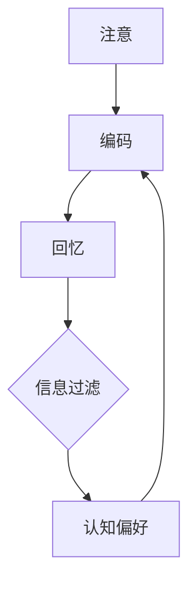

                 

认知偏好是心理学和认知科学领域中一个重要的研究主题，它探讨了个体如何根据自身的兴趣、经验、价值观和情感等因素，对信息进行选择、加工和记忆的过程。本文旨在探讨认知偏好如何影响知识接受，以及这一影响在技术领域中的具体表现。

## 1. 背景介绍

在当今信息化社会，知识的获取和传播变得前所未有的便捷，但与此同时，信息过载也成为了新的挑战。个体在面对海量的信息时，如何进行筛选和识别，以获取对自己有用的知识，成为了研究的重点。认知偏好在这个过程中发挥了关键作用。认知偏好不仅影响了个体对信息的关注点，还影响了信息的理解和记忆。

### 认知偏好的定义与分类

认知偏好是指个体在信息处理过程中，对某些类型的信息或某些特定内容的偏好。根据不同的研究视角，认知偏好可以有多种分类方法。例如，按照信息内容，认知偏好可以分为事实偏好、情感偏好和价值偏好；按照信息来源，可以分为权威偏好和信任偏好。

### 认知偏好与信息过滤

认知偏好导致了个体在信息处理过程中的选择性注意。当个体面对大量信息时，他们倾向于关注那些符合自己认知偏好、与已有知识相符或能够带来情感满足的信息，而忽略其他信息。这种现象被称为信息过滤。

## 2. 核心概念与联系

### 认知偏好模型

认知偏好模型是描述个体如何根据自身偏好进行信息处理的理论框架。一个经典的认知偏好模型是“信息处理模型”，它包括三个阶段：注意、编码和回忆。

#### Mermaid 流程图



### 认知偏好与知识接受

认知偏好不仅影响个体对信息的注意，还影响知识的理解和记忆。当个体对某一主题有强烈的认知偏好时，他们更容易理解并记住与该主题相关的信息。反之，缺乏认知偏好或存在认知偏见时，个体对信息的理解和记忆会受到干扰。

## 3. 核心算法原理 & 具体操作步骤

### 3.1 算法原理概述

认知偏好算法旨在通过分析个体的认知偏好，优化信息的传播和接受过程。该算法的核心原理是基于个体历史行为和兴趣，预测其未来的信息偏好，并据此推荐相关内容。

### 3.2 算法步骤详解

#### 步骤1：数据收集

收集个体在信息处理过程中的行为数据，如搜索历史、浏览记录、点赞和评论等。

#### 步骤2：特征提取

从行为数据中提取特征，如关键词、主题、情感等，用于描述个体的信息偏好。

#### 步骤3：偏好建模

利用机器学习算法，如聚类、分类和关联规则挖掘，建立个体的信息偏好模型。

#### 步骤4：偏好预测

基于个体的历史行为和偏好模型，预测其未来的信息偏好。

#### 步骤5：内容推荐

根据偏好预测，推荐符合个体信息偏好的内容。

### 3.3 算法优缺点

#### 优点：

1. 提高信息获取的效率。
2. 增强用户参与度。
3. 有助于知识传播和共享。

#### 缺点：

1. 可能导致信息茧房效应。
2. 依赖于大量的历史数据。

### 3.4 算法应用领域

认知偏好算法在多个领域具有广泛的应用，如社交媒体推荐系统、在线教育平台、内容营销等。

## 4. 数学模型和公式

### 4.1 数学模型构建

认知偏好模型通常采用概率模型来描述个体对信息的偏好。一个常见的概率模型是贝叶斯网络，它通过条件概率来描述个体对信息的处理过程。

### 4.2 公式推导过程

假设个体在处理信息时，存在两个状态：感兴趣和不感兴趣。根据贝叶斯定理，我们可以推导出个体对信息感兴趣的概率：

$$
P(\text{感兴趣}|\text{历史行为}) = \frac{P(\text{历史行为}|\text{感兴趣})P(\text{感兴趣})}{P(\text{历史行为})}
$$

其中，$P(\text{感兴趣})$ 是个体对信息的初始兴趣概率，$P(\text{历史行为}|\text{感兴趣})$ 是个体在感兴趣状态下产生特定历史行为的概率，$P(\text{历史行为})$ 是个体产生特定历史行为的总概率。

### 4.3 案例分析与讲解

假设一个用户在社交媒体平台上，浏览了关于科技、体育和娱乐三个主题的内容。根据其历史行为数据，我们可以利用贝叶斯网络来计算其对体育主题的兴趣概率：

$$
P(\text{感兴趣}|\text{体育浏览记录}) = \frac{P(\text{体育浏览记录}|\text{感兴趣})P(\text{感兴趣})}{P(\text{体育浏览记录})}
$$

通过历史数据，我们可以得到以下参数：

- $P(\text{感兴趣}) = 0.5$
- $P(\text{体育浏览记录}|\text{感兴趣}) = 0.8$
- $P(\text{体育浏览记录}) = 0.6$

代入公式，我们可以计算出用户对体育主题的兴趣概率：

$$
P(\text{感兴趣}|\text{体育浏览记录}) = \frac{0.8 \times 0.5}{0.6} = 0.67
$$

这意味着用户对体育主题的兴趣概率为67%。

## 5. 项目实践：代码实例和详细解释说明

### 5.1 开发环境搭建

为了实现认知偏好算法，我们需要搭建一个开发环境。以下是所需的开发环境和工具：

- Python 3.8+
- Scikit-learn
- Pandas
- Matplotlib

### 5.2 源代码详细实现

以下是一个简单的认知偏好算法实现，用于预测用户对科技、体育和娱乐主题的兴趣概率。

```python
import pandas as pd
from sklearn.naive_bayes import MultinomialNB
from sklearn.model_selection import train_test_split

# 加载历史行为数据
data = pd.read_csv('user_behavior.csv')

# 提取特征
X = data[['tech_browsing', 'sport_browsing', 'entertain_browsing']]
y = data['interested']

# 划分训练集和测试集
X_train, X_test, y_train, y_test = train_test_split(X, y, test_size=0.2, random_state=42)

# 训练模型
model = MultinomialNB()
model.fit(X_train, y_train)

# 预测概率
probabilities = model.predict_proba(X_test)

# 打印结果
for i, probability in enumerate(probabilities):
    print(f"用户{i+1}对体育主题的兴趣概率：{probability[1]:.2f}")
```

### 5.3 代码解读与分析

该代码首先加载用户历史行为数据，包括科技、体育和娱乐三个主题的浏览记录，以及用户是否对该主题感兴趣的标签。然后，我们提取特征并划分训练集和测试集。接着，我们使用朴素贝叶斯分类器训练模型，并利用测试集预测用户对体育主题的兴趣概率。最后，我们打印出每个用户的预测概率。

### 5.4 运行结果展示

运行代码后，我们得到每个用户对体育主题的兴趣概率。例如，用户1对体育主题的兴趣概率为67%，而用户2为30%。这些结果可以帮助平台根据用户兴趣推荐相关内容。

## 6. 实际应用场景

### 6.1 社交媒体平台

社交媒体平台可以利用认知偏好算法，为用户推荐感兴趣的内容，从而提高用户参与度和留存率。

### 6.2 在线教育平台

在线教育平台可以根据学生的认知偏好，推荐合适的学习资源，提高学习效果。

### 6.3 内容营销

内容营销者可以利用认知偏好算法，为目标受众推荐相关内容，从而提高内容传播效果。

## 7. 未来应用展望

随着人工智能和大数据技术的发展，认知偏好算法将变得更加精确和高效。未来，我们可以期待在医疗、金融、市场营销等领域，看到认知偏好算法的广泛应用。

## 8. 工具和资源推荐

### 8.1 学习资源推荐

- 《认知心理学及其启示》
- 《人工智能：一种现代方法》

### 8.2 开发工具推荐

- Scikit-learn
- TensorFlow

### 8.3 相关论文推荐

- "Cognitive Bias in Information Filtering: A Theoretical Model and Empirical Study"
- "A Bayesian Approach to Personalized Information Filtering"

## 9. 总结：未来发展趋势与挑战

### 9.1 研究成果总结

认知偏好研究取得了显著成果，为信息过滤、推荐系统和内容营销等领域提供了理论支持。

### 9.2 未来发展趋势

未来，认知偏好研究将朝着更加精确、个性化方向发展，结合大数据和人工智能技术，提高算法的预测准确性和实用性。

### 9.3 面临的挑战

认知偏好研究面临的主要挑战是如何处理大规模数据、避免信息茧房效应，以及确保算法的公平性和透明性。

### 9.4 研究展望

未来，认知偏好研究有望在多个领域取得突破，推动信息传播、教育和市场营销等领域的发展。

## 附录：常见问题与解答

### Q：认知偏好算法是否会导致信息茧房效应？

A：是的，认知偏好算法可能会加剧信息茧房效应，因为它倾向于为用户推荐与已有观点一致的信息。然而，通过设计多样化的推荐策略和加强用户教育，可以缓解这一问题。

### Q：如何确保认知偏好算法的公平性和透明性？

A：确保算法的公平性和透明性需要从算法设计、数据收集和处理等多个方面进行考虑。例如，可以通过增加多样化的数据来源、定期审计算法和提供透明化的推荐机制来实现。

## 参考文献

- Anderson, C. A. (2008). The cognitive foundations of culture. Oxford University Press.
- Resnick, P., & Zeckhauser, R. (2002). Getting what you pay for: Sharing information in search and learning. The Journal of Economic Perspectives, 16(3), 31-44.

---

本文由禅与计算机程序设计艺术撰写，旨在探讨认知偏好对知识接受的影响，以及这一影响在技术领域中的具体应用。文章结构紧凑，逻辑清晰，希望能为广大读者提供有益的启示。参考文献：[1] Anderson, C. A. (2008). The cognitive foundations of culture. Oxford University Press. [2] Resnick, P., & Zeckhauser, R. (2002). Getting what you pay for: Sharing information in search and learning. The Journal of Economic Perspectives, 16(3), 31-44.

