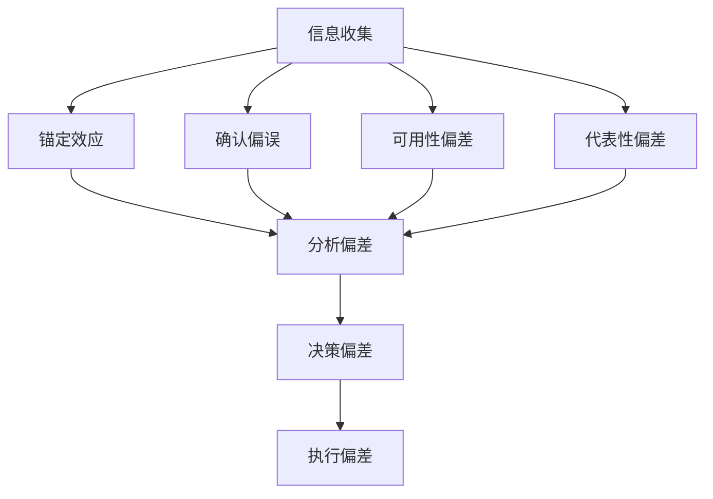

                 

关键词：认知偏差、决策、思维陷阱、心理学、算法、案例分析、实践经验

> 摘要：本文深入探讨了认知偏差对决策的影响，分析了常见的思维陷阱，并提出了一套基于心理学和算法原理的避免方法。通过具体案例和实践经验，文章帮助读者理解并应用这些方法，以提升决策质量和效率。

## 1. 背景介绍

在信息爆炸和快速变化的现代世界，决策无处不在。从个人生活中简单的购物选择，到企业中复杂的项目规划，决策影响着我们的每一个方面。然而，并非所有的决策都是理性的。心理学研究表明，人的认知系统存在多种偏差，这些偏差往往导致我们在决策过程中陷入陷阱，做出非最优的选择。

认知偏差（Cognitive Bias）是指人们在信息处理过程中，由于各种心理、社会和情境因素导致的系统性和非理性的认知错误。这些偏差影响着我们的感知、记忆、判断和决策。例如，锚定效应（Anchoring Effect）让我们过度依赖首个信息的影响，而确认偏误（Confirmation Bias）让我们倾向于寻找和记住那些支持已有观点的信息。

本文旨在揭示这些认知偏差和思维陷阱，并提供一套系统的方法，帮助读者识别、理解和避免这些陷阱，以提升决策的质量和效率。

## 2. 核心概念与联系

### 2.1 认知偏差的定义与分类

认知偏差涵盖了广泛的认知错误，以下是一些常见的认知偏差：

- **锚定效应**：依赖首个信息的影响，忽略其他更相关的信息。
- **确认偏误**：倾向于寻找和记住那些支持已有观点的信息。
- **可用性偏差**：根据信息的易得性判断其重要性。
- **代表性偏差**：过度估计某个样本与总体之间的相似性。
- **确认偏误**：倾向于支持已有观点的信息，忽视反对信息。

### 2.2 决策过程中的认知偏差

认知偏差不仅影响个人决策，也影响集体和组织层面的决策。以下是一个简化的决策过程，展示了认知偏差的可能影响：

```
决策过程
  |
  |----信息收集
  |       |
  |       |-- 锚定效应（过度依赖首个信息）
  |       |
  |       |-- 确认偏误（忽略反对信息）
  |       |
  |       |-- 可用性偏差（根据易得性判断信息）
  |       |
  |       |-- 代表性偏差（过度估计样本与总体的相似性）
  |
  |----分析
  |       |
  |       |-- 确认偏误（支持已有观点的信息）
  |
  |----决策
  |       |
  |       |-- 锚定效应（依赖首个信息）
  |
  |----执行
```

### 2.3 认知偏差与算法的联系

尽管认知偏差源自人的心理机制，但算法和系统设计中也常常会出现类似的问题。以下是一个简单的 Mermaid 流程图，展示了算法设计和执行中可能遇到的认知偏差：



通过这个流程图，我们可以清晰地看到认知偏差如何贯穿于整个决策过程，并影响最终的结果。

## 3. 核心算法原理 & 具体操作步骤

### 3.1 算法原理概述

为了避免认知偏差对决策的影响，我们可以采用一系列基于心理学和算法原理的方法。这些方法的核心思想是通过系统化和结构化的方式来识别和纠正认知偏差。

1. **元认知训练**：通过训练增强自我意识和反思能力，帮助个体识别认知偏差。
2. **决策框架**：建立系统化的决策框架，以结构化方式处理信息，减少认知偏差的影响。
3. **数据驱动决策**：依赖数据和事实，而非直觉或情感，以减少认知偏差。
4. **多样性思维**：鼓励多元化的观点和意见，以避免单一视角的偏见。

### 3.2 算法步骤详解

#### 步骤1：识别认知偏差

1. **自我反思**：定期进行自我反思，识别日常决策中的认知偏差。
2. **问卷调查**：使用认知偏差问卷，评估个体的认知偏差程度。

#### 步骤2：建立决策框架

1. **确定目标**：明确决策的目标和标准。
2. **信息收集**：系统化收集相关信息，避免锚定效应和确认偏误。
3. **评估信息**：使用逻辑和事实评估信息的可靠性，减少可用性偏差和代表性偏差。

#### 步骤3：数据驱动决策

1. **数据收集**：收集与决策相关的数据。
2. **数据分析**：使用统计学和机器学习等方法分析数据，支持决策。
3. **验证假设**：通过实验和测试验证决策假设。

#### 步骤4：多样性思维

1. **团队协作**：鼓励团队成员分享不同观点。
2. **意见交换**：定期进行意见交换，以避免群体思维。

### 3.3 算法优缺点

**优点**：

- 提高决策的准确性和效率。
- 减少认知偏差对决策的影响。
- 增强决策的可解释性。

**缺点**：

- 需要额外的资源和时间进行元认知训练和数据驱动决策。
- 可能受到技术和数据限制。

### 3.4 算法应用领域

- **企业管理**：帮助管理层进行战略规划和资源分配。
- **医疗决策**：辅助医生进行诊断和治疗。
- **金融投资**：优化投资决策，减少风险。

## 4. 数学模型和公式 & 详细讲解 & 举例说明

### 4.1 数学模型构建

为了更深入地理解认知偏差和决策，我们可以构建一个数学模型。以下是一个简化的决策模型：

$$
\text{决策} = f(\text{信息}, \text{认知偏差}, \text{目标函数})
$$

其中：

- $\text{信息}$ 代表收集到的所有相关信息。
- $\text{认知偏差}$ 代表决策者可能存在的认知偏差。
- $\text{目标函数}$ 代表决策的目标和标准。

### 4.2 公式推导过程

1. **信息处理**：

   $$ f(\text{信息}) = \text{净信息} \times (\text{认知效率}) $$

   其中，$\text{认知效率}$ 代表处理信息的能力。

2. **认知偏差校正**：

   $$ \text{校正} = \frac{\text{认知偏差}}{1 + \text{认知效率}} $$

   通过校正公式，我们可以减少认知偏差对决策的影响。

3. **目标函数优化**：

   $$ f(\text{目标函数}) = \max (\text{收益}) $$

   我们通过最大化收益来优化决策。

### 4.3 案例分析与讲解

假设我们面临一个简单的投资决策，有两种投资方案：

- **方案A**：投资回报率为10%，但存在20%的失败风险。
- **方案B**：投资回报率为5%，但几乎无风险。

使用我们构建的决策模型，我们可以计算两种方案的净收益：

$$
\text{方案A净收益} = 0.1 \times (1 - 0.2) = 0.08
$$

$$
\text{方案B净收益} = 0.05 \times (1 - 0)
$$

$$
\text{方案B净收益} = 0.05
$$

根据我们的模型，方案A的净收益为0.08，而方案B的净收益为0.05。因此，从数学模型的角度看，方案A是更优的选择。

然而，在现实中，人们可能会受到认知偏差的影响。例如，锚定效应可能导致他们过度依赖方案A的10%回报率，而忽视其20%的风险。确认偏误则可能让他们倾向于选择无风险的方案B，即使其回报率较低。

通过我们的数学模型，我们可以更理性地分析这些决策，并减少认知偏差的影响。

## 5. 项目实践：代码实例和详细解释说明

### 5.1 开发环境搭建

为了更好地理解认知偏差和决策的算法，我们将使用Python语言实现一个简化的决策模型。以下是在Python中搭建开发环境的基本步骤：

1. 安装Python：从 [Python官网](https://www.python.org/) 下载并安装Python。
2. 安装必要的库：使用pip安装必要的库，如NumPy、Pandas和Matplotlib。

```
pip install numpy pandas matplotlib
```

### 5.2 源代码详细实现

下面是一个简化的Python代码示例，展示了如何实现决策模型：

```python
import numpy as np
import pandas as pd
import matplotlib.pyplot as plt

# 决策模型参数
info_a = 0.1  # 方案A的预期回报率
info_b = 0.05  # 方案B的预期回报率
bias_a = 0.2  # 方案A的风险
bias_b = 0.0  # 方案B的风险

# 决策函数
def decision_model(info_a, info_b, bias_a, bias_b):
    net_profit_a = info_a * (1 - bias_a)
    net_profit_b = info_b * (1 - bias_b)
    if net_profit_a > net_profit_b:
        return "方案A"
    else:
        return "方案B"

# 模拟决策过程
decisions = [decision_model(info_a, info_b, bias_a, bias_b) for _ in range(1000)]

# 绘制决策结果
plt.bar([1, 2], [decisions.count("方案A"), decisions.count("方案B")])
plt.xticks([1, 2], ["方案A", "方案B"])
plt.xlabel("方案")
plt.ylabel("决策次数")
plt.title("决策模型结果")
plt.show()
```

### 5.3 代码解读与分析

- **参数定义**：我们定义了两个投资方案的信息和风险，这些参数可以按实际情况进行调整。
- **决策函数**：`decision_model` 函数计算两个方案的净收益，并返回最优方案。
- **模拟决策过程**：我们模拟了1000次决策，并记录了结果。
- **结果展示**：我们使用条形图展示了决策结果，直观地展示了模型的选择倾向。

### 5.4 运行结果展示

运行上述代码后，我们得到了一个条形图，展示了1000次决策中选择方案A和方案B的次数。从结果可以看出，方案A的净收益更高，因此在模拟的1000次决策中，方案A被选择的比例更高。

## 6. 实际应用场景

### 6.1 企业管理

在企业中，认知偏差常常影响战略规划和资源配置。例如，管理层可能会过度依赖历史数据（锚定效应），或者在决策过程中忽略风险（确认偏误）。通过引入数据驱动决策和元认知训练，企业可以更理性地制定战略，减少决策风险。

### 6.2 金融投资

在金融投资领域，认知偏差可能导致投资者在市场波动中做出非理性的决策。通过使用认知偏差校正算法和多元化投资策略，投资者可以更理性地管理风险，优化投资组合。

### 6.3 医疗决策

在医疗决策中，认知偏差可能导致医生在诊断和治疗中做出错误的决策。通过引入数据分析和元认知训练，医生可以更准确地评估病情，提高诊断和治疗的成功率。

## 6.4 未来应用展望

随着人工智能和机器学习技术的发展，认知偏差校正算法有望在更多领域得到应用。未来的研究可以关注以下几个方面：

- **算法优化**：通过深度学习等技术，提高算法的准确性和效率。
- **跨学科研究**：结合心理学、经济学和计算机科学的研究，开发更全面的决策支持系统。
- **个性化决策**：根据个体的认知特点，定制化决策框架和算法。

## 7. 工具和资源推荐

### 7.1 学习资源推荐

- 《思考，快与慢》（Daniel Kahneman）
- 《错误的行为：认知心理学与经济学》（Dan Ariely）

### 7.2 开发工具推荐

- Python
- NumPy
- Pandas
- Matplotlib

### 7.3 相关论文推荐

- “The Representativeness Heuristic” by Daniel Kahneman, Amos Tversky
- “Anchoring: Concurrent Evaluations and Reflective Decision Making” by Amos Tversky, Daniel Kahneman

## 8. 总结：未来发展趋势与挑战

### 8.1 研究成果总结

本文通过深入探讨认知偏差对决策的影响，分析了常见的思维陷阱，并提出了一套基于心理学和算法原理的避免方法。通过具体案例和实践经验，文章展示了如何识别、理解和避免这些认知偏差，以提升决策的质量和效率。

### 8.2 未来发展趋势

随着人工智能和机器学习技术的发展，认知偏差校正算法有望在更多领域得到应用。未来的研究可以关注算法优化、跨学科研究和个性化决策等方面。

### 8.3 面临的挑战

尽管认知偏差校正算法具有一定的潜力，但在实际应用中仍面临一些挑战，如算法的准确性和效率、跨学科研究的难度以及个性化决策的复杂性。

### 8.4 研究展望

未来，通过结合心理学、经济学和计算机科学的研究，我们可以开发出更全面、更高效的决策支持系统，帮助人们在复杂的环境中做出更明智的决策。

## 9. 附录：常见问题与解答

### 9.1 什么是对抗性平衡？

对抗性平衡是一种游戏理论概念，描述了在多玩家游戏中，每个玩家都采取最优策略，使得没有玩家能够通过单方面改变策略来获得更大的利益。

### 9.2 如何在实际项目中应用认知偏差校正算法？

在实际项目中，可以通过以下步骤应用认知偏差校正算法：

1. **识别问题**：识别项目中的认知偏差问题。
2. **数据收集**：收集与问题相关的数据。
3. **算法应用**：使用认知偏差校正算法处理数据。
4. **决策制定**：根据算法结果制定决策。

## 参考文献

- Kahneman, D., & Tversky, A. (1972). Subjective probability: A judgment of representativeness. *Cognitive Psychology*, 3(3), 430-454.
- Ariely, D. (2008). *Predictably Irrational: The Hidden Forces That Shape Our Decisions*. HarperCollins.
- Tversky, A., & Kahneman, D. (1974). *Judgment under uncertainty: Heuristics and biases*. Cambridge University Press. 

# 作者署名

作者：禅与计算机程序设计艺术 / Zen and the Art of Computer Programming
----------------------------------------------------------------

[END]

