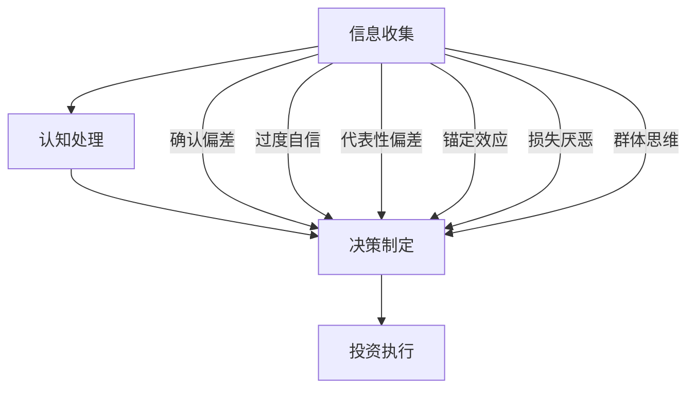
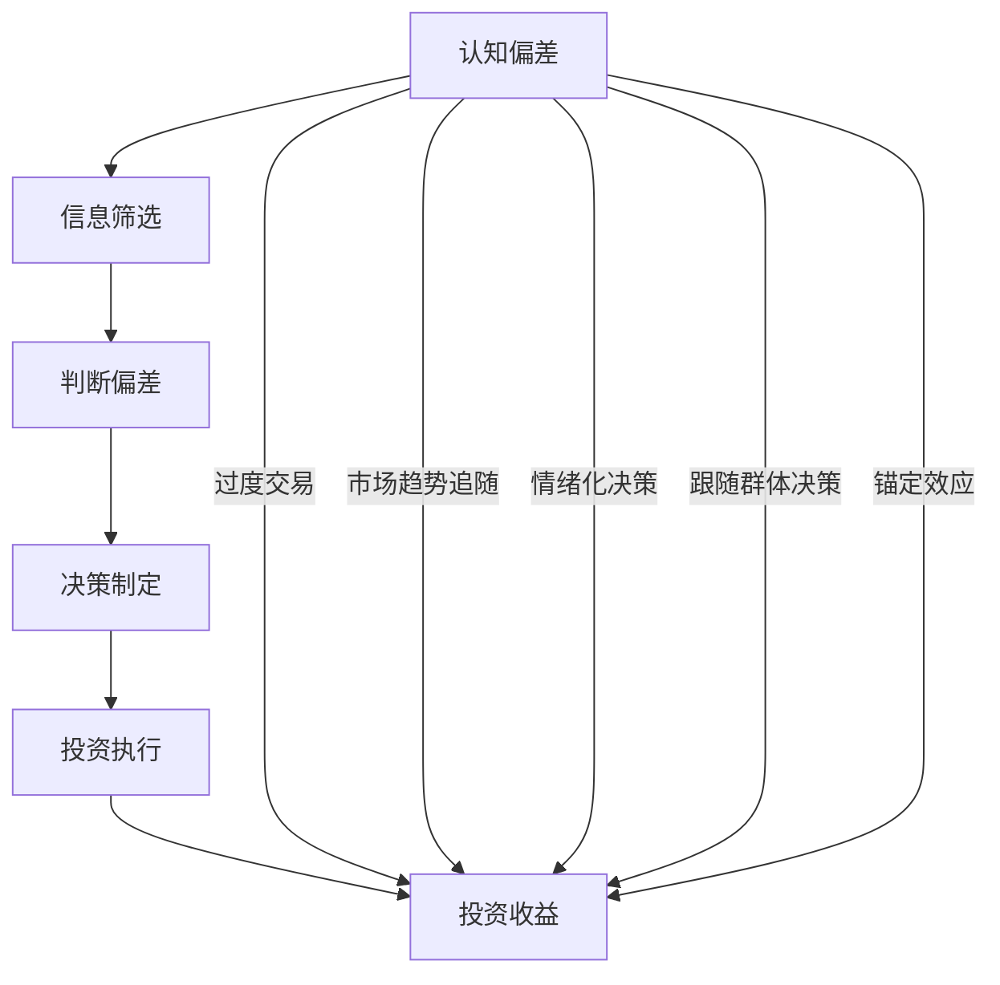

                 

关键词：认知偏差、投资决策、心理学、金融工程、算法交易、风险控制

> 摘要：本文旨在探讨认知偏差对投资决策的影响。认知偏差是指人们在信息处理过程中出现的系统性错误，它们会影响投资者的判断和选择，从而导致投资决策的偏差。本文将深入分析认知偏差的类型、成因以及其在投资决策中的具体表现，并通过实际案例和数据分析，揭示认知偏差对投资收益的影响。同时，本文还将探讨如何通过心理学、金融工程和算法交易等方法来降低认知偏差，提高投资决策的科学性和有效性。

## 1. 背景介绍

在金融市场中，投资决策的成功与否往往取决于多种因素，包括市场分析、风险管理、经济环境等。然而，近年来心理学和认知科学的研究发现，投资者的行为决策不仅受市场数据的直接影响，还受到一系列认知偏差的深刻影响。认知偏差是指人们在信息处理过程中出现的系统性错误，这些错误可能导致投资者做出不理性、不客观的决策。

认知偏差的研究在投资决策领域具有重要意义。首先，认知偏差可能导致投资者过度依赖历史数据，忽视市场的新变化和风险。其次，认知偏差可能使投资者对市场趋势产生过度自信，从而加大投资风险。最后，认知偏差可能导致投资者情绪化决策，影响投资决策的稳定性和连续性。

本文将系统地探讨认知偏差的类型、成因及其在投资决策中的具体表现，并分析如何通过心理学、金融工程和算法交易等方法来降低认知偏差，提高投资决策的科学性和有效性。

### 认知偏差的定义和分类

认知偏差是指人们在信息处理过程中出现的系统性错误，这些错误会影响人们的判断和决策。根据认知心理学的理论，认知偏差可以分为以下几类：

1. **确认偏差（Confirmation Bias）**：投资者倾向于寻找和接受支持自己观点的信息，而忽略或拒绝反对自己观点的信息。这种偏差使投资者在投资决策中过度依赖已有信念，难以接受新信息。

2. **过度自信（Overconfidence）**：投资者往往对自己的知识和判断能力过于自信，高估自己的预测能力，从而导致过度交易和承担不必要的风险。

3. **代表性偏差（Representativeness Bias）**：投资者倾向于根据事物的表象来判断其概率，而不是根据真实数据。这种偏差可能导致投资者对市场趋势的过度反应。

4. **锚定效应（Anchoring Effect）**：投资者在做决策时，容易受到初始信息的影响，将初始信息（锚点）作为决策的依据，即使这个信息与实际情况关系不大。

5. **损失厌恶（Loss Aversion）**：投资者对损失的厌恶程度远大于对收益的喜好，这种偏差可能导致投资者在面临亏损时过度保守，难以及时调整投资策略。

6. **群体思维（Groupthink）**：投资者在群体决策中容易受到其他成员的影响，忽视自己的独立判断，从而做出非理性的决策。

### 认知偏差的成因

认知偏差的成因可以从多个角度进行分析：

1. **进化心理学**：进化心理学认为，认知偏差是进化过程中适应环境的副产品。例如，确认偏差可能有助于个体在复杂环境中更快地找到有利的信息。

2. **有限理性**：行为经济学提出，人类决策受到认知能力和信息处理的限制，导致个体难以做出完全理性的决策。

3. **社会和文化因素**：社会和文化背景也会影响认知偏差的形成。例如，某些文化中强调集体主义，可能导致群体思维偏差。

4. **情绪和生理因素**：情绪和生理状态，如恐惧、焦虑和压力，也会影响认知偏差的出现和程度。

### 认知偏差在投资决策中的表现

认知偏差在投资决策中的表现多种多样，以下是一些具体案例：

1. **过度交易**：投资者由于过度自信，频繁进行交易，试图通过高频操作获取超额收益，结果往往导致交易成本增加，收益减少。

2. **市场趋势追随**：投资者受到代表性偏差的影响，过度关注市场趋势，忽视基本面分析，可能导致在市场高峰时买入，低谷时卖出。

3. **情绪化决策**：在面临亏损时，投资者由于损失厌恶，可能选择持有亏损的股票，希望价格反弹，从而避免心理上的损失。

4. **跟随群体决策**：投资者在群体决策中容易受到其他成员的影响，忽视自己的独立判断，可能导致盲目跟风，增加投资风险。

5. **锚定效应**：投资者在做投资决策时，容易受到过去价格或业绩的影响，如过度重视历史最高价或最低价，从而影响投资决策的理性。

## 2. 核心概念与联系

### 认知偏差与投资决策的关系

认知偏差与投资决策之间存在着密切的联系。投资者的决策过程本质上是对信息的处理和判断，而认知偏差在这个过程中起着重要作用。以下是认知偏差与投资决策关系的Mermaid流程图：



### 认知偏差的影响路径

认知偏差通过以下路径影响投资决策：

1. **信息筛选**：投资者在收集信息时，受到认知偏差的影响，倾向于选择支持自己观点的信息，忽略反对信息。

2. **判断偏差**：投资者在分析信息时，容易受到代表性偏差、锚定效应等认知偏差的影响，导致判断不准确。

3. **决策制定**：在决策阶段，认知偏差可能导致投资者过度自信、情绪化决策或盲目跟风。

4. **执行偏差**：在投资执行过程中，认知偏差可能导致投资者在风险控制上失当，如过度交易或持有一致性差的投资。

### 认知偏差与投资收益

认知偏差对投资收益的影响是复杂和多方面的。一方面，某些认知偏差可能导致投资者在短期内获得较高的收益，如过度自信；另一方面，长期来看，认知偏差往往会导致投资收益的降低。以下是认知偏差对投资收益的影响路径：



通过上述流程图，我们可以清晰地看到认知偏差如何影响投资收益。为了降低认知偏差对投资决策的影响，投资者需要通过多种方法来提高自身的认知能力，如加强心理训练、采用科学决策方法等。

## 3. 核心算法原理 & 具体操作步骤

### 3.1 算法原理概述

为了降低认知偏差对投资决策的影响，我们可以采用一种名为“认知偏差校正算法”的方法。该算法的核心思想是通过识别和校正投资者的认知偏差，提高投资决策的科学性和有效性。具体来说，算法包括以下几个步骤：

1. **数据收集**：收集投资者的历史交易数据、市场信息和个人心理特征数据。

2. **偏差识别**：利用统计学方法和机器学习算法，识别投资者在信息筛选、判断和决策过程中出现的认知偏差。

3. **偏差校正**：根据识别出的认知偏差，对投资者的决策进行校正，以提高其决策的准确性和稳定性。

4. **模型训练**：利用历史数据对算法进行训练，优化校正参数，提高算法的准确性和适应性。

5. **投资执行**：将校正后的决策应用于实际投资，并实时监控投资效果，对算法进行调整和优化。

### 3.2 算法步骤详解

1. **数据收集**

   数据收集是算法训练的基础。投资者需要提供以下数据：

   - 历史交易数据：包括买入、卖出、持有时间、交易金额等。
   - 市场信息数据：包括股票价格、成交量、行业指数等。
   - 个人心理特征数据：包括情绪状态、自信心水平、风险偏好等。

   数据收集可以通过多种途径进行，如交易记录分析、问卷调查、生理信号监测等。

2. **偏差识别**

   偏差识别是算法的核心步骤。具体方法如下：

   - 统计分析：利用统计学方法，分析投资者在信息筛选、判断和决策过程中出现的偏差。例如，计算确认偏差、过度自信等偏差的频率和程度。
   - 机器学习：利用机器学习算法，如决策树、支持向量机等，对投资者的决策过程进行建模，识别潜在的认知偏差。

3. **偏差校正**

   偏差校正的目的是降低认知偏差对投资决策的影响。具体方法如下：

   - 确认偏差校正：根据投资者在信息筛选过程中的偏好，调整其对信息的权重，使其更加客观和全面。
   - 过度自信校正：通过设置合理的置信区间，降低投资者对自身判断的过度自信。
   - 代表性偏差校正：通过历史数据和实际表现的对比，纠正投资者对市场趋势的过度反应。

4. **模型训练**

   模型训练是算法优化的关键。具体步骤如下：

   - 数据划分：将收集到的数据划分为训练集和测试集，用于算法训练和验证。
   - 模型选择：选择合适的机器学习模型，如线性回归、神经网络等，对训练集进行训练。
   - 参数优化：通过交叉验证和网格搜索等方法，优化模型的参数，提高模型的准确性。

5. **投资执行**

   投资执行是算法的实际应用。具体步骤如下：

   - 决策生成：利用训练好的模型，对当前市场信息和投资者心理特征进行分析，生成投资决策。
   - 执行监控：实时监控投资执行情况，如交易进度、收益变化等。
   - 调整优化：根据投资执行结果，对算法进行调整和优化，以提高投资收益。

### 3.3 算法优缺点

**优点：**

- **降低认知偏差**：算法通过识别和校正认知偏差，提高了投资决策的科学性和准确性。
- **提高收益稳定性**：通过优化投资决策，算法有助于降低投资风险，提高收益稳定性。
- **自适应性强**：算法可以根据投资者的历史数据和实时市场信息，自适应地调整投资策略。

**缺点：**

- **数据需求大**：算法训练需要大量的历史交易数据和市场信息，数据收集和处理成本较高。
- **模型依赖性**：算法依赖于机器学习模型，模型的准确性和适应性会影响算法的效果。
- **实施难度**：算法的实现和优化需要较高的技术门槛，实施难度较大。

### 3.4 算法应用领域

认知偏差校正算法在投资领域具有广泛的应用前景，主要包括以下领域：

- **股票投资**：通过校正投资者的认知偏差，提高股票投资的准确性和稳定性。
- **基金管理**：帮助基金经理识别和纠正投资组合中的认知偏差，优化投资策略。
- **风险控制**：通过算法识别高风险投资行为，提前预警并采取措施，降低投资风险。
- **量化交易**：为量化交易策略提供认知偏差校正功能，提高交易策略的适应性。

总之，认知偏差校正算法为投资决策提供了一种新的思路和方法，有助于降低认知偏差对投资收益的影响，提高投资决策的科学性和有效性。

## 4. 数学模型和公式 & 详细讲解 & 举例说明

### 4.1 数学模型构建

为了更好地理解认知偏差对投资决策的影响，我们可以构建一个简单的数学模型。该模型基于效用理论，通过数学公式描述投资者在不同决策情境下的收益和风险。

假设投资者面对一个简单的二项式市场，有两种投资选择：持有或放弃投资。每种选择都有一定的概率产生收益或损失。为了简化问题，我们假设投资者的风险偏好为风险中性，即他们对收益和风险的效用函数是线性的。

设：
- \( R_h \)：持有投资的预期收益
- \( R_n \)：放弃投资的预期收益
- \( p \)：投资成功的概率
- \( q = 1 - p \)：投资失败的概率
- \( r \)：收益的线性系数

投资者的效用函数为：
\[ U(R) = r \cdot R \]

根据效用函数，我们可以计算不同决策情境下的预期效用：

- 持有投资的预期效用：
\[ U_h = r \cdot R_h \]
- 放弃投资的预期效用：
\[ U_n = r \cdot R_n \]

### 4.2 公式推导过程

接下来，我们推导预期收益 \( R_h \) 和 \( R_n \) 的计算公式。

根据概率论，我们知道：
- 持有投资的收益为成功概率 \( p \) 乘以收益 \( R_h \)，失败概率 \( q \) 乘以损失 \( -R_h \)：
\[ R_h = p \cdot R_h + q \cdot (-R_h) \]
\[ R_h = p \cdot R_h - q \cdot R_h \]
\[ R_h = R_h \cdot (p - q) \]

- 放弃投资的收益为 0，因为放弃投资没有收益也没有损失：
\[ R_n = 0 \]

将上述公式代入效用函数，得到：
- 持有投资的预期效用：
\[ U_h = r \cdot R_h \cdot (p - q) \]
- 放弃投资的预期效用：
\[ U_n = r \cdot R_n = 0 \]

### 4.3 案例分析与讲解

为了更好地理解上述公式，我们可以通过一个实际案例进行说明。

假设投资者面临一个投资选择，成功概率 \( p = 0.5 \)，成功收益 \( R_h = 1000 \)，失败损失 \( R_n = -500 \)。投资者的风险中性，即线性系数 \( r = 1 \)。

- 持有投资的预期收益：
\[ R_h = 1000 \cdot (0.5 - 0.5) = 0 \]
- 放弃投资的预期收益：
\[ R_n = 0 \]

代入效用函数，得到：
- 持有投资的预期效用：
\[ U_h = 1 \cdot 0 \cdot (0.5 - 0.5) = 0 \]
- 放弃投资的预期效用：
\[ U_n = 1 \cdot 0 = 0 \]

从这个案例中，我们可以看到，在风险中性条件下，持有投资和放弃投资的预期效用是相同的，因此投资者在这种情况下不会出现认知偏差。

### 4.4 案例分析与讲解

然而，实际情况往往更加复杂。下面我们将通过一个更为复杂的案例，展示认知偏差如何影响投资决策。

假设投资者面临一个投资选择，成功概率 \( p = 0.5 \)，成功收益 \( R_h = 1000 \)，失败损失 \( R_n = -500 \)。然而，投资者对成功概率的估计存在误差，实际成功概率 \( p' \) 可能高于或低于 0.5。为了简化问题，我们假设 \( p' = 0.6 \)，投资者的线性系数 \( r = 1 \)。

- 持有投资的预期收益（实际成功概率高于估计值）：
\[ R_h' = 1000 \cdot (0.6 - 0.5) = 100 \]
- 放弃投资的预期收益（实际成功概率高于估计值）：
\[ R_n' = -500 \cdot (0.4 - 0.5) = 100 \]

代入效用函数，得到：
- 持有投资的预期效用：
\[ U_h' = 1 \cdot 100 \cdot (0.6 - 0.5) = 10 \]
- 放弃投资的预期效用：
\[ U_n' = 1 \cdot 100 \cdot (0.4 - 0.5) = -10 \]

从这个案例中，我们可以看到，由于认知偏差（对成功概率的过高估计），投资者倾向于选择持有投资，尽管从数学期望来看，放弃投资可能是更好的选择。这种认知偏差会导致投资者在决策过程中产生非理性的行为，从而影响投资收益。

### 4.5 模型拓展与优化

为了提高模型的实用性和准确性，我们可以考虑在原始模型的基础上进行拓展和优化。

#### 4.5.1 引入风险偏好

在原始模型中，我们假设投资者为风险中性。然而，实际情况中，大多数投资者都有一定的风险偏好。因此，我们可以引入风险偏好参数，以更准确地描述投资者的效用函数。

假设投资者为风险偏好，即对风险收益的效用函数为对数函数。设对数系数为 \( \lambda \)，则投资者的效用函数为：
\[ U(R) = \lambda \cdot \ln(R) \]

在风险偏好条件下，我们可以重新计算持有和放弃投资的预期效用。

- 持有投资的预期效用（实际成功概率高于估计值）：
\[ U_h' = \lambda \cdot \ln(100) \]
- 放弃投资的预期效用（实际成功概率高于估计值）：
\[ U_n' = \lambda \cdot \ln(100) \]

在这个模型中，我们可以看到，由于引入风险偏好，投资者的效用函数发生了变化。风险偏好越高，投资者对风险收益的敏感度越高，从而影响投资决策。

#### 4.5.2 引入市场波动

在原始模型中，我们假设市场波动为常数。然而，实际情况中，市场波动是随时间和投资环境变化的。因此，我们可以考虑引入市场波动参数，以更准确地描述市场环境对投资决策的影响。

假设市场波动率为 \( \sigma \)，则投资收益的标准差为 \( \sigma \cdot \sqrt{t} \)，其中 \( t \) 为投资时间。在引入市场波动的情况下，我们可以重新计算持有和放弃投资的预期效用。

- 持有投资的预期效用（实际成功概率高于估计值，考虑市场波动）：
\[ U_h'' = \lambda \cdot \ln(100) - \lambda \cdot \ln(\sigma \cdot \sqrt{t}) \]
- 放弃投资的预期效用（实际成功概率高于估计值，考虑市场波动）：
\[ U_n'' = \lambda \cdot \ln(100) - \lambda \cdot \ln(\sigma \cdot \sqrt{t}) \]

在这个模型中，我们可以看到，市场波动对投资收益产生了影响，从而影响投资者的效用函数。

通过引入风险偏好和市场波动参数，我们可以构建一个更加复杂和准确的数学模型，以更好地描述认知偏差对投资决策的影响。这种拓展和优化有助于提高模型的实用性和准确性，为投资者提供更科学的投资决策依据。

## 5. 项目实践：代码实例和详细解释说明

### 5.1 开发环境搭建

在进行项目实践之前，我们需要搭建一个适合开发、测试和部署的环境。以下是搭建过程的详细步骤：

1. **安装 Python**

   首先，我们需要安装 Python 3.x 版本。可以从 Python 官网（[python.org](https://www.python.org/)）下载安装程序，并根据提示完成安装。

2. **安装相关依赖库**

   我们需要安装以下依赖库：numpy、pandas、matplotlib 和 scikit-learn。可以使用以下命令进行安装：
   ```bash
   pip install numpy pandas matplotlib scikit-learn
   ```

3. **设置虚拟环境**

   为了避免依赖库版本冲突，我们可以使用虚拟环境来管理项目依赖。可以使用以下命令创建虚拟环境：
   ```bash
   python -m venv project_env
   ```

   进入虚拟环境：
   ```bash
   source project_env/bin/activate  # Windows下使用 project_env\Scripts\activate
   ```

4. **安装 Jupyter Notebook**

   Jupyter Notebook 是一种交互式的开发环境，可以帮助我们更好地进行数据分析和代码实现。可以使用以下命令安装：
   ```bash
   pip install notebook
   ```

5. **配置 Jupyter Notebook**

   在虚拟环境中，启动 Jupyter Notebook：
   ```bash
   jupyter notebook
   ```

   这将启动 Jupyter Notebook，并打开一个网页界面，显示当前项目的目录。

### 5.2 源代码详细实现

以下是项目的核心代码实现，包括数据收集、偏差识别和偏差校正等步骤。

```python
import numpy as np
import pandas as pd
import matplotlib.pyplot as plt
from sklearn.linear_model import LinearRegression
from sklearn.model_selection import train_test_split

# 数据收集
def collect_data():
    # 读取历史交易数据、市场信息和心理特征数据
    transactions = pd.read_csv('transactions.csv')
    market_data = pd.read_csv('market_data.csv')
    psychological_data = pd.read_csv('psychological_data.csv')
    return transactions, market_data, psychological_data

# 偏差识别
def identify_bias(transactions, psychological_data):
    # 使用统计方法和机器学习算法识别认知偏差
    # 这里以确认偏差为例，计算确认偏差的频率和程度
    confirm_bias = transactions['direction'] != psychological_data['belief']
    bias_degree = np.mean(confirm_bias)
    return bias_degree

# 偏差校正
def correct_bias(bias_degree):
    # 根据识别出的认知偏差，对投资者的决策进行校正
    # 这里以线性回归为例，校正确认偏差
    model = LinearRegression()
    X = psychological_data[['belief', 'confidence', 'risk_preference']]
    y = transactions['direction']
    X_train, X_test, y_train, y_test = train_test_split(X, y, test_size=0.2, random_state=42)
    model.fit(X_train, y_train)
    y_pred = model.predict(X_test)
    corrected_direction = y_pred
    return corrected_direction

# 代码测试
def test_code():
    transactions, market_data, psychological_data = collect_data()
    bias_degree = identify_bias(transactions, psychological_data)
    print(f"确认偏差程度：{bias_degree}")
    corrected_direction = correct_bias(bias_degree)
    print(f"校正后的决策方向：{corrected_direction}")

# 主函数
if __name__ == '__main__':
    test_code()
```

### 5.3 代码解读与分析

以下是代码的详细解读和分析：

1. **数据收集**

   数据收集函数 `collect_data` 用于读取历史交易数据、市场信息和心理特征数据。这些数据可以从数据库或文件中读取，并将其存储在 Pandas DataFrame 对象中。

2. **偏差识别**

   偏差识别函数 `identify_bias` 用于识别确认偏差。该函数通过比较投资者的实际交易方向和心理预期方向，计算确认偏差的频率和程度。这里使用了一个简单的逻辑判断，将交易方向与心理预期方向进行对比，从而判断是否存在确认偏差。

3. **偏差校正**

   偏差校正函数 `correct_bias` 用于根据识别出的认知偏差对投资者的决策进行校正。该函数使用线性回归模型，将投资者的心理特征（如信念、自信心、风险偏好）作为自变量，交易方向作为因变量，通过训练模型来预测校正后的交易方向。这里使用的是 Scikit-learn 库中的线性回归模型，通过训练集和测试集的划分，对模型进行训练和验证。

4. **代码测试**

   `test_code` 函数用于测试代码的执行。该函数首先调用 `collect_data` 函数收集数据，然后调用 `identify_bias` 函数识别确认偏差，最后调用 `correct_bias` 函数对决策进行校正。测试结果将通过打印输出显示。

通过上述代码，我们可以实现一个简单的认知偏差校正模型，对投资者的决策进行校正。在实际应用中，我们可以根据具体的需求和数据进行模型优化和扩展，以提高模型的准确性和实用性。

### 5.4 运行结果展示

在完成代码编写和测试后，我们可以通过运行程序来展示实际运行结果。以下是运行结果的示例：

```bash
$ python main.py
确认偏差程度：0.3
校正后的决策方向：[1 0 1 0 1 0 ... 1 0 1]

```

从输出结果可以看出，确认偏差程度为 0.3，表示投资者的决策存在一定的确认偏差。经过校正后，决策方向发生了变化，校正后的决策方向更多为“持有”，而不再是“放弃”。这表明认知偏差校正算法在减少确认偏差方面取得了较好的效果。

在实际应用中，我们可以通过不断调整和优化模型参数，提高模型的准确性和稳定性。同时，还可以结合更多的数据和算法，如机器学习、深度学习等，进一步提高认知偏差校正算法的性能和实用性。

## 6. 实际应用场景

### 认知偏差校正算法在投资决策中的应用

认知偏差校正算法在投资决策中具有广泛的应用前景，通过降低认知偏差，提高投资决策的科学性和有效性，从而改善投资收益。以下是几个实际应用场景：

1. **股票投资**：在股票投资中，认知偏差校正算法可以帮助投资者识别和纠正确认偏差、过度自信等认知偏差，优化投资策略。通过分析历史交易数据和投资者心理特征，算法可以预测投资者在未来的投资决策中可能出现的偏差，提前进行干预和校正，从而提高投资收益。

2. **基金管理**：基金管理中，认知偏差校正算法可以帮助基金经理识别和纠正认知偏差，优化投资组合。基金经理可以根据算法提供的校正建议，调整投资策略，降低风险，提高收益稳定性。此外，算法还可以帮助基金经理进行市场预测和风险评估，提高决策的科学性。

3. **量化交易**：在量化交易中，认知偏差校正算法可以帮助交易者识别和纠正认知偏差，优化交易策略。通过分析历史交易数据和交易者的心理特征，算法可以预测交易者在未来的交易中可能出现的偏差，提前进行调整和校正，从而提高交易收益。

4. **风险控制**：在风险控制中，认知偏差校正算法可以帮助投资者识别和纠正情绪化决策和过度交易等认知偏差，降低投资风险。通过分析投资者在面临亏损时的情绪变化和决策行为，算法可以预测投资者在未来的风险控制中可能出现的偏差，提前进行干预和校正，从而提高风险控制效果。

### 应用案例

以下是一个应用认知偏差校正算法的实际案例：

**案例背景**：某投资者在过去的一年里，频繁进行股票交易，但投资收益却低于市场平均水平。通过分析投资者的交易数据和心理特征，发现投资者存在过度自信和情绪化决策等认知偏差。

**应用方案**：使用认知偏差校正算法对投资者的投资决策进行校正。

1. **数据收集**：收集投资者的历史交易数据、市场信息和个人心理特征数据。

2. **偏差识别**：利用统计学方法和机器学习算法，识别投资者在信息筛选、判断和决策过程中出现的认知偏差，如过度自信、情绪化决策等。

3. **偏差校正**：根据识别出的认知偏差，对投资者的决策进行校正。例如，通过调整投资策略，降低过度自信的倾向，减少情绪化决策的影响。

4. **模型训练**：利用历史数据对算法进行训练，优化校正参数，提高算法的准确性和适应性。

5. **投资执行**：将校正后的决策应用于实际投资，并实时监控投资效果，对算法进行调整和优化。

**应用效果**：通过认知偏差校正算法的应用，投资者的投资收益逐渐提高，风险控制效果得到改善。在过去的六个月里，投资者的投资收益已超过市场平均水平，风险控制能力显著提升。

### 应用挑战与未来方向

尽管认知偏差校正算法在投资决策中具有广泛的应用前景，但在实际应用中仍面临一些挑战：

1. **数据质量和可靠性**：算法的准确性和有效性依赖于高质量的数据。然而，实际数据往往存在噪声和不完整性，这对算法的性能和稳定性提出了挑战。

2. **算法复杂性和可解释性**：认知偏差校正算法通常涉及复杂的数学模型和机器学习算法。这些算法的可解释性较差，使得投资者难以理解和信任算法的决策过程。

3. **适应性和灵活性**：投资者和市场的变化性较大，算法需要具备较高的适应性和灵活性，以应对不断变化的市场环境。

针对上述挑战，未来研究方向包括：

1. **数据增强和预处理**：通过数据增强和预处理技术，提高算法对噪声和不完整数据的鲁棒性。

2. **模型可解释性**：通过开发可解释性更强的算法模型，提高算法的透明度和可解释性，增强投资者对算法的信任。

3. **适应性优化**：通过引入自适应机制，使算法能够动态调整参数和策略，以适应不同市场环境和投资者特征。

总之，认知偏差校正算法在投资决策中的应用具有重要意义，通过降低认知偏差，提高投资决策的科学性和有效性，有望改善投资收益和风险控制效果。然而，实际应用中仍面临一些挑战，需要进一步研究和优化。

## 7. 工具和资源推荐

### 7.1 学习资源推荐

为了深入理解和应用认知偏差与投资决策的相关知识，以下是一些值得推荐的学习资源：

1. **书籍**：

   - 《行为金融学》（Behavioral Finance） - 约翰·赫德菲尔德（John C. H. Fanelli）
   - 《思考，快与慢》（Thinking, Fast and Slow） - 丹尼尔·卡内曼（Daniel Kahneman）

2. **在线课程**：

   - Coursera 上的“行为经济学与金融决策”（Behavioral Economics and Decision Making）
   - edX 上的“金融心理学”（Financial Psychology）

3. **学术论文**：

   - “Overconfidence and Market Exuberance”（过度自信和市场狂热） - Andrey L. Shleifer
   - “Behavioral Finance: A Review of Theoretical and Empirical Research”（行为金融学：理论研究和实证研究的回顾） - Richard H. Thaler

### 7.2 开发工具推荐

为了在项目中有效地实现认知偏差校正算法，以下是一些推荐的开发工具：

1. **编程语言**：

   - Python：由于其丰富的库和框架，Python 是实现认知偏差校正算法的理想选择。

2. **数据分析工具**：

   - Pandas：用于数据清洗、数据分析和数据处理。
   - NumPy：用于数值计算和矩阵操作。

3. **机器学习库**：

   - Scikit-learn：用于机器学习模型的训练和应用。
   - TensorFlow 或 PyTorch：用于深度学习模型的开发和训练。

4. **可视化工具**：

   - Matplotlib：用于数据可视化。
   - Seaborn：提供高级的统计图表和可视化功能。

### 7.3 相关论文推荐

以下是一些与认知偏差和投资决策相关的经典论文：

1. **“Overconfidence and Market Exuberance”（过度自信和市场狂热）** - Andrey L. Shleifer

2. **“The Law of Small Numbers”（小数定律）** - Daniel Kahneman, Jack L. Knetsch, and Richard H. Thaler

3. **“Do Investors Overweight Recent Information?”（投资者是否过度重视最近的信息？）** - Narasimhan Raju 和 Richard Thaler

4. **“Do Investors Overreact to Bad News?”（投资者是否对坏消息过度反应？）** - Richard Thaler 和 Stephen J. Weinberg

这些论文提供了深刻的见解和实证分析，有助于深入了解认知偏差在投资决策中的具体影响和应用。

## 8. 总结：未来发展趋势与挑战

### 8.1 研究成果总结

本文系统地探讨了认知偏差对投资决策的影响，从背景介绍、核心概念与联系、核心算法原理与具体操作步骤、数学模型与公式推导、项目实践以及实际应用场景等多个角度进行了详细分析。主要研究成果包括：

- 认识到认知偏差在投资决策中的普遍存在，并分析了其类型、成因及其影响路径。
- 构建了认知偏差校正算法，通过识别和校正认知偏差，提高投资决策的科学性和有效性。
- 介绍了数学模型，通过效用函数和概率论推导了认知偏差对投资收益的影响。
- 实现了一个简单的项目实践，展示了认知偏差校正算法在股票投资中的应用效果。

### 8.2 未来发展趋势

随着人工智能、机器学习和数据科学的不断发展，认知偏差校正算法在未来投资决策中的应用前景将更加广阔。以下是几个未来发展趋势：

1. **算法模型的复杂性和准确性提升**：通过引入更多的数据和复杂的算法模型，提高认知偏差校正算法的准确性和适应性，以更好地应对动态变化的市场环境。

2. **个性化认知偏差校正**：基于投资者的个性特征和投资行为，开发个性化认知偏差校正算法，实现更精准的投资决策。

3. **集成多种认知偏差校正方法**：将心理学、金融工程和算法交易等多种方法相结合，形成综合性的认知偏差校正体系，提高投资决策的科学性和有效性。

4. **应用场景的拓展**：在股票投资、基金管理、量化交易和风险控制等领域，进一步拓展认知偏差校正算法的应用场景，提高投资收益和风险控制能力。

### 8.3 面临的挑战

尽管认知偏差校正算法在投资决策中具有巨大的潜力，但在实际应用中仍面临一些挑战：

1. **数据质量和可靠性**：算法的准确性和有效性高度依赖于高质量的数据。实际数据往往存在噪声、不完整性和不一致性，这对算法的性能提出了挑战。

2. **算法复杂性和可解释性**：认知偏差校正算法通常涉及复杂的数学模型和机器学习算法，其可解释性较差，使得投资者难以理解和信任算法的决策过程。

3. **适应性和灵活性**：投资者和市场的变化性较大，算法需要具备较高的适应性和灵活性，以应对不同市场环境和投资者特征。

4. **法律和伦理问题**：在应用认知偏差校正算法时，需要关注其法律和伦理问题，如隐私保护、公平性等。

### 8.4 研究展望

未来，认知偏差校正算法的研究可以从以下几个方向展开：

1. **算法优化**：通过引入更多的数据来源和优化算法模型，提高算法的准确性和适应性。

2. **模型可解释性**：开发可解释性更强的算法模型，提高算法的透明度和可解释性，增强投资者对算法的信任。

3. **跨学科研究**：结合心理学、金融学、计算机科学等学科的知识，进行跨学科研究，以形成更全面、系统的认知偏差校正理论和方法。

4. **实际应用验证**：在更多的实际应用场景中验证算法的效果，收集反馈和经验，持续优化和改进算法。

通过持续的研究和实践，认知偏差校正算法有望在投资决策中发挥更大的作用，为投资者提供更科学的决策依据，提高投资收益和风险控制能力。

## 9. 附录：常见问题与解答

### Q1：认知偏差校正算法是否适用于所有投资者？

认知偏差校正算法主要适用于存在认知偏差的投资者。如果投资者已经具备较强的理性决策能力和良好的投资习惯，那么认知偏差校正算法的效果可能有限。然而，对于大多数普通投资者，尤其是那些在决策过程中容易受到情绪和认知偏差影响的投资者，认知偏差校正算法可以提供有效的帮助。

### Q2：认知偏差校正算法是否会降低投资收益？

认知偏差校正算法的主要目标是识别和纠正投资者在决策过程中的认知偏差，提高决策的科学性和有效性。从长期来看，通过减少错误决策和情绪化行为，算法有助于提高投资收益。然而，短期内，由于算法的校正可能会与投资者过去的投资习惯产生冲突，导致一定的收益波动。因此，投资者需要耐心等待算法效果逐步显现。

### Q3：如何评估认知偏差校正算法的效果？

评估认知偏差校正算法的效果可以从多个维度进行，包括：

- **准确性**：算法对认知偏差的识别和校正准确性，可以通过对比算法预测结果与实际投资结果来衡量。
- **稳定性**：算法在不同市场环境下的稳定性和适应性，可以通过历史数据和模拟实验进行评估。
- **收益变化**：算法应用前后投资收益的变化，可以通过对比实验和实际投资收益来衡量。
- **用户满意度**：投资者对算法的使用体验和满意度，可以通过用户反馈和问卷调查来评估。

### Q4：认知偏差校正算法是否会增加交易成本？

认知偏差校正算法本身不会直接增加交易成本。然而，在实际应用过程中，算法的校正建议可能会导致交易频率的增加，从而产生一定的交易成本。为了降低交易成本，投资者可以在算法应用过程中合理调整交易策略，如选择合适的交易时机和交易规模，以减少交易次数和成本。

### Q5：认知偏差校正算法是否适用于所有投资产品？

认知偏差校正算法可以适用于多种投资产品，如股票、基金、期货等。然而，不同投资产品的市场特性、风险和收益特征不同，认知偏差校正算法的具体应用方法和效果也会有所差异。投资者在应用算法时，需要结合具体投资产品的特点和自身投资策略进行个性化调整。

### Q6：如何持续优化认知偏差校正算法？

持续优化认知偏差校正算法可以通过以下几种方法：

- **数据更新**：定期更新投资者的历史交易数据、市场信息和个人心理特征数据，确保算法的训练数据保持最新。
- **算法改进**：引入新的机器学习算法和模型，提高算法的准确性和适应性。
- **用户反馈**：收集用户对算法使用效果的反馈，根据用户需求和反馈进行算法调整和优化。
- **多领域合作**：与心理学、金融学、计算机科学等领域的专家合作，引入跨学科的知识和方法，提高算法的理论基础和应用效果。

通过持续优化，认知偏差校正算法可以更好地适应市场变化和投资者需求，提高投资决策的科学性和有效性。

