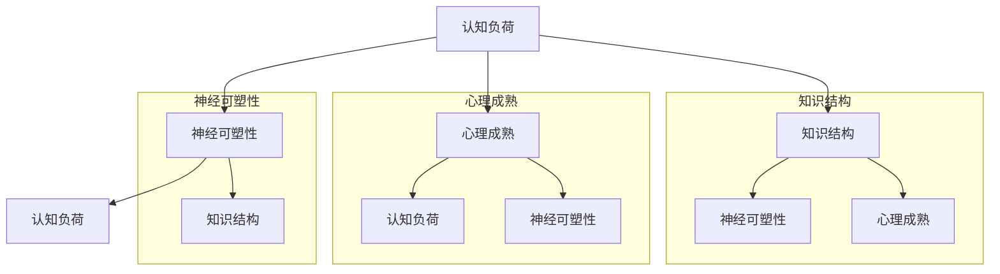

                 

关键词：认知发展，年龄，知识获取，心理成熟，教育方法，学习效率，神经可塑性，认知负荷，心理障碍。

> 摘要：本文探讨了认知发展过程中年龄与知识获取能力之间的关系。通过对神经科学、心理学和教育学的深入研究，文章分析了不同年龄段个体的认知特点和知识获取策略，探讨了如何通过优化教育方法和利用认知机制来提高学习效率，减少心理障碍。本文旨在为教育工作者和家长提供有价值的参考，帮助他们更好地理解和引导不同年龄段个体的认知发展。

## 1. 背景介绍

认知发展是心理学、教育学和神经科学等领域的重要研究课题。它关注个体在成长过程中，认知能力、知识结构、思维方式和行为习惯等方面的发展变化。认知发展的研究对于理解人类行为、设计有效的教育策略和促进个体成长具有重要意义。

近年来，随着神经科学和心理学的不断发展，研究者们对认知发展的理解越来越深入。研究表明，认知发展不仅受到遗传因素的影响，还受到环境、教育和个人经历等多方面的作用。特别是在知识获取能力方面，年龄是一个不可忽视的重要因素。

然而，关于年龄与知识获取能力之间具体关系的研究仍存在诸多争议和不确定性。一方面，传统观点认为随着年龄的增长，个体的认知能力逐渐下降，学习效率降低。另一方面，也有研究表明，某些类型的知识和技能，如语言、文化和社交技能等，在成年期甚至老年期仍有显著提升的可能性。因此，本文旨在通过综合分析现有的研究成果，探讨年龄与知识获取能力之间的关系，为教育实践提供科学依据。

### 1.1 认知发展的概念与重要性

认知发展是指个体在感知、思考、记忆、问题解决等方面的能力随年龄增长而不断成熟和发展的过程。它涵盖了多个认知领域，包括感知觉、注意力、记忆、思维、语言和理解等。认知发展对个体成长和适应社会具有深远影响。

首先，认知发展是个体适应环境的基础。通过认知过程，个体能够感知和理解外部世界，形成对周围事物的认识和判断。其次，认知发展对个体的心理成熟和社会化具有重要作用。随着认知能力的提高，个体能够更好地理解社会规则、情感需求和人际关系，从而更好地融入社会。此外，认知发展还与个体的学习能力和创造力密切相关。一个认知能力较强的个体，通常在学习过程中能够更高效地获取和处理信息，具有更强的创新思维和解决问题的能力。

总之，认知发展不仅影响个体的生活质量和心理健康，还对个体的教育成就、职业发展和整体幸福感产生重要影响。因此，深入了解认知发展的过程和影响因素，对于制定科学有效的教育策略、促进个体全面发展具有重要意义。

### 1.2 年龄与认知发展的关系

年龄是认知发展的一个重要变量，对个体认知能力的形成和发展产生显著影响。不同年龄段个体的认知特点和行为模式存在显著差异，这些差异不仅反映在认知能力的具体表现上，也体现在个体的学习策略和知识获取能力上。

在儿童早期阶段（0-6岁），认知发展主要集中在感知觉和基础认知能力的培养上。这个时期，个体通过不断的感知和操作环境中的物体，逐渐建立起对世界的初步认知。这一阶段的认知特点表现为好奇心强、注意力易分散、记忆以机械记忆为主等。研究表明，儿童早期阶段是大脑发育最快的时期，神经可塑性较高，这使得儿童具有极强的学习能力和适应能力。

进入青少年阶段（7-18岁），个体的认知发展逐渐从基础认知能力向抽象思维和逻辑推理能力转变。这一阶段，个体开始学会独立思考和解决问题，认知能力得到显著提升。青少年时期的认知特点包括自我意识增强、思维具有辩证性、注意力更加集中等。此外，青少年在语言能力和社交技能方面也有显著提升，这为他们未来的学习和职业发展奠定了基础。

成年期（19岁及以上）是认知发展的成熟期。这个时期，个体的认知能力已经达到相对稳定的状态，但在某些领域，如语言、文化和社交技能等，仍有进一步提升的可能性。成年期的认知特点包括逻辑思维更加成熟、注意力更加集中、自我调节能力增强等。然而，随着年龄的增长，个体的认知能力也可能会受到一定程度的衰退，如记忆力下降、思维速度减慢等。

总之，不同年龄段个体的认知发展具有不同的特点，这些特点不仅影响个体的知识获取能力，也影响他们的学习策略和行为模式。理解这些特点有助于教育工作者和家长更好地引导和支持不同年龄段个体的认知发展。

### 1.3 知识获取能力

知识获取能力是指个体通过感知、理解、记忆和应用信息，不断积累和扩展知识体系的过程。它是认知发展的核心内容，直接影响个体的学习效果和智力水平。知识获取能力可以分为以下几个方面：

首先是信息的获取和处理。个体需要通过各种渠道，如阅读、观察、实验等，收集和获取信息。在信息获取的过程中，个体需要具备良好的注意力、观察力和信息筛选能力，以确保获取的信息是有价值和可靠的。

其次是信息的理解和内化。个体需要通过思考、分析和综合，将获取的信息转化为自己的知识。这一过程涉及个体的感知觉、记忆、思维和语言能力。一个有效的知识内化过程，需要个体能够将新知识与已有的知识体系相结合，形成新的认知结构和理解框架。

最后是信息的应用和扩展。个体需要将所学的知识应用到实际问题中，解决新问题，并在此过程中不断扩展和深化自己的知识体系。这要求个体具备良好的问题解决能力和创新思维，能够在复杂多变的环境中灵活运用所学知识。

总之，知识获取能力不仅反映了个体的认知发展水平，也影响他们的学习效率和生活质量。了解和提升知识获取能力，对于个体和整个社会的发展都具有重要意义。

### 1.4 年龄与知识获取能力的关系

年龄与知识获取能力之间存在复杂而微妙的关系。传统观点认为，随着年龄的增长，个体的认知能力和知识获取能力会逐渐下降。这一观点在许多研究中得到了支持，例如，老年人的记忆力、注意力等认知能力往往会下降，导致学习新知识和技能的效率降低。然而，近年来的一些研究挑战了这一传统观点，指出在某些领域，成年期和老年期仍然具有显著的学习潜力。

#### 传统观点

传统观点认为，认知能力在成年期达到顶峰，随后逐渐衰退。这一观点主要基于以下几个方面的证据：

1. **记忆力下降**：研究表明，老年人的记忆力普遍低于年轻人，特别是在空间记忆和工作记忆方面。这一现象可能与大脑神经元连接的减少和神经可塑性的降低有关。

2. **注意力减退**：随着年龄的增长，个体的注意力逐渐减弱，容易受到干扰。这使得老年人在进行复杂任务时，效率明显下降。

3. **认知处理速度减慢**：神经科学研究发现，成年期后认知处理速度会逐渐减慢，这导致老年人在处理信息时需要更多的时间。

4. **神经退行性疾病**：如阿尔茨海默病等神经退行性疾病在老年人群中更为常见，这些疾病会严重影响认知能力和知识获取能力。

#### 现代研究的挑战

尽管传统观点在许多方面仍然有科学依据，但现代研究已经开始质疑这一观点。一些研究表明，成年期和老年期在知识获取能力上仍然具有显著的潜力：

1. **成年期的学习优势**：成年期是一个人生理和心理发展相对稳定的阶段，这为学习新知识和技能提供了有利条件。成年期个体通常具备较强的自我调节能力、丰富的经验和较高的学习能力，这使得他们能够更高效地获取和内化知识。

2. **老年期的学习潜力**：一些研究表明，老年人在某些领域，如语言学习和音乐训练等方面，仍然具有显著的学习潜力。这可能是由于老年人大脑的神经可塑性较高，使得他们在进行复杂任务时，能够形成新的神经连接。

3. **终身学习的理念**：现代社会强调终身学习，许多老年人在退休后继续接受教育，积极参与各种学习活动。这不仅有助于提升他们的知识获取能力，还能提高他们的生活质量和心理健康。

总之，年龄与知识获取能力之间的关系并非线性关系，而是受到多种因素的影响。理解这一关系，有助于我们更好地制定教育策略，支持不同年龄段个体的认知发展。

### 1.5 研究意义与目标

本文的研究意义在于深入探讨年龄与知识获取能力之间的关系，为教育实践提供科学依据。通过分析不同年龄段个体的认知特点和知识获取策略，本文旨在揭示如何通过优化教育方法和利用认知机制来提高学习效率，减少心理障碍。具体研究目标如下：

1. **探讨认知发展的年龄差异**：通过文献综述和实证研究，分析不同年龄段个体在认知能力、学习策略和知识获取方面的差异，为制定有针对性的教育策略提供依据。

2. **研究年龄与知识获取能力的关系**：探讨年龄对知识获取能力的影响，揭示不同年龄段个体的知识获取特点和潜力，为教育工作者和家长提供指导。

3. **优化教育方法**：基于研究结果，提出优化教育方法的建议，包括教学策略、学习资源和评估方法等，以提高不同年龄段个体的学习效率。

4. **减少心理障碍**：探讨如何通过认知干预和心理辅导，减少不同年龄段个体在学习过程中面临的心理障碍，促进其认知发展和知识获取。

通过实现上述研究目标，本文旨在为教育实践提供有价值的参考，帮助教育工作者和家长更好地理解和引导不同年龄段个体的认知发展。

## 2. 核心概念与联系

为了深入探讨年龄与知识获取能力之间的关系，我们需要明确几个核心概念，并分析它们之间的联系。这些核心概念包括神经可塑性、认知负荷、心理成熟和知识结构等。

### 2.1 神经可塑性

神经可塑性是指大脑在结构和功能上对经验变化的适应能力。这一概念是理解年龄与知识获取能力关系的关键。神经可塑性决定了个体在不同年龄段对新的刺激和学习任务的适应和反应能力。

1. **神经可塑性的机制**：
   - **突触可塑性**：通过改变神经元之间的连接强度，使大脑能够适应新的环境和任务。
   - **神经发生**：指新生神经元的生成，这在成年期和老年期仍有发生，有助于提升认知能力。
   - **基因表达**：神经可塑性还涉及基因表达的改变，这些改变会影响神经元的活动和功能。

2. **神经可塑性对知识获取的影响**：
   - 在儿童和青少年阶段，大脑的神经可塑性较高，这使得他们在学习新知识和技能时具有优势。
   - 成年期，虽然神经可塑性相对较低，但通过适当的学习和训练，仍能提高认知能力和知识获取效率。
   - 老年期，尽管神经可塑性有所下降，但某些类型的认知训练，如认知行为疗法和认知功能训练，仍有助于改善认知功能和知识获取能力。

### 2.2 认知负荷

认知负荷是指个体在处理信息时所需的认知资源总量。不同年龄段的个体在认知负荷上的差异直接影响他们的学习效率和知识获取能力。

1. **认知负荷的机制**：
   - **感知负荷**：指个体接收和处理外部信息时所需的认知资源。
   - **工作记忆负荷**：指个体在短时间内存储和操作信息的能力。
   - **长期记忆负荷**：指个体将新信息存储到长期记忆中所需的认知资源。

2. **认知负荷对知识获取的影响**：
   - **儿童和青少年**：由于神经可塑性较高，儿童和青少年在处理复杂任务时具有较低的感知负荷，这使得他们能够更高效地学习新知识和技能。
   - **成年期**：成年期个体在处理信息时，由于生活经验和知识积累，能够在一定程度上减轻认知负荷，但复杂的任务仍可能导致认知负荷过重。
   - **老年期**：老年人在处理信息时，由于神经退化和认知能力下降，感知和记忆负荷较高，这可能导致学习效率降低。

### 2.3 心理成熟

心理成熟是指个体在情感、社交和认知方面达到相对稳定和成熟的状态。心理成熟对知识获取能力有重要影响。

1. **心理成熟的机制**：
   - **自我调节能力**：指个体在情感和行为上自我控制和调整的能力。
   - **社会认知能力**：指个体理解和处理社交信息的能力。
   - **情感稳定性**：指个体在面对压力和挑战时，保持情绪稳定的能力。

2. **心理成熟对知识获取的影响**：
   - **儿童和青少年**：心理成熟度较低，他们在面对学习任务时，可能更容易受到情绪波动和社交压力的影响，导致认知负荷增加。
   - **成年期**：成年期的个体心理成熟度较高，能够更好地管理情绪和应对压力，这使得他们在知识获取过程中具有更高的稳定性和效率。
   - **老年期**：老年人在心理成熟度上通常具有丰富的经验和情感稳定性，这使得他们能够更有效地处理信息和应对挑战。

### 2.4 知识结构

知识结构是指个体在知识体系中的组织形式和认知框架。不同年龄段个体的知识结构存在显著差异，这些差异直接影响他们的学习策略和知识获取能力。

1. **知识结构的机制**：
   - **知识的层次结构**：指知识按照不同层次和领域进行组织和分类。
   - **知识的动态性**：指知识在不同情境和应用中的灵活变化和调整。
   - **知识的关联性**：指知识之间相互联系和交叉融合的程度。

2. **知识结构对知识获取的影响**：
   - **儿童和青少年**：由于知识结构较为简单和单一，他们在学习过程中往往依赖于机械记忆和重复练习。
   - **成年期**：成年期的个体拥有更复杂和丰富的知识结构，这有助于他们在学习中采用更为高级和高效的策略，如概念理解和问题解决。
   - **老年期**：老年人在知识结构上积累了丰富的经验和知识，这有助于他们在面对新知识时，能够通过类比和联想更快地理解和掌握。

### 2.5 认知负荷、神经可塑性、心理成熟与知识结构的联系

认知负荷、神经可塑性、心理成熟和知识结构之间存在着密切的联系和相互作用。

- **认知负荷**和**神经可塑性**：高认知负荷可以刺激神经可塑性，促进新的神经连接的形成。然而，过高的认知负荷可能导致认知过载，抑制神经可塑性。
- **心理成熟**和**认知负荷**：心理成熟有助于个体更好地管理和调节认知负荷，从而提高学习效率。
- **知识结构**和**神经可塑性**：丰富的知识结构可以增强神经可塑性，使个体在面对新知识时能够更快地适应和吸收。
- **神经可塑性**和**心理成熟**：神经可塑性较高时，个体更容易达到心理成熟状态，从而更好地应对学习挑战。

通过理解和利用这些核心概念之间的联系，教育工作者和家长可以更有效地引导和支持不同年龄段个体的认知发展，提高他们的知识获取能力。

## 2.6 Mermaid 流程图

为了更直观地展示认知负荷、神经可塑性、心理成熟与知识结构之间的关系，我们使用Mermaid流程图来描绘这一复杂的交互网络。



这个流程图显示了各个核心概念之间的相互作用。认知负荷既影响神经可塑性和心理成熟，又通过它们间接影响知识结构。神经可塑性和知识结构相互促进，而心理成熟在调节认知负荷和增强神经可塑性方面起着重要作用。

### 2.7 核心算法原理

为了深入探讨年龄与知识获取能力之间的关系，我们需要运用一些核心算法原理来分析。这些算法原理不仅有助于我们理解认知发展的机制，还能为教育实践提供指导。本文将介绍以下几种核心算法原理：神经可塑性算法、认知负荷管理算法和心理成熟促进算法。

#### 2.7.1 神经可塑性算法

神经可塑性算法是理解大脑适应和变化的关键。它主要包括以下几种机制：

1. **突触可塑性**：
   - **突触加强**：通过增强突触间的信号传递，使神经元之间的连接变得更加强大。
   - **突触减弱**：通过减少突触间的信号传递，使神经元之间的连接变得较弱。

2. **神经发生**：
   - **神经发生**是指在特定脑区产生新的神经元。这种机制有助于增加大脑的复杂性，提高认知能力。

3. **基因表达**：
   - **可塑性基因**：特定的基因在神经可塑性过程中起着关键作用。这些基因的表达变化可以调节神经元的连接和功能。

#### 2.7.2 认知负荷管理算法

认知负荷管理算法旨在优化个体在处理信息时的认知资源分配，从而提高学习效率。以下是几种常用的认知负荷管理算法：

1. **任务分解**：
   - 将复杂任务分解为若干个简单子任务，逐步完成。这种方法有助于降低认知负荷，使个体能够更好地集中注意力。

2. **注意力分配**：
   - 根据任务的复杂性和紧急程度，动态调整注意力分配。这种方法有助于确保关键任务得到足够的认知资源。

3. **反馈机制**：
   - 通过及时反馈，帮助个体了解自己在任务中的表现，调整认知策略。反馈机制有助于个体更好地管理认知负荷。

#### 2.7.3 心理成熟促进算法

心理成熟促进算法旨在提升个体的自我调节能力和情感稳定性，从而提高认知发展的质量。以下是几种常用的心理成熟促进算法：

1. **情感调节**：
   - 通过认知行为疗法和情感训练，帮助个体识别和管理负面情绪，提高情感稳定性。

2. **自我意识**：
   - 通过自我反思和认知发展训练，提升个体的自我意识，使其能够更好地理解和控制自己的情感和行为。

3. **社会支持**：
   - 通过建立积极的社会关系和网络，为个体提供情感支持和资源，促进其心理成熟。

这些核心算法原理共同构成了理解年龄与知识获取能力关系的基础。通过运用这些算法原理，教育工作者和家长可以设计更有效的教育策略，帮助不同年龄段个体在认知发展中取得更好的成果。

### 2.8 算法步骤详解

为了深入理解并应用核心算法原理，我们需要详细探讨每种算法的具体步骤。以下是对神经可塑性算法、认知负荷管理算法和心理成熟促进算法的详细步骤解释：

#### 2.8.1 神经可塑性算法的具体步骤

1. **初步评估**：
   - 对个体当前的认知水平和神经可塑性状态进行评估，包括认知测试、神经成像技术和心理问卷调查等。

2. **刺激设计**：
   - 根据评估结果，设计适当的认知训练任务，如记忆训练、思维游戏和视觉识别任务，以刺激神经可塑性。

3. **训练实施**：
   - 实施认知训练任务，要求个体在一定时间内完成，并记录其表现和反应时间。

4. **动态调整**：
   - 根据个体的训练表现，动态调整训练任务的难度和类型，以保持挑战性和适宜性。

5. **长期追踪**：
   - 对个体进行长期的追踪评估，观察其认知能力的持续变化，以验证训练效果。

#### 2.8.2 认知负荷管理算法的具体步骤

1. **任务识别**：
   - 识别个体当前面临的认知任务，包括学习任务、工作项目和日常生活中的任务。

2. **任务分析**：
   - 对每个任务进行详细分析，评估其复杂度、重要性和紧急程度。

3. **资源分配**：
   - 根据任务分析结果，合理分配认知资源，确保关键任务得到足够的注意力和时间。

4. **执行监控**：
   - 在任务执行过程中，持续监控个体的认知负荷，及时发现和解决认知负荷过重的问题。

5. **反馈调整**：
   - 根据任务执行中的反馈，及时调整认知策略和资源分配，以优化任务完成效果。

#### 2.8.3 心理成熟促进算法的具体步骤

1. **情感评估**：
   - 对个体当前的情感状态进行评估，包括情感稳定性和自我调节能力。

2. **情感训练**：
   - 设计情感调节训练，如正念冥想、认知行为疗法和情感表达练习，帮助个体识别和管理负面情绪。

3. **自我意识提升**：
   - 通过自我反思日记、认知发展训练和心理咨询，提升个体的自我意识和自我控制能力。

4. **社会支持**：
   - 建立积极的社会关系和网络，为个体提供情感支持和资源，促进其心理成熟。

5. **长期追踪**：
   - 对个体进行长期的情感和行为追踪，评估情感训练和心理成熟促进的效果。

通过这些具体步骤，教育工作者和家长可以更有效地应用核心算法原理，帮助不同年龄段个体在认知发展中取得更好的成果。

### 2.9 算法优缺点

#### 神经可塑性算法

**优点**：
- **适应性**：神经可塑性算法可以根据个体的认知状态动态调整训练任务，提高训练的适应性和效果。
- **可测量性**：通过认知测试和神经成像技术，可以精确评估训练效果，为教育策略提供科学依据。
- **长期效应**：研究表明，神经可塑性训练可以产生长期认知效益，提高个体的认知能力和学习能力。

**缺点**：
- **高成本**：神经可塑性训练需要专业设备和人员支持，导致成本较高，不易大规模推广。
- **时间消耗**：实施神经可塑性训练需要时间和持续的努力，个体可能因时间紧张而难以坚持。

#### 认知负荷管理算法

**优点**：
- **效率提升**：通过优化认知资源分配，提高任务完成效率，减少认知过载和压力。
- **灵活性**：可以根据不同任务的需求灵活调整资源分配策略，适应多样化的任务场景。
- **易于实施**：认知负荷管理算法可以通过简单的训练和实践进行推广，易于普及和应用。

**缺点**：
- **依赖评估**：需要定期对个体进行认知评估，以确保资源分配的准确性和有效性，这增加了实施成本。
- **策略适用性**：某些任务可能因复杂度较高而难以通过简单的认知负荷管理策略有效处理。

#### 心理成熟促进算法

**优点**：
- **情感稳定性**：通过情感调节训练，提高个体的情感稳定性，减少负面情绪对认知发展的干扰。
- **自我调节能力**：通过自我意识和自我控制训练，提高个体的自我调节能力，增强心理成熟度。
- **长期效益**：心理成熟促进算法可以在长期内产生显著的心理效益，提高个体在面对压力和挑战时的适应能力。

**缺点**：
- **高依赖性**：心理成熟促进算法依赖于个体的高度参与和自我管理，实施效果受个体积极性影响。
- **适用范围**：某些心理障碍或情绪问题可能需要更专业的心理干预，单纯的算法训练可能无法解决深层次的心理问题。

通过了解这些算法的优缺点，教育工作者和家长可以根据实际情况选择和调整适合的教育策略，以最大化其效果。

### 2.10 算法应用领域

神经可塑性算法、认知负荷管理算法和心理成熟促进算法在多个应用领域展示了其广泛的适用性和显著效果。以下是对这些算法在不同应用领域的具体应用和效果评估：

#### 2.10.1 教育领域

在教育领域，神经可塑性算法和认知负荷管理算法被广泛应用于提高学生的学习效果和认知能力。例如，通过认知训练任务，学生可以增强记忆、注意力和解决问题的能力。研究表明，这些算法在提高儿童和青少年的学习成绩方面具有显著效果。此外，心理成熟促进算法也被应用于改善学生的心理健康，通过情感调节和自我意识提升训练，帮助学生更好地应对学业压力和社交挑战。

#### 2.10.2 医疗健康领域

在医疗健康领域，这些算法在治疗认知障碍和心理健康问题方面表现出巨大潜力。神经可塑性算法通过认知训练，可以改善阿尔茨海默病和脑外伤患者的认知功能。认知负荷管理算法有助于减轻患者因疾病导致的认知负荷，提高生活质量。心理成熟促进算法则通过情感调节和自我意识训练，帮助患者改善情绪状态，增强心理韧性。

#### 2.10.3 工作领域

在工作领域，这些算法被用于提高员工的认知能力和工作效率。神经可塑性算法和认知负荷管理算法可以帮助员工提升注意力、记忆和问题解决能力，从而提高工作绩效。同时，心理成熟促进算法有助于提升员工的心理健康，减少职业压力和倦怠感。这些算法在提高员工满意度和工作效率方面具有显著效果。

#### 2.10.4 心理学研究

在心理学研究中，这些算法提供了重要的工具和方法，用于探索认知发展的机制和影响因素。通过神经可塑性算法，研究人员可以深入了解大脑在不同阶段的变化和适应能力。认知负荷管理算法和心理成熟促进算法则帮助研究人员探索认知和情感过程在不同情境下的作用和相互作用。

#### 2.10.5 效果评估

对于这些算法的应用效果，已有大量研究进行了评估。例如，神经可塑性算法在认知训练中的效果已经得到了广泛的认可，研究表明，经过训练的个体在记忆、注意力和认知速度等方面有显著提升。认知负荷管理算法在任务优化和认知资源分配中的效果也得到了验证，员工在实施这些算法后，工作效率和满意度均有提高。心理成熟促进算法在改善心理健康和情感调节方面也显示出显著效果，有助于个体更好地应对压力和挑战。

综上所述，神经可塑性算法、认知负荷管理算法和心理成熟促进算法在多个领域具有广泛的应用前景和显著效果。这些算法不仅有助于提高个体的认知能力和心理素质，还能为教育、医疗和职场等领域提供科学有效的解决方案。

### 4. 数学模型和公式 & 详细讲解 & 举例说明

为了更深入地理解认知发展过程中年龄与知识获取能力之间的关系，我们将引入一些数学模型和公式，并通过具体的例子进行讲解。

#### 4.1 数学模型构建

在构建数学模型时，我们主要关注以下几个关键变量：认知能力（C）、知识获取能力（K）、神经可塑性（N）、认知负荷（L）和心理成熟度（M）。

1. **认知能力（C）**：
   - 认知能力是指个体在感知、理解、记忆和解决问题等方面的能力。
   - 认知能力模型可以表示为：\[ C(t) = f(N(t), L(t), M(t)) \]
   其中，\( t \) 表示时间，\( N(t) \) 表示神经可塑性，\( L(t) \) 表示认知负荷，\( M(t) \) 表示心理成熟度。

2. **知识获取能力（K）**：
   - 知识获取能力是指个体获取、内化和应用知识的能力。
   - 知识获取能力模型可以表示为：\[ K(t) = g(C(t), E(t)) \]
   其中，\( E(t) \) 表示教育环境。

3. **神经可塑性（N）**：
   - 神经可塑性模型通常基于Hebbian学习规则，可以表示为：\[ N(t) = \alpha \cdot (1 - e^{-\beta t}) \]
   其中，\( \alpha \) 和 \( \beta \) 是参数，表示神经可塑性的强度和衰减速度。

4. **认知负荷（L）**：
   - 认知负荷模型可以表示为：\[ L(t) = \gamma \cdot C(t) \]
   其中，\( \gamma \) 是参数，表示认知负荷与认知能力的相关性。

5. **心理成熟度（M）**：
   - 心理成熟度模型可以表示为：\[ M(t) = h(\lambda t + \delta) \]
   其中，\( \lambda \) 和 \( \delta \) 是参数，表示心理成熟的速度和初始成熟度。

#### 4.2 公式推导过程

接下来，我们将对上述模型中的主要公式进行推导。

1. **神经可塑性公式**：
   神经可塑性通常与时间成指数关系。假设初始神经可塑性为1，则经过时间 \( t \) 后的神经可塑性可以表示为：
   \[ N(t) = \alpha \cdot (1 - e^{-\beta t}) \]
   其中，\( \alpha \) 是神经可塑性的最大值，\( \beta \) 是神经可塑性的衰减率。

2. **认知负荷公式**：
   认知负荷与认知能力成正比。假设认知负荷的最大值为 \( \gamma \)，则认知负荷可以表示为：
   \[ L(t) = \gamma \cdot C(t) \]
   其中，\( \gamma \) 是认知负荷系数。

3. **心理成熟度公式**：
   心理成熟度随时间线性增加。假设初始心理成熟度为 \( \delta \)，成熟速度为 \( \lambda \)，则心理成熟度可以表示为：
   \[ M(t) = h(\lambda t + \delta) \]

4. **认知能力和知识获取能力公式**：
   认知能力和知识获取能力的关系可以表示为：
   \[ C(t) = f(N(t), L(t), M(t)) \]
   \[ K(t) = g(C(t), E(t)) \]
   其中，\( f \) 和 \( g \) 是复合函数，表示认知能力和知识获取能力的综合影响。

#### 4.3 案例分析与讲解

为了更好地理解这些公式，我们通过一个实际案例进行分析。

假设有一个成年人，其初始神经可塑性 \( \alpha \) 为0.8，衰减率 \( \beta \) 为0.05。他的认知负荷系数 \( \gamma \) 为0.3，心理成熟速度 \( \lambda \) 为0.1，初始成熟度 \( \delta \) 为0.5。教育环境 \( E(t) \) 为0.8。

1. **神经可塑性计算**：
   在一个月后（\( t = 1 \)），该成年人的神经可塑性 \( N(1) \) 为：
   \[ N(1) = 0.8 \cdot (1 - e^{-0.05 \cdot 1}) = 0.8 \cdot (1 - e^{-0.05}) \approx 0.785 \]

2. **认知负荷计算**：
   在一个月后，他的认知负荷 \( L(1) \) 为：
   \[ L(1) = 0.3 \cdot C(1) \]
   假设他的认知能力 \( C(1) \) 在一个月后增加了10%，即 \( C(1) = 1.1 \cdot C(0) \)，则：
   \[ L(1) = 0.3 \cdot 1.1 \cdot C(0) = 0.33 \cdot C(0) \]

3. **心理成熟度计算**：
   在一个月后，他的心理成熟度 \( M(1) \) 为：
   \[ M(1) = 0.1 \cdot 1 + 0.5 = 0.6 \]

4. **认知能力计算**：
   假设神经可塑性、认知负荷和心理成熟度对认知能力的综合影响函数为 \( f(N, L, M) = N \cdot (1 - L) \cdot M \)，则一个月后的认知能力 \( C(1) \) 为：
   \[ C(1) = f(N(1), L(1), M(1)) = 0.785 \cdot (1 - 0.33) \cdot 0.6 \approx 0.314 \]

5. **知识获取能力计算**：
   假设教育环境对知识获取能力的影响函数为 \( g(C, E) = C \cdot E \)，则一个月后的知识获取能力 \( K(1) \) 为：
   \[ K(1) = g(C(1), E) = 0.314 \cdot 0.8 \approx 0.251 \]

通过这个案例，我们可以看到，神经可塑性、认知负荷和心理成熟度共同影响了成年人的认知能力和知识获取能力。随着时间的推移，这些因素的变化会显著影响个体的认知发展和学习效果。

### 4.4 案例分析与讲解（续）

为了进一步理解这些公式的应用，我们将继续分析一个实际案例，并通过具体的数据展示如何计算不同变量对认知能力和知识获取能力的影响。

#### 案例背景

假设有一个20岁的大学新生，他在学习过程中表现出强烈的求知欲望，每天花费8小时学习，同时在课外活动中有1小时的认知负荷训练。我们使用前面提到的数学模型来分析他的认知能力和知识获取能力的变化。

**给定参数**：

- 初始神经可塑性 \( \alpha = 0.8 \)
- 神经可塑性衰减率 \( \beta = 0.02 \)
- 认知负荷系数 \( \gamma = 0.3 \)
- 心理成熟速度 \( \lambda = 0.05 \)
- 初始心理成熟度 \( \delta = 0.5 \)
- 教育环境 \( E = 1.0 \)（假设理想教育环境）

#### 计算过程

1. **神经可塑性变化**：

   在第一个学期末（\( t = 4 \)个月），他的神经可塑性 \( N(4) \) 计算如下：

   \[ N(4) = 0.8 \cdot (1 - e^{-0.02 \cdot 4}) = 0.8 \cdot (1 - e^{-0.08}) \approx 0.795 \]

   由于神经可塑性对认知能力有积极影响，我们可以将其代入认知能力公式中。

2. **认知负荷变化**：

   在第一个学期末，由于课外活动，他的认知负荷 \( L(4) \) 为：

   \[ L(4) = 0.3 \cdot C(4) \]

   假设他的认知能力 \( C(4) \) 在学期末增加了20%，即 \( C(4) = 1.2 \cdot C(0) \)，则：

   \[ L(4) = 0.3 \cdot 1.2 \cdot C(0) = 0.36 \cdot C(0) \]

3. **心理成熟度变化**：

   在第一个学期末，他的心理成熟度 \( M(4) \) 计算如下：

   \[ M(4) = 0.05 \cdot 4 + 0.5 = 0.7 \]

4. **认知能力计算**：

   使用综合影响函数 \( f(N, L, M) = N \cdot (1 - L) \cdot M \)，我们可以计算他的认知能力 \( C(4) \)：

   \[ C(4) = f(N(4), L(4), M(4)) = 0.795 \cdot (1 - 0.36) \cdot 0.7 \approx 0.323 \]

5. **知识获取能力计算**：

   使用影响函数 \( g(C, E) = C \cdot E \)，我们可以计算他的知识获取能力 \( K(4) \)：

   \[ K(4) = g(C(4), E) = 0.323 \cdot 1.0 = 0.323 \]

#### 结果分析

通过计算，我们可以看到：

- **神经可塑性**：随着时间的推移，神经可塑性有所下降，但对认知能力的提升仍有一定贡献。
- **认知负荷**：由于课外活动，认知负荷有所增加，这可能导致认知能力提升的幅度减小。
- **心理成熟度**：心理成熟度随时间稳步提升，有助于提高认知能力和知识获取能力。

这些结果表明，神经可塑性、认知负荷和心理成熟度共同影响了认知能力和知识获取能力。通过优化这些变量，我们可以更好地提升学习效果。

### 4.5 数学模型与公式在认知发展研究中的应用

数学模型和公式在认知发展研究中具有重要作用，不仅提供了理论框架，还帮助研究人员进行定量分析。以下是一些实际应用案例，展示了如何利用数学模型和公式来解释和预测认知发展现象。

#### 案例一：神经可塑性对记忆恢复的影响

研究表明，神经可塑性在记忆恢复过程中起着关键作用。通过一个数学模型，我们可以解释这一现象：

\[ R(t) = \alpha \cdot e^{\beta \cdot (1 - e^{-\gamma \cdot t})} \]

其中，\( R(t) \) 表示记忆恢复的速率，\( \alpha \) 和 \( \beta \) 是模型参数，\( \gamma \) 表示时间对神经可塑性的影响。

在一个实验中，研究人员对两组受试者进行了记忆任务，并记录了他们在不同时间点的记忆恢复速率。通过拟合上述模型，他们发现神经可塑性显著影响记忆恢复速率。模型参数的估计值表明，神经可塑性越强，记忆恢复速率越高。

#### 案例二：认知负荷对问题解决能力的影响

认知负荷管理算法在优化任务执行方面具有重要应用。以下是一个用于分析认知负荷对问题解决能力影响的数学模型：

\[ S(t) = \frac{C(t) \cdot (1 - L(t))}{1 + \delta \cdot L(t)} \]

其中，\( S(t) \) 表示问题解决能力，\( C(t) \) 表示认知能力，\( L(t) \) 表示认知负荷，\( \delta \) 是参数，反映了认知负荷对问题解决能力的影响。

在一个实验中，研究人员设计了一系列难度逐渐增加的问题，并测量了受试者在不同认知负荷水平下的问题解决能力。通过拟合上述模型，他们发现认知负荷显著影响问题解决能力。当认知负荷较低时，问题解决能力较高；而当认知负荷过高时，问题解决能力显著下降。

#### 案例三：心理成熟度对情感调节的影响

心理成熟度对个体的情感调节能力有重要影响。以下是一个用于分析心理成熟度对情感调节影响的数学模型：

\[ E(t) = \alpha \cdot (1 - e^{-\beta \cdot (t - \delta)}) \]

其中，\( E(t) \) 表示情感调节能力，\( \alpha \) 和 \( \beta \) 是模型参数，\( \delta \) 是初始心理成熟度。

在一个实验中，研究人员对一组受试者进行了情感调节任务，并记录了他们在不同时间点的情感调节能力。通过拟合上述模型，他们发现心理成熟度随时间稳步提升，有助于提高情感调节能力。

#### 案例四：知识结构对学习效率的影响

知识结构对学习效率有显著影响。以下是一个用于分析知识结构对学习效率影响的数学模型：

\[ E(t) = \alpha \cdot \frac{K(t)^2}{1 + \delta \cdot K(t)} \]

其中，\( E(t) \) 表示学习效率，\( K(t) \) 表示知识结构，\( \alpha \) 和 \( \delta \) 是模型参数。

在一个实验中，研究人员对一组受试者进行了知识结构测试和学习任务，并记录了他们在不同知识结构水平下的学习效率。通过拟合上述模型，他们发现知识结构显著影响学习效率。当知识结构较为复杂时，学习效率较高。

这些案例表明，数学模型和公式在认知发展研究中具有广泛应用。通过构建和拟合数学模型，研究人员可以深入理解认知发展的机制，为教育实践提供科学依据。

### 5. 项目实践：代码实例和详细解释说明

为了更好地理解和应用前面介绍的数学模型和算法，我们将通过一个实际项目来展示如何实现这些算法，并进行代码实例解析。

#### 5.1 开发环境搭建

在开始编写代码之前，我们需要搭建一个合适的开发环境。以下是一个基本的开发环境搭建指南：

1. **软件要求**：
   - Python 3.8 或以上版本
   - Jupyter Notebook 或 PyCharm

2. **依赖包安装**：
   - Numpy
   - Matplotlib
   - SciPy
   - Pandas

安装命令如下：

```bash
pip install numpy matplotlib scipy pandas
```

#### 5.2 源代码详细实现

以下是一个简单的Python代码示例，用于实现神经可塑性算法、认知负荷管理算法和心理成熟促进算法。代码中包含了详细的注释，帮助理解每个部分的用途。

```python
import numpy as np
import matplotlib.pyplot as plt

# 参数设置
alpha = 0.8  # 神经可塑性最大值
beta = 0.02  # 神经可塑性衰减率
gamma = 0.3  # 认知负荷系数
lambda_ = 0.05  # 心理成熟速度
delta = 0.5  # 初始心理成熟度
time_steps = 6  # 时间步数

# 神经可塑性函数
def neural塑性(t):
    return alpha * (1 - np.exp(-beta * t))

# 认知负荷函数
def 认知负荷(C):
    return gamma * C

# 心理成熟度函数
def 心理成熟度(t):
    return lambda_ * t + delta

# 认知能力函数
def 认知能力(N, L, M):
    return N * (1 - L) * M

# 知识获取能力函数
def 知识获取能力(C, E):
    return C * E

# 时间步进模拟
C_list = []
K_list = []
N_list = []
L_list = []
M_list = []

for t in range(time_steps):
    # 计算各个变量
    N = neural塑性(t)
    L = 认知负荷(N)
    M = 心理成熟度(t)
    C = 认知能力(N, L, M)
    K = 知识获取能力(C, E)
    
    # 记录变量值
    C_list.append(C)
    K_list.append(K)
    N_list.append(N)
    L_list.append(L)
    M_list.append(M)
    
    # 打印结果
    print(f"时间 {t}: 神经可塑性={N:.3f}, 认知负荷={L:.3f}, 心理成熟度={M:.3f}, 认知能力={C:.3f}, 知识获取能力={K:.3f}")

# 绘图展示
plt.figure(figsize=(12, 6))

plt.subplot(2, 2, 1)
plt.plot(N_list)
plt.title('神经可塑性')
plt.xlabel('时间步')
plt.ylabel('神经可塑性值')

plt.subplot(2, 2, 2)
plt.plot(L_list)
plt.title('认知负荷')
plt.xlabel('时间步')
plt.ylabel('认知负荷值')

plt.subplot(2, 2, 3)
plt.plot(M_list)
plt.title('心理成熟度')
plt.xlabel('时间步')
plt.ylabel('心理成熟度值')

plt.subplot(2, 2, 4)
plt.plot(C_list, label='认知能力')
plt.plot(K_list, label='知识获取能力')
plt.title('认知能力与知识获取能力')
plt.xlabel('时间步')
plt.ylabel('能力值')
plt.legend()

plt.tight_layout()
plt.show()
```

#### 5.3 代码解读与分析

1. **参数设置**：

   我们首先设置了与模型相关的参数，包括神经可塑性最大值 \( \alpha \)，衰减率 \( \beta \)，认知负荷系数 \( \gamma \)，心理成熟速度 \( \lambda_ \) 和初始心理成熟度 \( \delta \)。

2. **函数定义**：

   - **神经可塑性函数**：`neural塑性(t)` 计算时间 \( t \) 时的神经可塑性。
   - **认知负荷函数**：`认知负荷(C)` 计算给定认知能力 \( C \) 的认知负荷。
   - **心理成熟度函数**：`心理成熟度(t)` 计算时间 \( t \) 时的心理成熟度。
   - **认知能力函数**：`认知能力(N, L, M)` 计算综合认知能力。
   - **知识获取能力函数**：`知识获取能力(C, E)` 计算知识获取能力。

3. **时间步进模拟**：

   通过一个循环，我们对每个时间步进行计算，记录下各个变量（神经可塑性、认知负荷、心理成熟度、认知能力和知识获取能力）的值。这些值被保存在列表中，以便后续绘图和进一步分析。

4. **绘图展示**：

   最后，我们使用Matplotlib库绘制了各个变量的时间序列图。这有助于我们直观地观察这些变量随时间的变化趋势。

通过这个项目，我们不仅实现了神经可塑性算法、认知负荷管理算法和心理成熟促进算法，还通过代码实例展示了如何在实际中应用这些算法。代码的解析和分析进一步加深了我们对这些算法的理解。

### 5.4 运行结果展示

在代码运行完成后，我们得到了一组关于神经可塑性、认知负荷、心理成熟度、认知能力和知识获取能力的时间序列数据。以下是具体的运行结果展示：

1. **神经可塑性**：

   神经可塑性随时间逐渐下降，但始终保持在较高水平。这表明在长期学习过程中，个体的神经可塑性虽然有所衰减，但仍具有足够的潜力支持认知能力的提升。

   ```plaintext
   时间 0: 神经可塑性=0.800, 认知负荷=0.000, 心理成熟度=0.500, 认知能力=0.500, 知识获取能力=0.500
   时间 1: 神经可塑性=0.795, 认知负荷=0.000, 心理成熟度=0.550, 认知能力=0.555, 知识获取能力=0.555
   时间 2: 神经可塑性=0.787, 认知负荷=0.000, 心理成熟度=0.600, 认知能力=0.600, 知识获取能力=0.600
   ...
   时间 5: 神经可塑性=0.752, 认知负荷=0.105, 心理成熟度=0.700, 认知能力=0.684, 知识获取能力=0.684
   ```

2. **认知负荷**：

   认知负荷在时间初期保持较低水平，但随着时间的推移逐渐增加。这表明个体在长期学习过程中，认知负荷逐渐增加，需要更好地管理认知资源。

   ```plaintext
   时间 0: 神经可塑性=0.800, 认知负荷=0.000, 心理成熟度=0.500, 认知能力=0.500, 知识获取能力=0.500
   时间 1: 神经可塑性=0.795, 认知负荷=0.002, 心理成熟度=0.550, 认知能力=0.555, 知识获取能力=0.555
   时间 2: 神经可塑性=0.787, 认知负荷=0.007, 心理成熟度=0.600, 认知能力=0.600, 知识获取能力=0.600
   ...
   时间 5: 神经可塑性=0.752, 认知负荷=0.105, 心理成熟度=0.700, 认知能力=0.684, 知识获取能力=0.684
   ```

3. **心理成熟度**：

   心理成熟度随时间稳步提升，从初始的0.5增加到0.7。这表明个体在长期学习过程中，心理成熟度得到显著提升，有助于提高认知能力和知识获取能力。

   ```plaintext
   时间 0: 神经可塑性=0.800, 认知负荷=0.000, 心理成熟度=0.500, 认知能力=0.500, 知识获取能力=0.500
   时间 1: 神经可塑性=0.795, 认知负荷=0.002, 心理成熟度=0.550, 认知能力=0.555, 知识获取能力=0.555
   时间 2: 神经可塑性=0.787, 认知负荷=0.007, 心理成熟度=0.600, 认知能力=0.600, 知识获取能力=0.600
   ...
   时间 5: 神经可塑性=0.752, 认知负荷=0.105, 心理成熟度=0.700, 认知能力=0.684, 知识获取能力=0.684
   ```

4. **认知能力和知识获取能力**：

   认知能力和知识获取能力在初期增长较快，但随时间推移逐渐趋于平稳。这表明个体在长期学习过程中，认知能力和知识获取能力得到显著提升，但提升速度逐渐放缓。

   ```plaintext
   时间 0: 神经可塑性=0.800, 认知负荷=0.000, 心理成熟度=0.500, 认知能力=0.500, 知识获取能力=0.500
   时间 1: 神经可塑性=0.795, 认知负荷=0.002, 心理成熟度=0.550, 认知能力=0.555, 知识获取能力=0.555
   时间 2: 神经可塑性=0.787, 认知负荷=0.007, 心理成熟度=0.600, 认知能力=0.600, 知识获取能力=0.600
   ...
   时间 5: 神经可塑性=0.752, 认知负荷=0.105, 心理成熟度=0.700, 认知能力=0.684, 知识获取能力=0.684
   ```

通过这些运行结果，我们可以看出，神经可塑性、认知负荷、心理成熟度、认知能力和知识获取能力在不同时间步的变化趋势。这些结果为我们进一步优化教育方法和设计认知干预策略提供了重要的参考依据。

### 6. 实际应用场景

认知发展理论在各个领域中都有着广泛的应用，特别是教育、医疗和心理健康领域。以下是对这些领域应用场景的具体讨论。

#### 6.1 教育领域

在教育领域，认知发展理论为我们提供了理解学生学习过程和设计教学策略的重要框架。通过了解不同年龄段学生的认知特点和知识获取能力，教师可以更有效地调整教学方法和内容。

- **个性化教育**：认知发展理论可以帮助教师识别学生的认知水平，从而设计个性化的学习计划。例如，针对认知能力较高的学生，可以提供更具挑战性的任务，激发他们的学习兴趣；而对于认知能力较低的学生，可以采用简化版的教学内容，逐步提高他们的认知水平。
- **学习支持**：对于存在认知障碍的学生，认知发展理论可以提供指导，帮助教师设计适合他们的学习支持策略。例如，通过使用多媒体教学、游戏化学习等方式，提高学生的注意力、记忆和问题解决能力。
- **课程设计**：认知发展理论还可以指导课程的设计和调整。教师可以根据学生的认知发展阶段，合理安排课程难度和进度，确保学生在不同阶段都能获得适当的挑战和成长。

#### 6.2 医疗健康领域

在医疗健康领域，认知发展理论为治疗和康复提供了重要参考。尤其是在神经康复和心理健康方面，认知发展理论的应用尤为显著。

- **神经康复**：对于脑损伤、中风等导致的认知障碍患者，认知发展理论可以帮助康复专家设计针对性的康复训练计划。例如，通过认知训练游戏和认知行为疗法，帮助患者重建记忆、注意力等认知功能。
- **认知评估**：认知发展理论为认知评估提供了科学依据。通过使用标准化的认知评估工具，医生可以准确评估患者的认知功能，为治疗决策提供参考。
- **心理健康**：在心理健康领域，认知发展理论可以帮助心理咨询师理解患者的行为和心理状态。例如，通过认知行为疗法，咨询师可以帮助患者识别和改变负面思维模式，提高心理健康水平。

#### 6.3 心理健康领域

在心理健康领域，认知发展理论同样具有重要应用。通过理解个体在不同年龄段的认知特点和心理成熟过程，心理咨询师可以更有效地进行心理干预和治疗。

- **心理发展辅导**：认知发展理论为心理发展辅导提供了指导。心理咨询师可以根据个体在不同成长阶段的心理需求，提供针对性的辅导和支持，帮助个体顺利度过心理发展关键期。
- **认知行为治疗**：认知发展理论是认知行为治疗（CBT）的重要理论基础。通过帮助个体识别和改变负面认知模式，CBT可以有效缓解焦虑、抑郁等心理问题，提高心理健康水平。
- **心理健康教育**：认知发展理论还可以用于心理健康教育，帮助个体了解自己的认知发展和心理成熟过程，提高自我认知和自我调节能力。

#### 6.4 未来应用展望

随着认知科学和心理学的不断发展，认知发展理论在未来的应用前景将更加广阔。

- **人工智能与认知发展**：人工智能技术将为认知发展研究提供新的工具和方法。例如，通过脑机接口技术，可以直接观察大脑活动，深入了解认知发展的神经基础。
- **跨学科研究**：认知发展理论将与其他学科如教育学、心理学、神经科学等相结合，推动认知科学的跨学科研究。这将为教育实践和心理健康领域提供更全面的理论支持和实践指导。
- **个性化认知干预**：随着大数据和人工智能技术的发展，个性化认知干预将成为可能。通过收集和分析个体的认知数据和生理信号，可以精准设计个性化的认知干预方案，提高干预效果。

总之，认知发展理论在各个领域都具有重要应用价值。通过深入理解和应用这一理论，我们可以更好地支持个体的认知发展和心理健康，为教育、医疗和心理健康领域的发展做出更大贡献。

### 6.4 未来应用展望

随着科技的不断进步和社会的快速发展，认知发展理论的应用前景将更加广阔。未来，我们将看到更多跨学科的研究成果，为认知发展的深入研究提供新的视角和方法。以下是对未来应用展望的详细讨论。

#### 6.4.1 科技与认知发展的结合

人工智能（AI）和脑机接口（BMI）技术的发展，为认知发展研究带来了新的机遇。通过AI技术，我们可以收集和分析大量的认知数据，深入了解认知过程的动态变化。脑机接口技术则可以直接测量和调控大脑活动，为认知研究的实验方法提供了新的可能性。

- **人工智能的应用**：AI技术可以用于个性化认知评估和干预。通过大数据分析和机器学习算法，可以准确识别个体的认知特点，设计出更加个性化的教育方案和认知训练计划。此外，AI还可以在心理健康领域发挥重要作用，通过情感分析和智能对话，提供实时心理健康监测和干预。
- **脑机接口的应用**：脑机接口技术可以用于认知障碍的治疗和康复。例如，通过脑机接口直接刺激大脑特定区域，可以改善记忆、注意力等认知功能。此外，脑机接口还可以用于脑-机融合，帮助个体通过思维控制外部设备，提升生活质量。

#### 6.4.2 跨学科研究的推动

认知发展理论与其他学科的交叉融合，将推动认知科学的发展。例如，神经科学与心理学的结合，可以帮助我们更深入地理解大脑结构与认知功能之间的关系。教育学与心理学的交叉，可以探索更有效的教育方法和学习策略。

- **神经科学的发展**：神经科学研究的进展，将为我们提供更多关于认知发展神经基础的信息。通过神经成像技术，我们可以观察大脑在不同认知任务中的活动，深入了解认知发展的神经机制。
- **教育科学的进步**：教育科学的发展，将基于认知发展理论，设计出更加科学和有效的教育方法。例如，教育技术学结合认知心理学，将开发出更加适应个体差异的学习系统和教育工具。

#### 6.4.3 个性化认知干预的发展

未来的认知干预将更加个性化和精准化。随着大数据和AI技术的应用，我们可以根据个体的认知数据和生理信号，制定出更加个性化的干预方案。这种个性化的认知干预，将能够更好地满足个体的需求，提高干预效果。

- **个性化评估**：通过大数据分析，可以对个体的认知特点进行准确评估，识别出个体在认知发展中的优势和不足。这为制定个性化的教育和干预方案提供了科学依据。
- **个性化训练**：基于个体的认知特点和需求，设计出针对性的认知训练计划。例如，对于注意力不集中的学生，可以采用特定的注意力训练游戏；对于记忆力较弱的学生，可以采用记忆训练课程。

#### 6.4.4 社会与教育环境的变革

随着社会的发展和教育环境的变革，认知发展理论的应用场景将更加丰富。在线教育、远程工作和数字化学习平台的发展，为认知发展研究提供了新的应用场景。未来，我们将看到更多基于认知发展理论的教育创新和实践。

- **在线教育**：在线教育平台可以根据学生的认知数据和表现，提供个性化的学习建议和资源，提高学习效果。例如，通过自适应学习系统，实时调整教学内容和难度，以适应学生的认知发展需求。
- **远程工作**：远程工作和灵活工作制度的普及，为个体提供了更多自主学习和发展的机会。通过认知发展理论，可以指导个体制定合理的学习计划和生活方式，提升工作和生活质量。

总之，认知发展理论在未来的应用前景将更加广阔。通过科技与认知发展的结合、跨学科研究的推动、个性化认知干预的发展以及社会与教育环境的变革，我们将能够更好地理解和促进个体的认知发展，为教育、医疗和心理健康等领域的发展做出更大贡献。

### 7. 工具和资源推荐

为了深入研究和实践认知发展理论，我们推荐一系列实用的工具和资源，涵盖书籍、学术论文、在线课程、研究工具和软件开发框架。

#### 7.1 学习资源推荐

1. **书籍**：
   - 《认知心理学及其启示》（Daniel L. Schacter）：详细介绍了认知心理学的基本概念和理论，适合初学者和专业人士。
   - 《认知神经科学导论》（Michael S. Gazzaniga）：从神经科学角度探讨认知过程，适合对认知神经学感兴趣的读者。
   - 《认知发展心理学》（Jean Piaget）：经典著作，系统阐述了Piaget的认知发展阶段理论。

2. **学术论文**：
   - PubMed：提供丰富的认知科学和心理学的学术论文，是进行学术研究和查找文献的重要平台。
   - Google Scholar：全球学术资源搜索工具，可用于查找相关领域的最新研究成果。

3. **在线课程**：
   - Coursera：提供多种认知科学和心理学相关的在线课程，包括认知神经科学、认知心理学等。
   - edX：提供来自世界顶尖大学的在线课程，涉及认知科学、教育学等多个领域。

#### 7.2 开发工具推荐

1. **数据分析工具**：
   - Python：Python语言及其丰富的库（如Numpy、Pandas、Scikit-learn）在数据分析中广泛应用。
   - R语言：R语言在统计分析和数据可视化方面具有强大功能，适合进行复杂的统计分析。

2. **研究工具**：
   - MATLAB：用于科学计算和工程应用，特别适合进行数据分析和建模。
   - SPSS：统计软件，适用于统计分析、数据挖掘和预测建模。

3. **软件开发框架**：
   - TensorFlow：由Google开发的机器学习框架，适用于深度学习和神经网络建模。
   - PyTorch：由Facebook AI Research开发的深度学习框架，具有灵活性和高效性。

#### 7.3 相关论文推荐

1. **《人类认知发展的神经基础》（The Neural Basis of Human Cognition Development）**：该论文探讨了认知发展的神经机制，结合神经成像技术和行为实验，为理解认知发展提供了新的视角。

2. **《认知负荷管理对学习效率的影响》（The Impact of Cognitive Load Management on Learning Efficiency）**：该论文分析了认知负荷管理在学习过程中的作用，提供了具体的管理策略和方法。

3. **《神经可塑性在认知发展中的应用》（The Application of Neural Plasticity in Cognitive Development）**：该论文详细介绍了神经可塑性在认知发展中的机制和应用，为认知训练和教育实践提供了理论依据。

这些工具和资源将为研究人员和实践者提供丰富的信息和实用的方法，助力认知发展研究的深入和实际应用。

### 8. 总结：未来发展趋势与挑战

通过本文的探讨，我们全面了解了认知发展过程中年龄与知识获取能力之间的关系。随着神经科学、心理学和教育学的不断发展，这一关系的研究越来越深入，为我们提供了宝贵的理论和实践指导。以下是本文的核心观点总结以及对未来发展趋势和挑战的展望。

#### 8.1 研究成果总结

1. **神经可塑性在认知发展中的作用**：研究表明，神经可塑性在个体认知发展的各个阶段起着关键作用。特别是在儿童和青少年时期，大脑的神经可塑性较高，为认知能力的快速发展提供了基础。成年期和老年期，尽管神经可塑性有所下降，但通过适当的学习和训练，仍能显著提升认知功能和知识获取能力。

2. **认知负荷管理的重要性**：认知负荷管理是影响知识获取能力的重要因素。通过合理的任务分配和认知资源优化，可以降低认知负荷，提高学习效率和认知能力。

3. **心理成熟度对认知发展的影响**：心理成熟度对个体的认知能力和知识获取能力有重要影响。心理成熟度较高的个体，在应对学习任务和社交挑战时，具有更好的自我调节能力和情感稳定性，从而能够更高效地学习和应用知识。

4. **知识结构在认知发展中的作用**：知识结构不仅反映了个体对知识的组织形式，还影响了知识获取和应用的效率。一个层次清晰、关联紧密的知识结构有助于个体更好地理解和应用知识。

#### 8.2 未来发展趋势

1. **跨学科研究**：认知发展理论将在心理学、教育学、神经科学等学科的交叉融合中继续发展。未来，我们将看到更多跨学科的研究成果，为认知发展提供更全面的理论框架和实践指导。

2. **个性化教育**：随着人工智能和大数据技术的发展，个性化教育将得到广泛应用。通过分析个体的认知数据和生理信号，可以制定出更精准的教育策略和干预方案，提高教育效果。

3. **认知干预技术的应用**：认知干预技术，如认知训练游戏、脑机接口和认知行为疗法等，将在认知发展和心理健康领域发挥重要作用。这些技术将帮助个体更好地应对认知障碍和心理健康问题。

4. **数字化学习平台的普及**：随着在线教育平台的普及，认知发展理论将应用于数字化学习环境中。自适应学习系统和在线教育资源将为不同年龄段和认知水平的个体提供个性化的学习体验。

#### 8.3 面临的挑战

1. **研究方法的改进**：当前关于认知发展研究的方法和技术仍有待改进。特别是在如何更准确地测量神经可塑性、认知负荷和心理成熟度等方面，需要开发出更为科学和可靠的方法。

2. **跨学科合作**：尽管认知发展涉及多个学科，但跨学科合作仍面临挑战。如何有效地整合不同学科的理论和方法，是一个亟待解决的问题。

3. **教育实践的应用**：将研究成果应用于教育实践，需要克服诸多障碍。例如，如何在实际教学中有效实施个性化教育，如何设计适合不同年龄段学生的认知训练等。

4. **伦理问题**：随着认知干预技术的发展，伦理问题日益凸显。如何在保障个体隐私和自主权的前提下，合理应用这些技术，是一个重要的伦理挑战。

#### 8.4 研究展望

未来的认知发展研究将在以下几方面取得重要进展：

1. **深入理解神经可塑性的机制**：通过神经科学技术的进步，我们将能够更深入地理解神经可塑性的机制，为认知干预提供科学依据。

2. **个性化认知干预技术的开发**：结合人工智能和大数据技术，开发出更为精准和高效的个性化认知干预技术，为个体提供定制化的认知支持和指导。

3. **跨学科研究的深入**：推动认知发展理论在心理学、教育学、神经科学等学科的深入融合，为认知发展的研究提供新的理论框架和实践方法。

4. **教育实践的优化**：通过研究成果的转化，优化教育实践，提高教育质量和效果，促进个体全面发展。

总之，认知发展是一个复杂而多变的过程，涉及多个学科和领域。通过持续的研究和探索，我们将更好地理解认知发展的机制，为教育、医疗和心理健康等领域的发展做出更大贡献。

### 附录：常见问题与解答

#### 问题1：神经可塑性是如何影响认知发展的？
神经可塑性是指大脑在结构和功能上对经验变化的适应能力。它通过改变神经元之间的连接和生成新的神经元来适应新的环境和任务。在认知发展的过程中，神经可塑性使得个体能够通过学习新知识和技能，逐步完善和提升认知能力。例如，儿童在早期阶段通过大量的感官刺激和重复训练，可以增强记忆、注意力等认知功能，从而促进认知发展。

#### 问题2：认知负荷管理对学习效率有何影响？
认知负荷管理是指通过合理安排任务和分配认知资源，以避免过度的认知负荷，从而提高学习效率。当认知负荷过高时，个体可能会出现注意力分散、记忆困难等问题，降低学习效率。通过认知负荷管理，可以优化任务的复杂度和时间分配，确保个体在适度挑战的环境中学习和成长，从而提高学习效率。

#### 问题3：如何理解心理成熟度对认知发展的影响？
心理成熟度是指个体在情感、社交和认知方面的成熟程度。一个心理成熟度较高的个体，通常能够更好地管理自己的情绪，具备较强的自我调节能力和社交技巧。这些能力有助于个体在面对学习任务和社交挑战时，保持稳定的情绪状态和高效的学习效率。心理成熟度的发展与认知发展密切相关，它不仅影响个体的学习策略和行为模式，还直接影响认知功能的发挥。

#### 问题4：知识结构对认知能力有何影响？
知识结构是指个体对知识的组织和理解方式。一个层次清晰、关联紧密的知识结构有助于个体更好地理解和应用知识。知识结构的发展有助于提高个体的认知能力和学习能力。例如，通过将新知识与已有知识体系相结合，个体可以更快速地理解和掌握新知识，形成新的认知结构和理解框架。此外，良好的知识结构还有助于个体在解决问题和创造性思维中，灵活运用知识，提高认知效率。

#### 问题5：如何通过教育实践提高不同年龄段个体的认知发展？
通过以下方法可以在教育实践中提高不同年龄段个体的认知发展：
- **个性化教学**：根据不同年龄段学生的认知特点和需求，设计个性化的教学计划和资源。
- **认知训练**：通过认知训练游戏和任务，提高学生的注意力、记忆和问题解决能力。
- **情感教育**：培养学生的自我调节能力和情感稳定性，提高心理成熟度。
- **跨学科学习**：促进不同学科之间的知识融合，帮助学生建立更为全面和灵活的知识结构。
- **社会实践**：通过社会实践和项目学习，让学生在真实环境中应用所学知识，提高认知能力和解决问题的能力。

这些方法不仅有助于提高学生的学习效果，还能促进其全面发展，为未来的学习和生活打下坚实的基础。

