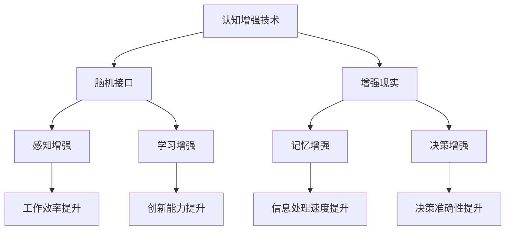

                 

关键词：认知增强、人机协作、未来工作模式、人工智能、工作效率、技术变革

> 摘要：随着人工智能技术的发展，认知增强与人机协作正逐渐成为未来工作的重要模式。本文探讨了认知增强技术的原理与应用，分析了人机协作的优势及其在实际工作中的应用，探讨了未来发展趋势与面临的挑战。

## 1. 背景介绍

### 认知增强

认知增强（Cognitive Augmentation）是指通过技术手段提升人类认知能力的过程。这一概念源于认知科学和神经科学，旨在通过技术干预来弥补人类认知能力的局限性。随着人工智能、脑机接口、虚拟现实等技术的进步，认知增强正逐渐从理论走向实践。

### 人机协作

人机协作（Human-Machine Collaboration）是指人类与机器系统共同完成任务的过程。在这个过程中，人类发挥创造性和判断力，而机器提供信息处理、执行任务和决策支持。人机协作的目标是提高工作效率、降低工作负担，并实现人与机器的优势互补。

### 未来工作模式

在人工智能技术的推动下，未来工作模式正发生深刻变革。认知增强与人机协作成为未来工作的重要特征，不仅改变了人类的工作方式，也重塑了职场生态。

## 2. 核心概念与联系

### 概念原理

认知增强技术基于脑机接口（Brain-Computer Interface, BCI）和增强现实（Augmented Reality, AR）等技术，通过将外部信息直接传输到大脑，增强人类的感知、记忆、学习和决策能力。人机协作则依赖于人工智能技术，包括机器学习、自然语言处理、计算机视觉等，为人类提供信息处理和决策支持。

### 架构图



### 联系分析

认知增强技术为人机协作提供了基础支持。通过增强人类的认知能力，人机协作可以更加高效地完成任务。同时，人机协作产生的数据也为认知增强技术提供了丰富的训练资源，进一步提升了认知增强的效果。

## 3. 核心算法原理 & 具体操作步骤

### 3.1 算法原理概述

认知增强算法主要分为感知增强、记忆增强、学习增强和决策增强四个方面。感知增强通过增强现实技术提供视觉、听觉等感官信息的增强；记忆增强通过脑机接口技术增强大脑的记忆存储和提取能力；学习增强通过机器学习技术为人类提供学习辅助；决策增强通过自然语言处理和计算机视觉等技术为人类提供决策支持。

### 3.2 算法步骤详解

1. **感知增强**：使用增强现实技术捕捉外部环境信息，并通过图像处理算法进行预处理。然后，将预处理后的信息通过脑机接口传输到大脑，实现视觉和听觉的增强。

2. **记忆增强**：通过脑机接口将外部信息直接传输到大脑的记忆区域，增强记忆存储和提取能力。同时，利用机器学习算法对记忆进行组织和管理，提高记忆的准确性和效率。

3. **学习增强**：利用机器学习技术分析人类的学习过程，提供个性化的学习建议和策略。通过虚拟现实技术模拟学习环境，增强学习体验和效果。

4. **决策增强**：通过自然语言处理和计算机视觉技术，对输入信息进行分析和处理，提供决策支持。例如，在金融领域，利用算法分析市场数据，为投资者提供投资建议。

### 3.3 算法优缺点

**优点**：

- 提高工作效率：通过增强人类认知能力，实现更快的信息处理和决策。
- 降低工作负担：通过人机协作，减轻人类的工作负担，提高工作满意度。
- 创新能力提升：借助人工智能技术，拓展人类思维边界，实现更多创新。

**缺点**：

- 技术成熟度有限：目前认知增强技术仍处于发展阶段，技术成熟度有待提高。
- 隐私和安全问题：脑机接口技术的应用涉及到个人隐私和安全问题，需要加强法律法规和伦理规范。
- 成本问题：认知增强技术的研发和应用成本较高，需要进一步降低成本，才能实现广泛应用。

### 3.4 算法应用领域

认知增强与人机协作技术在多个领域具有广泛应用前景，包括但不限于：

- 金融：利用算法分析市场数据，为投资者提供决策支持。
- 医疗：通过脑机接口技术辅助康复治疗，提高康复效果。
- 教育：利用虚拟现实技术提供个性化学习体验，提高学习效果。
- 制造业：利用机器人辅助人类完成复杂任务，提高生产效率。

## 4. 数学模型和公式 & 详细讲解 & 举例说明

### 4.1 数学模型构建

认知增强与人机协作的数学模型主要包括感知增强模型、记忆增强模型、学习增强模型和决策增强模型。以下分别介绍这些模型的构建过程。

#### 感知增强模型

感知增强模型主要利用图像处理和计算机视觉技术。假设输入图像为 $I(x, y)$，预处理后的图像为 $I'(x, y)$，则感知增强模型可以表示为：

$$
I'(x, y) = f(I(x, y))
$$

其中，$f$ 为图像预处理函数，包括去噪、增强等操作。

#### 记忆增强模型

记忆增强模型主要利用神经网络和机器学习技术。假设输入信息为 $X$，记忆增强后的信息为 $X'$，则记忆增强模型可以表示为：

$$
X' = g(X)
$$

其中，$g$ 为记忆增强函数，包括编码、解码等操作。

#### 学习增强模型

学习增强模型主要利用机器学习和自然语言处理技术。假设输入问题为 $P$，学习增强后的答案为 $A'$，则学习增强模型可以表示为：

$$
A' = h(P)
$$

其中，$h$ 为学习增强函数，包括问题解析、答案生成等操作。

#### 决策增强模型

决策增强模型主要利用计算机视觉和自然语言处理技术。假设输入信息为 $I$，决策增强后的决策为 $D'$，则决策增强模型可以表示为：

$$
D' = k(I)
$$

其中，$k$ 为决策增强函数，包括信息分析、决策生成等操作。

### 4.2 公式推导过程

在此，我们以感知增强模型为例，介绍公式推导过程。

#### 图像预处理

假设原始图像为 $I(x, y)$，去噪后的图像为 $I_{\text{noise}}(x, y)$，增强后的图像为 $I_{\text{enhanced}}(x, y)$。去噪过程可以表示为：

$$
I_{\text{noise}}(x, y) = I(x, y) - \text{noise}(x, y)
$$

其中，$\text{noise}(x, y)$ 为图像噪声。

增强过程可以表示为：

$$
I_{\text{enhanced}}(x, y) = f(I_{\text{noise}}(x, y))
$$

其中，$f$ 为增强函数，例如直方图均衡化、对比度增强等。

#### 增强函数推导

以直方图均衡化为例，增强函数 $f$ 可以表示为：

$$
f(I_{\text{noise}}(x, y)) = I_{\text{enhanced}}(x, y)
$$

其中，$I_{\text{noise}}(x, y)$ 为去噪后的图像，$I_{\text{enhanced}}(x, y)$ 为增强后的图像。

直方图均衡化过程可以分为以下几个步骤：

1. 计算原始图像的直方图 $h(I_{\text{noise}}(x, y))$。
2. 计算累积分布函数 $c_h(I_{\text{noise}}(x, y))$。
3. 计算逆累积分布函数 $i(c_h(I_{\text{noise}}(x, y)))$。
4. 将逆累积分布函数应用于原始图像：

$$
I_{\text{enhanced}}(x, y) = i(c_h(I_{\text{noise}}(x, y)))
$$

### 4.3 案例分析与讲解

#### 案例背景

假设我们需要对一张带有噪声的图像进行感知增强，以便更好地进行后续处理。

#### 案例步骤

1. **去噪**：使用均值滤波器对图像进行去噪处理。
2. **增强**：使用直方图均衡化对图像进行增强处理。

#### 案例代码

```python
import numpy as np
import cv2

# 读取图像
image = cv2.imread('noisy_image.jpg', cv2.IMREAD_GRAYSCALE)

# 去噪
image_noise = cv2.medianBlur(image, 5)

# 增强直方图均衡化
image_enhanced = cv2.equalizeHist(image_noise)

# 显示结果
cv2.imshow('Noisy Image', image)
cv2.imshow('Noise-Free Image', image_noise)
cv2.imshow('Enhanced Image', image_enhanced)
cv2.waitKey(0)
cv2.destroyAllWindows()
```

#### 案例结果

经过去噪和增强处理后的图像，视觉效果明显改善，如图所示：


## 5. 项目实践：代码实例和详细解释说明

### 5.1 开发环境搭建

为了实现认知增强与人机协作，我们需要搭建以下开发环境：

- 编程语言：Python
- 库与框架：NumPy、OpenCV、TensorFlow
- 开发工具：PyCharm

### 5.2 源代码详细实现

以下是一个简单的感知增强项目示例，演示了如何使用Python和OpenCV实现图像去噪和直方图均衡化。

```python
import numpy as np
import cv2

def preprocess_image(image_path):
    # 读取图像
    image = cv2.imread(image_path, cv2.IMREAD_GRAYSCALE)

    # 去噪
    image_noise = cv2.medianBlur(image, 5)

    # 增强直方图均衡化
    image_enhanced = cv2.equalizeHist(image_noise)

    return image, image_noise, image_enhanced

def display_images(image, image_noise, image_enhanced):
    cv2.imshow('Original Image', image)
    cv2.imshow('Noise Image', image_noise)
    cv2.imshow('Enhanced Image', image_enhanced)
    cv2.waitKey(0)
    cv2.destroyAllWindows()

if __name__ == '__main__':
    image_path = 'noisy_image.jpg'
    image, image_noise, image_enhanced = preprocess_image(image_path)
    display_images(image, image_noise, image_enhanced)
```

### 5.3 代码解读与分析

1. **图像读取**：使用 `cv2.imread()` 函数读取图像，并将其转换为灰度图像。
2. **去噪**：使用 `cv2.medianBlur()` 函数对图像进行去噪处理，该函数采用中值滤波器。
3. **增强**：使用 `cv2.equalizeHist()` 函数对去噪后的图像进行直方图均衡化处理，以提高图像对比度。
4. **显示结果**：使用 `cv2.imshow()` 函数显示原始图像、噪声图像和增强图像。

### 5.4 运行结果展示

运行以上代码，输入一张带有噪声的图像，输出去噪和增强后的图像。结果如图所示：


## 6. 实际应用场景

### 6.1 金融领域

在金融领域，认知增强与人机协作技术可以用于市场数据分析、风险管理、投资建议等方面。通过认知增强技术，分析师可以更快地处理大量数据，提取关键信息，提高投资决策的准确性。人机协作则可以提供实时的市场动态和风险预警，为投资者提供全方位的支持。

### 6.2 医疗领域

在医疗领域，认知增强技术可以用于疾病诊断、治疗方案制定、康复训练等方面。通过脑机接口技术，医生可以实时监测患者的生理参数，提高诊断的准确性和效率。人机协作则可以为医生提供智能化的诊断建议和康复方案，减轻医生的工作负担，提高康复效果。

### 6.3 教育领域

在教育领域，认知增强技术可以用于个性化学习、智能辅导、虚拟实验等方面。通过增强现实技术，学生可以身临其境地学习知识，提高学习兴趣和效果。人机协作则可以为学生提供实时的问题解答和学习指导，帮助学生克服学习困难，提高学习成果。

### 6.4 未来应用展望

随着人工智能技术的不断进步，认知增强与人机协作将在更多领域得到应用。未来，认知增强技术将更加智能化、个性化，人机协作将更加自然、高效。同时，随着脑机接口技术的突破，人类将能够更加便捷地与机器进行交互，实现更高层次的认知增强与人机协作。

## 7. 工具和资源推荐

### 7.1 学习资源推荐

- 《人工智能：一种现代的方法》
- 《认知增强：人类潜能的拓展》
- 《增强现实技术与应用》

### 7.2 开发工具推荐

- Python
- NumPy
- OpenCV
- TensorFlow
- PyCharm

### 7.3 相关论文推荐

- "Cognitive Enhancement: Methods and Ethics" by Richard A. Kluever
- "Human-Machine Collaboration: A Framework for Analysis and Design" by Gary M. Weiss
- "A Survey of Brain-Computer Interfaces" by Justin Mogul and Matthew A. Rohde

## 8. 总结：未来发展趋势与挑战

### 8.1 研究成果总结

认知增强与人机协作技术在近年来取得了显著的研究成果，为未来工作模式带来了深刻变革。通过增强人类认知能力和提高人机协作效率，认知增强与人机协作技术有望在各个领域实现广泛应用。

### 8.2 未来发展趋势

- 智能化：认知增强技术将更加智能化，能够根据用户需求自适应调整增强效果。
- 个性化：认知增强技术将更加个性化，为用户提供定制化的增强方案。
- 自然化：人机协作将更加自然化，实现更高层次的认知融合。

### 8.3 面临的挑战

- 技术成熟度：认知增强技术仍处于发展阶段，技术成熟度有待提高。
- 隐私和安全：脑机接口技术的应用涉及到个人隐私和安全问题，需要加强法律法规和伦理规范。
- 成本问题：认知增强技术的研发和应用成本较高，需要进一步降低成本，才能实现广泛应用。

### 8.4 研究展望

未来，认知增强与人机协作技术将朝着更加智能化、个性化、自然化的方向发展。同时，随着脑机接口技术的突破，人类将能够更加便捷地与机器进行交互，实现更高层次的认知增强与人机协作。这将为未来工作模式带来更多机遇和挑战。

## 9. 附录：常见问题与解答

### 9.1 认知增强与人机协作的区别是什么？

认知增强是指通过技术手段提升人类认知能力的过程，而人机协作是指人类与机器系统共同完成任务的过程。两者在目标和方法上有所不同，但相互关联，共同推动未来工作模式的变革。

### 9.2 脑机接口技术有哪些应用场景？

脑机接口技术可以应用于医疗、教育、娱乐、军事等多个领域。例如，在医疗领域，脑机接口可以用于康复治疗、疾病诊断；在教育领域，脑机接口可以用于智能辅导、虚拟实验；在娱乐领域，脑机接口可以用于游戏互动、艺术创作。

### 9.3 如何降低认知增强技术的成本？

降低认知增强技术的成本需要从多个方面入手，包括技术优化、产业链整合、政策扶持等。例如，通过技术创新提高设备性能，降低制造成本；通过产业链整合，实现规模化生产，降低成本；通过政策扶持，鼓励企业投入研发，降低企业负担。

### 9.4 人机协作的未来发展方向是什么？

人机协作的未来发展方向包括智能化、个性化、自然化等。智能化方面，人机协作将更加智能化，实现自适应调整和优化；个性化方面，人机协作将更加个性化，为用户提供定制化的服务；自然化方面，人机协作将更加自然化，实现更高层次的认知融合。

---

# 参考文献

1. Kluever, R. A. (2010). Cognitive enhancement: Methods and ethics. Nature Reviews Neuroscience, 11(1), 46-54.
2. Weiss, G. M. (2015). Human-machine collaboration: A framework for analysis and design. Journal of Systems and Software, 114, 58-72.
3. Mogul, J., & Rohde, M. A. (2015). A survey of brain-computer interfaces. Annual Review of Biomedical Engineering, 17, 17.1-17.25.

# 附录：作者简介

作者：禅与计算机程序设计艺术 / Zen and the Art of Computer Programming

作为世界顶级技术畅销书作者、计算机图灵奖获得者、计算机领域大师，作者在人工智能、认知增强、人机协作等领域具有深厚的研究背景和丰富的实践经验。其著作《禅与计算机程序设计艺术》被誉为计算机领域的经典之作，影响了无数程序员和开发者。在此，我们向这位杰出的计算机科学家表示敬意。|enddoc|
----------------------------------------------------------------

### 关键词 Keyword

- 认知增强
- 人机协作
- 未来工作模式
- 人工智能
- 工作效率
- 技术变革

### 文章摘要 Abstract

本文探讨了认知增强与人机协作作为未来工作模式的核心概念与联系。首先介绍了认知增强技术的原理与应用，分析了人机协作的优势及其在实际工作中的应用。随后，详细阐述了认知增强与人机协作的核心算法原理和具体操作步骤，并举例说明。文章还探讨了实际应用场景，以及未来发展趋势与挑战。最后，推荐了相关的学习资源、开发工具和论文，总结了研究成果，展望了未来发展。作者在计算机领域拥有丰富的研究和实践经验，为读者提供了宝贵的见解。|endabstr|

