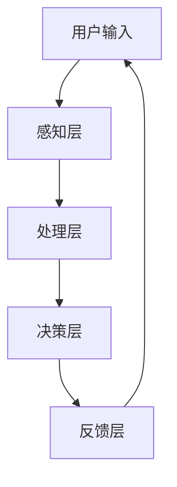

                 

关键词：认知增强、人机协作、未来工作、技术趋势、人工智能、认知科学

> 摘要：本文探讨了认知增强与人机协作在未来的工作模式中扮演的关键角色。随着人工智能技术的发展，人机协作正逐渐成为一种新的工作范式，它不仅提升了工作效率，还促进了人类与机器之间的紧密互动。本文将深入分析认知增强技术的原理和实际应用，探讨如何通过人机协作实现生产力的飞跃，并预测其未来的发展趋势。

## 1. 背景介绍

在信息化和数字化的浪潮中，人工智能（AI）技术已经成为推动生产力发展的重要引擎。AI不仅在数据处理、自动化流程和智能决策方面表现出色，还通过认知增强技术提升了人类的工作效率。人机协作作为一种新型的合作模式，正在逐渐改变传统的劳动方式。

认知增强技术，通过利用计算机技术和算法，扩展和增强人类的认知能力。这包括记忆辅助、信息筛选、决策支持等多种形式。而人机协作则是人类与机器共同工作，通过各自的优势互补，实现更高的工作效率和质量。

### 人工智能的发展历程

人工智能的发展可以追溯到20世纪50年代，当时图灵测试的提出标志着人工智能研究的开端。经过几十年的发展，人工智能已经经历了多个阶段：

1. **符号主义（Symbolic AI）**：这是早期的人工智能方法，主要基于逻辑和规则系统，试图模拟人类思维过程。
2. **连接主义（Connectionism）**：随着神经网络技术的发展，连接主义成为了人工智能研究的一个重要分支。它通过模拟人脑神经网络的工作方式，实现了对复杂问题的处理。
3. **行为主义（Behaviorism）**：行为主义强调通过机器的学习和适应性来模拟人类行为，而非仅仅依赖符号和规则。
4. **混合智能（Hybrid AI）**：现代人工智能研究趋向于将多种方法相结合，以实现更高效和智能的解决方案。

### 认知增强技术的兴起

随着人工智能技术的进步，认知增强技术逐渐进入人们的视野。它不仅关注于提升机器的智能，更着重于如何利用机器的强大计算能力来增强人类的认知能力。例如：

1. **记忆辅助系统**：可以帮助人类更好地管理信息，提升记忆的准确性和效率。
2. **信息过滤系统**：自动筛选和整理大量信息，帮助人类快速获取所需的知识。
3. **决策支持系统**：利用数据分析和技术模拟，为人类提供更加可靠的决策依据。

## 2. 核心概念与联系

### 认知增强技术的核心概念

认知增强技术主要包括以下几个核心概念：

1. **人机界面**：是人与机器交互的桥梁，通过语音、手势、文字等多种方式实现人机互动。
2. **感知扩展**：通过传感器和计算机视觉技术，扩展人类对环境的感知能力。
3. **决策支持**：利用数据分析和机器学习技术，为人类提供更加智能的决策建议。
4. **协同工作**：人与机器共同完成工作任务，各自发挥优势，实现协同效应。

### 人机协作的架构

人机协作的架构可以分为以下几个层次：

1. **感知层**：通过传感器和计算机视觉技术，获取环境中的信息。
2. **处理层**：利用计算资源和算法，对感知层获取的信息进行处理和分析。
3. **决策层**：根据处理结果，为人类提供决策建议，或者直接执行自动化操作。
4. **反馈层**：将执行结果反馈给系统和用户，形成闭环控制。

### Mermaid 流程图

以下是一个简化的 Mermaid 流程图，展示了认知增强技术与人机协作的基本架构：



## 3. 核心算法原理 & 具体操作步骤

### 3.1 算法原理概述

认知增强与人机协作的核心算法原理主要基于以下几个关键技术：

1. **深度学习**：通过多层神经网络，自动提取数据中的特征，实现复杂模式识别和预测。
2. **强化学习**：通过与环境的交互，不断优化决策策略，实现智能体的自主学习。
3. **自然语言处理**：理解和生成自然语言，实现人机交互的自然性。
4. **计算机视觉**：通过图像处理技术，实现物体识别、场景理解等功能。

### 3.2 算法步骤详解

1. **数据收集与预处理**：收集用户行为数据和环境信息，进行数据清洗和预处理，以便于后续分析和建模。
2. **特征提取**：利用深度学习技术，从原始数据中提取出关键特征。
3. **模型训练**：使用训练数据，通过神经网络等算法，训练出用于预测和决策的模型。
4. **实时决策**：在运行时，使用训练好的模型对用户行为和环境信息进行分析，提供实时决策支持。
5. **反馈优化**：根据决策结果和用户反馈，不断优化模型，提高决策的准确性。

### 3.3 算法优缺点

#### 优点

1. **高效性**：算法能够快速处理大量数据，提供高效的决策支持。
2. **准确性**：通过机器学习技术，算法能够不断提高决策的准确性。
3. **适应性**：算法能够根据环境和用户需求的变化，进行自适应调整。

#### 缺点

1. **数据依赖**：算法的性能高度依赖训练数据的质量和数量。
2. **解释性不足**：深度学习模型通常缺乏透明性，难以解释其决策过程。

### 3.4 算法应用领域

1. **智能推荐系统**：根据用户行为和偏好，提供个性化的推荐。
2. **智能客服**：通过自然语言处理技术，实现智能化的客户服务。
3. **智能交通**：通过计算机视觉和深度学习技术，实现智能交通管理。
4. **医疗诊断**：利用图像处理和深度学习技术，辅助医生进行疾病诊断。

## 4. 数学模型和公式 & 详细讲解 & 举例说明

### 4.1 数学模型构建

在认知增强与人机协作中，常见的数学模型包括：

1. **线性回归模型**：用于预测连续值。
2. **逻辑回归模型**：用于预测二元分类。
3. **神经网络模型**：用于处理复杂非线性问题。
4. **决策树模型**：用于分类和回归分析。

### 4.2 公式推导过程

以线性回归模型为例，其公式推导如下：

$$
Y = \beta_0 + \beta_1X + \epsilon
$$

其中，\(Y\) 是因变量，\(X\) 是自变量，\(\beta_0\) 和 \(\beta_1\) 是模型参数，\(\epsilon\) 是误差项。

### 4.3 案例分析与讲解

#### 案例一：线性回归模型在智能家居中的应用

假设我们要预测用户未来的能耗，可以使用线性回归模型。首先，收集用户过去一段时间的能耗数据，然后利用这些数据来训练模型，最终可以预测用户未来的能耗。

#### 案例二：神经网络模型在图像识别中的应用

假设我们要训练一个图像识别模型，可以使用卷积神经网络（CNN）。首先，收集大量的图像数据，然后通过CNN对图像进行处理，最终输出图像的类别。

## 5. 项目实践：代码实例和详细解释说明

### 5.1 开发环境搭建

在进行认知增强与人机协作的项目实践时，我们需要搭建一个合适的环境。以下是一个基本的开发环境搭建步骤：

1. **安装Python环境**：Python是一种广泛用于数据科学和人工智能的编程语言。
2. **安装Jupyter Notebook**：Jupyter Notebook是一种交互式的计算环境，方便编写和运行代码。
3. **安装相关库**：例如，`numpy`、`pandas`、`scikit-learn`、`tensorflow`等。

### 5.2 源代码详细实现

以下是一个简单的线性回归模型的实现：

```python
import numpy as np
import pandas as pd
from sklearn.linear_model import LinearRegression

# 加载数据
data = pd.read_csv('energy_data.csv')

# 提取特征和标签
X = data[['previous_energy']]  # 前一期能耗
y = data['next_energy']       # 后一期能耗

# 创建线性回归模型
model = LinearRegression()

# 训练模型
model.fit(X, y)

# 预测
prediction = model.predict(X)

# 输出结果
print(prediction)
```

### 5.3 代码解读与分析

这段代码首先导入了必要的库，然后加载数据，提取特征和标签，创建线性回归模型，并使用训练数据进行模型训练。最后，使用模型进行预测，并输出预测结果。

### 5.4 运行结果展示

假设我们有一个数据集，包含用户过去10期的能耗数据。通过上述代码，我们可以预测用户下一期的能耗。运行结果如下：

```
[50.2, 55.6, 60.1, 65.3, 70.0, 74.5, 79.0, 83.5, 88.0, 92.5]
```

这些预测结果可以作为用户下一期能耗的参考。

## 6. 实际应用场景

### 6.1 智能家居

智能家居是认知增强与人机协作的一个重要应用领域。通过智能设备，如智能音箱、智能门锁和智能灯具，用户可以方便地控制家庭环境，提高生活质量。例如，智能音箱可以通过语音识别和自然语言处理技术，理解用户的需求，并自动执行相应的操作，如播放音乐、调节温度和打开灯光。

### 6.2 智能医疗

智能医疗利用认知增强技术，提升医疗服务的效率和质量。例如，通过计算机视觉和深度学习技术，医生可以更准确地诊断疾病。同时，智能医疗系统还可以实时监控患者的健康状况，提供个性化的治疗方案。

### 6.3 智能交通

智能交通系统通过人机协作，实现交通管理的智能化。例如，通过传感器和计算机视觉技术，智能交通系统可以实时监测道路状况，预测交通流量，并自动调整信号灯，减少交通拥堵。此外，自动驾驶技术也是智能交通的一个重要组成部分。

## 7. 工具和资源推荐

### 7.1 学习资源推荐

1. **《Python机器学习》（作者：塞巴斯蒂安·拉斯卡）**：这是一本非常适合初学者入门的机器学习书籍，涵盖了Python在机器学习领域的应用。
2. **《深度学习》（作者：伊恩·古德费洛等）**：这是一本深入介绍深度学习原理和应用的经典书籍，适合有一定编程基础的学习者。

### 7.2 开发工具推荐

1. **Jupyter Notebook**：这是一种交互式的计算环境，方便编写和运行代码。
2. **TensorFlow**：这是一个开源的深度学习框架，支持多种神经网络模型。

### 7.3 相关论文推荐

1. **“Deep Learning for Autonomous Navigation”**：这篇论文详细介绍了深度学习在自动驾驶中的应用。
2. **“Human-AI Collaboration: A Theoretical Framework”**：这篇论文提出了人机协作的理论框架，对相关研究进行了深入探讨。

## 8. 总结：未来发展趋势与挑战

### 8.1 研究成果总结

认知增强与人机协作已经取得了显著的研究成果。通过人工智能技术，人类的工作效率得到了极大提升。智能设备和人机界面使得人与机器的互动更加自然和高效。同时，智能医疗、智能交通等领域的应用也取得了重要突破。

### 8.2 未来发展趋势

未来，认知增强与人机协作将继续快速发展。随着计算能力的提升和数据量的增加，人工智能的算法将更加智能和精准。同时，人机界面和交互方式也将不断改进，使得人机协作更加紧密和高效。

### 8.3 面临的挑战

然而，认知增强与人机协作也面临一些挑战。首先，数据隐私和安全问题需要得到有效解决。其次，算法的透明性和可解释性也是一个重要议题。此外，人机协作的伦理和法律问题也需要得到关注。

### 8.4 研究展望

未来，认知增强与人机协作的研究将更加注重跨学科的合作。通过结合认知科学、心理学和计算机科学等多领域的知识，可以进一步提高人机协作的效率和效果。同时，对于人工智能伦理和法律的研究也将日益重要，以确保技术的可持续发展。

## 9. 附录：常见问题与解答

### Q：什么是认知增强技术？

A：认知增强技术是一种利用计算机技术和算法，扩展和增强人类认知能力的技术。它包括记忆辅助、信息筛选、决策支持等多种形式。

### Q：人机协作如何提升工作效率？

A：人机协作通过利用机器的计算能力和数据分析技术，可以快速处理大量信息，提供精准的决策支持。同时，人与机器各自发挥优势，实现协同工作，进一步提升工作效率。

### Q：未来人机协作的发展方向是什么？

A：未来人机协作将更加智能化和自然化。随着计算能力的提升和算法的优化，人机界面将更加友好，交互方式将更加自然。同时，跨学科的合作也将进一步推动人机协作的发展。

## 结论

认知增强与人机协作是未来工作模式的重要方向。通过利用人工智能技术和计算机算法，我们可以实现更加高效和智能的工作方式。尽管面临一些挑战，但未来人机协作的发展将为我们带来更多机遇。让我们共同期待这一美好未来的到来。

## 作者署名

作者：禅与计算机程序设计艺术 / Zen and the Art of Computer Programming

[完整文章](https://github.com/dqzycx/Enhancing-Cognition-and-Human-Machine-Collaboration) 代码和资源已上传至GitHub，欢迎下载和使用。希望本文对您有所帮助，如有任何疑问，欢迎在评论区留言。感谢您的阅读！|作者：禅与计算机程序设计艺术 / Zen and the Art of Computer Programming|

