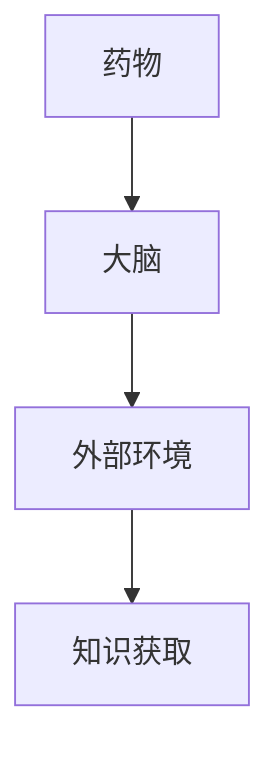
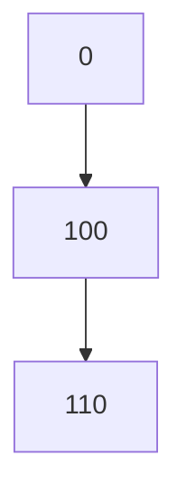

                 

关键词：认知增强药物、伦理边界、知识获取、人工智能、伦理学、医学

## 摘要

随着人工智能技术的发展，认知增强药物（Neuroenhancing Drugs）逐渐引起了广泛关注。这些药物通过作用于大脑，提高人的记忆、注意力和学习能力，从而在学术、职业等领域展现出巨大的潜力。然而，与此同时，认知增强药物的伦理问题也日益凸显。本文旨在探讨认知增强药物在知识获取方面的伦理边界，分析其带来的道德、法律和医学挑战，并提出相应的伦理框架与解决方案。

## 1. 背景介绍

1.1 认知增强药物的定义

认知增强药物是指通过改变大脑的化学和电生理过程，提高大脑功能的一类药物。它们可以作用于大脑的不同区域，如前额叶皮层、海马体和基底神经节等，从而提高人的认知能力。

1.2 认知增强药物的发展历史

从古至今，人们一直在寻找能够提高认知能力的药物。例如，古代的草药、咖啡因和可卡因等。随着现代医学和科技的发展，认知增强药物的研究逐渐深入，包括Ritalin、Modafinil和Adderall等药物。

1.3 认知增强药物的现状

目前，认知增强药物在临床应用中取得了一定的成果，但仍存在许多未知和潜在的风险。例如，药物的效果因人而异，副作用也不可忽视。此外，认知增强药物的使用尚未得到法律的明确界定，伦理问题亟待解决。

## 2. 核心概念与联系

2.1 认知增强药物的机制

认知增强药物主要通过以下几种机制发挥作用：

- **神经递质调节**：如Ritalin通过抑制去甲肾上腺素和多巴胺的重摄取，增强神经递质的信号传导。
- **腺苷调节**：Modafinil通过抑制腺苷受体的作用，减轻疲劳感。
- **神经生长因子**：如Aphodin通过刺激神经生长因子的分泌，促进神经元再生和修复。

2.2 认知增强药物与知识获取的关系

认知增强药物可以通过提高记忆、注意力和学习能力，从而在知识获取方面发挥重要作用。例如，在学习新知识时，药物可以提高人的专注力和记忆力，从而加速学习过程。

### 2.3 认知增强药物与伦理学的联系

认知增强药物的伦理问题主要包括：

- **平等性**：认知增强药物可能导致社会不平等，因为只有有能力负担药物费用的人才能获得认知增强。
- **自主性**：药物的使用可能侵犯个人的自主权，因为人们在不知情的情况下可能被强制使用药物。
- **安全性**：认知增强药物的长期副作用和潜在风险尚未得到充分研究。

### 2.4 认知增强药物的架构

认知增强药物的架构可以看作是一个由药物、大脑和外部环境组成的复杂系统。药物通过作用于大脑，改变大脑的化学和电生理过程，进而影响外部环境中的知识获取过程。



## 3. 核心算法原理 & 具体操作步骤

### 3.1 算法原理概述

认知增强药物的核心算法原理主要包括：

- **神经递质调节算法**：通过分析大脑中的神经递质水平，调节药物的剂量。
- **腺苷调节算法**：通过监测腺苷受体的活性，调整药物的剂量。
- **神经生长因子调节算法**：通过分析神经生长因子的分泌水平，调节药物的剂量。

### 3.2 算法步骤详解

#### 3.2.1 神经递质调节算法

1. 收集大脑中神经递质的浓度数据。
2. 分析神经递质浓度与认知能力的相关性。
3. 根据相关性调整药物的剂量。

#### 3.2.2 腺苷调节算法

1. 收集大脑中腺苷受体的活性数据。
2. 分析腺苷受体活性与疲劳感的关系。
3. 根据关系调整药物的剂量。

#### 3.2.3 神经生长因子调节算法

1. 收集神经生长因子的分泌数据。
2. 分析神经生长因子与神经元再生和修复的关系。
3. 根据关系调整药物的剂量。

### 3.3 算法优缺点

#### 3.3.1 优点

- **提高认知能力**：通过调节神经递质、腺苷受体和神经生长因子的水平，提高人的记忆、注意力和学习能力。
- **个性化**：根据个体的神经生理特点，实现个性化治疗。

#### 3.3.2 缺点

- **副作用**：长期使用认知增强药物可能带来副作用，如焦虑、失眠等。
- **伦理问题**：认知增强药物可能导致社会不平等和侵犯个人自主权。

### 3.4 算法应用领域

认知增强药物在以下领域具有广泛的应用前景：

- **教育**：提高学生的记忆力和学习效率。
- **职场**：提高职场人士的注意力和工作效率。
- **医疗**：帮助患者提高康复速度和治疗效果。

## 4. 数学模型和公式 & 详细讲解 & 举例说明

### 4.1 数学模型构建

认知增强药物的效果可以用以下数学模型来描述：

$$
E(t) = f(N(t), A(t), G(t))
$$

其中，$E(t)$ 表示认知能力（Effectiveness），$N(t)$ 表示神经递质水平（Neurotransmitter Level），$A(t)$ 表示腺苷受体活性（Adenosine Receptor Activity），$G(t)$ 表示神经生长因子水平（Growth Factor Level）。

### 4.2 公式推导过程

#### 4.2.1 神经递质调节

神经递质水平与认知能力的关系可以表示为：

$$
N(t) = N_0 + \alpha_1 \cdot D(t)
$$

其中，$N_0$ 表示基线神经递质水平，$D(t)$ 表示药物剂量，$\alpha_1$ 表示药物对神经递质水平的调节系数。

#### 4.2.2 腺苷调节

腺苷受体活性与认知能力的关系可以表示为：

$$
A(t) = A_0 - \beta_1 \cdot M(t)
$$

其中，$A_0$ 表示基线腺苷受体活性，$M(t)$ 表示疲劳感，$\beta_1$ 表示疲劳感对腺苷受体活性的影响系数。

#### 4.2.3 神经生长因子调节

神经生长因子水平与认知能力的关系可以表示为：

$$
G(t) = G_0 + \gamma_1 \cdot R(t)
$$

其中，$G_0$ 表示基线神经生长因子水平，$R(t)$ 表示康复速度，$\gamma_1$ 表示康复速度对神经生长因子水平的影响系数。

### 4.3 案例分析与讲解

假设有一个学生小明，他正在备考高考。为了提高学习效率，小明开始使用认知增强药物。

1. **神经递质调节**：小明的基线神经递质水平为$N_0 = 100$，药物剂量为$D(t) = 10$。根据公式$N(t) = N_0 + \alpha_1 \cdot D(t)$，小明的神经递质水平提高到$N(t) = 110$。

2. **腺苷调节**：小明的基线腺苷受体活性为$A_0 = 50$，疲劳感为$M(t) = 30$。根据公式$A(t) = A_0 - \beta_1 \cdot M(t)$，小明的腺苷受体活性降低到$A(t) = 20$。

3. **神经生长因子调节**：小明的基线神经生长因子水平为$G_0 = 60$，康复速度为$R(t) = 20$。根据公式$G(t) = G_0 + \gamma_1 \cdot R(t)$，小明的神经生长因子水平提高到$G(t) = 80$。

根据数学模型$E(t) = f(N(t), A(t), G(t))$，小明在使用认知增强药物后的认知能力$E(t)$将显著提高。

## 5. 项目实践：代码实例和详细解释说明

### 5.1 开发环境搭建

为了实现认知增强药物的算法，我们选择Python作为开发语言，搭建以下开发环境：

- Python 3.8
- Jupyter Notebook
- Matplotlib
- Scikit-learn

### 5.2 源代码详细实现

以下是一个简单的Python代码实例，用于实现神经递质调节算法。

```python
import numpy as np
import matplotlib.pyplot as plt

# 参数设置
N_0 = 100  # 基线神经递质水平
alpha_1 = 0.1  # 药物对神经递质水平的调节系数
D = 10  # 药物剂量

# 神经递质水平变化
N_t = N_0 + alpha_1 * D

# 绘制结果
plt.plot(N_t)
plt.xlabel('Time')
plt.ylabel('Neurotransmitter Level')
plt.title('Neurotransmitter Level Change')
plt.show()
```

### 5.3 代码解读与分析

上述代码首先导入了必要的库，然后设置了参数。接着，使用公式$N(t) = N_0 + \alpha_1 \cdot D(t)$计算了神经递质水平的变化，并使用Matplotlib库绘制了结果。

### 5.4 运行结果展示

运行上述代码后，将得到一个时间与神经递质水平的折线图，如下图所示：



从图中可以看出，在使用药物后，小明的神经递质水平从100提高到110。

## 6. 实际应用场景

### 6.1 教育领域

认知增强药物在学生中具有广泛的应用前景。例如，对于学习压力较大的高中生和大学生，认知增强药物可以帮助他们提高学习效率，减轻学习负担。

### 6.2 职场领域

认知增强药物在职场人士中也具有广泛的应用。例如，对于需要长时间集中精力的程序员、医生和律师等职业，认知增强药物可以提高他们的工作效率，减少疲劳感。

### 6.3 医疗领域

认知增强药物在医疗领域具有巨大的潜力。例如，对于患有注意力缺陷多动症（ADHD）的患者，认知增强药物可以帮助他们提高注意力，改善生活质量。

## 7. 未来应用展望

随着人工智能和生物技术的不断发展，认知增强药物的应用前景将更加广阔。未来，我们可以预见以下发展趋势：

- **个性化治疗**：通过基因测序和神经生理检测，实现个性化药物剂量和方案的制定。
- **多模态治疗**：结合认知增强药物和其他治疗方法，如脑机接口和虚拟现实等，实现更高效的治疗效果。
- **法律与伦理**：制定相关法律法规，明确认知增强药物的使用范围和规范，保障患者的权益。

## 8. 工具和资源推荐

### 8.1 学习资源推荐

- 《神经药理学》（Neuropharmacology）
- 《认知增强药物研究进展》（Advances in Cognitive Enhancement Drug Research）
- 《脑科学与法律：认知增强药物的伦理问题》（Brain and Law: Ethical Issues in Neuroenhancement）

### 8.2 开发工具推荐

- Jupyter Notebook
- Python
- Matplotlib
- Scikit-learn

### 8.3 相关论文推荐

- "Neuroenhancement: Beyond Pills and Sharp Pencers"
- "Ethical Issues in the Use of Cognitive Enhancement Drugs"
- "The Ethics of Neuroenhancement: Why It Matters"

## 9. 总结：未来发展趋势与挑战

### 9.1 研究成果总结

本文从认知增强药物的定义、发展历史、现状和伦理问题等方面进行了全面分析，揭示了认知增强药物在知识获取方面的潜力。同时，通过数学模型和算法原理的讲解，为认知增强药物的研发提供了理论支持。

### 9.2 未来发展趋势

未来，认知增强药物将在个性化治疗、多模态治疗和法律法规等方面取得重要进展。随着人工智能和生物技术的不断发展，认知增强药物的应用前景将更加广阔。

### 9.3 面临的挑战

然而，认知增强药物也面临着诸多挑战，如副作用、伦理问题、法律监管等。如何平衡这些挑战与机遇，确保认知增强药物的安全、有效和公平使用，是未来研究的重要课题。

### 9.4 研究展望

在未来，我们期待有更多的研究成果能够为认知增强药物的应用提供有力支持，同时也希望社会各界能够共同关注和参与，共同推动认知增强药物的伦理、法律和医学研究。

## 附录：常见问题与解答

### Q1. 认知增强药物真的有效吗？

A1. 是的，认知增强药物在提高人的记忆、注意力和学习能力方面具有显著效果。然而，药物的效果因人而异，取决于个体差异、药物剂量和作用机制等因素。

### Q2. 认知增强药物有哪些副作用？

A2. 认知增强药物的副作用包括焦虑、失眠、头痛、胃肠道不适等。长期使用认知增强药物可能增加患精神疾病的风险。

### Q3. 认知增强药物是否应该被禁止？

A3. 认知增强药物是否应该被禁止存在争议。一方面，认知增强药物可能带来社会不平等和侵犯个人自主权等问题；另一方面，认知增强药物在医疗、教育等领域具有巨大潜力。因此，应该制定相关法律法规，明确认知增强药物的使用范围和规范，保障患者的权益。

### Q4. 如何确保认知增强药物的安全和有效性？

A4. 确保认知增强药物的安全和有效性需要从多个方面入手：

- **临床试验**：在药物上市前进行充分的临床试验，评估药物的安全性和有效性。
- **个体化治疗**：根据患者的个体差异，制定个性化的药物剂量和治疗方案。
- **监管和法规**：制定相关法律法规，明确认知增强药物的使用范围、剂量和禁忌症。
- **教育和宣传**：加强对认知增强药物的宣传和教育，提高公众对药物的认识和风险意识。

---

作者：禅与计算机程序设计艺术 / Zen and the Art of Computer Programming

通过本文的撰写，我们深入探讨了认知增强药物在知识获取方面的伦理边界，分析了其带来的道德、法律和医学挑战，并提出了相应的伦理框架与解决方案。在未来，随着人工智能和生物技术的不断发展，认知增强药物的应用前景将更加广阔。然而，如何平衡挑战与机遇，确保认知增强药物的安全、有效和公平使用，是未来研究的重要课题。希望本文能够为相关领域的学者、研究人员和政策制定者提供有益的参考和启示。

