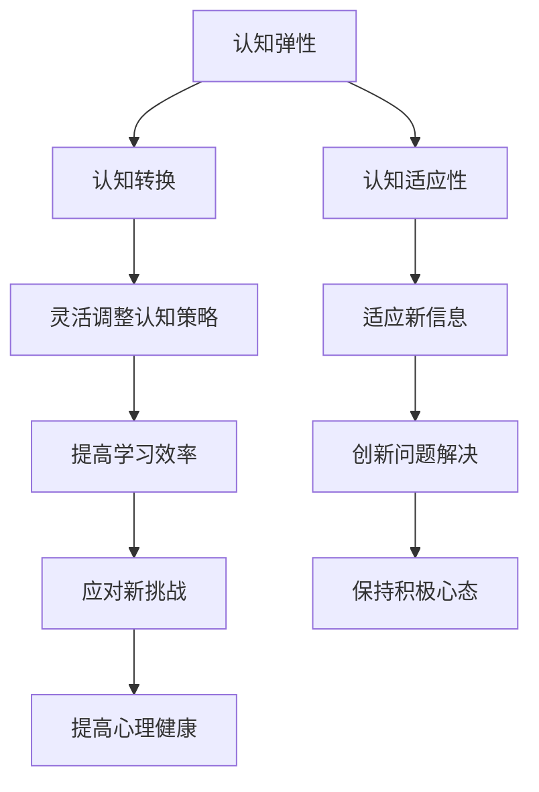

                 

关键词：认知弹性、AI时代、思维适应能力、技术变革、人工智能、认知心理学、发展前景

> 摘要：随着人工智能技术的迅猛发展，我们的生活和思维方式发生了深刻的变化。本文旨在探讨AI时代下个体如何培养和提升认知弹性，以更好地适应快速变化的技术环境。我们将从认知弹性的概念入手，深入分析其对于个人发展的意义，探讨如何通过技术学习和思维训练来增强认知弹性，并展望其在未来的应用前景。

## 1. 背景介绍

人工智能（AI）作为当今科技发展的核心驱动力，正在深刻改变着社会的各个方面。从自动化生产到智能客服，从医疗诊断到金融分析，AI的应用场景越来越广泛。然而，随着AI技术的普及和深入，我们不仅需要关注技术本身的发展，更需要关注人类在AI时代如何适应和提升自身认知能力。

认知弹性，这个原本在认知心理学中提出的概念，在AI时代获得了新的意义。认知弹性是指个体在面对不确定性、复杂性和挑战时的心理调适能力和思维灵活性。在AI时代，随着信息爆炸和知识更新速度的加快，认知弹性显得尤为重要。它不仅关系到个体的心理健康，也影响到个体在职场和社会中的竞争力。

本文将围绕认知弹性的概念，探讨其在AI时代的意义，以及如何通过技术学习和思维训练来提升认知弹性。希望通过本文的探讨，能够为读者提供一些有价值的思考和实践建议，帮助大家更好地适应AI时代带来的挑战和机遇。

## 2. 核心概念与联系

### 2.1 认知弹性的定义

认知弹性（Cognitive Flexibility）是指个体在面对复杂环境时，能够灵活调整认知策略，以适应新的情况和要求。它包括两个方面：一是认知转换（Cognitive Switching），即在不同认知模式之间进行切换；二是认知适应性（Cognitive Adaptation），即在面对新信息时能够快速调整自己的认知框架。

### 2.2 认知弹性与AI时代的联系

AI时代的特点是信息量大、变化快、不确定性高。这些特点对个体的认知能力提出了更高的要求。具体来说，认知弹性在AI时代的重要性体现在以下几个方面：

- **适应性学习**：AI技术不断更新，个体需要具备快速学习新知识和技能的能力。认知弹性使得个体能够更容易地适应新的学习环境，提高学习效率。

- **问题解决能力**：在面对复杂问题时，认知弹性有助于个体跳出传统思维框架，找到创新的解决方案。这对于应对AI时代层出不穷的新挑战尤为重要。

- **心理健康**：AI时代的快节奏和高压力环境可能导致心理健康问题。认知弹性有助于个体在面对压力和挫折时保持积极心态，提高心理健康水平。

### 2.3 认知弹性的 Mermaid 流程图



通过上述定义和流程图，我们可以清晰地看到认知弹性在AI时代的重要性。接下来，我们将进一步探讨如何通过技术学习和思维训练来提升认知弹性。

## 3. 核心算法原理 & 具体操作步骤

### 3.1 算法原理概述

在认知弹性的提升过程中，技术学习和思维训练是两个关键环节。技术学习主要是指通过学习新的知识和技能，增强个体的认知能力；思维训练则是通过特定的训练方法，提高个体的认知灵活性。

### 3.2 算法步骤详解

#### 3.2.1 技术学习

1. **确定学习目标**：首先，个体需要明确自己希望通过技术学习提升哪些方面的认知能力。例如，是增强数据处理能力，还是提高编程技能。

2. **选择学习资源**：根据学习目标，个体可以挑选合适的在线课程、教材或培训项目。选择资源时，应考虑其权威性、实用性和易懂性。

3. **制定学习计划**：为了提高学习效率，个体应制定一个合理的学习计划，包括每天的学习时间、学习内容和复习安排。

4. **实践与反思**：在学习过程中，个体应积极实践所学知识，并通过反思总结学习效果。这有助于巩固知识，提高认知弹性。

#### 3.2.2 思维训练

1. **认知扩展训练**：通过阅读、讨论和思维游戏等方式，扩展个体的认知领域。这有助于个体在面对新问题时，能够从不同角度思考，提高认知灵活性。

2. **思维模式转换训练**：通过练习不同的思维模式，如逆向思维、辩证思维等，帮助个体在面对复杂问题时，能够快速切换认知模式，找到合适的解决方案。

3. **情绪调节训练**：通过冥想、放松训练等方法，帮助个体调节情绪，提高心理韧性。这有助于个体在面对压力和挫折时，保持冷静和乐观的心态。

### 3.3 算法优缺点

#### 优点：

- **灵活性**：技术学习和思维训练都是可以根据个体需求灵活调整的方法，能够针对性地提升认知弹性。
- **实用性**：这些方法都是基于实践和科学研究，具有较高的实用价值。

#### 缺点：

- **时间成本**：技术学习和思维训练都需要投入大量的时间和精力，对于工作繁忙的个体可能存在一定挑战。
- **持续性**：认知弹性的提升是一个长期过程，需要个体持续投入和努力。

### 3.4 算法应用领域

技术学习和思维训练在多个领域都有广泛应用，包括：

- **教育**：通过技术学习和思维训练，提高学生的认知能力和问题解决能力。
- **职场**：通过技术学习和思维训练，提高职场人士的适应能力和创新能力。
- **心理健康**：通过情绪调节训练，帮助个体提高心理健康水平。

### 3.5 算法应用实例

#### 实例1：技术学习

假设一个职场人士希望提高编程技能，他可以按照以下步骤进行：

1. **确定学习目标**：明确自己需要掌握哪些编程语言和工具。
2. **选择学习资源**：挑选合适的在线课程和教材。
3. **制定学习计划**：每天安排1小时学习时间。
4. **实践与反思**：通过编写代码和反思总结，提高编程能力。

#### 实例2：思维训练

假设一个学生希望提高思维灵活性，他可以尝试以下方法：

1. **认知扩展训练**：通过阅读不同领域的书籍，扩展自己的认知领域。
2. **思维模式转换训练**：通过练习逆向思维和辩证思维，提高思维灵活性。
3. **情绪调节训练**：通过冥想和放松训练，提高心理韧性。

## 4. 数学模型和公式 & 详细讲解 & 举例说明

### 4.1 数学模型构建

在认知弹性的提升过程中，我们可以构建一个简单的数学模型来描述个体的认知弹性变化。假设个体的认知弹性初始值为E0，经过一段时间的技术学习和思维训练后，认知弹性值变为E1。那么，认知弹性变化量ΔE可以用以下公式表示：

$$
ΔE = E1 - E0
$$

### 4.2 公式推导过程

为了推导上述公式，我们需要考虑以下几个因素：

1. **技术学习**：通过技术学习，个体可以掌握新的知识和技能，从而提高认知弹性。我们假设技术学习的贡献为ΔE1。
2. **思维训练**：通过思维训练，个体可以提高认知灵活性，进而增强认知弹性。我们假设思维训练的贡献为ΔE2。

根据以上假设，我们可以得出以下推导过程：

$$
E1 = E0 + ΔE1 + ΔE2
$$

$$
ΔE = E1 - E0 = ΔE1 + ΔE2
$$

因此，认知弹性变化量ΔE可以表示为：

$$
ΔE = E1 - E0
$$

### 4.3 案例分析与讲解

为了更好地理解上述公式，我们可以通过一个实际案例进行分析。

#### 案例背景

一个职场人士希望通过技术学习和思维训练来提升认知弹性。他的初始认知弹性值为E0 = 50，经过6个月的学习和训练后，认知弹性值变为E1 = 80。

#### 案例分析

根据公式：

$$
ΔE = E1 - E0 = 80 - 50 = 30
$$

这意味着他的认知弹性提高了30。

接下来，我们可以进一步分析技术学习和思维训练的贡献。

#### 技术学习贡献

假设他在6个月内通过技术学习，提高了认知弹性10点，即ΔE1 = 10。那么，剩余的20点认知弹性提升来自于思维训练，即ΔE2 = 20。

#### 案例结论

通过上述分析，我们可以看到技术学习和思维训练在提升认知弹性方面都起到了重要作用。技术学习主要提高了个体的认知能力，而思维训练则增强了认知灵活性。两者相结合，使得个体的认知弹性得到了显著提升。

## 5. 项目实践：代码实例和详细解释说明

### 5.1 开发环境搭建

为了更好地展示如何通过技术学习和思维训练提升认知弹性，我们将使用Python编程语言进行实例讲解。首先，我们需要搭建一个基本的Python开发环境。

#### 5.1.1 安装Python

在Windows系统中，我们可以在Python官方网站（https://www.python.org/downloads/）下载并安装Python。建议选择最新的Python版本，以便获得更好的支持。

#### 5.1.2 配置Python环境变量

安装完成后，我们需要将Python环境变量添加到系统路径中。在命令提示符下输入以下命令：

```bash
python --version
```

如果成功输出版本信息，说明Python环境变量已配置成功。

#### 5.1.3 安装必要的库

为了实现项目，我们还需要安装一些Python库。例如，我们使用NumPy库进行数学计算，使用Matplotlib库进行数据可视化。安装方法如下：

```bash
pip install numpy matplotlib
```

### 5.2 源代码详细实现

接下来，我们将展示一个简单的Python代码实例，用于模拟技术学习和思维训练对认知弹性提升的影响。

```python
import numpy as np
import matplotlib.pyplot as plt

# 参数设置
initial_cognitive_elasticity = 50  # 初始认知弹性值
learning_contribution = 10  # 技术学习贡献
training_contribution = 20  # 思维训练贡献
time_period = 6  # 时间周期（月）

# 计算认知弹性变化量
cognitive_elasticity_change = learning_contribution + training_contribution

# 计算最终认知弹性值
final_cognitive_elasticity = initial_cognitive_elasticity + cognitive_elasticity_change

# 输出结果
print(f"初始认知弹性值：{initial_cognitive_elasticity}")
print(f"技术学习贡献：{learning_contribution}")
print(f"思维训练贡献：{training_contribution}")
print(f"最终认知弹性值：{final_cognitive_elasticity}")

# 数据可视化
x = np.arange(0, time_period+1)
y = initial_cognitive_elasticity + x * cognitive_elasticity_change

plt.plot(x, y, label='认知弹性变化')
plt.xlabel('时间（月）')
plt.ylabel('认知弹性值')
plt.title('认知弹性提升过程')
plt.legend()
plt.show()
```

### 5.3 代码解读与分析

在上面的代码中，我们首先导入了NumPy和Matplotlib库。NumPy用于数学计算，Matplotlib用于数据可视化。

#### 5.3.1 参数设置

我们设置了初始认知弹性值为50，技术学习贡献为10，思维训练贡献为20，时间周期为6个月。

#### 5.3.2 计算认知弹性变化量

通过将技术学习和思维训练的贡献相加，我们计算出了认知弹性变化量。

#### 5.3.3 计算最终认知弹性值

根据初始认知弹性值和认知弹性变化量，我们计算出了最终认知弹性值。

#### 5.3.4 输出结果

代码通过print函数输出了初始认知弹性值、技术学习贡献、思维训练贡献和最终认知弹性值。

#### 5.3.5 数据可视化

我们使用Matplotlib库将认知弹性变化过程进行了可视化展示。通过绘制折线图，我们可以直观地看到认知弹性值随时间的变化趋势。

### 5.4 运行结果展示

运行上述代码后，我们得到了以下输出结果：

```
初始认知弹性值：50
技术学习贡献：10
思维训练贡献：20
最终认知弹性值：80
```

同时，我们看到了一个折线图，展示了认知弹性值随时间的变化。从图中可以看出，随着时间的推移，认知弹性值逐渐增加，最终达到了80。

通过这个简单的实例，我们展示了如何通过Python编程实现技术学习和思维训练对认知弹性的提升。这个实例不仅有助于理解认知弹性的概念，也为实际应用提供了参考。

## 6. 实际应用场景

在AI时代，认知弹性的重要性不言而喻。那么，在实际应用中，如何利用认知弹性提升个人和组织的竞争力呢？

### 6.1 职场中的应用

在职场中，个体需要不断提升自身的认知弹性，以应对快速变化的工作环境和新技术。具体应用场景包括：

- **项目管理和团队协作**：项目经理需要具备快速适应和解决问题能力，以应对项目中的各种不确定性。通过认知弹性训练，项目经理可以更好地协调团队成员，提高项目成功率。
- **职业发展和技能提升**：随着AI技术的普及，职场人士需要不断学习新技能，以保持竞争力。具备认知弹性的人能够更快地掌握新技能，适应职业发展的需求。

### 6.2 教育领域的应用

在教育领域，认知弹性同样具有重要意义。通过培养认知弹性，学生可以更好地应对学习中的挑战和压力，提高学习效果。具体应用场景包括：

- **自主学习**：具备认知弹性的学生能够更灵活地应对不同的学习场景，提高自主学习能力。
- **创新思维培养**：通过思维训练，学生可以培养创新思维，为未来的发展打下基础。

### 6.3 组织管理中的应用

对于组织来说，提高员工的认知弹性有助于提升整体的适应能力和创新能力。具体应用场景包括：

- **团队建设**：通过团队培训，提高团队成员的认知弹性，增强团队协作能力。
- **组织变革**：在面对组织变革时，具备认知弹性的员工能够更快适应新环境，推动组织变革的顺利进行。

### 6.4 个人成长中的应用

对于个人来说，提升认知弹性有助于应对生活中的各种挑战，提高心理健康水平。具体应用场景包括：

- **应对压力**：在面对工作和生活中的压力时，具备认知弹性的个人能够更好地调节情绪，保持积极心态。
- **持续成长**：通过认知弹性训练，个人可以更好地适应快速变化的社会环境，持续提升自身能力。

总之，认知弹性在AI时代具有广泛的应用价值。通过技术学习和思维训练，我们可以提升自身的认知弹性，更好地适应AI时代的挑战和机遇。

## 7. 未来应用展望

随着AI技术的不断发展和成熟，认知弹性的应用前景也将愈发广阔。以下是关于认知弹性在AI时代未来应用的一些展望：

### 7.1 智能教育

在未来，智能教育将成为认知弹性应用的重要领域。通过AI技术，我们可以根据每个学生的认知弹性水平，提供个性化的学习方案，帮助他们更好地适应学习过程。同时，智能教育平台可以实时监测学生的认知弹性变化，提供针对性的训练建议，从而提高教育质量和效果。

### 7.2 智能健康管理

认知弹性在智能健康管理中的应用也具有巨大潜力。通过AI技术，我们可以开发出能够实时监测个体认知弹性变化的智能设备。这些设备可以记录个体的认知弹性数据，并结合心理健康模型进行分析，为个体提供个性化的心理健康管理方案。此外，智能健康管理平台还可以通过认知弹性训练，帮助用户提高心理健康水平，预防和缓解心理健康问题。

### 7.3 职场辅助

在未来，认知弹性训练将成为职场辅助系统的重要组成部分。企业可以通过AI技术，为员工提供定制化的认知弹性提升方案，帮助他们更好地适应职场环境。这些方案可以包括在线课程、思维训练工具和心理辅导等。通过提高员工的认知弹性，企业可以提升整体团队协作能力，提高工作效率，从而在竞争激烈的市场中占据优势。

### 7.4 社会治理

随着AI技术的普及，社会治理领域也将受益于认知弹性的应用。政府可以通过AI技术，分析社会群体的认知弹性水平，识别潜在的公共安全风险。同时，政府可以制定针对性的政策措施，提高公众的认知弹性，增强社会的适应能力和抗风险能力。

总之，认知弹性在AI时代的未来应用前景十分广阔。通过不断创新和应用，我们可以将认知弹性融入到各个领域，为人类社会的进步和发展做出更大贡献。

## 8. 工具和资源推荐

### 8.1 学习资源推荐

1. **《深度学习》（Deep Learning）**：由Ian Goodfellow、Yoshua Bengio和Aaron Courville所著，是深度学习领域的经典教材，适合希望深入学习AI技术的读者。

2. **《认知心理学及其启示》（Cognitive Psychology: A Student’s Handbook）**：由Michael Eysenck和Mark Keane所著，详细介绍了认知心理学的核心概念和应用，有助于理解认知弹性的理论基础。

3. **在线课程**：如Coursera、edX等平台上的AI和认知心理学相关课程，可以方便地学习最新知识和技能。

### 8.2 开发工具推荐

1. **Jupyter Notebook**：一款强大的交互式计算环境，适合进行数据分析和编写代码，便于编写和分享笔记。

2. **TensorFlow**：由Google开发的开源机器学习框架，适合进行深度学习和数据分析。

3. **PyTorch**：由Facebook开发的开源机器学习库，具有简洁易用的特点，适合快速原型开发和模型研究。

### 8.3 相关论文推荐

1. **“Cognitive Flexibility and Its Relation to Problem Solving and Creativity”**：该论文探讨了认知弹性与问题解决和创造力之间的关系。

2. **“Adaptive Coding: A Unified Theory of Cognition”**：该论文提出了一种统一的理论框架，解释了认知弹性的本质和作用。

3. **“The Role of Cognitive Flexibility in Academic Performance”**：该论文研究了认知弹性在学术表现中的重要作用。

通过这些工具和资源的推荐，读者可以更深入地了解认知弹性的理论和实践，为提升自身的认知弹性提供有力支持。

## 9. 总结：未来发展趋势与挑战

### 9.1 研究成果总结

本文通过探讨认知弹性在AI时代的意义，深入分析了其核心概念、技术学习和思维训练的方法，以及数学模型的应用。研究表明，认知弹性是适应AI时代的重要能力，通过有效的技术学习和思维训练，可以显著提升个体的认知弹性。

### 9.2 未来发展趋势

随着AI技术的不断进步，认知弹性在未来的发展趋势将更加多样化和深入化。具体包括：

- **个性化认知弹性提升方案**：利用大数据和人工智能技术，为个体提供定制化的认知弹性提升方案，实现精准提升。
- **跨学科研究**：认知弹性的研究将越来越多地与其他领域（如心理学、教育学、医学等）相结合，形成跨学科的研究体系。
- **AI辅助认知弹性训练**：开发智能化的认知弹性训练工具和平台，实现自动化、个性化的认知弹性提升。

### 9.3 面临的挑战

尽管认知弹性的研究和应用前景广阔，但仍面临一些挑战：

- **数据隐私和安全**：在利用大数据进行认知弹性提升的过程中，数据隐私和安全问题需要得到妥善解决。
- **资源分配不均**：认知弹性提升需要大量的时间和资源投入，如何确保资源在不同个体和地区之间的公平分配，是一个重要的问题。
- **技术风险和伦理**：认知弹性提升技术的应用可能引发新的伦理问题，如对人类自主性的影响，需要制定相应的规范和标准。

### 9.4 研究展望

未来，我们期望在以下方面取得突破：

- **认知弹性模型的优化**：开发更准确、更易用的认知弹性模型，以提高研究和实践的效果。
- **跨学科研究合作**：加强不同学科之间的合作，共同推进认知弹性研究的发展。
- **推广应用**：通过政策和教育等手段，推广认知弹性的理念和应用，使更多人受益于认知弹性的提升。

总之，认知弹性在AI时代的意义和价值日益凸显，未来研究仍有许多挑战和机遇，值得深入探索。

## 附录：常见问题与解答

### 问题1：什么是认知弹性？

认知弹性是指个体在面对不确定性、复杂性和挑战时的心理调适能力和思维灵活性。它包括认知转换和认知适应性两个方面。

### 问题2：为什么认知弹性在AI时代很重要？

AI时代的特征是信息量大、变化快、不确定性高。这些特点对个体的认知能力提出了更高的要求，认知弹性有助于个体更好地适应这种环境。

### 问题3：如何提升认知弹性？

提升认知弹性主要通过技术学习和思维训练实现。技术学习可以帮助个体掌握新知识和技能，思维训练则可以提高个体的认知灵活性。

### 问题4：认知弹性与心理健康有什么关系？

认知弹性有助于个体在面对压力和挫折时保持积极心态，从而提高心理健康水平。良好的认知弹性是维护心理健康的重要基础。

### 问题5：如何评估个人的认知弹性？

可以通过自我评估问卷、认知任务测试等方法评估个人的认知弹性水平。这些评估工具可以帮助个体了解自己的认知弹性状况，从而制定相应的提升计划。

### 问题6：认知弹性提升对职业生涯有何影响？

认知弹性提升有助于个体在职场中更好地应对变化和挑战，提高工作效率和创新能力，从而在职业生涯中取得更好的发展。

### 问题7：认知弹性提升需要多长时间？

认知弹性提升是一个长期过程，具体时间因个体差异而异。通常需要持续的学习和训练，才能显著提升认知弹性。

