                 

关键词：认知框架、知识体系、个人成长、专业能力、学习策略、技术思维

> 摘要：本文旨在探讨如何构建一个有效的个人知识体系，通过认知框架的方法，帮助读者在信息技术领域提升专业能力和解决实际问题的能力。文章将介绍核心概念、算法原理、数学模型、项目实践，并给出未来发展的展望。

## 1. 背景介绍

在信息技术飞速发展的时代，个人知识体系的构建显得尤为重要。一个清晰、有序的知识体系不仅能帮助我们更有效地学习和工作，还能提高我们的问题解决能力和创新思维。然而，如何构建一个既全面又深入的个人知识体系，成为了每一个追求专业成长的人所面临的挑战。

本文将围绕以下主题展开：

1. **核心概念与联系**：通过Mermaid流程图展示知识体系的核心概念和相互联系。
2. **核心算法原理 & 具体操作步骤**：详细解析算法原理，并给出实际操作步骤。
3. **数学模型和公式 & 详细讲解 & 举例说明**：介绍数学模型和公式的构建、推导过程，并结合实际案例进行分析。
4. **项目实践：代码实例和详细解释说明**：通过代码实例，展示知识体系的实际应用。
5. **实际应用场景**：探讨知识体系在不同领域的应用。
6. **未来应用展望**：对知识体系未来的发展趋势和应用前景进行展望。
7. **工具和资源推荐**：推荐学习资源和开发工具。
8. **总结：未来发展趋势与挑战**：总结研究成果，展望未来发展方向。

## 2. 核心概念与联系

在构建个人知识体系之前，我们需要明确一些核心概念。以下是一个使用Mermaid绘制的流程图，展示了知识体系的主要组成部分及其相互关系。

```mermaid
graph TD
    A[基础知识] --> B[专业领域]
    A --> C[学习方法]
    A --> D[实践经验]
    B --> E[算法与数据结构]
    B --> F[软件开发]
    B --> G[系统架构]
    C --> H[阅读理解]
    C --> I[批判性思维]
    D --> J[项目实施]
    D --> K[团队协作]
    E --> L[排序算法]
    E --> M[搜索算法]
    F --> N[前端开发]
    F --> O[后端开发]
    G --> P[微服务架构]
    G --> Q[云计算]
    H --> R[信息提取]
    H --> S[逻辑推理]
    I --> T[分析能力]
    I --> U[决策能力]
    J --> V[需求分析]
    J --> W[项目管理]
    K --> X[沟通技巧]
    K --> Y[冲突解决]
    L --> Z[快速排序]
    L --> AA[归并排序]
    M --> BB[深度优先搜索]
    M --> CC[广度优先搜索]
    N --> DD[React框架]
    N --> EE[Vue框架]
    O --> FF[Java框架]
    O --> GG[Python框架]
    P --> HH[负载均衡]
    P --> II[服务发现]
    Q --> JJ[容器化技术]
    Q --> KK[分布式存储]
    R --> LL[文本分类]
    R --> MM[情感分析]
    S --> NN[归纳推理]
    S --> OO[演绎推理]
    T --> PP[数据分析]
    T --> QQ[机器学习]
    U --> RR[决策树]
    U --> SS[支持向量机]
    V --> WW[用户故事]
    V --> XX[用例图]
    W --> YY[敏捷开发]
    W --> ZZ[看板管理]
    X --> AAA[非暴力沟通]
    X --> BBB[有效表达]
    Y --> CCC[利益平衡]
    Y --> DDD[共识达成]
    Z --> EEE[时间复杂度]
    Z --> FFF[空间复杂度]
    AA --> GGG[时间复杂度分析]
    AA --> HHH[空间复杂度分析]
    BB --> III[算法效率]
    BB --> JJJ[算法稳定性]
    CC --> KKK[路径规划]
    CC --> LLL[网络拓扑]
    DD --> MMM[组件化开发]
    DD --> NNN[状态管理]
    EE --> OOO[模块化设计]
    EE --> PPP[性能优化]
    FF --> QQ[框架特性]
    FF --> RR[多线程编程]
    GG --> SS[数据结构]
    GG --> TT[算法优化]
    HH --> UU[服务部署]
    HH --> VV[持续集成]
    II --> WW[容器编排]
    II --> XX[容器网络]
    JJ --> YY[容器镜像]
    JJ --> ZZ[容器编排工具]
    KK --> AAA[数据一致性]
    KK --> BBB[数据备份]
    LL --> CCC[文本挖掘]
    LL --> DDD[自然语言处理]
    MM --> EEE[情感识别]
    MM --> FFF[语义分析]
    NN --> GGG[形式逻辑]
    NN --> HHH[论证方法]
    OO --> III[推理机]
    OO --> JJJ[专家系统]
    PP --> KKK[特征工程]
    PP --> LLL[模型评估]
    QQ --> MMM[监督学习]
    QQ --> NNN[无监督学习]
    RR --> OOO[分类算法]
    RR --> PPP[回归算法]
    SS --> QQ[决策支持系统]
    SS --> RR[数据挖掘]
    WW --> SSS[用户反馈]
    WW --> TTT[迭代优化]
    XX --> UUU[容器编排平台]
    XX --> VVV[容器网络拓扑]
    YY --> WWW[容器镜像仓库]
    YY --> XXX[容器监控与日志]
    ZZ --> AAAA[云原生应用]
    ZZ --> BBBB[混合云架构]
```



以上流程图展示了个人知识体系中的基础知识、专业领域、学习方法、实践经验和具体技术领域的相互关系。通过这个框架，我们可以更系统地理解和掌握各个领域的知识点。

## 3. 核心算法原理 & 具体操作步骤

### 3.1 算法原理概述

在构建个人知识体系的过程中，算法原理的学习和理解至关重要。以下将介绍几个核心算法的原理及其应用。

### 3.2 算法步骤详解

#### 3.2.1 快速排序（Quick Sort）

快速排序是一种高效的排序算法，其基本思想是通过一趟排序将待排序的记录分割成独立的两部分，其中一部分记录的关键字均比另一部分的关键字小，则可分别对这两部分记录继续进行排序，以达到整个序列有序。

#### 快速排序步骤：

1. **选择基准**：在数组中选择一个基准元素。
2. **分区操作**：将数组分为两部分，所有比基准小的元素放在基准的左边，所有比基准大的元素放在基准的右边。
3. **递归排序**：递归地对左右两部分进行快速排序。

#### 3.2.2 深度优先搜索（Depth-First Search，DFS）

深度优先搜索是一种用于图遍历的算法，其基本思想是从图的某个顶点开始，沿着某一方向搜索到底，如果该方向不通，则改变方向继续搜索。

#### DFS步骤：

1. **初始化**：选择起始顶点，标记为已访问。
2. **遍历**：从起始顶点开始，访问其所有未被访问的邻接点，并对每个邻接点重复此过程。
3. **回溯**：当到达某个顶点，所有邻接点都已访问，则回溯至上一个顶点，继续访问未被访问的邻接点。

### 3.3 算法优缺点

#### 快速排序

- 优点：平均时间复杂度为O(nlogn)，适用于大规模数据的排序。
- 缺点：最坏情况下时间复杂度为O(n^2)，可能导致性能下降。

#### 深度优先搜索

- 优点：简单易实现，适用于解决连通性问题。
- 缺点：可能陷入死循环，导致栈溢出。

### 3.4 算法应用领域

- 快速排序广泛应用于各类数据排序场景。
- 深度优先搜索广泛应用于图的遍历、路径搜索等场景。

## 4. 数学模型和公式 & 详细讲解 & 举例说明

### 4.1 数学模型构建

在构建个人知识体系的过程中，数学模型的理解和应用至关重要。以下将介绍几个常见的数学模型，并展示其构建和推导过程。

### 4.2 公式推导过程

#### 4.2.1 线性回归模型

线性回归模型是一种用于预测连续值的数学模型，其公式如下：

$$ y = ax + b $$

其中，$y$ 是因变量，$x$ 是自变量，$a$ 是斜率，$b$ 是截距。

#### 公式推导过程：

1. **确定数据集**：选择一组样本数据$(x_i, y_i)$，其中$i=1,2,...,n$。
2. **计算斜率**：通过最小二乘法计算斜率$a$，公式如下：

$$ a = \frac{\sum_{i=1}^{n}(x_i - \bar{x})(y_i - \bar{y})}{\sum_{i=1}^{n}(x_i - \bar{x})^2} $$

其中，$\bar{x}$ 和 $\bar{y}$ 分别是$x$ 和$y$ 的平均值。

3. **计算截距**：通过代入任意一个样本点，计算截距$b$。

#### 4.2.2 决策树模型

决策树模型是一种用于分类和回归的数学模型，其公式如下：

$$ f(x) = \sum_{i=1}^{n} c_i \prod_{j=1}^{m} I(x_j \in R_{ij}) $$

其中，$f(x)$ 是预测值，$c_i$ 是第$i$个类别的概率，$R_{ij}$ 是第$i$个特征在第$j$个分区的取值范围，$I(x_j \in R_{ij})$ 是指示函数，当$x_j$ 属于$R_{ij}$时，取值为1，否则为0。

#### 公式推导过程：

1. **确定数据集**：选择一组样本数据$(x_i, y_i)$，其中$i=1,2,...,n$。
2. **划分特征**：根据特征的重要性，选择一个特征进行划分。
3. **计算概率**：计算每个类别的概率$ c_i $。
4. **计算预测值**：根据划分结果和概率公式计算预测值$f(x)$。

### 4.3 案例分析与讲解

#### 4.3.1 线性回归模型案例

假设我们有一个数据集，其中自变量$x$和因变量$y$分别为：

| $x$ | $y$ |
|-----|-----|
| 1   | 2   |
| 2   | 4   |
| 3   | 6   |
| 4   | 8   |
| 5   | 10  |

我们希望使用线性回归模型预测当$x=3$时$y$的值。

1. **计算斜率**：

$$ a = \frac{\sum_{i=1}^{n}(x_i - \bar{x})(y_i - \bar{y})}{\sum_{i=1}^{n}(x_i - \bar{x})^2} $$

$$ a = \frac{(1-2.2)(2-5.6) + (2-2.2)(4-5.6) + (3-2.2)(6-5.6) + (4-2.2)(8-5.6) + (5-2.2)(10-5.6)}{(1-2.2)^2 + (2-2.2)^2 + (3-2.2)^2 + (4-2.2)^2 + (5-2.2)^2} $$

$$ a = \frac{-0.2 \times -3.6 + 0.8 \times -1.6 + 0.8 \times 0.4 + 1.8 \times 2.4 + 2.8 \times 5.6}{0.04 + 0.0064 + 0.0256 + 0.096 + 0.196} $$

$$ a = \frac{0.72 - 1.28 + 0.32 + 4.32 + 15.68}{0.366} $$

$$ a = \frac{19.2}{0.366} $$

$$ a = 52.57 $$

2. **计算截距**：

$$ b = \bar{y} - a\bar{x} $$

$$ b = 5.6 - 52.57 \times 2.2 $$

$$ b = 5.6 - 115.694 $$

$$ b = -110.094 $$

3. **计算预测值**：

$$ y = ax + b $$

$$ y = 52.57 \times 3 - 110.094 $$

$$ y = 158.71 - 110.094 $$

$$ y = 48.616 $$

因此，当$x=3$时，预测的$y$值为48.616。

#### 4.3.2 决策树模型案例

假设我们有一个数据集，其中自变量$x$和因变量$y$分别为：

| $x_1$ | $x_2$ | $y$ |
|-------|-------|-----|
| 1     | 1     | 0   |
| 1     | 2     | 1   |
| 2     | 1     | 1   |
| 2     | 2     | 0   |
| 3     | 1     | 1   |
| 3     | 2     | 1   |

我们希望使用决策树模型预测当$x_1=2$，$x_2=1$时$y$的值。

1. **划分特征**：选择$x_1$作为划分特征，将数据集划分为两部分：

   - $x_1=1$：数据集为{(1,1,0), (1,2,1)}。
   - $x_1=2$：数据集为{(2,1,1), (2,2,0), (3,1,1), (3,2,1)}。

2. **计算概率**：计算每个类别的概率：

   - $y=0$：概率为$\frac{1}{4}$。
   - $y=1$：概率为$\frac{3}{4}$。

3. **计算预测值**：

   $$ f(x) = \sum_{i=1}^{n} c_i \prod_{j=1}^{m} I(x_j \in R_{ij}) $$

   $$ f(x) = \frac{1}{4} \prod_{j=1}^{2} I(x_j \in R_{ij}) + \frac{3}{4} \prod_{j=1}^{2} I(x_j \in R_{ij}) $$

   $$ f(x) = \frac{1}{4} \times I(2 \in R_{1}) \times I(1 \in R_{2}) + \frac{3}{4} \times I(2 \in R_{1}) \times I(1 \in R_{2}) $$

   $$ f(x) = \frac{1}{4} \times 1 \times 1 + \frac{3}{4} \times 1 \times 1 $$

   $$ f(x) = \frac{1}{4} + \frac{3}{4} $$

   $$ f(x) = 1 $$

因此，当$x_1=2$，$x_2=1$时，预测的$y$值为1。

## 5. 项目实践：代码实例和详细解释说明

### 5.1 开发环境搭建

为了实现本文中提到的算法和模型，我们需要搭建一个开发环境。以下是推荐的开发环境搭建步骤：

1. **安装Python**：下载并安装Python 3.x版本。
2. **安装Jupyter Notebook**：通过pip命令安装Jupyter Notebook。

```bash
pip install notebook
```

3. **安装相关库**：安装NumPy、Pandas、Scikit-learn等库。

```bash
pip install numpy pandas scikit-learn
```

### 5.2 源代码详细实现

以下是快速排序算法和深度优先搜索算法的实现代码：

#### 快速排序算法

```python
import random

def quick_sort(arr):
    if len(arr) <= 1:
        return arr
    pivot = random.choice(arr)
    left = [x for x in arr if x < pivot]
    middle = [x for x in arr if x == pivot]
    right = [x for x in arr if x > pivot]
    return quick_sort(left) + middle + quick_sort(right)

arr = [3, 6, 8, 10, 1, 2, 4]
sorted_arr = quick_sort(arr)
print(sorted_arr)
```

#### 深度优先搜索算法

```python
from collections import defaultdict

def dfs(graph, node, visited):
    visited.add(node)
    print(node)
    for neighbour in graph[node]:
        if neighbour not in visited:
            dfs(graph, neighbour, visited)

graph = defaultdict(list)
graph[0] = [1, 2]
graph[1] = [2, 3]
graph[2] = [3, 0]
graph[3] = [1]

visited = set()
dfs(graph, 0, visited)
```

### 5.3 代码解读与分析

#### 5.3.1 快速排序算法解读

- **递归调用**：快速排序算法的核心在于递归调用。每次递归都会将数组划分为更小的子数组，直到子数组的大小小于等于1。
- **随机选择基准**：为了减少最坏情况的发生，我们随机选择一个基准元素。
- **划分数组**：将数组划分为三个部分：小于基准的部分、等于基准的部分、大于基准的部分。

#### 5.3.2 深度优先搜索算法解读

- **递归遍历**：深度优先搜索算法通过递归遍历图的节点，实现图的遍历。
- **访问节点**：在递归过程中，我们访问每个节点，并标记为已访问，以避免重复访问。
- **遍历邻接点**：对于每个节点，我们遍历其邻接点，并递归地对未被访问的邻接点进行遍历。

### 5.4 运行结果展示

#### 快速排序算法运行结果

```
[1, 2, 3, 4, 6, 8, 10]
```

#### 深度优先搜索算法运行结果

```
0
1
2
3
```

## 6. 实际应用场景

### 6.1 图像处理领域

在图像处理领域，深度优先搜索算法可以用于图像的连通区域标记。通过遍历图像中的像素点，我们可以将连通区域标记为相同的颜色，从而实现图像分割。

### 6.2 数据分析领域

在数据分析领域，快速排序算法可以用于对大量数据进行排序，以便于后续的统计分析。线性回归模型可以用于预测股票价格、房屋售价等连续值。

### 6.3 自然语言处理领域

在自然语言处理领域，深度优先搜索算法可以用于句法分析，通过递归遍历句子的成分，构建句子的语法树。决策树模型可以用于文本分类，根据文本的词频和词义，将其分类到不同的主题。

## 7. 未来应用展望

随着信息技术的不断发展，个人知识体系的应用前景将更加广泛。以下是一些未来应用展望：

### 7.1 自动驾驶领域

在自动驾驶领域，深度优先搜索算法和决策树模型可以用于路径规划和决策。通过实时分析环境数据，自动驾驶系统可以做出最优的行驶决策。

### 7.2 人工智能领域

在人工智能领域，线性回归模型和决策树模型可以用于数据分析和预测。随着机器学习技术的发展，这些模型将更好地应对复杂的数据场景。

### 7.3 医疗领域

在医疗领域，个人知识体系可以用于医疗图像分析、疾病预测等。通过结合深度学习和传统机器学习算法，我们可以实现更加精准的疾病诊断。

## 8. 工具和资源推荐

### 8.1 学习资源推荐

- **《Python编程：从入门到实践》**：适合初学者，全面介绍Python编程。
- **《深度学习》**：适合对深度学习感兴趣的读者，介绍深度学习的基本原理和应用。

### 8.2 开发工具推荐

- **Jupyter Notebook**：适用于数据分析和机器学习项目。
- **PyCharm**：适用于Python编程，功能强大，易于使用。

### 8.3 相关论文推荐

- **“Deep Learning for Autonomous Navigation”**：介绍深度学习在自动驾驶中的应用。
- **“A Comprehensive Survey on Machine Learning for Natural Language Processing”**：介绍机器学习在自然语言处理领域的应用。

## 9. 总结：未来发展趋势与挑战

### 9.1 研究成果总结

本文通过介绍认知框架和构建个人知识体系的方法，探讨了算法原理、数学模型、项目实践等方面的内容。通过实际案例分析和代码实现，展示了知识体系在实际应用中的价值。

### 9.2 未来发展趋势

随着信息技术的不断发展，个人知识体系的应用将更加广泛。深度学习和人工智能技术的进步，将推动个人知识体系向智能化、自动化方向发展。

### 9.3 面临的挑战

在构建个人知识体系的过程中，我们面临着信息过载、技术更新快速等挑战。如何有效地筛选和整合信息，如何持续学习和适应新技术，将成为我们需要面对的重要问题。

### 9.4 研究展望

未来，我们可以通过研究智能算法、知识图谱等技术，进一步提高个人知识体系的效率和智能化水平。同时，结合人工智能技术，实现个人知识体系的自动化构建和优化。

## 附录：常见问题与解答

### Q：如何构建有效的个人知识体系？

A：构建有效的个人知识体系，需要明确学习目标、制定学习计划、持续学习和实践。同时，要善于利用网络资源、参加培训和讨论，与他人交流经验。

### Q：如何提高算法能力？

A：提高算法能力，需要深入理解算法原理，通过大量实践和调试，掌握各种算法的实现方法。同时，要关注算法的最新发展，不断更新自己的知识储备。

### Q：如何将数学模型应用到实际问题中？

A：将数学模型应用到实际问题中，需要了解问题的背景和需求，选择合适的模型，并通过数据分析、模型训练和优化，实现模型的预测和决策功能。

## 作者署名

作者：禅与计算机程序设计艺术 / Zen and the Art of Computer Programming
----------------------------------------------------------------

这篇文章详细地阐述了如何构建个人知识体系，通过核心概念、算法原理、数学模型和项目实践的介绍，帮助读者提升专业能力和解决实际问题的能力。在未来的发展中，随着技术的不断进步，个人知识体系将变得更加重要和多样化。希望这篇文章对读者有所启发，助力大家在信息技术领域取得更大的成就。

