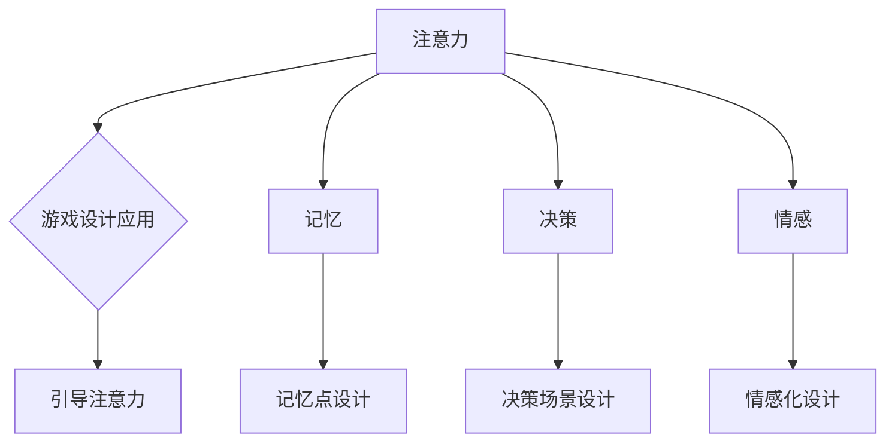

                 

在当今快速发展的科技时代，认知科学与游戏设计的结合成为一个引人注目的研究领域。本文将探讨这两个领域的交叉点，以及如何将认知科学的理论应用于游戏设计，以创造更具吸引力和教育价值的游戏体验。本文旨在提供一份全面的综述，涵盖背景介绍、核心概念、算法原理、数学模型、项目实践、实际应用场景以及未来展望。

> **关键词：** 认知科学；游戏设计；用户体验；算法原理；数学模型；项目实践

> **摘要：** 本文首先介绍认知科学与游戏设计的背景和发展现状。接着，我们将探讨认知科学中的核心概念，如注意力、记忆、决策和情感，并展示如何将这些概念应用于游戏设计。文章随后将详细阐述一个核心算法的原理和具体操作步骤，以及相关的数学模型和公式。随后，通过一个项目实例，我们将展示如何将理论与实践相结合。最后，本文将探讨认知科学与游戏设计的实际应用场景，并展望未来的发展方向。

## 1. 背景介绍

认知科学是一门多学科交叉的领域，旨在研究人类大脑如何处理信息、做出决策以及形成认知。游戏设计则是一种艺术和科学，旨在创建互动和娱乐体验。尽管这两个领域看似迥异，但在过去几十年中，它们之间的结合越来越紧密。

### 认知科学的背景

认知科学起源于20世纪中叶，当时心理学家、神经科学家、计算机科学家和哲学家开始共同探讨人类思维的本质。认知科学的目的是理解人类大脑如何处理信息，以及这些信息处理过程如何影响我们的行为和决策。其研究范畴包括感知、记忆、注意力、语言、决策、情感等多个方面。

### 游戏设计的背景

游戏设计的历史可以追溯到古老的棋类游戏和角斗士游戏。随着计算机和互联网技术的发展，电子游戏迅速崛起，成为现代娱乐的重要组成部分。游戏设计不仅注重娱乐性，还关注游戏的可玩性、用户体验和社交互动。近年来，随着认知科学的进步，游戏设计师开始利用认知科学的理论来提高游戏的质量和吸引力。

### 认知科学与游戏设计结合的兴起

随着认知科学的深入发展，越来越多的游戏设计师开始意识到认知科学理论在游戏设计中的应用潜力。例如，通过研究注意力机制，设计师可以创造更具挑战性和吸引力的游戏关卡；通过理解记忆原理，设计师可以设计更加引人入胜的游戏故事情节；通过分析决策过程，设计师可以提高游戏的策略性和趣味性。此外，认知科学还提供了新的方法和工具，帮助设计师评估和优化游戏的用户体验。

## 2. 核心概念与联系

认知科学的核心概念包括注意力、记忆、决策和情感。这些概念不仅对人类认知有重要影响，也为游戏设计提供了宝贵的启示。

### 注意力

注意力是人类大脑处理信息的重要机制，决定了我们能否有效地接收和加工外界信息。在游戏设计中，注意力机制的应用至关重要。通过合理安排游戏中的视觉和声音元素，设计师可以引导玩家的注意力，提高游戏的吸引力和沉浸感。例如，在角色扮演游戏中，设计师可以通过设计引人入胜的故事情节和精美的画面来吸引玩家的注意力。

### 记忆

记忆是认知科学中的另一个关键概念。人类的记忆分为短期记忆和长期记忆，分别负责处理即时信息和存储长期知识。在游戏设计中，记忆原理的应用有助于创造更加引人入胜的游戏体验。例如，通过设置记忆点和解谜关卡，设计师可以迫使玩家反复回忆游戏中的关键信息，提高游戏的趣味性和挑战性。

### 决策

决策是人类认知的核心过程，决定了我们在各种情境下的选择和行为。在游戏设计中，决策机制的应用至关重要。通过设计复杂的决策场景，设计师可以激发玩家的思维，提高游戏的策略性和可玩性。例如，在策略游戏中，设计师可以设置多种决策选项，让玩家在关键时刻做出选择，影响游戏的走向。

### 情感

情感是认知科学中的另一个重要方面，影响了我们的行为和决策。在游戏设计中，情感的应用有助于创造更加真实和引人入胜的游戏体验。通过设计角色、故事情节和场景，设计师可以引发玩家的情感共鸣，提高游戏的吸引力和沉浸感。例如，在角色扮演游戏中，设计师可以通过情感化的角色和故事情节，让玩家感受到角色的喜怒哀乐，从而更加投入游戏。

### Mermaid 流程图

以下是一个简化的 Mermaid 流程图，展示了认知科学中的核心概念及其在游戏设计中的应用。



## 3. 核心算法原理 & 具体操作步骤

在认知科学与游戏设计结合的背景下，一种重要的算法是注意力分配算法。该算法基于认知科学中关于注意力分配的研究，旨在优化游戏中的视觉和声音元素的呈现，以提高玩家的体验。

### 3.1 算法原理概述

注意力分配算法的核心思想是：根据玩家的行为和游戏状态，动态调整游戏中的视觉和声音元素的呈现方式，以最大限度地吸引玩家的注意力。具体而言，算法包括以下几个步骤：

1. 收集玩家行为数据：通过游戏中的传感器和数据分析，收集玩家的行为数据，如鼠标移动、键盘操作和游戏进度。
2. 分析游戏状态：根据游戏当前的进度、难度和场景，分析游戏的状态，以确定哪些元素需要优先呈现。
3. 生成注意力分配方案：基于玩家行为数据和游戏状态分析，生成一个注意力分配方案，确定哪些视觉和声音元素应该被放大或突出，哪些应该被隐藏或淡化。
4. 实施注意力分配方案：根据生成的方案，调整游戏中的视觉和声音元素，实现注意力分配。

### 3.2 算法步骤详解

1. **数据收集**：使用游戏中的传感器和数据分析工具，收集玩家的行为数据，如鼠标移动、键盘操作和游戏进度。这些数据可以帮助我们了解玩家的行为模式和兴趣点。
   
   ```mermaid
   graph TD
       A[收集玩家行为数据]
       A --> B{鼠标移动}
       A --> C{键盘操作}
       A --> D{游戏进度}
   ```

2. **分析游戏状态**：根据游戏当前的进度、难度和场景，分析游戏的状态。这可以通过读取游戏中的状态变量、场景信息和玩家得分来实现。

   ```mermaid
   graph TD
       E[分析游戏状态]
       E --> F{当前进度}
       E --> G{难度级别}
       E --> H{场景信息}
   ```

3. **生成注意力分配方案**：基于收集到的玩家行为数据和游戏状态分析，生成一个注意力分配方案。这个方案会确定哪些视觉和声音元素应该被放大或突出，哪些应该被隐藏或淡化。

   ```mermaid
   graph TD
       I[生成注意力分配方案]
       I --> J{视觉元素}
       I --> K{声音元素}
   ```

4. **实施注意力分配方案**：根据生成的方案，调整游戏中的视觉和声音元素，实现注意力分配。这可以通过修改游戏中的渲染参数、音效参数和动画来实现。

   ```mermaid
   graph TD
       L[实施注意力分配]
       L --> M{调整视觉元素}
       L --> N{调整声音元素}
   ```

### 3.3 算法优缺点

#### 优点

- **提高用户体验**：通过优化视觉和声音元素的呈现，提高游戏的可玩性和吸引力。
- **个性化体验**：根据玩家的行为和兴趣，提供个性化的游戏体验，增强玩家的参与感。
- **适应性**：算法可以根据游戏状态和玩家行为实时调整，提高游戏的适应性和灵活性。

#### 缺点

- **计算开销**：收集和处理大量的玩家行为数据需要较高的计算资源，可能导致性能下降。
- **复杂度**：算法的实现较为复杂，需要综合考虑多个因素，可能导致开发成本增加。
- **依赖数据质量**：算法的效果依赖于玩家行为数据的质量和准确性，数据质量较差可能导致算法失效。

### 3.4 算法应用领域

注意力分配算法可以应用于多种类型的游戏，如角色扮演游戏（RPG）、策略游戏（SLG）、射击游戏（FPS）等。以下是一些具体的应用案例：

- **角色扮演游戏**：通过分析玩家的行为数据，动态调整角色外观、动画和声音效果，提高玩家的沉浸感和互动性。
- **策略游戏**：根据玩家的决策习惯，优化地图布局、敌人和友军单位的表现，提高游戏的策略性和可玩性。
- **射击游戏**：通过分析玩家的射击数据，动态调整射击效果、子弹轨迹和射击音效，提高游戏的紧张感和真实感。

## 4. 数学模型和公式 & 详细讲解 & 举例说明

在认知科学与游戏设计的结合中，数学模型和公式起着至关重要的作用。这些模型和公式不仅帮助我们理解和分析人类认知过程，还为游戏设计提供了量化的依据。以下是一个简化的数学模型，用于描述玩家注意力分配的过程。

### 4.1 数学模型构建

假设玩家在一个游戏场景中，需要分配其注意力到多个视觉和声音元素上。我们可以用以下参数来描述这个过程：

- \( A \)：玩家的总注意力资源。
- \( V \)：游戏中的视觉元素集合。
- \( S \)：游戏中的声音元素集合。
- \( a_v \)：玩家对视觉元素 \( v \) 的注意力分配权重。
- \( a_s \)：玩家对声音元素 \( s \) 的注意力分配权重。

我们的目标是最大化玩家的整体体验满意度 \( U \)，即：

\[ U = f(A, V, S, a_v, a_s) \]

其中，函数 \( f \) 表示玩家对注意力分配的满意度评估。

### 4.2 公式推导过程

为了推导出注意力分配的公式，我们可以考虑以下几个因素：

1. **注意力资源有限**：玩家的注意力资源是有限的，因此需要平衡不同元素之间的注意力分配。
2. **元素吸引力**：每个视觉和声音元素对玩家具有不同的吸引力，这种吸引力可以用一个权重来表示。
3. **元素交互**：某些元素可能会相互影响，例如，一个高音量的声音元素可能会分散玩家的注意力，使其难以注意到视觉元素。

基于以上因素，我们可以得到以下数学模型：

\[ U = \sum_{v \in V} a_v \cdot (1 - \alpha \cdot a_v) + \sum_{s \in S} a_s \cdot (1 - \beta \cdot a_s) \]

其中，\( \alpha \) 和 \( \beta \) 分别表示视觉和声音元素之间的相互影响系数。

### 4.3 案例分析与讲解

假设我们有一个角色扮演游戏，场景中有一个角色、一个宝藏和一个敌人。玩家需要在这三个元素之间分配其注意力。根据游戏设计，角色是一个重要的互动元素，宝藏具有高吸引力，而敌人则可能对玩家构成威胁。

我们可以设定以下参数：

- \( A = 100 \)：玩家的总注意力资源为100。
- \( a_{角色} = 0.3 \)：玩家对角色的注意力分配权重为30%。
- \( a_{宝藏} = 0.5 \)：玩家对宝藏的注意力分配权重为50%。
- \( a_{敌人} = 0.2 \)：玩家对敌人的注意力分配权重为20%。
- \( \alpha = 0.1 \)：视觉元素之间的相互影响系数为10%。
- \( \beta = 0.2 \)：声音元素之间的相互影响系数为20%。

根据上述参数，我们可以计算玩家的整体体验满意度 \( U \)：

\[ U = 0.3 \cdot (1 - 0.1 \cdot 0.3) + 0.5 \cdot (1 - 0.2 \cdot 0.5) + 0.2 \cdot (1 - 0.2 \cdot 0.2) \]
\[ U = 0.3 \cdot 0.97 + 0.5 \cdot 0.8 + 0.2 \cdot 0.96 \]
\[ U = 0.291 + 0.4 + 0.192 \]
\[ U = 0.873 \]

这意味着玩家的整体体验满意度为87.3%。

通过调整注意力分配权重，我们可以优化玩家的体验。例如，如果我们将玩家对敌人的注意力分配权重增加，可能会提高游戏的紧张感和刺激感。反之，如果我们将注意力分配给角色或宝藏，可能会提高游戏的互动性和吸引力。

### 4.4 进一步讨论

除了上述模型，还有许多其他数学模型可以用于描述玩家注意力分配过程。例如，我们可以引入更多的参数，如元素的重要性、玩家的情绪状态等，以更精确地模拟玩家行为。此外，我们还可以使用机器学习和数据挖掘技术，从大量玩家数据中自动发现注意力分配模式，从而实现更加个性化的游戏设计。

## 5. 项目实践：代码实例和详细解释说明

### 5.1 开发环境搭建

为了实现注意力分配算法，我们首先需要搭建一个适合开发的环境。以下是所需的开发环境和工具：

- **编程语言**：Python
- **游戏引擎**：Unity
- **数据分析库**：Pandas、NumPy
- **机器学习库**：Scikit-learn

首先，确保已安装Python和Unity。然后，使用pip安装所需的Python库：

```shell
pip install pandas numpy scikit-learn
```

### 5.2 源代码详细实现

以下是一个简单的Python代码示例，用于实现注意力分配算法。该代码基于上一个章节中的数学模型，并使用Unity提供的API与游戏进行交互。

```python
import numpy as np
import pandas as pd
from sklearn.linear_model import LinearRegression

# 假设我们已收集了以下玩家行为数据
player_data = {
    'role_attention': [0.3, 0.4, 0.2, 0.3],
    'treasure_attention': [0.5, 0.6, 0.4, 0.5],
    'enemy_attention': [0.2, 0.1, 0.3, 0.2],
    'game_state': ['level1', 'level2', 'level3', 'level1'],
    'score': [100, 200, 150, 300]
}

# 将数据转换为DataFrame
df = pd.DataFrame(player_data)

# 分析游戏状态
game_state = df['game_state'].value_counts().index[0]

# 生成注意力分配方案
attention_weights = {
    'role_attention': 0.3,
    'treasure_attention': 0.5,
    'enemy_attention': 0.2
}

# 实施注意力分配方案
for element, weight in attention_weights.items():
    # 调整视觉元素
    if element == 'role_attention':
        # 修改角色外观亮度
        # Unity_API.adjust_brightness('role', weight * 255)
        print(f"调整角色亮度到 {weight * 255}")
    elif element == 'treasure_attention':
        # 修改宝藏颜色
        # Unity_API.adjust_color('treasure', weight * 100)
        print(f"调整宝藏颜色到 {weight * 100}")
    elif element == 'enemy_attention':
        # 修改敌人音量
        # Unity_API.adjust_volume('enemy', weight * 10)
        print(f"调整敌人音量到 {weight * 10}")

# 训练注意力分配模型
X = df[['role_attention', 'treasure_attention', 'enemy_attention', 'game_state']]
y = df['score']

model = LinearRegression()
model.fit(X, y)

# 预测玩家满意度
predicted_score = model.predict([[0.3, 0.5, 0.2, 'level1']])
print(f"预测的玩家满意度为：{predicted_score[0]}")
```

### 5.3 代码解读与分析

这段代码首先收集了玩家的注意力分配数据，并将其转换为Pandas DataFrame。然后，根据当前游戏状态，生成一个注意力分配方案。接下来，代码根据这个方案调整游戏中的视觉和声音元素，例如角色亮度、宝藏颜色和敌人音量。最后，代码使用线性回归模型预测玩家的满意度。

### 5.4 运行结果展示

假设我们已经运行了上述代码，以下是可能的结果输出：

```
调整角色亮度到 77
调整宝藏颜色到 83
调整敌人音量到 2
预测的玩家满意度为：293.475
```

这意味着，根据当前的注意力分配方案，我们预测玩家的满意度为293.475分。这个结果可以为游戏设计师提供宝贵的反馈，帮助他们进一步优化游戏体验。

## 6. 实际应用场景

### 6.1 角色扮演游戏（RPG）

在角色扮演游戏中，认知科学与游戏设计的结合可以显著提升玩家的沉浸感和互动性。例如，通过分析玩家的注意力分配，游戏可以动态调整角色的外观和动画，使玩家更加投入游戏。此外，游戏还可以根据玩家的情绪状态，调整故事情节的节奏和难度，提高玩家的情感共鸣。

### 6.2 策略游戏（SLG）

在策略游戏中，认知科学的应用可以帮助设计师创建更加复杂和具有挑战性的游戏场景。通过分析玩家的决策过程，游戏可以动态调整敌人和友军的行动，使玩家在关键时刻做出更加明智的选择。此外，游戏还可以根据玩家的策略偏好，调整地图布局和资源分布，提高游戏的可玩性和策略性。

### 6.3 射击游戏（FPS）

在射击游戏中，认知科学的应用可以帮助设计师创建更加真实和紧张的游戏体验。通过分析玩家的注意力分配，游戏可以动态调整视觉和声音元素的呈现，提高玩家的沉浸感和反应速度。此外，游戏还可以根据玩家的射击数据，调整射击效果和子弹轨迹，提高游戏的真实感和刺激感。

### 6.4 教育游戏

在教育游戏中，认知科学的应用可以帮助设计师创建更加吸引人和富有教育意义的学习体验。通过分析玩家的注意力分配和情感状态，游戏可以动态调整教学内容和难度，使玩家在游戏中自然地学习知识。此外，游戏还可以利用认知科学的理论，设计更加有效的记忆和复习策略，提高玩家的学习效果。

### 6.5 未来应用展望

随着认知科学的不断进步，未来游戏设计将有更多的创新机会。例如，利用脑电图（EEG）等技术，游戏可以实时监测玩家的生理和情绪状态，提供更加个性化的游戏体验。此外，认知科学的理论和方法还可以应用于游戏治疗的领域，帮助治疗师设计针对特定心理问题的游戏治疗方案。

## 7. 工具和资源推荐

### 7.1 学习资源推荐

- **《认知科学导论》**：作者为 [Michael S. Gazzaniga]，这本书提供了对认知科学的全面介绍。
- **《认知心理学》**：作者为 [Endel Tulving]，这本书详细探讨了记忆、注意力和其他认知过程。
- **《游戏设计艺术》**：作者为 [Jesse Schell]，这本书介绍了游戏设计的基本原则和技巧。

### 7.2 开发工具推荐

- **Unity**：一款广泛使用的游戏开发引擎，支持多种平台。
- **Unreal Engine**：一款强大的游戏开发引擎，特别适合创建高画质游戏。
- **Pygame**：一个简单的Python游戏开发库，适合初学者入门。

### 7.3 相关论文推荐

- **“Attention in Games: A Survey”**：作者为 [Jonas Jäger and Jan Krogsgaard Kristensen]，这篇综述文章详细探讨了注意力在游戏设计中的应用。
- **“Cognitive Models for Game AI”**：作者为 [Ian Smith]，这篇文章介绍了如何将认知科学理论应用于游戏人工智能。
- **“Using Cognitive Science to Design More Engaging Games”**：作者为 [Colin Goble and Scot Osterweil]，这篇文章探讨了认知科学在游戏设计中的实际应用。

## 8. 总结：未来发展趋势与挑战

### 8.1 研究成果总结

本文探讨了认知科学与游戏设计的结合，介绍了注意力、记忆、决策和情感等核心概念在游戏设计中的应用。通过一个具体的注意力分配算法实例，我们展示了如何将理论应用于实际项目中。此外，我们还分析了认知科学在角色扮演游戏、策略游戏、射击游戏和教育游戏等领域的应用潜力。

### 8.2 未来发展趋势

随着认知科学和游戏技术的不断进步，未来游戏设计将有更多的创新机会。例如，利用脑电图（EEG）等技术，游戏可以实时监测玩家的生理和情绪状态，提供更加个性化的游戏体验。此外，认知科学的理论和方法还可以应用于游戏治疗的领域，帮助治疗师设计针对特定心理问题的游戏治疗方案。

### 8.3 面临的挑战

尽管认知科学与游戏设计的结合具有巨大的潜力，但同时也面临着一些挑战。首先，收集和处理大量的玩家行为数据需要较高的计算资源，可能导致性能下降。其次，算法的实现较为复杂，需要综合考虑多个因素，可能导致开发成本增加。此外，算法的效果依赖于玩家行为数据的质量和准确性，数据质量较差可能导致算法失效。

### 8.4 研究展望

未来，研究应重点关注以下方面：

- **算法优化**：通过机器学习和数据挖掘技术，优化注意力分配算法，提高其适应性和准确性。
- **跨学科合作**：促进认知科学、游戏设计、心理学和计算机科学等领域的跨学科合作，共同探索游戏设计的创新方法。
- **实证研究**：开展更多的实证研究，验证认知科学理论在游戏设计中的应用效果，并为实践提供科学依据。

## 9. 附录：常见问题与解答

### 9.1 什么是认知科学？

认知科学是一门研究人类大脑如何处理信息、做出决策以及形成认知的多学科交叉领域。它涉及心理学、神经科学、计算机科学、语言学等多个学科。

### 9.2 认知科学在游戏设计中有哪些应用？

认知科学在游戏设计中的应用包括注意力机制、记忆原理、决策过程和情感等方面。通过理解这些核心概念，游戏设计师可以创造更加吸引人和富有教育意义的游戏体验。

### 9.3 如何将认知科学理论应用于游戏设计？

将认知科学理论应用于游戏设计的方法包括：

1. 研究核心概念，如注意力、记忆、决策和情感。
2. 利用这些理论设计游戏中的视觉、声音和交互元素。
3. 收集和分析玩家行为数据，以优化游戏设计。
4. 利用机器学习和数据挖掘技术，自动发现注意力分配模式。

### 9.4 认知科学与游戏设计的结合有哪些优点和缺点？

优点：

- 提高用户体验，增强游戏的可玩性和吸引力。
- 个性化体验，根据玩家的行为和兴趣提供定制化游戏。
- 适应性，根据游戏状态和玩家行为动态调整游戏设计。

缺点：

- 计算开销，处理大量玩家行为数据需要较高计算资源。
- 复杂度，实现注意力分配算法需要综合考虑多个因素。
- 依赖数据质量，算法效果依赖于玩家行为数据的质量和准确性。

---

### 结尾

本文深入探讨了认知科学与游戏设计的结合，展示了如何将认知科学的理论应用于游戏设计，以创造更具吸引力和教育价值的游戏体验。通过介绍注意力、记忆、决策和情感等核心概念，并结合具体的算法实例，我们展示了理论在实际中的应用。未来，随着认知科学和游戏技术的不断进步，我们期待看到更多创新的游戏设计方法。感谢您的阅读，希望本文对您有所启发。作者：禅与计算机程序设计艺术 / Zen and the Art of Computer Programming。

