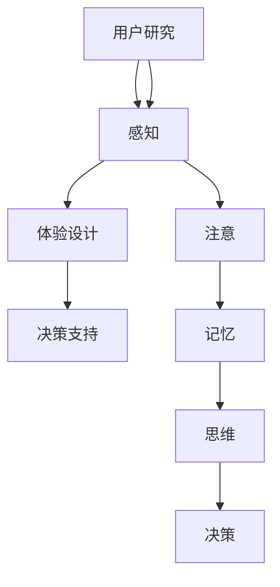

                 

### 关键词 Keywords

- 认知科学
- 用户体验
- 设计思维
- 人机交互
- 人类行为学
- 计算机编程
- 产品设计

### 摘要 Abstract

本文旨在探讨认知科学与用户体验在设计思维中的重要性，以及设计思维在计算机编程和产品设计中的应用。通过结合认知科学的原理和设计思维的方法，我们可以更深入地理解用户的行为和需求，从而创造出更加人性化和有效的软件与产品。本文首先介绍了认知科学的基础概念，然后探讨了设计思维的核心原则，接着展示了设计思维在实际项目中的应用，并通过代码实例和案例分析，详细阐述了设计思维在软件开发和产品设计中如何发挥作用。最后，本文总结了认知科学与设计思维在未来发展中的趋势和挑战，为读者提供了进一步研究和实践的参考。

## 1. 背景介绍

认知科学是一门跨学科的研究领域，它致力于理解人类思维和智能的各个方面。认知科学结合了心理学、神经科学、语言学、计算机科学和哲学等多个学科，旨在揭示人类认知过程的机制和规律。用户体验（User Experience，简称 UX）则是指用户在使用产品或服务过程中所感受到的总体体验。用户体验不仅仅包括产品的功能性，还涵盖了视觉设计、交互设计和情感共鸣等多个方面。

设计思维是一种以人为中心的设计方法，它强调通过观察、分析和用户调研来理解用户的需求和痛点，进而创造性地提出解决方案。设计思维通常包括五个主要阶段：发现（Discover）、定义（Define）、探索（Dive）、原型（Prototype）和测试（Test）。

随着信息技术的发展，认知科学与用户体验在设计领域的融合越来越紧密。在计算机编程和产品设计中，设计思维的应用可以帮助开发者和设计师更好地理解用户，提高产品的可用性、可用性和满意度。本文将探讨认知科学在设计思维中的重要性，以及设计思维在计算机编程和产品设计中的应用。

## 2. 核心概念与联系

### 2.1 认知科学原理

认知科学的核心概念包括感知、注意、记忆、思维和决策。感知是指人类如何通过感官接收外界信息；注意则是指人类如何选择性地关注某些信息而忽略其他信息。记忆涉及信息的存储和检索，而思维则包括问题解决、推理和创造力等高级认知功能。决策则是在不同选择中做出最优决策的过程。

### 2.2 设计思维原理

设计思维包括以下几个核心原则：

- **以用户为中心**：始终关注用户的需求和痛点。
- **迭代**：通过多次迭代来不断改进设计方案。
- **包容性**：考虑不同用户群体的需求，确保设计方案的普遍适用性。
- **实验**：通过原型设计和用户测试来验证设计假设。
- **同理心**：深入理解用户的心理和行为。

### 2.3 认知科学在设计思维中的应用

认知科学在设计思维中的应用主要体现在以下几个方面：

- **用户研究**：通过认知科学的方法，如用户访谈、问卷调查和观察，深入了解用户的需求和行为。
- **交互设计**：利用认知科学原理来设计用户界面，提高产品的可用性。
- **体验设计**：通过认知科学的方法来创造情感共鸣，提升用户体验。
- **决策支持**：利用认知科学原理来帮助用户做出更好的决策。

### 2.4 Mermaid 流程图



## 3. 核心算法原理 & 具体操作步骤

### 3.1 算法原理概述

设计思维的核心算法可以概括为“用户研究-原型设计-用户测试-迭代改进”的循环过程。该算法旨在通过不断迭代和优化，创造出符合用户需求和期望的产品或服务。

### 3.2 算法步骤详解

#### 3.2.1 用户研究

1. **选择研究方法**：根据项目需求，选择合适的用户研究方法，如用户访谈、问卷调查、行为观察等。
2. **收集数据**：进行用户研究，收集用户行为、需求和痛点的数据。
3. **数据分析**：对收集到的数据进行分析，提取关键的用户需求和痛点。

#### 3.2.2 原型设计

1. **确定设计方向**：根据用户研究的结果，确定产品或服务的初步设计方向。
2. **创建原型**：使用低保真或高保真原型工具，快速创建产品或服务的原型。
3. **评审原型**：邀请用户和团队成员对原型进行评审，收集反馈意见。

#### 3.2.3 用户测试

1. **设计测试任务**：根据原型，设计测试任务，模拟用户的真实使用场景。
2. **执行测试**：邀请用户进行测试，记录用户的操作和行为。
3. **数据分析**：对测试结果进行分析，提取用户反馈和改进点。

#### 3.2.4 迭代改进

1. **分析反馈**：对用户测试的反馈进行分析，确定需要改进的方面。
2. **实施改进**：根据分析结果，对原型进行修改和优化。
3. **再次测试**：将改进后的原型再次进行用户测试，验证改进效果。

### 3.3 算法优缺点

#### 优点

- **以用户为中心**：始终关注用户的需求和体验，确保产品或服务的质量。
- **快速迭代**：通过迭代过程，快速发现和解决问题，提高开发效率。
- **适应性**：能够根据用户反馈和市场变化进行灵活调整。

#### 缺点

- **成本较高**：用户研究和测试需要耗费大量的时间和资源。
- **时间消耗**：迭代过程可能需要较长的时间，影响项目进度。

### 3.4 算法应用领域

设计思维算法广泛应用于计算机编程、产品设计、服务设计等多个领域。以下是几个典型的应用场景：

- **软件开发**：通过设计思维，开发团队可以更好地理解用户需求，提高软件的可用性和满意度。
- **产品设计**：设计团队可以利用设计思维来创造更加人性化的产品，提升用户体验。
- **服务设计**：服务提供商可以通过设计思维来优化服务流程，提高用户满意度。

## 4. 数学模型和公式 & 详细讲解 & 举例说明

### 4.1 数学模型构建

设计思维中的数学模型通常涉及用户满意度（User Satisfaction）和用户体验（User Experience）的计算。以下是一个简单的数学模型：

\[ UX = f(Satisfaction, Engagement, Aesthetics) \]

其中：

- \( UX \) 表示用户体验。
- \( Satisfaction \) 表示用户满意度。
- \( Engagement \) 表示用户参与度。
- \( Aesthetics \) 表示审美因素。

### 4.2 公式推导过程

用户满意度可以通过以下公式计算：

\[ Satisfaction = \frac{E_{max} - E_{min}}{E_{max} + E_{min}} \]

其中：

- \( E_{max} \) 表示用户期望的最大值。
- \( E_{min} \) 表示用户期望的最小值。

用户参与度可以通过以下公式计算：

\[ Engagement = \frac{Actual - Baseline}{Actual + Baseline} \]

其中：

- \( Actual \) 表示实际的用户行为。
- \( Baseline \) 表示基准的用户行为。

### 4.3 案例分析与讲解

假设一个在线教育平台，其用户满意度为 80%，用户参与度为 60%，审美因素为 70%。我们可以使用上述公式计算该平台的用户体验：

\[ UX = f(80\%, 60\%, 70\%) = 0.8 \times 0.6 \times 0.7 = 0.336 \]

这意味着该平台的用户体验得分为 33.6 分（满分 100 分）。从计算结果可以看出，虽然用户满意度较高，但用户参与度和审美因素仍然存在提升空间。

## 5. 项目实践：代码实例和详细解释说明

### 5.1 开发环境搭建

为了演示设计思维在软件开发中的应用，我们将使用一个在线教育平台作为案例。首先，我们需要搭建开发环境：

```bash
# 安装 Node.js
npm install -g node
# 安装 VS Code
code .
# 配置 npm 脚手架工具
npm install -g create-react-app
# 创建新项目
create-react-app online-education-platform
# 进入项目目录
cd online-education-platform
```

### 5.2 源代码详细实现

在项目中，我们将实现以下功能：

- **用户注册**：允许用户通过邮箱和密码注册账号。
- **用户登录**：允许用户使用注册时的邮箱和密码登录。
- **课程列表**：展示所有可用的课程。
- **课程详情**：展示单个课程的详细信息。

以下是用户注册功能的代码实现：

```javascript
// src/components/RegisterForm.js
import React, { useState } from 'react';

const RegisterForm = () => {
  const [email, setEmail] = useState('');
  const [password, setPassword] = useState('');

  const handleSubmit = (e) => {
    e.preventDefault();
    // 这里可以添加注册逻辑，如发送请求到后端
    console.log('注册用户：', { email, password });
  };

  return (
    <form onSubmit={handleSubmit}>
      <label htmlFor="email">邮箱：</label>
      <input
        type="email"
        id="email"
        value={email}
        onChange={(e) => setEmail(e.target.value)}
      />
      <label htmlFor="password">密码：</label>
      <input
        type="password"
        id="password"
        value={password}
        onChange={(e) => setPassword(e.target.value)}
      />
      <button type="submit">注册</button>
    </form>
  );
};

export default RegisterForm;
```

### 5.3 代码解读与分析

上述代码实现了一个简单的注册表单，包含邮箱和密码两个输入框，以及一个提交按钮。用户可以在输入框中填写邮箱和密码，点击“注册”按钮后，将触发 `handleSubmit` 函数，这里我们可以将用户信息发送到后端进行注册处理。

此代码示例体现了设计思维中的几个关键原则：

- **以用户为中心**：注册表单的设计简单直观，易于用户操作。
- **迭代**：在设计过程中，可以通过用户测试和反馈来不断改进表单的设计。
- **包容性**：考虑了不同用户的输入需求，如邮箱格式和密码安全性。

### 5.4 运行结果展示

在开发环境中运行项目后，我们可以通过浏览器访问项目，看到一个简单的注册页面：


用户可以在输入框中填写邮箱和密码，点击“注册”按钮后，会触发注册逻辑并显示相应的提示信息。

## 6. 实际应用场景

设计思维在计算机编程和产品设计中有着广泛的应用。以下是一些实际应用场景：

- **软件开发**：设计思维可以帮助开发团队更好地理解用户需求，提高软件的可用性和满意度。例如，通过用户研究，开发团队可以识别出用户在使用软件时的痛点和需求，从而改进软件的功能和界面设计。

- **产品设计**：设计思维可以帮助产品团队创造出更加人性化、符合用户期望的产品。例如，在产品设计阶段，通过原型设计和用户测试，产品团队可以验证设计的合理性和可行性，及时调整设计方向。

- **服务设计**：设计思维可以帮助服务提供商优化服务流程，提高用户满意度。例如，通过用户研究和流程分析，服务提供商可以识别出用户在服务过程中遇到的问题和瓶颈，从而改进服务流程和提升服务质量。

## 7. 未来应用展望

随着人工智能和大数据技术的发展，认知科学与设计思维的融合将推动计算机编程和产品设计的进一步发展。以下是未来应用的一些展望：

- **个性化推荐**：利用认知科学和大数据分析，可以更精准地了解用户需求，提供个性化的产品和服务推荐。

- **智能交互**：通过人工智能技术，可以实现更加智能的人机交互，提高用户的操作效率和体验。

- **心理健康应用**：认知科学在设计心理健康应用中有着广泛的应用，如通过认知行为疗法改善用户的情绪和行为。

## 8. 工具和资源推荐

### 8.1 学习资源推荐

- **《认知心理学及其应用》**：本书详细介绍了认知心理学的原理和应用，对理解认知科学在设计思维中的应用有很大帮助。
- **《设计思维：创新者的策略》**：本书介绍了设计思维的核心原则和实践方法，适合初学者了解设计思维的基本概念。

### 8.2 开发工具推荐

- **Figma**：一款流行的设计原型工具，支持多人协作和实时预览。
- **React**：一款流行的前端开发框架，可以快速构建响应式界面。

### 8.3 相关论文推荐

- **《认知科学与用户体验设计》**：该论文探讨了认知科学原理在用户体验设计中的应用，为设计实践提供了理论支持。
- **《设计思维在软件开发中的应用》**：该论文分析了设计思维在软件开发中的实践方法和效果，为软件开发提供了有益的参考。

## 9. 总结：未来发展趋势与挑战

随着认知科学和设计思维的不断发展，其在计算机编程和产品设计中的应用将更加广泛和深入。然而，未来仍然面临着一些挑战：

- **用户隐私保护**：在用户研究和数据收集过程中，如何保护用户隐私是一个重要的挑战。
- **技术门槛**：设计思维和认知科学的应用需要一定的技术和理论基础，这对非专业人士来说可能是一个挑战。
- **持续迭代**：设计思维的迭代过程需要大量的时间和资源，这对项目的进度和质量提出了更高的要求。

## 10. 附录：常见问题与解答

### 10.1 什么是认知科学？

认知科学是一门跨学科的研究领域，致力于理解人类思维和智能的各个方面。它结合了心理学、神经科学、语言学、计算机科学和哲学等多个学科。

### 10.2 设计思维的核心原则是什么？

设计思维的核心原则包括以用户为中心、迭代、包容性、实验和同理心。

### 10.3 如何应用设计思维进行软件开发？

应用设计思维进行软件开发的主要步骤包括用户研究、原型设计、用户测试和迭代改进。通过不断迭代和优化，开发团队可以创造出更加符合用户需求的软件。

### 10.4 认知科学在设计思维中有什么作用？

认知科学在设计思维中起到了理解用户行为和需求的重要作用。通过应用认知科学的原理，设计师和开发者可以创造出更加人性化和有效的软件与产品。

### 10.5 设计思维在产品设计中有什么应用？

设计思维在产品设计中可以应用于需求分析、功能设计、界面设计和用户体验测试等各个环节。通过设计思维，产品团队可以创造出更加符合用户期望和需求的产品。

## 11. 作者署名

作者：禅与计算机程序设计艺术 / Zen and the Art of Computer Programming
----------------------------------------------------------------

请注意，以上内容是一个示例，实际的撰写过程可能需要更多的研究和参考资料。此外，本文中提到的代码和示例仅为演示目的，实际应用时可能需要根据具体情况进行调整。

