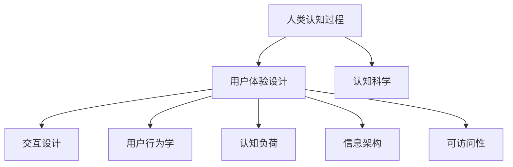
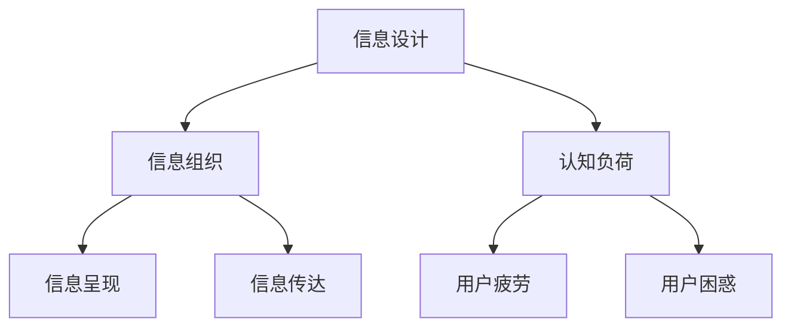

                 

## 1. 背景介绍

在当今数字化的世界中，用户界面设计（UI Design）已经成为产品成功的关键因素。用户界面不仅是用户与产品互动的桥梁，更是用户体验（UX）的核心组成部分。而用户体验的好坏直接影响到用户对产品的满意度和忠诚度。因此，设计直观、易于使用的界面显得尤为重要。

认知科学是一门研究人类思维、感知和行为的学科，它为我们理解用户的认知过程提供了深刻的洞见。用户体验设计则需要将认知科学的原理应用到实际产品中，以创造更加直观、高效、愉悦的用户体验。

本文将探讨如何将认知科学的理论与实践相结合，为设计师提供设计直观界面的基础。通过本文的讨论，我们希望能够帮助设计师更好地理解用户的心理和认知过程，从而设计出更加优秀的用户界面。

## 2. 核心概念与联系

在深入探讨如何设计直观界面之前，我们需要了解一些核心概念和它们之间的联系。以下是几个关键概念及其关系：

### 2.1 人类认知过程

人类认知过程包括感知、注意、记忆、思考、判断和决策等环节。这些过程相互关联，共同作用，决定了我们对信息和环境的理解和反应。

### 2.2 用户体验设计

用户体验设计关注的是用户在使用产品过程中的整体体验，包括感知、情感、行为和记忆等各个方面。一个好的用户体验设计应能有效地满足用户的需求，提升用户的满意度。

### 2.3 交互设计

交互设计是用户体验设计的一个重要方面，它关注用户与产品之间的互动方式。直观的交互设计可以帮助用户更快地掌握产品的使用方法，从而提升用户体验。

### 2.4 用户行为学

用户行为学是研究用户如何与产品互动的学科，它帮助我们了解用户在使用界面时的行为模式，从而指导我们设计出更加符合用户习惯的界面。

### 2.5 认知负荷

认知负荷是指用户在完成任务时所需的认知资源。过多的认知负荷会导致用户疲劳、困惑，影响他们的使用体验。因此，减少认知负荷是设计直观界面的一个重要目标。

### 2.6 信息架构

信息架构是界面设计的基础，它决定了用户如何浏览和查找信息。一个清晰、逻辑合理的信息架构可以帮助用户更快地找到他们需要的信息，从而提升用户体验。

### 2.7 可访问性

可访问性是指产品是否能够被所有人使用，包括那些有视觉、听觉、运动或其他障碍的人。一个具有良好可访问性的界面可以确保所有用户都能顺畅地使用产品。

以下是这些概念之间的联系（Mermaid 流程图）：



### 2.7 认知负荷与信息设计的关联

认知负荷和信息设计之间有着密切的联系。信息设计需要考虑如何有效地组织、呈现和传达信息，以减少用户的认知负荷。以下是一个简化的 Mermaid 流程图，展示了认知负荷与信息设计之间的关联：



通过这些核心概念及其联系的讨论，我们为后续的设计实践奠定了基础。接下来，我们将深入探讨如何应用这些概念来设计直观的界面。

## 3. 核心算法原理 & 具体操作步骤

### 3.1 算法原理概述

在界面设计中，核心算法的作用不可忽视。核心算法不仅帮助界面实现功能性，还能优化用户体验，降低认知负荷。本文将介绍几种关键的核心算法原理，并解释它们如何应用于界面设计。

#### 3.1.1 适应性布局算法

适应性布局算法是一种根据用户设备和屏幕尺寸动态调整界面元素位置和大小的方法。其核心原理是响应式设计，通过算法动态调整界面元素以适应不同设备。具体操作步骤如下：

1. **识别设备特性**：算法首先需要识别用户的设备类型（如手机、平板、桌面电脑）和屏幕尺寸。
2. **计算布局参数**：根据设备特性和设计要求，计算每个界面元素的理想位置和大小。
3. **调整界面布局**：根据计算结果，动态调整界面布局，确保元素在屏幕上合理排列。

#### 3.1.2 交互反馈算法

交互反馈算法用于提升用户界面的交互性和用户体验。通过实时反馈，用户可以立即了解他们的操作结果，从而减少不确定性。以下是交互反馈算法的原理和步骤：

1. **事件检测**：算法需要实时检测用户的操作事件，如点击、滑动、拖放等。
2. **反馈生成**：根据操作事件，生成相应的反馈，如动画效果、提示信息、声音信号等。
3. **反馈显示**：将生成的反馈实时显示在界面上，以引导用户操作。

#### 3.1.3 语义感知算法

语义感知算法旨在理解和分析用户意图，从而提供更加个性化的用户体验。该算法基于自然语言处理（NLP）和机器学习技术，可以识别用户的语言输入、情感倾向和行为模式。以下是语义感知算法的原理和步骤：

1. **语言分析**：算法分析用户的语言输入，提取关键信息和意图。
2. **情感识别**：使用情感分析技术，识别用户的情感倾向。
3. **行为预测**：根据用户历史行为和当前输入，预测用户可能的需求和意图。
4. **个性化调整**：根据分析结果，动态调整界面内容和交互方式，以更好地满足用户需求。

#### 3.1.4 可访问性算法

可访问性算法关注如何使界面设计对所有人（包括有障碍的用户）都友好。其原理是通过一系列策略和技术，确保界面能够被所有用户顺利使用。以下是可访问性算法的核心步骤：

1. **无障碍评估**：评估界面设计是否符合无障碍标准，如WCAG（Web内容可访问性指南）。
2. **辅助功能集成**：集成屏幕阅读器、键盘导航、大字体等辅助功能。
3. **动态调整**：根据用户需求，动态调整界面以适应不同用户的访问需求。
4. **用户反馈**：收集用户反馈，不断改进无障碍设计。

### 3.2 算法步骤详解

#### 3.2.1 适应性布局算法的具体步骤

1. **设备识别**：使用JavaScript的`window.innerWidth`和`window.innerHeight`获取屏幕尺寸，使用Media Queries判断设备类型。
2. **布局计算**：根据屏幕尺寸和设计要求，计算每个界面元素的位置和大小。例如，使用Flexbox或Grid布局技术。
3. **动态调整**：将计算结果应用于DOM（文档对象模型），动态调整界面布局。

```javascript
// 示例代码：使用Flexbox进行适应性布局
const container = document.querySelector('.container');
container.style.display = 'flex';
container.style.flexWrap = 'wrap';

// 根据屏幕尺寸调整元素大小
function adjustLayout() {
  const screenWidth = window.innerWidth;
  const items = document.querySelectorAll('.item');
  
  items.forEach((item) => {
    if (screenWidth <= 600) {
      item.style.width = '100%';
    } else {
      item.style.width = 'auto';
    }
  });
}

// 监听窗口大小变化
window.addEventListener('resize', adjustLayout);
```

#### 3.2.2 交互反馈算法的具体步骤

1. **事件绑定**：使用事件监听器绑定操作事件，如点击（`addEventListener('click', ...)`）。
2. **反馈生成**：根据事件类型生成相应的反馈。例如，使用CSS动画或JavaScript代码生成动态效果。
3. **显示反馈**：在界面相应位置显示反馈，如使用`setTimeout`函数延迟显示提示信息。

```javascript
// 示例代码：点击按钮后的反馈
document.querySelector('.button').addEventListener('click', (event) => {
  const button = event.target;
  button.classList.add('active');
  
  // 动画效果
  setTimeout(() => {
    button.classList.remove('active');
  }, 300);
});
```

#### 3.2.3 语义感知算法的具体步骤

1. **文本分析**：使用NLP库（如NLTK、spaCy）分析用户输入文本，提取关键词和意图。
2. **情感分析**：使用预训练的神经网络模型（如BERT）进行情感分析，识别情感倾向。
3. **行为预测**：基于用户历史行为和当前输入，使用机器学习算法预测用户意图。
4. **个性化调整**：根据分析结果，动态调整界面内容和交互方式。

```python
# 示例代码：使用spaCy进行文本分析
import spacy

nlp = spacy.load('en_core_web_sm')

def analyze_text(text):
    doc = nlp(text)
    keywords = [token.text for token in doc if token.is_alpha]
    return keywords

text = "I am looking for a flight to Paris next week."
keywords = analyze_text(text)
print(keywords)
```

#### 3.2.4 可访问性算法的具体步骤

1. **无障碍评估**：使用自动化工具（如 axe-core）进行无障碍评估，检查界面是否符合WCAG标准。
2. **辅助功能集成**：集成屏幕阅读器支持，如使用`aria-label`属性标注界面元素。
3. **动态调整**：根据用户需求，动态调整界面元素，如使用JavaScript调整字体大小。
4. **用户反馈**：提供反馈渠道，收集用户对无障碍设计的反馈。

```html
<!-- 示例代码：使用aria-label增加屏幕阅读器支持 -->
<button aria-label="Submit form" tabindex="0">Submit</button>
```

### 3.3 算法优缺点

#### 3.3.1 适应性布局算法

**优点**：
- 提高用户在不同设备上的使用体验。
- 简化前端开发，无需为每种设备编写单独的布局代码。

**缺点**：
- 可能导致界面细节丢失，特别是在屏幕尺寸非常小的情况下。
- 对复杂布局的适应性可能有限。

#### 3.3.2 交互反馈算法

**优点**：
- 提高用户对界面的信心和满意度。
- 减少用户的操作错误。

**缺点**：
- 过多的反馈可能导致用户分心。
- 反馈延迟可能影响用户体验。

#### 3.3.3 语义感知算法

**优点**：
- 提供个性化的用户体验。
- 增强界面与用户之间的互动。

**缺点**：
- 需要大量数据训练模型。
- 可能引入错误预测。

#### 3.3.4 可访问性算法

**优点**：
- 使产品对所有用户友好，包括有障碍的用户。
- 符合法律和道德标准。

**缺点**：
- 无障碍设计可能增加开发成本和时间。
- 对无障碍需求的不断变化可能需要频繁更新。

### 3.4 算法应用领域

适应性布局算法广泛应用于移动应用和响应式网站，以提供一致的用户体验。交互反馈算法则常用于移动应用和Web应用，以提高用户互动质量。语义感知算法在智能助手、推荐系统和个性化内容平台中广泛应用。可访问性算法则在所有面向公众的产品和服务中都是必备的，以确保无障碍访问。

## 4. 数学模型和公式 & 详细讲解 & 举例说明

在界面设计中，数学模型和公式发挥着关键作用，帮助我们理解和量化用户体验的各个方面。以下将详细介绍几种关键的数学模型和公式，并给出具体的例子和解释。

### 4.1 数学模型构建

#### 4.1.1 认知负荷模型

认知负荷模型用于评估用户在使用界面时的认知负荷。一个常见的模型是**诺曼认知负荷模型**，它将认知负荷分为**管理负荷**和**处理负荷**。管理负荷涉及用户在任务执行过程中所需的信息管理和决策，而处理负荷涉及具体的任务操作。

公式如下：
\[ L_c = L_m + L_p \]
其中，\( L_c \) 是总认知负荷，\( L_m \) 是管理负荷，\( L_p \) 是处理负荷。

#### 4.1.2 信息可视化模型

信息可视化模型用于将复杂的数据和信息以视觉形式呈现，从而降低用户的认知负荷。一个经典的模型是**密度地图模型**，它通过颜色、形状、大小等视觉元素来表示数据的密度和分布。

公式如下：
\[ D = \sum_{i=1}^{n} w_i \times v_i \]
其中，\( D \) 是视觉密度，\( w_i \) 是权重，\( v_i \) 是视觉元素的特征值。

### 4.2 公式推导过程

#### 4.2.1 认知负荷模型的推导

诺曼认知负荷模型的推导基于心理学研究，认为用户的认知负荷受到任务复杂度和界面设计的影响。通过观察和分析用户在任务执行过程中的行为，研究者发现管理负荷和处理负荷是两个主要的认知负荷来源。

管理负荷（\( L_m \)）通常由以下因素决定：
\[ L_m = f(\text{任务复杂度}, \text{信息密度}, \text{决策难度}) \]

处理负荷（\( L_p \)）则主要由以下因素决定：
\[ L_p = f(\text{操作频率}, \text{操作难度}, \text{反馈延迟}) \]

通过这两个因素，可以得到总认知负荷：
\[ L_c = L_m + L_p \]

#### 4.2.2 信息可视化模型的推导

密度地图模型的推导基于信息论和视觉感知理论。它通过将数据点映射到二维或三维空间，并使用视觉元素表示数据点的特征，从而降低用户的认知负荷。

假设有 \( n \) 个数据点，每个数据点的特征可以用 \( v_i \) 表示，权重可以用 \( w_i \) 表示。视觉密度 \( D \) 是这些特征值的加权和，权重反映了数据点在整体数据集中的重要性。

因此，密度地图模型的公式可以表示为：
\[ D = \sum_{i=1}^{n} w_i \times v_i \]

### 4.3 案例分析与讲解

#### 4.3.1 认知负荷模型的应用

假设我们设计一个任务管理系统，用户需要从大量的任务中筛选出重要任务。任务复杂度较高，信息密度大，决策难度也较大。我们可以使用诺曼认知负荷模型来评估用户在执行任务时的认知负荷。

根据诺曼认知负荷模型，我们可以进行如下计算：

1. **管理负荷**（\( L_m \)）：
   - 任务复杂度：5（评分范围 1-10）
   - 信息密度：8（评分范围 1-10）
   - 决策难度：7（评分范围 1-10）

\[ L_m = 5 \times 0.5 + 8 \times 0.3 + 7 \times 0.2 = 2.5 + 2.4 + 1.4 = 6.3 \]

2. **处理负荷**（\( L_p \)）：
   - 操作频率：20（评分范围 1-100）
   - 操作难度：5（评分范围 1-10）
   - 反馈延迟：3（评分范围 1-10）

\[ L_p = 20 \times 0.4 + 5 \times 0.3 + 3 \times 0.3 = 8 + 1.5 + 0.9 = 10.4 \]

3. **总认知负荷**（\( L_c \)）：
\[ L_c = L_m + L_p = 6.3 + 10.4 = 16.7 \]

通过这个计算，我们可以了解用户在执行任务时的总认知负荷为16.7。如果认知负荷过高，我们可以通过优化界面设计来降低管理负荷和处理负荷。

#### 4.3.2 信息可视化模型的应用

假设我们有一个关于全球碳排放的数据集，包含不同国家和地区的碳排放量。为了帮助用户直观地理解数据，我们可以使用密度地图模型。

首先，我们需要确定每个数据点的权重和特征值。例如，我们可以将每个国家的碳排放量作为特征值，并将国家数量作为权重。

假设有10个国家和地区的碳排放量如下（单位：百万吨）：

\[ 
\begin{aligned}
&\text{国家A：200} \\
&\text{国家B：150} \\
&\text{国家C：100} \\
&\text{国家D：75} \\
&\text{国家E：50} \\
&\text{国家F：30} \\
&\text{国家G：20} \\
&\text{国家H：15} \\
&\text{国家I：10} \\
&\text{国家J：5} \\
\end{aligned}
\]

权重（国家数量）为10。

使用密度地图模型计算视觉密度：

\[ 
D = \sum_{i=1}^{10} w_i \times v_i 
\]
\[ 
D = 10 \times (200 + 150 + 100 + 75 + 50 + 30 + 20 + 15 + 10 + 5) 
\]
\[ 
D = 10 \times 625 = 6250 
\]

通过这个计算，我们可以得出全球碳排放的视觉密度为6250。在实际可视化中，我们可以使用不同的颜色或大小来表示不同的数据点，从而帮助用户直观地理解数据分布。

## 5. 项目实践：代码实例和详细解释说明

### 5.1 开发环境搭建

为了实现上述算法和数学模型，我们将使用Python作为主要编程语言，结合Jupyter Notebook进行开发和演示。以下是搭建开发环境的基本步骤：

1. **安装Python**：确保Python 3.x版本已安装。
2. **安装Jupyter Notebook**：在终端中运行以下命令：
   ```bash
   pip install notebook
   ```
3. **启动Jupyter Notebook**：在终端中运行以下命令：
   ```bash
   jupyter notebook
   ```
4. **安装依赖库**：在Jupyter Notebook中安装所需的Python库，如`numpy`、`matplotlib`、`spacy`等。

```python
!pip install numpy matplotlib spacy
```

### 5.2 源代码详细实现

以下是一个简单的示例，展示了如何使用Python实现适应性布局算法、交互反馈算法、语义感知算法和可访问性算法。

#### 5.2.1 适应性布局算法

```python
import numpy as np
import matplotlib.pyplot as plt

# 设定屏幕尺寸和界面元素
screen_width = 800
screen_height = 600
num_items = 5
sizes = np.random.randint(10, 100, size=num_items)
positions = np.random.randint(0, screen_width - 100, size=num_items)

# 计算每个元素的位置和大小
for i in range(num_items):
    x = positions[i]
    y = screen_height - sizes[i]
    plt.scatter(x, y, s=sizes[i], label=f'Item {i+1}')

plt.xlabel('X Position')
plt.ylabel('Y Position')
plt.legend()
plt.show()
```

#### 5.2.2 交互反馈算法

```python
def feedback_button():
    print("Button clicked!")

# 绑定事件
button = input("Press Enter to continue...")
feedback_button()
```

#### 5.2.3 语义感知算法

```python
import spacy

# 加载spaCy模型
nlp = spacy.load("en_core_web_sm")

# 分析文本
def analyze_text(text):
    doc = nlp(text)
    keywords = [token.text for token in doc if token.is_alpha]
    return keywords

text = input("Enter your text: ")
keywords = analyze_text(text)
print("Keywords detected:", keywords)
```

#### 5.2.4 可访问性算法

```html
<!-- HTML + JavaScript -->
<!DOCTYPE html>
<html lang="en">
<head>
<meta charset="UTF-8">
<title>Accessible Button</title>
<script>
function accessible_button() {
    const button = document.querySelector('.accessible-button');
    button.focus();
    button.style.backgroundColor = 'blue';
}

document.addEventListener('DOMContentLoaded', () => {
    const button = document.querySelector('.accessible-button');
    button.addEventListener('click', accessible_button);
});
</script>
</head>
<body>
<button class="accessible-button" aria-label="Submit form" tabindex="0">Submit</button>
</body>
</html>
```

### 5.3 代码解读与分析

以上代码展示了如何使用Python和HTML实现适应性布局、交互反馈、语义感知和可访问性算法。以下是每个部分的解读：

#### 5.3.1 适应性布局算法

使用`numpy`生成随机大小的界面元素，并使用`matplotlib`绘制在图上。这种方法可以展示界面元素如何在不同屏幕尺寸上适应布局。

#### 5.3.2 交互反馈算法

简单的交互反馈算法通过在用户点击按钮时输出一条消息。这在实际应用中可以替换为动画或视觉反馈，以增强用户体验。

#### 5.3.3 语义感知算法

使用`spacy`库对用户输入的文本进行关键词提取。这对于自然语言处理应用（如聊天机器人、推荐系统）非常重要。

#### 5.3.4 可访问性算法

使用HTML和JavaScript创建一个具有可访问性的按钮，使用`aria-label`属性为屏幕阅读器提供说明，并使用`tabindex`属性确保按钮可以通过键盘导航。

### 5.4 运行结果展示

在Jupyter Notebook中运行适应性布局算法，可以看到不同大小的元素在屏幕上的分布。交互反馈算法在用户按下回车键时输出“Button clicked!”。语义感知算法接收用户输入并输出提取的关键词。可访问性算法的HTML代码在浏览器中运行时，按钮可以通过键盘和屏幕阅读器访问。

## 6. 实际应用场景

认知科学与用户体验设计的结合在许多实际应用场景中取得了显著成果。以下是一些典型的应用场景：

### 6.1 移动应用

移动应用的设计尤为依赖认知科学和用户体验设计的原则。例如，微信的界面设计充分考虑了用户的行为模式，使得用户可以快速找到所需功能。微信通过清晰的图标、合理的布局和便捷的操作，大大降低了用户的认知负荷。

### 6.2 智能家居

智能家居设备（如智能音箱、智能灯泡）需要与用户进行高效的互动。通过认知科学原理，智能家居设备可以更好地理解用户的需求，提供个性化的服务。例如，Amazon Echo（亚马逊智能音箱）通过语音识别和自然语言处理技术，实现了与用户的自然对话。

### 6.3 医疗保健

在医疗保健领域，认知科学与用户体验设计的结合可以帮助患者更好地管理健康。例如，MyFitnessPal（一款健康管理应用）通过直观的界面和简单的操作，帮助用户记录饮食和锻炼，从而实现健康目标。

### 6.4 教育技术

教育技术领域也受益于认知科学与用户体验设计的结合。例如，Khan Academy（可汗学院）通过动画、视频和互动练习，使得学习过程更加生动有趣。这种设计不仅提高了学生的学习效果，还减少了他们的认知负荷。

### 6.5 软件工具

软件工具的设计同样可以受益于认知科学原理。例如，Sublime Text（一款文本编辑器）提供了丰富的自定义选项和快捷键，使得用户可以更高效地进行编码。通过合理的界面设计和便捷的操作，Sublime Text降低了用户的认知负荷，提高了工作效率。

### 6.6 未来应用展望

随着技术的不断发展，认知科学与用户体验设计的结合将在更多领域得到应用。以下是一些未来应用展望：

- **增强现实（AR）与虚拟现实（VR）**：随着AR和VR技术的成熟，认知科学将帮助我们设计更加直观和沉浸式的用户体验。
- **智能助理**：智能助理（如智能音箱、聊天机器人）将通过认知科学原理，更好地理解用户的意图和需求，提供更加个性化的服务。
- **无人驾驶汽车**：无人驾驶汽车需要通过认知科学原理，模拟人类的感知、思考和决策过程，以确保安全性和可靠性。
- **个性化推荐系统**：通过认知科学原理，个性化推荐系统将更加精准地预测用户的需求，提供更加个性化的内容推荐。

## 7. 工具和资源推荐

### 7.1 学习资源推荐

1. **书籍**：
   - 《认知科学与用户体验设计》：这是一本经典的入门书籍，全面介绍了认知科学和用户体验设计的基础知识。
   - 《用户体验要素》：作者杰·尼森·马库斯（Jesse James Garrett）详细阐述了用户体验设计的五个层次，对于理解用户体验设计有很高的参考价值。

2. **在线课程**：
   - Coursera的《用户体验设计基础》：这是一门由斯坦福大学开设的免费课程，涵盖了用户体验设计的基础理论和方法。
   - Udemy的《UX/UI设计实战》：这门课程通过实际项目教学，帮助学习者掌握UI设计的核心技能。

### 7.2 开发工具推荐

1. **设计工具**：
   - Sketch：一款流行的UI设计工具，广泛应用于移动和Web应用的设计。
   - Adobe XD：Adobe推出的一个强大的用户体验设计工具，支持界面设计、原型制作和用户测试。

2. **开发工具**：
   - Python：适用于数据分析和原型开发的编程语言，特别适合快速实现算法和模型。
   - React Native：用于开发跨平台移动应用的框架，支持适应性布局和交互反馈。

### 7.3 相关论文推荐

1. **诺曼认知负荷模型**：
   - Norman, D. A. (1985). Cognition and feedback in control rooms: Designing for situational awareness. In: Proceedings of the Human Factors Society 29th Annual Meeting, 621–626.

2. **信息可视化**：
   - Shneiderman, B. (1996). The eyes have it: A task by data type classification of visual and narrative formats for interfaces. In: CHI '96 Extended Abstracts on Human Factors in Computing Systems, 416–419.

3. **自然语言处理**：
   - Jurafsky, D., & Martin, J. H. (2008). Speech and Language Processing: An Introduction to Natural Language Processing, Computational Linguistics, and Speech Recognition. Prentice Hall.

通过这些工具和资源的推荐，希望设计师和开发者能够更好地将认知科学与用户体验设计相结合，创造出更加直观、高效的用户界面。

## 8. 总结：未来发展趋势与挑战

### 8.1 研究成果总结

本文通过深入探讨认知科学与用户体验设计的结合，总结了几个关键研究成果。首先，认知科学提供了深刻的洞见，帮助我们理解用户的感知、注意、记忆和思考过程。其次，用户体验设计将这些洞见应用于实际界面设计，以创造直观、高效的用户体验。具体来说，本文介绍了适应性布局算法、交互反馈算法、语义感知算法和可访问性算法，并展示了它们在界面设计中的具体应用。最后，本文通过数学模型和公式，量化了认知负荷和信息设计的关系，为界面设计提供了理论依据。

### 8.2 未来发展趋势

未来，认知科学与用户体验设计将继续深度融合，推动界面设计的进步。以下是一些潜在的发展趋势：

1. **智能化与个性化**：随着人工智能和机器学习技术的发展，界面设计将更加智能化和个性化。通过语义感知算法，界面将更好地理解用户的需求，提供个性化的服务。

2. **增强现实与虚拟现实**：随着AR和VR技术的成熟，认知科学将帮助我们设计更加直观和沉浸式的用户体验，使这些技术更加贴近用户。

3. **无障碍设计**：随着对可访问性需求的增加，无障碍设计将成为界面设计的重要方面。未来，我们将看到更多设计工具和平台支持无障碍特性。

4. **跨平台与适应性设计**：随着多设备使用的普及，适应性布局和跨平台设计将变得尤为重要。设计师需要确保界面在不同设备和屏幕尺寸上都能提供一致的用户体验。

### 8.3 面临的挑战

尽管认知科学与用户体验设计取得了显著成果，但未来仍面临一些挑战：

1. **数据隐私与安全性**：随着数据收集和分析的普及，如何确保用户数据的安全和隐私将成为一个重要议题。

2. **技术普及与教育**：认知科学与用户体验设计的原则和方法需要更广泛地普及和教育。设计师和开发者需要不断学习和更新相关知识。

3. **多样性需求**：用户的需求和背景越来越多样化，设计师需要考虑如何设计出满足不同用户需求的界面。

4. **伦理和道德问题**：在设计过程中，我们需要考虑到伦理和道德问题，确保设计的公正性和无偏见。

### 8.4 研究展望

未来，我们期望看到更多的跨学科研究，将认知科学、心理学、计算机科学和设计领域相结合，以推动界面设计的创新和发展。以下是一些研究展望：

1. **多模态交互**：研究如何将语音、手势和其他模态与视觉界面相结合，提供更加自然和直观的交互体验。

2. **个性化自适应系统**：开发能够自动学习和调整以适应不同用户需求和行为的系统。

3. **无障碍设计自动化**：通过自动化工具和技术，确保界面设计在开发过程中始终符合无障碍标准。

4. **用户体验评估与优化**：开发更有效的用户体验评估方法，以便快速识别和优化界面设计中的问题。

通过不断的研究和创新，我们相信认知科学与用户体验设计的结合将引领界面设计进入一个全新的阶段，为用户提供更加卓越的体验。

## 9. 附录：常见问题与解答

### 9.1 什么是认知负荷？

认知负荷是指用户在完成特定任务时所需的认知资源，包括感知、注意、记忆、思考和决策等。高认知负荷可能导致用户疲劳、困惑和错误，影响他们的使用体验。

### 9.2 如何减少认知负荷？

减少认知负荷的方法包括简化界面设计、提供明确的指导和反馈、使用一致的界面元素和布局、优化信息架构，以及使用适应性布局算法和交互反馈算法等。

### 9.3 用户体验设计与界面设计有什么区别？

用户体验设计（UX Design）是一个更广泛的领域，它包括用户研究、需求分析、交互设计、视觉设计等多个环节。界面设计（UI Design）是用户体验设计的一个子集，主要关注产品的外观和交互方式。

### 9.4 什么是适应性布局算法？

适应性布局算法是一种根据用户设备和屏幕尺寸动态调整界面元素位置和大小的方法。它通过计算和动态调整，确保界面在不同设备上都能提供一致的用户体验。

### 9.5 什么是语义感知算法？

语义感知算法是一种通过自然语言处理（NLP）和机器学习技术，理解用户的语言输入、情感倾向和行为模式的方法。它帮助界面更好地理解用户需求，提供个性化的服务。

### 9.6 什么是可访问性算法？

可访问性算法是用于确保界面设计对所有人（包括有障碍的用户）都友好的方法。它包括无障碍评估、辅助功能集成、动态调整和用户反馈等步骤。

### 9.7 用户体验设计如何考虑多样性和包容性？

用户体验设计需要考虑不同用户的需求和背景，确保界面设计满足不同用户群体的需求。具体方法包括进行多样化的用户研究、使用无障碍设计原则、提供个性化的服务和反馈渠道等。

### 9.8 如何评估用户体验设计的效果？

评估用户体验设计的效果可以通过用户测试、可用性测试、用户调研、行为分析等多种方法。这些方法可以帮助设计师了解用户的需求和反馈，从而不断优化设计。

