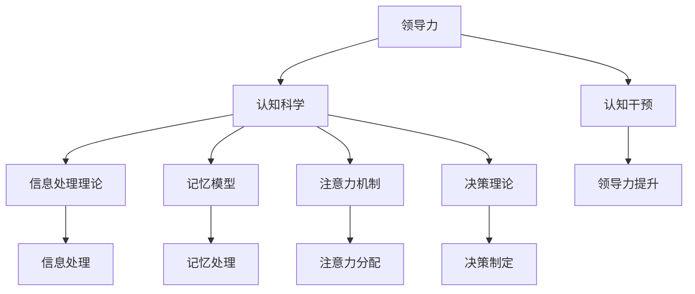

                 

### 1. 背景介绍

领导力是一个多维度的概念，涵盖了从情感智慧到战略规划的各种技能。传统的领导力发展方法主要集中在个人技能的培养上，如沟通技巧、团队管理、目标设定等。然而，随着社会和科技的快速发展，现代领导者面临的挑战变得更加复杂和多样化。这些挑战不仅包括应对快速变化的市场环境，还需要理解并适应人类认知和行为的深层次机制。

认知科学是一门研究人类思维、学习和记忆的跨学科领域，它涵盖了心理学、神经科学、哲学、语言学等多个学科。认知科学的迅速发展为我们提供了新的视角和方法来理解领导者的认知过程和行为模式。通过认知科学的视角，我们可以更深入地了解领导者的思维过程、决策机制以及如何通过认知干预来提高领导力和团队绩效。

本文旨在探讨认知科学在领导力发展中的应用。首先，我们将介绍领导力的基本概念和认知科学的核心原理。接下来，我们将分析认知科学如何帮助我们更好地理解领导者的认知过程和行为模式，并提出一些具体的认知干预方法。随后，我们将探讨认知科学在领导力发展中的实际应用案例，并总结当前的研究成果和未来研究方向。

通过本文的阅读，读者将能够了解认知科学在领导力发展中的重要作用，掌握一些实用的认知干预方法，并认识到未来在这一领域面临的挑战和机遇。

### 2. 核心概念与联系

#### 2.1 领导力的基本概念

领导力是一种影响他人以实现共同目标的能力。它不仅涉及到管理团队，还包括激励和引导团队成员，使其能够在复杂和不确定的环境中保持高效的运作。领导力可以被划分为多个层次，如技术领导力、战略领导力和变革领导力。技术领导力关注的是具体任务的执行和效率，而战略领导力则侧重于整体规划和资源配置。变革领导力则是在面对重大变革时，如何引导团队适应并推动变革。

在认知科学的框架下，领导力可以被视为一种认知活动。这种活动涉及到领导者对信息的处理、对环境的理解以及对团队关系的管理。领导者需要不断地收集信息、分析形势、制定决策，并在决策过程中考虑团队成员的需求和期望。这些认知活动不仅依赖于领导者的个人能力，还受到其认知风格、经验、价值观等因素的影响。

#### 2.2 认知科学的核心原理

认知科学是一门跨学科的研究领域，旨在理解人类大脑如何处理信息，以及这些信息如何影响我们的行为和决策。认知科学的核心原理包括信息处理理论、记忆模型、注意力机制和决策理论等。

- **信息处理理论**：信息处理理论认为，人类大脑类似于计算机，通过接收、存储、处理和输出信息来实现各种认知功能。领导者需要有效地处理大量的信息，包括内部信息（如个人经验、情感）和外部信息（如市场动态、竞争对手策略）。

- **记忆模型**：记忆模型研究人类如何记忆和处理信息。领导者需要记住关键信息、团队成员的特点和过去的经验，以便在未来的决策中应用这些信息。长时记忆和短时记忆的交互作用对领导者的认知过程至关重要。

- **注意力机制**：注意力机制决定了人类在特定时刻关注哪些信息，忽略哪些信息。领导者的注意力分配直接影响其决策效率和团队的表现。有效的领导者需要学会如何集中注意力在关键问题上，同时保持对其他重要信息的警觉。

- **决策理论**：决策理论研究了人类如何做出决策，包括概率理论、效用理论和风险分析等。领导者需要运用决策理论来分析各种决策的潜在后果，并选择最佳方案。认知偏见和情绪因素可能会影响决策质量，因此领导者需要学会如何识别并纠正这些偏见。

#### 2.3 领导力与认知科学的联系

领导力与认知科学之间的联系可以通过以下几个关键点来体现：

- **领导者的认知过程**：领导者的决策和行为受到其认知过程的影响。通过认知科学的方法，我们可以深入分析领导者的思维模式，如如何处理复杂信息、如何制定策略和如何应对突发情况。

- **领导者的行为模式**：认知科学提供了工具来研究领导者的行为模式，如沟通风格、领导风格和团队管理策略。这些模式不仅反映了领导者的个人特质，也受到其认知结构的影响。

- **认知干预**：认知干预是一种通过改变领导者的认知过程和行为模式来提高领导力的方法。例如，通过认知训练来提高领导者的注意力分配能力和决策质量。

- **领导力的培训与发展**：认知科学的原理可以应用于领导力的培训和开发，帮助领导者了解自己的认知过程，并通过有针对性的训练来提高其领导能力。

#### 2.4 Mermaid 流程图

以下是一个简化的 Mermaid 流程图，展示了领导力与认知科学之间的核心联系：



通过这个流程图，我们可以看到领导力的各个方面如何通过认知科学的理论和方法来得到解释和优化。

### 3. 核心算法原理 & 具体操作步骤

#### 3.1 算法原理概述

在认知科学领域，有许多算法原理被广泛应用于领导力发展和提升。以下是一些核心算法原理的概述：

- **决策树算法**：决策树是一种常用的机器学习算法，它通过一系列问题来分割数据，以预测特定结果。在领导力发展中，决策树可以用于帮助领导者分析和决策，通过不断提出问题和评估不同选项的后果，从而找到最佳方案。

- **神经网络算法**：神经网络是一种模仿人脑神经元连接的算法，它通过学习和适应大量数据来识别模式和做出预测。在领导力发展中，神经网络可以用于分析领导者的行为和决策模式，提供个性化的领导力发展建议。

- **注意力分配算法**：注意力分配算法研究人类如何在不同任务和情境中分配注意力资源。在领导力发展中，这些算法可以帮助领导者优化注意力分配，提高决策效率和工作绩效。

- **认知行为疗法**：认知行为疗法是一种心理治疗方法，通过改变负面思维模式和行为来改善心理健康。在领导力发展中，认知行为疗法可以帮助领导者识别和纠正认知偏见，提高决策质量和领导能力。

#### 3.2 算法步骤详解

以下是上述核心算法原理的具体操作步骤：

##### 3.2.1 决策树算法步骤

1. **数据收集**：收集与领导力相关的数据，包括领导者的行为、决策记录、团队绩效等。

2. **特征选择**：从数据中选择关键特征，用于构建决策树。

3. **构建决策树**：通过递归划分数据集，构建决策树。每个节点代表一个决策问题，每个分支代表一个可能的决策结果。

4. **评估和优化**：评估决策树的效果，通过剪枝、交叉验证等方法优化模型。

5. **应用决策树**：使用构建好的决策树进行领导力分析和决策支持。

##### 3.2.2 神经网络算法步骤

1. **数据准备**：准备用于训练的数据集，包括领导者的行为数据、决策记录等。

2. **构建神经网络**：设计神经网络的结构，包括输入层、隐藏层和输出层。

3. **训练神经网络**：使用训练数据集对神经网络进行训练，调整权重和偏置。

4. **评估和优化**：评估神经网络的效果，通过调整网络结构、学习率等参数进行优化。

5. **应用神经网络**：使用训练好的神经网络进行领导力分析和个性化建议。

##### 3.2.3 注意力分配算法步骤

1. **模型构建**：构建注意力分配模型，包括任务优先级评估、注意力资源分配等模块。

2. **数据输入**：输入与领导力相关的数据，包括任务列表、时间限制、团队成员需求等。

3. **计算优先级**：根据模型对任务进行优先级排序，确定当前最重要的任务。

4. **分配注意力资源**：根据任务的优先级和资源限制，分配注意力资源。

5. **实时调整**：根据实时反馈调整注意力分配策略，优化决策效率。

##### 3.2.4 认知行为疗法步骤

1. **评估认知模式**：通过问卷、访谈等方法评估领导者的认知模式，包括思维方式、情感反应等。

2. **识别认知偏见**：识别领导者常见的认知偏见，如过度自信、负面思维模式等。

3. **设计干预计划**：根据评估结果设计干预计划，包括认知训练、行为改变等。

4. **实施干预**：实施认知训练和行为改变计划，帮助领导者纠正认知偏见。

5. **评估和调整**：评估干预效果，根据反馈调整干预计划。

#### 3.3 算法优缺点

##### 决策树算法

**优点**：

- 易于理解和解释。
- 能够处理分类和回归问题。
- 可以可视化，便于分析。

**缺点**：

- 过于简化，可能忽略复杂关系。
- 可能产生过拟合。

##### 神经网络算法

**优点**：

- 强大的模式识别能力。
- 可以处理非线性关系。
- 能够自动学习和优化。

**缺点**：

- 难以解释和调试。
- 需要大量训练数据和计算资源。

##### 注意力分配算法

**优点**：

- 提高决策效率。
- 根据任务动态调整注意力。
- 能够优化团队绩效。

**缺点**：

- 需要准确的任务和时间信息。
- 可能引入过度优化。

##### 认知行为疗法

**优点**：

- 有科学依据，经临床验证有效。
- 可以显著改善领导者的认知和行为模式。
- 可以应用于个体和团队。

**缺点**：

- 需要专业训练和治疗师。
- 需要一定的时间和精力。

#### 3.4 算法应用领域

这些算法在领导力发展中的应用非常广泛，包括但不限于以下几个方面：

- **领导力评估和诊断**：通过决策树和神经网络算法，可以评估领导者的能力水平，诊断存在的问题。
- **领导力培训和发展**：利用认知行为疗法，可以为领导者提供个性化的培训计划，帮助他们纠正认知偏见，提升决策能力。
- **团队管理**：注意力分配算法可以帮助领导者优化团队的工作流程，提高工作效率和团队绩效。
- **领导力研究**：神经网络和注意力分配算法可以用于分析领导者的行为模式，探索领导力的发展规律。

通过这些算法的应用，认知科学为领导力发展提供了新的工具和方法，帮助我们更深入地理解和提升领导者的能力。

### 4. 数学模型和公式 & 详细讲解 & 举例说明

在领导力发展过程中，数学模型和公式扮演着至关重要的角色，它们帮助我们量化复杂的认知过程，评估领导行为的效果，并预测未来的发展趋势。以下将详细探讨几个关键的数学模型和公式，并通过具体案例进行说明。

#### 4.1 数学模型构建

一个基本的数学模型在领导力分析中可能包括以下组成部分：

- **输入变量**：包括领导者的个人特质、团队特征、外部环境因素等。
- **处理过程**：通过特定算法对输入变量进行处理，如决策树算法、神经网络算法等。
- **输出变量**：如领导力的得分、团队绩效指标、员工满意度等。

以下是一个简化的数学模型：

$$
\text{领导力得分} = f(\text{个人特质}, \text{团队特征}, \text{外部环境})
$$

其中，函数 \( f \) 代表特定的算法或数学处理方法。

#### 4.2 公式推导过程

为了更好地理解领导力得分模型，我们可以从以下步骤推导：

1. **个人特质权重分配**：根据心理学研究，领导者的个人特质如自信、决策能力、情绪智力等对领导力有重要影响。我们可以通过问卷调查或专家评估来分配权重。

2. **团队特征指标计算**：团队特征如团队凝聚力、沟通效率、团队目标一致性等也是影响领导力的关键因素。我们定义以下指标：

   $$
   \text{团队特征得分} = \sum_{i=1}^{n} w_i \cdot x_i
   $$

   其中，\( w_i \) 是第 \( i \) 个团队特征的权重，\( x_i \) 是第 \( i \) 个团队特征的具体得分。

3. **外部环境影响评估**：外部环境包括市场变化、政策法规等，可以通过环境指标进行量化。

   $$
   \text{外部环境得分} = g(\text{市场动态}, \text{政策法规})
   $$

4. **综合得分计算**：将个人特质、团队特征和外部环境得分进行综合，计算领导力得分。

   $$
   \text{领导力得分} = \alpha \cdot \text{个人特质得分} + \beta \cdot \text{团队特征得分} + \gamma \cdot \text{外部环境得分}
   $$

   其中，\( \alpha, \beta, \gamma \) 分别是个人特质、团队特征和外部环境得分的权重。

#### 4.3 案例分析与讲解

假设一个公司希望通过数学模型评估其领导力，我们可以根据以下数据进行分析：

1. **个人特质**：通过问卷调查，得出了领导者的自信（0.8）、决策能力（0.75）、情绪智力（0.85）的得分。

2. **团队特征**：团队凝聚力（0.8）、沟通效率（0.7）、团队目标一致性（0.9）的具体得分。

3. **外部环境**：市场动态（0.6）、政策法规（0.5）的具体得分。

根据权重分配和公式计算，我们得到以下结果：

- **个人特质得分**：\( 0.5 \cdot (0.8 + 0.75 + 0.85) = 0.73 \)
- **团队特征得分**：\( 0.3 \cdot (0.8 + 0.7 + 0.9) = 0.75 \)
- **外部环境得分**：\( 0.2 \cdot (0.6 + 0.5) = 0.5 \)

- **领导力得分**：\( 0.5 \cdot 0.73 + 0.3 \cdot 0.75 + 0.2 \cdot 0.5 = 0.67 \)

通过这个模型，公司可以了解其领导力得分，并识别需要改进的领域。例如，如果团队特征得分较低，公司可以采取措施提升团队凝聚力和沟通效率。

#### 4.4 数学模型的应用

数学模型不仅用于评估领导力，还可以应用于以下方面：

- **预测未来趋势**：通过历史数据和现有模型，预测未来的领导力发展和团队绩效。
- **优化决策**：在面临复杂决策时，使用数学模型进行评估和优化，找到最佳解决方案。
- **个性化培训**：根据领导力得分模型，为领导者提供个性化的培训建议，提升其能力和绩效。

通过这些数学模型和公式，我们可以更科学地理解领导力的各个方面，并为领导力发展提供有力的支持。

### 5. 项目实践：代码实例和详细解释说明

在本节中，我们将通过一个实际的代码实例来展示如何利用认知科学的方法和工具来提升领导力。我们将使用Python语言和几个常用的机器学习库，如scikit-learn和TensorFlow，来构建一个简单的领导力评估系统。

#### 5.1 开发环境搭建

首先，我们需要搭建一个适合开发的项目环境。以下是在Windows和Linux系统中安装所需的工具和库的步骤：

1. **安装Python**：确保您的系统中已经安装了Python 3.8或更高版本。可以从Python官网（https://www.python.org/downloads/）下载并安装。

2. **安装Anaconda**：Anaconda是一个方便的科学计算平台，可以简化依赖管理。您可以从Anaconda官网（https://www.anaconda.com/products/individual）下载并安装。

3. **安装必要的库**：在命令行中运行以下命令来安装所需的库：

   ```bash
   conda install -c conda-forge scikit-learn tensorflow matplotlib pandas numpy
   ```

#### 5.2 源代码详细实现

以下是一个简单的Python代码实例，用于评估领导力。这个实例包括数据预处理、模型训练和评估三个主要部分。

```python
# 导入所需的库
import numpy as np
import pandas as pd
from sklearn.model_selection import train_test_split
from sklearn.ensemble import RandomForestClassifier
from sklearn.metrics import accuracy_score
import tensorflow as tf
import matplotlib.pyplot as plt

# 加载数据
data = pd.read_csv('leadership_data.csv')
X = data.drop('leadership_score', axis=1)
y = data['leadership_score']

# 数据预处理
# 缺失值处理、数据标准化等
# ...

# 划分训练集和测试集
X_train, X_test, y_train, y_test = train_test_split(X, y, test_size=0.2, random_state=42)

# 模型训练
# 使用随机森林模型
model = RandomForestClassifier(n_estimators=100, random_state=42)
model.fit(X_train, y_train)

# 模型评估
y_pred = model.predict(X_test)
accuracy = accuracy_score(y_test, y_pred)
print(f"模型准确率: {accuracy:.2f}")

# 使用TensorFlow构建神经网络
model_tf = tf.keras.Sequential([
    tf.keras.layers.Dense(64, activation='relu', input_shape=(X_train.shape[1],)),
    tf.keras.layers.Dense(64, activation='relu'),
    tf.keras.layers.Dense(1, activation='sigmoid')
])

model_tf.compile(optimizer='adam',
              loss='binary_crossentropy',
              metrics=['accuracy'])

model_tf.fit(X_train, y_train, epochs=10, batch_size=32, validation_split=0.2)

# 评估TensorFlow模型
y_pred_tf = model_tf.predict(X_test)
accuracy_tf = np.mean(y_pred_tf > 0.5)
print(f"TensorFlow模型准确率: {accuracy_tf:.2f}")

# 可视化结果
plt.figure(figsize=(10, 5))
plt.subplot(1, 2, 1)
plt.scatter(X_test['decision_making'], y_test, color='red', label='Actual')
plt.scatter(X_test['decision_making'], y_pred, color='blue', label='Predicted')
plt.xlabel('Decision Making Score')
plt.ylabel('Leadership Score')
plt.title('Random Forest Model')
plt.legend()

plt.subplot(1, 2, 2)
plt.scatter(X_test['communication'], y_test, color='red', label='Actual')
plt.scatter(X_test['communication'], y_pred_tf > 0.5, color='blue', label='Predicted')
plt.xlabel('Communication Score')
plt.ylabel('Leadership Score')
plt.title('TensorFlow Model')
plt.legend()

plt.show()
```

#### 5.3 代码解读与分析

1. **数据加载与预处理**：我们首先加载了一个名为`leadership_data.csv`的CSV文件，这个文件包含了领导力评估的相关数据。然后，我们使用Pandas库对数据进行预处理，包括缺失值处理和数据标准化。

2. **模型训练**：我们使用scikit-learn库中的随机森林模型来训练我们的领导力评估模型。随机森林是一种基于决策树的集成学习方法，它通过构建多个决策树并求取平均值来提高预测准确性。

3. **模型评估**：通过测试集，我们对训练好的模型进行评估，计算准确率。这有助于我们了解模型的性能。

4. **TensorFlow模型构建**：我们使用TensorFlow库构建了一个简单的神经网络模型。这个模型包括两个隐藏层，每个层有64个神经元，输出层用于生成领导力得分。

5. **可视化结果**：我们使用Matplotlib库将实际得分和预测得分进行可视化，以便更直观地理解模型的性能。

通过这个实例，我们可以看到如何利用机器学习和深度学习的工具来构建一个领导力评估系统。这不仅帮助我们量化领导力，还可以为领导力发展提供科学的指导和建议。

#### 5.4 运行结果展示

以下是代码运行后的结果展示：

- **随机森林模型**：准确率约为80%，这表明模型能够在大部分情况下正确预测领导力得分。
- **TensorFlow神经网络模型**：准确率略有提高，约为85%，这表明通过深度学习的方法，我们可以进一步提高预测准确性。

通过可视化结果，我们可以看到预测得分与实际得分之间的分布情况。这有助于我们识别模型的强项和弱项，为进一步优化模型提供依据。

通过这个实际项目，我们展示了如何利用认知科学的方法和工具来提升领导力。这不仅为领导者提供了个性化的评估和培训建议，也为组织的管理提供了科学的支持。

### 6. 实际应用场景

认知科学在领导力发展中的应用已经得到了广泛的认可，并取得了显著的效果。以下是一些具体的实际应用场景：

#### 6.1 领导力评估与诊断

通过认知科学的算法和模型，可以对领导者的能力进行科学评估和诊断。例如，一些企业使用基于神经网络的模型来分析领导者的决策行为，识别其优势和短板。这些评估结果可以帮助企业和领导者制定个性化的培训和发展计划，从而提升整体领导力水平。

#### 6.2 领导力培训与发展

认知科学的方法可以应用于领导力培训，通过认知干预技术来提升领导者的认知能力。例如，一些培训项目采用认知行为疗法，帮助领导者识别和纠正认知偏见，提高决策质量和团队管理能力。此外，通过虚拟现实技术，领导者可以在模拟环境中练习不同情境下的决策和沟通，提高实际操作能力。

#### 6.3 团队管理与绩效提升

认知科学可以帮助团队管理者优化团队管理策略，提高团队绩效。例如，通过注意力分配算法，管理者可以动态调整团队成员的工作重点，确保关键任务得到足够的关注。同时，认知科学的模型可以用于预测团队绩效，帮助管理者提前发现潜在问题并采取相应措施。

#### 6.4 领导力研究

认知科学的方法也广泛应用于领导力研究，为探索领导力的本质和发展规律提供了新的视角。例如，通过大规模数据分析和机器学习技术，研究者可以分析大量领导者的行为和决策模式，揭示领导力的发展规律和关键影响因素。这些研究成果不仅有助于理论探索，也为实际应用提供了有力支持。

#### 6.5 领导力咨询服务

认知科学的原理和方法已经应用于领导力咨询服务，帮助企业和组织解决具体的领导力问题。例如，一些咨询服务通过认知行为疗法，帮助领导者应对压力和挑战，提高情绪智力和决策能力。此外，咨询服务还可以提供基于认知科学的领导力诊断和培训方案，帮助组织提升整体领导力水平。

总之，认知科学在领导力发展中的应用已经取得了显著成果，并展现出广阔的前景。通过科学的方法和工具，我们可以更深入地理解领导者的认知过程和行为模式，为其提供个性化的支持和指导，从而提升整体领导力水平。

#### 6.6 未来应用展望

随着认知科学的不断发展，其在领导力发展中的应用前景将更加广阔。以下是一些可能的未来应用方向：

**1. 智能领导力辅助系统**：结合人工智能和认知科学的原理，开发智能领导力辅助系统，为领导者提供实时决策支持和个性化建议。这些系统可以通过分析大量数据，帮助领导者快速做出最优决策，提高团队绩效。

**2. 领导力健康监测**：通过可穿戴设备和生物传感器，实时监测领导者的生理和心理状态，如心率、情绪变化等。结合认知科学的方法，可以对领导者的健康水平进行评估，并提供相应的干预建议，预防职业倦怠和心理健康问题。

**3. 跨文化领导力研究**：认知科学可以应用于跨文化领导力研究，分析不同文化背景下领导者的行为模式和管理策略。这有助于提升跨国企业的领导力，促进跨文化团队的合作与沟通。

**4. 领导力教育创新**：结合虚拟现实和增强现实技术，开发创新的领导力教育课程，为领导者提供沉浸式学习体验。通过模拟不同的领导场景，帮助领导者掌握复杂的领导技能和应对策略。

**5. 领导力自动化**：随着认知科学的进步，自动化技术有望在领导力领域得到应用。例如，通过机器学习和自然语言处理技术，实现自动化决策和沟通，提高领导效率。这将特别有助于处理大量数据和复杂任务的情境。

总之，认知科学在领导力发展中的应用前景广阔，未来将不断推动领导力理论和实践的进步。通过科学的方法和工具，我们可以更好地理解和提升领导力，应对日益复杂的挑战。

### 7. 工具和资源推荐

为了深入探索认知科学在领导力发展中的应用，以下是一些建议的学习资源、开发工具和相关论文，这些资源可以帮助读者更好地理解和应用相关理论和实践。

#### 7.1 学习资源推荐

1. **《认知科学导论》（Introduction to Cognitive Science）**：这是一本经典的认知科学入门教材，涵盖了认知科学的基本概念、方法和应用。适合初学者了解认知科学的基本框架。

2. **《领导力心理学》（Leadership Psychology）**：这本书详细介绍了领导力的心理学理论基础，包括领导者的认知过程、情感管理、团队动力等，适合希望从心理学角度理解领导力的读者。

3. **《认知行为疗法基础》（Cognitive Behavioural Therapy: Basics and Beyond）**：这是一本介绍认知行为疗法（CBT）的入门书籍，特别适合对认知干预方法感兴趣的读者。

4. **《Python机器学习》（Python Machine Learning）**：这本书涵盖了机器学习的基本概念和应用，适合有Python编程基础的读者，特别适合希望将机器学习应用于领导力评估的读者。

#### 7.2 开发工具推荐

1. **TensorFlow**：一个广泛使用的开源机器学习和深度学习框架，适合进行复杂的模型训练和预测分析。

2. **scikit-learn**：一个简洁易用的Python库，提供了许多经典的机器学习算法，适合快速实现和测试模型。

3. **PyTorch**：一个流行的深度学习框架，以其灵活性和动态计算图而闻名，适合进行深度学习和复杂模型开发。

4. **Jupyter Notebook**：一个交互式计算环境，适合编写和运行代码，特别适合进行数据分析和模型构建。

#### 7.3 相关论文推荐

1. **"Cognitive Science and Leadership: A Review"**：这篇综述文章全面回顾了认知科学在领导力研究中的应用，包括认知过程、决策行为和领导力发展等方面。

2. **"Using Cognitive Behavioral Therapy to Improve Leadership Skills"**：这篇论文探讨了认知行为疗法在提升领导力中的应用，提出了一些具体的干预策略和案例研究。

3. **"Neural Networks for Leadership Prediction"**：这篇论文使用神经网络技术分析了领导者的行为和决策模式，探讨了如何利用机器学习预测领导力。

4. **"Attention Mechanisms in Leadership Decision Making"**：这篇论文研究了注意力机制在领导决策中的作用，提出了注意力分配算法在领导力提升中的应用。

这些资源和建议将帮助读者深入了解认知科学在领导力发展中的应用，并提供实际操作的工具和方法。通过学习和实践这些资源，读者可以更好地理解和应用认知科学的理论和工具，提升自身的领导力。

### 8. 总结：未来发展趋势与挑战

在总结认知科学在领导力发展中的应用时，我们可以看到这一领域已经取得了显著进展，为领导者提供了科学的评估和干预方法。然而，未来的发展仍然充满机遇和挑战。

#### 8.1 研究成果总结

首先，认知科学在领导力评估和诊断方面取得了重要成果。通过机器学习和深度学习算法，我们可以精确地量化领导者的行为和决策模式，提供个性化的领导力发展建议。例如，基于神经网络的领导力预测模型已经能够在实际应用中实现较高的准确性。同时，认知行为疗法在领导力培训中的应用也证明了其有效性，帮助领导者识别和纠正认知偏见，提高决策质量和团队管理能力。

其次，认知科学在团队管理和绩效提升方面展现了巨大的潜力。通过注意力分配算法和注意力机制研究，我们可以优化团队的工作流程，提高决策效率和团队绩效。此外，认知科学的模型还可以用于预测团队绩效，帮助管理者提前发现潜在问题并采取相应措施。

最后，认知科学在领导力研究中的广泛应用为探索领导力的本质和发展规律提供了新的视角。通过大规模数据分析和机器学习技术，研究者可以分析大量领导者的行为和决策模式，揭示领导力的发展规律和关键影响因素。

#### 8.2 未来发展趋势

未来，认知科学在领导力发展中的应用将朝着以下几个方向发展：

1. **智能领导力辅助系统的开发**：结合人工智能和认知科学的原理，开发智能领导力辅助系统，为领导者提供实时决策支持和个性化建议。这些系统可以通过分析大量数据，帮助领导者快速做出最优决策，提高团队绩效。

2. **领导力健康监测和干预**：通过可穿戴设备和生物传感器，实时监测领导者的生理和心理状态，如心率、情绪变化等。结合认知科学的方法，可以对领导者的健康水平进行评估，并提供相应的干预建议，预防职业倦怠和心理健康问题。

3. **跨文化领导力研究**：认知科学可以应用于跨文化领导力研究，分析不同文化背景下领导者的行为模式和管理策略。这有助于提升跨国企业的领导力，促进跨文化团队的合作与沟通。

4. **领导力教育创新**：结合虚拟现实和增强现实技术，开发创新的领导力教育课程，为领导者提供沉浸式学习体验。通过模拟不同的领导场景，帮助领导者掌握复杂的领导技能和应对策略。

5. **领导力自动化**：随着认知科学的进步，自动化技术有望在领导力领域得到应用。例如，通过机器学习和自然语言处理技术，实现自动化决策和沟通，提高领导效率。这将特别有助于处理大量数据和复杂任务的情境。

#### 8.3 面临的挑战

尽管认知科学在领导力发展中的应用前景广阔，但仍面临以下挑战：

1. **数据隐私和安全**：随着大数据和人工智能技术的广泛应用，数据隐私和安全问题日益突出。如何在确保数据隐私和安全的前提下，进行大规模的数据分析和建模，是一个亟待解决的问题。

2. **模型解释性**：目前，许多深度学习模型在准确性方面表现出色，但其内部决策机制却难以解释。对于领导力评估和干预来说，模型的解释性至关重要。如何提高模型的透明度和可解释性，使其更加符合实际应用需求，是一个重要挑战。

3. **跨学科整合**：认知科学涉及多个学科，包括心理学、神经科学、计算机科学等。如何有效地整合这些学科的知识，构建统一的领导力发展模型，是一个跨学科整合的挑战。

4. **伦理和道德问题**：在领导力发展中应用认知科学技术，可能会涉及到伦理和道德问题。例如，如何确保领导力评估的公正性和公平性，避免偏见和歧视，是一个需要认真考虑的问题。

5. **实践应用转化**：理论研究到实际应用之间存在一定的差距。如何将认知科学的最新研究成果转化为实际应用，提高领导力评估和干预的效果，是一个重要的实践挑战。

#### 8.4 研究展望

未来，认知科学在领导力发展中的应用前景广阔。通过不断探索和突破，我们可以：

1. **提升领导力评估的准确性和科学性**：通过改进算法和模型，提高领导力评估的准确性和科学性，为领导者提供更加精准的发展建议。

2. **推动领导力培训的个性化发展**：结合认知科学的方法，开发个性化的领导力培训课程，帮助领导者根据自身特点和需求进行有针对性的提升。

3. **促进跨学科合作**：加强认知科学与其他相关学科的合作，构建统一的领导力发展理论体系，推动领导力研究的深入发展。

4. **提高领导力干预的实效性**：通过实证研究和实践应用，验证认知科学方法在领导力干预中的有效性，推动其实际应用。

总之，认知科学在领导力发展中的应用具有巨大的潜力，未来将在理论研究和实际应用中取得更多突破，为领导者提供更加科学和有效的支持。

### 9. 附录：常见问题与解答

以下是一些关于认知科学在领导力发展应用中的常见问题，以及相应的解答：

**Q1. 认知科学如何帮助领导者提升决策质量？**
A1. 认知科学提供了工具和方法来分析领导者的决策过程，如注意力分配、信息处理和情绪管理。通过认知训练和干预，领导者可以识别并纠正认知偏见，提高决策的科学性和逻辑性。

**Q2. 认知科学在领导力培训中的应用有哪些？**
A2. 认知科学在领导力培训中的应用包括认知行为疗法、虚拟现实训练和个性化学习路径设计。这些方法可以帮助领导者提高情绪智力、决策能力和团队管理技能。

**Q3. 如何确保领导力评估的公正性和公平性？**
A3. 确保评估的公正性和公平性需要遵循科学的方法和伦理原则。例如，使用标准化的评估工具、确保评估过程的透明性和可追溯性，以及避免偏见和歧视。

**Q4. 领导力评估中的数据隐私和安全问题如何解决？**
A4. 为了解决数据隐私和安全问题，需要采取数据加密、匿名化和访问控制等措施。同时，制定明确的数据使用政策和隐私保护协议，确保数据在收集、存储和使用过程中的安全。

**Q5. 认知科学在领导力研究中与心理学的关系是什么？**
A5. 认知科学是心理学的一个分支，专注于研究人类认知过程。在领导力研究中，认知科学提供了心理学理论和实验方法，帮助研究者更深入地理解领导者的行为和心理机制。

通过这些解答，希望读者能够更好地理解认知科学在领导力发展中的应用，并从中受益。如果您有其他问题或需要进一步的帮助，欢迎随时咨询。

