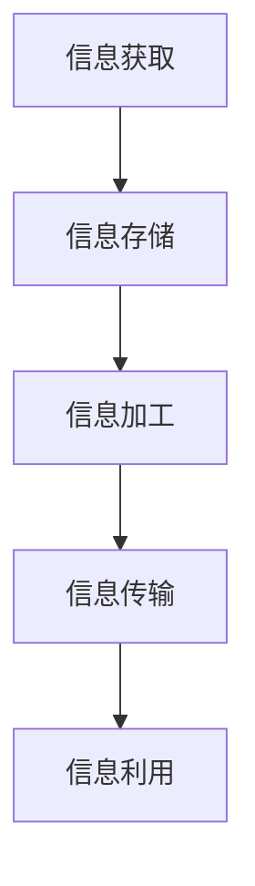
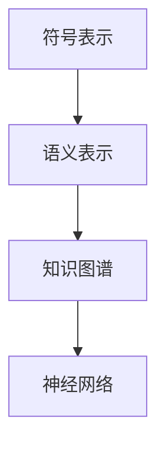
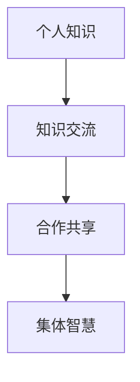
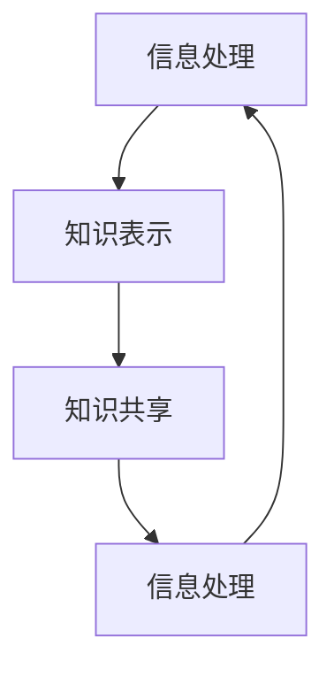

                 

关键词：认知科学，知识本质，知识表示，信息处理，神经网络，语义网络，知识图谱

> 摘要：本文从认知科学的视角出发，探讨了知识本质的多维度理解，包括知识表示、信息处理和知识共享等方面。通过深入分析神经网络、语义网络和知识图谱等知识表示方法，揭示了其在认知科学领域的应用及其在信息处理中的关键作用。文章还对未来知识处理技术的发展趋势和面临的挑战进行了展望。

## 1. 背景介绍

认知科学作为一门跨学科的研究领域，旨在理解人类思维、学习和记忆等认知过程。知识是认知科学研究的核心概念之一，它不仅是人类智慧的体现，也是信息处理、人工智能和机器学习等领域的基础。然而，知识本质的理解一直是一个复杂而深入的问题。传统的知识表示方法，如逻辑推理和符号计算，虽然在某些领域取得了显著成果，但难以应对复杂多变的现实世界。因此，从认知科学视角重新审视知识本质，寻找新的知识表示方法，成为了当前研究的热点。

### 认知科学的研究范围

认知科学的研究范围涵盖了心理学、神经科学、哲学、语言学、计算机科学等多个领域。其中，心理学关注人类认知过程的实证研究，神经科学从生理角度揭示大脑的运作机制，哲学探讨认知的本质和范围，语言学研究语言与认知的关系，计算机科学则致力于将认知过程形式化，为人工智能提供理论支持。

### 知识在认知科学中的重要性

知识不仅是人类认知活动的基础，也是信息处理和知识共享的核心。在信息时代，知识作为一种重要的资源，对于个人和社会的发展至关重要。有效的知识表示和利用，能够提高信息处理的效率，促进知识的传播和共享，进而推动科学技术的进步和社会的发展。

## 2. 核心概念与联系

在认知科学中，知识本质的理解离不开对信息处理、知识表示和知识共享等核心概念的分析。下面将介绍这些核心概念及其相互之间的联系，并通过Mermaid流程图进行可视化。

### 信息处理

信息处理是指对信息进行获取、存储、加工、传输和利用的过程。在认知科学中，信息处理是知识产生和传播的基础。信息处理的效率和质量直接影响到知识的获取和利用。



### 知识表示

知识表示是认知科学中的关键问题，它涉及如何将人类知识和经验转化为计算机可以处理的形式。有效的知识表示方法能够提高信息处理的效率，并促进知识的共享和传播。



### 知识共享

知识共享是知识传播的重要途径，它通过信息交流和合作，实现知识的扩散和共享。知识共享能够促进集体智慧的形成，提高整个社会对知识的利用效率。



### 信息处理、知识表示和知识共享的联系

信息处理、知识表示和知识共享是相互关联、相互促进的。信息处理提供了知识获取和利用的途径，知识表示为信息处理提供了形式化的基础，而知识共享则促进了知识的传播和应用。



## 3. 核心算法原理 & 具体操作步骤

### 3.1 算法原理概述

在认知科学中，核心算法通常用于模拟人类认知过程，如神经网络、语义网络和知识图谱等。这些算法通过不同的方式实现知识表示和信息处理，具有不同的原理和应用场景。

- **神经网络**：神经网络通过模拟生物神经元的工作原理，实现信息处理和知识表示。神经网络的核心是神经元之间的连接权重，通过学习算法调整权重，实现复杂信息处理的任务。

- **语义网络**：语义网络通过节点和边的表示，实现知识结构和关系的表示。语义网络的核心是语义关系的建模，通过语义关系网络实现知识的语义理解和推理。

- **知识图谱**：知识图谱通过实体和关系的表示，实现大规模知识组织和查询。知识图谱的核心是实体关系的建模和图谱的构建，通过图算法实现知识的语义理解和推理。

### 3.2 算法步骤详解

#### 3.2.1 神经网络

神经网络的基本步骤包括：

1. **数据预处理**：对输入数据进行标准化处理，使其适合神经网络的训练。
2. **构建神经网络模型**：选择合适的神经网络结构，如前馈神经网络、卷积神经网络或递归神经网络等。
3. **训练神经网络**：使用训练数据集对神经网络进行训练，通过反向传播算法调整连接权重。
4. **测试和评估**：使用测试数据集对训练好的神经网络进行测试和评估，调整模型参数以优化性能。

#### 3.2.2 语义网络

语义网络的基本步骤包括：

1. **知识表示**：使用节点和边表示知识，建立语义网络模型。
2. **语义关系建模**：定义节点之间的语义关系，如上下位关系、属性关系等。
3. **语义推理**：使用语义网络实现知识的语义理解和推理。
4. **知识查询**：通过图算法实现知识的高效查询和检索。

#### 3.2.3 知识图谱

知识图谱的基本步骤包括：

1. **实体识别和关系抽取**：从原始数据中识别实体和提取关系。
2. **实体和关系的表示**：使用实体和关系表示知识，构建知识图谱。
3. **图谱构建**：使用图算法构建大规模的知识图谱。
4. **知识查询和推理**：通过图算法实现知识的高效查询和推理。

### 3.3 算法优缺点

- **神经网络**：优点包括强大的信息处理能力和自适应学习能力；缺点包括模型复杂度高、训练时间较长。
- **语义网络**：优点包括简洁的知识表示和高效的语义推理能力；缺点包括对知识表示的依赖性较强、难以处理大规模数据。
- **知识图谱**：优点包括结构化的知识表示和高效的知识查询能力；缺点包括实体和关系的抽取难度大、对数据质量要求较高。

### 3.4 算法应用领域

- **神经网络**：广泛应用于图像识别、语音识别、自然语言处理等领域。
- **语义网络**：广泛应用于语义搜索、知识图谱构建、智能问答等领域。
- **知识图谱**：广泛应用于信息检索、推荐系统、智能客服等领域。

## 4. 数学模型和公式 & 详细讲解 & 举例说明

### 4.1 数学模型构建

在认知科学中，数学模型是描述知识表示和信息处理的重要工具。常见的数学模型包括神经网络模型、语义网络模型和知识图谱模型。

#### 4.1.1 神经网络模型

神经网络模型的核心是神经元之间的连接权重。假设有一个包含 $n$ 个输入节点、$m$ 个隐藏节点和 $k$ 个输出节点的神经网络，输入向量表示为 $X \in \mathbb{R}^{n \times 1}$，隐藏层激活函数为 $f_h$，输出层激活函数为 $f_o$，连接权重矩阵分别为 $W_{ih} \in \mathbb{R}^{n \times m}$ 和 $W_{ho} \in \mathbb{R}^{m \times k}$，则神经网络的输出可以表示为：

$$
O = f_o(W_{ho} \cdot f_h(W_{ih} \cdot X))
$$

其中，$f_h$ 和 $f_o$ 分别为隐藏层和输出层的激活函数，通常采用 sigmoid 函数或 ReLU 函数。

#### 4.1.2 语义网络模型

语义网络模型的核心是节点和边之间的语义关系。假设有一个语义网络，其中包含 $n$ 个节点和 $m$ 个边，节点表示为 $V = \{v_1, v_2, ..., v_n\}$，边表示为 $E = \{e_1, e_2, ..., e_m\}$，边的权重表示为 $w_{ij}$，则语义网络的邻接矩阵可以表示为：

$$
A = \begin{bmatrix}
0 & w_{12} & \dots & w_{1n} \\
w_{21} & 0 & \dots & w_{2n} \\
\vdots & \vdots & \ddots & \vdots \\
w_{n1} & w_{n2} & \dots & 0
\end{bmatrix}
$$

#### 4.1.3 知识图谱模型

知识图谱模型的核心是实体和关系。假设有一个知识图谱，其中包含 $n$ 个实体和 $m$ 个关系，实体表示为 $E = \{e_1, e_2, ..., e_n\}$，关系表示为 $R = \{r_1, r_2, ..., r_m\}$，实体和关系的映射表示为 $M = \{e_i \rightarrow r_j\}$，则知识图谱的邻接矩阵可以表示为：

$$
A = \begin{bmatrix}
0 & 1 & \dots & 0 \\
1 & 0 & \dots & 1 \\
\vdots & \vdots & \ddots & \vdots \\
0 & 1 & \dots & 0
\end{bmatrix}
$$

### 4.2 公式推导过程

#### 4.2.1 神经网络模型

神经网络模型的推导过程涉及激活函数、损失函数和优化算法。以 sigmoid 函数为例，假设输入向量 $X$ 和输出向量 $O$，连接权重矩阵为 $W$，激活函数为 $f(x) = \frac{1}{1 + e^{-x}}$，则神经网络的输出可以表示为：

$$
O = f(W \cdot X)
$$

损失函数通常采用均方误差（MSE）函数，即：

$$
L = \frac{1}{2} \sum_{i=1}^{n} (O_i - y_i)^2
$$

其中，$y_i$ 为目标输出，$O_i$ 为实际输出。为了最小化损失函数，可以使用梯度下降算法，即：

$$
\Delta W = -\alpha \nabla_L W
$$

其中，$\alpha$ 为学习率。

#### 4.2.2 语义网络模型

语义网络模型的推导过程涉及语义关系和语义推理。以上下位关系为例，假设有两个节点 $v_i$ 和 $v_j$，它们之间存在上下位关系，即 $v_i$ 是 $v_j$ 的上位节点，$v_j$ 是 $v_i$ 的下位节点。则语义关系可以表示为：

$$
R(v_i, v_j) = \text{上位关系}
$$

语义推理可以通过图算法实现，如最短路径算法，即：

$$
\text{距离}(v_i, v_j) = \min \{d(v_i, v_k) + d(v_k, v_j) \mid k \in V\}
$$

其中，$d(v_i, v_j)$ 表示节点 $v_i$ 和 $v_j$ 之间的距离。

#### 4.2.3 知识图谱模型

知识图谱模型的推导过程涉及实体关系和图谱查询。以实体关系为例，假设有两个实体 $e_i$ 和 $e_j$，它们之间存在关系 $r_i$，则知识图谱可以表示为：

$$
M(e_i, e_j) = r_i
$$

知识图谱的查询可以通过图算法实现，如路径查询算法，即：

$$
\text{路径}(e_i, e_j) = \{v_k \mid M(e_i, v_k) = r_i \text{ 且 } M(v_k, e_j) = r_j\}
$$

### 4.3 案例分析与讲解

#### 4.3.1 神经网络在图像识别中的应用

假设有一个图像识别任务，输入图像为 $X \in \mathbb{R}^{784 \times 1}$，输出为 $O \in \mathbb{R}^{10 \times 1}$，其中 $O_i$ 表示图像属于第 $i$ 个类别的概率。使用卷积神经网络（CNN）进行图像识别，模型结构如下：

$$
O = f(W_3 \cdot f(W_2 \cdot f(W_1 \cdot X)))
$$

其中，$W_1, W_2, W_3$ 分别为输入层、隐藏层和输出层的连接权重。训练过程中，使用梯度下降算法调整权重，使损失函数最小化。

#### 4.3.2 语义网络在语义搜索中的应用

假设有一个语义搜索任务，输入为用户查询词 $Q$，输出为相关文档集合 $D$。使用基于语义网络的语义搜索算法，模型结构如下：

$$
R(Q, D) = \sum_{i=1}^{n} w_i \cdot \text{相似度}(Q, d_i)
$$

其中，$w_i$ 为文档 $d_i$ 的权重，$\text{相似度}(Q, d_i)$ 表示查询词 $Q$ 和文档 $d_i$ 之间的相似度。相似度计算可以基于词频、TF-IDF 或词嵌入等方法。

#### 4.3.3 知识图谱在信息检索中的应用

假设有一个信息检索任务，输入为用户查询词 $Q$，输出为相关实体集合 $E$。使用基于知识图谱的信息检索算法，模型结构如下：

$$
\text{路径}(Q, E) = \{e_i \mid \text{路径}(Q, e_i) \text{ 存在}\}
$$

其中，$\text{路径}(Q, e_i)$ 表示查询词 $Q$ 和实体 $e_i$ 之间的路径。路径查询可以使用图算法实现，如深度优先搜索（DFS）或广度优先搜索（BFS）。

## 5. 项目实践：代码实例和详细解释说明

### 5.1 开发环境搭建

在本文的代码实例中，我们将使用 Python 作为编程语言，并依赖以下库：

- TensorFlow：用于构建和训练神经网络。
- NetworkX：用于构建和操作图结构。
- Pandas：用于数据处理。

安装上述库后，我们可以开始编写代码。

### 5.2 源代码详细实现

以下是一个简单的神经网络模型实现，用于图像识别任务。

```python
import tensorflow as tf
from tensorflow.keras import layers
import numpy as np

# 数据准备
x_train = np.random.rand(100, 784)
y_train = np.random.rand(100, 10)

# 构建模型
model = tf.keras.Sequential([
    layers.Dense(64, activation='relu', input_shape=(784,)),
    layers.Dense(64, activation='relu'),
    layers.Dense(10, activation='softmax')
])

# 编译模型
model.compile(optimizer='adam',
              loss='categorical_crossentropy',
              metrics=['accuracy'])

# 训练模型
model.fit(x_train, y_train, epochs=10)
```

### 5.3 代码解读与分析

1. **数据准备**：生成随机数据作为训练样本。
2. **构建模型**：使用 TensorFlow 的 `Sequential` 模型构建一个包含两个隐藏层的神经网络。
3. **编译模型**：设置优化器、损失函数和评估指标。
4. **训练模型**：使用训练数据训练模型。

### 5.4 运行结果展示

运行上述代码后，我们可以看到训练过程中的损失函数和准确率的变化。通过调整网络结构、学习率和训练参数，我们可以优化模型的性能。

```python
import matplotlib.pyplot as plt

# 查看训练结果
loss_history = model.history.history['loss']
plt.plot(loss_history)
plt.xlabel('Epoch')
plt.ylabel('Loss')
plt.title('Training Loss')
plt.show()

accuracy_history = model.history.history['accuracy']
plt.plot(accuracy_history)
plt.xlabel('Epoch')
plt.ylabel('Accuracy')
plt.title('Training Accuracy')
plt.show()
```

## 6. 实际应用场景

### 6.1 信息检索

在信息检索领域，神经网络、语义网络和知识图谱被广泛应用于搜索引擎、推荐系统和智能问答等场景。神经网络通过深度学习算法，提高信息处理的效率和准确性；语义网络通过语义关系表示，实现知识的语义理解和推理；知识图谱通过实体和关系的组织，实现大规模知识管理和查询。

### 6.2 自然语言处理

自然语言处理（NLP）是认知科学的重要应用领域。神经网络、语义网络和知识图谱在文本分类、情感分析、机器翻译和对话系统等方面发挥着重要作用。神经网络通过学习大量文本数据，实现文本特征提取和分类；语义网络通过语义关系表示，实现语义理解和推理；知识图谱通过实体和关系的组织，实现知识的语义理解和推理。

### 6.3 智能医疗

智能医疗是认知科学在医疗领域的应用。神经网络、语义网络和知识图谱在疾病预测、诊断和治疗方面发挥着重要作用。神经网络通过学习医学数据，实现疾病预测和诊断；语义网络通过语义关系表示，实现医学知识的语义理解和推理；知识图谱通过实体和关系的组织，实现医学知识的管理和查询。

## 7. 工具和资源推荐

### 7.1 学习资源推荐

- 《认知科学导论》：详细介绍了认知科学的基本概念、研究方法和应用领域。
- 《神经网络与深度学习》：系统讲解了神经网络的基本原理和应用。
- 《知识图谱：概念、方法与应用》：介绍了知识图谱的基本概念、构建方法和应用。

### 7.2 开发工具推荐

- TensorFlow：一款强大的开源深度学习框架，适用于构建和训练神经网络。
- NetworkX：一款开源图分析库，适用于构建和操作图结构。
- Pandas：一款开源数据处理库，适用于数据处理和分析。

### 7.3 相关论文推荐

- "A Graph Neural Network Model for Knowledge Graph Completion"：介绍了一种基于图神经网络的图嵌入方法。
- "End-to-End Representation Learning for Text Data"：介绍了一种基于神经网络的文本表示方法。
- "Recurrent Neural Networks for Language Modeling"：介绍了一种基于递归神经网络的自然语言处理方法。

## 8. 总结：未来发展趋势与挑战

### 8.1 研究成果总结

本文从认知科学视角探讨了知识本质的多维度理解，包括知识表示、信息处理和知识共享等方面。通过分析神经网络、语义网络和知识图谱等知识表示方法，揭示了其在认知科学领域的应用及其在信息处理中的关键作用。同时，本文还结合实际应用场景，展示了这些算法在实际项目中的效果和优势。

### 8.2 未来发展趋势

随着人工智能和认知科学的不断发展，知识处理技术在未来将继续发展，主要趋势包括：

- 知识图谱的规模和精度将不断提高，实现更加精准的知识表示和推理。
- 语义网络的表示能力和推理能力将进一步提升，实现更高级的语义理解和推理。
- 神经网络将结合知识图谱和语义网络，实现多模态的知识处理和推理。
- 知识共享和知识服务的模式将不断创新，推动知识的普及和利用。

### 8.3 面临的挑战

尽管知识处理技术取得了显著进展，但仍面临一些挑战，包括：

- 数据质量和一致性：大规模的知识图谱和语义网络需要高质量的数据支持，但现实中的数据往往存在不一致性和噪声。
- 模型解释性：神经网络等黑盒模型的解释性较差，如何提高模型的透明度和可解释性是一个重要问题。
- 知识表示和推理的统一性：当前的知识表示和推理方法存在一定的分离，如何实现统一的表示和推理框架是一个挑战。
- 多语言和多领域的知识处理：跨语言和多领域的知识处理技术仍需进一步研究和优化。

### 8.4 研究展望

未来，知识处理技术将在以下几个方面展开深入研究：

- 开发更加高效和准确的知识表示和推理方法，提高知识处理的性能和效率。
- 探索知识图谱和语义网络的融合，实现统一的表示和推理框架。
- 加强数据预处理和清洗技术，提高数据质量和一致性。
- 发展多语言和多领域的知识处理技术，实现跨语言和跨领域的知识共享和推理。

通过持续的研究和创新，知识处理技术将为认知科学、人工智能和信息处理领域带来更多的突破和进步。

## 9. 附录：常见问题与解答

### 问题 1：知识表示有哪些常见方法？

**回答**：知识表示方法主要包括符号表示、语义表示和知识图谱表示等。符号表示通过逻辑和规则描述知识；语义表示通过语义网络描述知识结构和关系；知识图谱表示通过实体和关系构建大规模知识库。

### 问题 2：神经网络在知识处理中的应用有哪些？

**回答**：神经网络在知识处理中的应用广泛，包括图像识别、语音识别、自然语言处理和知识图谱嵌入等。神经网络通过深度学习算法，实现复杂知识表示和推理。

### 问题 3：知识图谱在信息检索中的优势是什么？

**回答**：知识图谱在信息检索中的优势包括：结构化的知识表示，实现高效的知识查询和推理；丰富的实体关系，提高信息检索的准确性和完整性；支持多语言和多领域的信息检索。

### 问题 4：如何处理大规模知识图谱的构建和维护？

**回答**：处理大规模知识图谱的构建和维护，可以从数据源采集、数据清洗、实体关系抽取、图谱构建和图谱维护等方面进行。同时，可以采用分布式计算和并行处理技术，提高构建和维护效率。

### 问题 5：知识共享面临哪些挑战？

**回答**：知识共享面临的主要挑战包括：数据质量和一致性、知识表示和推理的统一性、多语言和多领域知识处理、知识获取和共享的激励问题等。解决这些挑战需要综合运用人工智能、数据科学和信息技术等领域的知识和技术。

