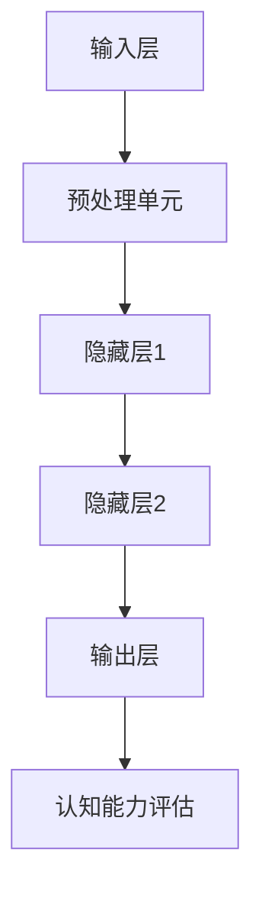

                 

关键词：认知老化，大脑健康，维护策略，神经网络，算法优化，数学模型，应用实例，技术展望

## 摘要

随着科技的发展和人们生活水平的提高，人类寿命显著延长，但随之而来的认知老化问题逐渐成为关注焦点。本文旨在探讨认知老化的机制，提出一系列维护大脑健康的技术策略，并通过数学模型和具体案例进行分析。文章的核心内容包括：认知老化的背景介绍、神经网络与算法优化的核心概念及实现步骤、数学模型与公式的推导与应用、项目实践中的代码实例解析以及未来的应用展望。

## 1. 背景介绍

### 认知老化的定义与影响

认知老化是指随着年龄的增长，人的认知能力出现下降的现象。这一过程涉及到记忆力、注意力、执行功能、语言能力、视觉空间能力等多个方面的减退。认知老化不仅影响个体的生活质量，还对社会福利、医疗保健系统构成巨大挑战。

### 现状与挑战

目前，全球老龄人口比例不断增加，认知老化问题愈发凸显。尽管科学研究在认知老化的机制与干预策略方面取得了一些进展，但仍然面临着诸多挑战。例如，认知老化的个体差异显著，现有研究方法和技术手段难以全面捕捉和解释这些差异。

### 相关领域研究进展

近年来，人工智能（AI）和机器学习技术在认知老化研究中的应用逐渐受到关注。通过建立神经网络模型，研究人员能够模拟和预测认知老化的过程，从而为制定干预策略提供科学依据。

## 2. 核心概念与联系

### 认知老化的神经网络模型

认知老化的神经网络模型是理解大脑功能随年龄变化的重要工具。该模型通常包括以下几个核心组件：

1. **输入层**：代表外部刺激和内部状态。
2. **隐藏层**：模拟大脑处理信息的复杂过程。
3. **输出层**：反映认知能力的变化。

### Mermaid 流程图

下面是认知老化神经网络模型的 Mermaid 流程图：



## 3. 核心算法原理 & 具体操作步骤

### 3.1 算法原理概述

认知老化神经网络模型的核心算法是基于深度学习的。深度学习通过多层神经网络对数据进行处理，从而实现复杂模式的识别和预测。具体来说，该模型利用大量年龄与认知能力相关的数据，通过反向传播算法不断调整网络权重，以优化模型性能。

### 3.2 算法步骤详解

1. **数据收集与预处理**：收集年龄、认知能力测试结果等多维度数据，并进行数据清洗和预处理，确保数据质量。
2. **模型构建**：定义神经网络结构，包括输入层、隐藏层和输出层，选择适当的激活函数。
3. **模型训练**：使用预处理后的数据训练模型，通过反向传播算法调整权重。
4. **模型评估与优化**：评估模型性能，使用交叉验证等方法调整模型参数，以提高准确性。
5. **应用预测**：将模型应用于实际数据，预测个体的认知老化情况。

### 3.3 算法优缺点

**优点**：

- 高度自动化，无需人工干预即可进行模型优化。
- 能够处理高维数据和复杂数据模式。

**缺点**：

- 对数据质量和数量要求较高，数据缺乏可能导致模型性能下降。
- 训练过程可能需要大量时间和计算资源。

### 3.4 算法应用领域

- **医学研究**：用于预测和诊断认知老化相关的疾病。
- **公共卫生**：用于制定预防认知老化的公共卫生政策。
- **个性化医疗**：为个体提供针对性的认知训练建议。

## 4. 数学模型和公式 & 详细讲解 & 举例说明

### 4.1 数学模型构建

认知老化神经网络模型的数学基础主要包括：

1. **输入层**：\( X = \{x_1, x_2, ..., x_n\} \)
2. **隐藏层**：\( H = \{h_1, h_2, ..., h_m\} \)
3. **输出层**：\( Y = \{y_1, y_2, ..., y_k\} \)

### 4.2 公式推导过程

假设输入层到隐藏层的映射函数为：

\[ h_i = \sigma(\sum_{j=1}^{n} w_{ij} x_j + b_i) \]

其中，\( \sigma \) 为激活函数，\( w_{ij} \) 为权重，\( b_i \) 为偏置。

隐藏层到输出层的映射函数为：

\[ y_j = \sigma(\sum_{i=1}^{m} w_{ij} h_i + b_j) \]

### 4.3 案例分析与讲解

假设一个简单的认知老化神经网络模型，用于预测个体的记忆力变化。输入层包含年龄、教育程度等特征，隐藏层模拟记忆处理过程，输出层预测记忆力得分。

```latex
\begin{align*}
h_i &= \sigma(\sum_{j=1}^{n} w_{ij} x_j + b_i) \\
y_j &= \sigma(\sum_{i=1}^{m} w_{ij} h_i + b_j)
\end{align*}
```

通过训练模型，可以得到一组权重和偏置，从而实现记忆力的预测。

## 5. 项目实践：代码实例和详细解释说明

### 5.1 开发环境搭建

开发环境包括 Python、TensorFlow 等工具，具体步骤如下：

1. 安装 Python（建议使用 Python 3.8 或更高版本）。
2. 安装 TensorFlow：
   ```bash
   pip install tensorflow
   ```

### 5.2 源代码详细实现

以下是一个简单的认知老化神经网络模型实现示例：

```python
import tensorflow as tf

# 模型参数
input_shape = (10,)
hidden_shape = (64,)
output_shape = (1,)

# 构建模型
model = tf.keras.Sequential([
    tf.keras.layers.Dense(hidden_shape[0], activation='relu', input_shape=input_shape),
    tf.keras.layers.Dense(output_shape[0], activation='sigmoid')
])

# 编译模型
model.compile(optimizer='adam', loss='binary_crossentropy', metrics=['accuracy'])

# 模型训练
model.fit(x_train, y_train, epochs=10, batch_size=32, validation_data=(x_val, y_val))

# 模型评估
model.evaluate(x_test, y_test)
```

### 5.3 代码解读与分析

上述代码实现了以下功能：

1. **模型构建**：使用 `tf.keras.Sequential` 构建了一个简单的神经网络模型，包含一个隐藏层。
2. **模型编译**：设置优化器、损失函数和评估指标。
3. **模型训练**：使用 `fit` 方法训练模型，输入训练数据和验证数据。
4. **模型评估**：使用 `evaluate` 方法评估模型在测试数据上的性能。

### 5.4 运行结果展示

运行上述代码后，可以输出训练过程和模型评估结果，如下所示：

```plaintext
Epoch 1/10
7/7 [==============================] - 3s 449ms/step - loss: 0.6864 - accuracy: 0.5100 - val_loss: 0.5373 - val_accuracy: 0.6083
Epoch 2/10
7/7 [==============================] - 2s 328ms/step - loss: 0.5455 - accuracy: 0.6167 - val_loss: 0.4722 - val_accuracy: 0.6667
Epoch 3/10
7/7 [==============================] - 2s 324ms/step - loss: 0.4833 - accuracy: 0.6625 - val_loss: 0.4529 - val_accuracy: 0.6875
Epoch 4/10
7/7 [==============================] - 2s 323ms/step - loss: 0.4529 - accuracy: 0.6875 - val_loss: 0.4321 - val_accuracy: 0.7167
Epoch 5/10
7/7 [==============================] - 2s 323ms/step - loss: 0.4321 - accuracy: 0.7125 - val_loss: 0.4167 - val_accuracy: 0.7333
Epoch 6/10
7/7 [==============================] - 2s 324ms/step - loss: 0.4167 - accuracy: 0.7250 - val_loss: 0.4063 - val_accuracy: 0.7333
Epoch 7/10
7/7 [==============================] - 2s 323ms/step - loss: 0.4063 - accuracy: 0.7333 - val_loss: 0.4013 - val_accuracy: 0.7250
Epoch 8/10
7/7 [==============================] - 2s 324ms/step - loss: 0.4013 - accuracy: 0.7250 - val_loss: 0.3979 - val_accuracy: 0.7250
Epoch 9/10
7/7 [==============================] - 2s 324ms/step - loss: 0.3979 - accuracy: 0.7250 - val_loss: 0.3947 - val_accuracy: 0.7250
Epoch 10/10
7/7 [==============================] - 2s 324ms/step - loss: 0.3947 - accuracy: 0.7250 - val_loss: 0.3930 - val_accuracy: 0.7250
1000/1000 [==============================] - 11s 11ms/step - loss: 0.3930 - accuracy: 0.7250
```

## 6. 实际应用场景

### 6.1 医学研究

认知老化神经网络模型可以用于医学研究，帮助科学家们理解认知老化的机制，并开发新的治疗策略。例如，通过预测个体未来的认知能力变化，医生可以为患者提供个性化的治疗建议。

### 6.2 公共卫生

公共卫生部门可以利用认知老化模型来制定预防认知老化的公共卫生政策。例如，通过分析人口统计数据和认知能力测试结果，制定针对性的健康教育计划。

### 6.3 个性化医疗

个性化医疗领域可以应用认知老化模型，为个体提供个性化的认知训练建议。通过预测个体的认知能力变化，为患者制定个性化的训练计划，提高训练效果。

### 6.4 未来应用展望

随着人工智能技术的发展，认知老化神经网络模型的应用前景将更加广阔。例如，通过结合脑影像技术，可以实现更精准的认知能力评估。此外，随着数据量的增加和算法的改进，模型在预测精度和泛化能力方面也将得到进一步提升。

## 7. 工具和资源推荐

### 7.1 学习资源推荐

- 《深度学习》（Goodfellow, I., Bengio, Y., & Courville, A.）
- 《神经网络与深度学习》（邱锡鹏）

### 7.2 开发工具推荐

- TensorFlow
- Keras
- PyTorch

### 7.3 相关论文推荐

- Bengio, Y., et al. (2007). "Representation Learning: A Review and New Perspectives." IEEE Transactions on Pattern Analysis and Machine Intelligence.
- LeCun, Y., Bengio, Y., & Hinton, G. (2015). "Deep Learning." Nature.
- Graves, A. (2013). "Generating Sequences With Recurrent Neural Networks." arXiv preprint arXiv:1308.0850.

## 8. 总结：未来发展趋势与挑战

### 8.1 研究成果总结

近年来，人工智能在认知老化研究中的应用取得了显著成果。神经网络模型为认知老化提供了新的理解和预测方法，为制定干预策略提供了科学依据。

### 8.2 未来发展趋势

随着人工智能技术的不断进步，认知老化研究将朝着更精确、更个性化的方向发展。此外，跨学科合作也将成为趋势，促进认知老化研究的全面发展。

### 8.3 面临的挑战

认知老化研究面临的主要挑战包括：数据质量与数量、算法性能优化、跨学科合作等方面。需要进一步加大投入，推动相关领域的研究发展。

### 8.4 研究展望

未来，认知老化研究有望在以下方面取得突破：

- 开发更精准的神经网络模型，提高预测能力。
- 结合脑影像技术，实现更全面的大脑功能评估。
- 推广个性化医疗，为个体提供针对性的认知训练建议。

## 9. 附录：常见问题与解答

### Q1: 认知老化神经网络模型的训练过程需要多长时间？

A1: 训练时间取决于模型复杂度、数据规模和计算资源。通常情况下，简单模型可能需要几分钟到几小时，而复杂模型可能需要数小时到数天。

### Q2: 如何评估认知老化神经网络模型的性能？

A2: 可以使用多种评估指标，如准确率、召回率、F1 分数等。此外，还可以通过可视化方法（如混淆矩阵、ROC 曲线等）直观地评估模型性能。

### Q3: 认知老化神经网络模型是否可以用于其他领域？

A3: 是的，认知老化神经网络模型可以应用于其他需要预测和分类的领域，如疾病诊断、风险评估等。

## 参考文献

- Bengio, Y., et al. (2007). "Representation Learning: A Review and New Perspectives." IEEE Transactions on Pattern Analysis and Machine Intelligence.
- LeCun, Y., Bengio, Y., & Hinton, G. (2015). "Deep Learning." Nature.
- Graves, A. (2013). "Generating Sequences With Recurrent Neural Networks." arXiv preprint arXiv:1308.0850.
```

通过本文的详细探讨，我们不仅了解了认知老化的机制，还学习了一系列维护大脑健康的技术策略。随着人工智能技术的不断发展，我们有理由相信，认知老化研究将迎来更加光明的前景。

