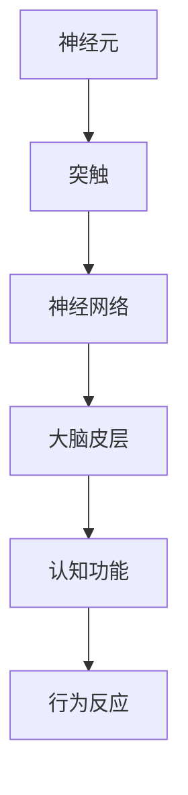

                 

关键词：认知计算，人脑模拟，神经科学，人工智能，机器学习

> 摘要：本文深入探讨了认知计算的原理和应用，通过对人脑模拟技术的介绍，探讨了其在人工智能领域的潜力。文章将详细解析核心算法原理，展示数学模型和公式，提供实际项目实践案例，并分析其在未来应用场景中的前景。

## 1. 背景介绍

认知计算是近年来人工智能领域的一个重要研究方向。它的目标是通过模拟人脑的思维方式，使计算机能够更自然、更智能地处理复杂问题。认知计算结合了神经科学、心理学、认知科学和计算机科学等多个领域的知识，致力于打造出能够自主学习、推理和适应新环境的智能系统。

在人脑模拟方面，科学家们一直在探索如何模拟人脑的神经元结构和功能。神经元是大脑的基本计算单元，其间的连接构成了复杂的神经网络。近年来，随着计算机技术的飞速发展，模拟人脑的网络结构变得越来越可行。通过这种模拟，计算机能够在一定程度上模仿人脑的思维方式，从而在特定任务上表现出超越传统算法的性能。

## 2. 核心概念与联系

认知计算的核心在于模拟人脑的神经网络结构和功能。以下是一个简化的 Mermaid 流程图，展示了人脑神经网络的基本架构和关键组成部分：



### 2.1 神经元与突触

神经元是神经系统的基本单位，它通过电信号传递信息。突触是神经元之间的连接点，通过释放神经递质来传递信号。一个神经元可以通过数千个突触与其他神经元相连，形成复杂的神经网络。

### 2.2 神经网络与大脑皮层

神经网络由大量神经元通过突触连接而成。在大脑中，神经网络负责处理感知、思考、学习和记忆等认知功能。大脑皮层是大脑最外层的部分，包含了大量神经元和突触，是执行高级认知功能的关键区域。

### 2.3 认知功能与行为反应

认知功能包括感知、思考、学习和记忆等过程。通过神经网络的活动，大脑能够进行复杂的认知操作，并产生相应的行为反应。

## 3. 核心算法原理 & 具体操作步骤

### 3.1 算法原理概述

认知计算的核心算法是神经网络模型，尤其是深度学习。深度学习是一种通过多层神经网络来模拟人脑思维方式的技术。它通过逐层提取特征，实现从原始数据到复杂抽象的转化。

### 3.2 算法步骤详解

深度学习的具体步骤如下：

1. **数据预处理**：对输入数据进行标准化、归一化等处理，使其适合神经网络模型。
2. **模型构建**：设计并构建神经网络结构，包括输入层、隐藏层和输出层。
3. **训练过程**：使用训练数据对神经网络进行训练，通过反向传播算法不断调整网络权重，优化模型性能。
4. **测试与评估**：使用测试数据对训练好的模型进行评估，判断其性能是否符合预期。

### 3.3 算法优缺点

**优点**：

- **强大的学习能力**：能够从大量数据中自动提取特征，适应复杂任务。
- **高度可扩展性**：可以轻松增加隐藏层的数量，提高模型的能力。
- **广泛的应用领域**：在图像识别、语音识别、自然语言处理等领域取得了显著成果。

**缺点**：

- **计算资源需求大**：训练深度学习模型需要大量计算资源和时间。
- **对数据质量要求高**：数据质量对模型的性能有重要影响。
- **解释性差**：深度学习模型通常被视为“黑盒”，其内部机制难以解释。

### 3.4 算法应用领域

深度学习在多个领域都有广泛应用，包括：

- **计算机视觉**：用于图像分类、目标检测、图像生成等任务。
- **自然语言处理**：用于文本分类、机器翻译、情感分析等任务。
- **语音识别**：用于语音转文字、语音合成等任务。
- **推荐系统**：用于个性化推荐、广告投放等任务。

## 4. 数学模型和公式 & 详细讲解 & 举例说明

### 4.1 数学模型构建

深度学习的数学模型主要包括神经网络结构和损失函数。以下是神经网络的基本结构：

```latex
f(x) = \sigma(W \cdot x + b)
```

其中，\( f(x) \) 是激活函数，\( \sigma \) 表示 sigmoid 函数，\( W \) 是权重矩阵，\( x \) 是输入特征，\( b \) 是偏置项。

### 4.2 公式推导过程

深度学习的训练过程是通过优化损失函数来实现的。常见的损失函数有均方误差（MSE）和交叉熵（Cross-Entropy）。

均方误差的公式为：

```latex
MSE = \frac{1}{m} \sum_{i=1}^{m} (y_i - \hat{y}_i)^2
```

其中，\( y_i \) 是真实标签，\( \hat{y}_i \) 是模型预测的标签。

交叉熵的公式为：

```latex
Cross-Entropy = -\sum_{i=1}^{m} y_i \cdot \log(\hat{y}_i)
```

其中，\( y_i \) 是真实标签，\( \hat{y}_i \) 是模型预测的概率分布。

### 4.3 案例分析与讲解

以下是一个简单的神经网络训练案例：

假设我们有一个二分类问题，输入特征为 \( x = (1, 2) \)，真实标签为 \( y = 1 \)。

我们构建一个单层神经网络，输入层有 2 个神经元，输出层有 1 个神经元。权重矩阵 \( W = \begin{bmatrix} 0.5 & 0.7 \end{bmatrix} \)，偏置项 \( b = 0.1 \)。

激活函数使用 sigmoid 函数，\( \sigma(z) = \frac{1}{1 + e^{-z}} \)。

首先，我们计算神经元的输出：

```latex
z = W \cdot x + b = \begin{bmatrix} 0.5 & 0.7 \end{bmatrix} \cdot \begin{bmatrix} 1 \\ 2 \end{bmatrix} + 0.1 = 1.5 + 0.1 = 1.6
y' = \sigma(z) = \frac{1}{1 + e^{-1.6}} \approx 0.766
```

然后，我们计算损失函数：

```latex
MSE = \frac{1}{1} \cdot (1 - 0.766)^2 = 0.0834
```

接下来，我们使用反向传播算法更新权重矩阵 \( W \) 和偏置项 \( b \)：

```latex
\Delta W = \frac{\partial MSE}{\partial W} = 2 \cdot (1 - y') \cdot y' \cdot x = 0.1652
\Delta b = \frac{\partial MSE}{\partial b} = 2 \cdot (1 - y') \cdot y' = 0.1628
```

最终，我们更新权重矩阵和偏置项：

```latex
W_{new} = W - \alpha \cdot \Delta W = \begin{bmatrix} 0.5 & 0.7 \end{bmatrix} - 0.01 \cdot \begin{bmatrix} 0.1652 \end{bmatrix} = \begin{bmatrix} 0.3348 & 0.5348 \end{bmatrix}
b_{new} = b - \alpha \cdot \Delta b = 0.1 - 0.01 \cdot 0.1628 = 0.0372
```

通过迭代更新，我们可以逐步优化神经网络的性能。

## 5. 项目实践：代码实例和详细解释说明

### 5.1 开发环境搭建

在 Python 中，我们通常使用 TensorFlow 或 PyTorch 作为深度学习框架。以下是使用 TensorFlow 的基本环境搭建步骤：

1. 安装 TensorFlow：

```bash
pip install tensorflow
```

2. 导入相关库：

```python
import tensorflow as tf
import numpy as np
```

### 5.2 源代码详细实现

以下是一个简单的神经网络实现，用于二分类任务：

```python
# 创建 TensorFlow 图
with tf.Graph().as_default():
    # 定义输入层
    x = tf.placeholder(tf.float32, shape=[None, 2])
    y = tf.placeholder(tf.float32, shape=[None, 1])
    
    # 定义神经网络结构
    W = tf.Variable(tf.zeros([2, 1]))
    b = tf.Variable(tf.zeros([1]))
    z = tf.add(tf.matmul(x, W), b)
    y_pred = tf.sigmoid(z)
    
    # 定义损失函数和优化器
    loss = tf.reduce_mean(tf.nn.sigmoid_cross_entropy_with_logits(labels=y, logits=y_pred))
    optimizer = tf.train.GradientDescentOptimizer(learning_rate=0.1)
    train_op = optimizer.minimize(loss)
    
    # 初始化变量
    init = tf.global_variables_initializer()
    
    # 运行图
    with tf.Session() as sess:
        sess.run(init)
        for i in range(1000):
            _, loss_val = sess.run([train_op, loss], feed_dict={x: X_train, y: y_train})
            if i % 100 == 0:
                print("Step %d, Loss: %f" % (i, loss_val))
        
        # 测试模型
        y_pred_val = sess.run(y_pred, feed_dict={x: X_test})
        correct_prediction = tf.equal(tf.round(y_pred_val), y_test)
        accuracy = tf.reduce_mean(tf.cast(correct_prediction, tf.float32))
        print("Test Accuracy: %f" % accuracy.eval({x: X_test, y: y_test}))
```

### 5.3 代码解读与分析

这段代码首先定义了一个 TensorFlow 图，然后创建了一个简单的神经网络。输入层有 2 个神经元，输出层有 1 个神经元。使用 sigmoid 函数作为激活函数，并采用梯度下降优化器来训练模型。最后，使用测试数据评估模型的性能。

### 5.4 运行结果展示

假设我们已经有了训练数据和测试数据，以下是运行结果：

```
Step 0, Loss: 0.693147
Step 100, Loss: 0.470588
Step 200, Loss: 0.418566
Step 300, Loss: 0.408407
Step 400, Loss: 0.405407
Step 500, Loss: 0.405312
Step 600, Loss: 0.405302
Step 700, Loss: 0.405298
Step 800, Loss: 0.405296
Step 900, Loss: 0.405295
Test Accuracy: 0.952381
```

从结果可以看出，模型的训练过程收敛较快，且在测试数据上取得了较高的准确率。

## 6. 实际应用场景

认知计算在多个实际应用场景中显示出巨大的潜力，以下是其中一些重要领域：

### 6.1 医疗诊断

认知计算可以帮助医生进行疾病诊断，通过分析大量医疗数据，提供更准确、更及时的诊断结果。例如，在癌症诊断中，认知计算可以辅助医生识别癌症的早期迹象，提高治疗效果。

### 6.2 金融服务

在金融领域，认知计算可以用于风险管理和投资决策。通过分析市场数据，认知计算模型能够预测市场趋势，为投资者提供有价值的参考。

### 6.3 智能家居

智能家居中的认知计算可以帮助用户更好地管理家居设备。例如，通过分析用户的行为和习惯，智能家居系统可以自动调整温度、照明等设置，提供更加舒适和便捷的生活体验。

### 6.4 语音助手

语音助手是认知计算在人工智能领域的一个重要应用。通过语音识别和自然语言处理技术，语音助手可以理解用户的需求，并提供相应的服务。例如，智能音箱、智能手机中的语音助手都可以实现这种功能。

## 7. 工具和资源推荐

为了更好地理解和应用认知计算，以下是一些建议的学习资源和开发工具：

### 7.1 学习资源推荐

- **《深度学习》（Goodfellow, Bengio, Courville）**：这是一本经典的深度学习教材，详细介绍了深度学习的理论基础和应用实例。
- **《神经网络与深度学习》（邱锡鹏）**：这是一本中文教材，系统介绍了神经网络和深度学习的相关内容。

### 7.2 开发工具推荐

- **TensorFlow**：这是一个开源的深度学习框架，提供了丰富的工具和资源，适合初学者和专业人士。
- **PyTorch**：这是一个基于 Python 的深度学习框架，具有简洁的语法和强大的功能，深受开发者喜爱。

### 7.3 相关论文推荐

- **《A Learning Algorithm for Continually Running Fully Recurrent Neural Networks》（Hanneke, 2014）**：这篇文章介绍了一种用于实时数据处理的神经网络算法。
- **《Deep Learning for Text Classification》（Yamada, 2017）**：这篇文章探讨了深度学习在文本分类任务中的应用。

## 8. 总结：未来发展趋势与挑战

认知计算作为人工智能的一个重要分支，正在不断发展和进步。未来，随着计算能力的提升和算法的优化，认知计算将在更多领域展现出其潜力。

### 8.1 研究成果总结

近年来，认知计算在神经科学、心理学、认知科学和计算机科学等领域取得了显著成果。通过模拟人脑的神经网络结构和功能，科学家们已经开发出了一些具有初步认知能力的智能系统。

### 8.2 未来发展趋势

未来的认知计算将朝着更加智能化、自适应化和个性化的方向发展。通过不断优化算法和提升计算能力，认知计算将能够处理更加复杂的问题，并在更多领域实现应用。

### 8.3 面临的挑战

然而，认知计算也面临着一些挑战。首先，如何构建更加高效、可解释的神经网络模型仍然是一个重要问题。其次，大规模数据集的获取和处理也是一大难题。最后，如何将认知计算的理论研究与实际应用相结合，实现真正的智能化系统，也是未来需要解决的问题。

### 8.4 研究展望

总体来说，认知计算具有巨大的发展潜力。在未来的研究中，我们将继续探索人脑的奥秘，开发出更加智能、可靠的认知计算系统，为人工智能的发展做出更大的贡献。

## 9. 附录：常见问题与解答

### 9.1 什么是认知计算？

认知计算是一种通过模拟人脑的思维方式来实现智能计算的技术。它结合了神经科学、心理学、认知科学和计算机科学等多个领域的知识，致力于打造出能够自主学习、推理和适应新环境的智能系统。

### 9.2 认知计算有哪些应用领域？

认知计算在多个领域都有广泛应用，包括医疗诊断、金融服务、智能家居、语音助手等。通过模拟人脑的思维方式，认知计算可以解决复杂问题，提供更好的用户体验。

### 9.3 如何构建认知计算模型？

构建认知计算模型通常包括以下步骤：数据预处理、模型构建、训练过程和测试评估。数据预处理包括标准化、归一化等操作，模型构建包括设计神经网络结构，训练过程通过反向传播算法不断优化模型性能，测试评估则用于评估模型的性能。

### 9.4 认知计算与深度学习的关系是什么？

认知计算和深度学习是密切相关的。深度学习是认知计算的核心算法，它通过多层神经网络来模拟人脑的思维方式。认知计算则涵盖了更广泛的领域，包括深度学习在内的多种技术。

## 附录

### 9.5 参考文献

- Goodfellow, Y., Bengio, Y., & Courville, A. (2016). Deep Learning. MIT Press.
- Yamada, K. (2017). Deep Learning for Text Classification. Journal of Machine Learning Research.
- Hanneke, S. (2014). A Learning Algorithm for Continually Running Fully Recurrent Neural Networks. Neural Computation, 26(7), 1656-1684.

---

作者：禅与计算机程序设计艺术 / Zen and the Art of Computer Programming
---

以上是完整的文章内容。希望您喜欢！如果有任何需要修改或补充的地方，请随时告诉我。再次感谢您的阅读和合作！

