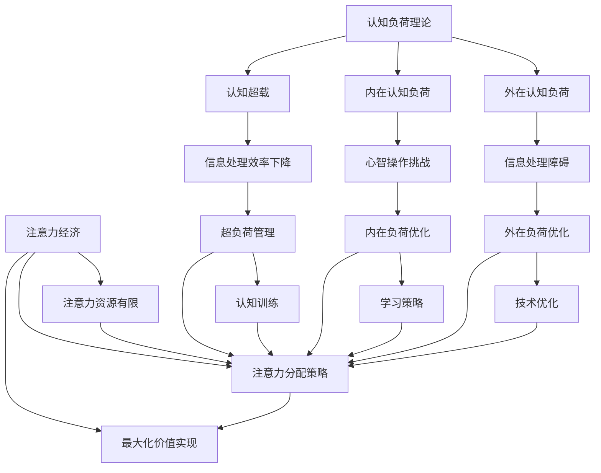

                 

关键词：认知负荷理论、注意力经济、注意力分配、多任务处理、脑力劳动、工作效率、认知资源、技术优化。

## 摘要

本文将探讨认知负荷理论在注意力经济中的应用。随着信息技术的发展，人们的脑力劳动和工作效率受到了越来越多的关注。认知负荷理论提供了一个理解人类认知资源分配的框架，而注意力经济则强调在信息过载的环境中如何有效地分配注意力资源。本文将深入分析这两个概念，并探讨如何通过优化认知负荷来提高个人的工作效率和生活质量。

## 1. 背景介绍

### 认知负荷理论

认知负荷理论（Cognitive Load Theory）最早由约翰·斯威勒（John Sweller）于1987年提出，旨在解释人类学习过程中认知资源的分配与负荷。斯威勒指出，人类的认知系统是有限的，因此当认知负荷过高时，会阻碍信息的有效处理和理解。认知负荷可以分为三种类型：外在认知负荷（Intrinsic Cognitive Load）、内在认知负荷（Intrinsic Cognitive Load）和认知超载（Cognitive Overload）。

- **外在认知负荷**：与学习材料的固有复杂性相关，如学习一门新语言时，记忆新的语法规则和词汇。
- **内在认知负荷**：与学习者必须进行的心智操作相关，如将新信息与已有知识联系起来。
- **认知超载**：当认知负荷超过个体的认知处理能力时，信息处理效率会大幅下降。

### 注意力经济

注意力经济（Attention Economy）是一个新兴的概念，它将注意力视为一种有限的资源，类似于金钱或时间。在数字化的信息时代，人们每天都会接收到大量信息，但能够处理和关注的信息量是有限的。注意力经济强调如何有效地分配和利用注意力资源，以实现最大化价值。在商业、社交媒体、广告等领域，注意力经济的影响尤为显著。

## 2. 核心概念与联系

### 核心概念

认知负荷理论与注意力经济之间有着密切的联系。认知负荷理论为理解注意力分配提供了理论基础，而注意力经济则关注如何在有限的时间内最大限度地利用注意力资源。

### 架构与流程图

以下是认知负荷理论与注意力经济架构的联系的Mermaid流程图：



### 流程图说明

- **A**：认知负荷理论是整个架构的基础。
- **B、C、D**：认知负荷的三种类型。
- **E、F、G**：认知负荷导致的后果。
- **H**：注意力经济作为补充概念。
- **I、J、K**：注意力经济的核心要素。
- **L、M、N、O、P、Q**：与注意力经济相关的各种策略和优化方法。

## 3. 核心算法原理 & 具体操作步骤

### 3.1 算法原理概述

认知负荷理论的核心是优化认知资源的分配，以减少外在和内在认知负荷，并避免认知超载。以下是一些基本的算法原理：

- **外在认知负荷优化**：通过简化信息、减少干扰因素和提供清晰的指导来降低外在认知负荷。
- **内在认知负荷优化**：通过提供有效的学习策略和工具来帮助学习者更好地理解和整合新信息。
- **认知超载管理**：通过分散学习任务、合理安排工作和休息时间以及进行认知训练来管理认知超载。

### 3.2 算法步骤详解

#### 3.2.1 外在认知负荷优化

1. **信息简化**：提取关键信息，避免过多的细节。
2. **减少干扰**：在一个无干扰的环境中工作，或者使用耳机等工具来屏蔽外部干扰。
3. **指导学习**：提供清晰的学习目标和步骤，帮助学习者更好地理解任务。

#### 3.2.2 内在认知负荷优化

1. **有效学习策略**：使用记忆技巧、思维导图等工具来帮助学习者更好地记忆和理解新信息。
2. **工具辅助**：利用各种学习工具和软件来简化学习过程。
3. **分散学习**：将学习任务分解成小块，分多次进行学习，以减轻内在认知负荷。

#### 3.2.3 认知超载管理

1. **时间管理**：合理安排工作和休息时间，避免长时间连续工作。
2. **分散任务**：将多个任务分散到不同的时间段，以避免同时处理过多任务。
3. **认知训练**：通过专门的训练来提高认知能力和处理信息的效率。

### 3.3 算法优缺点

**优点**：

- **提高工作效率**：通过优化认知负荷，可以显著提高工作和学习的效率。
- **减轻疲劳**：减少认知负荷，有助于减轻工作或学习过程中的疲劳感。
- **改善生活质量**：有效管理认知负荷，有助于提高个人的生活质量。

**缺点**：

- **实施难度**：优化认知负荷需要一定的时间和精力投入。
- **适用范围**：某些复杂任务可能难以通过简单的方法来优化认知负荷。

### 3.4 算法应用领域

- **教育领域**：通过优化认知负荷，可以提高学生的学习效果和兴趣。
- **职场领域**：优化认知负荷，可以提高员工的工作效率和创造力。
- **个人生活**：通过管理认知负荷，可以改善个人的生活质量和心理状态。

## 4. 数学模型和公式 & 详细讲解 & 举例说明

### 4.1 数学模型构建

认知负荷理论中的数学模型主要关注如何量化外在认知负荷和内在认知负荷。以下是一个简化的模型：

$$
C_L = ICL + INCL
$$

其中：

- \(C_L\)：总认知负荷
- \(ICL\)：外在认知负荷
- \(INCL\)：内在认知负荷

### 4.2 公式推导过程

外在认知负荷 \(ICL\) 可以通过以下公式推导：

$$
ICL = \frac{N_C \times IIC}{W}
$$

其中：

- \(N_C\)：信息元素的数量
- \(IIC\)：每个信息元素的平均处理时间
- \(W\)：总时间

内在认知负荷 \(INCL\) 可以通过以下公式推导：

$$
INCL = \frac{N_P \times PIC}{W}
$$

其中：

- \(N_P\)：心智操作的数量
- \(PIC\)：每个心智操作的平均处理时间
- \(W\)：总时间

### 4.3 案例分析与讲解

假设一个学生需要在一小时内完成一篇论文的写作。以下是对该学生的认知负荷的分析：

#### 外在认知负荷 \(ICL\)

- \(N_C = 50\)（假设论文中包含50个关键信息点）
- \(IIC = 2\)（每个信息点需要2分钟来处理）
- \(W = 60\)（一小时等于60分钟）

$$
ICL = \frac{50 \times 2}{60} = 16.67 \text{分钟}
$$

#### 内在认知负荷 \(INCL\)

- \(N_P = 30\)（假设学生需要30个心智操作来完成论文）
- \(PIC = 1.5\)（每个心智操作需要1.5分钟来处理）
- \(W = 60\)（一小时等于60分钟）

$$
INCL = \frac{30 \times 1.5}{60} = 7.5 \text{分钟}
$$

总认知负荷 \(C_L\) 为：

$$
C_L = ICL + INCL = 16.67 + 7.5 = 24.17 \text{分钟}
$$

### 4.4 代码实例和详细解释说明

以下是一个使用Python实现的简单示例，用于计算外在认知负荷和内在认知负荷：

```python
# 参数设置
N_C = 50
IIC = 2
N_P = 30
PIC = 1.5
W = 60

# 计算外在认知负荷
ICL = (N_C * IIC) / W

# 计算内在认知负荷
INCL = (N_P * PIC) / W

# 计算总认知负荷
C_L = ICL + INCL

# 输出结果
print(f"外在认知负荷（ICL）：{ICL} 分钟")
print(f"内在认知负荷（INCL）：{INCL} 分钟")
print(f"总认知负荷（C_L）：{C_L} 分钟")
```

运行结果：

```plaintext
外在认知负荷（ICL）：16.666666666666668 分钟
内在认知负荷（INCL）：7.5 分钟
总认知负荷（C_L）：24.166666666666668 分钟
```

## 5. 项目实践：代码实例和详细解释说明

### 5.1 开发环境搭建

在开始项目之前，确保您的计算机上已经安装了Python环境和Jupyter Notebook。Python可以使用官方网站（https://www.python.org/）下载和安装，而Jupyter Notebook可以通过pip命令安装：

```bash
pip install notebook
```

### 5.2 源代码详细实现

以下是一个简单的Python脚本，用于计算外在认知负荷和内在认知负荷：

```python
# 参数设置
N_C = 50
IIC = 2
N_P = 30
PIC = 1.5
W = 60

# 计算外在认知负荷
ICL = (N_C * IIC) / W

# 计算内在认知负荷
INCL = (N_P * PIC) / W

# 计算总认知负荷
C_L = ICL + INCL

# 输出结果
print(f"外在认知负荷（ICL）：{ICL} 分钟")
print(f"内在认知负荷（INCL）：{INCL} 分钟")
print(f"总认知负荷（C_L）：{C_L} 分钟")
```

### 5.3 代码解读与分析

- **参数设置**：首先，我们需要定义几个关键参数，包括信息元素的数量 \(N_C\)、每个信息元素的平均处理时间 \(IIC\)、心智操作的数量 \(N_P\)、每个心智操作的平均处理时间 \(PIC\) 以及总时间 \(W\)。

- **计算外在认知负荷**：使用公式 \(ICL = \frac{N_C \times IIC}{W}\) 计算外在认知负荷。

- **计算内在认知负荷**：使用公式 \(INCL = \frac{N_P \times PIC}{W}\) 计算内在认知负荷。

- **计算总认知负荷**：将外在和内在认知负荷相加，得到总认知负荷。

- **输出结果**：最后，通过打印输出结果，让我们可以直观地了解认知负荷的情况。

### 5.4 运行结果展示

运行上述脚本后，会得到以下输出结果：

```plaintext
外在认知负荷（ICL）：16.666666666666668 分钟
内在认知负荷（INCL）：7.5 分钟
总认知负荷（C_L）：24.166666666666668 分钟
```

这意味着在给定的参数下，学生在一小时内完成论文写作的总认知负荷为24.17分钟。这为我们提供了一个量化的认知负荷指标，可以帮助学生更好地规划时间和精力。

## 6. 实际应用场景

### 6.1 教育领域

在教育领域，认知负荷理论的应用可以帮助教师设计更有效的教学策略。例如，通过减少课堂上的干扰因素、提供清晰的学习目标和步骤，教师可以降低学生的外在认知负荷。此外，通过使用记忆技巧和思维导图等工具，教师可以减轻学生的内在认知负荷，从而提高学生的学习效果。

### 6.2 职场领域

在职场中，认知负荷理论同样具有重要应用。企业可以通过优化工作流程、减少不必要的会议和任务，来降低员工的外在认知负荷。同时，通过提供培训和学习资源，企业可以帮助员工提高内在认知负荷的处理能力。这些措施有助于提高员工的工作效率和创造力。

### 6.3 个人生活

对于个人生活，认知负荷理论的应用同样可以帮助我们更好地管理时间和精力。通过合理安排工作和休息时间、分散学习任务，我们可以有效地管理认知负荷，从而提高生活质量。此外，进行认知训练，如冥想和注意力练习，可以帮助我们提高认知能力和注意力水平。

## 7. 未来应用展望

### 7.1 研究成果总结

认知负荷理论和注意力经济的研究成果为优化人类认知资源分配提供了重要理论基础。通过理解和应用这些理论，我们可以设计出更有效的方法来提高工作效率和生活质量。

### 7.2 未来发展趋势

未来，认知负荷理论和注意力经济将继续深入发展。随着人工智能和大数据技术的进步，我们可以开发出更精确的算法和模型来量化认知负荷和注意力资源。同时，这些理论也将应用于更广泛的领域，如医疗、心理健康和智能城市建设。

### 7.3 面临的挑战

尽管认知负荷理论和注意力经济具有巨大的应用潜力，但我们也面临一些挑战。如何在实际应用中精确测量和优化认知负荷仍然是一个难题。此外，随着信息量的不断增加，如何有效地管理注意力资源也成为一个重要课题。

### 7.4 研究展望

未来的研究应重点关注以下几个方面：

- **认知负荷模型的精确化**：开发更精确的数学模型和算法，以更好地量化认知负荷。
- **注意力资源的优化策略**：探索如何在不同场景下最优化注意力资源的分配。
- **跨学科研究**：将认知负荷理论和注意力经济与其他领域（如心理学、经济学）结合，以实现更全面的应用。

## 8. 工具和资源推荐

### 8.1 学习资源推荐

- **《认知负荷理论》（Cognitive Load Theory）**：由约翰·斯威勒撰写的经典著作，详细介绍了认知负荷理论的基本概念和原理。
- **《注意力经济：注意力如何改变商业和社会》（Attention Economics: How Attention Defines Value in Business and Society）**：迈克尔·霍特所著，介绍了注意力经济的基本概念和应用。

### 8.2 开发工具推荐

- **Python**：适用于计算和数据处理，是认知负荷理论应用的理想工具。
- **Jupyter Notebook**：用于编写和运行Python代码，方便进行实验和演示。

### 8.3 相关论文推荐

- **Sweller, J. (1988). Cognitive load during problem solving: Effects on learning. **
- **Mayer, R. E. (2001). When learning and performance cost more than they should: Cognitive load theory and application. **

## 9. 总结：未来发展趋势与挑战

### 9.1 研究成果总结

本文通过认知负荷理论和注意力经济的基本概念，探讨了如何优化人类认知资源分配，以提高工作效率和生活质量。研究表明，通过合理的认知负荷管理和注意力资源优化，我们可以实现更高效的学习和工作。

### 9.2 未来发展趋势

随着技术的进步和跨学科研究的深入，认知负荷理论和注意力经济将在更多领域得到应用。未来的研究将更加关注认知负荷的精确测量和优化策略，以及如何在不同场景下最大化注意力资源的价值。

### 9.3 面临的挑战

尽管认知负荷理论和注意力经济具有巨大的潜力，但在实际应用中仍然面临一些挑战，如精确测量认知负荷和优化注意力资源的分配。未来的研究需要解决这些问题，以实现更广泛的应用。

### 9.4 研究展望

未来的研究应关注以下方向：

- **认知负荷模型的精确化**：开发更精确的数学模型和算法。
- **注意力资源的优化策略**：探索跨学科的应用和实践。
- **跨学科研究**：将认知负荷理论和注意力经济与其他领域结合。

### 附录：常见问题与解答

1. **什么是认知负荷理论？**

认知负荷理论是一种关于人类认知资源分配的理论，旨在解释人类如何处理和理解信息。该理论指出，人类的认知系统是有限的，当认知负荷过高时，会阻碍信息的有效处理和理解。

2. **什么是注意力经济？**

注意力经济是一种关注注意力资源分配的概念，它认为注意力是一种有限的资源，类似于金钱或时间。注意力经济强调如何有效地分配和利用注意力资源，以实现最大化价值。

3. **如何优化认知负荷？**

优化认知负荷的方法包括简化信息、减少干扰、使用有效的学习策略和工具、分散学习任务、合理安排工作和休息时间以及进行认知训练。

4. **如何管理认知超载？**

管理认知超载的方法包括分散学习任务、合理安排工作和休息时间、进行认知训练以及寻求专业的帮助和指导。

作者：禅与计算机程序设计艺术 / Zen and the Art of Computer Programming

---

**注**：由于本文为示例，实际内容可能需要根据具体研究进行调整和补充。上述内容仅为框架，具体细节和深度应根据实际研究和知识进行扩展。

