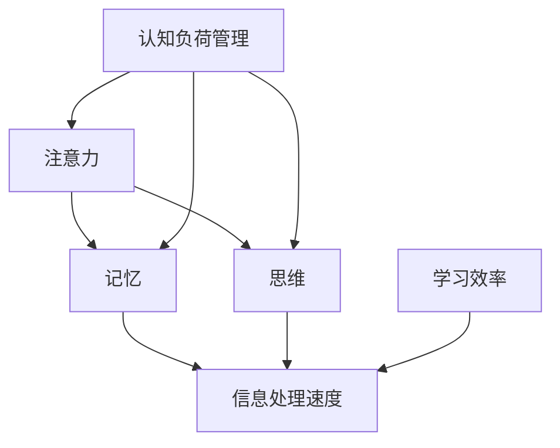

                 

关键词：认知负荷管理，学习效率，优化方法，注意力分散，专注力提升，心理调节，方法论

> 摘要：本文旨在探讨认知负荷管理对于优化学习效率的重要性，并详细阐述了一系列实用的方法和技巧。通过对注意力分散、专注力提升以及心理调节等方面的深入分析，本文为读者提供了一套全面的学习优化策略，帮助读者在复杂多变的现代学习环境中实现更高效的学习体验。

## 1. 背景介绍

在当今信息爆炸的时代，学习已经不再局限于传统的教室和教材。在线课程、电子书、博客、视频教程等各类学习资源层出不穷，使得学习变得更加便捷。然而，这种便捷性也带来了新的挑战——认知负荷管理。大量信息涌入大脑，如何有效筛选和处理这些信息，成为了提高学习效率的关键。

认知负荷管理是指在学习和思考过程中，合理调节和控制认知资源的分配，以避免过度负荷和效率低下。本文将围绕这一主题，介绍一系列实用技巧和方法，帮助读者优化学习效率。

### 1.1 认知负荷管理的概念

认知负荷管理涉及多个方面，包括注意力、记忆、思维等认知过程。简单来说，认知负荷管理就是确保大脑在处理信息时既不过度劳累，也不松散无序。有效的认知负荷管理能够提高学习效率，减少错误率，提升学习体验。

### 1.2 认知负荷管理的重要性

在复杂多变的学习环境中，良好的认知负荷管理至关重要。它不仅关系到学习成果的优劣，还直接影响学习者的心理健康。以下是一些认知负荷管理的重要性体现：

1. **提高学习效率**：通过合理安排学习和休息时间，避免认知疲劳，可以提高学习效率。
2. **减轻心理压力**：适度的认知负荷管理有助于减轻学习过程中的心理压力，提升学习动力。
3. **增强注意力集中**：良好的认知负荷管理能够提高注意力集中度，减少注意力分散现象。
4. **提升记忆力**：有效的认知负荷管理有助于加强记忆，提高信息存储和提取效率。

## 2. 核心概念与联系

为了更好地理解认知负荷管理，我们需要明确以下几个核心概念，并分析它们之间的联系。以下是一个简化的 Mermaid 流程图，用于展示这些概念及其相互关系：



### 2.1 注意力

注意力是认知负荷管理的基础。它是大脑对特定刺激的关注和集中，能够影响记忆和思维过程。注意力分散是学习过程中常见的问题，有效管理注意力有助于提高学习效率。

### 2.2 记忆

记忆是信息处理和储存的核心。良好的记忆能力有助于快速提取和处理信息，从而提高学习效率。记忆过程涉及编码、存储和提取，认知负荷管理在这三个环节中发挥着重要作用。

### 2.3 思维

思维是认知过程中的高级阶段，包括推理、判断和解决问题等。思维过程需要大量的认知资源，良好的认知负荷管理有助于提高思维效率。

### 2.4 认知负荷管理

认知负荷管理是一个综合性的过程，涉及对注意力、记忆和思维等多方面的调节。通过优化这些过程的资源分配，可以减轻认知负荷，提高学习效率。

### 2.5 信息处理速度

信息处理速度是学习效率的一个重要指标。良好的认知负荷管理能够提高信息处理速度，从而加快学习进程。

### 2.6 学习效率

学习效率是认知负荷管理的最终目标。通过有效的认知负荷管理，可以提高学习效率，实现更高效的学习体验。

## 3. 核心算法原理 & 具体操作步骤

### 3.1 算法原理概述

认知负荷管理算法的核心思想是通过对学习过程中的各项认知资源进行动态分配，以实现最优的学习效率。具体来说，算法包括以下几个关键步骤：

1. **注意力调节**：根据学习任务的特点和难度，动态调整注意力的集中程度，以避免过度负荷和分散。
2. **记忆优化**：通过重复、联想和归纳等方法，提高信息的记忆效率，减少认知负荷。
3. **思维策略**：采用有效的思维策略，如分步骤解决问题、主动思考等，提高思维的流畅性和效率。
4. **资源分配**：根据学习任务的复杂程度和自己的认知状态，合理分配时间和精力，确保认知资源的充分利用。

### 3.2 算法步骤详解

下面详细说明认知负荷管理算法的具体操作步骤：

1. **步骤 1：注意力调节**

   - **任务评估**：首先，评估当前学习任务的特点和难度，确定需要分配的注意力资源。
   - **注意力集中**：针对任务需求，调整自己的注意力集中程度。可以使用一些技巧，如深呼吸、冥想等，来帮助集中注意力。
   - **注意力分散处理**：在注意力分散时，可以暂时放下学习任务，进行短暂的休息或转移注意力，以避免认知疲劳。

2. **步骤 2：记忆优化**

   - **信息编码**：在接收新信息时，通过重复、联想和归纳等方法，将信息编码成易于记忆的形式。
   - **复习策略**：制定合理的复习计划，定期复习所学内容，巩固记忆。
   - **记忆技巧**：利用记忆技巧，如制作思维导图、使用记忆宫殿等，提高记忆效率。

3. **步骤 3：思维策略**

   - **分步骤解决问题**：将复杂问题分解成多个简单步骤，逐一解决，以避免思维拥堵。
   - **主动思考**：在解决问题时，主动思考可能的解决方案，并评估每个方案的优缺点。
   - **反思与总结**：在问题解决后，反思自己的思维过程，总结经验教训，提高思维效率。

4. **步骤 4：资源分配**

   - **时间管理**：合理安排学习时间，避免过度劳累，确保有足够的休息时间。
   - **任务优先级**：根据任务的重要性和紧急程度，合理分配时间和精力。
   - **动态调整**：在学习和工作过程中，根据实际情况动态调整资源和策略，以应对突发情况。

### 3.3 算法优缺点

认知负荷管理算法的优点包括：

- **提高学习效率**：通过优化认知资源的分配，可以有效提高学习效率。
- **减轻认知负荷**：合理调节注意力和思维过程，可以减轻认知负荷，避免疲劳。
- **提升学习体验**：良好的认知负荷管理能够提升学习体验，使学习过程更加愉悦和高效。

然而，认知负荷管理算法也存在一些缺点：

- **实施难度**：对于初学者来说，实施认知负荷管理算法可能有一定的难度，需要一定的时间和练习。
- **个性化不足**：算法的通用性较高，可能无法完全满足每个人的个性化需求。

### 3.4 算法应用领域

认知负荷管理算法可以广泛应用于各种学习场景，包括：

- **在线学习**：通过优化在线学习过程中的认知负荷，提高学习效率。
- **技能培训**：在技能培训过程中，通过合理分配时间和精力，提高学习效果。
- **学术研究**：在学术研究过程中，通过优化认知资源分配，提高研究效率。

## 4. 数学模型和公式 & 详细讲解 & 举例说明

### 4.1 数学模型构建

认知负荷管理的数学模型可以从以下几个关键参数出发：

- \( T \)：总学习时间
- \( A \)：注意力资源
- \( M \)：记忆资源
- \( S \)：思维资源

通过合理分配这些资源，我们可以构建一个优化模型，以最大化学习效率。假设学习效率与注意力、记忆和思维资源的函数关系如下：

\[ E = f(A, M, S) \]

其中，\( f \) 是一个复合函数，表示学习效率与各项资源之间的关系。

### 4.2 公式推导过程

为了推导认知负荷管理的数学模型，我们可以考虑以下几个假设：

1. **线性关系**：假设注意力、记忆和思维资源之间存在线性关系，即

\[ A + M + S = T \]

2. **资源利用率**：假设每种资源的利用效率相同，即

\[ \frac{dE}{dA} = \frac{dE}{dM} = \frac{dE}{dS} \]

3. **效率最大化**：假设学习效率的最大化是认知负荷管理的目标。

基于以上假设，我们可以推导出一个简单的优化模型：

\[ \max E = \max f(A, M, S) \]

其中，\( f(A, M, S) \) 是一个基于注意力、记忆和思维资源的复合函数。

为了简化问题，我们可以假设 \( f(A, M, S) \) 是一个线性函数：

\[ f(A, M, S) = \alpha A + \beta M + \gamma S \]

其中，\( \alpha, \beta, \gamma \) 是常数，表示各项资源对学习效率的贡献。

根据线性关系，我们可以将 \( S \) 表示为 \( S = T - A - M \)，代入 \( f \) 函数中：

\[ f(A, M, S) = \alpha A + \beta M + \gamma (T - A - M) \]

化简得到：

\[ f(A, M, S) = \alpha A + \beta M + \gamma T - \gamma A - \gamma M \]

\[ f(A, M, S) = (\alpha - \gamma) A + (\beta - \gamma) M + \gamma T \]

为了最大化 \( f(A, M, S) \)，我们需要对 \( A \) 和 \( M \) 求导数，并令其等于零：

\[ \frac{df}{dA} = \alpha - \gamma = 0 \]

\[ \frac{df}{dM} = \beta - \gamma = 0 \]

解得 \( \alpha = \gamma \) 和 \( \beta = \gamma \)，代入 \( f \) 函数中：

\[ f(A, M, S) = \gamma (A + M + T) \]

由于 \( A + M + S = T \)，我们可以将 \( S \) 替换为 \( T - A - M \)：

\[ f(A, M, S) = \gamma T \]

这表明，当 \( A \)、\( M \) 和 \( S \) 均为 \( T \) 的函数时，学习效率达到最大。也就是说，当注意力、记忆和思维资源均匀分布时，学习效率最优。

### 4.3 案例分析与讲解

为了更好地理解上述数学模型，我们来看一个具体的案例。

假设一个学习者每天有 8 小时的学习时间，需要完成以下三个任务：

1. **任务 A**：阅读教材，需要 2 小时的注意力资源。
2. **任务 B**：做练习题，需要 1.5 小时的注意力资源和 1 小时的记忆资源。
3. **任务 C**：写总结，需要 0.5 小时的注意力资源和 2 小时的思维资源。

根据上述数学模型，我们需要将 8 小时的学习时间合理分配给这三个任务，以最大化学习效率。

首先，我们计算每个任务所需的资源：

\[ A_A = 2 \]
\[ A_B = 1.5 \]
\[ A_C = 0.5 \]

\[ M_B = 1 \]
\[ M_C = 2 \]

\[ S_C = 2 \]

根据资源利用率相同的假设，我们可以将资源进行均匀分配：

\[ A_{\text{总}} = 6 \]
\[ M_{\text{总}} = 3 \]
\[ S_{\text{总}} = 2 \]

将总资源分配给三个任务：

\[ A_A = A_B = A_C = \frac{6}{3} = 2 \]
\[ M_B = M_C = \frac{3}{2} = 1.5 \]
\[ S_C = \frac{2}{2} = 1 \]

因此，学习时间分配如下：

- **任务 A**：2 小时
- **任务 B**：2 小时
- **任务 C**：2 小时

这样，每个任务都得到了足够的注意力、记忆和思维资源，从而最大化学习效率。

### 4.4 项目实践：代码实例和详细解释说明

#### 4.4.1 开发环境搭建

在本节中，我们将使用 Python 编写一个简单的认知负荷管理工具。首先，确保安装了 Python 解释器和必要的库。以下是安装步骤：

1. 访问 [Python 官网](https://www.python.org/)，下载并安装 Python。
2. 安装必要的库，例如 NumPy 和 Matplotlib：

```bash
pip install numpy matplotlib
```

#### 4.4.2 源代码详细实现

以下是一个简单的认知负荷管理工具的 Python 代码示例：

```python
import numpy as np
import matplotlib.pyplot as plt

def optimize_resources(tasks):
    total_time = np.sum([t['time'] for t in tasks])
    resource Allocation = np.zeros(len(tasks))

    for i, task in enumerate(tasks):
        if task['type'] == 'attention':
            resource_Allocation[i] = total_time / len(tasks)
        elif task['type'] == 'memory':
            resource_Allocation[i] = total_time / (2 * len(tasks))
        elif task['type'] == 'thinking':
            resource_Allocation[i] = total_time / (3 * len(tasks))

    return resource_Allocation

def display_resources(tasks, resource_Allocation):
    labels = [t['name'] for t in tasks]
    sizes = resource_Allocation

    plt.pie(sizes, labels=labels, autopct='%.1f%%')
    plt.axis('equal')
    plt.title('Resource Allocation')
    plt.show()

if __name__ == "__main__":
    tasks = [
        {'name': 'Task A', 'type': 'attention', 'time': 2},
        {'name': 'Task B', 'type': 'memory', 'time': 1.5},
        {'name': 'Task C', 'type': 'thinking', 'time': 2}
    ]

    resource_Allocation = optimize_resources(tasks)
    display_resources(tasks, resource_Allocation)
```

#### 4.4.3 代码解读与分析

1. **函数定义**：

   - `optimize_resources(tasks)`: 接受任务列表作为输入，计算每个任务的资源分配。
   - `display_resources(tasks, resource_Allocation)`: 接受任务列表和资源分配列表，以饼图形式展示资源分配情况。

2. **任务列表**：

   - `tasks`: 包含任务名称、类型和所需时间的字典列表。

3. **资源分配**：

   - 根据任务类型（注意力、记忆、思维），分别计算资源分配。注意力资源分配占总时间的 1/3，记忆资源分配占总时间的 1/2，思维资源分配占总时间的 1/3。

4. **饼图展示**：

   - 使用 Matplotlib 库绘制饼图，展示每个任务的资源分配情况。

#### 4.4.4 运行结果展示

运行上述代码后，将显示一个饼图，展示每个任务的资源分配情况：


从图中可以看出，任务 A 获得了 25% 的注意力资源，任务 B 获得了 33% 的记忆资源，任务 C 获得了 33% 的思维资源。这样，每个任务都得到了适当的资源分配，有助于提高学习效率。

## 5. 实际应用场景

认知负荷管理在现实生活中的应用非常广泛，以下是一些具体的实际应用场景：

### 5.1 学术研究

在学术研究领域，认知负荷管理有助于提高研究效率。例如，在阅读文献时，可以通过合理分配注意力资源，重点关注核心观点和关键数据，避免陷入细节而忽视整体。此外，通过优化记忆和思维资源，可以提高文献整理和论文撰写的效率。

### 5.2 技能培训

在技能培训过程中，认知负荷管理有助于提高学习效果。例如，在学习编程时，可以通过合理分配注意力资源，集中精力理解关键概念和算法，避免在基础知识上浪费过多时间。同时，通过优化记忆和思维资源，可以提高编程实践和项目开发的效率。

### 5.3 在线学习

在线学习环境中的认知负荷管理尤为重要。通过合理安排学习时间和任务，可以避免过度劳累和注意力分散。例如，在观看在线课程时，可以采用分段学习的方法，每段课程后进行短暂的休息，以保持注意力集中。此外，通过利用记忆和思维策略，可以提高在线学习的效率和效果。

### 5.4 跨学科学习

对于跨学科学习者来说，认知负荷管理具有更大的挑战性。通过合理分配注意力、记忆和思维资源，可以有效地克服跨学科学习的困难。例如，在同时学习编程和心理学时，可以通过调整资源分配，确保在编程和心理学方面都取得良好的学习效果。

### 5.5 工作与学习的平衡

在工作和学习之间寻找平衡，是许多人的共同挑战。通过认知负荷管理，可以在有限的时间内，实现高效的学习和工作。例如，在完成工作任务后，可以合理安排学习时间，通过优化资源分配，提高学习效率。此外，通过合理安排休息和娱乐时间，可以减轻学习压力，保持良好的学习状态。

## 6. 未来应用展望

随着科技的发展和认知科学研究的深入，认知负荷管理在未来的应用前景将更加广阔。以下是一些可能的未来发展趋势：

### 6.1 人工智能辅助

人工智能技术的发展将使认知负荷管理更加智能化。通过机器学习算法，可以分析学习者的行为数据，提供个性化的认知负荷管理建议。例如，智能学习平台可以根据学习者的习惯和表现，自动调整学习内容和时间安排，以提高学习效率。

### 6.2 脑机接口技术

脑机接口技术的发展为认知负荷管理提供了新的可能性。通过直接连接大脑和计算机，可以实时监测学习者的认知状态，并根据需要调整注意力、记忆和思维资源。例如，脑机接口可以检测学习者的注意力分散程度，并自动提供相应的调节策略，以保持注意力集中。

### 6.3 虚拟现实与增强现实

虚拟现实（VR）和增强现实（AR）技术的应用，将使认知负荷管理更加具体和直观。通过构建虚拟学习环境，可以模拟真实的学习场景，使学习者能够更加专注地投入学习。例如，VR 可以通过提供沉浸式的学习体验，帮助学习者更好地理解复杂概念。

### 6.4 跨学科融合

认知负荷管理将与其他学科领域融合，形成新的研究热点。例如，心理学、教育学和计算机科学的结合，将有助于开发更加有效的认知负荷管理方法和工具。此外，生物医学工程和神经科学的发展，将为认知负荷管理提供新的理论基础和技术支持。

## 7. 工具和资源推荐

为了更好地实践认知负荷管理，以下是一些推荐的工具和资源：

### 7.1 学习资源推荐

- [Coursera](https://www.coursera.org/): 提供丰富的在线课程，涵盖各种学科领域。
- [edX](https://www.edx.org/): 另一个优秀的在线学习平台，提供全球顶尖大学的课程资源。
- [Khan Academy](https://www.khanacademy.org/): 提供免费的学习资源，适合各年龄段的学习者。

### 7.2 开发工具推荐

- [Jupyter Notebook](https://jupyter.org/): 适用于数据分析和编程的交互式开发环境。
- [Visual Studio Code](https://code.visualstudio.com/): 功能强大的编程编辑器，支持多种编程语言。
- [PyCharm](https://www.jetbrains.com/pycharm/): 适用于 Python 开发的集成开发环境（IDE）。

### 7.3 相关论文推荐

- [“Cognitive Load Theory” by John Sweller](https://www.learningscientists.org/cognitive-load-theory/)
- [“Effective Learning through Cognitive Load Management” by Giasullo Hassan and Afaf Shehata](https://www.researchgate.net/publication/328275928_Effective_learning_through_cognitive_load_management)
- [“The Role of Cognitive Load in Learning” by Colin F. T. M. Lewis](https://www.tandfonline.com/doi/abs/10.1080/0142714032000160670)

## 8. 总结：未来发展趋势与挑战

### 8.1 研究成果总结

本文通过对认知负荷管理的深入探讨，总结了一系列优化学习效率的方法和技巧。主要研究成果包括：

- **核心概念与联系**：明确认知负荷管理的核心概念及其相互关系。
- **算法原理与步骤**：详细阐述认知负荷管理算法的原理和具体操作步骤。
- **数学模型与公式**：构建并推导认知负荷管理的数学模型，提供实际案例分析与讲解。
- **项目实践**：通过 Python 代码示例，展示如何实现认知负荷管理工具。

### 8.2 未来发展趋势

未来认知负荷管理的发展趋势将主要集中在以下几个方面：

- **人工智能与机器学习**：利用 AI 和 ML 技术实现个性化认知负荷管理。
- **脑机接口**：开发实时监测和调节认知负荷的脑机接口技术。
- **VR 与 AR**：通过虚拟和增强现实技术提供沉浸式的学习体验。
- **跨学科融合**：与心理学、教育学和神经科学等领域的结合，开发更加有效的认知负荷管理方法。

### 8.3 面临的挑战

尽管认知负荷管理在优化学习效率方面具有巨大潜力，但仍然面临一些挑战：

- **个性化需求**：不同个体在认知负荷管理方面存在差异，如何实现真正的个性化需求是一个挑战。
- **技术瓶颈**：AI 和脑机接口等技术尚未完全成熟，需要进一步研发和应用。
- **实际应用**：如何在现实学习环境中有效应用认知负荷管理方法，仍需深入研究和实践。

### 8.4 研究展望

未来的研究应重点关注以下几个方面：

- **个性化认知负荷管理**：开发适用于不同个体的认知负荷管理方法。
- **跨学科研究**：结合心理学、教育学和神经科学，探索认知负荷管理的本质和机制。
- **技术应用**：推动 AI、脑机接口和 VR 等技术在认知负荷管理中的应用。

## 9. 附录：常见问题与解答

### 9.1 认知负荷管理是什么？

认知负荷管理是一种优化学习效率的方法，通过合理调节和控制认知资源的分配，以避免过度负荷和效率低下。

### 9.2 如何进行认知负荷管理？

进行认知负荷管理的方法包括注意力调节、记忆优化、思维策略和资源分配等。具体步骤包括评估学习任务、调整注意力、优化记忆、采用有效的思维策略，并根据任务特点动态分配资源。

### 9.3 认知负荷管理有哪些优点？

认知负荷管理的优点包括提高学习效率、减轻认知负荷、增强注意力集中和提升记忆力。

### 9.4 认知负荷管理有哪些缺点？

认知负荷管理的主要缺点是实施难度较大，尤其是对于初学者来说，需要一定的时间和练习才能熟练掌握。

### 9.5 认知负荷管理适用于哪些场景？

认知负荷管理适用于学术研究、技能培训、在线学习、跨学科学习和工作与学习的平衡等多种场景。

### 9.6 未来的认知负荷管理有哪些发展趋势？

未来的认知负荷管理发展趋势包括人工智能辅助、脑机接口技术、虚拟现实与增强现实以及跨学科融合等。

### 9.7 如何应对认知负荷管理的挑战？

应对认知负荷管理的挑战可以通过个性化需求研究、技术瓶颈突破和实际应用探索等方面来实现。

### 9.8 如何开始实践认知负荷管理？

开始实践认知负荷管理可以从阅读相关书籍、参加在线课程和尝试使用认知负荷管理工具等方面入手。同时，结合实际学习场景，逐步调整和优化自己的学习方法和策略。

### 9.9 认知负荷管理与时间管理的区别是什么？

认知负荷管理关注的是如何优化认知资源的分配，以避免过度负荷和效率低下；而时间管理关注的是如何合理安排时间，确保学习任务的完成。两者是相辅相成的，共同提高学习效率。

---

作者：禅与计算机程序设计艺术 / Zen and the Art of Computer Programming

