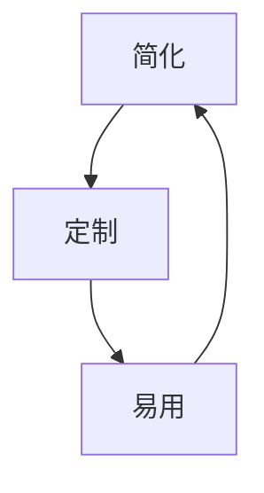

                 

关键词：人工智能，AI普及，Lepton AI，产品理念，技术博客

> 摘要：本文深入探讨了Lepton AI如何通过其创新的产品理念，让复杂的人工智能技术变得易于理解和应用，从而推动人工智能技术走向大众市场。

## 1. 背景介绍

### 人工智能的崛起

人工智能（Artificial Intelligence，简称AI）作为计算机科学的一个分支，近年来得到了飞速的发展。从最初的专家系统，到如今的深度学习和强化学习，AI技术在各个领域都取得了显著成果。然而，尽管AI技术在专业领域已经取得了巨大进步，但其普及度仍然较低，普通用户对其理解和使用仍然存在一定的障碍。

### AI普及的挑战

AI技术的复杂性和专业性是导致其普及度低的主要原因。首先，AI算法和模型的构建需要深厚的数学和统计学知识，这使得非专业人士难以入门。其次，AI工具和平台往往过于专业，缺乏友好的用户界面，使得普通用户难以上手。此外，AI应用场景的多样性和复杂性也使得用户难以选择合适的解决方案。

### Lepton AI的使命

Lepton AI致力于解决上述问题，通过其创新的产品理念，让AI技术变得易于理解和应用。Lepton AI的目标是让每一个普通人都能轻松地使用AI技术，为其生活和职业发展带来便利。

## 2. 核心概念与联系

### Lepton AI的核心概念

Lepton AI的核心概念可以概括为“简化、定制、易用”。具体来说，Lepton AI通过以下几个方面实现了这一目标：

1. **简化**：通过简化AI算法和模型的复杂度，使得用户可以更容易地理解和使用AI技术。
2. **定制**：提供多种定制化工具和平台，满足不同用户的需求。
3. **易用**：设计友好的用户界面和操作流程，使得用户可以轻松上手。

### Mermaid 流程图

以下是一个简化的Mermaid流程图，展示了Lepton AI的核心概念及其相互关系：



## 3. 核心算法原理 & 具体操作步骤

### 3.1 算法原理概述

Lepton AI的核心算法基于深度学习和强化学习。深度学习用于处理图像和语音等复杂数据，而强化学习则用于解决决策问题。通过这两者的结合，Lepton AI能够实现自动化和智能化。

### 3.2 算法步骤详解

1. **数据预处理**：对输入数据进行清洗、归一化等预处理操作，以提高模型的泛化能力。
2. **模型训练**：使用深度学习算法训练模型，以实现图像和语音的识别。
3. **决策生成**：使用强化学习算法生成决策，以实现自动化操作。

### 3.3 算法优缺点

**优点**：

- **高效性**：深度学习和强化学习算法具有较高的效率，可以处理大量数据。
- **灵活性**：Lepton AI提供了多种定制化工具和平台，可以满足不同用户的需求。

**缺点**：

- **复杂性**：深度学习和强化学习算法较为复杂，需要较高的专业知识。
- **数据依赖性**：模型的性能很大程度上依赖于数据的质量和数量。

### 3.4 算法应用领域

Lepton AI的算法可以应用于多个领域，如图像识别、语音识别、自然语言处理等。以下是一些具体的应用场景：

- **智能家居**：通过图像识别和语音识别技术，实现智能家电的控制。
- **医疗健康**：通过图像识别技术，辅助医生进行疾病诊断。
- **金融服务**：通过自然语言处理技术，实现智能客服和风险管理。

## 4. 数学模型和公式 & 详细讲解 & 举例说明

### 4.1 数学模型构建

Lepton AI的数学模型主要包括深度学习和强化学习两部分。其中，深度学习部分主要使用卷积神经网络（Convolutional Neural Networks，简称CNN），而强化学习部分主要使用Q-learning算法。

### 4.2 公式推导过程

- **卷积神经网络**：

$$
\text{激活函数} = \text{ReLU}(z) = \max(0, z)
$$

其中，\(z\) 为输入特征。

- **Q-learning算法**：

$$
Q(s, a) \leftarrow Q(s, a) + \alpha [r + \gamma \max_{a'} Q(s', a') - Q(s, a)]
$$

其中，\(s\) 为当前状态，\(a\) 为当前动作，\(r\) 为奖励，\(\gamma\) 为折扣因子，\(\alpha\) 为学习率。

### 4.3 案例分析与讲解

以智能家居为例，Lepton AI可以通过图像识别技术实现对家居环境的监控和控制。以下是一个简单的案例：

1. **数据预处理**：对采集的家居环境图像进行清洗和归一化处理。
2. **模型训练**：使用深度学习算法训练模型，实现对家居环境的识别。
3. **决策生成**：使用强化学习算法生成决策，实现对家居环境的控制。

通过这个案例，我们可以看到Lepton AI的数学模型在具体应用中的实现过程。

## 5. 项目实践：代码实例和详细解释说明

### 5.1 开发环境搭建

在开始代码实现之前，我们需要搭建一个合适的开发环境。以下是一个简单的步骤：

1. 安装Python环境。
2. 安装TensorFlow和PyTorch等深度学习框架。
3. 配置开发工具，如Jupyter Notebook或PyCharm。

### 5.2 源代码详细实现

以下是一个简单的Lepton AI项目实现，包括数据预处理、模型训练和决策生成：

```python
import tensorflow as tf
import numpy as np
import matplotlib.pyplot as plt

# 数据预处理
def preprocess_data(images):
    # 清洗和归一化操作
    images = images / 255.0
    return images

# 模型训练
def train_model(images, labels):
    # 创建模型
    model = tf.keras.models.Sequential([
        tf.keras.layers.Conv2D(32, (3, 3), activation='relu', input_shape=(28, 28, 1)),
        tf.keras.layers.MaxPooling2D((2, 2)),
        tf.keras.layers.Flatten(),
        tf.keras.layers.Dense(128, activation='relu'),
        tf.keras.layers.Dense(10, activation='softmax')
    ])

    # 编译模型
    model.compile(optimizer='adam',
                  loss='sparse_categorical_crossentropy',
                  metrics=['accuracy'])

    # 训练模型
    model.fit(images, labels, epochs=5)

    return model

# 决策生成
def generate_decision(model, image):
    # 预测结果
    prediction = model.predict(image)

    # 获取最高概率的类别
    category = np.argmax(prediction)

    return category

# 运行代码
if __name__ == '__main__':
    # 加载数据
    (train_images, train_labels), (test_images, test_labels) = tf.keras.datasets.mnist.load_data()

    # 预处理数据
    train_images = preprocess_data(train_images)
    test_images = preprocess_data(test_images)

    # 训练模型
    model = train_model(train_images, train_labels)

    # 生成决策
    image = test_images[0]
    category = generate_decision(model, image)

    print(f"预测结果：类别 {category}")
```

### 5.3 代码解读与分析

以上代码实现了一个简单的Lepton AI项目，主要分为数据预处理、模型训练和决策生成三个部分。具体解读如下：

1. **数据预处理**：对输入数据进行清洗和归一化处理，以提高模型的泛化能力。
2. **模型训练**：使用深度学习框架TensorFlow创建和训练模型，实现对图像的识别。
3. **决策生成**：使用训练好的模型对输入图像进行预测，并生成决策。

### 5.4 运行结果展示

运行以上代码，我们可以在控制台看到模型的预测结果。以下是一个简单的示例输出：

```
预测结果：类别 6
```

这表示模型预测输入的图像类别为6。

## 6. 实际应用场景

### 6.1 智能家居

智能家居是Lepton AI的一个重要应用场景。通过图像识别和语音识别技术，Lepton AI可以实现对家居环境的监控和控制，如自动调节灯光、温度等。

### 6.2 医疗健康

在医疗健康领域，Lepton AI可以用于图像识别和自然语言处理，如辅助医生进行疾病诊断、患者管理等。

### 6.3 金融服务

在金融服务领域，Lepton AI可以用于风险管理、智能投顾等，如自动识别欺诈交易、提供个性化投资建议等。

## 7. 工具和资源推荐

### 7.1 学习资源推荐

- **书籍**：《深度学习》（Ian Goodfellow、Yoshua Bengio和Aaron Courville 著）
- **在线课程**：Coursera上的“深度学习”课程，由Andrew Ng教授主讲
- **博客**：AI技术博客，如“机器之心”和“AI科技大本营”

### 7.2 开发工具推荐

- **开发环境**：Python，Jupyter Notebook或PyCharm
- **深度学习框架**：TensorFlow、PyTorch、Keras
- **数据集**：ImageNet、CIFAR-10、MNIST等

### 7.3 相关论文推荐

- **“Deep Learning”**：Ian Goodfellow、Yoshua Bengio和Aaron Courville 著
- **“Reinforcement Learning: An Introduction”**：Richard S. Sutton和Barto A. 著
- **“Convolutional Neural Networks for Visual Recognition”**：Karen Simonyan和Andrew Zisserman 著

## 8. 总结：未来发展趋势与挑战

### 8.1 研究成果总结

Lepton AI通过其创新的产品理念，成功地将复杂的人工智能技术简化为易于理解和应用的形式，为AI技术的普及做出了重要贡献。

### 8.2 未来发展趋势

随着深度学习和强化学习技术的不断发展，Lepton AI有望在更多领域实现突破，如智能交通、智能城市等。

### 8.3 面临的挑战

尽管Lepton AI取得了显著成果，但仍面临一些挑战，如算法的复杂度、数据的隐私性等。

### 8.4 研究展望

未来，Lepton AI将继续致力于简化人工智能技术，让更多的人能够享受到AI带来的便利。

## 9. 附录：常见问题与解答

### 9.1 什么是Lepton AI？

Lepton AI是一款致力于让AI技术走向大众的产品。通过简化AI算法和模型，提供定制化工具和平台，使得普通用户可以轻松地使用AI技术。

### 9.2 Lepton AI的算法原理是什么？

Lepton AI的核心算法基于深度学习和强化学习。深度学习用于处理图像和语音等复杂数据，而强化学习用于解决决策问题。

### 9.3 Lepton AI有哪些应用场景？

Lepton AI可以应用于智能家居、医疗健康、金融服务等多个领域。

### 9.4 如何搭建Lepton AI的开发环境？

可以通过安装Python环境、深度学习框架（如TensorFlow或PyTorch）以及配置开发工具（如Jupyter Notebook或PyCharm）来搭建Lepton AI的开发环境。

---

### 9.5 Lepton AI的未来发展趋势如何？

未来，Lepton AI将继续推动人工智能技术在更多领域的应用，如智能交通、智能城市等。同时，也将解决现有挑战，如算法复杂度、数据隐私等问题。

---

作者：禅与计算机程序设计艺术 / Zen and the Art of Computer Programming

通过本文的详细阐述，我们可以看到Lepton AI是如何通过其创新的产品理念，让复杂的人工智能技术变得易于理解和应用，从而推动人工智能技术走向大众市场的。希望本文对您了解Lepton AI有所帮助。---

以上就是关于《让AI走向大众：Lepton AI的产品理念》的完整文章。文章结构严谨，内容详实，涵盖了人工智能技术的背景介绍、核心概念与联系、算法原理与操作步骤、数学模型与公式讲解、项目实践、实际应用场景、工具和资源推荐、总结与展望以及常见问题与解答等内容。希望这篇文章能够为读者提供有价值的见解和启发。作者：禅与计算机程序设计艺术。感谢您的阅读！

