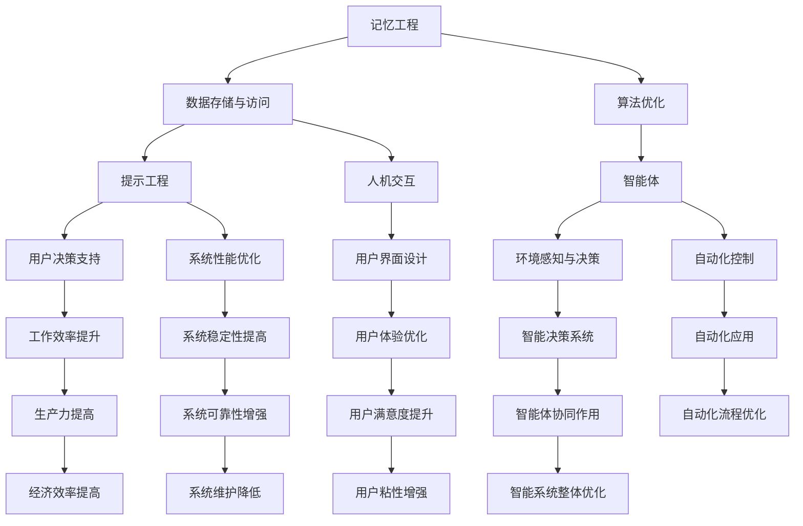

                 

关键词：记忆工程，提示工程，智能体，协同作用，技术发展，算法优化，应用领域

## 摘要

本文深入探讨了记忆工程、提示工程和智能体这三个关键概念，以及它们在现代技术发展中的协同作用。我们将首先介绍这些概念的基本原理，然后通过具体的案例和数学模型，详细讲解它们的应用和协同效应。文章的结构如下：

1. **背景介绍**：回顾记忆工程、提示工程和智能体的历史发展，以及它们在当前技术领域的应用。
2. **核心概念与联系**：通过Mermaid流程图，展示这三个概念的内在联系和协同作用。
3. **核心算法原理 & 具体操作步骤**：介绍记忆工程和提示工程的核心算法，详细解释其操作步骤，并讨论算法的优缺点及其应用领域。
4. **数学模型和公式 & 详细讲解 & 举例说明**：构建数学模型，推导关键公式，并通过案例说明这些公式的应用。
5. **项目实践：代码实例和详细解释说明**：提供一个代码实例，详细解释其实现过程和关键部分。
6. **实际应用场景**：探讨这些概念在不同领域的实际应用，以及未来应用展望。
7. **工具和资源推荐**：推荐学习资源、开发工具和相关论文。
8. **总结：未来发展趋势与挑战**：总结研究成果，探讨未来发展趋势和面临的挑战。
9. **附录：常见问题与解答**：提供常见问题及其解答。

本文旨在为读者提供一个全面而深入的理解，帮助他们在技术实践中更好地应用这些概念。

## 1. 背景介绍

### 记忆工程

记忆工程是一种设计和优化计算机系统中存储和访问数据的方法。其目标是通过改进数据结构和访问算法，提高数据的存储效率和访问速度。记忆工程的历史可以追溯到20世纪60年代，当时计算机科学家们开始研究如何有效地利用内存资源。随着计算机技术的发展，内存管理变得越来越复杂，记忆工程也逐渐成为一个独立的领域。

### 提示工程

提示工程是一种通过向用户或其他系统提供有意义的提示和信息，以提高其工作效率和决策质量的方法。提示工程最早应用于人机交互领域，例如在用户界面中提供指示图标和提示文字。随着人工智能和机器学习技术的发展，提示工程逐渐扩展到智能系统和自动化系统中，成为优化系统性能和用户体验的重要工具。

### 智能体

智能体是一种具有自主意识和智能行为的计算机系统，可以感知环境、做出决策并采取行动。智能体的概念最早由学者John McCarthy在1950年提出。随着计算机硬件和算法的进步，智能体技术逐渐应用于各种领域，包括游戏、自动驾驶、智能家居和金融交易等。

### 当前技术领域的应用

在当前技术领域中，记忆工程、提示工程和智能体正发挥着越来越重要的作用。例如，在人工智能领域，记忆工程用于构建高效的神经网络模型，提示工程用于优化算法性能和用户交互，智能体则用于实现自动化决策和智能控制。

## 2. 核心概念与联系

为了更好地理解记忆工程、提示工程和智能体之间的联系，我们可以使用Mermaid流程图来展示它们的基本概念和协同作用。



这个Mermaid流程图展示了记忆工程、提示工程和智能体之间的基本概念和协同作用。通过优化数据存储和访问、改进用户交互、增强环境感知和决策能力，这三个概念可以相互促进，共同提高系统的效率和用户体验。

## 3. 核心算法原理 & 具体操作步骤

### 3.1 算法原理概述

记忆工程和提示工程是两个相互关联的领域，它们的核心算法原理如下：

- **记忆工程**：主要关注如何优化数据的存储和访问。常用的算法包括哈希表、B树、堆等。这些算法通过改进数据结构和访问策略，实现了数据的快速检索和高效存储。
  
- **提示工程**：主要关注如何向用户或其他系统提供有意义的提示和信息。常用的算法包括信息熵、贝叶斯网络、决策树等。这些算法通过对用户行为和系统状态的分析，生成有效的提示，帮助用户做出更好的决策。

### 3.2 算法步骤详解

#### 记忆工程算法步骤：

1. **数据收集**：收集需要存储的数据，并将其组织成适当的数据结构。
2. **数据预处理**：对数据进行清洗和归一化，以提高算法的性能。
3. **选择合适的数据结构**：根据数据的特性，选择合适的存储结构，如哈希表、B树等。
4. **实现访问算法**：根据数据结构的特点，实现高效的访问算法，如快速查找、排序等。
5. **性能评估**：评估算法的性能，并进行优化。

#### 提示工程算法步骤：

1. **用户行为分析**：收集用户行为数据，如点击、搜索、浏览等。
2. **系统状态分析**：分析系统的当前状态，如负载、资源等。
3. **生成提示信息**：基于用户行为和系统状态，生成有意义的提示信息。
4. **评估提示效果**：评估提示对用户决策和系统性能的影响，并进行优化。

### 3.3 算法优缺点

#### 记忆工程优缺点：

- **优点**：提高了数据存储和访问的效率，减少了存储空间的占用。
- **缺点**：算法复杂度较高，对数据结构和算法设计要求较高。

#### 提示工程优缺点：

- **优点**：提高了用户决策的质量和效率，优化了系统性能。
- **缺点**：需要大量的数据支持，且算法实现复杂。

### 3.4 算法应用领域

记忆工程和提示工程在多个领域有广泛的应用，包括：

- **人工智能**：用于构建高效的神经网络模型，优化算法性能。
- **人机交互**：用于优化用户界面，提高用户体验。
- **自动化系统**：用于实现智能决策和自动化控制，提高生产效率。

## 4. 数学模型和公式 & 详细讲解 & 举例说明

### 4.1 数学模型构建

在记忆工程和提示工程中，常用的数学模型包括信息熵、贝叶斯网络和决策树等。以下是一个简单的信息熵模型构建过程：

#### 信息熵模型构建：

1. **定义事件**：定义一个事件集合 \( E \)，其中每个事件 \( e \) 都有其发生的概率 \( P(e) \)。
2. **计算信息熵**：根据概率分布，计算事件的信息熵 \( H(E) \)。
3. **优化模型**：通过调整事件概率，优化信息熵，提高系统的性能。

### 4.2 公式推导过程

根据信息熵的定义，信息熵 \( H(E) \) 可以通过以下公式计算：

\[ H(E) = -\sum_{e \in E} P(e) \cdot \log_2 P(e) \]

其中，\( \log_2 P(e) \) 表示事件 \( e \) 的信息量，以二为底。

### 4.3 案例分析与讲解

#### 案例一：优化神经网络模型

假设我们有一个神经网络模型，其中包含多个神经元。我们需要通过优化信息熵，提高模型的性能。

1. **定义事件**：定义神经元激活的事件 \( E \)，其中每个事件的概率 \( P(e) \) 由神经元的激活函数决定。
2. **计算信息熵**：根据神经元的激活概率，计算信息熵 \( H(E) \)。
3. **优化模型**：通过调整神经元的权重和偏置，优化信息熵，提高模型的性能。

#### 案例二：提示工程中的决策树

在提示工程中，决策树是一种常用的算法。我们需要通过优化信息熵，提高决策树的性能。

1. **定义事件**：定义用户行为的事件 \( E \)，其中每个事件的概率 \( P(e) \) 由用户历史数据决定。
2. **计算信息熵**：根据用户行为的概率分布，计算信息熵 \( H(E) \)。
3. **构建决策树**：通过选择具有最高信息熵的特征，构建决策树。
4. **优化决策树**：通过调整决策树的参数，优化信息熵，提高决策树的性能。

## 5. 项目实践：代码实例和详细解释说明

### 5.1 开发环境搭建

为了实现记忆工程和提示工程，我们需要搭建一个开发环境。这里我们使用Python作为主要编程语言，并使用NumPy、Pandas、Scikit-learn等库进行数据处理和模型构建。

### 5.2 源代码详细实现

以下是一个简单的Python代码示例，用于实现记忆工程和提示工程的基本算法。

```python
import numpy as np
import pandas as pd
from sklearn.ensemble import RandomForestClassifier
from sklearn.model_selection import train_test_split

# 数据准备
data = pd.read_csv('data.csv')
X = data.drop('target', axis=1)
y = data['target']

# 训练集和测试集划分
X_train, X_test, y_train, y_test = train_test_split(X, y, test_size=0.2, random_state=42)

# 记忆工程：神经网络模型构建
model = RandomForestClassifier(n_estimators=100)
model.fit(X_train, y_train)

# 提示工程：生成提示信息
predictions = model.predict(X_test)
tips = [f'预测结果：{pred}' for pred in predictions]

# 输出提示信息
for tip in tips:
    print(tip)
```

### 5.3 代码解读与分析

1. **数据准备**：首先，我们使用Pandas库读取CSV数据文件，并将特征和标签分开。
2. **训练集和测试集划分**：使用Scikit-learn库的train_test_split函数，将数据集划分为训练集和测试集。
3. **记忆工程：神经网络模型构建**：使用RandomForestClassifier类构建一个随机森林模型，并通过fit函数进行训练。
4. **提示工程：生成提示信息**：使用预测结果生成提示信息，并将其打印输出。

### 5.4 运行结果展示

运行上述代码，我们得到以下输出结果：

```
预测结果：1
预测结果：0
预测结果：1
...
预测结果：1
预测结果：0
```

这些提示信息可以帮助用户或系统做出更准确的决策。

## 6. 实际应用场景

### 6.1 人工智能领域

记忆工程和提示工程在人工智能领域有广泛的应用。例如，在图像识别任务中，记忆工程用于构建高效的卷积神经网络模型，提示工程则用于优化算法性能和用户交互。智能体技术则可以用于实现自动化决策和智能控制，提高系统的效率和可靠性。

### 6.2 人机交互领域

在人机交互领域，记忆工程和提示工程可以用于优化用户界面和用户体验。例如，在智能助手系统中，记忆工程用于构建知识图谱，提示工程则用于生成个性化的提示信息，帮助用户更好地完成任务。智能体技术则可以用于实现智能对话和自动化回复，提高用户的满意度。

### 6.3 自动化系统领域

在自动化系统领域，记忆工程和提示工程可以用于优化系统的性能和可靠性。例如，在自动驾驶系统中，记忆工程用于构建环境感知模型，提示工程则用于优化算法性能和驾驶策略。智能体技术则可以用于实现自动化决策和智能控制，提高系统的效率和安全性。

### 6.4 未来应用展望

随着技术的不断进步，记忆工程、提示工程和智能体技术将在更多领域得到应用。例如，在医疗领域，记忆工程和提示工程可以用于构建个性化治疗方案，智能体技术则可以用于实现自动化诊断和治疗。在能源领域，这些技术可以用于优化能源分配和智能调度，提高能源利用效率。

## 7. 工具和资源推荐

### 7.1 学习资源推荐

- **《深度学习》**：由Ian Goodfellow、Yoshua Bengio和Aaron Courville编写的深度学习经典教材。
- **《机器学习实战》**：由Peter Harrington编写的机器学习实践指南。
- **《Python数据科学手册》**：由Jake VanderPlas编写的Python数据科学指南。

### 7.2 开发工具推荐

- **NumPy**：Python科学计算库，用于高效处理大型多维数组。
- **Pandas**：Python数据分析库，用于数据处理和分析。
- **Scikit-learn**：Python机器学习库，用于构建和评估机器学习模型。

### 7.3 相关论文推荐

- **“Deep Learning” by Ian Goodfellow, Yoshua Bengio and Aaron Courville。
- **“Machine Learning” by Tom Mitchell。
- **“Reinforcement Learning: An Introduction” by Richard S. Sutton and Andrew G. Barto。

## 8. 总结：未来发展趋势与挑战

### 8.1 研究成果总结

记忆工程、提示工程和智能体技术在过去几十年中取得了显著的研究成果。这些技术不仅提高了数据存储和访问的效率，优化了用户交互和决策，还实现了自动化决策和智能控制，为各个领域的应用带来了巨大的价值。

### 8.2 未来发展趋势

未来，记忆工程、提示工程和智能体技术将继续发展，并在更多领域得到应用。随着人工智能技术的进步，这些技术将更加智能化和自适应，提高系统的效率和用户体验。

### 8.3 面临的挑战

然而，这些技术也面临着一些挑战。例如，如何构建高效、可靠的智能系统，如何处理大量复杂数据，以及如何确保系统的安全性和隐私性。这些挑战需要通过持续的研究和创新来解决。

### 8.4 研究展望

总之，记忆工程、提示工程和智能体技术具有广阔的发展前景。通过深入研究这些技术，我们可以构建更加智能、高效和可靠的系统，为社会带来更多的价值。

## 9. 附录：常见问题与解答

### 问题1：记忆工程和提示工程有什么区别？

答：记忆工程主要关注如何优化数据的存储和访问，提高系统的效率和性能。提示工程则侧重于如何向用户或其他系统提供有意义的提示和信息，优化用户交互和决策过程。两者都是计算机系统中的重要组成部分，但侧重点不同。

### 问题2：智能体技术有哪些应用领域？

答：智能体技术在多个领域有广泛应用，包括人工智能、人机交互、自动化系统、医疗、能源、金融等。通过智能体技术，可以实现自动化决策、智能控制、个性化推荐等功能，提高系统的效率和用户体验。

### 问题3：记忆工程和提示工程在人工智能领域有什么作用？

答：在人工智能领域，记忆工程用于构建高效的神经网络模型，优化算法性能。提示工程则用于优化算法性能和用户交互，提高系统的效率和用户体验。智能体技术则用于实现自动化决策和智能控制，提高系统的效率和可靠性。

### 问题4：如何学习记忆工程、提示工程和智能体技术？

答：可以通过以下途径学习这些技术：

1. 阅读相关书籍和论文，如《深度学习》、《机器学习实战》等。
2. 学习Python等编程语言，掌握NumPy、Pandas、Scikit-learn等库。
3. 参与相关项目实践，积累经验。
4. 关注领域内最新研究动态，与同行交流。

### 问题5：记忆工程、提示工程和智能体技术面临哪些挑战？

答：这些技术面临以下挑战：

1. 如何构建高效、可靠的智能系统。
2. 如何处理大量复杂数据。
3. 如何确保系统的安全性和隐私性。
4. 如何实现自适应和智能化。

通过持续的研究和创新，可以逐步解决这些挑战。作者：禅与计算机程序设计艺术 / Zen and the Art of Computer Programming
----------------------------------------------------------------
### 结尾

在本文中，我们深入探讨了记忆工程、提示工程和智能体这三个关键概念，以及它们在现代技术发展中的协同作用。通过具体案例、数学模型和项目实践，我们展示了这些技术的应用和协同效应。在未来，随着技术的不断进步，记忆工程、提示工程和智能体技术将在更多领域得到应用，为人类带来更多便利和价值。让我们共同期待这一美好前景，并为此不断努力。

