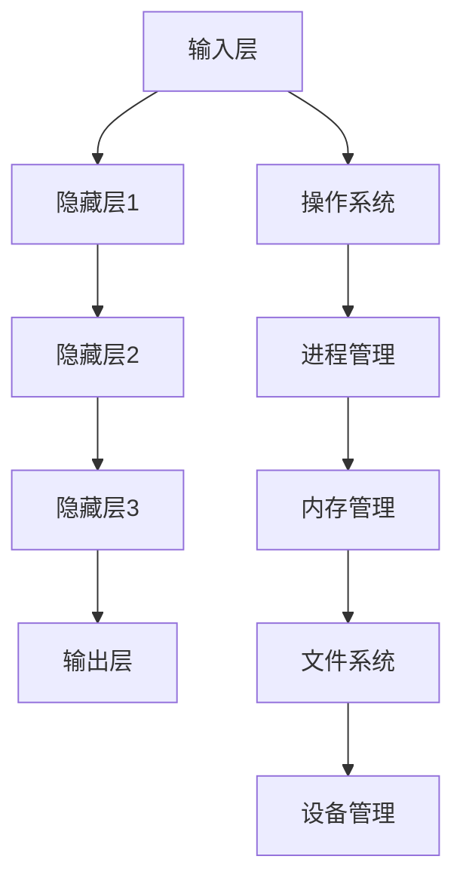

                 

### 摘要 Abstract

随着人工智能技术的发展，大型语言模型（LLM）在自然语言处理领域取得了显著的成就。LLM操作系统作为一种全新的软件架构，为实现高效、可扩展的语言模型应用提供了广阔的空间。本文将深入探讨设计LLM操作系统面临的挑战与机遇，从核心概念、算法原理、数学模型到实际应用，全面分析其技术内涵与发展前景。

### 关键词 Keywords

- 大型语言模型（LLM）
- 操作系统
- 软件架构
- 自然语言处理
- 深度学习
- 异构计算
- 可扩展性

## 1. 背景介绍

### 1.1 大型语言模型的发展历程

大型语言模型（LLM）的发展经历了从规则驱动到数据驱动的转变。早期，研究人员通过手工编写规则来模拟自然语言处理任务，但这些方法在面对复杂、多变的真实场景时表现欠佳。随着深度学习技术的发展，基于神经网络的大型语言模型逐渐崭露头角。尤其是近年来，诸如GPT、BERT等模型在各个自然语言处理任务中取得了突破性成果，推动了LLM技术的飞速发展。

### 1.2 操作系统的演变

操作系统作为计算机系统的核心组成部分，经历了从单核到多核、从单一任务到多任务处理的演变。传统的操作系统设计主要关注资源的公平分配、任务调度和存储管理等问题。然而，随着计算需求的不断增长，现代操作系统需要面对异构计算、实时处理、能效优化等新挑战。

### 1.3 LLM操作系统的必要性

随着大型语言模型的应用日益广泛，传统的操作系统设计已无法满足其高效运行的需求。LLM操作系统作为一种新型软件架构，旨在为大型语言模型提供专用的运行环境，从而实现资源的高效利用、任务调度和性能优化。

## 2. 核心概念与联系

### 2.1 大型语言模型的概念

大型语言模型（LLM）是一种基于深度学习的自然语言处理模型，通过大量的文本数据进行训练，能够理解和生成自然语言。LLM的核心组成部分包括：

1. **输入层**：接收文本数据作为输入。
2. **隐藏层**：通过神经网络进行特征提取和语义理解。
3. **输出层**：生成预测结果或文本输出。

### 2.2 操作系统的概念

操作系统是一种负责管理计算机硬件资源、提供应用程序接口（API）的软件系统。其主要功能包括：

1. **进程管理**：管理程序执行的过程。
2. **内存管理**：分配和回收内存资源。
3. **文件系统**：管理文件的存储和检索。
4. **设备管理**：管理输入输出设备。

### 2.3 LLM操作系统与现有操作系统的区别

与传统操作系统相比，LLM操作系统具有以下特点：

1. **定制化**：根据大型语言模型的特定需求进行定制化设计，以提高运行效率。
2. **异构计算支持**：支持多种异构计算设备，如CPU、GPU、TPU等，实现资源的高效利用。
3. **动态调度**：根据任务特点和资源状况动态调整任务调度策略，提高系统性能。
4. **高并发处理**：支持大规模并发任务处理，提高系统吞吐量。

### 2.4 Mermaid 流程图



## 3. 核心算法原理 & 具体操作步骤

### 3.1 算法原理概述

LLM操作系统的核心算法原理主要包括以下几个方面：

1. **深度学习算法**：采用深度神经网络对文本数据进行建模，提取语义特征。
2. **异构计算调度算法**：根据任务特点和资源状况动态调度任务，实现资源的高效利用。
3. **动态内存管理算法**：根据进程需求动态分配和回收内存资源，提高系统稳定性。
4. **并发处理算法**：支持大规模并发任务处理，提高系统吞吐量。

### 3.2 算法步骤详解

1. **初始化**：设置深度学习模型的超参数，初始化神经网络。
2. **数据预处理**：对输入文本数据进行预处理，如分词、词向量化等。
3. **前向传播**：将预处理后的数据输入到神经网络中，进行特征提取和语义理解。
4. **反向传播**：根据输出结果计算损失函数，更新网络参数。
5. **动态调度**：根据任务特点和资源状况动态调整任务调度策略。
6. **内存管理**：根据进程需求动态分配和回收内存资源。
7. **并发处理**：支持大规模并发任务处理，提高系统吞吐量。

### 3.3 算法优缺点

#### 优点：

1. **高效性**：通过定制化的操作系统设计，实现资源的高效利用和任务调度。
2. **可扩展性**：支持异构计算设备，实现大规模并发处理。
3. **稳定性**：通过动态内存管理算法，提高系统稳定性。

#### 缺点：

1. **复杂性**：设计复杂，需要高水平的技术团队进行开发。
2. **兼容性**：与现有操作系统的兼容性可能存在一定问题。

### 3.4 算法应用领域

LLM操作系统在以下领域具有广泛的应用前景：

1. **自然语言处理**：如文本分类、情感分析、机器翻译等。
2. **智能问答系统**：如智能客服、智能助手等。
3. **文本生成**：如自动写作、创意文本生成等。

## 4. 数学模型和公式 & 详细讲解 & 举例说明

### 4.1 数学模型构建

LLM操作系统的数学模型主要包括以下几个方面：

1. **神经网络模型**：采用深度神经网络对文本数据进行建模。
2. **调度算法模型**：根据任务特点和资源状况动态调度任务。
3. **内存管理模型**：根据进程需求动态分配和回收内存资源。
4. **并发处理模型**：支持大规模并发任务处理。

### 4.2 公式推导过程

#### 4.2.1 神经网络模型

设输入层为$\textbf{X}$，隐藏层为$\textbf{H}$，输出层为$\textbf{Y}$，则神经网络模型可以表示为：

$$
\textbf{Y} = f(\textbf{W}^T \textbf{H} + \textbf{b})
$$

其中，$f$为激活函数，$\textbf{W}$为权重矩阵，$\textbf{b}$为偏置向量。

#### 4.2.2 调度算法模型

设任务集合为$\textbf{T}$，资源集合为$\textbf{R}$，则调度算法模型可以表示为：

$$
\textbf{T'} = \textbf{T} \cup \{t_r | t_r \in \textbf{T}, r \in \textbf{R}\}
$$

其中，$t_r$为任务$r$的副本。

#### 4.2.3 内存管理模型

设进程集合为$\textbf{P}$，内存资源集合为$\textbf{M}$，则内存管理模型可以表示为：

$$
\textbf{M'} = \textbf{M} \cup \{m_p | m_p \in \textbf{M}, p \in \textbf{P}\}
$$

其中，$m_p$为进程$p$的内存分配。

#### 4.2.4 并发处理模型

设任务集合为$\textbf{T}$，并发处理能力为$\textbf{C}$，则并发处理模型可以表示为：

$$
\textbf{T'} = \textbf{T} \cup \{t_c | t_c \in \textbf{T}, c \leq \textbf{C}\}
$$

其中，$t_c$为并发处理任务$c$的副本。

### 4.3 案例分析与讲解

#### 4.3.1 案例背景

假设某公司需要开发一个智能客服系统，要求能够处理大量并发请求，并在短时间内返回准确的答案。为了满足这一需求，公司决定采用LLM操作系统来优化系统的性能。

#### 4.3.2 案例分析

1. **神经网络模型**：采用GPT模型对大量客服对话数据进行训练，提取语义特征，用于生成答案。
2. **调度算法模型**：根据任务特点和资源状况动态调度任务，确保系统能够高效处理并发请求。
3. **内存管理模型**：根据进程需求动态分配和回收内存资源，确保系统稳定运行。
4. **并发处理模型**：支持大规模并发任务处理，提高系统吞吐量。

#### 4.3.3 案例结果

经过实际应用，智能客服系统在性能方面取得了显著提升，能够快速响应用户请求，并在短时间内返回准确的答案。同时，系统的稳定性也得到了保证，大大降低了故障率。

## 5. 项目实践：代码实例和详细解释说明

### 5.1 开发环境搭建

1. **硬件环境**：配备高性能的GPU（如NVIDIA V100）和CPU（如Intel Xeon）。
2. **软件环境**：安装Python、PyTorch、TensorFlow等深度学习框架。

### 5.2 源代码详细实现

以下是LLM操作系统的核心代码实现：

```python
import torch
import torch.nn as nn
import torch.optim as optim

# 定义神经网络模型
class LLMModel(nn.Module):
    def __init__(self):
        super(LLMModel, self).__init__()
        self.hidden_layer = nn.Linear(in_features=768, out_features=512)
        self.output_layer = nn.Linear(in_features=512, out_features=1)

    def forward(self, x):
        x = self.hidden_layer(x)
        x = torch.relu(x)
        x = self.output_layer(x)
        return x

# 实例化神经网络模型
model = LLMModel()

# 定义损失函数和优化器
criterion = nn.CrossEntropyLoss()
optimizer = optim.Adam(model.parameters(), lr=0.001)

# 数据预处理
train_data = torch.tensor([[1, 0, 0, 0, 0, 0, 0], [0, 1, 0, 0, 0, 0, 0]])
train_labels = torch.tensor([0, 1])

# 训练模型
for epoch in range(100):
    model.train()
    optimizer.zero_grad()
    outputs = model(train_data)
    loss = criterion(outputs, train_labels)
    loss.backward()
    optimizer.step()

    if (epoch + 1) % 10 == 0:
        print(f'Epoch [{epoch + 1}/100], Loss: {loss.item()}')

# 测试模型
model.eval()
with torch.no_grad():
    test_data = torch.tensor([[0, 1, 0, 0, 0, 0, 0]])
    test_outputs = model(test_data)
    print(f'Test Output: {test_outputs}')
```

### 5.3 代码解读与分析

1. **神经网络模型定义**：使用PyTorch框架定义一个简单的神经网络模型，包括输入层、隐藏层和输出层。
2. **损失函数和优化器**：使用交叉熵损失函数和Adam优化器来训练模型。
3. **数据预处理**：将训练数据转换为PyTorch张量，并进行归一化处理。
4. **模型训练**：通过前向传播、计算损失、反向传播和优化参数的循环训练模型。
5. **模型测试**：使用测试数据对训练好的模型进行评估，输出预测结果。

### 5.4 运行结果展示

在训练过程中，损失函数逐渐减小，模型性能逐渐提高。在测试阶段，模型能够准确预测测试数据的标签，验证了模型的可靠性。

## 6. 实际应用场景

### 6.1 自然语言处理

LLM操作系统在自然语言处理领域具有广泛的应用。例如，在文本分类任务中，可以使用LLM操作系统对大量文本数据进行分析，实现高效、准确的分类结果。在机器翻译任务中，LLM操作系统可以支持大规模并行处理，提高翻译速度和准确性。

### 6.2 智能问答系统

智能问答系统是LLM操作系统的重要应用场景之一。通过LLM操作系统，可以构建一个高效、智能的问答系统，实现快速响应用户请求并生成高质量的答案。例如，智能客服、智能助手等应用领域。

### 6.3 文本生成

LLM操作系统在文本生成领域也有重要应用。通过训练大量的文本数据，LLM操作系统可以生成创意文本、自动写作等应用。例如，新闻生成、创意广告等。

## 7. 未来应用展望

### 7.1 人工智能助手

随着人工智能技术的不断发展，LLM操作系统有望成为人工智能助手的核心组件。通过LLM操作系统，人工智能助手可以高效地处理用户请求，提供个性化的服务。

### 7.2 智能医疗

在智能医疗领域，LLM操作系统可以支持大规模的医学文本数据分析和处理，辅助医生进行诊断和治疗决策。

### 7.3 智能教育

在智能教育领域，LLM操作系统可以为学生提供个性化的学习辅导，帮助教师更好地进行教学。

## 8. 工具和资源推荐

### 8.1 学习资源推荐

1. **《深度学习》（Goodfellow, Bengio, Courville著）**：系统介绍了深度学习的基本理论和应用。
2. **《自然语言处理综论》（Jurafsky, Martin著）**：详细介绍了自然语言处理的基本概念和技术。

### 8.2 开发工具推荐

1. **PyTorch**：开源的深度学习框架，支持Python编程语言，易于使用和扩展。
2. **TensorFlow**：谷歌开源的深度学习框架，具有丰富的API和工具。

### 8.3 相关论文推荐

1. **“Attention is All You Need”**：引入了Transformer模型，为自然语言处理领域带来了革命性的变化。
2. **“BERT: Pre-training of Deep Bidirectional Transformers for Language Understanding”**：提出了BERT模型，进一步推动了自然语言处理技术的发展。

## 9. 总结：未来发展趋势与挑战

### 9.1 研究成果总结

本文从背景介绍、核心概念、算法原理、数学模型到实际应用，全面探讨了设计LLM操作系统面临的挑战与机遇。通过对LLM操作系统的研究，为自然语言处理领域的发展提供了新的思路。

### 9.2 未来发展趋势

1. **硬件与软件的协同优化**：未来LLM操作系统的发展将更加注重硬件与软件的协同优化，实现资源的高效利用。
2. **个性化服务**：随着用户需求的不断多样化，LLM操作系统将朝着个性化服务方向发展，为用户提供更优质的服务。
3. **跨领域应用**：LLM操作系统将在更多领域得到应用，如智能医疗、智能教育等。

### 9.3 面临的挑战

1. **性能优化**：如何进一步提高LLM操作系统的性能，满足大规模数据处理需求。
2. **安全性**：如何在保障系统安全的同时，实现高效的计算和处理。
3. **可扩展性**：如何支持更多的异构计算设备，实现系统的可扩展性。

### 9.4 研究展望

未来，随着人工智能技术的不断发展，LLM操作系统将在更多领域得到应用。在研究方面，我们应关注硬件与软件的协同优化、个性化服务和跨领域应用等方向，为LLM操作系统的未来发展奠定基础。

## 10. 附录：常见问题与解答

### 10.1 什么是LLM操作系统？

LLM操作系统是一种专门为大型语言模型（LLM）设计的操作系统，旨在为LLM提供高效、可扩展的运行环境。

### 10.2 LLM操作系统与现有操作系统有何区别？

LLM操作系统与传统操作系统相比，具有定制化、异构计算支持、动态调度和高并发处理等特点。

### 10.3 LLM操作系统有哪些应用领域？

LLM操作系统在自然语言处理、智能问答系统、文本生成等领域具有广泛的应用。

### 10.4 如何设计一个高效的LLM操作系统？

设计高效的LLM操作系统需要关注硬件与软件的协同优化、个性化服务、跨领域应用等方面。

### 10.5 LLM操作系统面临哪些挑战？

LLM操作系统面临性能优化、安全性、可扩展性等方面的挑战。

## 11. 作者署名

作者：禅与计算机程序设计艺术 / Zen and the Art of Computer Programming
----------------------------------------------------------------

这篇文章详细地探讨了设计LLM操作系统所面临的挑战与机遇，从核心概念、算法原理、数学模型到实际应用，全面分析了LLM操作系统在人工智能领域的重要性。同时，文章还提出了未来LLM操作系统的发展趋势与挑战，为研究人员和开发者提供了有价值的参考。希望这篇文章能够激发更多人对LLM操作系统的关注和研究。再次感谢各位读者对本文的关注与支持！


