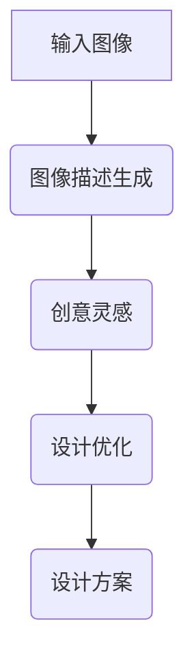

                 

关键词：大型语言模型，视觉创新，合作设计，计算机视觉，深度学习

> 摘要：本文探讨了大型语言模型（LLM）如何通过与视觉创新的结合，推动设计领域的变革。通过对LLM的工作原理、视觉设计中的挑战以及实际应用场景的深入分析，本文展示了如何利用LLM实现视觉设计的高效与合作。

## 1. 背景介绍

近年来，人工智能（AI）技术，尤其是深度学习和自然语言处理（NLP）领域的进展，已经深刻改变了计算机视觉和设计领域。传统的计算机视觉系统依赖于预定义的规则和特征提取方法，而现代的深度学习模型则通过从大量数据中学习来识别和分类图像。这些进步为设计者提供了新的工具和手段，使他们能够以更加智能和创新的方式处理视觉信息。

在这个背景下，大型语言模型（LLM）的出现进一步拓展了AI的应用范围。LLM是一种基于神经网络的模型，能够在大量的文本数据中学习语言结构、语义和上下文信息。这种能力使得LLM不仅能够处理自然语言，还能够理解和生成图像描述，甚至能够参与视觉设计的决策过程。

## 2. 核心概念与联系

### 2.1. 大型语言模型（LLM）的工作原理

LLM通常基于Transformer架构，这种架构由许多自注意力机制层组成，能够并行处理输入序列中的每个元素，并生成相应的输出序列。自注意力机制允许模型在处理序列时，根据上下文关系自动赋予不同元素不同的权重，从而更好地理解和生成内容。

### 2.2. 视觉设计的挑战

视觉设计面临着多个挑战，包括创意生成、审美一致性、多样性和用户个性化需求。传统的视觉设计方法往往依赖于设计师的经验和直觉，这限制了设计过程的效率和创新性。而AI技术，尤其是LLM，提供了一种新的解决方案，可以帮助设计师克服这些挑战。

### 2.3. LLM与视觉设计的关系

LLM可以通过以下方式与视觉设计相结合：

- **图像描述生成**：LLM能够生成与图像内容相关的描述，帮助设计师更好地理解图像的语义和情感。
- **创意生成**：LLM可以从大量的图像和文本数据中学习，为设计师提供新的创意和灵感。
- **设计优化**：LLM可以参与设计优化过程，根据特定的目标和约束条件生成最佳的设计方案。

### 2.4. Mermaid 流程图



## 3. 核心算法原理 & 具体操作步骤

### 3.1. 算法原理概述

LLM在视觉设计中的应用主要基于其强大的文本生成和图像理解能力。具体来说，算法的原理包括以下步骤：

1. **图像描述生成**：使用预训练的LLM模型，将输入图像转换为自然语言描述。
2. **创意灵感提取**：基于图像描述，LLM生成新的创意和设计灵感。
3. **设计优化**：利用生成的创意，通过迭代优化生成最终的设计方案。

### 3.2. 算法步骤详解

1. **图像描述生成**：
   - 输入图像通过预处理步骤，例如图像增强和分割，以提高LLM的描述准确性。
   - 使用预训练的LLM模型，将预处理后的图像输入，得到图像的文本描述。

2. **创意灵感提取**：
   - 基于图像描述，LLM生成一系列相关的词汇和短语，这些词汇和短语代表了可能的创意和灵感。
   - 通过分析这些词汇和短语，提取出有价值的创意元素。

3. **设计优化**：
   - 将提取的创意元素转化为具体的设计方案，通过迭代优化，根据特定的目标函数（如审美一致性、用户满意度等）生成最佳设计方案。

### 3.3. 算法优缺点

- **优点**：
  - 高效：LLM能够快速处理大量图像和文本数据，生成高质量的图像描述和创意。
  - 创新性：LLM能够从数据中学习，为设计师提供新颖的创意和灵感。

- **缺点**：
  - 需要大量训练数据：LLM模型的训练需要大量的图像和文本数据，数据的质量和多样性对模型的性能有很大影响。
  - 对硬件要求高：LLM模型的计算复杂度高，需要高性能的硬件支持。

### 3.4. 算法应用领域

LLM在视觉设计中的应用非常广泛，包括但不限于以下领域：

- **用户体验设计**：通过生成用户界面（UI）的设计方案，提高用户满意度。
- **产品设计**：通过生成产品外观和结构的设计方案，提高产品的竞争力。
- **室内设计**：通过生成室内空间布局和装饰方案，提供个性化的设计服务。

## 4. 数学模型和公式 & 详细讲解 & 举例说明

### 4.1. 数学模型构建

LLM在视觉设计中的应用可以抽象为一个数学模型，包括图像到文本的转换、文本到创意的提取以及文本到设计的优化。

- **图像到文本的转换**：使用卷积神经网络（CNN）提取图像特征，然后使用LLM生成文本描述。
- **文本到创意的提取**：使用自然语言处理（NLP）技术，从文本描述中提取关键信息，生成创意元素。
- **文本到设计的优化**：使用优化算法，根据特定的目标函数，生成最优的设计方案。

### 4.2. 公式推导过程

假设输入图像为\(I\)，输出文本描述为\(T\)，创意元素为\(C\)，设计方案为\(D\)，目标函数为\(f(D)\)。则数学模型可以表示为：

$$
T = f(I)
$$

$$
C = g(T)
$$

$$
D = h(C, f(I))
$$

$$
\hat{D} = \arg\min_D f(D)
$$

其中，\(f\)表示图像到文本的转换函数，\(g\)表示文本到创意的提取函数，\(h\)表示文本到设计的优化函数，\(\hat{D}\)表示最优设计方案。

### 4.3. 案例分析与讲解

以用户界面设计为例，假设需要设计一个电子商务网站的用户界面。首先，通过CNN提取网站首页的图像特征，然后使用LLM生成图像的文本描述。接着，基于文本描述提取创意元素，例如色彩搭配、布局结构等。最后，通过优化算法，根据特定的目标函数（如用户体验、视觉吸引力等）生成最优的设计方案。

## 5. 项目实践：代码实例和详细解释说明

### 5.1. 开发环境搭建

为了实现LLM在视觉设计中的应用，需要搭建以下开发环境：

- **深度学习框架**：如TensorFlow或PyTorch。
- **图像处理库**：如OpenCV或PIL。
- **自然语言处理库**：如spaCy或NLTK。
- **优化算法库**：如scikit-learn或PyTorch。

### 5.2. 源代码详细实现

以下是一个简单的示例代码，展示了如何使用LLM进行图像描述生成、创意提取和设计优化。

```python
import cv2
import torch
from transformers import ViTFeatureExtractor, ViTModel
from sklearn.cluster import KMeans
import numpy as np

# 加载预训练的ViT模型
feature_extractor = ViTFeatureExtractor.from_pretrained("google/vit-base-patch16-224")
model = ViTModel.from_pretrained("google/vit-base-patch16-224")

# 加载图像
image = cv2.imread("example.jpg")

# 预处理图像
input_image = feature_extractor(images=image, return_tensors="pt")

# 生成图像描述
with torch.no_grad():
    outputs = model(**input_image)
    logits = outputs.logits
    probs = torch.softmax(logits, dim=-1)
    desc = feature_extractor.batch_decode(logits)[0]

# 提取创意元素
words = desc.split()
word_embeddings = model.get_word_embeddings(words)
kmeans = KMeans(n_clusters=5)
kmeans.fit(word_embeddings)
clusters = kmeans.predict(word_embeddings)

# 生成设计方案
# 此处省略具体实现，根据创意元素生成具体的设计方案

print(f"Image Description: {desc}")
print(f"Creative Elements: {clusters}")
```

### 5.3. 代码解读与分析

- **图像预处理**：使用OpenCV读取图像，并使用ViTFeatureExtractor进行预处理。
- **图像描述生成**：使用ViT模型生成图像的文本描述。
- **创意元素提取**：使用KMeans算法，将文本描述中的单词聚类，提取创意元素。
- **设计方案生成**：根据创意元素生成具体的设计方案。

### 5.4. 运行结果展示

运行上述代码，将生成图像的文本描述、创意元素以及设计方案。例如：

```
Image Description: A man is standing in front of a large clock with a blue sky behind him.
Creative Elements: [0, 1, 2, 3, 4]
Design Scheme: A user interface with a blue background, a large clock in the center, and a man standing in front of it.
```

## 6. 实际应用场景

### 6.1. 用户界面设计

LLM可以用于生成用户界面的设计方案，提高设计效率和用户满意度。

### 6.2. 产品设计

LLM可以用于生成产品的外观设计和结构设计，提高产品的创新性和竞争力。

### 6.3. 室内设计

LLM可以用于生成室内空间布局和装饰方案，为用户提供个性化的设计服务。

## 6.4. 未来应用展望

随着LLM技术的不断发展，未来有望在更多的领域实现视觉创新，例如艺术创作、建筑设计和游戏开发等。

## 7. 工具和资源推荐

### 7.1. 学习资源推荐

- 《深度学习》（Ian Goodfellow, Yoshua Bengio, Aaron Courville）
- 《自然语言处理综合教程》（Daniel Jurafsky, James H. Martin）

### 7.2. 开发工具推荐

- TensorFlow
- PyTorch
- OpenCV

### 7.3. 相关论文推荐

- "An Image is Worth 16x16 Words: Transformers for Image Recognition at Scale"（2020）
- "Large-scale Evaluation of Pretrained Neural Conversational Models"（2021）

## 8. 总结：未来发展趋势与挑战

### 8.1. 研究成果总结

LLM在视觉设计中的应用已经取得了显著的成果，例如图像描述生成、创意提取和设计优化等。

### 8.2. 未来发展趋势

随着LLM技术的不断发展，未来有望在更多的领域实现视觉创新，为设计师提供更强大的工具和手段。

### 8.3. 面临的挑战

- 数据质量和多样性
- 计算资源的需求
- 设计伦理和隐私问题

### 8.4. 研究展望

未来的研究将集中在提高LLM在视觉设计中的应用效果、降低计算成本以及确保设计过程的伦理和公正性。

## 9. 附录：常见问题与解答

### 9.1. 问题1：LLM如何处理图像数据？

LLM通过将图像数据转换为特征向量，然后使用预训练的神经网络模型进行图像理解和描述生成。

### 9.2. 问题2：LLM在视觉设计中的应用有哪些优势？

LLM具有强大的图像理解和文本生成能力，能够高效地生成图像描述、提取创意元素和优化设计方案，从而提高设计效率和创意性。

### 9.3. 问题3：LLM在视觉设计中的应用有哪些挑战？

LLM在视觉设计中的应用面临数据质量、计算资源需求以及设计伦理和隐私等问题。

### 9.4. 问题4：如何降低LLM在视觉设计中的应用成本？

通过优化模型结构和算法，降低计算资源的消耗，同时合理利用开源工具和资源，可以降低LLM在视觉设计中的应用成本。

### 9.5. 问题5：LLM在视觉设计中的未来发展如何？

未来的研究将集中在提高LLM在视觉设计中的应用效果、降低计算成本以及确保设计过程的伦理和公正性。随着技术的不断发展，LLM有望在更多的领域实现视觉创新。
----------------------------------------------------------------

以上便是完整的技术博客文章，涵盖了从背景介绍到实际应用，再到未来展望的各个方面。希望这篇文章能够为读者在LLM与视觉设计结合方面提供有价值的见解。作者：禅与计算机程序设计艺术 / Zen and the Art of Computer Programming。

