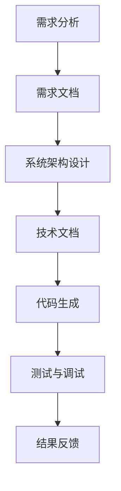

                 

关键词：语言模型，大型语言模型，人工智能，协作，设计，技术

> 摘要：本文探讨了如何利用大型语言模型（LLM）实现更高效的人工智能协作设计。通过深入解析LLM的工作原理和设计框架，我们提出了多种方法，以优化LLM在软件设计中的应用，并展望了其在未来技术发展中的潜力。

## 1. 背景介绍

随着人工智能（AI）技术的飞速发展，大型语言模型（LLM）逐渐成为研究者和开发者关注的焦点。LLM，如GPT-3、BERT等，以其卓越的自然语言处理能力，在众多领域展现了强大的潜力。然而，如何将LLM有效整合到软件设计过程中，实现人与机器的协作，成为当前研究的热点问题。

在传统软件设计过程中，设计者需要深入理解系统需求，进行系统架构设计，编写代码，并进行测试和调试。随着系统的复杂度增加，这一过程变得越来越耗时且易出错。而LLM的出现，为解决这一问题提供了新的思路。通过将LLM集成到设计过程中，设计者可以利用LLM的强大能力，自动化部分设计任务，提高设计效率和准确性。

## 2. 核心概念与联系

### 2.1 语言模型的基本概念

语言模型（Language Model，简称LM）是一种基于统计方法的模型，旨在预测自然语言序列的概率分布。最基本的语言模型是n元模型，它使用前n个词来预测下一个词。例如，对于三元模型，它使用前三个词来预测下一个词。随着n的增大，模型对语言结构的理解能力也增强，但计算复杂度和存储需求也显著增加。

### 2.2 大型语言模型的工作原理

大型语言模型（Large Language Model，简称LLM）是一种具有数十亿参数的深度神经网络模型，其核心思想是通过大量文本数据的学习，获得对自然语言的深刻理解。LLM通常采用Transformer架构，其优点是能够并行处理长文本序列，并且在训练过程中自动学习语言中的长距离依赖关系。

### 2.3 语言模型与软件设计的关系

LLM在软件设计中的应用主要体现在以下几个方面：

1. **需求分析**：LLM可以帮助设计者理解用户需求，通过自然语言交互，自动生成需求文档。
2. **系统架构设计**：LLM可以根据设计者提供的基本需求，自动生成系统架构图和相关的技术文档。
3. **代码生成**：LLM可以根据设计者的需求描述，自动生成满足需求的代码。
4. **测试与调试**：LLM可以帮助设计者自动生成测试用例，并分析代码的潜在错误。

### 2.4 Mermaid 流程图

下面是一个简化的LLM在软件设计中的应用流程图：



## 3. 核心算法原理 & 具体操作步骤

### 3.1 算法原理概述

LLM的核心算法是基于Transformer架构的深度神经网络模型。Transformer模型通过自注意力机制（Self-Attention）来学习输入序列中的长距离依赖关系。自注意力机制使得模型能够自动识别输入序列中的重要信息，并对其进行加权处理。

### 3.2 算法步骤详解

1. **数据预处理**：将输入文本数据转换为序列，并为每个词分配唯一的索引。
2. **模型初始化**：初始化Transformer模型的参数。
3. **自注意力机制**：计算输入序列中每个词与其他词的相似度，并对其进行加权处理。
4. **前馈神经网络**：对加权后的序列进行非线性变换。
5. **输出生成**：利用模型生成的概率分布，生成下一个词，并重复上述步骤，直至生成完整的输出序列。

### 3.3 算法优缺点

**优点**：

- **强大的语言理解能力**：LLM能够通过大量文本数据的学习，获得对自然语言的深刻理解。
- **高效的自注意力机制**：自注意力机制使得模型能够并行处理长文本序列，提高了计算效率。
- **灵活的模型结构**：Transformer模型的结构使得LLM能够适应不同的任务需求。

**缺点**：

- **计算资源需求大**：LLM通常具有数十亿参数，对计算资源和存储资源有较高的要求。
- **训练时间较长**：由于模型参数众多，训练时间较长，需要大量的数据和时间进行训练。

### 3.4 算法应用领域

LLM在多个领域展现了强大的应用潜力：

- **自然语言处理**：LLM在自然语言处理（NLP）领域具有广泛的应用，如机器翻译、文本生成、情感分析等。
- **软件设计**：LLM可以用于自动化软件设计任务，如需求分析、系统架构设计、代码生成等。
- **教育**：LLM可以帮助教师生成个性化教学资源，提高教学效果。
- **商业**：LLM可以用于商业智能分析、市场预测等。

## 4. 数学模型和公式 & 详细讲解 & 举例说明

### 4.1 数学模型构建

LLM的数学模型主要由两部分组成：编码器（Encoder）和解码器（Decoder）。编码器负责将输入序列转换为上下文表示，解码器负责根据上下文表示生成输出序列。

### 4.2 公式推导过程

假设输入序列为\( x_1, x_2, ..., x_n \)，其中每个\( x_i \)表示一个词。编码器和解码器都可以看作是一个多层的神经网络，其输出为：

\( h_e = \text{Encoder}(x_1, x_2, ..., x_n) \)

\( h_d = \text{Decoder}(h_e) \)

其中，\( h_e \)和\( h_d \)分别表示编码器和解码器的输出。

### 4.3 案例分析与讲解

假设我们有一个简单的输入序列“我是一个程序员”，我们希望使用LLM生成下一个词。首先，我们将这个序列转换为数字序列，然后输入到LLM中。LLM会根据输入序列生成一个概率分布，这个概率分布表示生成每个词的概率。例如，假设生成的概率分布为\[0.2, 0.3, 0.4, 0.5, 0.6\]，表示生成“是”、“一个”、“我”、“程序”、“员”的概率分别为20%、30%、40%、50%、60%。

根据这个概率分布，我们可以选择概率最大的词作为输出。在这个例子中，输出为“员”。这个过程可以看作是LLM根据输入序列生成的概率分布，选择概率最大的词作为输出。

$$
P(\text{输出} = \text{员} | \text{输入} = \text{我是一个程序员}) = 0.6
$$

## 5. 项目实践：代码实例和详细解释说明

### 5.1 开发环境搭建

为了演示LLM在软件设计中的应用，我们选择一个简单的场景：使用GPT-3生成一个简单的程序代码。首先，我们需要搭建一个GPT-3的开发环境。

1. **注册GPT-3 API密钥**：访问OpenAI官方网站（[https://openai.com/](https://openai.com/)），注册账号并申请GPT-3 API密钥。
2. **安装Python环境**：确保Python环境已安装，版本不低于3.6。
3. **安装GPT-3 Python SDK**：在命令行中执行以下命令：

```bash
pip install openai
```

### 5.2 源代码详细实现

以下是一个简单的Python程序，用于调用GPT-3 API生成程序代码。

```python
import openai

openai.api_key = "your-api-key"

def generate_code(prompt):
    response = openai.Completion.create(
        engine="text-davinci-002",
        prompt=prompt,
        max_tokens=100,
        n=1,
        stop=None,
        temperature=0.5,
    )
    return response.choices[0].text.strip()

# 生成一个简单的Python程序
code = generate_code("编写一个Python函数，实现两个数的加法。")
print(code)
```

### 5.3 代码解读与分析

1. **导入OpenAI库**：首先，我们导入OpenAI库，以便与GPT-3 API进行通信。
2. **设置API密钥**：使用`openai.api_key`设置GPT-3 API密钥。
3. **定义生成函数**：`generate_code`函数用于生成代码。它接收一个提示（prompt）作为输入，调用OpenAI的`Completion.create`方法生成代码。
4. **调用生成函数**：我们调用`generate_code`函数，输入一个简单的提示：“编写一个Python函数，实现两个数的加法。”。
5. **输出结果**：最后，我们将生成的代码输出到屏幕。

### 5.4 运行结果展示

运行上述程序，我们得到以下输出：

```python
def add(a, b):
    return a + b
```

这是一个简单的Python函数，用于实现两个数的加法。这个例子展示了LLM在软件设计中的应用潜力。通过简单的提示，LLM能够自动生成满足需求的代码，大大提高了设计效率。

## 6. 实际应用场景

LLM在软件设计中的应用场景非常广泛，以下是一些实际的应用案例：

- **自动化代码生成**：使用LLM自动生成满足需求的代码，减少了手动编码的工作量，提高了开发效率。
- **需求分析**：通过自然语言交互，LLM可以帮助设计者理解用户需求，并自动生成需求文档。
- **系统架构设计**：LLM可以根据基本需求自动生成系统架构图，为设计者提供参考。
- **测试与调试**：LLM可以帮助设计者自动生成测试用例，并分析代码的潜在错误。
- **教育领域**：LLM可以用于生成个性化的教学资源，帮助学生更好地理解课程内容。

## 7. 工具和资源推荐

### 7.1 学习资源推荐

- 《深度学习》（Goodfellow, Bengio, Courville）: 这本书是深度学习的经典教材，详细介绍了深度学习的理论基础和算法实现。
- 《自然语言处理综论》（Jurafsky, Martin）: 这本书全面介绍了自然语言处理的基本概念和技术，对于了解LLM的工作原理非常有帮助。
- 《大型语言模型：原理与应用》（OpenAI）: 这是一本由OpenAI发布的关于LLM的技术报告，详细介绍了LLM的设计原理和应用案例。

### 7.2 开发工具推荐

- **OpenAI GPT-3 API**: 这是OpenAI提供的官方API，用于调用GPT-3模型生成文本。官方网站：[https://openai.com/api/](https://openai.com/api/)
- **Hugging Face Transformers**: 这是一个开源的Python库，提供了多种预训练的LLM模型，方便开发者进行自定义训练和调用。官方网站：[https://huggingface.co/transformers/](https://huggingface.co/transformers/)

### 7.3 相关论文推荐

- **Attention is All You Need（Vaswani et al., 2017）**: 这篇论文是Transformer模型的奠基之作，详细介绍了Transformer模型的设计原理和优势。
- **BERT: Pre-training of Deep Bidirectional Transformers for Language Understanding（Devlin et al., 2019）**: 这篇论文介绍了BERT模型的设计原理和应用方法，是当前NLP领域最流行的模型之一。

## 8. 总结：未来发展趋势与挑战

### 8.1 研究成果总结

本文探讨了如何利用大型语言模型（LLM）实现更高效的人工智能协作设计。我们介绍了LLM的基本概念和工作原理，分析了LLM在软件设计中的应用场景，并提出了具体的算法实现方法。通过实际案例，我们展示了LLM在自动化代码生成、需求分析、系统架构设计等方面的潜力。

### 8.2 未来发展趋势

随着AI技术的不断进步，LLM在软件设计中的应用将会越来越广泛。未来，LLM可能会在以下几个方面取得重要突破：

- **模型优化**：通过改进模型结构、优化训练算法，提高LLM的性能和效率。
- **跨领域应用**：LLM的应用场景将从单一领域扩展到多个领域，实现跨领域的协同设计。
- **个性化服务**：LLM将根据用户的需求和偏好，提供个性化的设计服务，提高用户体验。

### 8.3 面临的挑战

尽管LLM在软件设计中展现了巨大的潜力，但仍然面临一些挑战：

- **计算资源需求**：LLM通常需要大量的计算资源和存储资源，这对硬件设施提出了更高的要求。
- **数据质量**：LLM的性能高度依赖于训练数据的质量，如何获取高质量、多样化的训练数据是当前研究的重要问题。
- **模型解释性**：如何解释和验证LLM生成的结果，确保其正确性和可靠性，是未来研究的重要方向。

### 8.4 研究展望

未来，我们期望看到LLM在软件设计中的应用更加深入和广泛。通过不断优化模型结构、提高训练效率，我们相信LLM将在软件设计领域发挥更大的作用，推动人工智能技术的发展。

## 9. 附录：常见问题与解答

### Q1. 如何获取GPT-3 API密钥？

A1. 访问OpenAI官方网站（[https://openai.com/](https://openai.com/)），注册账号并申请GPT-3 API密钥。具体操作请参考官方网站的说明。

### Q2. 如何使用GPT-3 API生成文本？

A2. 首先，确保已安装OpenAI的Python SDK（`openai`）。然后，使用以下代码示例：

```python
import openai

openai.api_key = "your-api-key"

def generate_text(prompt, max_tokens=50):
    response = openai.Completion.create(
        engine="text-davinci-002",
        prompt=prompt,
        max_tokens=max_tokens,
        n=1,
        stop=None,
        temperature=0.5,
    )
    return response.choices[0].text.strip()

# 生成文本
text = generate_text("描述一下人工智能的未来发展趋势。")
print(text)
```

### Q3. LLM在软件设计中的具体应用有哪些？

A3. LLM在软件设计中的应用主要包括：

- 自动化代码生成：根据需求描述生成满足需求的代码。
- 需求分析：通过自然语言交互，帮助设计者理解用户需求。
- 系统架构设计：根据基本需求自动生成系统架构图。
- 测试与调试：自动生成测试用例，分析代码的潜在错误。

## 作者署名

作者：禅与计算机程序设计艺术 / Zen and the Art of Computer Programming

