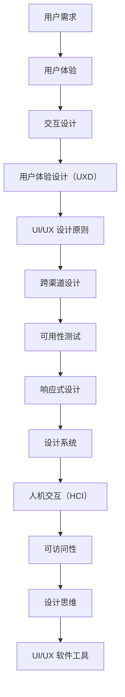

                 

用户界面（UI）是软件产品与用户互动的桥梁。一个设计良好、易于使用的UI可以显著提升用户体验，从而提高用户满意度、留存率和产品成功率。本文将探讨设计更好的用户界面的关键原则和实践，旨在为开发者提供有价值的指导，帮助他们创建更加优质的用户界面。

## 关键词

用户界面设计、用户体验、UI原则、交互设计、界面优化、UI工具

## 摘要

本文将从以下几个方面展开讨论：

1. 背景介绍
2. 核心概念与联系
3. 核心算法原理与具体操作步骤
4. 数学模型与公式
5. 项目实践：代码实例与详细解释
6. 实际应用场景
7. 工具和资源推荐
8. 总结：未来发展趋势与挑战
9. 附录：常见问题与解答

希望通过本文，读者能够对用户界面设计有更深入的理解，并掌握一些实用的技巧和方法，以设计出更加优秀的用户界面。

## 1. 背景介绍

在当今数字化的时代，软件产品和服务无处不在，用户界面设计成为了影响产品成功与否的关键因素之一。用户界面不仅影响用户对产品的第一印象，还直接影响用户的日常使用体验。

一个糟糕的UI设计可能会导致用户在使用过程中感到沮丧、困惑，甚至放弃使用。例如，一个导航复杂、难以理解的网站可能会导致用户流失；一个操作繁琐、响应缓慢的软件可能会导致用户失去耐心。

另一方面，一个设计良好、易于使用的UI可以显著提升用户体验。良好的UI设计不仅能够提高用户满意度，还能够提高产品的留存率和市场份额。例如，简洁直观的界面可以让用户快速完成任务，提高工作效率；丰富的交互元素可以增强用户的参与感和趣味性。

本文将探讨设计更好的用户界面的关键原则和实践，帮助开发者创建出更加优质的用户界面。

## 2. 核心概念与联系

在设计用户界面的过程中，需要理解一些核心概念和它们之间的联系。以下是几个重要的核心概念：

### 2.1 用户需求

用户需求是UI设计的出发点。了解用户的需求和痛点，可以帮助设计师创建出更符合用户期望的界面。用户需求可以通过用户调研、用户访谈、问卷调查等方式收集。

### 2.2 用户体验

用户体验（UX）是用户在使用产品过程中所感受到的总体体验。它包括用户在使用产品时的情感、认知和生理反应。一个良好的用户体验可以带来愉悦的用户感受，提高用户满意度和忠诚度。

### 2.3 交互设计

交互设计是UI设计的一个关键方面，它关注用户与产品之间的互动方式。交互设计的目标是创建直观、自然的用户界面，使用户能够轻松、高效地完成任务。

### 2.4 用户体验设计（UXD）

用户体验设计（UXD）是一种以用户为中心的设计方法，旨在创建一个用户喜欢、愿意使用并从中获得价值的界面。UXD涉及多个学科，包括心理学、人机交互、设计等。

### 2.5 UI/UX 设计原则

UI/UX 设计原则是设计过程中需要遵循的基本指导原则。这些原则包括简洁性、一致性、响应性、易用性、可访问性等。

### 2.6 跨渠道设计

随着移动设备和多种平台的普及，跨渠道设计变得越来越重要。跨渠道设计的目标是确保用户在不同设备、不同平台上获得一致的体验。

### 2.7 可用性测试

可用性测试是评估用户界面设计有效性的重要手段。通过可用性测试，可以识别出界面设计中的问题，并进行改进。

### 2.8 响应式设计

响应式设计是一种能够根据用户设备尺寸和分辨率自动调整布局和内容的设计方法。它确保用户在任何设备上都能获得良好的体验。

### 2.9 设计系统

设计系统是一套标准化、模块化的设计指南，用于构建一致、高质量的界面。设计系统包括颜色、字体、按钮、图标等设计元素。

### 2.10 人机交互（HCI）

人机交互（HCI）是研究用户与计算机系统之间交互的学科。HCI的研究成果为UI设计提供了重要的理论依据。

### 2.11 可访问性

可访问性是指产品能够为所有用户，包括残障人士，提供无障碍使用的能力。良好的可访问性设计可以提升用户体验，扩大用户基础。

### 2.12 设计思维

设计思维是一种以用户为中心的创新方法，强调在设计和开发过程中不断迭代、测试和改进。

### 2.13 UI/UX 软件工具

UI/UX 软件工具如Sketch、Adobe XD、Figma等，可以帮助设计师创建原型、进行交互设计和用户测试。

下面是一个用Mermaid绘制的流程图，展示了这些核心概念之间的联系：



通过理解这些核心概念和它们之间的联系，设计师可以更全面地把握用户界面设计的方方面面，从而创造出更好的用户体验。

### 3. 核心算法原理 & 具体操作步骤

#### 3.1 算法原理概述

用户界面设计涉及到多个算法原理，包括但不限于：信息架构、交互流程、视觉设计等。以下是这些算法原理的基本概念：

##### 3.1.1 信息架构

信息架构是指对信息进行组织和分类的方法。它帮助用户快速找到所需信息，提高使用效率。信息架构的核心原则包括层次性、一致性、逻辑性等。

##### 3.1.2 交互流程

交互流程是指用户与界面进行交互的步骤和流程。一个良好的交互流程应该直观、简便，并且符合用户的预期和行为模式。

##### 3.1.3 视觉设计

视觉设计是指界面的视觉元素，包括颜色、字体、图标、布局等。视觉设计的目标是提高界面的美观性和易用性，增强用户体验。

##### 3.1.4 信息可视化

信息可视化是一种利用图形、图表等视觉元素来展示数据和信息的方法。它可以帮助用户更快速、更直观地理解和分析信息。

##### 3.1.5 交互反馈

交互反馈是指用户在操作界面时获得的即时反馈。良好的交互反馈可以提高用户的信心和满意度，减少操作失误。

#### 3.2 算法步骤详解

##### 3.2.1 信息架构设计

1. **需求分析**：了解用户需求，确定信息架构的基础。
2. **内容梳理**：对内容进行分类、整理，确保信息层次清晰。
3. **构建原型**：使用工具（如Axure、Sketch等）创建信息架构原型。
4. **用户测试**：通过用户测试验证信息架构的合理性，进行迭代改进。

##### 3.2.2 交互流程设计

1. **用户画像**：分析目标用户的特点和需求，确定交互流程的基础。
2. **流程梳理**：梳理用户的操作步骤，确保流程简洁、直观。
3. **创建原型**：使用UI/UX设计工具创建交互流程原型。
4. **用户测试**：通过用户测试验证交互流程的合理性，进行迭代改进。

##### 3.2.3 视觉设计

1. **风格定义**：确定界面的整体风格，包括颜色、字体、图标等。
2. **布局设计**：设计界面的布局，确保视觉元素的位置合理、美观。
3. **元素设计**：设计按钮、图标、文本框等视觉元素，确保它们符合品牌风格和用户习惯。
4. **用户测试**：通过用户测试验证视觉设计的效果，进行迭代改进。

##### 3.2.4 信息可视化

1. **数据准备**：收集和整理需要可视化的数据。
2. **图表选择**：选择适合的数据可视化图表，如柱状图、折线图、饼图等。
3. **设计可视化元素**：设计图表的样式，包括颜色、字体、线条等。
4. **用户测试**：通过用户测试验证信息可视化的效果，进行迭代改进。

##### 3.2.5 交互反馈

1. **反馈类型**：确定界面上需要提供的反馈类型，如文字提示、声音提示、动画等。
2. **反馈设计**：设计反馈的样式和触发条件，确保反馈及时、明确。
3. **用户测试**：通过用户测试验证交互反馈的有效性，进行迭代改进。

#### 3.3 算法优缺点

##### 3.3.1 信息架构

优点：  
- **提高信息可访问性**：帮助用户快速找到所需信息，提高使用效率。  
- **增强用户体验**：层次清晰、逻辑性强的信息架构可以提高用户体验。

缺点：  
- **设计难度较大**：需要深入了解用户需求和信息内容，设计过程复杂。

##### 3.3.2 交互流程

优点：  
- **提高用户满意度**：简洁、直观的交互流程可以降低用户的学习成本，提高满意度。  
- **优化用户操作**：通过优化交互流程，可以提高用户的操作效率和准确性。

缺点：  
- **设计灵活性较低**：一旦交互流程确定，修改成本较高。

##### 3.3.3 视觉设计

优点：  
- **提升界面美观度**：良好的视觉设计可以提升界面的美观度，增加用户好感。  
- **增强品牌形象**：统一的视觉设计可以强化品牌形象，提高品牌认知度。

缺点：  
- **设计成本较高**：视觉设计需要大量时间和资源，成本较高。

##### 3.3.4 信息可视化

优点：  
- **提高数据可读性**：通过图表等形式展示数据，可以增强数据的可读性，提高用户理解。  
- **优化数据分析**：信息可视化可以辅助用户进行数据分析和决策。

缺点：  
- **设计难度较大**：需要选择适合的图表类型和设计元素，设计过程复杂。

##### 3.3.5 交互反馈

优点：  
- **提高用户信心**：及时的交互反馈可以增强用户的信心和满意度。  
- **减少操作错误**：明确的交互反馈可以减少用户操作错误，提高操作准确性。

缺点：  
- **反馈过多可能干扰用户**：过量的反馈可能会干扰用户，影响用户体验。

#### 3.4 算法应用领域

用户界面设计算法广泛应用于以下领域：

- **Web应用**：如电商平台、社交媒体、在线办公系统等。  
- **移动应用**：如手机游戏、导航应用、金融应用等。  
- **桌面应用**：如图形设计软件、编程工具、办公软件等。  
- **物联网设备**：如智能电视、智能手表、智能家居设备等。  
- **可穿戴设备**：如智能手环、智能眼镜等。

通过合理运用这些算法原理和步骤，开发者可以设计出更加优质、易用的用户界面，从而提升用户体验，满足用户需求。

### 4. 数学模型和公式 & 详细讲解 & 举例说明

在用户界面设计中，数学模型和公式发挥着重要作用，它们可以帮助我们量化设计效果，优化界面布局，提高用户满意度。以下是一些常见的数学模型和公式，以及它们的详细讲解和实际应用案例。

#### 4.1 数学模型构建

数学模型构建是用户界面设计中的重要环节，它可以帮助我们描述界面元素之间的关系，从而优化界面布局和用户体验。以下是一个简单的数学模型构建过程：

1. **定义变量**：首先，我们需要定义与界面设计相关的变量，如屏幕尺寸、字体大小、按钮尺寸等。
2. **建立函数关系**：根据变量之间的关系，建立函数关系模型，如比例函数、线性函数等。
3. **求解最优解**：通过数学方法，求解最优解，以实现界面元素的优化布局。

例如，假设我们需要设计一个移动应用界面，其中包含多个按钮。我们可以定义以下变量：

- `w`：屏幕宽度
- `h`：屏幕高度
- `b`：按钮宽度
- `h`：按钮高度

为了使按钮布局合理，我们可以建立以下比例关系：

$$
\frac{w}{b} = \frac{h}{h}
$$

通过求解这个比例关系，我们可以得到最优的按钮尺寸，使得按钮在屏幕上布局合理。

#### 4.2 公式推导过程

在用户界面设计中，常用的公式包括比例公式、面积公式、角度公式等。以下是一个简单的比例公式推导过程：

1. **定义比例**：比例是指两个量之间的相对大小关系，如：

$$
\frac{a}{b} = \frac{c}{d}
$$

其中，`a`、`b`、`c`、`d`为任意正数。

2. **推导公式**：通过比例的定义，我们可以推导出以下公式：

$$
a \times d = b \times c
$$

这个公式表示，两个比例的乘积相等。

3. **应用场景**：在用户界面设计中，比例公式可以用来计算界面元素之间的相对大小关系，如按钮宽度与屏幕宽度的比例，从而实现界面元素的合理布局。

#### 4.3 案例分析与讲解

为了更好地理解数学模型和公式在用户界面设计中的应用，我们来看一个实际案例。

**案例**：设计一个网页界面，其中包含一个搜索框和一个按钮。我们需要确定搜索框和按钮的宽度比例，使得界面布局合理。

**步骤**：

1. **定义变量**：假设屏幕宽度为`w`，搜索框宽度为`s`，按钮宽度为`b`。
2. **建立比例关系**：根据比例公式，我们可以建立以下比例关系：

$$
\frac{s}{w} = \frac{b}{w}
$$

3. **求解最优解**：为了使搜索框和按钮宽度比例合理，我们可以假设`b`为屏幕宽度的一半，即`b = \frac{w}{2}`。代入比例关系，得到：

$$
\frac{s}{w} = \frac{\frac{w}{2}}{w} = \frac{1}{2}
$$

这意味着，搜索框宽度应该为屏幕宽度的一半。

**结果**：通过数学模型和公式的应用，我们得到了一个合理的搜索框和按钮宽度比例，使得界面布局更加合理，用户操作更加便捷。

#### 4.4 常见问题与解答

**问题**：数学模型和公式在用户界面设计中的应用有哪些限制？

**解答**：虽然数学模型和公式在用户界面设计中有重要作用，但它们也存在一些限制：

1. **适用范围有限**：某些数学模型和公式可能仅适用于特定类型的界面设计，如比例布局、面积计算等。
2. **灵活性较低**：一旦数学模型和公式确定，修改和调整成本较高，难以适应不断变化的用户需求。
3. **用户体验因素**：用户界面设计不仅仅是数学问题，还涉及到用户体验、审美等因素，单纯依赖数学模型和公式可能无法完全满足用户需求。

因此，在用户界面设计中，我们需要结合数学模型和公式，同时考虑用户体验、设计美感等因素，以达到最佳设计效果。

### 5. 项目实践：代码实例和详细解释说明

为了更好地理解用户界面设计在实践中的应用，我们将通过一个简单的Web应用项目来展示代码实例，并对其进行详细解释说明。该项目将使用HTML、CSS和JavaScript构建一个响应式的登录界面，涵盖基本的UI/UX设计原则。

#### 5.1 开发环境搭建

在进行项目开发之前，我们需要搭建一个适合Web前端开发的开发环境。以下是所需的工具和步骤：

1. **安装Node.js**：Node.js是一个基于Chrome V8引擎的JavaScript运行环境，可用于执行JavaScript代码。可以从[Node.js官网](https://nodejs.org/)下载并安装。
2. **安装Visual Studio Code（VS Code）**：VS Code是一款流行的代码编辑器，支持多种编程语言和扩展。可以从[VS Code官网](https://code.visualstudio.com/)下载并安装。
3. **安装必要的扩展**：在VS Code中安装以下扩展：
   - HTML CSS Support
   - Prettier - Code formatter
   - Live Server

#### 5.2 源代码详细实现

我们将使用HTML创建页面结构，CSS进行样式设计，JavaScript实现交互效果。以下是项目的源代码：

```html
<!-- index.html -->
<!DOCTYPE html>
<html lang="en">
<head>
    <meta charset="UTF-8">
    <meta name="viewport" content="width=device-width, initial-scale=1.0">
    <title>Login Page</title>
    <link rel="stylesheet" href="styles.css">
    <script src="script.js" defer></script>
</head>
<body>
    <div class="login-container">
        <h1>Login</h1>
        <form id="login-form">
            <div class="form-group">
                <label for="username">Username:</label>
                <input type="text" id="username" required>
            </div>
            <div class="form-group">
                <label for="password">Password:</label>
                <input type="password" id="password" required>
            </div>
            <button type="submit">Login</button>
        </form>
    </div>
</body>
</html>
```

```css
/* styles.css */
body {
    font-family: 'Arial', sans-serif;
    background-color: #f0f2f5;
    margin: 0;
    padding: 0;
    display: flex;
    justify-content: center;
    align-items: center;
    height: 100vh;
}

.login-container {
    background-color: white;
    padding: 2rem;
    border-radius: 8px;
    box-shadow: 0 4px 6px rgba(0, 0, 0, 0.1);
    width: 100%;
    max-width: 400px;
}

h1 {
    margin-bottom: 1.5rem;
    text-align: center;
}

.form-group {
    margin-bottom: 1rem;
}

label {
    display: block;
    margin-bottom: 0.5rem;
}

input {
    width: 100%;
    padding: 0.5rem;
    border: 1px solid #ccc;
    border-radius: 4px;
    font-size: 1rem;
}

button {
    width: 100%;
    padding: 0.5rem;
    background-color: #007bff;
    color: white;
    border: none;
    border-radius: 4px;
    cursor: pointer;
    font-size: 1rem;
}

button:hover {
    background-color: #0056b3;
}
```

```javascript
// script.js
document.addEventListener('DOMContentLoaded', () => {
    const form = document.getElementById('login-form');
    form.addEventListener('submit', (e) => {
        e.preventDefault();
        const username = document.getElementById('username').value;
        const password = document.getElementById('password').value;
        console.log(`Login with username: ${username} and password: ${password}`);
        // 在这里可以添加登录验证逻辑，如调用API进行验证
    });
});
```

#### 5.3 代码解读与分析

**HTML部分**：

- 我们使用HTML创建了一个基本的登录页面结构，包括标题、表单和输入框。
- `form` 元素包含一个表单，其中包含两个`input`元素，用于输入用户名和密码。

**CSS部分**：

- 使用CSS对页面进行样式设计，包括背景色、字体、按钮样式等。
- `login-container` 类用于定义登录框的样式，如宽度、边距、阴影等。
- `form-group` 类用于定义输入框的样式，如宽度、边距等。
- `button` 类用于定义按钮的样式，如宽度、背景色、字体大小等。

**JavaScript部分**：

- 使用JavaScript处理表单提交事件，防止表单默认提交行为。
- 获取用户名和密码输入框的值，并在控制台中输出，用于后续的登录验证。

#### 5.4 运行结果展示

通过以上代码的实现，我们可以得到一个简单的响应式登录界面。当用户输入用户名和密码并点击“Login”按钮时，会在控制台中输出用户名和密码，模拟登录验证过程。


#### 5.5 优化与改进

以下是对项目的进一步优化和改进：

- **表单验证**：在JavaScript中添加表单验证逻辑，确保用户输入合法。
- **响应式设计**：进一步优化CSS，确保在不同屏幕尺寸下界面布局合理。
- **动画与交互**：添加动画效果和交互效果，如输入框获得焦点时动画放大、按钮按下时颜色变化等。
- **安全性**：确保登录信息的安全传输，如使用HTTPS、密码加密等。

通过不断优化和改进，我们可以进一步提升用户界面设计的质量和用户体验。

### 6. 实际应用场景

用户界面设计在各类应用场景中发挥着至关重要的作用。以下列举几种常见的应用场景，并分析这些场景中用户界面设计的核心需求和挑战。

#### 6.1 移动应用

在移动应用领域，用户界面设计需要特别关注响应式设计和触摸交互。移动设备屏幕尺寸和分辨率的多样性要求设计师能够创建适配不同设备的界面。同时，移动应用的交互设计需要考虑手指操作的便捷性，如按钮大小、触感反馈等。

核心需求：
- 响应式设计，确保在不同设备上的一致性。
- 优化触摸交互，提升操作便捷性。
- 快速加载，提高用户满意度。

挑战：
- 确保在小屏幕上保持重要信息可见。
- 平衡内容和交互元素的展示，避免界面过于拥挤。

#### 6.2 智能家居

智能家居设备的用户界面设计需要简单直观，以便用户能够快速理解和使用。此外，智能家居设备通常具有语音交互功能，用户界面设计也需要考虑与语音交互的整合。

核心需求：
- 简单直观的交互界面，降低用户学习成本。
- 语音交互支持，提供多样化交互方式。
- 设备状态实时展示，确保用户对设备运行情况了如指掌。

挑战：
- 实现多样化的设备控制界面，满足不同用户需求。
- 在语音交互和图形界面之间找到平衡。

#### 6.3 企业级应用

企业级应用的用户界面设计需要兼顾复杂的功能和高效率。这些应用通常需要处理大量数据和复杂的操作流程，因此用户界面设计需要提供清晰的导航、灵活的搜索功能和高效的工作流程。

核心需求：
- 清晰的导航，帮助用户快速找到所需功能。
- 强大的搜索功能，提高信息查找效率。
- 高效的操作流程，减少用户操作步骤。

挑战：
- 确保复杂功能易于使用，不增加用户负担。
- 平衡功能丰富性和界面简洁性。

#### 6.4 在线教育

在线教育平台的用户界面设计需要考虑学习者的学习习惯和学习需求。界面设计需要提供丰富的学习资源、清晰的学习路径和良好的互动体验。

核心需求：
- 丰富的学习资源，满足不同学习需求。
- 清晰的学习路径，帮助学习者有序学习。
- 互动体验，提高学习积极性。

挑战：
- 界面设计需平衡学习资源和操作便捷性。
- 提供适应不同学习风格的界面元素。

#### 6.5 电子商务

电子商务平台的用户界面设计需要聚焦于购物体验，包括商品展示、购物车管理、支付流程等。界面设计需要引导用户顺利完成购买，并提供良好的售后服务。

核心需求：
- 精美的商品展示，提高用户购买欲望。
- 简便的购物车管理，提升购物体验。
- 安全可靠的支付流程，增加用户信任。

挑战：
- 实现商品展示的多样化，满足不同用户需求。
- 优化购物车和支付流程，减少用户操作步骤。

通过针对不同应用场景的用户界面设计，可以显著提升用户体验，满足用户需求，从而提高产品的市场竞争力和用户满意度。

### 7. 工具和资源推荐

在设计用户界面的过程中，选择合适的工具和资源可以大大提高效率和设计质量。以下是一些推荐的工具和资源：

#### 7.1 学习资源推荐

1. **《Don't Make Me Think, Revisited》**：作者Steve Krug的经典作品，关于网站设计和用户体验的宝贵指南。
2. **《The Design of Everyday Things》**：作者Don Norman的著作，详细探讨了设计原则和人类行为之间的相互作用。
3. **《Sketch for Web Designers》**：作者David Kadavy的书籍，介绍了如何使用Sketch进行网页设计。
4. **《The User Experience Team of One》**：作者 Leah Buley的作品，为小团队或个人提供了关于如何独立进行用户体验设计的指导。

#### 7.2 开发工具推荐

1. **Figma**：一款流行的设计工具，支持多人协作，适用于创建网页、移动应用和线框图。
2. **Adobe XD**：Adobe推出的设计工具，支持快速原型设计和交互设计。
3. **Sketch**：一款专业的界面设计工具，适用于Mac用户，支持矢量图形和响应式设计。
4. **Axure RP**：用于创建高质量原型的工具，适用于复杂应用和交互设计。

#### 7.3 相关论文推荐

1. **"Designing for a Small Screen"**：探讨移动设备上用户界面设计的挑战和最佳实践。
2. **"The Science of Interaction Design"**：介绍交互设计的科学基础和心理学原则。
3. **"Accessibility in User Interface Design"**：讨论用户界面设计的可访问性标准和最佳实践。
4. **"Design Thinking for Startups"**：介绍设计思维在初创企业中的应用。

通过这些学习资源和开发工具，设计师和开发者可以不断提升设计技能，创造出更优秀、更符合用户需求的用户界面。

### 8. 总结：未来发展趋势与挑战

随着科技的不断进步，用户界面设计正朝着更加智能化、个性化、多样化的方向发展。以下是未来发展趋势和面临的挑战：

#### 8.1 研究成果总结

1. **人工智能与机器学习**：人工智能和机器学习技术逐渐应用于用户界面设计，通过数据分析、用户行为预测等技术，提升用户体验。
2. **增强现实（AR）与虚拟现实（VR）**：随着AR和VR技术的成熟，用户界面设计开始向沉浸式体验方向发展，为用户提供全新的交互方式。
3. **可访问性和包容性设计**：设计界越来越重视可访问性和包容性，确保所有用户，包括残障人士，都能平等地使用产品和服务。
4. **个性化与定制化**：通过用户行为分析和数据挖掘，实现界面元素的个性化展示，满足不同用户的需求。

#### 8.2 未来发展趋势

1. **智能交互**：随着人工智能技术的发展，用户界面将更加智能，能够根据用户的行为和偏好自动调整界面布局和交互方式。
2. **语音交互**：语音助手和语音交互正在成为主流，未来用户界面设计将更加重视语音交互的体验，实现更自然的用户交互。
3. **多感官融合**：用户界面设计将融合视觉、听觉、触觉等多种感官，为用户提供更加丰富和沉浸的体验。
4. **物联网（IoT）**：随着物联网设备的普及，用户界面设计将涵盖更多类型的设备，如智能手表、智能家居等，实现跨设备的无缝体验。

#### 8.3 面临的挑战

1. **隐私和安全**：随着用户数据的增加，用户隐私和安全问题日益突出，用户界面设计需要考虑如何保护用户数据。
2. **技术更新换代**：新技术层出不穷，用户界面设计需要不断更新以适应新的技术，这可能带来一定的挑战。
3. **文化差异与本地化**：不同文化背景的用户对界面的期望和习惯有所不同，设计需要考虑文化差异和本地化需求。
4. **可访问性**：确保所有用户，尤其是残障人士，都能无障碍地使用产品和服务，是用户界面设计的一个重要挑战。

#### 8.4 研究展望

未来，用户界面设计的研究将聚焦于以下几个方面：

1. **人机共生**：探索人类与智能系统之间的共生关系，设计出更加人性化的界面，提升用户体验。
2. **情感化设计**：结合情感计算和心理学，设计出能够识别和响应用户情绪的界面，提升用户的情感体验。
3. **跨领域融合**：整合多个学科的知识，如计算机科学、心理学、设计学等，为用户界面设计提供更加全面的理论支持。
4. **可持续发展**：关注环境和社会影响，设计出更加环保、可持续的用户界面产品。

通过不断探索和创新，用户界面设计将在未来为用户带来更加丰富、智能、个性化的体验。

### 9. 附录：常见问题与解答

#### 9.1 什么是用户体验（UX）设计？

用户体验（UX）设计是一种设计方法，旨在创建一个用户喜欢、愿意使用并从中获得价值的界面。UX设计关注用户在使用产品过程中的情感、认知和生理反应，目标是通过设计提高用户的满意度和忠诚度。

#### 9.2 如何进行用户调研？

进行用户调研的方法包括用户访谈、问卷调查、用户测试等。用户访谈可以帮助你深入了解用户的需求和痛点，问卷调查可以收集大量用户的反馈，用户测试则可以验证设计的有效性。

#### 9.3 如何进行用户界面优化？

用户界面优化可以通过以下步骤进行：

1. **需求分析**：了解用户的需求和痛点。
2. **原型设计**：创建界面的初步原型。
3. **用户测试**：通过用户测试识别界面设计中的问题。
4. **迭代改进**：根据用户反馈进行迭代改进。

#### 9.4 什么是信息架构？

信息架构是指对信息进行组织和分类的方法，帮助用户快速找到所需信息，提高使用效率。信息架构的核心原则包括层次性、一致性、逻辑性等。

#### 9.5 什么是交互设计？

交互设计是用户界面设计的一个关键方面，关注用户与产品之间的互动方式。交互设计的目标是创建直观、自然的用户界面，使用户能够轻松、高效地完成任务。

#### 9.6 如何确保界面设计的安全性？

确保界面设计的安全性可以通过以下措施进行：

1. **使用HTTPS**：确保数据传输安全。
2. **密码加密**：使用加密算法存储用户密码。
3. **用户认证**：确保用户身份验证的安全。
4. **安全审计**：定期进行安全审计，发现并修复潜在的安全漏洞。

#### 9.7 如何提升用户体验？

提升用户体验可以通过以下方法实现：

1. **简洁性**：简化界面设计，减少用户操作步骤。
2. **一致性**：保持界面元素的一致性，降低用户学习成本。
3. **响应性**：确保界面在不同设备和平台上表现良好。
4. **可访问性**：确保界面设计符合可访问性标准，为所有用户提供无障碍使用。

通过遵循上述常见问题和解答，设计师可以更好地理解和实践用户界面设计，从而提升用户体验。

