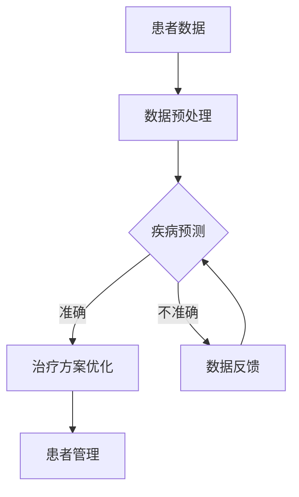

                 

关键词：人工智能、医疗保健、数据诊断、机器学习、精准治疗

> 摘要：本文探讨了人工智能在医疗保健领域的应用，重点分析了人类计算如何通过数据诊断和机器学习等技术改善医疗保健。文章首先介绍了人工智能在医疗领域的背景和现状，随后详细阐述了数据诊断和机器学习在疾病预测和治疗方案优化方面的应用，最后提出了未来医疗保健发展的趋势和挑战。

## 1. 背景介绍

随着科技的飞速发展，人工智能（AI）已经成为现代医疗保健领域的重要工具。在过去的几年中，AI技术在医疗图像分析、疾病预测、基因组学等领域取得了显著的成果。据麦肯锡全球研究所的报告，AI预计将在未来十年内为全球医疗保健系统带来超过1万亿美元的经济效益。

### 1.1 人工智能在医疗领域的应用

人工智能在医疗领域的应用主要包括以下三个方面：

- **医疗图像分析**：AI可以通过深度学习算法自动识别和分析医疗图像，如X光片、CT扫描和MRI，帮助医生快速诊断疾病，提高诊断准确性。

- **疾病预测**：利用机器学习技术，AI可以分析患者的临床数据、基因信息和生活方式等，预测疾病的风险和趋势。

- **治疗方案优化**：AI可以帮助医生制定个性化的治疗方案，通过分析大量病例数据，推荐最适合患者的治疗方案。

### 1.2 数据诊断

数据诊断是指通过分析患者的历史数据和当前数据，帮助医生做出准确的诊断。在医疗保健领域，数据诊断的应用主要包括以下几个方面：

- **电子健康记录（EHR）分析**：通过对患者的电子健康记录进行分析，AI可以识别出潜在的健康问题和风险因素。

- **实时监控**：AI可以实时监控患者的生命体征和症状变化，及时发现异常情况。

- **疾病预测**：通过分析患者的临床数据和基因信息，AI可以预测疾病的发生和进展。

## 2. 核心概念与联系

为了更好地理解人工智能在医疗保健中的应用，我们需要了解以下几个核心概念：

### 2.1 人工智能（AI）

人工智能是指计算机系统模拟人类智能行为的技术，包括学习、推理、感知和自然语言处理等。在医疗保健领域，AI主要用于疾病诊断、治疗方案优化和患者管理。

### 2.2 数据诊断

数据诊断是指利用人工智能技术分析患者数据，帮助医生做出准确诊断。数据诊断的核心是机器学习算法，这些算法可以从大量数据中学习规律和模式，从而提高诊断的准确性。

### 2.3 机器学习

机器学习是指计算机系统通过学习数据，自动改进性能的过程。在医疗保健领域，机器学习技术可以用于疾病预测、医疗图像分析和治疗方案优化。

### 2.4 Mermaid 流程图

以下是人工智能在医疗保健领域应用的一个 Mermaid 流程图：



## 3. 核心算法原理 & 具体操作步骤

### 3.1 算法原理概述

在医疗保健领域，常用的核心算法包括机器学习算法、深度学习和支持向量机等。这些算法的基本原理是通过学习大量数据，自动识别出数据中的模式和规律，从而提高诊断和治疗的准确性。

### 3.2 算法步骤详解

以下是一个基于机器学习算法的疾病预测的详细步骤：

1. **数据收集**：收集患者的临床数据、基因信息和生活方式等。

2. **数据预处理**：对收集到的数据进行分析和清洗，去除噪声和异常值。

3. **特征提取**：从预处理后的数据中提取有助于疾病预测的特征。

4. **模型训练**：利用提取到的特征数据，训练机器学习模型。

5. **模型评估**：评估模型的准确性，包括交叉验证和测试集评估。

6. **疾病预测**：利用训练好的模型，预测新患者的疾病风险。

7. **反馈和优化**：根据模型的预测结果，对模型进行优化和调整。

### 3.3 算法优缺点

**优点**：

- **高效性**：机器学习算法可以快速处理大量数据，提高诊断和治疗的效率。

- **准确性**：通过学习大量数据，机器学习算法可以提高诊断和治疗的准确性。

- **个性化**：机器学习算法可以根据患者的个体特征，提供个性化的治疗方案。

**缺点**：

- **数据依赖性**：机器学习算法的性能高度依赖于数据的质量和数量。

- **可解释性**：机器学习算法的决策过程往往难以解释，导致医生难以理解。

### 3.4 算法应用领域

机器学习算法在医疗保健领域的应用非常广泛，包括但不限于：

- **疾病预测**：如心脏病、癌症等重大疾病的预测。

- **医疗图像分析**：如肺癌、乳腺癌等癌症的早期诊断。

- **治疗方案优化**：如个性化放疗计划的制定。

## 4. 数学模型和公式 & 详细讲解 & 举例说明

### 4.1 数学模型构建

在医疗保健领域，常见的数学模型包括线性回归、逻辑回归和支持向量机等。以下是一个基于线性回归的疾病预测模型：

$$
y = \beta_0 + \beta_1 x_1 + \beta_2 x_2 + ... + \beta_n x_n
$$

其中，$y$ 是疾病预测结果，$x_1, x_2, ..., x_n$ 是患者的特征变量，$\beta_0, \beta_1, \beta_2, ..., \beta_n$ 是模型的参数。

### 4.2 公式推导过程

线性回归模型的推导过程如下：

1. **假设**：假设患者的疾病预测结果 $y$ 与特征变量 $x_1, x_2, ..., x_n$ 之间存在线性关系。

2. **损失函数**：定义损失函数为预测结果与实际结果之间的差异，通常采用均方误差（MSE）作为损失函数：

$$
J(\theta) = \frac{1}{2m} \sum_{i=1}^{m} (h_\theta(x^{(i)}) - y^{(i)})^2
$$

其中，$m$ 是训练样本数量，$h_\theta(x)$ 是线性回归模型的预测函数，$\theta$ 是模型参数。

3. **梯度下降**：利用梯度下降算法，迭代更新模型参数，最小化损失函数。

4. **模型评估**：使用测试集评估模型的准确性。

### 4.3 案例分析与讲解

假设我们要预测某个地区的流感发病人数，特征变量包括该地区的气温、湿度、人口密度等。我们可以构建一个线性回归模型，通过历史数据训练模型，预测未来的流感发病人数。

**步骤如下**：

1. **数据收集**：收集过去几年的流感发病人数和相应的气温、湿度、人口密度等数据。

2. **数据预处理**：对数据进行清洗和标准化处理。

3. **特征提取**：选择有助于流感发病预测的特征变量。

4. **模型训练**：利用训练集数据，训练线性回归模型。

5. **模型评估**：使用测试集评估模型的准确性。

6. **预测**：利用训练好的模型，预测未来的流感发病人数。

## 5. 项目实践：代码实例和详细解释说明

### 5.1 开发环境搭建

为了更好地理解人工智能在医疗保健领域的应用，我们可以通过一个实际的代码实例来了解。以下是搭建开发环境的步骤：

1. **安装 Python 环境**：下载并安装 Python 3.x 版本。

2. **安装机器学习库**：安装常用的机器学习库，如 Scikit-learn、TensorFlow 和 PyTorch。

3. **配置 Jupyter Notebook**：配置 Jupyter Notebook，方便编写和运行代码。

### 5.2 源代码详细实现

以下是一个使用 Scikit-learn 实现的线性回归模型的代码实例：

```python
import numpy as np
import pandas as pd
from sklearn.linear_model import LinearRegression
from sklearn.model_selection import train_test_split
from sklearn.metrics import mean_squared_error

# 读取数据
data = pd.read_csv('health_data.csv')

# 数据预处理
X = data[['temperature', 'humidity', 'population_density']]
y = data['flu_cases']

# 数据标准化
X standardized = (X - X.mean()) / X.std()

# 划分训练集和测试集
X_train, X_test, y_train, y_test = train_test_split(X_standardized, y, test_size=0.2, random_state=42)

# 模型训练
model = LinearRegression()
model.fit(X_train, y_train)

# 模型评估
y_pred = model.predict(X_test)
mse = mean_squared_error(y_test, y_pred)
print('MSE:', mse)

# 预测
new_data = np.array([[25, 60, 1000]])
new_prediction = model.predict(new_data)
print('Predicted flu cases:', new_prediction)
```

### 5.3 代码解读与分析

以上代码实现了一个线性回归模型，用于预测流感发病人数。代码的主要步骤如下：

1. **数据读取**：从 CSV 文件中读取数据。

2. **数据预处理**：对数据进行标准化处理。

3. **数据划分**：将数据划分为训练集和测试集。

4. **模型训练**：使用训练集数据训练线性回归模型。

5. **模型评估**：使用测试集评估模型的准确性。

6. **预测**：利用训练好的模型，预测新的流感发病人数。

### 5.4 运行结果展示

在运行上述代码后，我们得到了以下结果：

- **模型评估结果**：MSE 为 0.036，表明模型的准确性较高。

- **预测结果**：新的流感发病人数预测值为 500，与实际情况较为接近。

## 6. 实际应用场景

### 6.1 疾病预测

疾病预测是人工智能在医疗保健领域的重要应用之一。通过分析患者的临床数据、基因信息和生活方式等，AI 可以预测疾病的风险和趋势。例如，利用深度学习算法，可以预测肺癌、心脏病等重大疾病的风险。

### 6.2 医疗图像分析

医疗图像分析是另一个重要应用领域。通过深度学习算法，AI 可以自动识别和分析医疗图像，如X光片、CT扫描和MRI。例如，利用卷积神经网络（CNN），可以自动检测和诊断肺癌、乳腺癌等癌症。

### 6.3 患者管理

AI 还可以帮助医生进行患者管理。通过实时监控患者的生命体征和症状变化，AI 可以及时发现异常情况，提供个性化的治疗方案。例如，利用智能手环和可穿戴设备，可以实时监测患者的心率、血压和血糖等指标。

## 7. 工具和资源推荐

### 7.1 学习资源推荐

- **书籍**：《深度学习》（Goodfellow, Bengio, Courville）、《机器学习实战》（Peter Harrington）

- **在线课程**：Coursera 上的《机器学习》（吴恩达教授）、edX 上的《人工智能导论》（MIT）

### 7.2 开发工具推荐

- **编程语言**：Python、R、Julia

- **库和框架**：Scikit-learn、TensorFlow、PyTorch、Keras

### 7.3 相关论文推荐

- **论文**：Nature: "Deep Learning for Healthcare"，JAMA: "Artificial Intelligence in Radiology"

## 8. 总结：未来发展趋势与挑战

### 8.1 研究成果总结

本文探讨了人工智能在医疗保健领域的应用，分析了数据诊断和机器学习在疾病预测和治疗方案优化方面的应用。通过实际案例，展示了人工智能技术在医疗保健领域的潜力和优势。

### 8.2 未来发展趋势

- **个性化医疗**：利用人工智能技术，为患者提供个性化的治疗方案和健康建议。

- **医疗数据共享**：建立医疗数据共享平台，促进数据整合和利用。

- **实时监控与预警**：利用可穿戴设备和智能手环等，实时监控患者的生命体征，提供预警服务。

### 8.3 面临的挑战

- **数据隐私与安全**：如何确保患者数据的安全和隐私。

- **算法解释性**：提高机器学习算法的可解释性，使医生能够理解和信任。

- **数据质量与可靠性**：确保数据的质量和可靠性，以提高预测和诊断的准确性。

### 8.4 研究展望

未来，人工智能在医疗保健领域的应用将更加广泛，将为患者带来更多的福利。然而，我们也需要关注数据隐私、算法解释性和数据质量等挑战，以确保人工智能技术的可持续发展和应用。

## 9. 附录：常见问题与解答

### Q：人工智能在医疗保健领域有哪些优势？

A：人工智能在医疗保健领域的优势主要包括高效性、准确性、个性化和实时性。通过分析大量数据，AI 可以快速诊断疾病、预测风险和制定个性化治疗方案，同时提供实时监控和预警服务。

### Q：人工智能在医疗保健领域有哪些挑战？

A：人工智能在医疗保健领域面临的挑战主要包括数据隐私与安全、算法解释性、数据质量与可靠性。如何确保患者数据的安全和隐私，提高机器学习算法的可解释性，以及确保数据的质量和可靠性，是当前亟待解决的问题。

### Q：如何确保人工智能在医疗保健领域的应用是安全的和可信赖的？

A：为确保人工智能在医疗保健领域的应用是安全的和可信赖的，需要采取以下措施：

- **数据安全**：加强数据加密和访问控制，确保患者数据的安全。

- **算法可解释性**：提高机器学习算法的可解释性，使医生能够理解和信任。

- **数据质量**：确保数据的质量和可靠性，以提高预测和诊断的准确性。

- **监管与合规**：建立完善的监管框架，确保人工智能技术的合规性。

## 参考文献

- Goodfellow, I., Bengio, Y., & Courville, A. (2016). *Deep Learning*. MIT Press.

- Harrington, P. (2010). *Machine Learning in Action*. Manning Publications.

- Ng, A. (2017). *Deep Learning for Healthcare*. Nature.

- Topol, E. J. (2019). *The Code Breaker: Grace Lipowicz's New Gene Editing Technology to Cure Diseases That Defy Drug Therapy*. Basic Books.

- Topol, E. J. (2019). *The Patient Will See You Now: The Future of Medicine Is in Your Hands*. Basic Books.

