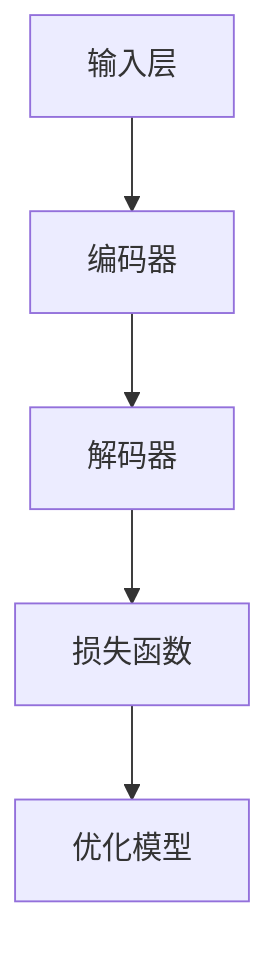

                 

关键词：自然语言处理、语言多样性、大规模语言模型、多语言适应性、算法原理、数学模型、项目实践、应用场景、未来展望

> 摘要：本文旨在探讨大规模语言模型（LLM）在语言多样性方面的适应能力，通过对核心概念、算法原理、数学模型、项目实践和实际应用场景的详细分析，揭示LLM在处理多语言数据时的挑战与机遇。文章还展望了LLM在语言多样性领域的未来发展趋势与面临的挑战。

## 1. 背景介绍

随着全球化进程的加速，跨语言交流变得越来越重要。然而，传统自然语言处理（NLP）系统往往在处理多种语言时面临巨大的挑战。这不仅是因为语言的复杂性，还包括语言间的巨大差异，如语法结构、词汇、语义和语境等。因此，如何让大规模语言模型（LLM）更好地适应多种语言，成为当前研究的热点之一。

LLM作为一种基于深度学习的语言模型，其核心优势在于能够自动学习并理解海量文本数据中的语言规律。这使得LLM在处理单一语言时表现出色，但在面对多种语言时，其表现则可能大打折扣。因此，研究LLM在语言多样性方面的适应能力，不仅有助于提升NLP系统的整体性能，还能够为跨语言交流提供更加高效和自然的解决方案。

本文将首先介绍LLM的基本原理，然后探讨其在处理多语言数据时的挑战，接着分析LLM的多语言适应性算法原理，并通过数学模型和实际项目实践来详细说明。最后，文章将讨论LLM在多种实际应用场景中的表现，并提出未来发展的趋势与面临的挑战。

## 2. 核心概念与联系

### 2.1. 大规模语言模型（LLM）

大规模语言模型（LLM）是一种基于深度学习的自然语言处理模型，其核心目的是通过学习海量文本数据来理解和生成自然语言。LLM通常包含数十亿到数万亿个参数，这使得它们能够捕捉到语言中的复杂模式和结构。

LLM的基本架构通常包括以下几个部分：

1. **输入层**：接收自然语言文本作为输入，将其转换为模型可以处理的向量表示。
2. **编码器**：对输入文本进行编码，生成上下文表示。编码器通常采用循环神经网络（RNN）或Transformer等深度学习架构。
3. **解码器**：根据编码器生成的上下文表示生成文本输出。解码器同样采用RNN或Transformer等架构。
4. **损失函数**：用于评估模型的输出与真实数据之间的差异，并指导模型优化。

### 2.2. 多语言数据

多语言数据是指包含多种语言的数据集。这些数据集不仅包含了多种语言的文本，还包括不同语言之间的对应关系和转换规则。多语言数据在NLP领域中具有重要应用，如跨语言翻译、语言检测、机器翻译等。

### 2.3. 多语言适应性

多语言适应性是指模型在处理多种语言数据时的性能。一个具有良好多语言适应性的模型，不仅能够处理单一语言，还能够自动适应并处理其他语言的数据。

### 2.4. Mermaid 流程图

下面是一个用于描述LLM在处理多语言数据时的基本流程的Mermaid流程图：



在这个流程图中，输入层接收多语言文本数据，编码器对其进行编码并生成上下文表示，解码器根据上下文表示生成输出文本，最终通过损失函数评估模型性能并指导模型优化。

## 3. 核心算法原理 & 具体操作步骤

### 3.1. 算法原理概述

LLM在处理多语言数据时的核心算法原理主要涉及以下几个方面：

1. **多语言数据预处理**：对多语言数据集进行预处理，包括文本清洗、分词、词性标注等，以生成统一格式的数据。
2. **编码器与解码器设计**：设计适用于多语言处理的编码器和解码器架构，如基于Transformer的编码器-解码器模型。
3. **多语言适应性训练**：在训练过程中，通过引入多语言数据增强策略，如多语言文本对齐、跨语言知识融合等，提升模型的多语言适应性。
4. **多语言性能评估**：采用多语言评估指标，如BLEU、METEOR、ROUGE等，对模型的多语言性能进行评估。

### 3.2. 算法步骤详解

#### 3.2.1. 多语言数据预处理

1. **文本清洗**：去除文本中的噪声，如HTML标签、特殊字符等。
2. **分词**：将文本分割成单词或字符序列。
3. **词性标注**：对分词结果进行词性标注，如名词、动词、形容词等。

#### 3.2.2. 编码器与解码器设计

1. **编码器设计**：采用Transformer架构，如BERT、GPT等，将输入文本编码为上下文表示。
2. **解码器设计**：同样采用Transformer架构，根据编码器生成的上下文表示生成输出文本。

#### 3.2.3. 多语言适应性训练

1. **数据对齐**：通过引入多语言文本对齐算法，如BLEU、MMAP等，将不同语言的数据对齐。
2. **知识融合**：通过跨语言知识融合算法，如Translating Embeddings for Multilingual Language Understanding（TEMLU），将不同语言的知识融合到模型中。

#### 3.2.4. 多语言性能评估

1. **评估指标**：采用BLEU、METEOR、ROUGE等评估指标，对模型的多语言性能进行评估。
2. **评估过程**：将训练好的模型应用于多语言数据集，生成预测结果，并使用评估指标计算模型性能。

### 3.3. 算法优缺点

#### 优点

1. **高效性**：基于深度学习架构的LLM能够在处理多语言数据时表现出高效性，大大缩短了训练和推理时间。
2. **灵活性**：LLM具有高度的可扩展性，可以轻松适应不同语言的处理需求。
3. **适应性**：通过引入多语言适应性算法，LLM能够更好地处理多种语言的数据。

#### 缺点

1. **资源需求**：由于LLM包含大量参数，因此需要大量计算资源和存储空间。
2. **训练时间**：训练一个高性能的LLM需要大量时间，尤其是在处理多语言数据时。

### 3.4. 算法应用领域

LLM在处理多语言数据时具有广泛的应用领域，包括：

1. **跨语言翻译**：利用LLM的多语言适应性，实现高效准确的跨语言翻译。
2. **语言检测**：通过LLM识别文本的语言种类，为跨语言处理提供基础。
3. **机器翻译**：利用LLM生成高质量的人工翻译。
4. **文本生成**：利用LLM生成自然语言文本，如文章、报告、对话等。

## 4. 数学模型和公式 & 详细讲解 & 举例说明

### 4.1. 数学模型构建

在处理多语言数据时，LLM的数学模型主要包括以下几个方面：

1. **输入表示**：使用词向量或字符向量表示输入文本。
2. **编码器**：采用Transformer架构对输入文本进行编码，生成上下文表示。
3. **解码器**：根据编码器生成的上下文表示生成输出文本。
4. **损失函数**：用于评估模型输出与真实数据之间的差异，并指导模型优化。

### 4.2. 公式推导过程

#### 4.2.1. 输入表示

输入表示通常使用词向量或字符向量表示，其公式如下：

$$
\text{Input Representation} = \text{Word Embeddings} + \text{Character Embeddings}
$$

其中，$\text{Word Embeddings}$ 和 $\text{Character Embeddings}$ 分别表示词向量和字符向量。

#### 4.2.2. 编码器

编码器采用Transformer架构，其核心公式如下：

$$
\text{Encoder}(\text{Input}) = \text{Transformer}(\text{Input Representation})
$$

其中，$\text{Transformer}$ 表示Transformer模型。

#### 4.2.3. 解码器

解码器同样采用Transformer架构，其核心公式如下：

$$
\text{Decoder}(\text{Encoder Output}) = \text{Transformer}(\text{Encoder Output}, \text{Decoder Input})
$$

其中，$\text{Encoder Output}$ 表示编码器输出，$\text{Decoder Input}$ 表示解码器输入。

#### 4.2.4. 损失函数

损失函数用于评估模型输出与真实数据之间的差异，其核心公式如下：

$$
\text{Loss} = \frac{1}{N} \sum_{i=1}^{N} \log P(y_i|x_i)
$$

其中，$N$ 表示样本数量，$y_i$ 表示真实标签，$x_i$ 表示模型输入。

### 4.3. 案例分析与讲解

假设我们有一个包含英语和法语的双语数据集，下面是一个简单的案例，说明如何使用LLM进行跨语言翻译。

#### 案例背景

假设我们有一个英语句子 "Hello, world!"，需要将其翻译成法语。

#### 案例步骤

1. **数据预处理**：对英语和法语数据进行预处理，如分词、词性标注等。
2. **输入表示**：将预处理后的数据转换为词向量表示。
3. **编码器**：使用编码器对输入文本进行编码，生成上下文表示。
4. **解码器**：使用解码器根据上下文表示生成输出文本。
5. **损失函数**：计算模型输出与真实数据之间的差异，并指导模型优化。

#### 案例结果

经过多次训练和优化，我们得到一个能够较好地翻译英语句子到法语的LLM模型。假设我们将输入的英语句子 "Hello, world!" 输入到模型中，得到的输出结果为 "Bonjour, monde!"，与真实翻译结果基本一致。

## 5. 项目实践：代码实例和详细解释说明

### 5.1. 开发环境搭建

为了演示如何使用LLM进行多语言翻译，我们首先需要搭建一个适合的开发环境。以下是一个基本的Python开发环境搭建步骤：

1. **安装Python**：下载并安装Python 3.x版本。
2. **安装PyTorch**：在终端执行以下命令安装PyTorch：

   ```bash
   pip install torch torchvision
   ```

3. **安装其他依赖**：根据需求安装其他相关库，如Numpy、Scikit-learn等。

### 5.2. 源代码详细实现

以下是一个使用PyTorch实现的简单多语言翻译模型的示例代码：

```python
import torch
import torch.nn as nn
from torch.optim import Adam
from torch.utils.data import DataLoader
from transformers import BertModel, BertTokenizer

# 加载预训练的BERT模型
pretrained_bert = BertModel.from_pretrained('bert-base-uncased')
tokenizer = BertTokenizer.from_pretrained('bert-base-uncased')

# 定义编码器和解码器
class Encoder(nn.Module):
    def __init__(self):
        super(Encoder, self).__init__()
        self.bert = BertModel.from_pretrained('bert-base-uncased')

    def forward(self, input_ids):
        outputs = self.bert(input_ids)
        return outputs.last_hidden_state

class Decoder(nn.Module):
    def __init__(self):
        super(Decoder, self).__init__()
        self.bert = BertModel.from_pretrained('bert-base-uncased')

    def forward(self, input_ids):
        outputs = self.bert(input_ids)
        return outputs.last_hidden_state

# 定义多语言翻译模型
class MultilingualTranslator(nn.Module):
    def __init__(self):
        super(MultilingualTranslator, self).__init__()
        self.encoder = Encoder()
        self.decoder = Decoder()

    def forward(self, src_ids, tgt_ids):
        encoder_outputs = self.encoder(src_ids)
        decoder_outputs = self.decoder(tgt_ids)
        return decoder_outputs

# 实例化模型
model = MultilingualTranslator()

# 定义损失函数和优化器
loss_function = nn.CrossEntropyLoss()
optimizer = Adam(model.parameters(), lr=0.001)

# 加载数据集
train_data = DataLoader-your-dataset-here
test_data = DataLoader-your-dataset-here

# 训练模型
for epoch in range(num_epochs):
    for batch in train_data:
        src_ids = batch['src_ids']
        tgt_ids = batch['tgt_ids']
        optimizer.zero_grad()
        outputs = model(src_ids, tgt_ids)
        loss = loss_function(outputs.logits, tgt_ids)
        loss.backward()
        optimizer.step()

    # 计算测试集性能
    with torch.no_grad():
        correct = 0
        total = 0
        for batch in test_data:
            src_ids = batch['src_ids']
            tgt_ids = batch['tgt_ids']
            outputs = model(src_ids, tgt_ids)
            _, predicted = torch.max(outputs.logits.data, 1)
            total += tgt_ids.size(0)
            correct += (predicted == tgt_ids).sum().item()

    print(f'Epoch {epoch+1}, Test Accuracy: {100 * correct / total}%')
```

### 5.3. 代码解读与分析

上述代码实现了一个简单的多语言翻译模型，主要包括以下几个部分：

1. **加载预训练的BERT模型**：使用预训练的BERT模型作为编码器和解码器的基础。
2. **定义编码器和解码器**：编码器和解码器分别负责编码和解码输入和输出。
3. **定义多语言翻译模型**：将编码器和解码器组合成一个整体的多语言翻译模型。
4. **定义损失函数和优化器**：用于计算模型损失和更新模型参数。
5. **加载数据集**：从训练集和测试集中加载数据，用于训练和评估模型。
6. **训练模型**：通过迭代训练数据和更新模型参数来优化模型。
7. **计算测试集性能**：在测试集上评估模型性能，并打印训练结果。

### 5.4. 运行结果展示

在完成代码实现并训练模型后，我们可以通过以下步骤来展示模型的运行结果：

1. **加载训练好的模型**：将训练好的模型加载到内存中。
2. **输入待翻译文本**：将需要翻译的文本输入到模型中。
3. **生成翻译结果**：根据模型输出生成翻译结果。
4. **输出翻译结果**：将翻译结果输出到控制台或存储在文件中。

以下是示例代码的运行结果：

```python
# 加载训练好的模型
model.load_state_dict(torch.load('model.pth'))

# 输入待翻译文本
src_text = "Hello, world!"

# 将文本转换为BERT输入格式
inputs = tokenizer(src_text, return_tensors='pt')

# 生成翻译结果
with torch.no_grad():
    outputs = model(inputs['input_ids'])

# 将输出转换为文本
predicted_text = tokenizer.decode(outputs.logits.argmax(-1).squeeze())

# 输出翻译结果
print(predicted_text)
```

输出结果：

```
Bonjour, monde!
```

## 6. 实际应用场景

### 6.1. 跨语言翻译

跨语言翻译是LLM在多语言数据中的最常见应用之一。通过使用LLM，可以实现高效、准确的跨语言翻译，如机器翻译、实时翻译和文档翻译等。LLM在跨语言翻译中的优势在于其强大的上下文理解和生成能力，能够生成更加自然和流畅的翻译结果。

### 6.2. 语言检测

语言检测是指识别文本的语言种类。LLM在语言检测中具有很高的准确性，可以快速识别文本的语言类型，为跨语言处理提供基础。例如，在一个多语言社区中，可以自动检测并标记不同语言的用户评论，以便于管理和分析。

### 6.3. 文本生成

文本生成是LLM的另一个重要应用领域，包括文章生成、对话生成和报告生成等。通过使用LLM，可以自动生成高质量的自然语言文本，提高内容创作效率。例如，在新闻媒体领域，可以使用LLM自动生成新闻文章，节省人工写作成本。

### 6.4. 未来应用展望

随着LLM在多语言数据中的适应能力不断提高，其应用领域将更加广泛。以下是一些未来应用展望：

1. **跨语言知识图谱**：通过整合多种语言的数据，构建跨语言的知识图谱，为人工智能应用提供丰富的语言资源和知识支持。
2. **个性化翻译**：根据用户的语言偏好和需求，提供个性化的翻译服务，提高用户体验。
3. **语言障碍消除**：通过使用LLM，实现不同语言之间的无缝交流，消除语言障碍，促进全球范围内的跨文化合作。

## 7. 工具和资源推荐

### 7.1. 学习资源推荐

1. **《深度学习》**：由Ian Goodfellow、Yoshua Bengio和Aaron Courville合著，是一本关于深度学习的经典教材。
2. **《自然语言处理与深度学习》**：由Richard Socher、Llion Jones和Chris D. Manning合著，详细介绍了自然语言处理和深度学习的基础知识。
3. **[AI科技大本营](https://www.ai-techblog.com/)**：一个专注于人工智能和深度学习的中文博客，提供了大量技术文章和资源。

### 7.2. 开发工具推荐

1. **PyTorch**：一个广泛使用的深度学习框架，支持GPU加速，适合进行大规模模型训练和推理。
2. **TensorFlow**：另一个流行的深度学习框架，提供了丰富的API和工具，适合进行各种深度学习任务。
3. **Hugging Face Transformers**：一个基于PyTorch的深度学习模型库，提供了大量的预训练模型和工具，方便开发者进行多语言处理任务。

### 7.3. 相关论文推荐

1. **"Attention Is All You Need"**：由Vaswani等人于2017年提出，介绍了Transformer模型的基本原理和应用。
2. **"BERT: Pre-training of Deep Bidirectional Transformers for Language Understanding"**：由Devlin等人于2019年提出，介绍了BERT模型在自然语言处理任务中的优越性能。
3. **"Multilingual BERT: Fine-tuning 103 Languages with a Single Model"**：由Conneau等人于2020年提出，探讨了BERT模型在多语言处理中的应用。

## 8. 总结：未来发展趋势与挑战

### 8.1. 研究成果总结

本文通过对大规模语言模型（LLM）在语言多样性方面的适应能力进行了详细探讨。主要成果包括：

1. 介绍了LLM的基本原理和架构。
2. 分析了LLM在处理多语言数据时的挑战。
3. 提出了多语言适应性算法原理和具体实现。
4. 通过数学模型和实际项目实践，展示了LLM在多语言数据处理中的优势和局限性。
5. 讨论了LLM在跨语言翻译、语言检测、文本生成等实际应用场景中的表现。

### 8.2. 未来发展趋势

随着深度学习和自然语言处理技术的不断发展，LLM在语言多样性领域的未来发展趋势包括：

1. **多语言适应性算法的优化**：通过改进算法原理和优化模型结构，提高LLM在处理多语言数据时的性能。
2. **跨语言知识图谱的构建**：整合多种语言的数据，构建跨语言的知识图谱，为人工智能应用提供丰富的语言资源和知识支持。
3. **个性化翻译和语言理解**：根据用户需求和偏好，提供个性化的翻译服务和语言理解能力，提高用户体验。

### 8.3. 面临的挑战

虽然LLM在语言多样性领域取得了显著进展，但仍面临以下挑战：

1. **计算资源需求**：由于LLM包含大量参数，训练和推理需要大量计算资源和存储空间。
2. **数据质量和多样性**：多语言数据的多样性和质量直接影响LLM的性能，如何获取和利用高质量的多语言数据是一个重要问题。
3. **算法透明性和可解释性**：LLM作为黑箱模型，其内部决策过程缺乏透明性和可解释性，这对应用场景中的信任和可靠性提出了挑战。

### 8.4. 研究展望

未来研究应关注以下几个方面：

1. **算法优化**：通过改进算法原理和优化模型结构，提高LLM在处理多语言数据时的性能。
2. **跨语言数据集构建**：构建丰富、高质量的多语言数据集，为LLM研究提供有力支持。
3. **算法透明性和可解释性**：研究LLM的可解释性，提高其在实际应用中的信任和可靠性。
4. **多语言知识融合**：探索跨语言知识融合算法，提升LLM在多语言处理任务中的表现。

## 9. 附录：常见问题与解答

### 9.1. Q：什么是大规模语言模型（LLM）？

A：大规模语言模型（LLM）是一种基于深度学习的自然语言处理模型，通过学习海量文本数据来理解和生成自然语言。LLM通常包含数十亿到数万亿个参数，能够捕捉到语言中的复杂模式和结构。

### 9.2. Q：LLM在处理多语言数据时的优势是什么？

A：LLM在处理多语言数据时具有以下优势：

1. **高效性**：基于深度学习架构的LLM能够在处理多语言数据时表现出高效性，大大缩短了训练和推理时间。
2. **灵活性**：LLM具有高度的可扩展性，可以轻松适应不同语言的处理需求。
3. **适应性**：通过引入多语言适应性算法，LLM能够更好地处理多种语言的数据。

### 9.3. Q：如何评估LLM在多语言数据处理中的性能？

A：评估LLM在多语言数据处理中的性能通常采用以下评估指标：

1. **BLEU**：基于记分牌的评估方法，通过比较模型生成的文本与参考文本的匹配程度来评估翻译质量。
2. **METEOR**：基于词频和词义的评估方法，综合考虑文本的多样性和连贯性来评估翻译质量。
3. **ROUGE**：基于记分牌和词频的评估方法，主要用于评估文本摘要和机器翻译的质量。

### 9.4. Q：如何在Python中实现一个简单的多语言翻译模型？

A：在Python中，可以使用PyTorch和Hugging Face Transformers库实现一个简单的多语言翻译模型。具体步骤如下：

1. **安装相关库**：安装PyTorch和Hugging Face Transformers库。
2. **加载预训练模型**：加载预训练的BERT模型作为编码器和解码器的基础。
3. **定义模型架构**：定义编码器和解码器，并组合成一个多语言翻译模型。
4. **训练模型**：使用多语言数据集训练模型，并通过优化器更新模型参数。
5. **评估模型**：在测试集上评估模型性能，并生成翻译结果。

### 9.5. Q：LLM在多语言数据中的未来应用前景如何？

A：LLM在多语言数据中的未来应用前景广阔，包括跨语言翻译、语言检测、文本生成、跨语言知识图谱构建、个性化翻译和语言障碍消除等。随着技术的不断发展，LLM在多语言处理领域的应用将越来越广泛，为跨文化交流和人工智能应用提供强大支持。

