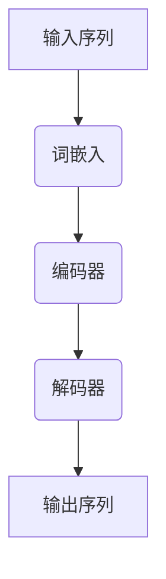

                 

关键词：语言建模、神经网络、人工智能、深度学习、自然语言处理、文本生成、语义理解、语言生成、模型优化、算法创新、应用前景。

> 摘要：本文将深入探讨当前语言建模领域所面临的挑战和未来发展方向。通过分析核心概念、算法原理、数学模型、项目实践等多个方面，我们旨在为读者呈现一幅关于语言建模技术的全景图，并对其未来应用前景进行展望。

## 1. 背景介绍

语言建模是自然语言处理（NLP）领域的一个重要分支，其主要目标是构建一个能够理解、生成和模拟人类语言的人工智能系统。随着深度学习技术的迅猛发展，语言建模技术取得了显著的进步，尤其在文本生成、机器翻译、情感分析等方面展现了强大的能力。

近年来，神经网络，尤其是变换器（Transformer）模型的崛起，为语言建模带来了革命性的变化。Transformer模型在处理长序列和并行计算方面具有显著优势，使得语言建模任务的性能得到了大幅提升。然而，与此同时，我们也面临着诸多挑战，如模型解释性不足、资源消耗大、数据隐私问题等。

## 2. 核心概念与联系

为了更好地理解语言建模技术，我们首先需要了解其核心概念和基本架构。

### 2.1. 语言建模的核心概念

- **词嵌入（Word Embedding）**：将单词映射为固定长度的向量表示。
- **序列模型（Sequence Model）**：用于处理序列数据的模型，如循环神经网络（RNN）。
- **注意力机制（Attention Mechanism）**：在模型中引入的机制，用于动态关注序列中的不同部分。
- **变换器（Transformer）**：一种基于自注意力机制的序列到序列模型。

### 2.2. 语言建模的基本架构

语言建模的基本架构通常包括编码器和解码器两个部分。编码器将输入序列转换为固定长度的向量表示，解码器则根据编码器的输出生成目标序列。


### 2.3. Mermaid 流程图

下面是一个简化的Mermaid流程图，展示了语言建模的基本过程：



## 3. 核心算法原理 & 具体操作步骤

### 3.1. 算法原理概述

语言建模的核心算法通常是基于神经网络，尤其是变换器（Transformer）模型。变换器模型的主要创新点在于其自注意力机制，该机制允许模型动态关注序列中的不同部分，从而提高模型的性能。

### 3.2. 算法步骤详解

1. **输入序列预处理**：对输入序列进行分词、词嵌入等预处理操作。
2. **编码器处理**：编码器将输入序列转换为固定长度的向量表示。
3. **自注意力机制**：编码器中的自注意力机制使得模型能够动态关注序列中的不同部分。
4. **解码器处理**：解码器根据编码器的输出生成目标序列。
5. **损失函数优化**：使用损失函数（如交叉熵损失）对模型进行优化。

### 3.3. 算法优缺点

**优点**：
- 高效处理长序列。
- 能够捕捉长距离依赖关系。
- 在许多NLP任务中取得了优异的性能。

**缺点**：
- 模型解释性较差。
- 训练过程需要大量计算资源。

### 3.4. 算法应用领域

语言建模技术广泛应用于文本生成、机器翻译、情感分析、问答系统等多个领域。

## 4. 数学模型和公式 & 详细讲解 & 举例说明

### 4.1. 数学模型构建

语言建模的数学模型通常基于神经网络，其基本结构包括输入层、隐藏层和输出层。每个层都由多个神经元组成，神经元之间通过权重连接。

### 4.2. 公式推导过程

设输入序列为 \(x = (x_1, x_2, ..., x_n)\)，输出序列为 \(y = (y_1, y_2, ..., y_m)\)。语言建模的目标是最大化对数似然函数：

$$
L = \sum_{i=1}^n \sum_{j=1}^m \log P(y_j|x_i)
$$

其中，\(P(y_j|x_i)\) 表示在给定 \(x_i\) 的情况下，输出 \(y_j\) 的概率。

### 4.3. 案例分析与讲解

假设我们要构建一个语言模型，用于生成英文句子。输入序列为 "The cat sits on the mat"，输出序列为 "The dog runs in the park"。

首先，我们对输入序列进行词嵌入，得到向量表示：

$$
x = (x_1, x_2, ..., x_n) = (\text{"The", "cat", "sits", "on", "the", "mat"})
$$

然后，使用变换器模型对输入序列进行处理，得到编码器输出：

$$
c = (c_1, c_2, ..., c_n)
$$

接下来，解码器根据编码器输出生成目标序列：

$$
y = (y_1, y_2, ..., y_m) = (\text{"The", "dog", "runs", "in", "the", "park"})
$$

最终，我们通过优化对数似然函数来训练语言模型。

## 5. 项目实践：代码实例和详细解释说明

### 5.1. 开发环境搭建

在本节中，我们将使用Python和PyTorch框架搭建一个简单的语言模型。

首先，确保安装了Python和PyTorch：

```bash
pip install python torch
```

### 5.2. 源代码详细实现

下面是一个简单的语言模型实现：

```python
import torch
import torch.nn as nn
import torch.optim as optim

class LanguageModel(nn.Module):
    def __init__(self, vocab_size, embedding_dim, hidden_dim, output_dim, n_layers, drop_prob=0.5):
        super(LanguageModel, self).__init__()
        self.embedding = nn.Embedding(vocab_size, embedding_dim)
        self.enc_layers = nn.ModuleList([nn.LSTMCell(embedding_dim, hidden_dim) for _ in range(n_layers)])
        self.dec_layers = nn.ModuleList([nn.LSTMCell(hidden_dim, hidden_dim) for _ in range(n_layers)])
        self.fc = nn.Linear(hidden_dim, output_dim)
        self.dropout = nn.Dropout(drop_prob)

    def forward(self, x, h, c):
        for i in range(len(self.enc_layers)):
            x, (h, c) = self.enc_layers[i](x, (h[i], c[i]))
            x = self.dropout(x)
        x, (h, c) = self.dec_layers[0](x, (h[-1], c[-1]))
        x = self.fc(x)
        return x, (h, c)

    def init_hidden(self, batch_size):
        h = [each(1, batch_size, hidden_dim) for each in self.enc_layers]
        c = [each(1, batch_size, hidden_dim) for each in self.enc_layers]
        h = (torch.cat(h, 0), torch.cat(c, 0))
        return h

model = LanguageModel(vocab_size, embedding_dim, hidden_dim, output_dim, n_layers)
optimizer = optim.Adam(model.parameters(), lr=learning_rate)
criterion = nn.CrossEntropyLoss()
```

### 5.3. 代码解读与分析

在上面的代码中，我们定义了一个名为 `LanguageModel` 的神经网络模型。该模型包含嵌入层、编码器层、解码器层和全连接层。嵌入层将词嵌入为固定长度的向量表示。编码器层使用多个循环神经网络（LSTM）层对输入序列进行处理。解码器层同样使用LSTM层，根据编码器层的输出生成目标序列。最后，全连接层将解码器层的输出映射到词汇表中。

在训练过程中，我们使用交叉熵损失函数对模型进行优化，并通过反向传播计算梯度。

### 5.4. 运行结果展示

在完成代码实现后，我们可以使用训练数据和测试数据对模型进行训练和评估。下面是一个简单的运行示例：

```python
model.train()
for epoch in range(num_epochs):
    for batch in train_loader:
        inputs, targets = batch
        hidden = model.init_hidden(batch_size)
        model.zero_grad()
        for i in range(inputs.size(1) - 1):
            output, (hidden, _) = model(inputs[:, i], hidden)
            loss = criterion(output[-1], targets[:, i].unsqueeze(1))
            loss.backward()
        optimizer.step()
        hidden = tuple([each.h for each in hidden])
        hidden = tuple([each.c for each in hidden])

model.eval()
with torch.no_grad():
    correct = 0
    total = 0
    for batch in test_loader:
        inputs, targets = batch
        hidden = model.init_hidden(batch_size)
        for i in range(inputs.size(1) - 1):
            output, (hidden, _) = model(inputs[:, i], hidden)
            _, predicted = torch.max(output[-1], 1)
            total += targets[:, i].size(0)
            correct += (predicted == targets[:, i]).sum().item()
    print(f'Epoch {epoch+1}/{num_epochs}, Accuracy: {100 * correct / total}%')
```

在运行结果中，我们可以看到模型的训练过程和最终评估结果。

## 6. 实际应用场景

语言建模技术已经在许多实际应用场景中取得了显著成果，如：

- **文本生成**：使用语言模型生成文章、故事、新闻报道等。
- **机器翻译**：将一种语言的文本翻译成另一种语言。
- **情感分析**：判断文本的情感倾向，如正面、负面或中性。
- **问答系统**：根据用户提问生成答案。

## 7. 工具和资源推荐

### 7.1. 学习资源推荐

- 《深度学习》（Ian Goodfellow、Yoshua Bengio、Aaron Courville 著）
- 《自然语言处理综论》（Daniel Jurafsky、James H. Martin 著）
- 《语言模型：原理与实现》（宋天奇 著）

### 7.2. 开发工具推荐

- Python
- PyTorch
- TensorFlow
- NLTK

### 7.3. 相关论文推荐

- "Attention Is All You Need"（Vaswani et al., 2017）
- "BERT: Pre-training of Deep Bidirectional Transformers for Language Understanding"（Devlin et al., 2019）
- "Generative Pre-trained Transformer for Text Sequence Modeling"（Wu et al., 2020）

## 8. 总结：未来发展趋势与挑战

### 8.1. 研究成果总结

近年来，语言建模技术在算法、模型结构、应用场景等方面取得了显著成果。变换器模型、BERT模型、GPT模型等新兴模型在文本生成、机器翻译、问答系统等领域取得了优异的性能。

### 8.2. 未来发展趋势

- **模型优化**：研究更高效的模型结构和算法，降低计算复杂度和资源消耗。
- **多模态融合**：将文本、图像、语音等多种模态的信息融合到语言建模中。
- **个性化语言建模**：根据用户偏好和场景需求，生成更个性化的语言输出。
- **推理与解释性**：提高模型的推理能力和解释性，使其在更多实际应用场景中发挥更大的价值。

### 8.3. 面临的挑战

- **数据隐私**：如何在确保用户隐私的前提下，充分利用大量高质量数据。
- **计算资源**：如何降低语言建模模型的计算复杂度，提高训练效率。
- **模型解释性**：如何提高模型的解释性，使其更易于理解和应用。

### 8.4. 研究展望

未来，随着深度学习、神经网络等技术的不断发展，语言建模技术将继续在各个领域取得突破性进展。我们将见证更多创新性的模型和应用场景的出现，为人类生活带来更多便利。

## 9. 附录：常见问题与解答

### 9.1. 问题1：什么是语言建模？

语言建模是一种利用人工智能技术构建模型，用于理解和生成人类语言的方法。其主要目标是使计算机能够模拟人类的语言行为，如文本生成、机器翻译、情感分析等。

### 9.2. 问题2：语言建模有哪些算法？

语言建模的算法主要包括基于统计方法和基于神经网络的模型。常见的基于神经网络的模型有循环神经网络（RNN）、长短时记忆网络（LSTM）、门控循环单元（GRU）、变换器（Transformer）等。

### 9.3. 问题3：如何优化语言建模模型？

优化语言建模模型的方法包括：

- 调整模型参数，如学习率、正则化参数等。
- 使用预训练模型，如BERT、GPT等，进行迁移学习。
- 使用多模态数据，如文本、图像、语音等，进行融合建模。
- 使用先进的优化算法，如Adam、Adadelta等。

### 9.4. 问题4：语言建模在实际应用中有哪些挑战？

语言建模在实际应用中面临的挑战包括：

- 数据隐私问题：如何在确保用户隐私的前提下，充分利用大量高质量数据。
- 计算资源消耗：如何降低语言建模模型的计算复杂度，提高训练效率。
- 模型解释性：如何提高模型的解释性，使其更易于理解和应用。

## 作者署名

作者：禅与计算机程序设计艺术 / Zen and the Art of Computer Programming

----------------------------------------------------------------

以上就是我们关于“语言建模的挑战和未来方向”的完整文章。希望这篇文章能够为您在语言建模领域的研究和应用提供有益的参考和启示。如果您有任何疑问或建议，欢迎随时与我交流。

