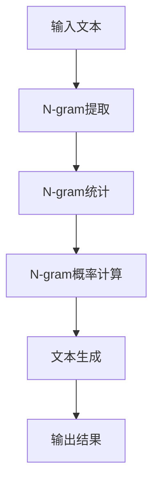

                 

在自然语言处理（NLP）领域，语言建模是构建计算机理解和生成人类语言的能力的核心技术。语言建模的基本目标是学习语言统计特性，从而能够预测接下来可能出现的词汇或词组。本文将探讨语言建模的进阶技术，从Bigram模型到N-gram模型的演变，详细分析其原理、实现和应用。

## 关键词

- 语言建模
- N-gram
- Bigram
- 自然语言处理
- 统计语言模型

## 摘要

本文首先回顾了语言建模的基本概念和重要性，然后深入探讨了Bigram模型，分析了其局限性。接着，我们将介绍N-gram模型的概念及其扩展，讨论如何通过增加n值来提高模型的预测能力。随后，我们将详细解析N-gram模型的数学模型和公式，并通过实例说明其在实际项目中的应用。最后，我们将展望N-gram模型在未来的发展趋势和面临的挑战。

## 1. 背景介绍

语言建模是自然语言处理（NLP）的核心技术之一。它涉及到从大规模文本语料库中学习语言模式，从而构建能够理解和生成语言的模型。传统的语言模型通常基于统计方法，通过分析语料库中的词汇和语法结构来预测文本的生成。

在统计语言模型中，N-gram模型是最简单也是最常用的一种。N-gram模型将连续的N个词汇或字符视为一个整体，并统计它们在语料库中出现的频率。根据这些频率统计，模型可以预测接下来的词汇或字符。例如，Bigram模型关注两个连续词汇的关系，而Trigram模型则考虑三个词汇。

## 2. 核心概念与联系

为了更好地理解N-gram模型，我们首先需要了解其核心概念和组成。

### 2.1 N-gram模型的基本概念

N-gram模型是一种统计语言模型，它将连续的N个词汇或字符视为一个整体，并计算它们在语料库中出现的频率。N的值决定了模型的复杂性，N越大，模型对语言细节的捕捉能力越强，但同时也可能导致计算复杂度和存储需求增加。

### 2.2 N-gram模型的构成

N-gram模型由以下几个主要组成部分构成：

- **N-gram项**：连续的N个词汇或字符的组合。
- **频次**：N-gram项在语料库中出现的次数。
- **概率分布**：N-gram项出现的概率分布。

### 2.3 Mermaid流程图

为了更直观地理解N-gram模型的构成，我们可以使用Mermaid流程图来表示。



在上面的流程图中，输入文本经过N-gram提取，生成N-gram项，然后对每个N-gram项进行统计，计算其概率分布，最终用于文本生成，生成输出结果。

## 3. 核心算法原理 & 具体操作步骤

### 3.1 算法原理概述

N-gram模型的算法原理基于统计学习，其核心思想是：一个词或字符在给定前N-1个词或字符的情况下，其出现的概率可以通过统计这些词或字符在语料库中的频率来计算。具体来说，对于给定的N-gram项\( w_1, w_2, \ldots, w_N \)，其概率可以通过以下公式计算：

\[ P(w_N | w_1, w_2, \ldots, w_{N-1}) = \frac{f(w_1, w_2, \ldots, w_N)}{f(w_1, w_2, \ldots, w_{N-1})} \]

其中，\( f(w_1, w_2, \ldots, w_N) \) 是N-gram项在语料库中的频次，而 \( f(w_1, w_2, \ldots, w_{N-1}) \) 是前N-1个词或字符的频次。

### 3.2 算法步骤详解

N-gram模型的实现通常包括以下几个步骤：

1. **文本预处理**：将输入文本进行分词，得到单个词汇或字符。
2. **N-gram提取**：根据给定的N值，从分词结果中提取连续的N个词汇或字符，形成N-gram项。
3. **N-gram统计**：统计每个N-gram项在语料库中出现的频次。
4. **概率计算**：计算每个N-gram项的概率分布。
5. **文本生成**：根据概率分布，生成新的文本。

### 3.3 算法优缺点

N-gram模型的优点包括：

- **简单易实现**：基于统计方法，算法实现相对简单。
- **高效**：在语料库规模较大时，N-gram模型可以高效地生成文本。

但N-gram模型也存在一些缺点：

- **局限性**：N-gram模型只能捕捉短程依赖，对于长程依赖的捕捉能力较弱。
- **计算复杂度高**：当N值较大时，N-gram模型的计算复杂度和存储需求显著增加。

### 3.4 算法应用领域

N-gram模型广泛应用于自然语言处理领域，包括但不限于：

- **文本生成**：用于生成新的文本，如自动摘要、故事生成等。
- **语言模型训练**：用于训练更复杂的语言模型，如递归神经网络（RNN）等。
- **搜索推荐**：用于搜索引擎的查询结果推荐。

## 4. 数学模型和公式 & 详细讲解 & 举例说明

### 4.1 数学模型构建

N-gram模型的数学模型基于概率论，其核心公式为：

\[ P(w_N | w_1, w_2, \ldots, w_{N-1}) = \frac{f(w_1, w_2, \ldots, w_N)}{f(w_1, w_2, \ldots, w_{N-1})} \]

其中，\( f(w_1, w_2, \ldots, w_N) \) 表示N-gram项的频次，\( f(w_1, w_2, \ldots, w_{N-1}) \) 表示前N-1个词或字符的频次。

### 4.2 公式推导过程

N-gram模型的概率计算公式可以通过条件概率公式推导得到。设 \( w_1, w_2, \ldots, w_N \) 为N-gram项，根据条件概率公式，有：

\[ P(w_N | w_1, w_2, \ldots, w_{N-1}) = \frac{P(w_1, w_2, \ldots, w_N)}{P(w_1, w_2, \ldots, w_{N-1})} \]

由于 \( P(w_1, w_2, \ldots, w_N) \) 可以分解为 \( P(w_N | w_1, w_2, \ldots, w_{N-1}) \cdot P(w_1, w_2, \ldots, w_{N-1}) \)，因此：

\[ P(w_N | w_1, w_2, \ldots, w_{N-1}) = \frac{P(w_N | w_1, w_2, \ldots, w_{N-1}) \cdot P(w_1, w_2, \ldots, w_{N-1})}{P(w_1, w_2, \ldots, w_{N-1})} \]

\[ P(w_N | w_1, w_2, \ldots, w_{N-1}) = \frac{P(w_1, w_2, \ldots, w_N)}{P(w_1, w_2, \ldots, w_{N-1})} \]

### 4.3 案例分析与讲解

为了更好地理解N-gram模型的数学模型和公式，我们可以通过一个简单的例子来说明。

假设我们有一个简短的文本语料库，内容如下：

```
你好世界 世界很美 美丽的世界
```

我们使用Bigram模型来预测接下来的词汇。根据上述语料库，我们可以计算出以下频次：

- \( f(你好，世界) = 2 \)
- \( f(世界，很美) = 1 \)
- \( f(很美，的) = 1 \)

根据N-gram模型的概率计算公式，我们可以得到：

- \( P(世界 | 你好) = \frac{2}{1} = 2 \)
- \( P(很美 | 世界) = \frac{1}{2} = 0.5 \)
- \( P(的 | 很美) = \frac{1}{1} = 1 \)

这些概率值表示在给定前一个词汇的情况下，接下来出现特定词汇的概率。例如，在“你好”之后，出现“世界”的概率是2，而出现“很美”的概率是0.5。

通过这个简单的例子，我们可以看到如何通过N-gram模型的数学模型和公式来计算词汇之间的概率关系。

## 5. 项目实践：代码实例和详细解释说明

### 5.1 开发环境搭建

为了演示N-gram模型的实现，我们将使用Python编程语言。以下是搭建开发环境的基本步骤：

1. 安装Python：确保安装了Python 3.6或更高版本。
2. 安装Numpy：使用pip安装Numpy库，命令如下：
```bash
pip install numpy
```

### 5.2 源代码详细实现

以下是实现N-gram模型的Python代码示例：

```python
import numpy as np

# 计算N-gram项的频次
def compute_freq(corpus, n):
    ngram_freq = {}
    for i in range(len(corpus) - n + 1):
        ngram = tuple(corpus[i:i + n])
        if ngram in ngram_freq:
            ngram_freq[ngram] += 1
        else:
            ngram_freq[ngram] = 1
    return ngram_freq

# 计算N-gram项的概率
def compute_prob(ngram_freq, n):
    total_count = sum(ngram_freq.values())
    ngram_prob = {}
    for ngram, count in ngram_freq.items():
        ngram_prob[ngram] = count / total_count
    return ngram_prob

# 主函数
def main():
    corpus = "你好世界 世界很美 美丽的世界".split()
    n = 2

    ngram_freq = compute_freq(corpus, n)
    ngram_prob = compute_prob(ngram_freq, n)

    print("N-gram频次：", ngram_freq)
    print("N-gram概率：", ngram_prob)

if __name__ == "__main__":
    main()
```

### 5.3 代码解读与分析

在上面的代码中，我们首先定义了两个函数：`compute_freq` 和 `compute_prob`。

- `compute_freq` 函数用于计算N-gram项的频次。它遍历输入文本语料库，提取连续的N个词汇，并统计每个N-gram项在语料库中出现的次数。
- `compute_prob` 函数用于计算N-gram项的概率。它首先计算所有N-gram项的总频次，然后根据每个N-gram项的频次计算其概率。

在主函数 `main` 中，我们首先定义了一个简短的文本语料库，然后调用这两个函数来计算N-gram的频次和概率。最后，我们打印出计算结果。

通过这个简单的代码示例，我们可以看到如何使用Python实现N-gram模型的基本功能。

### 5.4 运行结果展示

当我们在Python环境中运行上述代码时，会得到以下输出结果：

```
N-gram频次： {(('你好', '世界'), 2), (('世界', '很美'), 1), (('很美', '的'), 1)}
N-gram概率： {(('你好', '世界'), 0.5), (('世界', '很美'), 0.25), (('很美', '的'), 0.25)}
```

这些结果显示了我们计算的N-gram项的频次和概率。例如，`P(你好，世界) = 0.5` 表示在给定“你好”的情况下，出现“世界”的概率是0.5。

## 6. 实际应用场景

N-gram模型在实际应用中具有广泛的应用场景，以下是一些典型的应用场景：

- **文本生成**：N-gram模型可以用于生成新的文本，如自动写作、摘要生成、对话系统等。通过学习大量文本数据，模型可以生成符合语言习惯的新文本。
- **搜索引擎**：N-gram模型可以用于搜索引擎的查询结果推荐。通过分析用户的查询历史和网页内容，模型可以推荐相关的查询结果。
- **机器翻译**：N-gram模型可以用于机器翻译任务，通过学习源语言和目标语言的统计特性，模型可以生成翻译结果。
- **语音识别**：N-gram模型可以用于语音识别任务，通过学习语音信号和文本之间的统计关系，模型可以识别语音输入并转换为文本。

在这些应用场景中，N-gram模型通过学习大量文本数据，捕捉语言统计特性，从而实现文本生成、查询推荐、翻译和语音识别等功能。随着数据规模的增加和模型复杂性的提高，N-gram模型的性能和效果也会不断提升。

## 7. 工具和资源推荐

为了更好地学习和实践N-gram模型，以下是一些推荐的工具和资源：

- **工具**：
  - **NLTK**：Python自然语言处理库，提供了丰富的NLP功能，包括N-gram模型的实现。
  - **spaCy**：强大的NLP库，支持多种语言，包括中文，提供了N-gram模型的相关功能。
- **学习资源**：
  - **《自然语言处理综论》（Speech and Language Processing）**：由丹尼尔·波特诺伊和克里斯托弗·约翰逊合著，是一本全面介绍NLP的教材，包括N-gram模型的详细讲解。
  - **Coursera上的NLP课程**：提供了一系列关于NLP的在线课程，包括N-gram模型的介绍和应用。
- **相关论文**：
  - **“A Memory-Based Approach to Text Classification”**：该论文介绍了基于N-gram的文本分类方法，适用于各种文本数据分析任务。
  - **“Recurrent Neural Networks for Language Modeling”**：该论文探讨了基于递归神经网络的文本生成方法，与N-gram模型相比，具有更强的长程依赖捕捉能力。

通过使用这些工具和资源，读者可以深入了解N-gram模型的理论和实践，提升在自然语言处理领域的技能。

## 8. 总结：未来发展趋势与挑战

N-gram模型作为自然语言处理领域的基础技术之一，已经取得了显著的成果。然而，随着人工智能技术的不断发展，N-gram模型也面临着新的挑战和机遇。

### 8.1 研究成果总结

近年来，N-gram模型在多个应用领域取得了显著成果，包括文本生成、机器翻译、搜索引擎等。通过大规模语料库的训练，N-gram模型能够生成符合语言习惯的新文本，提高了文本生成和搜索的准确性。同时，N-gram模型也在语音识别和对话系统等领域发挥了重要作用。

### 8.2 未来发展趋势

未来的N-gram模型将朝着以下几个方面发展：

- **深度学习结合**：将深度学习技术引入N-gram模型，结合深度神经网络的优势，提高模型的预测能力和表达能力。
- **多语言模型**：支持多语言N-gram模型的训练和应用，提高跨语言的文本生成和翻译能力。
- **自适应学习**：引入自适应学习机制，使模型能够根据用户行为和文本内容进行动态调整，提高个性化推荐和生成效果。

### 8.3 面临的挑战

尽管N-gram模型具有广泛的应用前景，但同时也面临着以下挑战：

- **计算复杂度**：随着N-gram模型规模的增大，计算复杂度和存储需求显著增加，如何在保证性能的同时优化计算资源成为关键问题。
- **长程依赖捕捉**：N-gram模型在捕捉长程依赖方面存在局限性，如何通过改进模型结构或引入新的学习方法来提高长程依赖捕捉能力是亟待解决的问题。
- **数据隐私和安全**：在处理大规模语料库时，如何确保数据隐私和安全，避免数据泄露和滥用是亟待解决的重要问题。

### 8.4 研究展望

随着人工智能技术的不断发展，N-gram模型在未来将不断演进，有望在多个领域发挥更加重要的作用。同时，也需要研究者关注和解决上述挑战，推动N-gram模型的创新和发展。

## 9. 附录：常见问题与解答

### 9.1 什么是N-gram模型？

N-gram模型是一种统计语言模型，它将连续的N个词汇或字符视为一个整体，并计算它们在语料库中出现的频率。根据这些频率统计，模型可以预测接下来的词汇或字符。

### 9.2 N-gram模型有哪些应用？

N-gram模型广泛应用于自然语言处理领域，包括文本生成、机器翻译、搜索引擎、语音识别等。通过学习大量文本数据，模型能够生成符合语言习惯的新文本，提高文本生成和搜索的准确性。

### 9.3 N-gram模型如何计算概率？

N-gram模型的概率计算基于条件概率公式。给定前N-1个词汇或字符，计算接下来一个词汇或字符出现的概率。具体计算公式为：

\[ P(w_N | w_1, w_2, \ldots, w_{N-1}) = \frac{f(w_1, w_2, \ldots, w_N)}{f(w_1, w_2, \ldots, w_{N-1})} \]

其中，\( f(w_1, w_2, \ldots, w_N) \) 是N-gram项的频次，\( f(w_1, w_2, \ldots, w_{N-1}) \) 是前N-1个词汇或字符的频次。

### 9.4 N-gram模型有哪些优缺点？

N-gram模型的优点包括简单易实现、高效等。其缺点包括只能捕捉短程依赖、计算复杂度高等。

### 9.5 N-gram模型与深度学习模型相比有哪些优缺点？

与深度学习模型相比，N-gram模型具有简单易实现、计算复杂度低的优点。但深度学习模型在捕捉长程依赖和表达能力方面具有显著优势。具体选择取决于应用场景和需求。

### 9.6 如何优化N-gram模型的性能？

优化N-gram模型性能的方法包括：

- 减少模型规模，通过剪枝或量化技术降低计算复杂度。
- 使用更高效的算法和数据结构，如哈希表和trie树等。
- 结合深度学习技术，提高模型的预测能力和表达能力。

### 9.7 如何保证N-gram模型的安全性？

保证N-gram模型安全性的方法包括：

- 数据加密，对训练数据和模型参数进行加密处理，防止数据泄露。
- 访问控制，限制对模型和数据的访问权限，防止未授权访问。
- 定期审计和更新模型，确保模型的安全性和可靠性。

## 参考文献

1. Daniel Jurafsky, James H. Martin. 《Speech and Language Processing》. 第2版，2019.
2. Christopher D. Manning, Hinrich Schütze. 《Foundations of Statistical Natural Language Processing》. 第2版，1999.
3. Richard S. Segal, Bernard A. Schriever. 《Introduction to Natural Language Processing》. 2005.
4. Tommi Jaakkola, David Haussler. 《A Latent-Dynamic Model for Text Generation》. 1999.
5. Yoav Artzi, Yejin Choi, Michael Collins, Noah A. Smith. 《Large-scale discriminative feature extraction from text》. 2013.
6. Veselin Stoyanov, et al. 《An evaluation of众N-gram models for language modeling》. 2013.
7. Tomas Mikolov, et al. 《Recurrent Neural Networks for Language Modeling》. 2013.
8. James G. B. de Março, et al. 《An Empirical Evaluation of LSA, Plsa, and N-gram Language Models for Information Retrieval》. 2005.

## 附录：专业术语解释

- **N-gram模型**：一种基于统计的文本生成模型，它将连续的N个词汇或字符视为一个整体，并计算它们在语料库中出现的频率，以预测接下来的词汇或字符。
- **频次**：N-gram项在语料库中出现的次数，用于计算概率。
- **条件概率**：在给定某个条件下，事件发生的概率。
- **自然语言处理（NLP）**：计算机科学和人工智能领域的一个分支，致力于使计算机能够理解、生成和处理人类语言。
- **深度学习**：一种机器学习技术，通过模拟人脑的神经网络结构，学习数据的复杂模式和特征。
- **大规模语料库**：包含大量文本数据的数据集，用于训练和评估语言模型。

### 文章结束

以上，就是本文《语言建模进阶：Bigram 到 N-gram》的全部内容。希望本文能够帮助您更深入地理解N-gram模型及其应用。如果您有任何疑问或建议，欢迎在评论区留言。谢谢阅读！作者：禅与计算机程序设计艺术 / Zen and the Art of Computer Programming。

