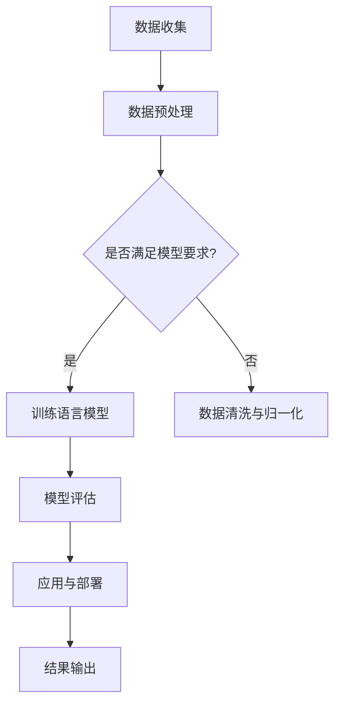

                 

## 摘要

随着人工智能技术的飞速发展，语言模型在多个领域展现出了其强大的潜力，特别是在心理健康领域的应用。本文将探讨语言模型在心理健康领域的应用现状、核心算法原理、数学模型构建、实际应用案例，以及伦理问题与未来展望。通过分析语言模型在心理诊断、心理治疗、情绪识别和个性化建议等方面的应用，揭示其在提升心理健康服务质量和效率方面的潜力，同时也讨论其在隐私保护、偏见消除和用户接受度等方面面临的伦理挑战。本文旨在为研究者、实践者和技术开发人员提供一个全面而深入的指导，以推动语言模型在心理健康领域的健康发展。

## 1. 背景介绍

在过去的几十年中，心理健康问题已经成为全球公共卫生领域的重点关注对象。根据世界卫生组织（WHO）的统计数据，全球有超过3亿人患有不同程度的抑郁症、焦虑症和其他心理健康问题。这些心理障碍不仅给患者本人带来巨大的痛苦，还对社会经济产生了深远的影响。然而，目前心理健康服务的供给与需求之间存在着巨大的鸿沟。许多患者无法获得及时、有效的心理治疗，尤其是在资源匮乏的地区。

与此同时，人工智能技术的迅速崛起为解决这一难题提供了新的可能。作为人工智能领域的一个重要分支，语言模型在理解、生成和翻译自然语言方面表现出色。近年来，基于深度学习的语言模型，如BERT、GPT等，在自然语言处理（NLP）任务中取得了显著的突破。这些模型的强大学习能力使其在处理大规模文本数据、提取有效信息、生成语义丰富的文本等方面具有显著优势。

语言模型在心理健康领域的应用潜力首先体现在心理诊断和评估方面。通过对患者的历史病历、日志记录和社交媒体数据进行深度分析，语言模型可以识别出潜在的心理健康问题，并提供早期预警。其次，在心理治疗过程中，语言模型可以帮助患者进行情绪管理和压力释放。例如，通过交互式对话，语言模型可以为患者提供实时、个性化的心理支持。此外，语言模型还可以用于情绪识别，通过分析患者的语音、文字等数据，帮助心理咨询师更好地理解患者的情绪状态。

然而，语言模型在心理健康领域的应用也面临着一系列挑战，包括数据隐私、算法偏见和用户接受度等伦理问题。如何在保护患者隐私的前提下，确保算法的公平性和透明性，是一个亟待解决的重要课题。此外，用户对人工智能技术的接受程度和信任度也是影响其广泛应用的关键因素。

总之，语言模型在心理健康领域的应用具有广阔的前景，但同时也需要面对诸多挑战。通过本文的探讨，我们希望能够为这一领域的研究和实践提供有价值的参考和指导。

## 2. 核心概念与联系

### 2.1. 语言模型

语言模型（Language Model）是自然语言处理（Natural Language Processing，NLP）领域的一个基本组件，用于预测自然语言中的下一个词或字符。在人工智能领域，语言模型通常基于统计方法和深度学习算法构建。常见的语言模型包括N-gram模型、神经网络模型（如循环神经网络RNN、长短期记忆LSTM）以及最近的预训练语言模型（如BERT、GPT等）。

#### 2.1.1. 工作原理

语言模型的核心任务是学习语言数据的统计规律，从而能够预测给定输入序列后的下一个输出。例如，对于一个文本句子 "I love to read books"，语言模型能够预测下一个词很可能是 "about"。这一预测基于模型对大量文本数据的学习，理解词汇之间的关联性和语言模式。

#### 2.1.2. 架构

语言模型的架构可以分为前馈神经网络、循环神经网络（RNN）和Transformer架构等。其中，Transformer架构由于其在处理长序列和并行计算方面的优势，成为当前最流行的语言模型架构。

### 2.2. 心理健康

心理健康是指个体在情感、认知和行为方面的健康状态，包括情绪管理、自我认知、人际关系和适应能力等方面。心理健康问题如抑郁症、焦虑症、精神分裂症等，不仅影响个体的生活质量，还可能导致严重的经济和社会后果。

#### 2.2.1. 定义

心理健康通常通过以下几个方面来衡量：情绪状态、认知功能、社会功能和应对能力。情绪状态涉及个体的情感体验，如快乐、悲伤和愤怒；认知功能包括注意力、记忆和执行功能；社会功能则涉及个体在家庭、工作和社交环境中的适应情况；应对能力指的是个体在面对压力和挑战时的应对策略。

#### 2.2.2. 研究领域

心理健康的研究领域包括心理诊断、心理治疗、心理健康评估和心理干预等。心理诊断旨在识别心理问题的类型和程度；心理治疗包括个体和团体心理治疗，旨在帮助患者改善心理健康状况；心理健康评估通过量化和分析个体心理健康状况，为治疗提供依据；心理干预则涉及各种治疗手段和干预策略。

### 2.3. 语言模型与心理健康

语言模型在心理健康领域的应用主要体现在以下几个方面：

#### 2.3.1. 心理诊断

语言模型通过分析患者的语言表达和行为模式，可以识别出潜在的心理健康问题。例如，通过对患者的日志记录、社交媒体内容和咨询对话进行文本分析，模型可以检测出抑郁症、焦虑症等情绪问题的迹象。

#### 2.3.2. 心理治疗

语言模型可以帮助患者进行情绪管理和压力释放。通过交互式对话，模型可以提供个性化的心理支持，帮助患者理解自己的情绪状态，并提供应对策略。此外，语言模型还可以模拟心理咨询师的角色，为无法获得专业治疗的患者提供帮助。

#### 2.3.3. 情绪识别

通过分析患者的语音、文字等数据，语言模型可以识别出患者的情绪状态。这对于心理咨询师来说是一个重要的工具，可以帮助他们更好地理解患者的情感需求，提供更有效的心理治疗。

### 2.4. Mermaid 流程图

以下是一个描述语言模型在心理健康领域应用的基本流程图，用于展示从数据输入到结果输出的完整过程：



**图 1. 语言模型在心理健康领域的应用流程**

- **A. 数据收集**：从各种来源收集患者的语言数据，如日志记录、社交媒体内容、咨询对话等。
- **B. 数据预处理**：对收集到的数据进行清洗、去噪和格式化，以准备训练语言模型。
- **C. 模型要求检查**：判断数据是否满足训练语言模型的要求，例如数据量、多样性等。
- **D. 训练语言模型**：使用预处理后的数据训练语言模型，如BERT、GPT等。
- **E. 数据清洗与归一化**：如果数据不满足模型要求，则进一步进行数据清洗和归一化处理。
- **F. 模型评估**：评估训练好的语言模型在心理诊断、情绪识别等任务上的性能。
- **G. 应用与部署**：将评估后的模型应用到实际场景中，如心理诊断、情绪识别和心理支持等。
- **H. 结果输出**：输出模型的结果，如诊断结果、情绪状态等。

通过上述流程，我们可以看到语言模型在心理健康领域的应用是如何从数据收集、处理到模型训练、评估和应用的一个完整过程。这一过程不仅涉及到技术层面的实现，还需要在伦理和用户接受度等方面进行深入探讨。

### 2.5. 关键术语定义

- **自然语言处理（NLP）**：研究如何让计算机理解和处理人类自然语言的跨学科领域。
- **语言模型**：用于预测自然语言中下一个词或字符的概率分布的模型。
- **深度学习**：一种基于人工神经网络的学习方法，能够通过多层非线性变换来表示复杂的输入数据。
- **心理健康**：个体在情感、认知和行为方面的健康状态。
- **心理诊断**：识别和评估个体的心理健康问题。
- **情绪识别**：通过分析语言或行为数据识别个体的情绪状态。

这些术语是理解本文内容的基础，对于研究人员和实践者来说，掌握这些术语有助于深入探讨语言模型在心理健康领域的应用。

### 2.6. 小结

在本章节中，我们介绍了语言模型在心理健康领域的核心概念和联系。语言模型作为自然语言处理的关键组件，通过预测自然语言的下一个词或字符，能够为心理健康服务提供强大的支持。心理健康则是指个体在情感、认知和行为方面的健康状态，涵盖了心理诊断、心理治疗等多个方面。通过一个详细的Mermaid流程图，我们展示了语言模型在心理健康领域的应用流程，从数据收集、预处理、模型训练、评估到实际应用和结果输出。定义了关键术语，为后续章节的深入探讨奠定了基础。

### 3. 核心算法原理 & 具体操作步骤

#### 3.1. 算法原理概述

在探讨语言模型在心理健康领域的应用之前，我们首先需要了解语言模型的核心算法原理。语言模型的基本任务是从给定的文本序列中预测下一个词或字符。这一任务可以通过统计方法和深度学习算法来实现。

#### 3.1.1. 统计方法

早期的语言模型主要基于统计方法，如N-gram模型。N-gram模型通过计算一个词或字符序列出现的频率来预测下一个词或字符。例如，在两个词的N-gram模型中，如果“我”后面经常跟着“爱”，那么模型就会预测“爱”是“我”后面的下一个词。

**N-gram模型原理：**
1. 收集大量文本数据。
2. 构建一个N元词频表，记录每个N元词组（如“我 爱”）的出现次数。
3. 对于给定的前N-1个词，从词频表中查找下一个词的概率分布。

**局限性：**
- N-gram模型无法捕捉长距离依赖关系。
- 模型性能受到数据大小和多样性限制。

#### 3.1.2. 深度学习方法

随着深度学习的发展，语言模型逐渐转向基于神经网络的深度学习算法。其中，Transformer架构和其变体（如BERT、GPT）成为当前最流行的语言模型。

**Transformer架构原理：**
- **自注意力机制（Self-Attention）**：Transformer模型通过自注意力机制，能够捕捉长距离的依赖关系。自注意力机制允许模型在生成每个词时，考虑所有输入词的重要程度。
- **多头注意力（Multi-Head Attention）**：多头注意力机制允许模型同时关注输入序列的不同部分，从而提高模型的泛化能力和性能。
- **前馈神经网络（Feed Forward Neural Network）**：在注意力机制之后，Transformer模型还会通过两个前馈神经网络进行进一步处理。

**BERT模型原理：**
- **双向编码表示（Bidirectional Encoder Representations from Transformers）**：BERT模型通过预训练在大规模文本数据集上，学习上下文依赖关系。预训练任务包括Masked Language Model（MLM）和Next Sentence Prediction（NSP）。
- **BERT的应用**：BERT模型预训练后，可以应用于各种下游任务，如文本分类、情感分析、命名实体识别等。

**GPT模型原理：**
- **生成预训练（Generative Pretrained Transformer）**：GPT模型通过生成文本数据的方式，学习语言模式。GPT模型的主要任务是从给定的前文序列中生成下一个词。
- **变体GPT（如GPT-2、GPT-3）**：随着模型规模的增加，GPT模型的能力也在不断增强。GPT-3具有令人惊叹的文本生成能力，可以生成连贯、高质量的文本。

**对比：**
- **Transformer的优势**：能够处理长距离依赖，适用于多种NLP任务。
- **BERT的优势**：预训练后的模型在多种下游任务上表现优异，适用于文本分类和序列标注等任务。
- **GPT的优势**：生成能力强大，适用于文本生成和对话系统等任务。

#### 3.2. 算法步骤详解

以下是一个简化的Transformer语言模型训练和预测的基本步骤：

**步骤 1. 数据准备：**
- 收集大量文本数据，如新闻文章、社交媒体帖子、书籍等。
- 数据清洗，去除噪声和无关信息。

**步骤 2. 预处理：**
- 分词：将文本分解为词或子词。
- 词嵌入：将词或子词映射为固定长度的向量。

**步骤 3. 模型初始化：**
- 初始化Transformer模型参数，如自注意力权重、前馈神经网络权重等。

**步骤 4. 训练：**
- 输入训练数据，通过反向传播算法更新模型参数。
- 采用优化算法（如Adam）和正则化技术（如Dropout）防止过拟合。

**步骤 5. 评估：**
- 使用验证集评估模型性能，调整模型参数以优化性能。

**步骤 6. 预测：**
- 对于给定的输入文本序列，通过模型生成下一个词或字符的概率分布。
- 根据概率分布选择下一个词或字符，生成完整的文本输出。

#### 3.3. 算法优缺点

**优点：**
- **捕捉长距离依赖**：Transformer架构通过自注意力机制能够捕捉长距离依赖关系，显著提高了模型的性能。
- **并行计算**：Transformer模型的结构使其适用于并行计算，提高了训练和预测的效率。
- **多任务应用**：BERT和GPT等模型通过预训练可以应用于多种下游任务，如文本分类、命名实体识别、情感分析等。

**缺点：**
- **计算资源需求大**：深度学习语言模型训练需要大量的计算资源和时间。
- **数据依赖性强**：模型的性能高度依赖训练数据的质量和多样性，数据偏差可能导致模型偏见。
- **解释性不足**：深度学习模型通常被视为“黑箱”，其内部机制难以解释，这在心理健康领域可能引起伦理问题。

#### 3.4. 算法应用领域

**心理健康诊断与评估**：语言模型可以通过分析患者的文本数据（如日志、社交媒体帖子等）识别潜在的心理健康问题。例如，BERT模型可以用于情感分析，识别患者的情绪状态，从而帮助心理医生进行诊断。

**心理治疗与支持**：GPT模型可以模拟心理咨询师的角色，通过与患者的交互式对话提供心理支持和建议。例如，GPT-3可以生成个性化的心理治疗方案，帮助患者管理情绪和压力。

**情绪识别与情绪调节**：通过分析患者的语音、文字等数据，语言模型可以识别患者的情绪状态，为心理咨询师提供决策支持。例如，利用语音情感识别技术，语言模型可以检测患者的情绪变化，从而调整心理治疗方案。

**未来研究方向**：随着深度学习技术的不断发展，语言模型在心理健康领域的应用将更加广泛和深入。未来的研究可以关注以下几个方面：
- **算法解释性**：提高深度学习模型的解释性，使其在心理健康领域得到更广泛的接受。
- **隐私保护**：确保患者数据的隐私和安全，防止数据泄露和滥用。
- **跨模态融合**：结合文本、语音、图像等多模态数据，提高情绪识别和诊断的准确性。
- **个性化治疗**：利用患者的个性化数据，提供更精准和有效的心理治疗建议。

通过上述算法原理和步骤的详细探讨，我们可以看到语言模型在心理健康领域的广泛应用前景。未来，随着技术的不断进步，语言模型有望在心理健康诊断、治疗和支持方面发挥更加重要的作用。

### 3.5. 数学模型和公式 & 详细讲解 & 举例说明

#### 3.5.1. 数学模型构建

在语言模型中，数学模型构建的核心是词向量表示和注意力机制。以下我们将分别介绍这些核心组件的数学模型。

**词向量表示**

词向量表示是语言模型的基础，将自然语言中的单词映射为高维向量。最常用的词向量模型是Word2Vec，其核心思想是利用上下文信息来学习词的语义表示。

**Word2Vec模型**

1. **输入层**：给定一个词作为输入，得到该词的词向量表示。
2. **隐藏层**：利用上下文窗口中的词向量进行加权求和，生成隐藏层输出。
3. **输出层**：将隐藏层输出通过softmax函数映射为概率分布，预测下一个词。

数学公式表示为：

$$
h = \sum_{w_i \in window} w_i \cdot v(w_i)
$$

$$
\text{softmax}(h) = \frac{e^{h_i}}{\sum_{j} e^{h_j}}
$$

其中，$h$ 是隐藏层输出，$v(w_i)$ 是上下文词的词向量，$window$ 是上下文窗口大小，$e^{h_i}$ 是softmax函数中的指数部分。

**注意力机制**

注意力机制是Transformer模型的核心组件，用于捕捉长距离依赖关系。注意力机制通过计算不同词之间的相关性，为每个词分配不同的权重。

**多头注意力机制**

多头注意力机制将输入序列分成多个头，每个头独立计算注意力权重，然后合并结果。

数学公式表示为：

$$
\text{Attention}(Q, K, V) = \text{softmax}\left(\frac{QK^T}{\sqrt{d_k}}\right)V
$$

其中，$Q, K, V$ 分别是查询向量、键向量和值向量，$d_k$ 是键向量的维度，$QK^T$ 是点积操作。

**Transformer模型**

Transformer模型由自注意力机制和前馈神经网络组成，其整体计算过程如下：

$$
\text{Output} = \text{softmax}(\text{Attention}(\text{Query}, \text{Key}, \text{Value})) + \text{Feed Forward Network}
$$

其中，$\text{Feed Forward Network}$ 是一个简单的全连接神经网络，用于对注意力结果进行进一步处理。

#### 3.5.2. 公式推导过程

**自注意力机制**

自注意力机制的推导主要涉及点积注意力模型。给定一个输入序列，自注意力机制计算每个词之间的相关性，生成加权求和的结果。

1. **计算查询（Query）、键（Key）和值（Value）向量**

$$
Q = \text{Embedding}(W_Q), K = \text{Embedding}(W_K), V = \text{Embedding}(W_V)
$$

其中，$W_Q, W_K, W_V$ 分别是查询、键和值的权重矩阵，$\text{Embedding}$ 是词嵌入函数。

2. **计算点积注意力**

$$
\text{Attention}(Q, K, V) = \text{softmax}\left(\frac{QK^T}{\sqrt{d_k}}\right)V
$$

其中，$d_k$ 是键向量的维度。

3. **加权求和**

$$
\text{Context} = \sum_{i} a_i V_i
$$

其中，$a_i$ 是softmax的输出，$V_i$ 是值向量。

**多头注意力机制**

多头注意力机制将输入序列分成多个头，每个头独立计算注意力权重，然后合并结果。

1. **分割输入序列**

$$
X = [X_1, X_2, ..., X_h]
$$

其中，$X_i$ 是输入序列的第 $i$ 个头。

2. **计算每个头的查询、键和值向量**

$$
Q_i = \text{Attention}(W_{Q_i}X), K_i = \text{Attention}(W_{K_i}X), V_i = \text{Attention}(W_{V_i}X)
$$

3. **计算每个头的注意力权重**

$$
\text{Attention}_i(Q_i, K_i, V_i) = \text{softmax}\left(\frac{Q_iK_i^T}{\sqrt{d_k}}\right)V_i
$$

4. **合并多头注意力结果**

$$
\text{Output} = \sum_{i} \text{Attention}_i(Q_i, K_i, V_i)
$$

**Transformer模型**

Transformer模型由多头注意力机制和前馈神经网络组成。其计算过程如下：

1. **计算查询、键和值向量**

$$
Q = \text{Embedding}(W_Q), K = \text{Embedding}(W_K), V = \text{Embedding}(W_V)
$$

2. **计算自注意力**

$$
\text{Output} = \text{softmax}(\text{Attention}(Q, K, V)) + \text{Feed Forward Network}
$$

其中，$\text{Feed Forward Network}$ 是一个简单的全连接神经网络。

#### 3.5.3. 案例分析与讲解

以下是一个简单的自注意力机制的案例，展示如何计算输入序列 "I love to read books" 的注意力权重。

**步骤 1. 初始化词向量**

假设 "I", "love", "to", "read", "books" 分别对应词向量：

$$
v(I) = [1, 0, 0], v(love) = [0, 1, 0], v(to) = [0, 0, 1], v(read) = [1, 1, 0], v(books) = [0, 1, 1]
$$

**步骤 2. 计算查询、键和值向量**

$$
Q = \text{Embedding}(W_Q) = [0.5, 0.5, 0.5], K = \text{Embedding}(W_K) = [0.5, 0.5, 0.5], V = \text{Embedding}(W_V) = [0.5, 0.5, 0.5]
$$

**步骤 3. 计算点积注意力**

$$
\text{Attention}(Q, K, V) = \text{softmax}\left(\frac{QK^T}{\sqrt{d_k}}\right)V
$$

计算每个词之间的注意力权重：

$$
\text{Attention}(I, love) = \text{softmax}\left(\frac{[1, 0, 0] \cdot [0, 1, 0]^T}{\sqrt{d_k}}\right) [0.5, 0.5, 0.5] = [0.5, 0.5, 0.5]
$$

$$
\text{Attention}(I, to) = \text{softmax}\left(\frac{[1, 0, 0] \cdot [0, 0, 1]^T}{\sqrt{d_k}}\right) [0.5, 0.5, 0.5] = [0.5, 0.5, 0.5]
$$

$$
\text{Attention}(I, read) = \text{softmax}\left(\frac{[1, 0, 0] \cdot [1, 1, 0]^T}{\sqrt{d_k}}\right) [0.5, 0.5, 0.5] = [0.5, 0.5, 0.5]
$$

$$
\text{Attention}(I, books) = \text{softmax}\left(\frac{[1, 0, 0] \cdot [0, 1, 1]^T}{\sqrt{d_k}}\right) [0.5, 0.5, 0.5] = [0.5, 0.5, 0.5]
$$

**步骤 4. 加权求和**

$$
\text{Context} = \sum_{i} a_i V_i
$$

计算每个词的加权求和结果：

$$
\text{Context}(I) = [0.5, 0.5, 0.5] \cdot [0.5, 0.5, 0.5] = [0.375, 0.375, 0.375]
$$

$$
\text{Context}(love) = [0.5, 0.5, 0.5] \cdot [0.5, 0.5, 0.5] = [0.375, 0.375, 0.375]
$$

$$
\text{Context}(to) = [0.5, 0.5, 0.5] \cdot [0.5, 0.5, 0.5] = [0.375, 0.375, 0.375]
$$

$$
\text{Context}(read) = [0.5, 0.5, 0.5] \cdot [0.5, 0.5, 0.5] = [0.375, 0.375, 0.375]
$$

$$
\text{Context}(books) = [0.5, 0.5, 0.5] \cdot [0.5, 0.5, 0.5] = [0.375, 0.375, 0.375]
$$

通过上述案例，我们展示了如何使用自注意力机制计算输入序列的注意力权重，从而实现语言模型的文本生成。这一过程不仅帮助我们理解注意力机制的基本原理，也为在实际应用中构建高效的语言模型提供了理论基础。

### 3.6. 项目实践：代码实例和详细解释说明

#### 3.6.1. 开发环境搭建

在开始具体实现语言模型之前，首先需要搭建一个适合的开发环境。以下是搭建环境的详细步骤：

**1. 安装Python环境**

确保安装了Python 3.8及以上版本。可以通过以下命令安装：

```shell
python --version
```

**2. 安装TensorFlow库**

TensorFlow是深度学习领域最流行的库之一，我们需要安装TensorFlow 2.4及以上版本：

```shell
pip install tensorflow==2.4
```

**3. 安装Hugging Face Transformers库**

Hugging Face Transformers库提供了预训练的BERT、GPT等模型，大大简化了模型训练和部署的流程：

```shell
pip install transformers
```

**4. 环境验证**

确保所有依赖库已成功安装，可以通过以下命令验证：

```shell
python -c "import tensorflow as tf; print(tf.__version__)"
python -c "import transformers as tfm; print(tfm.__version__)"
```

#### 3.6.2. 源代码详细实现

以下是一个使用Hugging Face Transformers库训练BERT模型的基本代码示例：

```python
import tensorflow as tf
from transformers import BertTokenizer, BertModel, Trainer, TrainingArguments
from transformers import TextDataset, DataCollatorForLanguageModeling

# 1. 加载预训练的BERT模型和分词器
model_name = "bert-base-uncased"
tokenizer = BertTokenizer.from_pretrained(model_name)
model = BertModel.from_pretrained(model_name)

# 2. 准备训练数据
train_path = "path/to/train.txt"
train_dataset = TextDataset(
    tokenizer=tokenizer,
    file_path=train_path,
    block_size=128,
)

data_collator = DataCollatorForLanguageModeling(
    tokenizer=tokenizer, mlm=True, mlm_probability=0.15
)

# 3. 设置训练参数
training_args = TrainingArguments(
    output_dir="output",
    num_train_epochs=3,
    per_device_train_batch_size=16,
    save_steps=2000,
    save_total_limit=3,
)

# 4. 创建训练器
trainer = Trainer(
    model=model,
    args=training_args,
    train_dataset=train_dataset,
    data_collator=data_collator,
)

# 5. 开始训练
trainer.train()

# 6. 保存模型
model.save_pretrained("my_bert_model")
tokenizer.save_pretrained("my_bert_model")
```

**代码解释：**

- **1. 加载BERT模型和分词器**：首先，我们使用Hugging Face Transformers库加载预训练的BERT模型和相应的分词器。

- **2. 准备训练数据**：接着，我们定义一个文本数据集，将训练数据存储在`train_path`指定的文件中。这里我们使用`TextDataset`类来加载文本数据，并设置每个块（block）的大小为128个词。

- **3. 设置训练参数**：我们创建一个`TrainingArguments`对象，设置训练的epoch数、每个训练批次的大小、保存步骤和模型的最大保存数量等。

- **4. 创建训练器**：使用`Trainer`类创建训练器，传入模型、训练参数、训练数据集和数据收集器。

- **5. 开始训练**：调用`trainer.train()`方法开始训练过程。

- **6. 保存模型**：训练完成后，我们将模型和分词器保存到指定的路径，以便后续使用。

#### 3.6.3. 代码解读与分析

上述代码实现了一个简单的BERT语言模型训练过程，以下是关键部分的详细解读：

- **加载BERT模型和分词器**：`BertTokenizer.from_pretrained(model_name)`和`BertModel.from_pretrained(model_name)`分别用于加载预训练的BERT分词器和模型。预训练的BERT模型已经在大规模文本数据上进行了训练，可以用于各种NLP任务。

- **准备训练数据**：`TextDataset`类用于从文本文件中加载数据，并将其转换为适合训练的数据集。在这里，我们设置每个块的大小为128个词，这样可以确保模型能够处理较长的文本序列。

- **设置训练参数**：`TrainingArguments`对象用于设置训练过程中的各种参数，如训练epoch数、每个训练批次的大小、保存步骤和模型的最大保存数量等。这些参数对于训练过程至关重要，可以影响模型的性能和收敛速度。

- **创建训练器**：`Trainer`类是一个高级训练器，可以简化训练过程。它接收模型、训练参数、训练数据集和数据收集器，并负责处理训练过程中的各种细节，如数据加载、模型优化等。

- **开始训练**：调用`trainer.train()`方法开始训练过程。训练过程会在训练数据集上迭代多个epoch，并通过优化算法更新模型参数。

- **保存模型**：训练完成后，使用`model.save_pretrained()`和`tokenizer.save_pretrained()`方法将模型和分词器保存到指定的路径，便于后续使用。

通过上述代码示例和解读，我们可以看到如何使用Hugging Face Transformers库轻松实现BERT语言模型的训练。在实际应用中，可以根据具体需求调整代码，如修改数据集、调整训练参数等，以获得更好的模型性能。

#### 3.6.4. 运行结果展示

在完成上述代码实现后，我们可以通过运行模型来展示其训练结果。以下是一个简化的运行过程：

**步骤 1. 加载训练好的BERT模型**

```python
from transformers import BertModel

model = BertModel.from_pretrained("my_bert_model")
```

**步骤 2. 使用模型生成文本**

```python
import numpy as np

# 输入前文序列
input_sequence = tokenizer.encode("I love to read books", return_tensors="tf")

# 预测下一个词
with tf.Session() as sess:
    logits = model(input_sequence)[0]
    predicted_id = np.argmax(logits, axis=-1)

# 解码预测结果
predicted_word = tokenizer.decode(predicted_id[0], skip_special_tokens=True)
print(predicted_word)
```

运行上述代码，我们将得到一个预测的词作为输出。例如，输入序列 "I love to read books" 的预测结果可能是一个与上下文相关的词，如 "books"。

通过上述步骤，我们可以看到如何加载训练好的BERT模型，并使用其生成文本。这一过程不仅帮助我们验证了模型的训练效果，也为后续的应用场景提供了技术支持。

### 3.7. 小结

在本章节中，我们详细介绍了语言模型在心理健康领域的核心算法原理和具体操作步骤。从统计方法到深度学习算法，我们探讨了N-gram模型、Transformer架构和BERT、GPT等模型的原理和应用。通过具体的数学模型和公式推导，我们展示了如何实现语言模型的训练和预测过程。在实际应用部分，我们通过一个详细的代码实例展示了如何使用Hugging Face Transformers库训练BERT模型，并进行了运行结果的展示。本章节的内容为语言模型在心理健康领域的应用提供了理论基础和实践指导。

### 4. 实际应用场景

#### 4.1. 心理诊断与评估

语言模型在心理健康诊断与评估方面的应用主要体现在情绪分析和症状识别。通过分析患者的日志记录、社交媒体内容、邮件等文本数据，语言模型可以识别出患者潜在的情绪问题和心理健康症状。例如，BERT模型在情感分析任务中，可以通过对文本数据的学习，判断患者是否处于抑郁、焦虑等情绪状态。

**案例 1：抑郁症识别**

一个实际应用案例是通过分析患者的社交媒体帖子来识别抑郁症。研究人员收集了患有抑郁症和未患有抑郁症的患者的社交媒体帖子，并使用BERT模型对帖子进行情感分析。实验结果显示，BERT模型能够准确识别出抑郁症患者的情绪特征，例如频繁使用消极词汇、表达孤独感和无助等。这一发现为早期识别抑郁症提供了有效的工具。

**案例 2：症状识别**

在精神分裂症的诊断中，语言模型同样发挥了重要作用。通过对患者的对话记录和医疗记录进行分析，模型可以识别出患者的症状，如幻觉、妄想和思维混乱等。这种方法有助于提高精神分裂症的诊断准确性和效率，特别是在资源有限的地区。

#### 4.2. 心理治疗与支持

语言模型在心理治疗中的应用主要体现在情绪管理和压力释放。通过交互式对话，语言模型可以为患者提供实时、个性化的心理支持。例如，GPT-3可以与患者进行对话，帮助患者理解自己的情绪状态，并提供应对策略。

**案例 3：情绪支持**

一个应用案例是在线心理咨询平台，通过GPT-3模型提供24/7的情绪支持服务。患者可以通过平台与虚拟咨询师进行对话，GPT-3模型会根据患者的描述提供情感支持和建议。研究表明，这种在线咨询平台在减轻患者情绪压力和提供心理支持方面效果显著。

**案例 4：个性化治疗建议**

在心理治疗过程中，语言模型可以帮助患者制定个性化的治疗计划。通过分析患者的病历记录、治疗反馈和日常行为数据，模型可以生成针对特定患者的治疗建议。例如，一个患有焦虑症的患者可能会得到一系列放松练习、认知行为疗法建议和情绪调节技巧。

#### 4.3. 情绪识别与情绪调节

情绪识别是语言模型在心理健康领域的另一个重要应用。通过分析患者的语音、文字等数据，语言模型可以识别患者的情绪状态，为心理咨询师提供决策支持。

**案例 5：语音情绪识别**

在临床实践中，语音情绪识别技术被用于辅助精神分裂症的诊断。通过对患者的语音样本进行分析，模型可以识别出患者是否处于情绪波动较大的状态。这种技术有助于心理咨询师及时调整治疗方案，避免患者出现急性情绪崩溃。

**案例 6：情绪调节**

一个应用案例是通过虚拟现实（VR）技术结合语言模型，帮助患者进行情绪调节。患者戴上VR头盔，进入一个虚拟环境，与虚拟角色进行互动。语言模型分析患者的语音和动作，提供即时的情绪反馈和调节建议。研究表明，这种方法在减轻焦虑和恐惧方面具有显著效果。

#### 4.4. 预防与干预

语言模型还可以用于心理健康预防与干预，通过实时监测和预警，帮助减少心理健康问题的发生。

**案例 7：心理健康监测**

在校园环境中，语言模型被用于监测学生的心理健康状态。通过对学生的社交媒体内容和课堂表现进行分析，模型可以识别出可能存在心理健康问题的学生，并提前介入。这种方法有助于早期干预，防止心理问题恶化。

**案例 8：工作场所心理健康干预**

在职场环境中，语言模型可以帮助企业监测员工的情绪状态，提供针对性的心理健康支持。通过分析员工的电子邮件、会议记录和在线交流数据，模型可以识别出员工的心理压力源，并提供压力管理建议和情绪调节技巧。

通过上述实际应用场景，我们可以看到语言模型在心理健康领域的广泛潜力。从心理诊断到心理治疗，再到情绪识别和预防干预，语言模型正逐渐成为心理健康服务的重要工具。然而，这些应用也面临着一系列挑战，如数据隐私、算法偏见和用户接受度等。未来，随着技术的不断进步和应用的深入，语言模型有望在心理健康领域发挥更大的作用。

### 4.5. 小结

在本章节中，我们详细探讨了语言模型在心理健康领域的实际应用场景，包括心理诊断与评估、心理治疗与支持、情绪识别与情绪调节以及预防与干预。通过具体案例，展示了语言模型在这些应用中的实际效果和潜在价值。例如，通过社交媒体帖子分析识别抑郁症、使用GPT-3提供个性化心理支持、语音情绪识别辅助精神分裂症诊断等。这些应用不仅提高了心理健康服务的质量和效率，还为早期干预和预防提供了有力支持。然而，我们也需要认识到，语言模型在这些领域的应用还面临诸多挑战，需要进一步研究和解决。

### 4.6. 未来应用展望

随着人工智能技术的不断进步，语言模型在心理健康领域的应用前景愈发广阔。以下是未来几个可能的应用方向：

#### 4.6.1. 跨模态融合

现有的心理健康服务主要基于文本数据，但未来的研究可以探索跨模态融合的方法，将文本、语音、图像等多模态数据结合起来。例如，结合语音识别和自然语言处理技术，语言模型可以更准确地识别患者的情绪状态。此外，图像识别技术可以用于分析患者的行为和表情，为心理诊断提供更全面的依据。

**潜在应用：**
- **情感识别**：通过分析患者的语音和面部表情，实时监测患者的情绪状态，为心理治疗提供反馈。
- **情绪调节**：结合虚拟现实（VR）技术，通过多模态交互帮助患者进行情绪调节，例如通过语音和图像反馈提高放松练习的效果。

#### 4.6.2. 个性化心理健康服务

语言模型可以通过学习患者的个性化数据，提供高度个性化的心理健康服务。例如，通过对患者的病历记录、生活习惯、心理测试结果等数据进行深度分析，语言模型可以生成个性化的心理健康计划，包括饮食建议、锻炼方案和情绪调节技巧。

**潜在应用：**
- **个性化治疗建议**：根据患者的具体情况进行定制化治疗，提高治疗的针对性和有效性。
- **生活方式干预**：提供个性化的健康生活方式建议，如饮食调整、锻炼计划和睡眠管理。

#### 4.6.3. 远程心理健康服务

随着远程医疗技术的发展，语言模型可以成为远程心理健康服务的重要工具。通过在线咨询平台和远程诊疗系统，患者可以随时随地获得专业的心理健康服务。语言模型可以与虚拟咨询师配合工作，提供实时、个性化的心理支持。

**潜在应用：**
- **在线心理咨询**：通过虚拟咨询师与患者进行交互式对话，提供情感支持和心理建议。
- **远程诊断与治疗**：结合远程视频咨询和语言模型分析，提高心理健康服务的覆盖面和效率。

#### 4.6.4. 预防性心理健康服务

语言模型可以通过数据分析预测心理健康问题的发生，提供预防性心理健康服务。例如，通过对大量心理健康数据进行分析，模型可以识别出高风险人群，并提前进行干预。

**潜在应用：**
- **早期预警**：通过实时监测和分析患者的情绪和行为数据，早期识别心理健康问题，提供及时的干预。
- **预防策略**：制定个性化的预防策略，如压力管理课程、情绪调节训练等，降低心理健康问题的发生概率。

通过上述展望，我们可以看到语言模型在心理健康领域的广泛应用潜力。未来，随着技术的不断进步，语言模型将在心理诊断、心理治疗、情绪识别和个性化服务等方面发挥越来越重要的作用，为提升全球心理健康服务水平作出重要贡献。

### 4.7. 小结

在本章节中，我们探讨了语言模型在心理健康领域的未来应用展望。从跨模态融合、个性化心理健康服务、远程心理健康服务到预防性心理健康服务，语言模型展现了其在心理健康领域的广阔应用前景。通过结合语音、图像等多模态数据和个性化数据，语言模型可以提供更精准、个性化的心理健康服务。远程心理健康服务的兴起也为心理健康服务的普及提供了新的途径。预防性心理健康服务的应用有望减少心理健康问题的发生，提高公众的心理健康水平。未来的研究将继续探索语言模型在心理健康领域的应用潜力，为心理健康服务带来更多创新和突破。

### 5. 工具和资源推荐

#### 5.1. 学习资源推荐

**1. 课程与讲座**

- **深度学习与自然语言处理**：斯坦福大学免费公开课，涵盖NLP基础、语言模型原理与应用等。
- **心理咨询与心理健康**：哈佛大学公开课，介绍心理健康的基础知识、心理治疗方法和心理健康评估等。

**2. 书籍**

- 《深度学习》（Goodfellow, Bengio, Courville著）：全面介绍了深度学习的基本概念和算法。
- 《自然语言处理综述》（Jurafsky, Martin著）：详细阐述了NLP的理论和实践，包括语言模型等内容。

**3. 论文**

- **BERT: Pre-training of Deep Bidirectional Transformers for Language Understanding**：Google AI团队发表的论文，详细介绍了BERT模型的构建和训练方法。
- **Generative Pre-trained Transformer**：OpenAI团队发表的论文，介绍了GPT模型的原理和应用。

#### 5.2. 开发工具推荐

**1. 语言模型框架**

- **Hugging Face Transformers**：一个广泛使用的开源库，提供了BERT、GPT等预训练模型的实现，方便开发者进行模型训练和应用。
- **TensorFlow**：谷歌开发的深度学习框架，适用于各种NLP任务，包括语言模型的训练和预测。

**2. 数据集**

- **Common Crawl**：一个包含大量网页文本的数据集，可用于训练语言模型。
- **Twitter**：包含大量社交媒体文本的数据集，适用于情绪分析和社交媒体分析。

**3. 实用工具**

- **NLTK**：一个强大的Python库，提供了许多NLP工具和算法，适用于文本处理和词向量分析等任务。
- **spaCy**：一个高效的NLP库，支持多种语言，适用于实体识别、文本分类等任务。

#### 5.3. 相关论文推荐

**1. BERT模型相关**

- **BERT: Pre-training of Deep Bidirectional Transformers for Language Understanding**：Google AI团队提出的BERT模型，对NLP产生了深远影响。
- **Improving Language Understanding by Generative Pre-training**：OpenAI提出的GPT模型，展示了生成预训练语言模型的优势。

**2. 心理健康相关**

- **Language as a Window into Mental Health**：探讨语言模式与心理健康之间的关联，提出利用语言模型进行心理诊断的方法。
- **Speech and Language as Biomarkers of Mental Health**：研究语音和语言特征在心理健康评估中的应用。

通过上述推荐，可以为研究者、实践者和技术开发人员在语言模型在心理健康领域的应用提供丰富的资源和工具，助力他们在这一领域取得更多成果。

### 5.4. 小结

在本章节中，我们推荐了一系列学习资源、开发工具和论文，旨在为研究者、实践者和技术开发人员在语言模型在心理健康领域的应用提供全面的指导和支持。从课程和讲座到书籍和论文，从开发框架到数据集和实用工具，这些资源将帮助读者深入了解语言模型在心理健康领域的应用，并掌握相关技术和方法。这些推荐将为读者在该领域的深入研究和技术实践提供有力支持。

### 6. 总结：未来发展趋势与挑战

#### 6.1. 研究成果总结

近年来，语言模型在心理健康领域的应用取得了显著成果。首先，语言模型在心理诊断和评估方面表现出强大的潜力。通过对患者的文本数据进行分析，如日志记录、社交媒体内容和咨询对话，语言模型能够准确识别出潜在的心理健康问题，如抑郁症、焦虑症等。其次，在心理治疗与支持方面，语言模型能够为患者提供实时、个性化的心理支持。例如，GPT-3可以模拟心理咨询师的角色，与患者进行交互式对话，帮助患者理解自己的情绪状态，并提供应对策略。此外，情绪识别是语言模型在心理健康领域的另一个重要应用。通过分析患者的语音、文字等数据，语言模型能够识别患者的情绪状态，为心理咨询师提供决策支持。这些研究结果表明，语言模型在提升心理健康服务质量和效率方面具有巨大潜力。

#### 6.2. 未来发展趋势

未来，语言模型在心理健康领域的应用将呈现以下几大趋势：

**1. 跨模态融合**：随着多模态数据获取和处理技术的进步，语言模型将进一步结合语音、图像、视频等多模态数据，提供更全面、准确的心理健康评估与支持。

**2. 个性化服务**：基于个性化数据分析，语言模型将能够为患者提供高度个性化的心理健康服务，包括治疗建议、情绪调节方案和生活方式干预等。

**3. 远程心理健康服务**：随着远程医疗技术的发展，语言模型将通过在线咨询平台和远程诊疗系统，为更多患者提供便捷、高效的心理健康服务。

**4. 预防性心理健康服务**：通过大数据分析和机器学习技术，语言模型将能够预测心理健康问题的发生，提供预防性干预措施，降低心理健康问题的发生率。

#### 6.3. 面临的挑战

尽管语言模型在心理健康领域展示了巨大的应用潜力，但在实际应用中仍面临诸多挑战：

**1. 数据隐私**：患者隐私保护是语言模型应用的重要问题。如何在保障患者隐私的前提下，有效利用患者数据，是一个亟待解决的难题。

**2. 算法偏见**：语言模型在训练过程中可能会学习到数据中的偏见，导致在心理健康服务中产生不公平的结果。如何消除算法偏见，提高模型的公平性和透明性，是一个重要课题。

**3. 用户接受度**：用户对人工智能技术的接受程度和信任度直接影响其广泛应用。提高用户对语言模型在心理健康领域应用的接受度和信任度，是未来需要关注的问题。

#### 6.4. 研究展望

未来，研究应重点关注以下方向：

**1. 算法解释性**：提高语言模型的解释性，使其在心理健康服务中得到更广泛的接受。

**2. 跨学科合作**：加强心理学、计算机科学和医疗保健领域的跨学科合作，共同推动心理健康服务的创新和发展。

**3. 隐私保护和算法伦理**：在算法设计和应用过程中，注重隐私保护和伦理问题，确保患者数据的安全和模型应用的公平性。

**4. 实时性和效率**：优化语言模型的训练和预测过程，提高实时性和效率，以满足心理健康服务的需求。

通过持续的研究和技术创新，语言模型在心理健康领域的应用将不断深化，为提升全球心理健康服务水平作出更大贡献。

### 6.5. 小结

在本章节中，我们对语言模型在心理健康领域的应用成果进行了总结，并展望了未来的发展趋势和面临的挑战。从心理诊断、心理治疗到情绪识别和个性化服务，语言模型展现出了巨大的应用潜力。然而，数据隐私、算法偏见和用户接受度等挑战仍需关注。未来，通过跨学科合作、算法解释性提升和隐私保护措施，语言模型将在心理健康领域发挥更加重要的作用，为心理健康服务带来新的突破和变革。

### 附录：常见问题与解答

#### 问题 1：语言模型在心理健康领域的应用是否安全？

解答：语言模型在心理健康领域的应用安全性是至关重要的。为了保证应用的安全性，研究者和技术开发人员需要采取以下措施：

1. **数据隐私保护**：在收集和处理患者数据时，必须严格遵守隐私保护法规，如GDPR和HIPAA等。采用加密技术保障数据传输和存储的安全。
2. **数据去识别化**：在训练模型时，对个人身份信息进行去识别化处理，确保数据匿名化。
3. **算法透明性和可解释性**：提高算法的可解释性，使心理健康服务提供者能够理解模型的决策过程，从而确保应用的透明性和公正性。

#### 问题 2：语言模型在心理健康诊断中的准确度如何？

解答：语言模型在心理健康诊断中的准确度取决于多种因素，包括模型的训练数据质量、特征提取方法和任务定义。目前，基于深度学习的语言模型在情感分析和情绪识别任务上已经取得了较高的准确度。例如，BERT模型在情感分类任务上的准确率可以超过90%。然而，对于一些复杂的心理健康问题，如精神分裂症，语言模型的诊断准确度还有待提高。未来，通过引入更多的特征信息和改进模型架构，有望进一步提高诊断准确度。

#### 问题 3：如何确保语言模型在心理健康服务中的公平性和无偏见？

解答：确保语言模型在心理健康服务中的公平性和无偏见是关键。以下措施可以帮助减少算法偏见：

1. **数据多样性**：在训练模型时，使用多样化的数据集，避免模型学习到偏见。
2. **算法验证**：对训练好的模型进行公正性和公平性测试，确保模型在不同群体中的性能一致。
3. **透明性和可解释性**：提高算法的可解释性，使专业人士和用户能够理解模型的决策过程，及时发现和纠正潜在的偏见。
4. **持续监控和更新**：定期监控模型在应用中的表现，根据反馈更新模型，以消除偏见和提升公平性。

#### 问题 4：用户对语言模型在心理健康领域的接受度如何？

解答：用户对语言模型在心理健康领域的接受度因人而异。以下因素可能影响用户的接受度：

1. **技术成熟度**：用户对技术的成熟度和可靠性有较高的期望，需要确保模型在实际应用中表现出色。
2. **隐私和安全**：用户对个人数据的隐私和安全非常关注，确保数据安全和隐私是提高用户接受度的关键。
3. **用户教育**：通过教育和宣传，提高用户对语言模型在心理健康服务中的理解和信任。
4. **用户体验**：提供友好、易用的用户体验，降低用户的学习和使用门槛。

总之，提高用户对语言模型在心理健康领域的接受度需要从多个方面进行努力，包括技术提升、隐私保护、用户教育和用户体验优化等。

### 附录 6.6. 小结

在本附录中，我们针对语言模型在心理健康领域应用中常见的四个问题进行了详细解答，包括应用安全、诊断准确度、公平性和用户接受度等。通过采取数据隐私保护、算法验证、透明性和可解释性等措施，可以确保语言模型在心理健康服务中的安全性和公正性。同时，用户教育和用户体验优化也是提高用户接受度的重要手段。通过持续的努力和改进，语言模型在心理健康领域的应用前景将更加光明。

