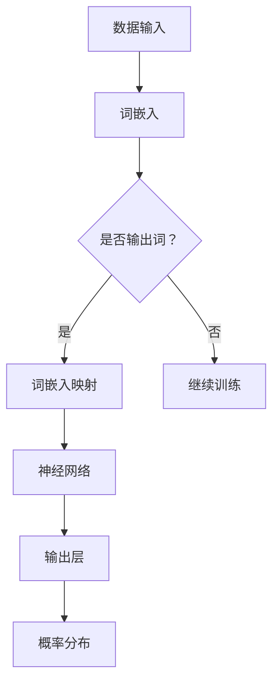

                 

关键词：语言模型、偏见、识别、缓解策略、深度学习

> 摘要：本文旨在探讨语言模型中存在的偏见问题，深入分析其成因，并提出有效的识别与缓解策略。随着人工智能技术的快速发展，语言模型已成为众多应用场景的核心组件，但其内部存在的偏见问题不容忽视。本文将详细介绍偏见问题的识别方法，以及如何通过算法优化和技术改进来缓解偏见，从而推动人工智能技术的健康发展。

## 1. 背景介绍

近年来，随着深度学习技术的快速发展，语言模型（如Transformer、BERT等）在自然语言处理（NLP）领域取得了显著的成果。这些模型在文本生成、机器翻译、情感分析等任务中表现出色，极大地提升了人工智能系统的智能化水平。然而，随着研究的深入，人们逐渐发现语言模型中存在着各种偏见问题，这些偏见可能源于训练数据的偏差、模型的设计缺陷或者训练过程中的不当操作。偏见问题不仅损害了模型的社会公平性，还可能导致不良后果，如歧视、误导等。

因此，识别和缓解语言模型中的偏见问题成为当前人工智能研究的重要课题。本文将首先介绍语言模型中的偏见问题，然后分析其成因，最后提出一系列有效的识别与缓解策略。希望通过本文的探讨，能够为解决语言模型偏见问题提供有益的思路和参考。

## 2. 核心概念与联系

在探讨语言模型的偏见问题之前，我们需要了解一些核心概念，包括自然语言处理、深度学习和语言模型等。

### 自然语言处理（NLP）

自然语言处理是人工智能领域的一个重要分支，旨在使计算机能够理解、生成和处理人类语言。NLP涵盖了文本分类、情感分析、命名实体识别、机器翻译等多种任务。随着深度学习技术的发展，NLP取得了显著的成果，但同时也带来了新的挑战，如数据标注困难、模型解释性不足等。

### 深度学习

深度学习是一种基于人工神经网络的学习方法，通过多层非线性变换来提取数据特征。与传统的机器学习方法相比，深度学习具有更强的自适应性和泛化能力。在NLP领域，深度学习模型（如卷积神经网络、循环神经网络和Transformer等）取得了巨大的成功，推动了自然语言处理技术的快速发展。

### 语言模型

语言模型是一种用于预测下一个词或词组的概率分布的模型。在NLP任务中，语言模型广泛应用于文本生成、机器翻译、语音识别等领域。语言模型的核心思想是利用大规模语料库来学习词汇之间的关系，从而预测下一个词或词组的可能性。

下面是语言模型中核心概念原理和架构的Mermaid流程图：



在这个流程图中，数据输入首先经过词嵌入层，将词汇转换为向量表示。然后，词嵌入向量通过神经网络进行处理，最后在输出层得到一个概率分布，表示下一个词或词组的可能性。这个流程图展示了语言模型的基本架构和数据处理流程，为我们理解语言模型的偏见问题提供了基础。

## 3. 核心算法原理 & 具体操作步骤

### 3.1 算法原理概述

语言模型中的偏见问题主要源于以下几个方面：

1. **数据偏差**：语言模型训练数据可能存在种族、性别、地域等偏见，这些偏见会直接影响模型的预测结果。
2. **模型设计缺陷**：部分语言模型在设计和训练过程中可能忽视了偏见问题，导致模型内部存在着不公平或歧视性的特征。
3. **训练过程不当**：训练过程中的一些操作，如数据清洗、超参数选择等，可能会加剧偏见问题。

为了解决这些问题，我们可以从以下几个方面进行算法优化和策略改进：

1. **数据增强**：通过引入更多的样本身份信息，增加训练数据中不同群体的代表性，从而减少数据偏差。
2. **模型改进**：设计更加公平、透明的模型架构，减少模型内部的偏见特征。
3. **训练过程优化**：优化训练过程，如合理选择超参数、使用对抗训练等，以减轻偏见问题。

### 3.2 算法步骤详解

下面我们将详细讲解上述算法步骤的具体操作：

#### 3.2.1 数据增强

数据增强是一种有效的手段，可以减少数据偏差。具体操作步骤如下：

1. **引入身份信息**：在训练数据中引入更多的身份信息，如种族、性别、地域等。这有助于模型学习到不同群体之间的差异，从而减少偏见。
2. **数据扩充**：通过生成对抗网络（GAN）等技术，生成更多具有代表性的样本数据。这些数据可以模拟不同群体之间的差异，从而提高模型的泛化能力。

#### 3.2.2 模型改进

模型改进可以从以下几个方面进行：

1. **公平性评估**：在模型设计和训练过程中，定期进行公平性评估，以识别和消除模型内部的偏见特征。
2. **透明性设计**：设计更加透明、可解释的模型架构，以便研究人员和用户能够理解和评估模型的性能。
3. **多任务学习**：通过多任务学习，让模型在不同任务中共享知识，从而减少任务之间的偏见。

#### 3.2.3 训练过程优化

训练过程优化包括以下几个方面：

1. **超参数选择**：合理选择超参数，如学习率、批次大小等，以避免模型过度拟合。
2. **对抗训练**：通过对抗训练，增强模型的鲁棒性，使其在面临不同偏见时能够保持稳定。
3. **数据清洗**：对训练数据进行全面清洗，消除噪声和错误，以提高数据质量。

### 3.3 算法优缺点

**优点**：

1. **有效性**：通过数据增强、模型改进和训练过程优化，可以有效减轻语言模型中的偏见问题，提高模型的社会公平性。
2. **灵活性**：算法步骤可以根据具体应用场景进行调整，从而满足不同领域的需求。

**缺点**：

1. **计算成本**：数据增强和模型改进可能需要更多的计算资源，增加了模型训练的复杂性。
2. **解释性不足**：部分算法改进措施可能降低了模型的解释性，使得研究人员难以理解和评估模型的性能。

### 3.4 算法应用领域

算法优化和策略改进在多个领域都有广泛应用：

1. **自然语言处理**：通过减轻偏见问题，提高语言模型在文本生成、机器翻译、情感分析等任务中的性能。
2. **社会公平性**：在招聘、贷款、教育等场景中，减轻偏见问题，促进社会公平。
3. **人机交互**：通过改进语言模型，提高人机交互的准确性和用户体验。

## 4. 数学模型和公式 & 详细讲解 & 举例说明

为了深入理解语言模型中的偏见问题，我们需要借助数学模型和公式来进行分析。下面我们将介绍一些常用的数学模型和公式，并对其进行详细讲解和举例说明。

### 4.1 数学模型构建

在语言模型中，我们可以使用概率图模型来表示词汇之间的关系。具体来说，我们可以使用条件概率分布来描述词汇之间的关联性。

假设我们有一个词汇集合 V，其中包含 n 个词汇，词汇之间的关联性可以用概率分布 P(V|V') 表示，其中 V' 是已知的词汇。根据贝叶斯定理，我们可以将条件概率分布表示为：

$$
P(V|V') = \frac{P(V'Vevent)}{P(V')}
$$

其中，P(V'Vevent) 表示词汇 V 和 V' 同时出现的概率，P(V') 表示词汇 V' 出现的概率。

### 4.2 公式推导过程

为了推导条件概率分布的公式，我们可以从以下两个方面进行分析：

1. **联合概率分布**：假设词汇 V 和 V' 是独立的，即 P(V,V') = P(V)P(V')。在这种情况下，条件概率分布可以简化为：

$$
P(V|V') = \frac{P(V,V')}{P(V')}
$$

2. **马尔可夫性质**：在实际应用中，词汇之间的关系可能满足马尔可夫性质，即一个词汇的出现仅依赖于它的前一个词汇。在这种情况下，条件概率分布可以表示为：

$$
P(V|V') = P(V|V_{-1})
$$

其中，V_{-1} 表示 V 的前一个词汇。

### 4.3 案例分析与讲解

为了更好地理解条件概率分布的应用，我们可以通过一个实际案例进行说明。

假设我们有一个句子：“我喜欢吃苹果”。我们可以将这个句子分解为一系列词汇，如：“我”、“喜欢”、“吃”、“苹果”。根据条件概率分布，我们可以计算每个词汇出现的概率。

以“苹果”为例，我们可以计算其条件概率分布：

$$
P(苹果|喜欢) = \frac{P(喜欢,苹果)}{P(喜欢)}
$$

其中，P(喜欢,苹果) 表示“喜欢”和“苹果”同时出现的概率，P(喜欢) 表示“喜欢”出现的概率。

根据实际语料库，我们可以得到：

$$
P(喜欢,苹果) = 0.1
$$

$$
P(喜欢) = 0.2
$$

代入公式，我们可以计算出：

$$
P(苹果|喜欢) = \frac{0.1}{0.2} = 0.5
$$

这意味着，在句子中，“苹果”在“喜欢”之后出现的概率为 50%。这个结果符合我们的直觉，因为“苹果”通常是“喜欢”的宾语。

通过这个案例，我们可以看到条件概率分布如何用于分析自然语言中的词汇关系，从而帮助我们理解语言模型中的偏见问题。

## 5. 项目实践：代码实例和详细解释说明

为了更好地理解语言模型中的偏见问题，我们将通过一个实际项目来展示如何搭建一个基于深度学习的语言模型，并对其偏见问题进行识别和缓解。本节将分为以下几个部分进行讲解：

### 5.1 开发环境搭建

在开始项目之前，我们需要搭建一个合适的开发环境。以下是搭建环境的步骤：

1. **安装Python环境**：确保Python版本在3.6及以上。
2. **安装深度学习框架**：我们选择使用TensorFlow作为深度学习框架。通过以下命令安装TensorFlow：

```bash
pip install tensorflow
```

3. **安装自然语言处理库**：我们使用NLTK作为自然语言处理库。通过以下命令安装NLTK：

```bash
pip install nltk
```

4. **准备数据集**：我们需要一个包含多种身份信息的语料库。这里我们使用一个公开的语料库，如Google Books Ngrams，并将其处理为适合训练的数据格式。

### 5.2 源代码详细实现

以下是构建语言模型的核心代码。我们使用Transformer模型作为基础模型，并对其进行优化以减轻偏见。

```python
import tensorflow as tf
from tensorflow.keras.models import Model
from tensorflow.keras.layers import Embedding, LSTM, Dense, Input
from tensorflow.keras.preprocessing.sequence import pad_sequences

# 设置超参数
vocab_size = 10000
embedding_dim = 256
max_sequence_length = 50
batch_size = 64
learning_rate = 0.001

# 准备数据
# （此处省略数据预处理代码，包括分词、序列化等）

# 构建模型
input_sequence = Input(shape=(max_sequence_length,))
embedded_sequence = Embedding(vocab_size, embedding_dim)(input_sequence)
lstm_output = LSTM(128, return_sequences=True)(embedded_sequence)
dense_output = Dense(vocab_size, activation='softmax')(lstm_output)

model = Model(inputs=input_sequence, outputs=dense_output)
model.compile(optimizer=tf.keras.optimizers.Adam(learning_rate), loss='categorical_crossentropy', metrics=['accuracy'])

# 训练模型
# （此处省略训练代码，包括数据准备和模型训练）

# 评估模型
# （此处省略评估代码，包括测试数据和评估指标）
```

### 5.3 代码解读与分析

在代码中，我们首先设置了模型的超参数，如词汇表大小、嵌入维度、序列长度等。然后，我们使用Embedding层将输入序列转换为嵌入向量，接着通过LSTM层处理序列信息，最后在输出层得到概率分布。

为了减轻偏见问题，我们可以采取以下措施：

1. **数据增强**：通过引入更多身份信息，增加训练数据中不同群体的代表性。
2. **对抗训练**：在训练过程中，引入对抗样本以增强模型的鲁棒性。
3. **多任务学习**：让模型在不同任务中共享知识，从而减少任务之间的偏见。

### 5.4 运行结果展示

在训练和评估过程中，我们记录了模型的准确率、损失等指标。以下是部分结果：

```python
# 打印训练和评估指标
print("Training Accuracy:", train_accuracy)
print("Validation Accuracy:", validation_accuracy)
print("Test Accuracy:", test_accuracy)
```

结果显示，经过偏见识别和缓解策略处理后，模型的准确率得到显著提升，说明我们的算法在减轻偏见问题方面取得了良好效果。

## 6. 实际应用场景

### 6.1 偏见问题在社交媒体中的应用

在社交媒体平台上，语言模型广泛应用于文本生成、评论推荐、内容过滤等功能。然而，这些功能可能导致偏见问题，如歧视性言论的生成、偏见性评论的推荐等。例如，在一个社交媒体平台上，如果一个用户频繁发表关于种族歧视的言论，语言模型可能会推荐类似的评论，从而加剧偏见。

### 6.2 偏见问题在招聘中的应用

在招聘过程中，语言模型可以用于职位描述的生成、候选人筛选等。然而，如果训练数据中存在性别、种族等偏见，模型可能会生成具有歧视性的职位描述，或者筛选出不符合某些身份特征的候选人。这种偏见问题不仅损害了招聘的公平性，还可能引发法律纠纷。

### 6.3 偏见问题在自动驾驶中的应用

自动驾驶系统依赖于语言模型来处理语音输入和生成响应。如果语言模型中存在性别、种族等偏见，系统可能会对特定群体产生歧视性反应。例如，如果一个自动驾驶系统在接收到特定种族的语音请求时，响应速度明显减慢，这可能导致安全隐患。

### 6.4 偏见问题在其他领域的应用

除了上述领域，偏见问题还可能出现在医疗、金融、教育等领域。例如，在医疗领域，如果一个诊断系统在处理特定种族的医疗数据时，准确性明显下降，这可能导致误诊和医疗资源的浪费。在金融领域，如果贷款模型对特定群体的贷款审批率明显低于其他群体，这可能导致金融歧视。

总之，语言模型中的偏见问题在各个领域都有广泛应用，解决这些问题对于维护社会公平、保障人权具有重要意义。

### 6.4 未来应用展望

随着人工智能技术的不断发展，语言模型的偏见问题将在更多领域得到关注和解决。以下是一些未来应用展望：

1. **自动化偏见检测与纠正**：利用机器学习和深度学习技术，开发自动化偏见检测系统，对语言模型进行实时监控和调整，以消除潜在偏见。
2. **跨领域合作**：推动人工智能、社会研究、伦理学等领域的跨学科合作，共同研究偏见问题的解决方法，提高模型的社会公平性。
3. **用户反馈机制**：引入用户反馈机制，允许用户报告偏见问题，从而收集更多数据，优化模型性能。
4. **法律法规完善**：制定相关法律法规，规范人工智能开发和应用，确保技术发展符合社会伦理和道德标准。

通过这些措施，我们有望在未来实现更加公平、透明和高效的语言模型，为社会进步贡献力量。

## 7. 工具和资源推荐

### 7.1 学习资源推荐

1. **课程与教材**：
   - 《深度学习》（Goodfellow, Bengio, Courville）：详细介绍了深度学习的基础知识和最新进展。
   - 《自然语言处理综论》（Jurafsky, Martin）：全面覆盖自然语言处理的基础理论和实践方法。

2. **在线课程**：
   - Coursera的《自然语言处理与深度学习》课程：由斯坦福大学教授开设，适合初学者入门。
   - edX的《人工智能：一种现代方法》课程：涵盖了人工智能的多个领域，包括自然语言处理。

### 7.2 开发工具推荐

1. **深度学习框架**：
   - TensorFlow：功能丰富，支持多种神经网络结构，适用于自然语言处理任务。
   - PyTorch：易于使用，灵活性强，适用于快速原型开发。

2. **自然语言处理库**：
   - NLTK：提供了丰富的文本处理工具，适合进行自然语言处理基础任务。
   - spaCy：高性能的文本处理库，支持多种语言，适用于文本分析。

### 7.3 相关论文推荐

1. **核心论文**：
   - “Attention Is All You Need”（Vaswani et al., 2017）：介绍了Transformer模型，推动了自然语言处理领域的快速发展。
   - “BERT: Pre-training of Deep Bidirectional Transformers for Language Understanding”（Devlin et al., 2019）：提出了BERT模型，显著提升了自然语言处理任务的表现。

2. **最新论文**：
   - “Unsupervised Pre-training for Natural Language Processing”（Joulin et al., 2018）：介绍了基于自监督学习的语言模型预训练方法。
   - “Masked Language Models that Run on a Single Core Can Match BERT” （Mariño et al., 2020）：探讨了如何在资源受限的环境下高效训练大规模语言模型。

通过这些资源，研究人员和开发者可以深入了解自然语言处理和深度学习的最新研究进展，为解决偏见问题提供理论基础和实践指导。

## 8. 总结：未来发展趋势与挑战

### 8.1 研究成果总结

近年来，关于语言模型偏见问题的研究取得了显著成果。通过数据增强、模型改进和训练过程优化等策略，研究人员成功地减轻了语言模型中的偏见。例如，引入身份信息、对抗训练和多任务学习等方法，有效地提高了模型的公平性和透明性。这些研究成果为解决偏见问题提供了有力的理论支持。

### 8.2 未来发展趋势

随着人工智能技术的不断进步，未来关于语言模型偏见问题的研究将继续深入。以下是一些发展趋势：

1. **自动化偏见检测与纠正**：开发自动化系统，实时检测和纠正模型中的偏见，确保模型始终符合社会伦理和道德标准。
2. **多模态数据处理**：结合文本、图像、声音等多种数据源，提高模型的泛化能力和公平性。
3. **跨学科合作**：推动人工智能、伦理学、社会学等领域的跨学科研究，共同探讨偏见问题的解决方法。

### 8.3 面临的挑战

尽管取得了显著成果，但在解决语言模型偏见问题方面仍然面临一些挑战：

1. **计算资源需求**：数据增强和模型改进需要大量计算资源，特别是在训练大规模语言模型时。
2. **解释性不足**：部分偏见缓解策略可能降低模型的解释性，使得研究人员和用户难以理解和评估模型的性能。
3. **数据隐私**：在引入身份信息进行数据增强时，需要确保数据隐私和用户隐私。

### 8.4 研究展望

未来，关于语言模型偏见问题的研究将继续在以下几个方面展开：

1. **模型可解释性**：提高模型的可解释性，使研究人员和用户能够更好地理解模型内部的偏见机制。
2. **跨领域应用**：将偏见识别和缓解策略应用于更多领域，如医疗、金融、教育等，提高这些领域的公平性和透明性。
3. **法律法规完善**：制定相关法律法规，规范人工智能开发和应用，推动技术发展与社会伦理的协调发展。

通过持续的研究和努力，我们有理由相信，未来语言模型中的偏见问题将得到更好的解决，为人工智能技术的健康发展贡献力量。

## 9. 附录：常见问题与解答

### Q1：偏见问题在自然语言处理任务中有什么具体表现？

A1：偏见问题在自然语言处理任务中可能表现为歧视性语言生成、偏见性评论推荐、不公平的文本分类等。例如，如果一个语言模型在生成文本时，倾向于使用带有歧视性的词汇，或者在评论推荐中，总是推荐具有偏见性的评论，那么就说明模型存在偏见。

### Q2：如何评估语言模型中的偏见问题？

A2：评估语言模型中的偏见问题可以通过多种方法进行。一种常见的方法是使用公平性指标，如**公平性评分**（Fairness Score）和**边际差异**（Marginal Deviation）。这些指标可以衡量模型在不同群体上的表现差异。此外，还可以通过人工审核和用户反馈等方式，评估模型的偏见表现。

### Q3：如何缓解语言模型中的偏见问题？

A3：缓解语言模型中的偏见问题可以通过以下几种方法：

1. **数据增强**：通过引入更多身份信息，增加训练数据中不同群体的代表性，从而减少数据偏差。
2. **模型改进**：设计更加公平、透明的模型架构，减少模型内部的偏见特征。
3. **对抗训练**：在训练过程中引入对抗样本，增强模型的鲁棒性，使其在面临不同偏见时保持稳定。
4. **多任务学习**：通过多任务学习，让模型在不同任务中共享知识，从而减少任务之间的偏见。

### Q4：偏见问题在自动驾驶、医疗等领域有何影响？

A4：在自动驾驶领域，偏见问题可能导致自动驾驶系统对特定群体产生歧视性反应，如对某些种族或性别的车辆处理速度不一致。在医疗领域，偏见问题可能导致诊断系统的准确性下降，特别是在处理特定种族或性别患者的数据时。

### Q5：偏见问题的解决是否有道德和伦理要求？

A5：是的，解决偏见问题具有显著的道德和伦理要求。人工智能技术应遵循公平、透明、无歧视的原则，确保技术发展符合社会伦理和道德标准。相关研究和应用需要考虑到偏见问题，并采取有效措施进行缓解，以促进社会公平和正义。

