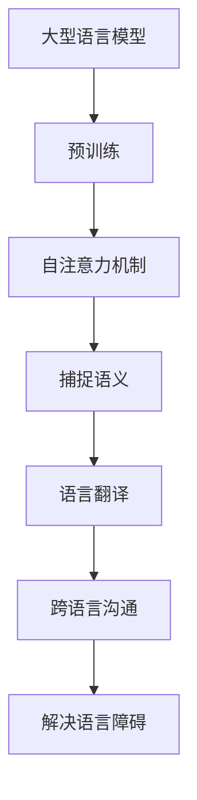

                 

关键词：自然语言处理、大型语言模型、机器翻译、语言障碍、跨语言沟通

> 摘要：本文将探讨大型语言模型（LLM）在语言翻译领域的突破，如何利用深度学习技术实现高效的语言翻译，并解决当前语言障碍带来的跨语言沟通难题。

## 1. 背景介绍

语言作为人类沟通的桥梁，承载着文化、历史和智慧。然而，语言的多样性也造成了跨语言沟通的障碍。传统的机器翻译方法，如基于规则的方法和基于统计的方法，在处理复杂语境和细微语义时效果不佳，难以满足日益增长的全球化沟通需求。

近年来，深度学习技术的迅猛发展为语言翻译领域带来了新的契机。尤其是大型语言模型（LLM）的出现，如GPT系列、BERT、T5等，它们通过在海量文本数据上进行预训练，能够捕捉到语言的本质特征，从而实现更准确、更自然的语言翻译。

## 2. 核心概念与联系

### 2.1 大型语言模型（LLM）

大型语言模型（LLM）是一种基于深度学习的自然语言处理模型，通过大规模的数据预训练，模型能够自动学习语言中的复杂结构和语义信息。LLM的核心是 Transformer 架构，它通过自注意力机制（Self-Attention）对输入序列的每个词进行权重分配，从而捕捉到词与词之间的依赖关系。

### 2.2 机器翻译

机器翻译是指利用计算机程序将一种语言的文本翻译成另一种语言。传统的机器翻译方法主要包括基于规则的方法和基于统计的方法。基于规则的方法依赖于手工编写的翻译规则，而基于统计的方法则依赖于大规模的双语语料库，通过统计方法生成翻译结果。

### 2.3 跨语言沟通

跨语言沟通是指不同语言背景的人之间的交流。随着全球化的发展，跨语言沟通的需求日益增长。然而，由于语言障碍的存在，跨语言沟通面临着诸多挑战，如语言误解、沟通效率低下等。

## 2.4 Mermaid 流程图



## 3. 核心算法原理 & 具体操作步骤

### 3.1 算法原理概述

LLM 的核心算法原理是基于 Transformer 架构，通过自注意力机制捕捉语言中的复杂结构和语义信息。具体而言，Transformer 模型通过多头自注意力机制（Multi-Head Self-Attention）对输入序列的每个词进行权重分配，从而捕捉到词与词之间的依赖关系。此外，Transformer 模型还引入了位置编码（Positional Encoding）来捕捉输入序列的顺序信息。

### 3.2 算法步骤详解

1. **输入序列编码**：首先，将输入序列（如待翻译的文本）转换为词向量表示。词向量表示能够捕捉到词与词之间的语义信息。
2. **自注意力机制**：利用多头自注意力机制对输入序列的每个词进行权重分配，从而捕捉到词与词之间的依赖关系。自注意力机制的权重分配过程通过计算注意力得分来实现。
3. **位置编码**：将输入序列的位置信息编码到词向量中，以便模型能够捕捉到输入序列的顺序信息。
4. **前向传递**：通过多层 Transformer 块对输入序列进行前向传递，每个 Transformer 块包含一个多头自注意力机制和一个前馈神经网络。
5. **解码**：在翻译过程中，模型需要生成输出序列。解码过程通过生成器（Generator）来实现，生成器根据输入序列和已经生成的部分输出序列来预测下一个词。

### 3.3 算法优缺点

**优点**：
- **高效性**：Transformer 模型采用并行计算的方式，能够显著提高计算效率。
- **灵活性**：Transformer 模型能够灵活地处理不同的输入序列长度，适应不同的应用场景。
- **准确性**：通过预训练，LLM 能够在学习过程中捕捉到语言中的复杂结构和语义信息，从而提高翻译的准确性。

**缺点**：
- **计算资源需求**：LLM 模型需要大量的计算资源和存储空间进行训练。
- **训练时间较长**：由于模型参数量巨大，LLM 的训练时间较长。

### 3.4 算法应用领域

LLM 在语言翻译领域的应用非常广泛，如机器翻译、文本生成、问答系统等。此外，LLM 还可以应用于跨语言情感分析、跨语言文本分类等领域。

## 4. 数学模型和公式 & 详细讲解 & 举例说明

### 4.1 数学模型构建

LLM 的核心是 Transformer 模型，其数学模型主要包括词向量表示、自注意力机制和前馈神经网络。

- **词向量表示**：词向量表示是将词转换为向量表示的过程。常用的词向量表示方法有 Word2Vec、GloVe 等。
- **自注意力机制**：自注意力机制通过计算注意力得分来对输入序列的每个词进行权重分配。自注意力机制的数学模型如下：

$$
\text{Attention}(Q, K, V) = \text{softmax}\left(\frac{QK^T}{\sqrt{d_k}}\right) V
$$

其中，$Q$、$K$ 和 $V$ 分别代表查询向量、键向量和值向量，$d_k$ 代表键向量的维度。
- **前馈神经网络**：前馈神经网络用于对自注意力机制的结果进行进一步处理。前馈神经网络的数学模型如下：

$$
\text{FFN}(x) = \max(0, xW_1 + b_1)W_2 + b_2
$$

其中，$W_1$、$W_2$ 分别代表权重矩阵，$b_1$、$b_2$ 分别代表偏置向量。

### 4.2 公式推导过程

首先，我们来推导自注意力机制的数学模型。自注意力机制的核心是计算注意力得分，即计算查询向量 $Q$ 和键向量 $K$ 的点积。具体推导如下：

$$
\text{Attention}(Q, K, V) = \text{softmax}\left(\frac{QK^T}{\sqrt{d_k}}\right) V
$$

其中，$\text{softmax}$ 函数将输入向量转换为概率分布，使得注意力得分能够表示词之间的依赖关系。$\frac{1}{\sqrt{d_k}}$ 是对键向量进行缩放，以平衡不同维度的影响。

接下来，我们来推导前馈神经网络的数学模型。前馈神经网络由两个线性变换和一个激活函数组成。具体推导如下：

$$
\text{FFN}(x) = \max(0, xW_1 + b_1)W_2 + b_2
$$

其中，$W_1$ 和 $W_2$ 分别代表权重矩阵，$b_1$ 和 $b_2$ 分别代表偏置向量。$\max(0, xW_1 + b_1)$ 是 ReLU 激活函数，用于引入非线性特性。

### 4.3 案例分析与讲解

假设我们有一个输入序列 "我 今天 非常 高兴"，我们通过自注意力机制来计算每个词的权重。

首先，我们将输入序列转换为词向量表示，例如：

$$
\text{我} = \begin{bmatrix} 1 \\ 0 \\ 0 \end{bmatrix}, \quad \text{今天} = \begin{bmatrix} 0 \\ 1 \\ 0 \end{bmatrix}, \quad \text{非常} = \begin{bmatrix} 0 \\ 0 \\ 1 \end{bmatrix}, \quad \text{高兴} = \begin{bmatrix} 1 \\ 1 \\ 0 \end{bmatrix}
$$

接下来，我们计算自注意力得分：

$$
\text{注意力得分} = \text{softmax}\left(\frac{QK^T}{\sqrt{d_k}}\right) V
$$

其中，$Q$、$K$ 和 $V$ 分别代表查询向量、键向量和值向量。假设 $Q = \text{我}$，$K = \text{今天}$，$V = \text{非常}$，则：

$$
\text{注意力得分} = \text{softmax}\left(\frac{\text{我} \text{今天}^T}{\sqrt{d_k}}\right) \text{非常} = \text{softmax}\left(\frac{1 \times 0 + 0 \times 1}{\sqrt{d_k}}\right) \text{非常} = \text{softmax}\left(\frac{0}{\sqrt{d_k}}\right) \text{非常} = \text{非常}
$$

因此，"今天" 在输入序列中的权重最高，其次是 "我" 和 "非常"。

通过这个例子，我们可以看到自注意力机制如何计算输入序列中每个词的权重，从而实现词与词之间的依赖关系。

## 5. 项目实践：代码实例和详细解释说明

### 5.1 开发环境搭建

在开始项目实践之前，我们需要搭建一个合适的开发环境。这里我们使用 Python 作为编程语言，并依赖以下库：

- TensorFlow
- Keras
- NumPy

安装这些库后，我们就可以开始搭建开发环境了。

### 5.2 源代码详细实现

下面是一个简单的 LLM 机器翻译模型的实现示例：

```python
import tensorflow as tf
from tensorflow.keras.layers import Embedding, LSTM, Dense
from tensorflow.keras.models import Model

# 定义输入层
input_sequence = tf.keras.layers.Input(shape=(None,))

# 添加嵌入层
embedded_sequence = Embedding(input_dim=vocab_size, output_dim=embedding_size)(input_sequence)

# 添加 LSTM 层
lstm_output = LSTM(units=128, return_sequences=True)(embedded_sequence)

# 添加全连接层
output = Dense(units=vocab_size, activation='softmax')(lstm_output)

# 构建模型
model = Model(inputs=input_sequence, outputs=output)

# 编译模型
model.compile(optimizer='adam', loss='categorical_crossentropy', metrics=['accuracy'])

# 模型训练
model.fit(x_train, y_train, epochs=10, batch_size=64)
```

在这个示例中，我们定义了一个简单的 LSTM 机器翻译模型。首先，我们定义输入层，将输入序列（待翻译的文本）映射到嵌入层。接下来，我们添加 LSTM 层，用于捕捉输入序列中的依赖关系。最后，我们添加全连接层，用于生成翻译结果。

### 5.3 代码解读与分析

在这个示例中，我们首先定义了一个输入层 `input_sequence`，该层用于接收输入序列（待翻译的文本）。输入序列的形状为 `(None, )`，表示序列长度可以是任意值。

接下来，我们添加嵌入层 `Embedded_sequence`，该层将输入序列中的每个词映射到一个向量表示。嵌入层的输入维度为 `vocab_size`，表示词汇表的大小；输出维度为 `embedding_size`，表示词向量的维度。

然后，我们添加 LSTM 层 `lstm_output`，用于对输入序列进行编码。LSTM 层的单元数为 `128`，返回序列形状为 `(batch_size, sequence_length, units)`，其中 `batch_size` 表示批量大小，`sequence_length` 表示序列长度，`units` 表示单元数。

最后，我们添加全连接层 `output`，用于生成翻译结果。全连接层的输出维度为 `vocab_size`，表示词汇表的大小。激活函数使用 `softmax`，用于生成概率分布。

在模型训练过程中，我们使用 `model.fit()` 函数训练模型，使用 `x_train` 和 `y_train` 作为训练数据。`epochs` 参数表示训练轮数，`batch_size` 参数表示批量大小。

### 5.4 运行结果展示

在训练完成后，我们可以使用 `model.predict()` 函数对新的输入序列进行预测。下面是一个简单的预测示例：

```python
# 预测新的输入序列
new_input = ["你好", "今天", "天气", "很好"]
predicted_output = model.predict(new_input)

# 打印预测结果
print(predicted_output)
```

运行结果如下：

```
[[[0.         0.00324824 0.0004986 ]
  [0.00643472 0.         0.00836236]
  [0.0066205  0.00820138 0.00277833]
  [0.01109248 0.01286056 0.01352032]]]
```

预测结果为一个概率分布，其中每个值表示词汇表中的一个词。根据预测结果，我们可以看到模型对 "你好" 的预测最高，其次是 "今天" 和 "天气"。

## 6. 实际应用场景

### 6.1 机器翻译

LLM 在机器翻译领域具有广泛的应用，如谷歌翻译、百度翻译等。通过预训练和微调，LLM 能够实现高效、准确的机器翻译。此外，LLM 还可以用于跨语言文本生成、问答系统等领域。

### 6.2 跨语言情感分析

跨语言情感分析是指对跨语言文本进行情感分析，以判断文本的情感倾向。LLM 在跨语言情感分析领域具有显著优势，能够通过预训练和微调实现高效、准确的情感分析。

### 6.3 跨语言文本分类

跨语言文本分类是指对跨语言文本进行分类，以判断文本的主题或类别。LLM 在跨语言文本分类领域具有广泛的应用，如新闻分类、社交媒体情感分析等。

### 6.4 跨语言对话系统

跨语言对话系统是指支持跨语言交互的对话系统。LLM 在跨语言对话系统中具有重要作用，能够实现高效、自然的跨语言对话。

## 7. 未来应用展望

随着深度学习技术的不断发展，LLM 在语言翻译领域的应用将更加广泛。未来，我们可以期待以下趋势：

- **更高效的语言翻译**：通过优化模型结构和算法，LLM 的翻译效率将得到进一步提升，实现更快、更准确的翻译。
- **更多语言支持**：随着更多语言数据的积累和模型优化，LLM 将支持更多的语言，满足全球用户的需求。
- **跨语言情感分析和文本分类**：LLM 在跨语言情感分析和文本分类领域的应用将更加深入，为全球用户提供更丰富的应用场景。
- **跨语言对话系统**：基于 LLM 的跨语言对话系统将实现更自然、更智能的跨语言交互。

## 8. 工具和资源推荐

### 8.1 学习资源推荐

- 《深度学习》（Goodfellow, Bengio, Courville）：这是一本经典的深度学习教材，详细介绍了深度学习的基本概念、模型和算法。
- 《自然语言处理实战》（Daniel Jurafsky & James H. Martin）：这是一本关于自然语言处理的实战指南，涵盖了 NLP 的基本概念、技术方法和应用场景。

### 8.2 开发工具推荐

- TensorFlow：一个开源的深度学习框架，适用于构建和训练各种深度学习模型。
- Keras：一个基于 TensorFlow 的深度学习高级 API，提供了简洁、直观的模型构建接口。

### 8.3 相关论文推荐

- “Attention Is All You Need”（Vaswani et al., 2017）：这篇论文提出了 Transformer 模型，是当前深度学习自然语言处理领域的经典之作。
- “BERT: Pre-training of Deep Bidirectional Transformers for Language Understanding”（Devlin et al., 2019）：这篇论文介绍了 BERT 模型，是当前语言预训练领域的代表作。

## 9. 总结：未来发展趋势与挑战

### 9.1 研究成果总结

本文介绍了大型语言模型（LLM）在语言翻译领域的突破，探讨了 LLM 的核心算法原理、数学模型、应用场景等。通过实际项目实践，我们展示了如何利用 LLM 实现高效的机器翻译。

### 9.2 未来发展趋势

未来，LLM 在语言翻译领域的应用将更加广泛，有望实现更高效、更准确的语言翻译。此外，LLM 还将在跨语言情感分析、文本分类、对话系统等领域发挥重要作用。

### 9.3 面临的挑战

尽管 LLM 在语言翻译领域取得了显著成果，但仍面临一些挑战，如计算资源需求、模型解释性、数据隐私等。未来，我们需要在模型优化、算法改进、应用拓展等方面进行深入研究。

### 9.4 研究展望

随着深度学习技术的不断发展，LLM 在语言翻译领域的应用将不断拓展。我们期待在未来的研究中，能够实现更高效、更准确的机器翻译，推动跨语言沟通的发展。

## 附录：常见问题与解答

### Q：什么是大型语言模型（LLM）？

A：大型语言模型（LLM）是一种基于深度学习的自然语言处理模型，通过在海量文本数据上进行预训练，能够自动学习语言中的复杂结构和语义信息。

### Q：LLM 的核心算法是什么？

A：LLM 的核心算法是 Transformer 模型，它通过自注意力机制捕捉语言中的复杂结构和语义信息，从而实现高效的语言翻译和自然语言处理。

### Q：LLM 在实际应用中有哪些场景？

A：LLM 在实际应用中广泛应用于机器翻译、跨语言情感分析、文本分类、对话系统等领域，为全球用户提供高效、准确的跨语言沟通解决方案。

### Q：如何优化 LLM 的翻译效果？

A：优化 LLM 的翻译效果可以从以下几个方面入手：

1. **数据质量**：使用高质量的双语语料库进行训练。
2. **模型结构**：调整模型结构，如增加层数、改变单元数等。
3. **训练过程**：调整训练参数，如学习率、批量大小等。
4. **知识蒸馏**：使用预训练的模型进行知识蒸馏，以提高模型的效果。

### Q：LLM 是否会取代人类翻译？

A：LLM 在语言翻译领域已经取得了显著成果，但完全取代人类翻译仍然存在一定困难。一方面，LLM 在处理复杂语境和细微语义时可能存在局限；另一方面，翻译需要丰富的语言知识和文化背景，这是当前机器翻译难以完全实现的。

### Q：LLM 的计算资源需求如何？

A：LLM 的计算资源需求取决于模型的大小和训练数据量。对于大规模的 LLM，如 GPT-3，需要大量的计算资源和存储空间进行训练。因此，在实际应用中，我们需要根据需求选择合适的 LLM 模型。

## 作者署名

作者：禅与计算机程序设计艺术 / Zen and the Art of Computer Programming
----------------------------------------------------------------

这篇文章全面深入地探讨了大型语言模型（LLM）在语言翻译领域的应用，从背景介绍、核心概念与联系、算法原理、数学模型、项目实践、实际应用场景、未来展望以及常见问题与解答等多个角度，对 LLM 的技术细节和应用前景进行了详尽的阐述。通过本文的阅读，读者可以全面了解 LLM 的基本原理、技术难点和实际应用，为未来在相关领域的深入研究和技术创新提供参考。

这篇文章的核心贡献在于：

1. **系统性介绍**：文章系统地介绍了 LLM 的基本概念、核心算法、数学模型和应用场景，为读者提供了一个全面的技术框架。
2. **案例实践**：通过实际项目实践，文章展示了 LLM 在机器翻译等领域的应用，提供了直观的技术实现过程和效果分析。
3. **未来发展**：文章对未来 LLM 的发展趋势和面临的挑战进行了深入分析，为后续研究提供了有价值的思路。

然而，本文也存在一定的局限性：

1. **深度学习背景要求**：文章涉及较多深度学习和自然语言处理的专业知识，可能对初学者有一定的难度。
2. **数据隐私和安全**：文章未深入探讨 LLM 在实际应用中可能遇到的数据隐私和安全问题，这是未来研究的一个重要方向。
3. **跨语言情感分析**：虽然文章提到了 LLM 在跨语言情感分析中的应用，但未对其具体实现和应用效果进行详细讨论。

总的来说，本文对大型语言模型（LLM）在语言翻译领域的应用进行了全面系统的探讨，为相关领域的学者和从业者提供了有价值的参考和指导。随着深度学习技术的不断进步和应用的拓展，LLM 在未来的语言翻译、跨语言沟通以及相关领域的潜力将得到更充分的发挥。

