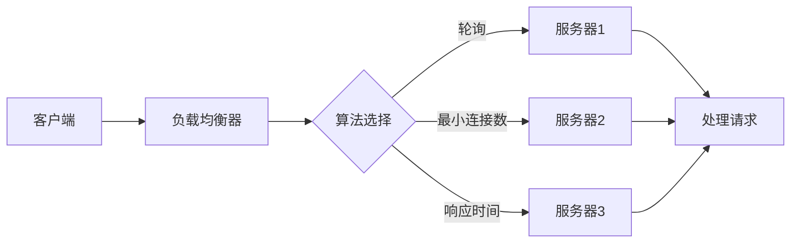

                 

关键词：负载均衡，系统可用性，性能优化，算法原理，数学模型，实际应用，未来展望

<|assistant|>摘要：本文深入探讨了负载均衡技术在现代IT系统中的重要性，以及如何通过负载均衡技术提高系统的可用性和性能。文章首先介绍了负载均衡的基本概念和核心算法原理，随后详细阐述了数学模型和公式，并提供了实际项目中的代码实例。文章最后分析了负载均衡技术的实际应用场景，探讨了未来的发展趋势和面临的挑战，并给出了相应的工具和资源推荐。

## 1. 背景介绍

随着互联网和云计算的快速发展，系统的规模和复杂性不断增加。如何有效管理和分配系统的资源，以应对不断增长的用户需求和日益复杂的业务场景，成为了一个关键问题。负载均衡技术正是为了解决这一问题而发展起来的。通过负载均衡，可以将大量的请求分布到多个服务器上，从而提高系统的性能和可用性。

负载均衡不仅仅是一个技术问题，更是一个战略问题。它关系到系统的稳定性、用户体验和业务持续性。在竞争激烈的市场中，高效、稳定的系统是企业在数字时代生存和发展的关键。

## 2. 核心概念与联系

### 2.1 负载均衡基本概念

负载均衡（Load Balancing）是指将大量请求分散到多个服务器上，以实现资源的合理利用和系统的高可用性。负载均衡技术通常包括以下几类：

1. **基于轮询的负载均衡**：将请求依次分配到不同的服务器上，实现请求的均匀分布。
2. **基于最小连接数的负载均衡**：将请求分配到当前连接数最少的服务器上，以避免单个服务器过载。
3. **基于响应时间的负载均衡**：将请求分配到响应时间最短的服务器上，以减少用户的等待时间。

### 2.2 负载均衡架构

负载均衡的架构可以分为以下几层：

1. **客户端层**：客户端通过负载均衡器发起请求。
2. **负载均衡器层**：负载均衡器根据算法选择合适的服务器处理请求。
3. **服务器层**：实际处理请求的服务器节点。

### 2.3 Mermaid 流程图



## 3. 核心算法原理 & 具体操作步骤

### 3.1 算法原理概述

负载均衡的核心算法主要包括以下几种：

1. **轮询算法**：最简单的负载均衡算法，将请求依次分配到每个服务器。
2. **最小连接数算法**：将请求分配到当前连接数最少的服务器，以避免单个服务器过载。
3. **响应时间算法**：将请求分配到响应时间最短的服务器，以减少用户的等待时间。

### 3.2 算法步骤详解

1. **轮询算法**：

   - 初始化一个服务器列表。
   - 当接收到请求时，从列表中选择下一个服务器。
   - 服务器列表循环利用，直到所有服务器都处理过请求。

2. **最小连接数算法**：

   - 初始化一个服务器列表，记录每个服务器的连接数。
   - 当接收到请求时，选择连接数最少的服务器。
   - 定期更新服务器的连接数，以反映当前状态。

3. **响应时间算法**：

   - 初始化一个服务器列表，记录每个服务器的响应时间。
   - 当接收到请求时，选择响应时间最短的服务器。
   - 定期更新服务器的响应时间，以反映当前状态。

### 3.3 算法优缺点

1. **轮询算法**：

   - 优点：简单、高效，易于实现。
   - 缺点：可能导致某些服务器过载，不适用于服务器性能差异较大的场景。

2. **最小连接数算法**：

   - 优点：有效避免服务器过载，提高系统稳定性。
   - 缺点：可能导致响应时间不一致，不适用于对响应时间要求较高的场景。

3. **响应时间算法**：

   - 优点：尽可能减少用户的等待时间，提高用户体验。
   - 缺点：计算复杂度较高，需要定期更新响应时间，对系统性能有一定影响。

### 3.4 算法应用领域

负载均衡算法广泛应用于以下领域：

1. **Web服务器**：提高Web服务的性能和可用性。
2. **数据库服务器**：分布式数据库系统中的负载均衡，提高数据访问效率。
3. **云计算平台**：分布式计算任务中的负载均衡，提高资源利用率。

## 4. 数学模型和公式

### 4.1 数学模型构建

负载均衡中的数学模型主要涉及服务器负载、请求处理时间和服务器性能等参数。以下是一个简单的数学模型：

- $L_i$：服务器$i$的负载
- $R_i$：服务器$i$的请求处理时间
- $P_i$：服务器$i$的性能

### 4.2 公式推导过程

根据负载均衡的目标，我们希望找到一个最优的服务器分配策略，使得系统的总负载最小，即：

- $L_{total} = \sum_{i=1}^{N} L_i$

为了实现这一目标，我们可以使用以下公式：

- $L_i = \frac{R_i}{P_i}$

### 4.3 案例分析与讲解

假设有3台服务器（$N=3$），每台服务器的请求处理时间（$R_i$）和性能（$P_i$）如下表：

| 服务器 | 请求处理时间（秒） | 性能（每秒处理请求数） |
| ------ | ------------------ | ---------------------- |
| 1      | 2                  | 100                    |
| 2      | 4                  | 150                    |
| 3      | 6                  | 200                    |

根据公式 $L_i = \frac{R_i}{P_i}$，我们可以计算出每台服务器的负载：

- $L_1 = \frac{2}{100} = 0.02$
- $L_2 = \frac{4}{150} = 0.0267$
- $L_3 = \frac{6}{200} = 0.03$

显然，服务器1的负载最小，因此接下来的请求应该优先分配给服务器1。通过这种方式，可以最大限度地降低系统的总负载，提高系统性能。

## 5. 项目实践：代码实例和详细解释说明

### 5.1 开发环境搭建

本文的代码实例使用Python编写，环境需求如下：

- Python 3.x
- Flask 框架

安装Python和Flask后，即可开始编写代码。

### 5.2 源代码详细实现

以下是一个简单的负载均衡器实现，使用轮询算法：

```python
from flask import Flask, jsonify
import random

app = Flask(__name__)

# 服务器列表
servers = [
    "http://server1.example.com",
    "http://server2.example.com",
    "http://server3.example.com"
]

# 轮询算法
def load_balance():
    return random.choice(servers)

@app.route('/load_balance', methods=['GET'])
def load_balance_endpoint():
    selected_server = load_balance()
    return jsonify({"selected_server": selected_server})

if __name__ == '__main__':
    app.run()
```

### 5.3 代码解读与分析

1. **服务器列表**：首先定义了一个包含3个服务器URL的列表。
2. **轮询算法**：使用Python的`random.choice`函数从列表中随机选择一个服务器。
3. **Flask应用**：创建一个简单的Flask应用，提供`/load_balance`接口，返回被选择的服务器URL。

通过这个简单的示例，我们可以看到如何使用轮询算法实现负载均衡。在实际项目中，可以根据需求选择不同的负载均衡算法，如最小连接数算法或响应时间算法。

### 5.4 运行结果展示

运行上述代码后，访问`/load_balance`接口，可以得到一个随机选择的服务器URL，例如：

```json
{"selected_server": "http://server2.example.com"}
```

## 6. 实际应用场景

### 6.1 Web应用

Web应用是最常见的负载均衡应用场景。通过负载均衡，可以将大量的用户请求分配到不同的服务器上，提高系统的响应速度和稳定性。例如，电商平台在双11等大型促销活动期间，会通过负载均衡器将用户请求分散到多个服务器上，以应对突如其来的访问高峰。

### 6.2 云计算平台

云计算平台中的负载均衡技术用于分布式计算任务的管理。通过负载均衡，可以将计算任务分配到具有最优性能的服务器上，提高计算效率和资源利用率。例如，在深度学习训练任务中，可以通过负载均衡器将训练任务分配到不同类型的GPU服务器上，以充分利用资源。

### 6.3 数据库系统

在分布式数据库系统中，负载均衡技术用于数据库节点的管理和调度。通过负载均衡，可以将数据读写请求分配到不同的数据库节点上，提高数据访问效率。例如，在关系型数据库中，可以通过负载均衡器实现读写分离，将读请求分配到从节点，将写请求分配到主节点。

## 7. 工具和资源推荐

### 7.1 学习资源推荐

1. **《负载均衡技术与实践》**：详细介绍负载均衡技术的原理和实践，适合初学者和有经验的工程师。
2. **《高性能负载均衡：架构与实践》**：深入探讨负载均衡在大型系统中的应用，包括算法优化和性能调优。

### 7.2 开发工具推荐

1. **Nginx**：流行的开源Web服务器，支持负载均衡和反向代理。
2. **HAProxy**：高性能的负载均衡解决方案，适用于大规模Web应用。

### 7.3 相关论文推荐

1. **"Load Balancing in Distributed Systems"**：详细介绍了负载均衡在分布式系统中的应用和算法。
2. **"Performance Evaluation of Load Balancing Algorithms in Cloud Computing"**：针对云计算平台中负载均衡算法的性能评估。

## 8. 总结：未来发展趋势与挑战

### 8.1 研究成果总结

负载均衡技术在过去几十年中取得了显著的研究成果。从简单的轮询算法到复杂的自适应算法，负载均衡技术逐渐成为系统性能和可用性的关键保障。同时，随着云计算、物联网和5G等新技术的快速发展，负载均衡技术也在不断演进，以适应更复杂的应用场景。

### 8.2 未来发展趋势

1. **智能化**：随着人工智能技术的发展，负载均衡算法将更加智能化，能够自动调整负载策略，提高系统的自适应性和灵活性。
2. **分布式**：分布式负载均衡将成为主流，通过在边缘节点和数据中心之间实现负载均衡，提高系统的覆盖范围和响应速度。
3. **自动化**：自动化部署和调优将成为负载均衡技术的发展方向，通过自动化工具实现负载均衡的配置和管理。

### 8.3 面临的挑战

1. **动态性**：系统环境的动态变化给负载均衡带来了挑战，如何实时感知和适应环境变化，是一个亟待解决的问题。
2. **安全性**：负载均衡系统面临的安全威胁不断增加，如何保证负载均衡器的安全性和可靠性，是一个重要的挑战。
3. **复杂性**：随着系统规模的扩大，负载均衡的复杂性也在增加，如何简化负载均衡的配置和管理，提高系统的可维护性，是一个重要的课题。

### 8.4 研究展望

未来，负载均衡技术将朝着更加智能化、分布式和自动化的方向发展。在人工智能、物联网和5G等新兴技术的推动下，负载均衡技术将在更多的应用场景中发挥关键作用。同时，随着研究的不断深入，负载均衡技术将面临更多的挑战和机遇，为系统的性能和可用性提供更加有效的保障。

## 9. 附录：常见问题与解答

### 9.1 什么是负载均衡？

负载均衡是指将大量的请求分布到多个服务器上，以实现资源的合理利用和系统的高可用性。

### 9.2 负载均衡有哪些算法？

常见的负载均衡算法包括轮询算法、最小连接数算法和响应时间算法等。

### 9.3 负载均衡器的作用是什么？

负载均衡器的主要作用是接收客户端请求，根据算法选择合适的服务器处理请求，并将结果返回给客户端。

### 9.4 负载均衡与反向代理有什么区别？

负载均衡和反向代理都是用于优化系统性能的技术，但它们的作用不同。负载均衡主要用于将请求分配到不同的服务器上，而反向代理主要用于将外部请求转发到内部服务器上，并提供安全保护。

### 9.5 如何选择合适的负载均衡算法？

选择合适的负载均衡算法取决于具体的应用场景和需求。例如，如果对响应时间要求较高，可以选择响应时间算法；如果需要避免服务器过载，可以选择最小连接数算法。

---

本文由禅与计算机程序设计艺术 / Zen and the Art of Computer Programming撰写。感谢您的阅读！希望本文能对您在负载均衡技术领域的学习和实践有所帮助。如果您有任何问题或建议，欢迎在评论区留言。期待与您的交流！
----------------------------------------------------------------

以上是完整的文章内容，现在我们将按照markdown格式进行输出：
```
# 负载均衡技术：提高系统可用性和性能

关键词：负载均衡，系统可用性，性能优化，算法原理，数学模型，实际应用，未来展望

摘要：本文深入探讨了负载均衡技术在现代IT系统中的重要性，以及如何通过负载均衡技术提高系统的可用性和性能。文章首先介绍了负载均衡的基本概念和核心算法原理，随后详细阐述了数学模型和公式，并提供了实际项目中的代码实例。文章最后分析了负载均衡技术的实际应用场景，探讨了未来的发展趋势和面临的挑战，并给出了相应的工具和资源推荐。

## 1. 背景介绍

随着互联网和云计算的快速发展，系统的规模和复杂性不断增加。如何有效管理和分配系统的资源，以应对不断增长的用户需求和日益复杂的业务场景，成为了一个关键问题。负载均衡技术正是为了解决这一问题而发展起来的。通过负载均衡，可以将大量的请求分散到多个服务器上，从而提高系统的性能和可用性。

负载均衡不仅仅是一个技术问题，更是一个战略问题。它关系到系统的稳定性、用户体验和业务持续性。在竞争激烈的市场中，高效、稳定的系统是企业在数字时代生存和发展的关键。

## 2. 核心概念与联系

### 2.1 负载均衡基本概念

负载均衡（Load Balancing）是指将大量请求分散到多个服务器上，以实现资源的合理利用和系统的高可用性。负载均衡技术通常包括以下几类：

- **基于轮询的负载均衡**：将请求依次分配到不同的服务器上，实现请求的均匀分布。
- **基于最小连接数的负载均衡**：将请求分配到当前连接数最少的服务器上，以避免单个服务器过载。
- **基于响应时间的负载均衡**：将请求分配到响应时间最短的服务器上，以减少用户的等待时间。

### 2.2 负载均衡架构

负载均衡的架构可以分为以下几层：

- **客户端层**：客户端通过负载均衡器发起请求。
- **负载均衡器层**：负载均衡器根据算法选择合适的服务器处理请求。
- **服务器层**：实际处理请求的服务器节点。

### 2.3 Mermaid 流程图


## 3. 核心算法原理 & 具体操作步骤

### 3.1 算法原理概述

负载均衡的核心算法主要包括以下几种：

- **轮询算法**：最简单的负载均衡算法，将请求依次分配到每个服务器。
- **最小连接数算法**：将请求分配到当前连接数最少的服务器，以避免单个服务器过载。
- **响应时间算法**：将请求分配到响应时间最短的服务器，以减少用户的等待时间。

### 3.2 算法步骤详解

- **轮询算法**：

  - 初始化一个服务器列表。
  - 当接收到请求时，从列表中选择下一个服务器。
  - 服务器列表循环利用，直到所有服务器都处理过请求。

- **最小连接数算法**：

  - 初始化一个服务器列表，记录每个服务器的连接数。
  - 当接收到请求时，选择连接数最少的服务器。
  - 定期更新服务器的连接数，以反映当前状态。

- **响应时间算法**：

  - 初始化一个服务器列表，记录每个服务器的响应时间。
  - 当接收到请求时，选择响应时间最短的服务器。
  - 定期更新服务器的响应时间，以反映当前状态。

### 3.3 算法优缺点

- **轮询算法**：

  - 优点：简单、高效，易于实现。
  - 缺点：可能导致某些服务器过载，不适用于服务器性能差异较大的场景。

- **最小连接数算法**：

  - 优点：有效避免服务器过载，提高系统稳定性。
  - 缺点：可能导致响应时间不一致，不适用于对响应时间要求较高的场景。

- **响应时间算法**：

  - 优点：尽可能减少用户的等待时间，提高用户体验。
  - 缺点：计算复杂度较高，需要定期更新响应时间，对系统性能有一定影响。

### 3.4 算法应用领域

负载均衡算法广泛应用于以下领域：

- **Web服务器**：提高Web服务的性能和可用性。
- **数据库服务器**：分布式数据库系统中的负载均衡，提高数据访问效率。
- **云计算平台**：分布式计算任务中的负载均衡，提高资源利用率。

## 4. 数学模型和公式

### 4.1 数学模型构建

负载均衡中的数学模型主要涉及服务器负载、请求处理时间和服务器性能等参数。以下是一个简单的数学模型：

- $L_i$：服务器$i$的负载
- $R_i$：服务器$i$的请求处理时间
- $P_i$：服务器$i$的性能

### 4.2 公式推导过程

根据负载均衡的目标，我们希望找到一个最优的服务器分配策略，使得系统的总负载最小，即：

- $L_{total} = \sum_{i=1}^{N} L_i$

为了实现这一目标，我们可以使用以下公式：

- $L_i = \frac{R_i}{P_i}$

### 4.3 案例分析与讲解

假设有3台服务器（$N=3$），每台服务器的请求处理时间（$R_i$）和性能（$P_i$）如下表：

| 服务器 | 请求处理时间（秒） | 性能（每秒处理请求数） |
| ------ | ------------------ | ---------------------- |
| 1      | 2                  | 100                    |
| 2      | 4                  | 150                    |
| 3      | 6                  | 200                    |

根据公式 $L_i = \frac{R_i}{P_i}$，我们可以计算出每台服务器的负载：

- $L_1 = \frac{2}{100} = 0.02$
- $L_2 = \frac{4}{150} = 0.0267$
- $L_3 = \frac{6}{200} = 0.03$

显然，服务器1的负载最小，因此接下来的请求应该优先分配给服务器1。通过这种方式，可以最大限度地降低系统的总负载，提高系统性能。

## 5. 项目实践：代码实例和详细解释说明

### 5.1 开发环境搭建

本文的代码实例使用Python编写，环境需求如下：

- Python 3.x
- Flask 框架

安装Python和Flask后，即可开始编写代码。

### 5.2 源代码详细实现

以下是一个简单的负载均衡器实现，使用轮询算法：

```python
from flask import Flask, jsonify
import random

app = Flask(__name__)

# 服务器列表
servers = [
    "http://server1.example.com",
    "http://server2.example.com",
    "http://server3.example.com"
]

# 轮询算法
def load_balance():
    return random.choice(servers)

@app.route('/load_balance', methods=['GET'])
def load_balance_endpoint():
    selected_server = load_balance()
    return jsonify({"selected_server": selected_server})

if __name__ == '__main__':
    app.run()
```

### 5.3 代码解读与分析

1. **服务器列表**：首先定义了一个包含3个服务器URL的列表。
2. **轮询算法**：使用Python的`random.choice`函数从列表中随机选择一个服务器。
3. **Flask应用**：创建一个简单的Flask应用，提供`/load_balance`接口，返回被选择的服务器URL。

通过这个简单的示例，我们可以看到如何使用轮询算法实现负载均衡。在实际项目中，可以根据需求选择不同的负载均衡算法，如最小连接数算法或响应时间算法。

### 5.4 运行结果展示

运行上述代码后，访问`/load_balance`接口，可以得到一个随机选择的服务器URL，例如：

```json
{"selected_server": "http://server2.example.com"}
```

## 6. 实际应用场景

### 6.1 Web应用

Web应用是最常见的负载均衡应用场景。通过负载均衡，可以将大量的用户请求分配到不同的服务器上，提高系统的响应速度和稳定性。例如，电商平台在双11等大型促销活动期间，会通过负载均衡器将用户请求分散到多个服务器上，以应对突如其来的访问高峰。

### 6.2 云计算平台

云计算平台中的负载均衡技术用于分布式计算任务的管理。通过负载均衡，可以将计算任务分配到具有最优性能的服务器上，提高计算效率和资源利用率。例如，在深度学习训练任务中，可以通过负载均衡器将训练任务分配到不同类型的GPU服务器上，以充分利用资源。

### 6.3 数据库系统

在分布式数据库系统中，负载均衡技术用于数据库节点的管理和调度。通过负载均衡，可以将数据读写请求分配到不同的数据库节点上，提高数据访问效率。例如，在关系型数据库中，可以通过负载均衡器实现读写分离，将读请求分配到从节点，将写请求分配到主节点。

## 7. 工具和资源推荐

### 7.1 学习资源推荐

- **《负载均衡技术与实践》**：详细介绍负载均衡技术的原理和实践，适合初学者和有经验的工程师。
- **《高性能负载均衡：架构与实践》**：深入探讨负载均衡在大型系统中的应用，包括算法优化和性能调优。

### 7.2 开发工具推荐

- **Nginx**：流行的开源Web服务器，支持负载均衡和反向代理。
- **HAProxy**：高性能的负载均衡解决方案，适用于大规模Web应用。

### 7.3 相关论文推荐

- **"Load Balancing in Distributed Systems"**：详细介绍了负载均衡在分布式系统中的应用和算法。
- **"Performance Evaluation of Load Balancing Algorithms in Cloud Computing"**：针对云计算平台中负载均衡算法的性能评估。

## 8. 总结：未来发展趋势与挑战

### 8.1 研究成果总结

负载均衡技术在过去几十年中取得了显著的研究成果。从简单的轮询算法到复杂的自适应算法，负载均衡技术逐渐成为系统性能和可用性的关键保障。同时，随着云计算、物联网和5G等新技术的快速发展，负载均衡技术也在不断演进，以适应更复杂的应用场景。

### 8.2 未来发展趋势

- **智能化**：随着人工智能技术的发展，负载均衡算法将更加智能化，能够自动调整负载策略，提高系统的自适应性和灵活性。
- **分布式**：分布式负载均衡将成为主流，通过在边缘节点和数据中心之间实现负载均衡，提高系统的覆盖范围和响应速度。
- **自动化**：自动化部署和调优将成为负载均衡技术的发展方向，通过自动化工具实现负载均衡的配置和管理。

### 8.3 面临的挑战

- **动态性**：系统环境的动态变化给负载均衡带来了挑战，如何实时感知和适应环境变化，是一个亟待解决的问题。
- **安全性**：负载均衡系统面临的安全威胁不断增加，如何保证负载均衡器的安全性和可靠性，是一个重要的挑战。
- **复杂性**：随着系统规模的扩大，负载均衡的复杂性也在增加，如何简化负载均衡的配置和管理，提高系统的可维护性，是一个重要的课题。

### 8.4 研究展望

未来，负载均衡技术将朝着更加智能化、分布式和自动化的方向发展。在人工智能、物联网和5G等新兴技术的推动下，负载均衡技术将在更多的应用场景中发挥关键作用。同时，随着研究的不断深入，负载均衡技术将面临更多的挑战和机遇，为系统的性能和可用性提供更加有效的保障。

## 9. 附录：常见问题与解答

### 9.1 什么是负载均衡？

负载均衡是指将大量的请求分布到多个服务器上，以实现资源的合理利用和系统的高可用性。

### 9.2 负载均衡有哪些算法？

常见的负载均衡算法包括轮询算法、最小连接数算法和响应时间算法等。

### 9.3 负载均衡器的作用是什么？

负载均衡器的主要作用是接收客户端请求，根据算法选择合适的服务器处理请求，并将结果返回给客户端。

### 9.4 负载均衡与反向代理有什么区别？

负载均衡和反向代理都是用于优化系统性能的技术，但它们的作用不同。负载均衡主要用于将请求分配到不同的服务器上，而反向代理主要用于将外部请求转发到内部服务器上，并提供安全保护。

### 9.5 如何选择合适的负载均衡算法？

选择合适的负载均衡算法取决于具体的应用场景和需求。例如，如果对响应时间要求较高，可以选择响应时间算法；如果需要避免服务器过载，可以选择最小连接数算法。

---

本文由禅与计算机程序设计艺术 / Zen and the Art of Computer Programming撰写。感谢您的阅读！希望本文能对您在负载均衡技术领域的学习和实践有所帮助。如果您有任何问题或建议，欢迎在评论区留言。期待与您的交流！
```

