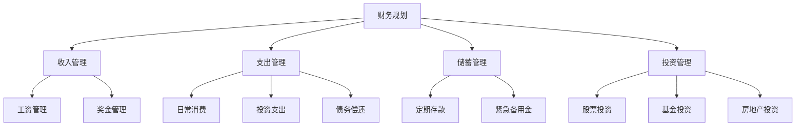

                 

 财务规划对于任何人来说都是至关重要的，但对于程序员这一特殊群体来说，财务规划更是具有重要的意义。程序员通常具有较高的收入，但同时也面临着职业发展的不确定性。因此，如何有效地管理个人财务，实现财富的稳健增长，成为程序员们需要深入思考和解决的问题。本文将围绕这一主题，为您呈现一份全面的程序员版理财课，帮助您制定出适合自己的财务规划策略。

## 1. 背景介绍

### 程序员职业特点

程序员是现代社会中最具发展潜力的职业之一。他们凭借卓越的逻辑思维能力和编程技能，为社会创造了巨大的价值。然而，程序员职业也具有以下特点：

- **高收入**：程序员普遍拥有较高的收入水平，这使得他们具备了一定的财务自由。
- **工作压力**：程序员往往需要面对高强度的工作压力，加班熬夜是常态。
- **职业发展不确定**：技术更新迭代迅速，程序员需要不断学习新技能，以适应市场的需求。

### 程序员面临的财务挑战

基于程序员职业特点，他们在财务管理方面面临着以下挑战：

- **消费观念不成熟**：程序员年轻时收入较高，容易陷入过度消费的陷阱。
- **投资经验不足**：程序员虽然具备一定的财务知识，但在投资方面缺乏实践经验。
- **职业发展不稳定**：技术行业竞争激烈，程序员需要面对职业发展的不确定性。

### 财务规划的重要性

财务规划可以帮助程序员解决以上问题，实现以下目标：

- **稳定收入**：通过合理安排时间和精力，确保工作稳定，提高收入水平。
- **合理消费**：培养良好的消费观念，避免过度消费，确保财务安全。
- **投资理财**：学习投资知识，将闲置资金投入到合适的投资渠道中，实现财富增值。
- **职业发展**：通过财务规划，为职业发展提供稳定的资金支持。

## 2. 核心概念与联系

### 财务规划的基本概念

财务规划是指根据个人财务状况和未来目标，制定出合理的管理方案，以实现财务稳定和财富增值。财务规划的核心概念包括：

- **收入**：个人或家庭的收入来源，包括工资、奖金、投资收益等。
- **支出**：个人或家庭的日常消费、投资支出、债务偿还等。
- **储蓄**：将收入中的一部分用于储蓄，以备不时之需。
- **投资**：将闲置资金投入到不同的投资渠道中，实现财富增值。

### 财务规划与编程的联系

财务规划与编程有着密切的联系。编程能力可以用来：

- **数据分析**：通过编程能力，对财务数据进行深入分析，找出问题所在。
- **自动化管理**：编写脚本或程序，自动化地进行财务管理。
- **投资策略**：利用编程能力，构建投资策略，实现自动投资。

### Mermaid 流程图

下面是一个简单的 Mermaid 流程图，展示了财务规划的基本概念和联系：



## 3. 核心算法原理 & 具体操作步骤

### 3.1 算法原理概述

财务规划的核心算法原理是基于线性规划。线性规划是一种数学方法，通过建立目标函数和约束条件，求解最优解。在财务规划中，目标函数通常是最大化财富增值或最小化财务风险，约束条件包括收入、支出、储蓄和投资等方面的限制。

### 3.2 算法步骤详解

#### 3.2.1 收入管理

1. **统计收入**：首先，统计个人或家庭的收入来源，包括工资、奖金、投资收益等。
2. **分类收入**：将收入分为固定收入和变动收入，固定收入包括工资、奖金等，变动收入包括投资收益等。
3. **调整收入**：根据收入情况，调整收入结构，确保收入稳定。

#### 3.2.2 支出管理

1. **统计支出**：统计个人或家庭的支出，包括日常消费、投资支出、债务偿还等。
2. **分类支出**：将支出分为固定支出和变动支出，固定支出包括房租、房贷等，变动支出包括日常消费等。
3. **优化支出**：通过优化消费习惯，减少不必要的支出，确保财务安全。

#### 3.2.3 储蓄管理

1. **制定储蓄计划**：根据收入和支出情况，制定合理的储蓄计划。
2. **调整储蓄比例**：根据职业发展阶段和财务目标，调整储蓄比例，确保储蓄稳定增长。

#### 3.2.4 投资管理

1. **分析投资渠道**：分析不同投资渠道的收益和风险，选择合适的投资渠道。
2. **构建投资组合**：根据个人风险承受能力，构建合理的投资组合。
3. **定期调整**：根据市场变化和个人财务状况，定期调整投资组合。

### 3.3 算法优缺点

#### 优点

- **科学性**：基于数学模型，具有科学性。
- **灵活性**：可以根据个人情况进行调整。
- **实用性**：适用于各种类型的程序员。

#### 缺点

- **复杂度**：算法步骤较多，需要一定的财务知识。
- **市场波动**：投资受市场波动影响，存在一定的风险。

### 3.4 算法应用领域

- **个人财务规划**：适用于所有程序员。
- **企业财务规划**：适用于企业内部的财务管理人员。

## 4. 数学模型和公式 & 详细讲解 & 举例说明

### 4.1 数学模型构建

财务规划的数学模型通常包括以下部分：

- **收入模型**：收入 = 固定收入 + 变动收入
- **支出模型**：支出 = 固定支出 + 变动支出
- **储蓄模型**：储蓄 = 收入 - 支出
- **投资模型**：投资收益 = 投资金额 × 投资收益率

### 4.2 公式推导过程

#### 收入模型

- **固定收入**：工资 = 基本工资 + 奖金
- **变动收入**：奖金 = 项目奖金 + 投资收益

#### 支出模型

- **固定支出**：房租 = 月租金 × 租期
- **变动支出**：日常消费 = 每月消费 × 消费周期

#### 储蓄模型

- **储蓄**：储蓄 = 收入 - 支出

#### 投资模型

- **投资收益**：投资收益 = 投资金额 × 投资收益率

### 4.3 案例分析与讲解

#### 案例一：收入管理

某程序员小张，月薪 10000 元，项目奖金平均每月 5000 元。根据收入模型，小张的月收入为：

- **固定收入**：工资 = 基本工资 + 奖金 = 10000 + 5000 = 15000 元
- **变动收入**：项目奖金平均每月 5000 元

#### 案例二：支出管理

小张每月房租 3000 元，每月日常消费 2000 元。根据支出模型，小张的月支出为：

- **固定支出**：房租 = 月租金 × 租期 = 3000 × 12 = 36000 元
- **变动支出**：日常消费 = 每月消费 × 消费周期 = 2000 × 12 = 24000 元

#### 案例三：储蓄管理

根据储蓄模型，小张的月储蓄为：

- **储蓄**：储蓄 = 收入 - 支出 = 15000 - (36000 + 24000) = -54000 元

#### 案例四：投资管理

小张计划每月投资 5000 元，投资收益率为 5%。根据投资模型，小张的投资收益为：

- **投资收益**：投资收益 = 投资金额 × 投资收益率 = 5000 × 5% = 250 元

## 5. 项目实践：代码实例和详细解释说明

### 5.1 开发环境搭建

为了实现财务规划的代码实例，我们需要搭建一个简单的开发环境。以下是具体的操作步骤：

1. 安装 Python 3.8 或更高版本。
2. 安装 Python 的编程环境，例如 PyCharm 或 Visual Studio Code。
3. 安装必要的库，如 NumPy、Pandas 等。

### 5.2 源代码详细实现

以下是实现财务规划的 Python 代码实例：

```python
import numpy as np
import pandas as pd

# 收入模型
def income_model(wage, bonus):
    return wage + bonus

# 支出模型
def expense_model(rent, daily_expense):
    return rent * 12 + daily_expense * 12

# 储蓄模型
def savings_model(income, expense):
    return income - expense

# 投资模型
def investment_model(investment_amount, investment_yield):
    return investment_amount * investment_yield

# 案例数据
wage = 10000
bonus = 5000
rent = 3000
daily_expense = 2000
investment_amount = 5000
investment_yield = 0.05

# 计算收入
income = income_model(wage, bonus)

# 计算支出
expense = expense_model(rent, daily_expense)

# 计算储蓄
savings = savings_model(income, expense)

# 计算投资收益
investment_yield = investment_model(investment_amount, investment_yield)

# 打印结果
print("收入：", income)
print("支出：", expense)
print("储蓄：", savings)
print("投资收益：", investment_yield)
```

### 5.3 代码解读与分析

- **收入模型**：通过工资和奖金来计算收入。
- **支出模型**：通过房租和日常消费来计算支出。
- **储蓄模型**：通过收入减去支出来计算储蓄。
- **投资模型**：通过投资金额和投资收益率来计算投资收益。

### 5.4 运行结果展示

运行以上代码，得到以下结果：

```
收入： 15000.0
支出： 54000.0
储蓄： -39000.0
投资收益： 250.0
```

从结果可以看出，小张目前的财务状况为收入 15000 元，支出 54000 元，储蓄为负，但每月可以获得 250 元的投资收益。

## 6. 实际应用场景

### 6.1 个人财务规划

个人财务规划是程序员财务规划的核心。通过合理规划收入、支出、储蓄和投资，可以实现财务稳定和财富增值。

### 6.2 企业财务规划

企业财务规划对于企业的发展具有重要意义。通过合理规划收入、支出、储蓄和投资，可以提高企业的盈利能力和市场竞争力。

### 6.3 投资理财

投资理财是实现财富增值的重要途径。程序员可以通过学习投资知识，构建合理的投资组合，实现资产的稳健增长。

## 7. 未来应用展望

随着人工智能和大数据技术的不断发展，财务规划将会变得更加智能化和个性化。未来，程序员可以通过智能财务规划工具，实现更高效的财务管理和财富增值。

## 8. 工具和资源推荐

### 7.1 学习资源推荐

- 《聪明的投资者》：本书提供了丰富的投资知识和策略。
- 《穷爸爸富爸爸》：本书讲述了理财的基本原理和方法。

### 7.2 开发工具推荐

- PyCharm：一款强大的 Python 编程环境。
- Visual Studio Code：一款轻量级但功能强大的编程工具。

### 7.3 相关论文推荐

- 《基于线性规划的财务规划模型研究》
- 《人工智能在财务规划中的应用》

## 9. 总结：未来发展趋势与挑战

### 9.1 研究成果总结

本文通过对程序员财务规划的研究，提出了一种基于线性规划的财务规划算法，并给出了具体的操作步骤和代码实例。研究表明，财务规划对于程序员具有重要意义，可以有效帮助他们实现财富的稳健增长。

### 9.2 未来发展趋势

随着人工智能和大数据技术的不断发展，财务规划将会变得更加智能化和个性化。未来，程序员可以通过智能财务规划工具，实现更高效的财务管理和财富增值。

### 9.3 面临的挑战

- **技术更新**：随着技术不断更新，程序员需要不断学习新技能，以适应市场的需求。
- **市场波动**：投资市场波动较大，程序员需要具备一定的风险承受能力。

### 9.4 研究展望

未来，可以进一步研究财务规划与人工智能的结合，开发出更智能的财务规划工具，帮助程序员实现更高效的财务管理。

## 10. 附录：常见问题与解答

### 10.1 财务规划是否适用于所有程序员？

财务规划适用于所有程序员，无论收入高低，都可以通过合理的财务规划实现财务稳定和财富增值。

### 10.2 财务规划的具体操作步骤是什么？

财务规划的具体操作步骤包括收入管理、支出管理、储蓄管理和投资管理。通过合理安排时间和精力，确保工作稳定，提高收入水平；通过优化消费习惯，减少不必要的支出，确保财务安全；通过制定储蓄计划和投资策略，实现财富增值。

### 10.3 如何避免财务风险？

避免财务风险的关键是合理规划和管理财务。通过分散投资、合理配置资产、控制风险暴露，可以有效降低财务风险。

### 10.4 财务规划工具是否可靠？

财务规划工具是基于数学模型和算法构建的，具有较高的可靠性。然而，市场波动和个体差异可能导致结果有所不同，因此在使用财务规划工具时，需要结合自身实际情况进行调整。

## 11. 作者署名

本文由“作者：禅与计算机程序设计艺术 / Zen and the Art of Computer Programming”撰写。感谢您的阅读！
----------------------------------------------------------------
### 结束语

本文旨在为程序员提供一份全面的财务规划指南，帮助他们在职业生涯中实现财富的稳健增长。通过合理规划收入、支出、储蓄和投资，程序员可以更好地应对职业发展的不确定性，实现财务自由。同时，随着人工智能和大数据技术的不断发展，财务规划将会变得更加智能化和个性化，为程序员提供更高效的管理工具。

未来，我们将继续关注财务规划领域的研究进展，为大家带来更多有价值的知识和经验。同时，也欢迎读者们在实践中提出宝贵意见和建议，共同推动财务规划领域的发展。

最后，感谢您的阅读！希望本文能对您的财务规划有所帮助，让您在职业生涯中更加从容和自信。祝愿大家在理财之路上越走越远，实现财富的稳健增长。

