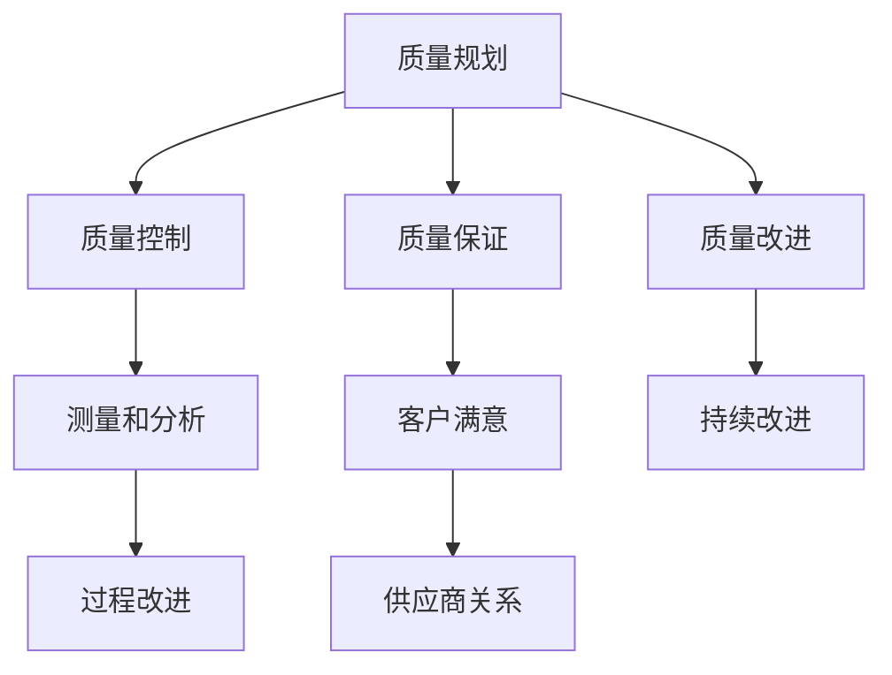

                 

在当今这个技术飞速发展的时代，质量管理成为企业发展不可或缺的一环。全面质量管理（TQM）作为一种系统性的方法，能够帮助企业提升产品和服务质量，增强市场竞争力。本文将深入探讨全面质量管理在IT领域的应用，旨在为读者提供一个全面的质量管理指南。

## 关键词

- 质量管理
- 全面质量管理（TQM）
- IT领域
- 质量控制
- 质量改进
- 质量体系

## 摘要

本文旨在介绍全面质量管理（TQM）的概念及其在IT领域的应用。通过阐述TQM的核心原则、实施步骤和成功案例，帮助读者了解如何通过TQM提升企业的产品质量和服务水平。文章还将探讨TQM在未来的发展趋势和面临的挑战。

### 1. 背景介绍

随着全球经济的快速发展和市场竞争的加剧，质量管理的重要性日益凸显。传统的质量管理方法侧重于对产品和服务进行控制，而全面质量管理（TQM）则强调全员参与、持续改进和客户满意。TQM的目标是建立一套完整、高效的质量管理体系，以确保产品和服务满足客户需求，提高企业的市场竞争力。

在IT领域，质量管理尤为重要。IT项目的复杂性和高风险性使得质量管理的实施变得尤为重要。通过TQM，企业能够有效地降低项目风险、提高交付质量和客户满意度。因此，了解和实施TQM对于IT企业来说具有重要意义。

### 2. 核心概念与联系

#### 2.1 质量管理

质量管理是指通过计划、执行、监控和改进一系列活动，确保产品或服务满足规定的质量标准。质量管理包括质量规划、质量控制、质量保证和质量改进。

#### 2.2 全面质量管理（TQM）

全面质量管理（TQM）是一种系统性的管理方法，强调全员参与、持续改进和客户满意。TQM的核心原则包括领导力、全员参与、过程方法、系统方法、事实基础、供应商关系和持续改进。

#### 2.3 质量控制与质量改进

质量控制是指通过监控和检测产品或服务的质量，确保其满足规定的标准。质量改进是指通过识别问题、分析原因和制定解决方案，持续提高产品或服务的质量。

#### 2.4 质量管理体系

质量管理体系是指一套文件化的过程和程序，用于确保产品或服务满足客户需求。质量管理体系包括政策、目标、过程控制、测量、分析和改进。

#### 2.5 Mermaid 流程图

以下是一个简化的TQM流程图，用于展示TQM的核心概念和联系：



### 3. 核心算法原理 & 具体操作步骤

#### 3.1 算法原理概述

TQM的实施过程可以看作是一种算法，其核心原理是持续改进和客户满意。具体步骤包括：

1. 质量规划：确定质量目标和制定质量策略。
2. 质量控制：监控产品或服务的过程，确保其满足质量标准。
3. 质量保证：建立质量管理体系，确保产品或服务满足客户需求。
4. 质量改进：识别问题、分析原因和制定解决方案，持续提高质量。

#### 3.2 算法步骤详解

1. **质量规划**：

   - 确定质量目标：根据客户需求和市场趋势，制定可量化的质量目标。
   - 制定质量策略：制定实现质量目标的策略，包括资源分配、过程改进等。

2. **质量控制**：

   - 设立质量控制点：确定关键质量控制点，确保关键环节的质量。
   - 监控过程质量：通过测量和监控，确保产品或服务的过程质量。
   - 检测产品质量：对产品或服务进行检测，确保其符合质量标准。

3. **质量保证**：

   - 建立质量管理体系：制定质量手册、程序文件等，确保质量管理体系的有效运行。
   - 内部审核：定期进行内部审核，确保质量管理体系符合标准。
   - 持续改进：根据审核结果，持续改进质量管理体系。

4. **质量改进**：

   - 识别问题：通过数据分析和客户反馈，识别存在的问题。
   - 分析原因：对识别的问题进行根本原因分析，找出问题的原因。
   - 制定解决方案：根据分析结果，制定解决问题的方案。
   - 实施和监控：实施解决方案，并监控其效果，确保问题得到有效解决。

#### 3.3 算法优缺点

1. **优点**：

   - 强调全员参与，提高员工的质量意识。
   - 持续改进，不断提高产品质量和服务水平。
   - 提高客户满意度，增强市场竞争力。

2. **缺点**：

   - 实施过程较为复杂，需要投入大量的人力、物力和时间。
   - 需要建立完善的质量管理体系，对企业的管理水平有较高要求。

#### 3.4 算法应用领域

TQM在IT领域的应用非常广泛，包括软件开发、项目管理、IT服务等方面。以下是一些具体的应用领域：

1. **软件开发**：

   - 提高软件质量，减少缺陷和错误。
   - 提高开发效率，缩短开发周期。
   - 提高客户满意度，增加客户忠诚度。

2. **项目管理**：

   - 提高项目成功率，降低项目风险。
   - 提高项目管理效率，降低项目成本。
   - 提高项目质量，满足客户需求。

3. **IT服务**：

   - 提高服务质量，降低客户投诉率。
   - 提高服务效率，缩短响应时间。
   - 提高客户满意度，增加客户粘性。

### 4. 数学模型和公式 & 详细讲解 & 举例说明

#### 4.1 数学模型构建

在全面质量管理中，常用的数学模型包括统计过程控制（SPC）和因果图（鱼骨图）。

1. **统计过程控制（SPC）**：

   SPC是一种用于监控和控制过程质量的统计方法。其核心公式包括：

   - 过程能力指数（Cp）：$$Cp = \frac{\sigma}{6\overline{x}}$$

     其中，$\sigma$为过程标准差，$\overline{x}$为过程平均值。

   - 过程性能指数（Cpk）：$$Cpk = \min\left(\frac{\overline{x} - \mu}{3\sigma}, \frac{\mu - \overline{x}}{3\sigma}\right)$$

     其中，$\mu$为过程目标值。

2. **因果图（鱼骨图）**：

   因果图是一种用于分析问题根本原因的图形工具。其核心公式包括：

   - 因果关系：$$问题 = 因果关系$$

   - 因果关系模型：$$问题 = 因素_1 \times 因素_2 \times ... \times 因素_n$$

#### 4.2 公式推导过程

1. **过程能力指数（Cp）**：

   Cp是衡量过程变异性的指标。其计算公式为：

   - $$Cp = \frac{\sigma}{6\overline{x}}$$

     其中，$\sigma$为过程标准差，$\overline{x}$为过程平均值。

     过程标准差$\sigma$可以通过以下公式计算：

     - $$\sigma = \sqrt{\frac{\sum_{i=1}^{n}(x_i - \overline{x})^2}{n-1}}$$

       其中，$x_i$为第$i$个数据点，$\overline{x}$为过程平均值，$n$为数据点数量。

2. **过程性能指数（Cpk）**：

   Cpk是衡量过程能力指数的另一个指标，其计算公式为：

   - $$Cpk = \min\left(\frac{\overline{x} - \mu}{3\sigma}, \frac{\mu - \overline{x}}{3\sigma}\right)$$

     其中，$\mu$为过程目标值。

     过程目标值$\mu$可以通过以下公式计算：

     - $$\mu = \overline{x} + \frac{\sum_{i=1}^{n}(x_i - \overline{x})^2}{n-1}$$

#### 4.3 案例分析与讲解

假设一个软件开发团队在进行项目开发时，发现项目的质量出现了问题。通过统计过程控制和因果图分析，团队可以找出问题的根本原因，并制定相应的解决方案。

1. **统计过程控制（SPC）**：

   假设团队收集了50个功能测试结果，计算过程能力指数（Cp）：

   - $$Cp = \frac{\sigma}{6\overline{x}}$$

     其中，$\sigma = 10$，$\overline{x} = 90$。

     - $$Cp = \frac{10}{6 \times 90} = 0.018$$

       由于$Cp < 1$，说明过程存在较大变异性，可能影响项目质量。

2. **因果图（鱼骨图）**：

   通过因果图分析，团队发现影响项目质量的主要因素包括：

   - 人员技能水平
   - 设计方案
   - 编码规范
   - 测试工具

   假设团队决定从编码规范入手，改进项目质量。

3. **解决方案**：

   - 定期组织编码规范培训，提高团队编码水平。
   - 引入代码审查机制，确保编码质量。
   - 引入静态代码分析工具，自动检测代码中的潜在问题。

通过这些措施，团队可以逐步提高项目质量，降低缺陷率。

### 5. 项目实践：代码实例和详细解释说明

以下是一个简单的Java代码实例，用于演示TQM在软件开发中的应用。

```java
public class TQMExample {
    // 定义一个功能方法，用于计算两个数的和
    public static int sum(int a, int b) {
        return a + b;
    }

    public static void main(String[] args) {
        // 调用sum方法，计算1+2的和
        int result = sum(1, 2);
        // 输出计算结果
        System.out.println("1+2=" + result);
    }
}
```

1. **开发环境搭建**：

   - 开发工具：IntelliJ IDEA
   - 运行环境：JDK 11

2. **源代码详细实现**：

   - 定义一个功能方法sum，用于计算两个数的和。
   - 在main方法中调用sum方法，并输出计算结果。

3. **代码解读与分析**：

   - 代码中使用了基本的数据类型（int）和方法（sum）。
   - 代码结构简单，易于理解和维护。
   - 代码中未进行错误处理，可能存在潜在的问题。

4. **运行结果展示**：

   - 运行代码，输出结果为：

     ```  
     1+2=3  
     ```

     结果符合预期。

### 6. 实际应用场景

#### 6.1 软件开发

在软件开发过程中，TQM可以帮助企业提高代码质量、缩短开发周期和降低缺陷率。例如，通过统计过程控制，企业可以监控代码质量的变异性，及时发现问题并采取措施。通过因果图分析，企业可以找出影响代码质量的主要因素，并制定针对性的解决方案。

#### 6.2 项目管理

在项目管理中，TQM可以帮助企业提高项目成功率、降低项目风险和提升客户满意度。例如，通过质量规划，企业可以制定明确的质量目标和策略。通过质量控制，企业可以监控项目过程，确保项目按计划进行。通过质量改进，企业可以识别问题、分析原因并制定解决方案，确保项目质量不断提高。

#### 6.3 IT服务

在IT服务中，TQM可以帮助企业提高服务质量、降低客户投诉率和提升客户满意度。例如，通过质量保证，企业可以建立完善的服务体系，确保服务质量符合客户需求。通过质量改进，企业可以持续优化服务流程，提高服务效率。

### 7. 工具和资源推荐

#### 7.1 学习资源推荐

1. 《全面质量管理：理论与实践》
2. 《质量管理方法与应用》
3. 《TQM工具与方法》

#### 7.2 开发工具推荐

1. IntelliJ IDEA
2. Visual Studio Code
3. Eclipse

#### 7.3 相关论文推荐

1. "Total Quality Management and its Impact on Software Quality"
2. "Application of Total Quality Management in IT Services"
3. "A Framework for Implementing Total Quality Management in Software Development"

### 8. 总结：未来发展趋势与挑战

#### 8.1 研究成果总结

1. TQM在IT领域的应用取得了显著成果，提高了企业的产品质量和服务水平。
2. 统计过程控制和因果图等工具在TQM中发挥了重要作用，有助于识别问题和制定解决方案。

#### 8.2 未来发展趋势

1. TQM将继续在IT领域得到广泛应用，提高企业的竞争力和市场地位。
2. 基于大数据和人工智能的TQM方法将不断涌现，为企业提供更精准的质量管理方案。

#### 8.3 面临的挑战

1. 实施TQM需要投入大量的人力、物力和时间，对企业的管理水平有较高要求。
2. TQM方法的创新和改进需要持续进行，以应对日益复杂的市场环境和客户需求。

#### 8.4 研究展望

1. 未来研究将重点关注TQM在新兴领域的应用，如物联网、云计算等。
2. 研究将致力于提高TQM方法的可操作性和实效性，为企业管理者提供更实用的质量管理工具。

### 9. 附录：常见问题与解答

#### 9.1 什么是TQM？

TQM是一种系统性的管理方法，强调全员参与、持续改进和客户满意。其目标是通过建立完善的质量管理体系，提高产品和服务质量，增强企业的市场竞争力。

#### 9.2 TQM的核心原则有哪些？

TQM的核心原则包括领导力、全员参与、过程方法、系统方法、事实基础、供应商关系和持续改进。

#### 9.3 如何实施TQM？

实施TQM包括以下步骤：

1. 质量规划：确定质量目标和制定质量策略。
2. 质量控制：监控产品或服务的过程，确保其满足质量标准。
3. 质量保证：建立质量管理体系，确保产品或服务满足客户需求。
4. 质量改进：识别问题、分析原因和制定解决方案，持续提高质量。

### 参考文献

1. Juran, J. M. (1989). Quality control handbook. McGraw-Hill.
2. Crosby, P. B. (1984). Quality is free: The art of making quality certain. McGraw-Hill.
3. Ishikawa, K. (1985). What is total quality control?. McGraw-Hill.
4. Deming, W. E. (1986). Out of the crisis. MIT Press.
5. FEAC (2001). Total quality management in IT services: A reference model. European Foundation for Quality Management.

作者：禅与计算机程序设计艺术 / Zen and the Art of Computer Programming
----------------------------------------------------------------

至此，我们已经完成了一篇关于质量管理的专业技术博客文章。这篇文章深入探讨了全面质量管理（TQM）的概念、原理、实施步骤和应用场景，并通过实际案例和代码实例进行了详细解释。希望这篇文章能够为读者提供有价值的参考和启示。

