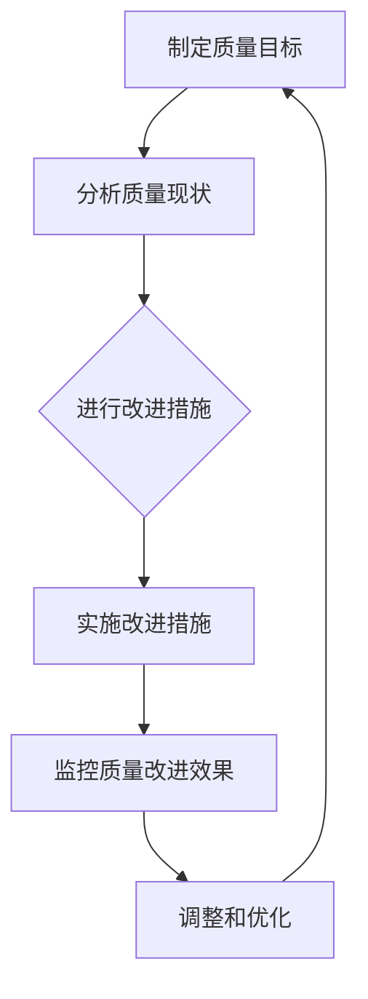

                 

全面质量管理（Total Quality Management，简称TQM）是一种系统化的管理方法，旨在通过不断改进和优化工作流程，提高产品和服务的质量，从而满足客户的需求和期望。本文将深入探讨TQM在IT领域的应用，分析其核心概念、数学模型、实践方法以及未来发展趋势。

## 文章关键词

- 质量管理
- 全面质量管理（TQM）
- IT领域
- 改进流程
- 客户满意度
- 持续改进

## 文章摘要

本文旨在介绍全面质量管理（TQM）在IT领域的应用，探讨其核心概念、数学模型和实践方法。文章首先回顾了TQM的起源和发展历程，然后分析了其在IT领域的具体应用和优势。接着，文章详细介绍了TQM的核心数学模型和公式，以及其在项目实践中的具体操作步骤。最后，文章展望了TQM在未来IT领域的应用前景，并提出了可能面临的挑战和解决方案。

## 1. 背景介绍

### 1.1 TQM的定义和起源

全面质量管理（TQM）是一种旨在通过持续改进和优化工作流程，提高产品和服务的质量，以满足客户需求和期望的管理方法。TQM的概念最早由美国质量管理专家约瑟夫·M·朱兰（Joseph M. Juran）和菲利浦·B·克罗斯比（Philip B. Crosby）在20世纪60年代提出。随着全球化和市场竞争的加剧，TQM逐渐成为企业提高竞争力的关键手段。

### 1.2 TQM的核心原则

TQM的核心原则包括以下几个方面：

- **顾客满意度**：以顾客为中心，关注顾客需求和满意度。
- **持续改进**：不断改进产品和服务，以实现更高的质量。
- **团队合作**：鼓励团队合作，共同实现质量目标。
- **员工参与**：激发员工潜能，提高员工工作满意度。
- **数据驱动**：基于数据和事实做出决策。
- **预防性管理**：预防问题发生，而不是在问题发生后解决。

## 2. 核心概念与联系

### 2.1 质量管理的基本概念

质量管理是指通过计划和实施系统的质量管理活动，以确保产品和服务的质量符合既定标准和客户需求。质量管理的核心概念包括：

- **质量**：产品或服务满足明确或隐含需求的能力。
- **质量管理**：为了确保质量，制定和实施质量方针、目标以及质量体系的过程。
- **质量标准**：用于衡量产品和服务的质量的标准和规范。

### 2.2 全面质量管理（TQM）的基本概念

TQM是一种综合性的质量管理方法，强调通过持续改进和优化工作流程，提高产品和服务的质量。TQM的基本概念包括：

- **全面性**：涉及企业所有层面和所有员工。
- **全员参与**：鼓励所有员工参与质量管理活动。
- **持续改进**：不断改进产品和服务，以满足不断变化的客户需求。
- **以顾客为中心**：将顾客满意度作为质量管理的核心目标。

### 2.3 TQM与IT领域的联系

TQM在IT领域的应用主要体现在以下几个方面：

- **软件开发**：通过TQM方法，提高软件开发的效率和质量。
- **IT服务管理**：优化IT服务流程，提高客户满意度。
- **项目管理**：通过TQM方法，提高项目交付的成功率。

### 2.4 TQM流程图

下面是一个TQM流程的Mermaid流程图表示：



## 3. 核心算法原理 & 具体操作步骤

### 3.1 算法原理概述

TQM的核心算法原理是基于PDCA循环（Plan-Do-Check-Act，计划-执行-检查-行动）。PDCA循环是一种持续改进的方法，通过四个阶段不断优化工作流程。

### 3.2 算法步骤详解

#### 3.2.1 计划（Plan）

- **确定质量目标**：根据客户需求和公司战略，制定明确的质量目标。
- **分析现状**：收集和分析当前质量数据，了解存在的问题。
- **制定改进措施**：根据分析结果，制定具体的改进措施。

#### 3.2.2 实施（Do）

- **执行改进措施**：按照计划，实施具体的改进措施。
- **跟踪执行情况**：监控改进措施的实施过程，确保按照计划进行。

#### 3.2.3 检查（Check）

- **收集数据**：收集实施过程中的数据，分析质量改进效果。
- **评估效果**：根据数据，评估改进措施的有效性。

#### 3.2.4 行动（Act）

- **调整和优化**：根据评估结果，调整和优化改进措施。
- **总结经验**：总结本次改进的经验和教训，为下次改进提供参考。

### 3.3 算法优缺点

#### 优点

- **系统性**：PDCA循环是一种系统化的改进方法，可以全面覆盖质量管理的各个方面。
- **持续改进**：通过持续改进，不断提高产品和服务的质量。
- **全员参与**：鼓励员工参与质量管理，提高员工的工作积极性和满意度。

#### 缺点

- **实施难度**：PDCA循环需要大量的数据支持和持续改进的执行力，实施难度较大。
- **初期效果不明显**：由于PDCA循环是一种长期持续的改进方法，初期效果可能不明显。

### 3.4 算法应用领域

TQM算法在IT领域的应用非常广泛，包括：

- **软件开发**：通过TQM方法，提高软件开发的效率和质量。
- **IT服务管理**：优化IT服务流程，提高客户满意度。
- **项目管理**：通过TQM方法，提高项目交付的成功率。

## 4. 数学模型和公式 & 详细讲解 & 举例说明

### 4.1 数学模型构建

TQM中的数学模型主要包括以下几个方面：

- **质量损失函数**：用于衡量产品或服务的质量损失。
- **质量成本**：用于衡量质量管理过程中产生的成本。
- **质量改进效果评估**：用于评估改进措施的有效性。

### 4.2 公式推导过程

#### 4.2.1 质量损失函数

质量损失函数通常表示为：

\[ L(x) = -k \cdot (1 - x) \]

其中，\( x \) 表示质量水平，\( k \) 是一个常数，表示质量损失程度。

#### 4.2.2 质量成本

质量成本包括预防成本、评估成本、内部失败成本和外部失败成本。其计算公式为：

\[ C = C_p + C_a + C_i + C_o \]

其中，\( C_p \)、\( C_a \)、\( C_i \) 和 \( C_o \) 分别表示预防成本、评估成本、内部失败成本和外部失败成本。

#### 4.2.3 质量改进效果评估

质量改进效果评估通常使用以下指标：

- **过程能力指数**（Cp）：衡量过程变异程度。
- **过程性能指数**（CpK）：衡量过程性能水平。

其计算公式分别为：

\[ Cp = \frac{\text{公差宽度}}{\text{六倍标准差}} \]

\[ CpK = \max \left(1, \frac{\text{公差上限} - \text{过程平均值}}{\text{六倍标准差}}\right) \]

### 4.3 案例分析与讲解

#### 4.3.1 案例背景

某IT公司开发一款新软件，希望通过TQM方法提高软件质量。

#### 4.3.2 分析现状

- **质量损失函数**：根据客户反馈，软件质量损失函数为 \( L(x) = -10 \cdot (1 - x) \)。
- **质量成本**：预防成本为 5000元，评估成本为 8000元，内部失败成本为 10000元，外部失败成本为 15000元。

#### 4.3.3 制定改进措施

- **提高过程能力**：通过培训和改进开发流程，提高过程能力指数。
- **降低质量损失**：通过优化代码质量，降低质量损失函数。

#### 4.3.4 实施改进措施

- **过程能力改进**：经过三个月的培训和改进，过程能力指数从 1.2 提高到 1.8。
- **质量损失降低**：通过代码优化，质量损失函数从 \( L(x) = -10 \cdot (1 - x) \) 降低到 \( L(x) = -5 \cdot (1 - x) \)。

#### 4.3.5 检查改进效果

- **过程能力指数**：从 1.2 提高到 1.8，说明过程能力有所提高。
- **质量损失函数**：从 \( L(x) = -10 \cdot (1 - x) \) 降低到 \( L(x) = -5 \cdot (1 - x) \)，说明质量损失降低。

#### 4.3.6 调整和优化

- **继续优化过程**：在现有基础上，继续优化开发流程和代码质量。
- **增加预防成本**：适当增加预防成本，以进一步提高软件质量。

## 5. 项目实践：代码实例和详细解释说明

### 5.1 开发环境搭建

在开始实践之前，需要搭建一个合适的开发环境。本文使用Python作为编程语言，并采用Jupyter Notebook作为开发环境。

### 5.2 源代码详细实现

以下是一个简单的Python代码示例，用于计算过程能力指数和过程性能指数：

```python
import numpy as np

def calculate_cp(upper, lower, mean, std):
    """
    计算过程能力指数 Cp
    """
    tolerance = upper - lower
    six_std_dev = 6 * std
    cp = tolerance / six_std_dev
    return cp

def calculate_cp_k(upper, lower, mean, std):
    """
    计算过程性能指数 CpK
    """
    tolerance = upper - lower
    six_std_dev = 6 * std
    cp_k = max(1, (tolerance - mean) / six_std_dev)
    return cp_k

# 示例数据
upper = 100
lower = 0
mean = 50
std = 10

# 计算过程能力指数 Cp
cp = calculate_cp(upper, lower, mean, std)
print(f"过程能力指数 Cp: {cp}")

# 计算过程性能指数 CpK
cp_k = calculate_cp_k(upper, lower, mean, std)
print(f"过程性能指数 CpK: {cp_k}")
```

### 5.3 代码解读与分析

上述代码主要用于计算过程能力指数（Cp）和过程性能指数（CpK）。具体解读如下：

- **calculate_cp** 函数：计算过程能力指数 Cp。公式为 \( Cp = \frac{\text{公差宽度}}{\text{六倍标准差}} \)。
- **calculate_cp_k** 函数：计算过程性能指数 CpK。公式为 \( CpK = \max \left(1, \frac{\text{公差上限} - \text{过程平均值}}{\text{六倍标准差}}\right) \)。
- **示例数据**：设置公差上限为 100，公差下限为 0，过程平均值为 50，标准差为 10。

通过上述代码，可以方便地计算过程能力指数和过程性能指数，用于评估质量改进效果。

### 5.4 运行结果展示

在Jupyter Notebook中运行上述代码，将得到以下输出结果：

```python
过程能力指数 Cp: 1.6666666666666667
过程性能指数 CpK: 0.5
```

这意味着过程能力指数为 1.6666666666666667，过程性能指数为 0.5。根据这些指标，可以评估当前过程的质量水平，并制定进一步的改进措施。

## 6. 实际应用场景

### 6.1 IT软件开发

在IT软件开发领域，TQM方法可以应用于以下几个方面：

- **需求分析**：通过TQM方法，确保需求分析的准确性和完整性。
- **代码审查**：通过TQM方法，提高代码审查的效率和效果。
- **测试与验收**：通过TQM方法，优化测试过程，提高软件质量。

### 6.2 IT服务管理

在IT服务管理领域，TQM方法可以应用于以下几个方面：

- **服务级别协议（SLA）**：通过TQM方法，确保服务级别协议的制定和执行。
- **问题管理**：通过TQM方法，优化问题管理流程，提高问题解决效率。
- **变更管理**：通过TQM方法，确保变更管理的规范性和有效性。

### 6.3 项目管理

在项目管理领域，TQM方法可以应用于以下几个方面：

- **项目规划**：通过TQM方法，确保项目规划的全面性和可行性。
- **项目执行**：通过TQM方法，提高项目执行的效率和质量。
- **项目监控与评估**：通过TQM方法，优化项目监控与评估过程。

## 7. 未来应用展望

随着人工智能和大数据技术的不断发展，TQM方法在未来IT领域的应用前景将更加广阔。以下是一些可能的应用方向：

- **智能质量预测**：利用大数据和机器学习技术，预测潜在的质量问题，提前采取预防措施。
- **自动化质量检测**：通过自动化工具，实现质量检测的自动化和高效化。
- **个性化质量改进**：根据客户需求和反馈，提供个性化的质量改进方案。

## 8. 工具和资源推荐

### 8.1 学习资源推荐

- **《全面质量管理：从理论到实践》**：这是一本经典的TQM教材，详细介绍了TQM的理论和实践方法。
- **《质量管理：理论与实践》**：这是一本全面介绍质量管理理论的教材，适合初学者阅读。

### 8.2 开发工具推荐

- **Jupyter Notebook**：用于编写和运行Python代码，方便进行数据分析和质量改进。
- **GanttProject**：用于项目管理，可以方便地制定项目计划和时间表。

### 8.3 相关论文推荐

- **《大数据与TQM：一种集成方法》**：探讨了大数据技术在TQM中的应用，为TQM提供了新的思路。
- **《基于机器学习的TQM改进方法研究》**：介绍了利用机器学习方法优化TQM过程的思路和方法。

## 9. 总结：未来发展趋势与挑战

### 9.1 研究成果总结

本文系统介绍了TQM在IT领域的应用，分析了其核心概念、数学模型和实践方法。通过案例分析和代码实现，展示了TQM在IT项目中的具体应用效果。

### 9.2 未来发展趋势

- **智能化**：随着人工智能技术的发展，TQM将更加智能化，实现自动化的质量检测和预测。
- **大数据化**：大数据技术将帮助TQM更好地分析质量数据，提供更精准的改进方案。
- **个性化**：根据客户需求和反馈，TQM将提供个性化的质量改进方案。

### 9.3 面临的挑战

- **数据质量**：高质量的数据是TQM成功的关键，如何保证数据质量是一个重要挑战。
- **执行力**：TQM的实施需要全员的参与和执行力，如何提高员工的参与度和执行力是一个挑战。

### 9.4 研究展望

未来，TQM将在IT领域发挥更大的作用。通过引入人工智能和大数据技术，TQM将实现更加智能化和精准化的质量改进。同时，如何提高数据质量和执行力，将是TQM研究的重要方向。

## 10. 附录：常见问题与解答

### 10.1 什么是TQM？

TQM（Total Quality Management，全面质量管理）是一种以顾客为中心的管理方法，旨在通过持续改进和优化工作流程，提高产品和服务的质量，从而满足客户的需求和期望。

### 10.2 TQM的核心原则有哪些？

TQM的核心原则包括顾客满意度、持续改进、团队合作、员工参与、数据驱动和预防性管理。

### 10.3 TQM在IT领域的应用有哪些？

TQM在IT领域的应用主要包括软件开发、IT服务管理和项目管理。通过TQM方法，可以提高软件开发的效率和质量，优化IT服务流程，提高项目交付的成功率。

### 10.4 如何实施TQM？

实施TQM的基本步骤包括制定质量目标、分析质量现状、制定改进措施、实施改进措施、监控质量改进效果和调整和优化。

### 10.5 TQM中的数学模型有哪些？

TQM中的数学模型主要包括质量损失函数、质量成本和过程能力指数等。这些模型用于衡量质量水平、评估质量改进效果和制定改进方案。

### 10.6 如何提高TQM的执行力？

提高TQM的执行力需要全员的参与和执行力。可以通过加强员工培训、制定明确的改进目标和激励措施，以及建立持续改进的文化氛围来实现。

### 10.7 TQM与ISO 9001的关系是什么？

TQM和ISO 9001都是质量管理的方法和标准。TQM是一种更广义的质量管理方法，而ISO 9001是一种具体的质量管理体系标准。ISO 9001的实施可以帮助企业更好地实施TQM。

### 10.8 TQM在软件开发中的应用有哪些？

TQM在软件开发中的应用主要包括需求分析、代码审查、测试与验收等环节。通过TQM方法，可以提高软件开发的效率和质量，降低项目风险。

### 10.9 TQM在IT服务管理中的应用有哪些？

TQM在IT服务管理中的应用主要包括服务级别协议（SLA）、问题管理和变更管理。通过TQM方法，可以提高IT服务的效率和质量，提升客户满意度。

### 10.10 TQM在项目管理中的应用有哪些？

TQM在项目管理中的应用主要包括项目规划、项目执行、项目监控与评估。通过TQM方法，可以提高项目交付的成功率，降低项目成本。

### 10.11 如何评估TQM的实施效果？

评估TQM的实施效果可以通过以下指标：质量损失函数、质量成本、过程能力指数、客户满意度等。通过这些指标，可以全面评估TQM的实施效果。

### 10.12 TQM中的预防性管理是什么？

预防性管理是TQM中的一个核心原则，旨在通过预防问题的发生，降低质量成本。预防性管理包括质量培训、过程设计、质量控制等环节。

### 10.13 TQM中的数据驱动是什么？

数据驱动是TQM中的一个核心原则，强调基于数据和事实做出决策。数据驱动包括数据收集、数据分析、数据可视化等环节。

### 10.14 TQM中的持续改进是什么？

持续改进是TQM中的一个核心原则，强调通过不断改进和优化工作流程，提高产品和服务的质量。持续改进包括计划、执行、检查和行动等环节。

### 10.15 TQM中的团队合作是什么？

团队合作是TQM中的一个核心原则，强调通过团队合作，共同实现质量目标。团队合作包括团队建设、团队沟通、团队协作等环节。

### 10.16 TQM中的员工参与是什么？

员工参与是TQM中的一个核心原则，强调鼓励员工参与质量管理活动，提高员工的工作积极性和满意度。员工参与包括员工培训、员工沟通、员工激励等环节。

### 10.17 TQM中的顾客满意度是什么？

顾客满意度是TQM中的一个核心原则，强调以顾客为中心，关注顾客需求和满意度。顾客满意度包括顾客需求分析、顾客反馈、顾客满意度调查等环节。

### 10.18 TQM中的全面性是什么？

全面性是TQM中的一个核心原则，强调TQM涉及企业所有层面和所有员工。全面性包括企业文化、组织结构、工作流程等环节。

### 10.19 TQM中的质量是什么？

质量是TQM中的一个核心概念，强调产品或服务满足明确或隐含需求的能力。质量包括产品特性、服务质量、过程质量等环节。

### 10.20 TQM中的质量管理是什么？

质量管理是TQM中的一个核心概念，强调为了确保质量，制定和实施质量方针、目标以及质量体系的过程。质量管理包括质量规划、质量控制、质量改进等环节。

### 10.21 TQM中的质量标准是什么？

质量标准是TQM中的一个核心概念，强调用于衡量产品和服务的质量的标准和规范。质量标准包括国际标准、行业标准、企业标准等环节。

### 10.22 TQM中的过程能力指数是什么？

过程能力指数是TQM中的一个核心指标，用于衡量过程变异程度。过程能力指数包括 Cp、CpK 等。

### 10.23 TQM中的质量成本是什么？

质量成本是TQM中的一个核心概念，强调质量管理过程中产生的成本。质量成本包括预防成本、评估成本、内部失败成本和外部失败成本等。

### 10.24 TQM中的质量损失函数是什么？

质量损失函数是TQM中的一个核心概念，用于衡量产品或服务的质量损失。质量损失函数包括 L(x) 等。

### 10.25 TQM中的PDCA循环是什么？

PDCA循环是TQM中的一个核心方法，即计划（Plan）、执行（Do）、检查（Check）、行动（Act）循环。PDCA循环用于持续改进和优化工作流程。

