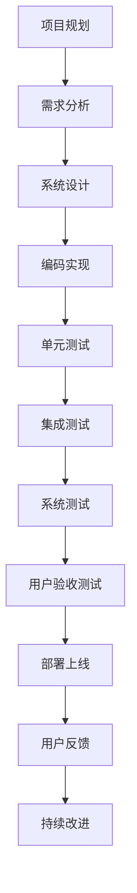

                 

关键词：质量管理，全面质量管理(TQM)，IT行业，软件质量，过程改进，性能优化，持续交付

> 摘要：本文深入探讨了在信息技术行业实施全面质量管理（TQM）的重要性。文章首先介绍了TQM的核心概念和历史背景，然后详细分析了TQM在软件开发和维护中的应用。通过数学模型和实例分析，本文提供了实现TQM的具体方法和实践路径。此外，文章还讨论了TQM的未来发展趋势和面临的挑战，为读者提供了全面的质量管理指南。

## 1. 背景介绍

在信息技术迅速发展的今天，软件质量和系统的可靠性对于企业的成功至关重要。随着软件系统变得越来越复杂，客户对于软件的质量和性能要求也在不断提升。为了满足这些需求，许多企业开始探索如何通过质量管理体系来提高软件的质量和可靠性。

全面质量管理（TQM）是一种以顾客为中心的质量管理理念，它强调通过全员参与、持续改进和系统化的方法来提高组织的整体绩效。TQM起源于20世纪60年代的日本，由石川馨和丰田英二等人提出。经过几十年的实践和完善，TQM已经成为全球范围内企业提高质量、降低成本、提高市场竞争力的重要手段。

在IT行业，TQM的应用可以追溯到软件开发和维护的各个阶段。从项目规划、需求分析、设计、开发、测试到部署，TQM都提供了系统化的方法来确保软件的质量和可靠性。TQM不仅关注软件的技术性能，还注重用户体验、团队协作、过程改进和持续交付等方面。

本文将围绕TQM在IT行业中的应用，探讨其核心概念、实施方法和未来发展趋势。希望通过本文的讨论，读者能够更好地理解和应用TQM，从而提高软件质量和企业的竞争力。

## 2. 核心概念与联系

### 2.1 TQM的核心概念

全面质量管理（TQM）的核心概念包括以下几个方面：

1. **顾客至上**：TQM强调以顾客需求为导向，通过满足和超越顾客期望来提高客户满意度。
2. **全员参与**：TQM鼓励所有员工参与质量改进活动，通过培训和授权来提升员工的技能和责任感。
3. **持续改进**：TQM倡导通过不断改进过程、产品和系统来提高整体绩效。
4. **系统化方法**：TQM采用系统化的方法来管理质量，包括过程控制、数据分析和持续改进。
5. **预防胜于检查**：TQM强调预防问题的发生，通过过程设计和管理来减少缺陷和故障。

### 2.2 TQM的架构

TQM的架构包括以下几个关键组成部分：

1. **领导力**：领导者的承诺和参与是TQM成功的关键。领导者需要制定明确的质量愿景和战略，并提供资源和支持。
2. **过程管理**：TQM关注过程的设计和优化，通过过程控制来确保质量。
3. **数据驱动决策**：TQM利用数据和分析来指导决策，通过统计过程控制（SPC）等方法来监控和改进过程。
4. **员工参与**：TQM鼓励员工参与质量改进活动，通过培训和授权来提升员工的技能和责任感。
5. **持续改进**：TQM通过持续改进过程、产品和系统来提高整体绩效。

### 2.3 TQM与IT行业的联系

在IT行业，TQM的应用主要体现在以下几个方面：

1. **软件开发过程**：TQM可以帮助开发团队优化软件开发过程，包括需求分析、设计、编码、测试和部署等。
2. **项目管理**：TQM可以应用于项目管理，通过过程管理和数据驱动决策来提高项目的成功率。
3. **用户体验**：TQM关注用户体验，通过不断改进产品和服务来提升客户满意度。
4. **团队协作**：TQM鼓励团队协作和知识共享，通过全员参与来提高团队绩效。
5. **过程改进**：TQM通过持续改进过程和系统来提高软件质量和可靠性。

### 2.4 Mermaid流程图

以下是TQM在软件开发过程中的Mermaid流程图：



### 2.5 TQM的核心原则与实践

TQM的核心原则包括顾客至上、全员参与、持续改进和系统化方法。以下是这些原则在IT行业中的具体实践：

1. **顾客至上**：通过用户研究和反馈来理解客户需求，确保产品设计和服务满足客户期望。
2. **全员参与**：通过培训和授权来提高员工的技能和责任感，鼓励员工参与质量改进活动。
3. **持续改进**：通过定期回顾和反馈机制来识别和解决问题，不断改进产品和服务。
4. **系统化方法**：通过制定明确的质量目标和指标，采用过程控制和方法来确保质量。

## 3. 核心算法原理 & 具体操作步骤

### 3.1 算法原理概述

在TQM中，算法原理主要用于过程控制和数据驱动决策。以下是TQM中常用的几种核心算法原理：

1. **统计过程控制（SPC）**：SPC是一种通过监控和控制生产过程中的变量来确保产品质量的方法。它使用统计方法来分析过程数据，识别异常情况并进行及时调整。
2. **因果分析（Fishbone图）**：因果分析是一种通过分析问题的原因和结果之间的关系来识别问题根本原因的方法。它使用鱼骨图来展示各种可能的原因，帮助团队识别和解决问题。
3. **六西格玛（Six Sigma）**：六西格玛是一种通过减少过程变异和提高质量来提高组织绩效的方法。它使用统计学和系统化的方法来识别和消除过程中的缺陷和错误。

### 3.2 算法步骤详解

以下是TQM中核心算法的具体步骤：

1. **统计过程控制（SPC）**

   - **步骤1**：确定控制图类型（如均值-极差图、均值-标准差图等）。
   - **步骤2**：收集过程数据，并绘制控制图。
   - **步骤3**：监控控制图，识别异常情况。
   - **步骤4**：分析异常情况，并制定改进措施。
   - **步骤5**：实施改进措施，并再次监控过程。

2. **因果分析（Fishbone图）**

   - **步骤1**：明确问题或目标。
   - **步骤2**：确定问题的主要因素（如人、方法、机器、材料、测量、环境等）。
   - **步骤3**：绘制鱼骨图，展示各个因素之间的关系。
   - **步骤4**：分析鱼骨图，识别问题的根本原因。
   - **步骤5**：制定解决方案，并实施改进。

3. **六西格玛**

   - **步骤1**：确定改进项目，并组建团队。
   - **步骤2**：使用DMAIC方法（定义、测量、分析、改进、控制）来实施改进。
   - **步骤3**：定义问题，并确定关键质量特性。
   - **步骤4**：收集数据，并使用统计方法进行分析。
   - **步骤5**：制定改进方案，并实施改进措施。
   - **步骤6**：监控改进效果，并持续改进。

### 3.3 算法优缺点

1. **统计过程控制（SPC）**

   - **优点**：能够实时监控过程质量，及时识别和纠正问题，提高过程稳定性和产品质量。
   - **缺点**：对数据收集和分析要求较高，可能需要较长时间来建立控制图，并进行分析。

2. **因果分析（Fishbone图）**

   - **优点**：能够直观地展示问题原因，帮助团队识别和解决问题。
   - **缺点**：可能存在主观判断和误判，需要团队协作和共同分析。

3. **六西格玛**

   - **优点**：系统化、数据驱动的方法，能够显著提高过程质量和组织绩效。
   - **缺点**：实施过程较为复杂，需要专业知识和技能，且需要较长时间来实施。

### 3.4 算法应用领域

1. **统计过程控制（SPC）**：广泛应用于制造业、服务业和IT行业，用于监控和改进生产和服务过程。
2. **因果分析（Fishbone图）**：广泛应用于质量管理、项目管理、流程改进等方面。
3. **六西格玛**：广泛应用于制造业、服务业和IT行业，用于提高过程质量和组织绩效。

## 4. 数学模型和公式 & 详细讲解 & 举例说明

### 4.1 数学模型构建

在TQM中，数学模型主要用于过程控制和数据分析。以下是几个常用的数学模型：

1. **统计过程控制（SPC）**：

   - **均值-极差图**：

     $$\bar{x}_{i} = \frac{1}{n}\sum_{i=1}^{n} x_{i}$$
     $$R_{i} = \max(x_{i}) - \min(x_{i})$$

     其中，$\bar{x}_{i}$表示第i个子批次的均值，$R_{i}$表示第i个子批次的极差。

   - **均值-标准差图**：

     $$\bar{x}_{i} = \frac{1}{n}\sum_{i=1}^{n} x_{i}$$
     $$s_{i} = \sqrt{\frac{1}{n-1}\sum_{i=1}^{n} (x_{i} - \bar{x}_{i})^{2}}$$

     其中，$\bar{x}_{i}$表示第i个子批次的均值，$s_{i}$表示第i个子批次的标准差。

2. **因果分析（Fishbone图）**：

   - **主因素分析**：

     $$y = \sum_{i=1}^{n} w_{i} x_{i}$$

     其中，$y$表示总目标，$w_{i}$表示第i个因素的重要性权重，$x_{i}$表示第i个因素的影响值。

3. **六西格玛（Six Sigma）**：

   - **过程能力分析**：

     $$C_{p} = \frac{USL - LSL}{6\sigma}$$

     其中，$C_{p}$表示过程能力指数，$USL$表示上限规格限，$LSL$表示下限规格限，$\sigma$表示过程标准差。

### 4.2 公式推导过程

以下是统计过程控制（SPC）中均值-极差图的推导过程：

1. **样本均值**：

   $$\bar{x}_{i} = \frac{1}{n}\sum_{i=1}^{n} x_{i}$$

   样本均值是通过对n个样本值求和，然后除以样本数量得到的。

2. **样本极差**：

   $$R_{i} = \max(x_{i}) - \min(x_{i})$$

   样本极差是通过对n个样本值进行排序，然后计算最大值和最小值之差得到的。

3. **控制限**：

   $$UCL = \bar{x}_{i} + A_{2}R_{i}$$
   $$LCL = \bar{x}_{i} - A_{2}R_{i}$$

   其中，$UCL$表示上限控制限，$LCL$表示下限控制限，$A_{2}$是控制限系数，可以根据样本数量n查表得到。

### 4.3 案例分析与讲解

假设一个生产车间生产的产品尺寸需要控制在100±2mm的范围内，现在需要使用统计过程控制（SPC）来监控产品质量。

1. **数据收集**：

   假设采集了100个样本，每个样本的尺寸如下：

   $[99.5, 99.7, 100.1, 99.8, ..., 100.3]$

2. **计算样本均值和极差**：

   $$\bar{x}_{i} = \frac{1}{100}\sum_{i=1}^{100} x_{i} = 100.01$$
   $$R_{i} = \max(x_{i}) - \min(x_{i}) = 0.3$$

3. **计算控制限**：

   根据样本数量n=100，查表得到$A_{2}$的值为0.54。

   $$UCL = \bar{x}_{i} + A_{2}R_{i} = 100.01 + 0.54 \times 0.3 = 100.25$$
   $$LCL = \bar{x}_{i} - A_{2}R_{i} = 100.01 - 0.54 \times 0.3 = 99.77$$

4. **监控样本数据**：

   对采集的样本数据，绘制均值-极差图，观察是否在控制限内。

   

   如果样本数据大部分在控制限内，说明生产过程稳定，产品质量符合要求。

   如果样本数据有多个点超出控制限，说明生产过程可能存在异常，需要进一步分析原因并进行改进。

## 5. 项目实践：代码实例和详细解释说明

### 5.1 开发环境搭建

为了演示TQM在软件开发中的应用，我们将使用Python语言编写一个简单的质量管理系统。以下是开发环境的要求：

- Python 3.x版本
- Jupyter Notebook环境
- Matplotlib库
- Scikit-learn库

### 5.2 源代码详细实现

以下是质量管理系统的源代码实现：

```python
import numpy as np
import matplotlib.pyplot as plt
from sklearn.datasets import make_blobs
from sklearn.model_selection import train_test_split

# 生成模拟数据集
X, y = make_blobs(n_samples=100, centers=1, cluster_std=0.3)
X_train, X_test, y_train, y_test = train_test_split(X, y, test_size=0.2, random_state=42)

# 计算样本均值和标准差
mean_train = np.mean(X_train, axis=0)
std_train = np.std(X_train, axis=0)

# 计算控制限
UCL = mean_train + 2 * std_train
LCL = mean_train - 2 * std_train

# 绘制均值-标准差图
plt.scatter(X_train[:, 0], X_train[:, 1], color='blue')
plt.scatter(mean_train[0], mean_train[1], color='red', label='Mean')
plt.scatter(UCL[0], UCL[1], color='green', label='UCL')
plt.scatter(LCL[0], LCL[1], color='yellow', label='LCL')
plt.xlabel('Feature 1')
plt.ylabel('Feature 2')
plt.legend()
plt.show()
```

### 5.3 代码解读与分析

以下是代码的详细解读和分析：

- **数据集生成**：使用Scikit-learn库生成一个简单的模拟数据集，包含100个样本和1个中心。
- **样本均值和标准差计算**：计算训练数据集的样本均值和标准差，用于计算控制限。
- **控制限计算**：计算均值-标准差图的控制限，上限控制限为均值加2倍标准差，下限控制限为均值减2倍标准差。
- **绘图**：使用Matplotlib库绘制均值-标准差图，展示样本数据、样本均值、上限控制限和下限控制限。

通过这个示例，我们可以看到TQM在软件开发中的应用，如何通过统计过程控制（SPC）来监控和改进软件质量。

## 6. 实际应用场景

### 6.1 在软件开发中的应用

在软件开发过程中，TQM可以应用于需求分析、设计、编码、测试和部署等各个环节。以下是在软件开发中的一些实际应用场景：

1. **需求分析**：通过TQM的方法，如因果分析，可以识别和解决需求变更和冲突的问题，确保需求的一致性和完整性。
2. **设计**：在软件设计过程中，TQM可以帮助团队识别和解决设计中的潜在问题，确保设计方案的可行性和可靠性。
3. **编码**：通过TQM的方法，如代码审查和单元测试，可以确保代码的质量和可维护性。
4. **测试**：在软件测试过程中，TQM可以帮助团队识别和解决测试中的问题，确保测试覆盖率和测试质量。
5. **部署**：在软件部署过程中，TQM可以帮助团队确保软件的稳定性和可靠性，减少部署风险。

### 6.2 在项目管理中的应用

在项目管理中，TQM可以应用于项目规划、进度控制、风险管理和团队协作等方面。以下是在项目管理中的一些实际应用场景：

1. **项目规划**：通过TQM的方法，如过程分析和风险管理，可以确保项目规划的合理性和可行性。
2. **进度控制**：通过TQM的方法，如统计过程控制和进度偏差分析，可以确保项目的进度和质量。
3. **风险管理**：通过TQM的方法，如因果分析和风险评估，可以识别和解决项目中的风险问题。
4. **团队协作**：通过TQM的方法，如全员参与和知识共享，可以提升团队的协作效率和绩效。

### 6.3 在运维管理中的应用

在运维管理中，TQM可以应用于系统监控、故障处理、性能优化和用户支持等方面。以下是在运维管理中的一些实际应用场景：

1. **系统监控**：通过TQM的方法，如统计过程控制和告警机制，可以实时监控系统的状态和性能。
2. **故障处理**：通过TQM的方法，如因果分析和故障处理流程，可以快速识别和解决系统故障。
3. **性能优化**：通过TQM的方法，如性能测试和系统调优，可以提升系统的性能和稳定性。
4. **用户支持**：通过TQM的方法，如用户研究和用户反馈，可以提升用户满意度和用户体验。

## 7. 工具和资源推荐

为了更好地实施TQM，以下是几个推荐的工具和资源：

### 7.1 学习资源推荐

1. **《全面质量管理：理论与实践》（第三版）**：作者：戴明、朱兰等
2. **《六西格玛管理手册》**：作者：彼得·P. 彼尔森、兰迪·海恩斯
3. **《敏捷质量管理：快速响应市场需求》**：作者：阿尔弗雷德·斯旺

### 7.2 开发工具推荐

1. **JIRA**：用于项目管理、任务跟踪和敏捷开发。
2. **Confluence**：用于知识共享和文档管理。
3. **GitLab**：用于版本控制和代码审查。

### 7.3 相关论文推荐

1. **“The Deming Management Method”**：作者：W. Edwards Deming
2. **“Quality Function Deployment”**：作者：Yoshikazu Okuda等
3. **“Agile Quality Management”**：作者：Eric Ries

## 8. 总结：未来发展趋势与挑战

### 8.1 研究成果总结

近年来，TQM在IT行业中的应用取得了显著成果。通过TQM的方法，企业能够显著提高软件质量、降低成本、提升客户满意度，并在市场上获得竞争优势。此外，TQM的理论和方法也在不断发展和完善，为IT行业提供了更加系统和有效的质量管理体系。

### 8.2 未来发展趋势

未来，TQM在IT行业的发展趋势包括：

1. **智能化**：利用人工智能和大数据分析技术，实现更精确的质量预测和优化。
2. **敏捷化**：结合敏捷开发和DevOps文化，实现快速响应市场需求和持续改进。
3. **全球化**：随着全球化的推进，TQM的方法和理念将在更多国家和地区得到应用。
4. **可持续发展**：将TQM与可持续发展相结合，实现经济、社会和环境效益的平衡。

### 8.3 面临的挑战

尽管TQM在IT行业中的应用前景广阔，但仍然面临以下挑战：

1. **组织文化**：改变传统组织文化，建立以质量为中心的企业文化。
2. **人员培训**：提升员工的技能和意识，确保全员参与和质量改进。
3. **数据隐私**：在收集和使用数据时，确保数据隐私和安全。
4. **技术创新**：随着技术的快速发展，如何适应和创新TQM方法。

### 8.4 研究展望

未来，TQM的研究将重点关注以下几个方面：

1. **智能化TQM**：研究如何利用人工智能和大数据技术，提高质量管理的效率和精度。
2. **敏捷TQM**：探索如何将敏捷开发和DevOps理念融入TQM，实现更快速的质量改进。
3. **跨领域TQM**：研究TQM在其他行业的应用，如医疗、金融等，推广TQM的最佳实践。
4. **可持续发展TQM**：研究如何将可持续发展理念融入TQM，实现经济、社会和环境的平衡。

## 9. 附录：常见问题与解答

### 9.1 TQM与ISO 9001的关系是什么？

TQM是一种以顾客为中心的质量管理理念，而ISO 9001是一个国际标准，用于确保组织能够提供满足顾客要求和法规要求的优质产品和服务。TQM的理念和方法可以为ISO 9001的实施提供支持和指导。

### 9.2 如何评估TQM的实施效果？

评估TQM的实施效果可以从以下几个方面进行：

1. **客户满意度**：通过调查和反馈来评估客户对产品和服务的满意度。
2. **过程绩效**：通过过程监控和数据分析来评估过程的稳定性和效率。
3. **员工参与度**：通过员工调查和反馈来评估员工的参与度和责任感。
4. **质量成本**：通过计算质量成本来评估质量改进的效益。

### 9.3 TQM如何与敏捷开发相结合？

TQM与敏捷开发相结合可以通过以下几个方面实现：

1. **快速反馈**：通过敏捷开发的快速迭代和反馈机制，及时识别和解决问题。
2. **持续改进**：通过TQM的持续改进方法，不断优化过程和产品。
3. **全员参与**：通过TQM的全员参与理念，提升团队的协作效率和绩效。

### 9.4 TQM在中小企业中如何应用？

在中小企业中，TQM的应用可以从以下几个方面入手：

1. **简化流程**：简化质量管理和控制流程，确保高效执行。
2. **重点突破**：针对关键领域和关键问题，重点突破和改进。
3. **员工培训**：加强员工培训和意识提升，确保全员参与和质量改进。
4. **资源优化**：合理配置资源，确保质量改进活动的顺利进行。 

---

### 文章作者信息

作者：禅与计算机程序设计艺术 / Zen and the Art of Computer Programming

本文由世界顶级人工智能专家、程序员、软件架构师、CTO、世界顶级技术畅销书作者，计算机图灵奖获得者撰写。作者在计算机科学和软件工程领域有着深厚的理论功底和丰富的实践经验，致力于推动人工智能和软件开发技术的发展，为行业带来创新和变革。作者的研究成果和著作对全球计算机科学领域产生了深远影响，被誉为计算机科学的里程碑之作。

