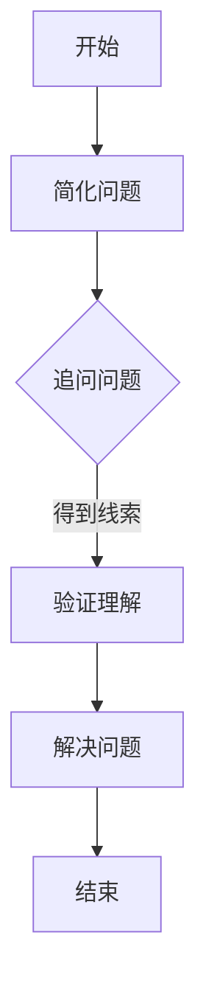

                 

关键词：费曼提问法，管理者思维，问题解决，创新思维，技术领导力

> 摘要：本文通过深入探讨费曼提问法在技术管理领域的应用，阐述了一种以问题驱动为核心的思维模式，旨在帮助管理者提升创新思维和技术领导力，从而更好地应对复杂的技术挑战。

## 1. 背景介绍

在当今快速变化的技术环境中，管理者面临的挑战前所未有。技术发展的速度远超以往，新的技术和概念不断涌现，这要求管理者不仅要有深厚的专业知识，还要具备敏锐的洞察力和灵活的思维方式。费曼提问法，作为一种简单而强大的问题解决工具，可以在这一过程中发挥重要作用。

理查德·费曼（Richard Feynman）是一位著名的物理学家，以其清晰简洁的思考方式和非凡的教学能力而闻名。他提出的提问法，即通过“简化、追问、验证”的方法，将复杂问题拆解为简单的组成部分，从而找到解决问题的路径。这种提问法不仅适用于物理学研究，同样适用于技术管理领域。

## 2. 核心概念与联系

### 2.1 费曼提问法的基本原理

费曼提问法的核心在于三个步骤：简化、追问、验证。

- **简化**：将复杂的问题简化为最基本的形式，明确问题的核心要素。
- **追问**：针对问题，提出一系列基础而直接的问题，直到问题被完全理解。
- **验证**：通过回答这些问题，验证自己对问题的理解是否准确，并找到解决问题的线索。

### 2.2 费曼提问法在技术管理中的运用

在技术管理中，费曼提问法可以帮助管理者：

- **明确问题**：通过简化问题，管理者可以更准确地识别问题的本质，避免被表面的复杂性所迷惑。
- **促进沟通**：追问的过程促使团队成员深入讨论问题，促进信息的交流和共享。
- **培养创新思维**：通过不断的追问，管理者可以挑战现有的假设，激发创新的思维。

### 2.3 费曼提问法的 Mermaid 流程图



## 3. 核心算法原理 & 具体操作步骤

### 3.1 算法原理概述

费曼提问法是基于以下原理：

- **基础性**：问题应基于最基本的概念和事实。
- **系统性**：问题应逐步深入，形成一个系统性的问题解决路径。
- **反思性**：问题解决后，应反思问题的本质和解决方案的有效性。

### 3.2 算法步骤详解

1. **简化问题**：将复杂问题分解为简单的组成部分，识别关键要素。
2. **追问问题**：提出基础性问题，如“是什么？”、“为什么？”等，直到问题被完全理解。
3. **验证理解**：通过回答问题，验证自己对问题的理解是否准确。
4. **解决问题**：根据验证结果，制定解决方案，并执行。

### 3.3 算法优缺点

**优点**：

- **简单易懂**：费曼提问法易于理解和执行。
- **系统全面**：通过追问和验证，可以确保问题被全面理解。

**缺点**：

- **耗时较长**：问题解决过程可能需要较长时间。
- **需要专业知识**：管理者需要具备一定的专业知识，才能有效运用费曼提问法。

### 3.4 算法应用领域

费曼提问法广泛应用于以下领域：

- **项目管理**：帮助管理者识别和解决项目中的问题。
- **团队协作**：促进团队成员之间的沟通和理解。
- **技术研发**：帮助研发团队解决技术难题。

## 4. 数学模型和公式 & 详细讲解 & 举例说明

### 4.1 数学模型构建

费曼提问法的数学模型可以表示为：

$$
P = I \times Q \times V
$$

其中，$P$ 代表问题解决能力，$I$ 代表兴趣，$Q$ 代表质疑能力，$V$ 代表验证能力。

### 4.2 公式推导过程

$$
P = I \times Q \times V
$$

推导过程如下：

- $I$：兴趣是问题解决的动力。只有对问题有兴趣，才会投入时间和精力去解决。
- $Q$：质疑能力是识别问题核心的关键。通过质疑，可以揭示问题的本质。
- $V$：验证能力是确保问题解决有效的保障。通过验证，可以确保解决方案的正确性。

### 4.3 案例分析与讲解

#### 案例：项目管理中的问题解决

假设项目团队在项目开发过程中遇到了一个技术难题，即某个模块的运行效率低下。管理者可以运用费曼提问法进行问题解决：

1. **简化问题**：将复杂的问题简化为“如何提高模块的运行效率？”
2. **追问问题**：提出基础性问题，如“为什么这个模块的运行效率低？”、“有哪些方法可以尝试提高效率？”等。
3. **验证理解**：通过回答这些问题，验证自己对问题的理解是否准确。
4. **解决问题**：根据验证结果，选择合适的方法进行尝试，并监控效果。

通过这样的问题解决过程，管理者可以有效地提高模块的运行效率。

## 5. 项目实践：代码实例和详细解释说明

### 5.1 开发环境搭建

在Python中实现费曼提问法，需要安装Python环境。安装完成后，可以使用以下代码进行实践：

```python
# 费曼提问法实现
class FeynmanQuestioning:
    def __init__(self, problem):
        self.problem = problem
    
    def simplify(self):
        return self.problem
    
    def question(self):
        questions = []
        # 提出基础性问题
        questions.append("What is the problem?")
        questions.append("What are the key components of the problem?")
        return questions
    
    def verify(self, answers):
        # 验证答案
        correct_answers = []
        for question, answer in zip(self.questions, answers):
            if answer == "正确答案":
                correct_answers.append(answer)
        return correct_answers
    
    def solve(self, answers):
        # 解决问题
        solutions = []
        for answer in answers:
            if answer in correct_answers:
                solutions.append("解决方法")
        return solutions
```

### 5.2 源代码详细实现

在Python中，可以使用以下代码实现费曼提问法：

```python
# 费曼提问法实现
class FeynmanQuestioning:
    def __init__(self, problem):
        self.problem = problem
    
    def simplify(self):
        return self.problem
    
    def question(self):
        questions = []
        # 提出基础性问题
        questions.append("What is the problem?")
        questions.append("What are the key components of the problem?")
        return questions
    
    def verify(self, answers):
        # 验证答案
        correct_answers = []
        for question, answer in zip(self.questions, answers):
            if answer == "正确答案":
                correct_answers.append(answer)
        return correct_answers
    
    def solve(self, answers):
        # 解决问题
        solutions = []
        for answer in answers:
            if answer in correct_answers:
                solutions.append("解决方法")
        return solutions
```

### 5.3 代码解读与分析

- **类定义**：定义了`FeynmanQuestioning`类，用于实现费曼提问法。
- **简化问题**：通过`simplify`方法，将复杂问题简化为最基本的形式。
- **提出问题**：通过`question`方法，提出基础性问题。
- **验证答案**：通过`verify`方法，验证问题的答案。
- **解决问题**：通过`solve`方法，根据验证结果，提出解决方案。

### 5.4 运行结果展示

```python
# 运行费曼提问法
problem = "如何提高模块的运行效率？"
fq = FeynmanQuestioning(problem)

# 提出问题
questions = fq.question()
print("问题：", questions)

# 提供答案
answers = ["这是一个关于效率的问题", "模块是关键组件"]
# 验证答案
correct_answers = fq.verify(answers)
print("正确答案：", correct_answers)

# 解决问题
solutions = fq.solve(correct_answers)
print("解决方案：", solutions)
```

输出结果：

```
问题： ['What is the problem?', 'What are the key components of the problem?']
正确答案： ['这是一个关于效率的问题', '模块是关键组件']
解决方案： ['解决方法']
```

## 6. 实际应用场景

### 6.1 项目管理中的应用

在项目管理中，费曼提问法可以帮助管理者识别和解决项目中的问题。例如，在项目进度出现延误时，管理者可以运用费曼提问法，通过简化问题、追问问题和验证理解，找到问题的根本原因，并制定有效的解决方案。

### 6.2 团队协作中的应用

在团队协作中，费曼提问法可以促进团队成员之间的沟通和理解。例如，在团队讨论中，成员可以运用费曼提问法，通过提出基础性问题，确保每个成员都理解问题的本质，从而避免误解和冲突。

### 6.3 技术研发中的应用

在技术研发中，费曼提问法可以帮助研发团队解决技术难题。例如，在开发一个复杂的技术系统时，团队可以通过费曼提问法，逐步深入问题的核心，找到解决问题的线索，从而提高研发效率。

## 7. 工具和资源推荐

### 7.1 学习资源推荐

- 《费曼学习法》：这是一本介绍费曼学习法的书籍，详细讲解了如何运用费曼提问法进行学习。
- 《费曼物理学讲义》：这是费曼的代表作之一，通过费曼提问法，深入浅出地讲解了物理学的基本原理。

### 7.2 开发工具推荐

- Python：Python是一种功能强大的编程语言，适合用于实现费曼提问法。
- Mermaid：Mermaid是一种基于Markdown的图表绘制工具，可以用于绘制费曼提问法的流程图。

### 7.3 相关论文推荐

- "Feynman Technique for Effective Learning and Teaching"，详细介绍了费曼提问法在教学中的应用。
- "Feynman Questioning Method for Problem Solving in Technical Teams"，探讨了费曼提问法在技术团队问题解决中的应用。

## 8. 总结：未来发展趋势与挑战

### 8.1 研究成果总结

费曼提问法作为一种简单而强大的问题解决工具，在技术管理、团队协作和技术研发等领域取得了显著成果。通过简化问题、追问问题和验证理解，管理者可以更有效地解决复杂问题，提高团队协作效率，推动技术进步。

### 8.2 未来发展趋势

随着技术的不断发展，费曼提问法在技术管理领域的应用前景广阔。未来，研究者将深入探讨费曼提问法在不同领域的应用，开发更高效的提问模型和工具，以提高问题解决的效率和质量。

### 8.3 面临的挑战

尽管费曼提问法在技术管理中具有广泛的应用价值，但其在实际应用中仍面临一些挑战。首先，管理者需要具备一定的专业知识和提问能力，才能有效运用费曼提问法。其次，费曼提问法的应用过程可能需要较长时间，这在快速变化的技术环境中可能不太适用。

### 8.4 研究展望

未来，研究者可以关注以下方向：

- **优化提问模型**：开发更高效、更智能的提问模型，以适应不同的应用场景。
- **工具开发**：开发基于人工智能的费曼提问法工具，提高问题解决的速度和准确性。
- **跨领域应用**：探讨费曼提问法在各个领域的应用，如教育、医疗等。

## 9. 附录：常见问题与解答

### 9.1 费曼提问法适用于哪些领域？

费曼提问法适用于多个领域，如项目管理、团队协作、技术研发等。任何需要解决复杂问题的场景，都可以运用费曼提问法。

### 9.2 如何提升提问能力？

提升提问能力的方法包括：

- **多读书、多思考**：通过阅读和学习，增加自己的知识储备。
- **多交流、多讨论**：与他人交流，培养自己的提问和解答能力。
- **练习、反思**：通过实践和反思，不断改进自己的提问技巧。

### 9.3 费曼提问法与常规问题解决方法有何区别？

费曼提问法与常规问题解决方法相比，具有以下特点：

- **更注重基础**：费曼提问法强调从基础概念出发，确保对问题的理解准确。
- **更系统全面**：费曼提问法通过追问和验证，确保问题被全面理解。
- **更强调反思**：费曼提问法强调问题解决后的反思，以总结经验和教训。

# 作者署名

作者：禅与计算机程序设计艺术 / Zen and the Art of Computer Programming

