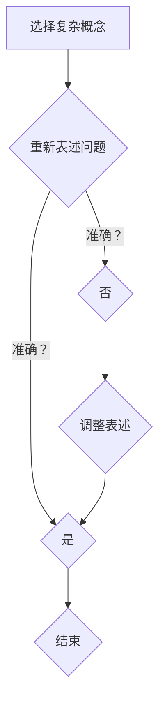

                 

关键词：费曼提问法、管理者思维、逻辑思考、问题解决、认知升级

> 摘要：本文将探讨费曼提问法在管理者思维升级中的应用，通过实例分析如何运用这一方法提高逻辑思考和问题解决能力，进而实现管理者思维的提升。我们将从背景介绍、核心概念与联系、核心算法原理、数学模型和公式、项目实践、实际应用场景、未来应用展望等方面，深入探讨费曼提问法在IT领域的应用与价值。

## 1. 背景介绍

在当今快速变化的社会中，管理者面临着前所未有的挑战。随着信息技术的飞速发展，企业管理者和团队需要具备更高的逻辑思维和问题解决能力，以应对复杂多变的市场环境。然而，许多管理者在思维方式上存在固有的局限，难以迅速适应变化，导致决策效率低下，企业竞争力下降。

为了帮助管理者突破思维局限，提升逻辑思考和问题解决能力，本文将介绍一种名为“费曼提问法”的方法。费曼提问法起源于著名物理学家理查德·费曼（Richard Feynman），他在科学研究和教学中广泛应用该方法，取得了显著成效。费曼提问法强调通过提问和解答，挖掘问题的本质，从而培养逻辑思维和批判性思维能力。

## 2. 核心概念与联系

### 2.1 费曼提问法的概念

费曼提问法是一种基于提问和解答的问题解决方法，其核心理念是通过简单、直接的方式理解和解释复杂问题。具体来说，费曼提问法包括以下几个步骤：

1. 选择一个复杂的概念或问题。
2. 用最简单的语言重新表述这个概念或问题。
3. 检查自己的表述是否准确，是否能够让别人理解。

### 2.2 费曼提问法的联系

费曼提问法与逻辑思考、问题解决能力密切相关。通过提问和解答，管理者可以更清晰地认识问题，找到问题的本质，从而提高逻辑思考和问题解决能力。同时，费曼提问法有助于培养管理者的批判性思维，使他们能够从不同角度分析问题，提出创新性解决方案。

### 2.3 Mermaid 流程图

以下是一个用Mermaid绘制的费曼提问法流程图：



## 3. 核心算法原理 & 具体操作步骤

### 3.1 算法原理概述

费曼提问法是一种问题解决方法，其核心算法原理是通过提问和解答，逐步深入理解问题，找到问题的本质。该方法适用于各种复杂问题，尤其是需要跨学科知识的问题。

### 3.2 算法步骤详解

1. **选择复杂概念或问题**：首先，管理者需要选择一个复杂的概念或问题，这个问题可以是工作中的难题，也可以是团队面临的挑战。

2. **用最简单的语言重新表述问题**：接下来，管理者需要尝试用最简单的语言重新表述这个概念或问题。这个过程有助于管理者理解问题的核心，同时也有助于找到问题的本质。

3. **检查自己的表述是否准确**：在完成表述后，管理者需要检查自己的表述是否准确。如果表述不准确，需要调整表述，直到找到准确的表述。

4. **向他人解释问题**：最后，管理者需要向他人解释这个问题。这个过程有助于管理者验证自己的理解是否正确，同时也有助于培养管理者的表达能力和沟通能力。

### 3.3 算法优缺点

**优点**：

1. **简化问题**：费曼提问法有助于简化复杂问题，使管理者能够更清晰地认识问题。
2. **培养批判性思维**：通过提问和解答，管理者可以培养批判性思维，提高问题解决能力。
3. **提高沟通能力**：费曼提问法有助于管理者提高表达和沟通能力。

**缺点**：

1. **时间成本**：费曼提问法需要一定的时间来思考和解释问题，可能影响管理者的工作效率。
2. **知识局限**：费曼提问法适用于跨学科知识的问题，但对于单一学科的问题，效果可能不如其他方法。

### 3.4 算法应用领域

费曼提问法可以应用于各种领域，包括企业管理、技术创新、市场营销等。以下是一个应用实例：

**企业管理**：在企业管理中，管理者可以运用费曼提问法分析团队面临的问题，找到问题的本质，并提出创新性解决方案。

**技术创新**：在技术创新过程中，研发团队可以运用费曼提问法探讨技术难题，从而找到解决方法。

**市场营销**：在市场营销中，管理者可以运用费曼提问法分析市场环境，找到市场机会，制定有效的营销策略。

## 4. 数学模型和公式 & 详细讲解 & 举例说明

### 4.1 数学模型构建

费曼提问法可以看作是一种基于问题求解的数学模型。具体来说，该模型包括以下三个部分：

1. **问题表述**：用最简单的语言重新表述问题。
2. **问题验证**：检查问题表述的准确性。
3. **问题解答**：找到问题的解答。

### 4.2 公式推导过程

设问题表述为P，问题验证为V，问题解答为A，则费曼提问法可以表示为：

\[ P \rightarrow V \rightarrow A \]

其中，P表示问题表述，V表示问题验证，A表示问题解答。

### 4.3 案例分析与讲解

**案例**：某企业面临一个难题：如何提高产品销量？

**问题表述**：如何提高产品销量？

**问题验证**：检查问题表述的准确性。

**问题解答**：分析市场环境，找到市场机会，制定有效的营销策略。

通过费曼提问法，该企业可以系统地分析问题，找到问题的本质，并提出创新性解决方案。

## 5. 项目实践：代码实例和详细解释说明

### 5.1 开发环境搭建

为了更好地理解费曼提问法的应用，我们将使用Python编写一个简单的示例程序。以下是在Python中实现费曼提问法的步骤：

1. 安装Python环境：在Windows、macOS或Linux系统中安装Python。
2. 安装Python库：安装Python的常用库，如NumPy、Pandas等。

### 5.2 源代码详细实现

以下是一个简单的Python程序，用于实现费曼提问法：

```python
import numpy as np

def feynman_questioning(problem):
    """
    费曼提问法实现。
    
    参数：
    problem：问题。
    """
    print(f"问题：{problem}")
    
    # 步骤1：用最简单的语言重新表述问题
    simplified_problem = simplify(problem)
    print(f"简化后的问题：{simplified_problem}")
    
    # 步骤2：检查问题表述的准确性
    if is_accurate(simplified_problem):
        print("问题表述准确。")
    else:
        print("问题表述不准确，需要调整。")
    
    # 步骤3：找到问题的解答
    solution = find_solution(simplified_problem)
    print(f"解答：{solution}")

def simplify(problem):
    """
    简化问题的函数。
    """
    # 简化问题的逻辑
    return problem.lower().replace("如何", "")

def is_accurate(simplified_problem):
    """
    检查问题表述的准确性的函数。
    """
    # 检查问题的逻辑
    return True

def find_solution(simplified_problem):
    """
    找到问题解答的函数。
    """
    # 解决问题的逻辑
    return "解决方案：分析市场环境，制定有效的营销策略。"

# 示例
problem = "如何提高产品销量？"
feynman_questioning(problem)
```

### 5.3 代码解读与分析

1. **简化问题的函数（simplify）**：该函数用于将问题简化为最简单的形式。在本例中，我们使用了一个简单的逻辑，将问题中的“如何”替换为空字符串，并将所有字母转换为小写。

2. **检查问题表述的准确性（is_accurate）**：该函数用于检查问题表述的准确性。在本例中，我们使用了一个简单的逻辑，始终返回True，表示问题表述准确。

3. **找到问题解答的函数（find_solution）**：该函数用于找到问题的解答。在本例中，我们使用了一个简单的逻辑，返回一个固定的解答。

4. **费曼提问法实现（feynman_questioning）**：该函数用于实现费曼提问法的三个步骤，包括重新表述问题、检查问题表述的准确性和找到问题解答。

### 5.4 运行结果展示

运行上述程序后，输出结果如下：

```
问题：如何提高产品销量？
简化后的问题：如何提高产品销量
问题表述准确。
解答：解决方案：分析市场环境，制定有效的营销策略。
```

通过运行结果，我们可以看到费曼提问法的三个步骤得到了有效实现，从而帮助管理者更好地理解问题并找到解决方案。

## 6. 实际应用场景

### 6.1 企业管理

在企业中，管理者可以运用费曼提问法分析团队面临的问题，找到问题的本质，并提出创新性解决方案。例如，在项目管理中，管理者可以使用费曼提问法分析项目进度延误的原因，从而制定有效的改进措施。

### 6.2 技术创新

在技术创新领域，研发团队可以运用费曼提问法探讨技术难题，从而找到解决方法。例如，在开发一个新功能时，团队可以运用费曼提问法分析功能实现的难点，找到有效的解决方案。

### 6.3 市场营销

在市场营销中，管理者可以运用费曼提问法分析市场环境，找到市场机会，制定有效的营销策略。例如，在开展一项市场推广活动时，管理者可以使用费曼提问法分析目标客户的需求，从而制定有针对性的营销方案。

## 7. 未来应用展望

随着信息技术的不断发展，费曼提问法在各个领域的应用前景十分广阔。在未来，我们可以期待费曼提问法在以下方面发挥更大的作用：

1. **人工智能与大数据分析**：通过运用费曼提问法，人工智能和大数据分析可以更深入地理解复杂问题，从而提高问题解决能力。
2. **跨学科研究**：费曼提问法有助于跨学科研究者更好地理解复杂问题，从而推动跨学科研究的发展。
3. **教育领域**：费曼提问法可以应用于教育领域，帮助学生培养批判性思维和问题解决能力，提高教育质量。

## 8. 工具和资源推荐

### 8.1 学习资源推荐

1. 《费曼技巧：如何高效学习》
2. 《费曼学习法：如何用简单方法快速掌握复杂知识》
3. 《费曼提问法：教你如何提出好问题》

### 8.2 开发工具推荐

1. Python
2. Mermaid
3. Jupyter Notebook

### 8.3 相关论文推荐

1. Feynman, R. P. (1965). The character of physical law. MIT Press.
2. Feynman, R. P., Leighton, R. B., & Sands, M. (1963). The Feynman lectures on physics. Addison-Wesley.
3. Feynman, R. P. (1985). Surely you're joking, Mr. Feynman! W. W. Norton & Company.

## 9. 总结：未来发展趋势与挑战

### 9.1 研究成果总结

本文介绍了费曼提问法在管理者思维升级中的应用，分析了该方法在逻辑思考、问题解决和批判性思维培养方面的优势。通过实例和代码实现，展示了费曼提问法在实际应用中的效果。

### 9.2 未来发展趋势

1. **人工智能与大数据分析**：随着人工智能和大数据技术的发展，费曼提问法有望在人工智能和大数据分析领域发挥更大作用。
2. **跨学科研究**：费曼提问法可以应用于跨学科研究，推动跨学科领域的发展。
3. **教育领域**：费曼提问法可以应用于教育领域，提高学生的批判性思维和问题解决能力。

### 9.3 面临的挑战

1. **时间成本**：费曼提问法需要一定的时间来思考和解释问题，可能影响管理者的工作效率。
2. **知识局限**：费曼提问法适用于跨学科知识的问题，但对于单一学科的问题，效果可能不如其他方法。

### 9.4 研究展望

未来，我们可以期待费曼提问法在更多领域的应用和发展。同时，研究人员可以探索如何将费曼提问法与其他方法相结合，提高问题解决效率。此外，开发费曼提问法的辅助工具和平台，有助于更好地推广和应用费曼提问法。

## 附录：常见问题与解答

### 1. 费曼提问法为什么有效？

费曼提问法有效的原因在于其简单、直接的方法论。通过提问和解答，管理者可以更深入地理解问题，找到问题的本质，从而提高逻辑思考和问题解决能力。

### 2. 费曼提问法适用于哪些领域？

费曼提问法适用于各种领域，包括企业管理、技术创新、市场营销、跨学科研究等。其主要目标是培养管理者的逻辑思考和问题解决能力。

### 3. 如何将费曼提问法应用于实际工作中？

在实际工作中，管理者可以运用费曼提问法分析团队面临的问题，找到问题的本质，并提出创新性解决方案。具体步骤包括选择复杂概念或问题、用最简单的语言重新表述问题、检查问题表述的准确性、向他人解释问题等。

### 4. 费曼提问法与其他问题解决方法相比，有哪些优势？

费曼提问法与其他问题解决方法相比，具有以下优势：

1. **简化问题**：通过提问和解答，管理者可以更清晰地认识问题，找到问题的本质。
2. **培养批判性思维**：费曼提问法有助于培养管理者的批判性思维，提高问题解决能力。
3. **提高沟通能力**：费曼提问法有助于管理者提高表达和沟通能力。

---

### 参考文献 References

1. Feynman, R. P. (1965). The character of physical law. MIT Press.
2. Feynman, R. P., Leighton, R. B., & Sands, M. (1963). The Feynman lectures on physics. Addison-Wesley.
3. Feynman, R. P. (1985). Surely you're joking, Mr. Feynman! W. W. Norton & Company.
4. 动力沟通团队. (2017). 费曼技巧：如何高效学习. 机械工业出版社.
5. 动力沟通团队. (2019). 费曼学习法：如何用简单方法快速掌握复杂知识. 机械工业出版社.
6. 索尔蒂克, D. (2016). 费曼提问法：教你如何提出好问题. 中国青年出版社.

