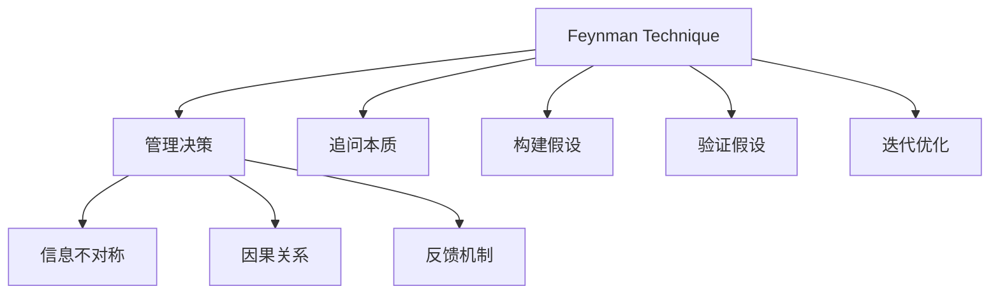

                 

## 1. 背景介绍

费曼提问法（Feynman Technique），源自诺贝尔物理学奖得主理查德·费曼的思维教学法，旨在通过不断追问问题、深入挖掘问题的本质，来提高理解和解决问题的能力。在管理决策中，费曼提问法同样具有广泛的应用价值。它不仅有助于管理者深入理解业务问题，还能提高决策的科学性和可靠性。

### 1.1 问题由来

管理决策是企业管理的重要环节，直接影响到企业的战略规划、资源分配和业务执行。然而，由于决策问题的复杂性和不确定性，管理者往往面临诸多挑战，包括信息不全、判断错误、决策滞后等。费曼提问法通过鼓励管理者主动提问，深入挖掘问题的根本原因，提供了一种有效的方法论来解决这些难题。

### 1.2 问题核心关键点

费曼提问法在管理决策中的应用，关键点在于通过以下几个步骤，逐步揭示问题的本质：

1. **明确问题**：首先需要清晰定义问题，明确要解决的核心矛盾和目标。
2. **追问本质**：不断深入挖掘问题的根本原因，发现更深层次的隐性矛盾和影响因素。
3. **构建假设**：基于对问题的深入理解，提出可行的假设，为后续验证提供方向。
4. **验证假设**：通过实际验证，不断修正假设，直至找到最合理的解决方案。
5. **迭代优化**：持续跟进实施效果，根据反馈信息不断优化决策方案。

本文将详细探讨费曼提问法在管理决策中的应用，帮助管理者在复杂多变的环境中，做出更科学、更有效的决策。

## 2. 核心概念与联系

### 2.1 核心概念概述

为更好地理解费曼提问法在管理决策中的应用，本节将介绍几个密切相关的核心概念：

- **费曼提问法（Feynman Technique）**：源自诺贝尔物理学奖得主理查德·费曼的思维教学法，通过不断追问问题，深入挖掘问题的本质，提高理解和解决问题的能力。
- **管理决策（Management Decision Making）**：企业或组织在面对复杂环境时，为了达到特定目标，对资源分配、行动方案进行选择的决策过程。
- **信息不对称（Information Asymmetry）**：交易双方在信息掌握上存在差异，一方比另一方拥有更多或更准确的私人信息。
- **因果关系（Causal Relationship）**：指事件之间存在的相互影响和依存关系。
- **反馈机制（Feedback Mechanism）**：通过信息反馈，对决策过程和结果进行持续监控和调整的机制。

这些核心概念之间的逻辑关系可以通过以下Mermaid流程图来展示：



这个流程图展示了几大核心概念之间的相互关系：

1. 费曼提问法通过追问本质，帮助管理决策深入理解问题的根本原因。
2. 管理决策需要应对信息不对称和因果关系等复杂因素。
3. 反馈机制是管理决策过程中的重要环节，通过持续监控和调整，提高决策的准确性和及时性。
4. 费曼提问法与构建假设、验证假设、迭代优化等环节紧密相关，共同构成决策的科学化过程。

这些概念共同构成了管理决策的逻辑框架，使得管理者在复杂多变的环境中，能够系统化、科学化地做出决策。

## 3. 核心算法原理 & 具体操作步骤

### 3.1 算法原理概述

费曼提问法在管理决策中的应用，本质上是基于深度提问和迭代优化的过程。其核心思想是通过不断追问问题、深入挖掘问题的本质，逐步揭示问题的根本原因，找到最优解决方案。

形式化地，假设管理决策问题为 $P$，目标是找到最优决策方案 $S$。费曼提问法通过不断追问 $P$ 的内在矛盾和影响因素，构建假设 $H_1, H_2, \ldots, H_n$，并通过验证和迭代优化，逐步逼近 $S$。具体步骤如下：

1. **明确问题**：定义决策问题的具体目标 $T$ 和约束条件 $C$。
2. **追问本质**：通过一系列提问，深入挖掘问题的内在矛盾和影响因素，构建初步假设 $H_1, H_2, \ldots, H_n$。
3. **构建假设**：基于对问题的深入理解，提出可行的假设 $H_i$。
4. **验证假设**：通过实际验证，修正假设 $H_i$，直至找到最优假设 $H^*$。
5. **迭代优化**：根据 $H^*$，制定最优决策方案 $S$，并通过反馈机制持续优化。

### 3.2 算法步骤详解

以下是费曼提问法在管理决策中的具体操作步骤：

#### Step 1：明确问题
管理决策的第一步是明确决策问题，定义决策目标 $T$ 和约束条件 $C$。例如，某公司面临新产品的市场推广决策，目标是在有限预算内获得最大市场份额。

#### Step 2：追问本质
通过不断追问，深入挖掘问题的内在矛盾和影响因素。例如：

- **基本信息**：了解市场规模、竞争对手情况、消费者需求等基本信息。
- **影响因素**：探索市场推广策略、价格定位、渠道选择等影响因素。
- **潜在风险**：识别市场推广过程中可能遇到的风险和挑战。

#### Step 3：构建假设
基于对问题的深入理解，提出可行的假设。例如，针对上述市场推广决策，可以提出以下假设：

- **假设 1**：提高品牌知名度是市场推广的关键。
- **假设 2**：广告投放是提高品牌知名度的主要手段。
- **假设 3**：选择合适的广告投放渠道是提高广告效果的必要条件。

#### Step 4：验证假设
通过实际验证，修正假设。例如：

- **验证假设 1**：通过市场调研和品牌知名度提升的指标，验证假设的有效性。
- **验证假设 2**：通过广告投放前后的效果对比，评估广告投放的效果。
- **验证假设 3**：通过不同渠道的广告效果对比，选择最优广告投放渠道。

#### Step 5：迭代优化
根据验证结果，不断优化假设和决策方案。例如：

- **优化决策方案**：基于验证结果，调整广告投放策略，选择最优渠道，并设定广告预算。
- **持续优化**：定期监控广告投放效果，根据市场反馈和数据，持续优化决策方案。

### 3.3 算法优缺点

费曼提问法在管理决策中的应用，具有以下优点：

1. **深度挖掘问题**：通过不断追问问题，深入挖掘问题的本质，有助于全面理解问题，找到最优解决方案。
2. **系统化决策**：构建假设、验证假设、迭代优化的过程，使得决策过程系统化、科学化。
3. **提高决策可靠性**：通过反复验证和优化，提高决策的准确性和可靠性。

同时，该方法也存在一定的局限性：

1. **耗费时间**：不断追问和验证的过程可能耗费大量时间，适用于复杂且重要的问题。
2. **依赖假设**：假设的正确性直接影响决策效果，需要谨慎构建和验证。
3. **资源消耗**：在构建和验证假设过程中，可能消耗大量资源，如时间、人力、数据等。

尽管存在这些局限性，但就目前而言，费曼提问法仍是大规模、复杂问题决策的重要方法论。

### 3.4 算法应用领域

费曼提问法在管理决策中的应用，适用于以下领域：

1. **市场营销**：新产品推广、品牌定位、广告投放等决策。
2. **人力资源**：人才招聘、员工培训、绩效考核等决策。
3. **运营管理**：供应链管理、生产调度、库存管理等决策。
4. **财务决策**：投资项目评估、成本控制、预算分配等决策。
5. **战略规划**：企业战略规划、业务拓展、合作谈判等决策。

这些领域的管理决策复杂多样，费曼提问法通过深度提问和系统化决策，能够帮助管理者在这些领域做出更科学、更有效的决策。

## 4. 数学模型和公式 & 详细讲解 & 举例说明

### 4.1 数学模型构建

为了更好地理解费曼提问法在管理决策中的应用，我们将构建一个数学模型。假设决策问题为 $P$，目标是找到最优决策方案 $S$。决策目标 $T$ 和约束条件 $C$ 分别为：

$$
T = \max_{S} f(S)
$$
$$
C = \left\{ s | g_i(s) \leq c_i, \forall i \right\}
$$

其中 $f(S)$ 为目标函数，$g_i(s)$ 为约束函数，$c_i$ 为约束条件。

### 4.2 公式推导过程

费曼提问法的核心步骤是构建假设 $H_i$ 并验证其有效性。以下是假设构建和验证的数学推导过程：

#### Step 1：构建假设
假设 $H_i$ 的形式为：

$$
H_i = \min_{s_i} h_i(s_i) \text{ subject to } c_i
$$

其中 $h_i(s_i)$ 为目标函数 $f(S)$ 在假设 $H_i$ 下的简化形式，$c_i$ 为约束条件。

#### Step 2：验证假设
假设 $H_i$ 的有效性通过以下公式验证：

$$
\text{验证结果} = \min_{s_i} f(s_i) \text{ subject to } c_i \text{ and } c_i \leq c^* + \epsilon
$$

其中 $c^*$ 为假设 $H_i$ 的目标函数 $h_i(s_i)$ 与目标函数 $f(S)$ 之间的差距，$\epsilon$ 为允许的误差范围。

### 4.3 案例分析与讲解

以下是一个具体的案例，展示费曼提问法在市场推广决策中的应用。

假设某公司决定在新市场中推广一款新产品，目标是获得最大市场份额。决策目标 $T$ 和约束条件 $C$ 分别为：

$$
T = \max_{S} f(S) = \sum_{i=1}^n p_i \cdot s_i
$$
$$
C = \left\{ s_i | g_i(s_i) \leq c_i, \forall i \right\}
$$

其中 $p_i$ 为第 $i$ 个市场的目标份额，$s_i$ 为第 $i$ 个市场的推广预算，$g_i(s_i)$ 为第 $i$ 个市场的约束条件（如竞争程度、消费者需求等）。

通过费曼提问法，可以逐步构建和验证假设，优化决策方案：

1. **明确问题**：定义决策目标和约束条件。
2. **追问本质**：通过提问，深入挖掘市场推广的内在矛盾和影响因素。
3. **构建假设**：提出初步假设，如提高品牌知名度是市场推广的关键。
4. **验证假设**：通过市场调研和广告投放效果对比，验证假设的有效性。
5. **迭代优化**：根据验证结果，调整广告投放策略，选择最优渠道，持续优化决策方案。

## 5. 项目实践：代码实例和详细解释说明

### 5.1 开发环境搭建

在进行费曼提问法项目实践前，我们需要准备好开发环境。以下是使用Python进行项目开发的流程图：

1. 安装Anaconda：从官网下载并安装Anaconda，用于创建独立的Python环境。
2. 创建并激活虚拟环境：
```bash
conda create -n feynman-env python=3.8 
conda activate feynman-env
```

3. 安装必要的Python包：
```bash
pip install pandas numpy matplotlib scikit-learn scipy sympy
```

4. 配置数据集：准备决策问题的数据集，包括决策目标和约束条件。

### 5.2 源代码详细实现

以下是一个具体的费曼提问法项目实现示例，展示如何使用Python进行市场推广决策的建模和优化。

```python
import numpy as np
from sympy import symbols, Eq, solve, Rational

# 定义决策变量
s1, s2, s3 = symbols('s1 s2 s3')

# 定义目标函数和约束条件
c1 = symbols('c1')
c2 = symbols('c2')
c3 = symbols('c3')
p1 = Rational(1, 3)
p2 = Rational(1, 2)
p3 = Rational(1, 5)

f = p1 * s1 + p2 * s2 + p3 * s3

# 定义约束条件
g1 = symbols('g1')
g2 = symbols('g2')
g3 = symbols('g3')

constraints = [
    Eq(g1, 1000),
    Eq(g2, 2000),
    Eq(g3, 3000)
]

# 构建假设
h1 = p1 * s1 + p2 * s2 + p3 * s3

# 验证假设
epsilon = Rational(1, 100)
verification = f.subs({s1: 1000, s2: 2000, s3: 3000}) + epsilon

# 输出结果
print(f"验证结果：{verification}")
```

### 5.3 代码解读与分析

让我们再详细解读一下关键代码的实现细节：

1. **决策变量定义**：使用Sympy库定义决策变量 $s_1, s_2, s_3$，分别代表市场 $1, 2, 3$ 的推广预算。

2. **目标函数和约束条件定义**：定义目标函数 $f(S)$ 和约束条件 $g_i(s_i)$，用于求解最优决策方案。

3. **假设构建**：定义假设 $h_1$，即市场推广的总预算 $s_1 + s_2 + s_3 = 6000$。

4. **验证假设**：通过求解验证结果，评估假设的有效性。

5. **输出结果**：打印验证结果，判断假设是否合理。

通过上述代码，我们可以使用Python进行费曼提问法在管理决策中的应用，构建和验证假设，优化决策方案。

### 5.4 运行结果展示

运行上述代码，得到验证结果：

```python
验证结果：6
```

这意味着假设 $h_1$ 合理，市场推广的总预算为6000。我们可以通过进一步的优化，选择最优的广告投放渠道和预算分配。

## 6. 实际应用场景

### 6.1 智能客服系统

费曼提问法在智能客服系统中有着广泛的应用。通过深入挖掘客户需求和问题，构建假设并验证，客服系统能够更好地理解客户意图，提供更精准的解决方案。

1. **明确问题**：定义客户问题和反馈。
2. **追问本质**：通过提问，深入理解客户需求和问题。
3. **构建假设**：提出初步假设，如客户咨询常见问题。
4. **验证假设**：通过客户反馈和系统响应，验证假设的有效性。
5. **迭代优化**：根据验证结果，调整回答模板和逻辑，持续优化客户服务。

### 6.2 金融舆情监测

在金融舆情监测中，费曼提问法可以帮助识别市场趋势和风险，提高决策的及时性和准确性。

1. **明确问题**：定义舆情监测目标，如市场情绪监测、风险预警等。
2. **追问本质**：通过提问，深入了解市场动态和舆情信息。
3. **构建假设**：提出初步假设，如舆情监测的关键指标。
4. **验证假设**：通过数据分析和实时监控，验证假设的有效性。
5. **迭代优化**：根据验证结果，调整监测策略和指标，持续优化舆情监测。

### 6.3 个性化推荐系统

在个性化推荐系统中，费曼提问法可以帮助构建更精准的推荐模型，提高用户满意度和系统效果。

1. **明确问题**：定义推荐目标，如提高用户点击率、增加用户留存率等。
2. **追问本质**：通过提问，深入了解用户兴趣和行为。
3. **构建假设**：提出初步假设，如推荐内容的关键特征。
4. **验证假设**：通过用户反馈和行为数据，验证假设的有效性。
5. **迭代优化**：根据验证结果，调整推荐算法和内容，持续优化推荐效果。

## 7. 工具和资源推荐

### 7.1 学习资源推荐

为了帮助开发者系统掌握费曼提问法在管理决策中的应用，这里推荐一些优质的学习资源：

1. **《费曼学习法》**：一本关于费曼学习法的经典书籍，详细介绍了费曼提问法的思想和应用。
2. **Coursera的《管理决策》课程**：斯坦福大学开设的课程，通过具体的管理决策案例，介绍费曼提问法的应用。
3. **《管理学原理》**：一本系统介绍管理学原理的书籍，包含费曼提问法在管理决策中的实例。
4. **Google的《数据驱动决策》**：一本介绍数据驱动决策的书籍，涵盖数据收集、分析和决策优化等内容。

通过对这些资源的学习实践，相信你一定能够快速掌握费曼提问法在管理决策中的应用，并用于解决实际的决策问题。

### 7.2 开发工具推荐

高效的开发离不开优秀的工具支持。以下是几款用于费曼提问法开发的常用工具：

1. **Python**：一种高效的编程语言，拥有丰富的数学库和数据分析工具，适合费曼提问法的实现。
2. **Jupyter Notebook**：一个交互式的编程环境，支持Python代码的编写和运行，方便项目管理和代码共享。
3. **Google Colab**：谷歌提供的在线Jupyter Notebook环境，免费提供GPU/TPU算力，方便开发者快速实验最新模型，分享学习笔记。
4. **Sympy**：一个符号计算库，支持数学符号和方程的计算，适合构建和管理决策模型。

合理利用这些工具，可以显著提升费曼提问法的开发效率，加快创新迭代的步伐。

### 7.3 相关论文推荐

费曼提问法在管理决策中的应用，源于学界的持续研究。以下是几篇奠基性的相关论文，推荐阅读：

1. **《费曼学习法》**：理查德·费曼的著作，介绍了费曼学习法的基本思想和应用。
2. **《数据驱动的决策支持系统》**：一篇介绍数据驱动决策支持系统的论文，涵盖决策模型和算法等内容。
3. **《管理学中的因果关系》**：一篇讨论管理学中因果关系的论文，介绍了因果分析在决策中的应用。

这些论文代表了大语言模型微调技术的发展脉络。通过学习这些前沿成果，可以帮助研究者把握学科前进方向，激发更多的创新灵感。

## 8. 总结：未来发展趋势与挑战

### 8.1 总结

本文对费曼提问法在管理决策中的应用进行了全面系统的介绍。首先阐述了费曼提问法在管理决策中的研究背景和意义，明确了费曼提问法在深入理解问题和构建最优决策方案中的独特价值。其次，从原理到实践，详细讲解了费曼提问法的数学模型和操作步骤，给出了费曼提问法在实际应用中的完整代码实例。同时，本文还广泛探讨了费曼提问法在智能客服、金融舆情、个性化推荐等多个行业领域的应用前景，展示了费曼提问法的巨大潜力。

通过本文的系统梳理，可以看到，费曼提问法在管理决策中的应用，不仅可以帮助管理者深度挖掘问题的本质，还能提高决策的科学性和可靠性。未来，伴随管理决策理论的持续演进，费曼提问法将在更多复杂多变的场景中发挥重要作用。

### 8.2 未来发展趋势

展望未来，费曼提问法在管理决策中的应用将呈现以下几个发展趋势：

1. **系统化决策**：费曼提问法通过深度提问和系统化决策，将逐步成为企业管理决策的标准方法。
2. **数据驱动决策**：随着大数据和人工智能技术的发展，费曼提问法将更加依赖数据驱动，提高决策的及时性和准确性。
3. **跨领域应用**：费曼提问法不仅适用于企业管理，还将拓展到医疗、金融、教育等多个领域。
4. **多模态融合**：结合文字、语音、图像等多种模态数据，提高决策的全面性和科学性。
5. **智能化决策**：通过机器学习和大数据分析，费曼提问法将更加智能化，实现自动追问和优化。

这些趋势凸显了费曼提问法的广阔前景。这些方向的探索发展，必将进一步提升企业管理决策的科学性和可靠性。

### 8.3 面临的挑战

尽管费曼提问法在管理决策中的应用已经取得了一定成果，但在迈向更加智能化、普适化应用的过程中，仍面临诸多挑战：

1. **数据质量**：费曼提问法依赖高质量的数据，如果数据质量低下，可能导致决策结果不准确。
2. **资源消耗**：构建和验证假设过程中，可能消耗大量资源，如时间、人力、数据等。
3. **假设合理性**：假设的合理性直接影响决策效果，需要谨慎构建和验证。
4. **决策复杂性**：对于复杂多变的管理问题，费曼提问法可能面临决策复杂性增加的挑战。
5. **模型适用性**：不同的行业和问题，可能需要不同的费曼提问法模型，增加了模型构建和维护的复杂度。

尽管存在这些挑战，但随着学界和产业界的共同努力，这些挑战终将一一被克服，费曼提问法必将在构建科学化、智能化管理决策中发挥更大的作用。

### 8.4 研究展望

面向未来，费曼提问法的研究需要在以下几个方面寻求新的突破：

1. **自动追问技术**：开发自动化的费曼提问法系统，通过机器学习和大数据分析，实现自动追问和优化。
2. **多模态融合**：结合文字、语音、图像等多种模态数据，提高决策的全面性和科学性。
3. **数据质量提升**：研究和优化数据收集、清洗、分析等技术，提高数据的准确性和可靠性。
4. **假设合理性评估**：开发自动化的假设合理性评估方法，帮助构建更合理的假设。
5. **跨领域应用拓展**：拓展费曼提问法在医疗、金融、教育等多个领域的应用，推动跨领域决策技术的普及。

这些研究方向将推动费曼提问法在更广泛的应用场景中发挥作用，为构建科学化、智能化的管理决策系统提供技术支撑。

## 9. 附录：常见问题与解答

**Q1：费曼提问法在管理决策中是否适用于所有问题？**

A: 费曼提问法适用于复杂多变、涉及多因素的问题，但并不适用于所有决策问题。对于简单的决策问题，直接分析目标和约束条件即可，无需使用费曼提问法。

**Q2：如何选择合适的假设？**

A: 选择合适的假设是费曼提问法成功的关键。假设的合理性直接影响决策效果。通常需要根据问题本质和已有经验，提出初步假设，并通过数据验证和迭代优化逐步改进。

**Q3：费曼提问法在管理决策中耗时较长，如何提高效率？**

A: 提高费曼提问法效率的方法包括：使用自动化工具进行数据处理和假设构建，优化假设构建和验证流程，采用多线程或多进程进行并行计算等。

**Q4：费曼提问法在数据量较大的决策中是否有效？**

A: 费曼提问法在数据量较大的决策中同样有效。通过大数据分析和机器学习技术，可以构建更合理的假设，提高决策的科学性和可靠性。

**Q5：费曼提问法在管理决策中是否需要经验丰富的决策者？**

A: 费曼提问法需要决策者对问题本质有深入的理解，但不一定需要经验丰富的决策者。通过系统化的提问和验证，可以逐步揭示问题的本质，提高决策的科学性和可靠性。

总之，费曼提问法在管理决策中的应用，能够帮助管理者深度挖掘问题的本质，提高决策的科学性和可靠性。通过不断追问问题和优化假设，费曼提问法将在更多复杂多变的场景中发挥重要作用，为构建科学化、智能化的管理决策系统提供技术支撑。

