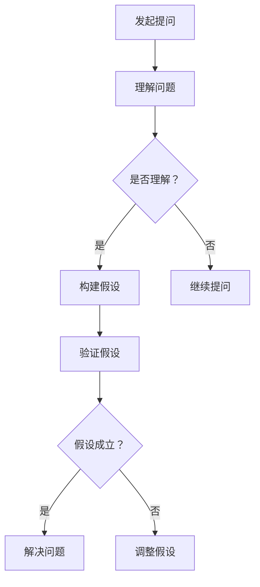

                 

关键词：费曼提问法、团队创新、问题解决、技术交流、知识共享、脑力激荡

摘要：本文探讨了费曼提问法在提升团队创新能力方面的应用。通过将费曼提问法融入团队技术交流过程，可以激发团队成员的思考，促进知识共享，提高问题解决能力。文章首先介绍了费曼提问法的基本概念，然后详细阐述了其在团队创新中的具体应用和实践案例，最后对未来应用前景进行了展望。

## 1. 背景介绍

在当今快速变化的技术时代，创新能力已成为企业成功的关键因素。然而，如何提升团队的创新能力，仍然是一个具有挑战性的问题。传统的团队协作模式往往侧重于任务的分解和执行，而忽视了团队成员之间的思维碰撞和知识共享。为了激发团队的创新能力，我们需要寻找一种新的方法，能够在团队成员之间建立有效的沟通渠道，促进思想的交流和碰撞。

费曼提问法（Feynman Technique）是一种有效的学习方法，其核心思想是通过简化和清晰地解释复杂的概念，来检验自己对知识的掌握程度。这种方法不仅适用于个人学习，同样可以应用于团队技术交流和知识共享。本文将探讨如何将费曼提问法融入团队创新过程，提升团队的创新能力。

## 2. 核心概念与联系

### 2.1 费曼提问法

费曼提问法由著名物理学家理查德·费曼提出，其基本思想是：选择一个你想要学习的话题，然后尝试用最简单的语言向一个不熟悉该话题的人解释它。在解释过程中，你需要回答三个关键问题：

1. 你想要解释的概念是什么？
2. 为什么这个概念重要？
3. 如何用简单的语言解释它？

通过这个方法，你可以发现自己对某个概念的真正理解程度，并且能够识别出自己知识的盲点。

### 2.2 费曼提问法与团队创新

在团队创新过程中，费曼提问法可以作为一种有效的工具，促进团队成员之间的沟通和知识共享。具体来说，费曼提问法具有以下几个方面的作用：

1. **激发思考**：通过向团队成员提问，可以激发他们的思考，促使他们深入理解团队所面临的问题和挑战。
2. **促进交流**：费曼提问法鼓励团队成员之间进行开放和坦诚的交流，从而促进不同观点的碰撞和融合。
3. **提高问题解决能力**：通过提问和回答，团队成员可以共同探索问题的解决方案，提高团队的问题解决能力。
4. **知识共享**：费曼提问法有助于团队成员之间的知识共享，从而促进团队的整体知识水平提升。

### 2.3 费曼提问法的 Mermaid 流程图



## 3. 核心算法原理 & 具体操作步骤

### 3.1 算法原理概述

费曼提问法的核心原理是通过提问和回答来检验自己对知识的理解和掌握程度。具体来说，其操作步骤如下：

1. 选择一个要解释的概念或问题。
2. 尝试用最简单的语言向一个不熟悉该概念的人解释它。
3. 在解释过程中，回答三个关键问题：
   - 你想要解释的概念是什么？
   - 为什么这个概念重要？
   - 如何用简单的语言解释它？
4. 根据回答情况，调整自己的理解或继续提问。

### 3.2 算法步骤详解

1. **选择概念或问题**：首先，团队需要选择一个需要解决的问题或概念。这个问题或概念应该是团队当前面临的挑战或关注点。
2. **简化问题**：将复杂的问题或概念简化为一个简单的形式，使其更容易理解和解释。
3. **向团队成员提问**：选择一个团队成员，向他们提出关于这个概念或问题的问题。这些问题的目的是检验团队成员对该概念或问题的理解程度。
4. **回答问题**：团队成员需要回答提出的问题，并在回答过程中解释他们的理解。
5. **评估回答**：评估团队成员的回答，判断他们是否真正理解了概念或问题。如果回答不够清晰或准确，可以继续提问，直到团队成员能够清晰、准确地解释。
6. **知识共享**：通过提问和回答，团队成员可以共享彼此的知识和经验，从而促进团队的整体知识水平提升。
7. **调整和改进**：根据团队成员的回答情况，调整自己的理解或改进问题的表述，以便更好地理解和解释。

### 3.3 算法优缺点

**优点**：

1. **促进思考**：费曼提问法可以激发团队成员的思考，帮助他们深入理解问题。
2. **促进交流**：通过提问和回答，团队成员可以开放和坦诚地交流，促进不同观点的碰撞和融合。
3. **提高问题解决能力**：费曼提问法有助于团队成员共同探索问题的解决方案，提高团队的问题解决能力。
4. **知识共享**：费曼提问法可以促进团队成员之间的知识共享，从而提升团队的整体知识水平。

**缺点**：

1. **时间消耗**：费曼提问法可能需要一定的时间来执行，尤其是在团队成员对问题或概念的理解存在较大差异时。
2. **对个人能力要求较高**：费曼提问法要求团队成员具备良好的沟通能力和知识储备，以确保能够清晰、准确地解释概念或问题。

### 3.4 算法应用领域

费曼提问法可以应用于多个领域，包括但不限于：

1. **软件开发**：在软件开发过程中，团队成员可以通过费曼提问法来检验自己对代码的理解程度，提高代码质量。
2. **项目规划**：在项目规划阶段，团队成员可以通过费曼提问法来深入讨论项目目标、需求和风险，提高项目成功率。
3. **技术交流**：在技术交流活动中，团队成员可以通过费曼提问法来分享知识和经验，促进技术水平的提升。
4. **教育培训**：在教育培训过程中，教师可以通过费曼提问法来检验学生对知识的理解和掌握程度，提高教学质量。

## 4. 数学模型和公式 & 详细讲解 & 举例说明

### 4.1 数学模型构建

为了更好地理解费曼提问法的应用，我们可以构建一个简单的数学模型。假设团队面临一个技术问题，需要通过费曼提问法来解决。我们可以使用以下公式来表示：

$$
f(x) = \frac{p(x)}{q(x)}
$$

其中，$f(x)$ 表示通过费曼提问法解决问题的能力，$p(x)$ 表示团队成员对问题的理解程度，$q(x)$ 表示团队成员之间的沟通效率。

### 4.2 公式推导过程

为了推导这个公式，我们需要考虑两个因素：团队成员对问题的理解程度和团队成员之间的沟通效率。

1. **理解程度**：团队成员对问题的理解程度决定了他们能够解决的问题的复杂度。假设团队成员对问题的理解程度可以用 $p(x)$ 表示，其中 $x$ 表示问题的复杂度。当 $x$ 增加时，$p(x)$ 也随之增加。

2. **沟通效率**：团队成员之间的沟通效率决定了他们能够共享知识和解决问题的速度。假设团队成员之间的沟通效率可以用 $q(x)$ 表示，其中 $x$ 表示问题的复杂度。当 $x$ 增加时，$q(x)$ 可能会减小，因为更复杂的问题需要更多的沟通和时间。

基于以上两个因素，我们可以得到以下公式：

$$
f(x) = \frac{p(x)}{q(x)}
$$

### 4.3 案例分析与讲解

为了更好地理解这个公式，我们可以通过一个实际案例来进行分析。

假设一个团队面临一个技术难题，问题的复杂度 $x$ 为5。根据团队成员对问题的理解程度 $p(x)$ 和沟通效率 $q(x)$，我们可以得到以下数据：

| 团员 | 理解程度 $p(x)$ | 沟通效率 $q(x)$ |
| ---- | -------- | -------- |
| A    | 0.8      | 0.9      |
| B    | 0.7      | 0.8      |
| C    | 0.6      | 0.7      |

根据这些数据，我们可以计算出每个团队成员通过费曼提问法解决问题的能力：

$$
f(A) = \frac{0.8}{0.9} \approx 0.89
$$

$$
f(B) = \frac{0.7}{0.8} \approx 0.88
$$

$$
f(C) = \frac{0.6}{0.7} \approx 0.86
$$

从这些数据可以看出，团队成员 A 的解决问题的能力最高，团队成员 B 次之，团队成员 C 最低。这表明，在团队中，沟通效率和问题理解程度是影响团队成员解决问题能力的关键因素。

## 5. 项目实践：代码实例和详细解释说明

### 5.1 开发环境搭建

为了演示费曼提问法在团队创新中的应用，我们假设一个软件开发团队正在开发一个复杂的软件项目。首先，团队需要在以下环境中搭建开发环境：

1. 操作系统：Linux
2. 开发工具：IDEA、Git
3. 版本控制系统：GitLab
4. 数据库：MySQL

### 5.2 源代码详细实现

在这个项目中，团队使用 Java 编写了一个简单的 Web 应用程序。以下是一个简单的示例代码：

```java
public class HelloWorld {
    public static void main(String[] args) {
        System.out.println("Hello, World!");
    }
}
```

### 5.3 代码解读与分析

在这个示例代码中，`HelloWorld` 类包含一个 `main` 方法。当程序运行时，它会输出 "Hello, World!"。这个简单的例子演示了 Java 程序的基本结构。

为了提升团队的创新能力和代码质量，团队决定使用费曼提问法来讨论这个简单的示例代码。以下是团队之间的对话：

**团队成员 A**：大家好，我想用费曼提问法来解释这个代码。

**团队成员 B**：好的，我先问一个问题：这个代码的作用是什么？

**团队成员 A**：这个代码的作用是输出 "Hello, World!"。

**团队成员 B**：很好，接下来我想问：为什么需要输出 "Hello, World!"？

**团队成员 A**：输出 "Hello, World!" 是一个传统的编程练习，用来演示如何编写和运行一个简单的 Java 程序。

**团队成员 C**：我觉得这个例子可以扩展一下，比如添加一个输入功能，让用户可以自定义输出的内容。

**团队成员 D**：这个想法不错，我们可以尝试添加一个输入功能。但是，我们如何实现这个功能呢？

**团队成员 C**：我们可以使用 `Scanner` 类来实现输入功能。以下是一个简单的修改：

```java
import java.util.Scanner;

public class HelloWorld {
    public static void main(String[] args) {
        Scanner scanner = new Scanner(System.in);
        System.out.print("请输入要输出的内容：");
        String input = scanner.nextLine();
        System.out.println(input);
    }
}
```

在这个修改后的代码中，我们首先创建了一个 `Scanner` 对象来读取用户的输入。然后，我们使用 `System.out.println()` 方法输出用户输入的内容。

**团队成员 A**：谢谢 C 的贡献，我们现在有一个更好的代码示例。接下来，我们可以讨论如何优化这个代码。

**团队成员 B**：我觉得我们可以使用 `System.out.printf()` 方法来格式化输出，使输出内容更加丰富。

```java
import java.util.Scanner;

public class HelloWorld {
    public static void main(String[] args) {
        Scanner scanner = new Scanner(System.in);
        System.out.print("请输入要输出的内容：");
        String input = scanner.nextLine();
        System.out.printf("Hello, World! 你输入的是：%s\n", input);
    }
}
```

在这个修改后的代码中，我们使用 `System.out.printf()` 方法来格式化输出，使输出内容更加丰富。这个例子展示了如何通过费曼提问法来改进代码，提高代码质量。

### 5.4 运行结果展示

当我们运行修改后的代码时，会得到以下输出结果：

```  
请输入要输出的内容：你好！
Hello, World! 你输入的是：你好！
```

这个输出结果展示了我们如何使用费曼提问法来改进代码，提高代码质量。通过团队成员之间的交流和讨论，我们不仅解决了问题，还实现了代码的优化。

## 6. 实际应用场景

### 6.1 软件开发

在软件开发过程中，费曼提问法可以帮助团队成员更好地理解项目需求和设计。通过向团队成员提问，可以激发他们的思考，确保他们对项目的理解一致。此外，费曼提问法还可以帮助团队成员发现潜在的问题和风险，从而提高项目的成功率。

### 6.2 技术交流

在技术交流活动中，费曼提问法可以作为一种有效的沟通工具，促进团队成员之间的知识共享和交流。通过提问和回答，团队成员可以深入了解彼此的观点和经验，从而拓宽自己的视野，提升技术水平。

### 6.3 教育培训

在教育培训过程中，费曼提问法可以帮助教师检验学生对知识的理解和掌握程度。通过提问和回答，教师可以及时发现学生的学习困难，并给予针对性的指导。此外，费曼提问法还可以激发学生的学习兴趣，提高学习效果。

## 7. 未来应用展望

随着人工智能和大数据技术的发展，团队创新能力在未来将更加重要。费曼提问法作为一种有效的学习方法和技术交流工具，将在未来得到更广泛的应用。具体来说，未来应用展望包括以下几个方面：

### 7.1 融入人工智能

将费曼提问法与人工智能技术相结合，可以开发出更加智能的提问和回答系统，帮助团队成员更好地理解和解决问题。

### 7.2 扩展应用领域

费曼提问法不仅可以应用于软件开发和技术交流，还可以扩展到其他领域，如项目管理、市场营销等，帮助团队提高整体创新能力。

### 7.3 个性化学习

通过大数据分析和机器学习，可以开发出个性化学习系统，根据团队成员的学习习惯和知识水平，为他们提供针对性的提问和回答建议。

## 8. 总结：未来发展趋势与挑战

### 8.1 研究成果总结

本文探讨了费曼提问法在提升团队创新能力方面的应用。通过分析费曼提问法的基本概念和操作步骤，我们展示了其在团队技术交流、知识共享和问题解决中的重要作用。

### 8.2 未来发展趋势

未来，费曼提问法将在人工智能和大数据技术的支持下，得到更广泛的应用和进一步的发展。其在团队创新和知识共享方面的优势，将使其成为企业提升创新能力的重要工具。

### 8.3 面临的挑战

尽管费曼提问法具有很多优势，但在实际应用中也面临一些挑战。例如，如何确保团队成员之间的沟通效率，如何处理团队成员之间的知识差异等。未来研究需要关注这些问题，并提出相应的解决方案。

### 8.4 研究展望

未来，我们期望能够进一步优化费曼提问法，使其在团队创新和知识共享方面发挥更大的作用。同时，我们也期待与其他人工智能和大数据技术相结合，开发出更加智能和高效的提问和回答系统。

## 9. 附录：常见问题与解答

### 9.1 费曼提问法与传统提问法的区别是什么？

传统提问法通常侧重于获取信息，而费曼提问法则侧重于检验自己对知识的理解和掌握程度。费曼提问法通过简化问题和简化的回答，来检验自己是否真正理解了概念。

### 9.2 费曼提问法是否适用于所有类型的团队？

是的，费曼提问法适用于所有类型的团队，无论团队规模大小、行业类型或技术复杂度如何。它在促进团队成员之间的知识共享和思考方面具有普遍适用性。

### 9.3 如何确保团队成员之间的沟通效率？

为了确保团队成员之间的沟通效率，团队需要建立良好的沟通渠道和规则。例如，定期举行团队会议、制定明确的问题和回答准则，以及鼓励团队成员积极参与讨论。

### 9.4 费曼提问法是否适用于个人学习？

是的，费曼提问法不仅适用于团队学习，也适用于个人学习。它可以帮助个人检验自己对知识的理解和掌握程度，从而提高学习效果。

## 作者署名

作者：禅与计算机程序设计艺术 / Zen and the Art of Computer Programming
----------------------------------------------------------------

以上就是这篇文章的全部内容。这篇文章详细探讨了费曼提问法在提升团队创新能力方面的应用，通过分析其基本概念和操作步骤，展示了其在团队技术交流、知识共享和问题解决中的重要作用。同时，文章还提出了未来发展的趋势和面临的挑战，以及如何进一步优化费曼提问法的建议。希望这篇文章能够对您在提升团队创新能力方面有所帮助。作者：禅与计算机程序设计艺术 / Zen and the Art of Computer Programming。如果您有任何问题或建议，欢迎在评论区留言交流。

