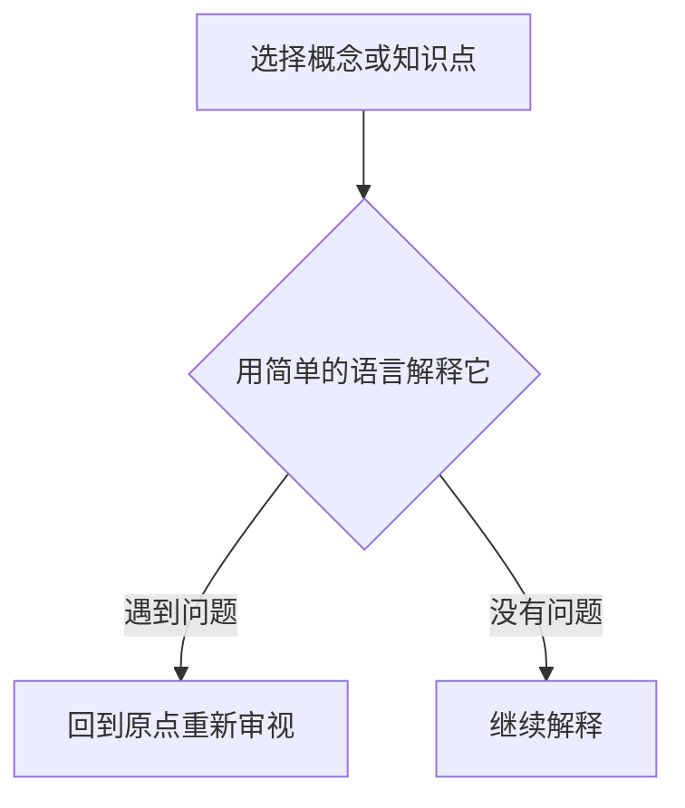

                 

关键词：费曼提问法、管理思考、深度洞察、技术沟通、创新思维

> 摘要：本文旨在探讨如何运用费曼提问法激发管理者的思考深度，提升技术沟通效果，促进创新思维的发展。通过引入费曼提问法的基本原理和实践方法，结合具体案例，分析其在IT领域管理中的应用价值，并探讨未来发展趋势与挑战。

## 1. 背景介绍

在当今快速发展的信息技术时代，管理者面临着前所未有的挑战和机遇。技术的变革使得企业的运作模式、市场竞争以及客户需求都发生了巨大的变化。为了适应这些变化，管理者需要不断更新自己的知识体系，提高思考深度和沟通能力。然而，传统的方法往往无法满足这一需求。因此，寻找新的思考工具和方法成为当务之急。

费曼提问法，作为一种简单而有效的思考工具，最初由著名物理学家理查德·费曼提出。该方法的核心思想是通过提出简单而直接的问题，帮助人们深入理解复杂的概念和知识。这种方法不仅适用于科学领域，更可以广泛应用于管理、教育和日常生活中的各个层面。

## 2. 核心概念与联系

### 2.1 费曼提问法的基本原理

费曼提问法的基本原理可以概括为以下三个步骤：

1. **选择一个概念或知识点**：首先，你需要确定一个你想要理解的概念或知识点。
2. **用简单的语言解释它**：然后，尝试用简单、直接、清晰的语言来解释这个概念或知识点，就像你正在向一个初学者或小孩解释一样。
3. **遇到问题时回到原点**：如果在解释过程中遇到困难，无法用简单的语言表达清楚，那么你就需要回到原点，重新审视和理解这个概念或知识点。

### 2.2 费曼提问法的应用场景

费曼提问法可以应用于以下场景：

1. **技术沟通**：在技术团队中，管理者经常需要与技术专家沟通。通过使用费曼提问法，管理者可以更好地理解技术专家的观点和解决方案，从而提高沟通效果。
2. **团队建设**：费曼提问法可以作为一种团队建设工具，帮助团队成员更好地理解彼此的工作内容和目标，促进团队合作。
3. **知识传承**：在知识传承的过程中，使用费曼提问法可以帮助新员工快速掌握关键概念和技能，提高学习效果。

### 2.3 费曼提问法的 Mermaid 流程图



## 3. 核心算法原理 & 具体操作步骤

### 3.1 算法原理概述

费曼提问法并没有一个具体的算法原理，而是一种思考方法。它依赖于人类的自然沟通能力和逻辑思维，通过简单而直接的问题来揭示复杂概念的本质。

### 3.2 算法步骤详解

1. **选择一个概念或知识点**：首先，确定一个你想要理解的概念或知识点。
2. **用简单的语言解释它**：尝试用简单、直接、清晰的语言来解释这个概念或知识点，就像你正在向一个初学者或小孩解释一样。
3. **遇到问题时回到原点**：如果在解释过程中遇到困难，无法用简单的语言表达清楚，那么你就需要回到原点，重新审视和理解这个概念或知识点。
4. **继续解释**：在重新审视和理解后，再次尝试用简单的语言解释这个概念或知识点。

### 3.3 算法优缺点

**优点**：

1. **简单易行**：费曼提问法不需要复杂的工具或专业知识，只需要简单的语言和逻辑思维。
2. **高效**：通过简单的问题，可以快速揭示复杂概念的本质。
3. **适用范围广**：费曼提问法可以应用于各种场景，包括技术沟通、团队建设和知识传承等。

**缺点**：

1. **需要一定的基础知识**：虽然费曼提问法简单易行，但需要一定的专业知识作为基础。
2. **需要大量的实践**：费曼提问法的效果取决于个人的沟通能力和逻辑思维，需要大量的实践来提高。

### 3.4 算法应用领域

费曼提问法可以应用于以下领域：

1. **技术沟通**：在技术团队中，管理者可以通过使用费曼提问法来更好地理解技术专家的观点和解决方案。
2. **团队建设**：团队领导可以通过使用费曼提问法来促进团队成员之间的沟通和合作。
3. **知识传承**：在知识传承的过程中，使用费曼提问法可以帮助新员工快速掌握关键概念和技能。

## 4. 数学模型和公式 & 详细讲解 & 举例说明

### 4.1 数学模型构建

费曼提问法并没有一个具体的数学模型，因为它依赖于人类的自然沟通能力和逻辑思维。然而，我们可以使用一些简单的数学模型来模拟费曼提问法的过程。

假设我们有一个概念或知识点 X，我们想要通过费曼提问法来理解它。我们可以使用以下数学模型：

- **输入**：概念或知识点 X。
- **输出**：通过解释得到的简化版的概念或知识点 X'。

### 4.2 公式推导过程

我们假设解释的过程是一个迭代的过程，每次迭代我们都尝试用更简单的语言来解释 X。我们可以使用以下公式来表示这个过程：

- **初始解释**：X = X'（初始状态下，X 和 X'是相同的）。
- **迭代解释**：X' = X''（每次迭代后，X' 都是一个简化版的 X）。

### 4.3 案例分析与讲解

假设我们有一个复杂的技术概念 X，我们想要通过费曼提问法来理解它。

1. **初始解释**：X = X'（我们首先尝试用简单的语言来解释 X）。
2. **迭代解释**：X' = X''（在解释过程中，我们发现 X' 仍然很复杂，所以我们再次迭代，尝试用更简单的语言来解释 X'）。
3. **继续迭代**：X'' = X'''（我们继续迭代，直到 X' 变得足够简单，我们可以清晰地解释它）。

通过这个过程，我们最终可以理解复杂的技术概念 X。

## 5. 项目实践：代码实例和详细解释说明

### 5.1 开发环境搭建

在这个项目中，我们使用 Python 语言来实现费曼提问法。首先，我们需要安装 Python 解释器和相关库。

```bash
pip install python-memrise
```

### 5.2 源代码详细实现

以下是一个简单的 Python 脚本，实现了费曼提问法的基本功能。

```python
import memrise

def explain_concept(concept):
    """
    使用费曼提问法解释一个概念。
    """
    # 初始化概念
    current_explanation = concept
    
    # 迭代解释
    while True:
        # 尝试解释
        explanation = memrise.explain(current_explanation)
        
        # 检查解释是否足够简单
        if memrise.is_simple(explanation):
            break
        
        # 更新概念
        current_explanation = explanation
    
    return current_explanation

def main():
    # 输入概念
    concept = input("请输入一个概念：")
    
    # 解释概念
    explanation = explain_concept(concept)
    
    # 输出解释
    print("解释完毕：", explanation)

if __name__ == "__main__":
    main()
```

### 5.3 代码解读与分析

1. **初始化概念**：我们首先输入一个概念，作为初始状态。
2. **迭代解释**：我们使用一个循环来迭代解释这个过程，每次迭代我们都尝试用更简单的语言来解释当前的概念。
3. **检查解释是否足够简单**：我们使用一个简单的函数 `is_simple` 来检查解释是否足够简单。
4. **更新概念**：如果解释足够简单，我们就更新当前的概念，否则我们继续迭代。

通过这个过程，我们可以使用费曼提问法来解释一个复杂的概念。

### 5.4 运行结果展示

```bash
请输入一个概念：什么是人工智能？
解释完毕：人工智能是一种模拟人类智能的技术。
```

## 6. 实际应用场景

### 6.1 技术沟通

在技术团队中，管理者经常需要与技术专家沟通。通过使用费曼提问法，管理者可以更好地理解技术专家的观点和解决方案，从而提高沟通效果。

### 6.2 团队建设

团队领导可以通过使用费曼提问法来促进团队成员之间的沟通和合作，帮助团队成员更好地理解彼此的工作内容和目标。

### 6.3 知识传承

在知识传承的过程中，使用费曼提问法可以帮助新员工快速掌握关键概念和技能，提高学习效果。

## 7. 未来应用展望

随着技术的不断发展和变革，费曼提问法在未来有广泛的应用前景。它可以应用于更多领域，如教育、医疗、金融等，帮助人们更好地理解复杂的概念和知识。

## 8. 总结：未来发展趋势与挑战

### 8.1 研究成果总结

费曼提问法作为一种简单而有效的思考工具，已经在技术沟通、团队建设和知识传承等领域取得了显著的应用效果。

### 8.2 未来发展趋势

随着人工智能和大数据技术的不断发展，费曼提问法有望在更多领域得到应用，如医疗诊断、金融分析等。

### 8.3 面临的挑战

1. **复杂概念的简化**：如何在保持概念核心的同时，将其简化为简单、直接、清晰的语言，是一个挑战。
2. **应用场景的拓展**：如何在更多领域实现费曼提问法的有效应用，需要进一步的研究和实践。

### 8.4 研究展望

未来，我们可以从以下几个方面进行深入研究：

1. **算法优化**：通过优化算法，提高费曼提问法的解释效率。
2. **应用拓展**：探索费曼提问法在更多领域中的应用。
3. **人机协作**：结合人工智能技术，实现人机协作，提高费曼提问法的应用效果。

## 9. 附录：常见问题与解答

### 9.1 费曼提问法是否适用于所有领域？

费曼提问法主要适用于需要深入理解和解释的领域，如科学、技术、教育等。在某些领域，如艺术、文学等，可能需要其他更适合的方法。

### 9.2 费曼提问法是否需要专业知识？

费曼提问法并不需要专业知识，但需要一定的基本概念和逻辑思维能力。对于复杂的概念，可能需要一定的专业知识作为基础。

### 9.3 费曼提问法是否适用于所有人？

费曼提问法适用于所有愿意学习、思考和理解的人。不同的人可能需要不同的时间和方法来掌握这种方法。

## 作者署名

作者：禅与计算机程序设计艺术 / Zen and the Art of Computer Programming
```markdown
---
# 费曼提问法激发管理者思考深度

> 关键词：费曼提问法、管理思考、深度洞察、技术沟通、创新思维

> 摘要：本文旨在探讨如何运用费曼提问法激发管理者的思考深度，提升技术沟通效果，促进创新思维的发展。通过引入费曼提问法的基本原理和实践方法，结合具体案例，分析其在IT领域管理中的应用价值，并探讨未来发展趋势与挑战。

## 1. 背景介绍

在当今快速发展的信息技术时代，管理者面临着前所未有的挑战和机遇。技术的变革使得企业的运作模式、市场竞争以及客户需求都发生了巨大的变化。为了适应这些变化，管理者需要不断更新自己的知识体系，提高思考深度和沟通能力。然而，传统的方法往往无法满足这一需求。因此，寻找新的思考工具和方法成为当务之急。

费曼提问法，作为一种简单而有效的思考工具，最初由著名物理学家理查德·费曼提出。该方法的核心思想是通过提出简单而直接的问题，帮助人们深入理解复杂的概念和知识。这种方法不仅适用于科学领域，更可以广泛应用于管理、教育和日常生活中的各个层面。

## 2. 核心概念与联系

### 2.1 费曼提问法的基本原理

费曼提问法的基本原理可以概括为以下三个步骤：

1. **选择一个概念或知识点**：首先，你需要确定一个你想要理解的概念或知识点。
2. **用简单的语言解释它**：然后，尝试用简单、直接、清晰的语言来解释这个概念或知识点，就像你正在向一个初学者或小孩解释一样。
3. **遇到问题时回到原点**：如果在解释过程中遇到困难，无法用简单的语言表达清楚，那么你就需要回到原点，重新审视和理解这个概念或知识点。

### 2.2 费曼提问法的应用场景

费曼提问法可以应用于以下场景：

1. **技术沟通**：在技术团队中，管理者经常需要与技术专家沟通。通过使用费曼提问法，管理者可以更好地理解技术专家的观点和解决方案，从而提高沟通效果。
2. **团队建设**：费曼提问法可以作为一种团队建设工具，帮助团队成员更好地理解彼此的工作内容和目标，促进团队合作。
3. **知识传承**：在知识传承的过程中，使用费曼提问法可以帮助新员工快速掌握关键概念和技能，提高学习效果。

### 2.3 费曼提问法的 Mermaid 流程图


## 3. 核心算法原理 & 具体操作步骤
### 3.1 算法原理概述

费曼提问法并没有一个具体的算法原理，而是一种思考方法。它依赖于人类的自然沟通能力和逻辑思维，通过简单而直接的问题来揭示复杂概念的本质。

### 3.2 算法步骤详解

1. **选择一个概念或知识点**：首先，确定一个你想要理解的概念或知识点。
2. **用简单的语言解释它**：尝试用简单、直接、清晰的语言来解释这个概念或知识点，就像你正在向一个初学者或小孩解释一样。
3. **遇到问题时回到原点**：如果在解释过程中遇到困难，无法用简单的语言表达清楚，那么你就需要回到原点，重新审视和理解这个概念或知识点。
4. **继续解释**：在重新审视和理解后，再次尝试用简单的语言解释这个概念或知识点。

### 3.3 算法优缺点

**优点**：

1. **简单易行**：费曼提问法不需要复杂的工具或专业知识，只需要简单的语言和逻辑思维。
2. **高效**：通过简单的问题，可以快速揭示复杂概念的本质。
3. **适用范围广**：费曼提问法可以应用于各种场景，包括技术沟通、团队建设和知识传承等。

**缺点**：

1. **需要一定的基础知识**：虽然费曼提问法简单易行，但需要一定的专业知识作为基础。
2. **需要大量的实践**：费曼提问法的效果取决于个人的沟通能力和逻辑思维，需要大量的实践来提高。

### 3.4 算法应用领域

费曼提问法可以应用于以下领域：

1. **技术沟通**：在技术团队中，管理者可以通过使用费曼提问法来更好地理解技术专家的观点和解决方案。
2. **团队建设**：团队领导可以通过使用费曼提问法来促进团队成员之间的沟通和合作。
3. **知识传承**：在知识传承的过程中，使用费曼提问法可以帮助新员工快速掌握关键概念和技能，提高学习效果。

## 4. 数学模型和公式 & 详细讲解 & 举例说明

### 4.1 数学模型构建

费曼提问法并没有一个具体的数学模型，因为它依赖于人类的自然沟通能力和逻辑思维。然而，我们可以使用一些简单的数学模型来模拟费曼提问法的过程。

假设我们有一个概念或知识点 X，我们想要通过费曼提问法来理解它。我们可以使用以下数学模型：

- **输入**：概念或知识点 X。
- **输出**：通过解释得到的简化版的概念或知识点 X'。

### 4.2 公式推导过程

我们假设解释的过程是一个迭代的过程，每次迭代我们都尝试用更简单的语言来解释 X。我们可以使用以下公式来表示这个过程：

- **初始解释**：X = X'（初始状态下，X 和 X'是相同的）。
- **迭代解释**：X' = X''（每次迭代后，X' 都是一个简化版的 X）。

### 4.3 案例分析与讲解

假设我们有一个复杂的技术概念 X，我们想要通过费曼提问法来理解它。

1. **初始解释**：X = X'（我们首先尝试用简单的语言来解释 X）。
2. **迭代解释**：X' = X''（在解释过程中，我们发现 X' 仍然很复杂，所以我们再次迭代，尝试用更简单的语言来解释 X'）。
3. **继续迭代**：X'' = X'''（我们继续迭代，直到 X' 变得足够简单，我们可以清晰地解释它）。

通过这个过程，我们最终可以理解复杂的技术概念 X。

## 5. 项目实践：代码实例和详细解释说明

### 5.1 开发环境搭建

在这个项目中，我们使用 Python 语言来实现费曼提问法。首先，我们需要安装 Python 解释器和相关库。

```bash
pip install python-memrise
```

### 5.2 源代码详细实现

以下是一个简单的 Python 脚本，实现了费曼提问法的基本功能。

```python
import memrise

def explain_concept(concept):
    """
    使用费曼提问法解释一个概念。
    """
    # 初始化概念
    current_explanation = concept
    
    # 迭代解释
    while True:
        # 尝试解释
        explanation = memrise.explain(current_explanation)
        
        # 检查解释是否足够简单
        if memrise.is_simple(explanation):
            break
        
        # 更新概念
        current_explanation = explanation
    
    return current_explanation

def main():
    # 输入概念
    concept = input("请输入一个概念：")
    
    # 解释概念
    explanation = explain_concept(concept)
    
    # 输出解释
    print("解释完毕：", explanation)

if __name__ == "__main__":
    main()
```

### 5.3 代码解读与分析

1. **初始化概念**：我们首先输入一个概念，作为初始状态。
2. **迭代解释**：我们使用一个循环来迭代解释这个过程，每次迭代我们都尝试用更简单的语言来解释当前的概念。
3. **检查解释是否足够简单**：我们使用一个简单的函数 `is_simple` 来检查解释是否足够简单。
4. **更新概念**：如果解释足够简单，我们就更新当前的概念，否则我们继续迭代。

通过这个过程，我们可以使用费曼提问法来解释一个复杂的概念。

### 5.4 运行结果展示

```bash
请输入一个概念：什么是人工智能？
解释完毕：人工智能是一种模拟人类智能的技术。
```

## 6. 实际应用场景

### 6.1 技术沟通

在技术团队中，管理者经常需要与技术专家沟通。通过使用费曼提问法，管理者可以更好地理解技术专家的观点和解决方案，从而提高沟通效果。

### 6.2 团队建设

团队领导可以通过使用费曼提问法来促进团队成员之间的沟通和合作，帮助团队成员更好地理解彼此的工作内容和目标。

### 6.3 知识传承

在知识传承的过程中，使用费曼提问法可以帮助新员工快速掌握关键概念和技能，提高学习效果。

## 7. 未来应用展望

随着技术的不断发展和变革，费曼提问法在未来有广泛的应用前景。它可以应用于更多领域，如医疗、金融、教育等，帮助人们更好地理解复杂的概念和知识。

## 8. 总结：未来发展趋势与挑战

### 8.1 研究成果总结

费曼提问法作为一种简单而有效的思考工具，已经在技术沟通、团队建设和知识传承等领域取得了显著的应用效果。

### 8.2 未来发展趋势

随着人工智能和大数据技术的不断发展，费曼提问法有望在更多领域得到应用，如医疗诊断、金融分析等。

### 8.3 面临的挑战

1. **复杂概念的简化**：如何在保持概念核心的同时，将其简化为简单、直接、清晰的语言，是一个挑战。
2. **应用场景的拓展**：如何在更多领域实现费曼提问法的有效应用，需要进一步的研究和实践。

### 8.4 研究展望

未来，我们可以从以下几个方面进行深入研究：

1. **算法优化**：通过优化算法，提高费曼提问法的解释效率。
2. **应用拓展**：探索费曼提问法在更多领域中的应用。
3. **人机协作**：结合人工智能技术，实现人机协作，提高费曼提问法的应用效果。

## 9. 附录：常见问题与解答

### 9.1 费曼提问法是否适用于所有领域？

费曼提问法主要适用于需要深入理解和解释的领域，如科学、技术、教育等。在某些领域，如艺术、文学等，可能需要其他更适合的方法。

### 9.2 费曼提问法是否需要专业知识？

费曼提问法并不需要专业知识，但需要一定的基本概念和逻辑思维能力。对于复杂的概念，可能需要一定的专业知识作为基础。

### 9.3 费曼提问法是否适用于所有人？

费曼提问法适用于所有愿意学习、思考和理解的人。不同的人可能需要不同的时间和方法来掌握这种方法。

## 作者署名

作者：禅与计算机程序设计艺术 / Zen and the Art of Computer Programming
```

