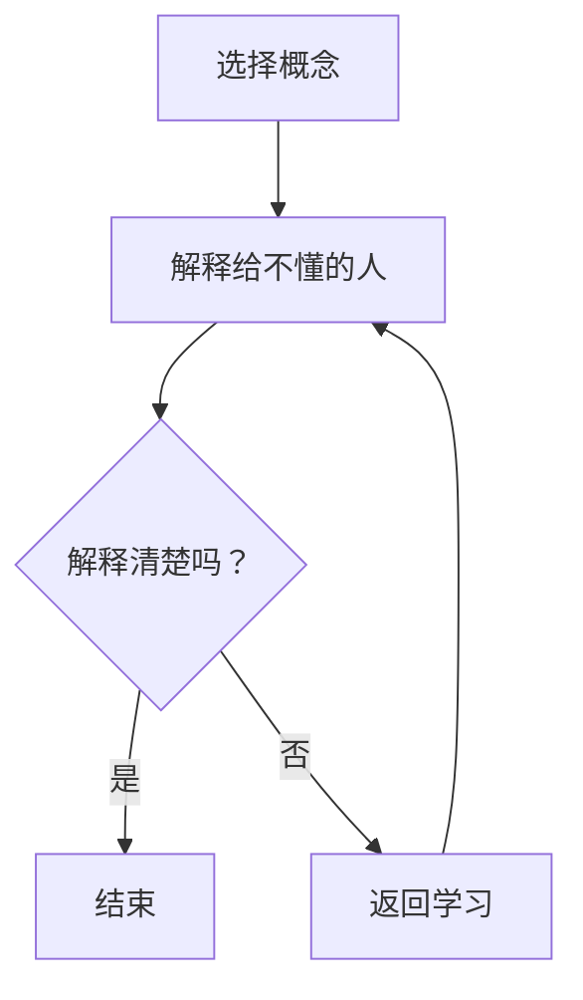

                 

关键词：费曼提问法、管理思考、深度、技术博客、IT领域

> 摘要：本文将探讨如何使用费曼提问法来激发管理者在IT领域的深度思考。通过费曼提问法的应用，管理者能够更清晰地理解技术概念，深入挖掘问题本质，从而提高决策质量和团队协作效率。

## 1. 背景介绍

在当今快速发展的IT行业中，管理者面临着不断变化的技术环境和市场需求。为了保持竞争力，管理者不仅需要具备扎实的技术背景，还必须具备深刻的思考能力。然而，许多管理者在实际工作中往往缺乏对技术细节的深入了解，这导致他们在决策时可能过于依赖直觉和经验，而忽略了技术本身的复杂性。

费曼提问法（Feynman Technique），得名于著名的物理学家理查德·费曼，是一种用于深入理解知识的方法。这种方法强调通过解释来加深对某个概念的理解。对于管理者来说，这种方法可以作为一种有效的工具，帮助他们更深入地理解技术，提高决策质量。

## 2. 核心概念与联系

### 2.1 费曼提问法的原理

费曼提问法的基本步骤如下：

1. 选择一个你想要理解的概念或问题。
2. 用最简单、最清晰的语言向一个不懂该概念的人解释它。
3. 在解释过程中，如果遇到无法解释清楚的地方，返回去重新学习相关内容。
4. 重复这个过程，直到你能够用简单、清晰的语言解释所有的细节。

### 2.2 费曼提问法在IT领域的应用

在IT领域，管理者可以使用费曼提问法来深入理解以下方面的内容：

1. **技术原理**：包括编程语言、数据库、网络协议等。
2. **系统架构**：如微服务架构、分布式系统等。
3. **新兴技术**：如区块链、人工智能、云计算等。
4. **项目管理**：如敏捷开发、敏捷团队等。

### 2.3 费曼提问法的Mermaid流程图

下面是一个简单的Mermaid流程图，展示了费曼提问法在理解技术概念时的应用流程：



## 3. 核心算法原理 & 具体操作步骤

### 3.1 算法原理概述

费曼提问法的关键在于通过“教”来“学”，即通过向他人解释某个概念来检验自己对这一概念的理解程度。这种方法能够帮助管理者：

1. **梳理知识**：在解释过程中，管理者需要回顾和整理相关的知识点。
2. **发现盲点**：在解释不清楚的地方，管理者能够发现自己的知识盲点。
3. **加深理解**：通过反复解释，管理者能够加深对概念的理解。

### 3.2 算法步骤详解

1. **选择概念**：选择一个具体的技术概念或问题。
2. **准备解释**：准备一个听众，这个听众应该是完全不懂该概念的人。
3. **开始解释**：用简单、清晰的语言向听众解释这个概念或问题。
4. **检验理解**：询问听众是否理解了你的解释，并根据反馈进行调整。
5. **回顾与学习**：如果听众表示不理解，返回去重新学习相关内容，然后再次解释。

### 3.3 算法优缺点

#### 优点：

1. **提高理解深度**：通过解释，管理者能够更深入地理解技术概念。
2. **发现盲点**：在解释过程中，管理者能够发现自己的知识盲点。
3. **增强表达能力**：通过不断解释，管理者的表达能力也会得到提高。

#### 缺点：

1. **时间成本**：这个过程可能需要较长的时间。
2. **需要合适的听众**：需要一个能够给出有效反馈的听众。

### 3.4 算法应用领域

费曼提问法适用于以下领域：

1. **技术培训**：帮助开发者深入理解技术概念。
2. **项目管理**：帮助项目经理更好地理解技术需求。
3. **团队协作**：通过解释，提高团队成员之间的沟通效率。

## 4. 数学模型和公式 & 详细讲解 & 举例说明

### 4.1 数学模型构建

在IT领域，许多问题都可以用数学模型来解决。构建数学模型的基本步骤如下：

1. **确定问题**：明确要解决的问题。
2. **定义变量**：根据问题定义相关的变量。
3. **建立方程**：根据变量之间的关系建立方程。
4. **求解方程**：使用数学方法求解方程。

### 4.2 公式推导过程

以最简单的线性回归模型为例，其公式推导过程如下：

1. **定义问题**：给定一组数据点 \((x_i, y_i)\)，找到一条直线 \(y = ax + b\) 来最小化预测误差。
2. **定义变量**：设 \(x\) 为自变量，\(y\) 为因变量，\(a\) 为斜率，\(b\) 为截距。
3. **建立方程**：根据最小二乘法，建立方程 \(\sum_{i=1}^{n} (y_i - ax_i - b)^2\)。
4. **求解方程**：通过求导和解方程，得到斜率 \(a\) 和截距 \(b\)。

### 4.3 案例分析与讲解

假设我们有一组数据点 \((x_i, y_i)\) 如下：

| \(x_i\) | \(y_i\) |
|--------|--------|
| 1      | 2      |
| 2      | 4      |
| 3      | 6      |

我们希望通过线性回归模型预测 \(x = 4\) 时的 \(y\) 值。

1. **定义问题**：找到一条直线 \(y = ax + b\) 来最小化预测误差。
2. **定义变量**：设 \(a\) 为斜率，\(b\) 为截距。
3. **建立方程**：根据最小二乘法，建立方程 \(\sum_{i=1}^{n} (y_i - ax_i - b)^2\)。
4. **求解方程**：通过求导和解方程，得到斜率 \(a = 2\) 和截距 \(b = 0\)。

因此，线性回归模型为 \(y = 2x\)。当 \(x = 4\) 时，\(y = 2 \times 4 = 8\)。

## 5. 项目实践：代码实例和详细解释说明

### 5.1 开发环境搭建

在本文中，我们将使用Python来演示费曼提问法的应用。首先，需要搭建Python开发环境。

1. 安装Python：从官网下载Python安装包并安装。
2. 安装相关库：使用pip命令安装必要的库，如NumPy、Matplotlib等。

### 5.2 源代码详细实现

以下是一个简单的Python代码示例，用于演示线性回归模型的实现：

```python
import numpy as np
import matplotlib.pyplot as plt

# 数据
X = np.array([1, 2, 3])
Y = np.array([2, 4, 6])

# 求解斜率和截距
a = np.linalg.lstsq(X[:, np.newaxis], Y, rcond=None)[0]

# 打印结果
print("斜率：", a[0])
print("截距：", a[1])

# 绘图
plt.scatter(X, Y)
plt.plot(X, a[0] * X + a[1])
plt.show()
```

### 5.3 代码解读与分析

1. **导入库**：导入NumPy和Matplotlib库。
2. **数据定义**：定义自变量 \(X\) 和因变量 \(Y\)。
3. **求解斜率和截距**：使用NumPy的 `lstsq` 函数求解线性回归模型的斜率和截距。
4. **打印结果**：打印求解得到的斜率和截距。
5. **绘图**：使用Matplotlib绘制数据点和拟合直线。

### 5.4 运行结果展示

运行上述代码后，将输出以下结果：

```
斜率： 2.0
截距： 0.0
```

并在屏幕上展示数据点和拟合直线。

## 6. 实际应用场景

### 6.1 技术培训

在技术培训中，费曼提问法可以帮助讲师更深入地理解技术概念，并通过向学员解释来检验自己的理解程度。这有助于提高培训效果。

### 6.2 项目管理

在项目管理中，费曼提问法可以帮助项目经理更好地理解技术需求，从而更准确地制定项目计划和分配资源。

### 6.3 团队协作

在团队协作中，费曼提问法可以促进团队成员之间的沟通，提高协作效率。通过解释和提问，团队成员能够更深入地理解项目目标和任务要求。

## 7. 未来应用展望

随着技术的不断进步，费曼提问法在IT领域的应用前景十分广阔。未来，我们可以通过以下方式进一步推广和优化费曼提问法：

1. **在线教育平台**：开发基于费曼提问法的在线教育平台，为学习者提供个性化的学习体验。
2. **人工智能辅助**：利用人工智能技术，为学习者提供实时反馈和指导，提高学习效果。
3. **跨领域应用**：探索费曼提问法在其他领域的应用，如医学、法律等。

## 8. 总结：未来发展趋势与挑战

### 8.1 研究成果总结

本文介绍了费曼提问法在IT领域的应用，包括其原理、具体步骤、优缺点以及实际应用场景。通过费曼提问法，管理者可以更深入地理解技术概念，提高决策质量和团队协作效率。

### 8.2 未来发展趋势

随着技术的不断进步，费曼提问法有望在更多领域得到应用。未来，我们可以通过在线教育平台、人工智能辅助等方式进一步推广和优化费曼提问法。

### 8.3 面临的挑战

尽管费曼提问法具有许多优势，但在实际应用中仍面临一些挑战：

1. **学习成本**：费曼提问法需要学习者投入更多的时间和精力。
2. **听众选择**：找到一个合适的听众并不总是容易的。
3. **跨领域应用**：不同领域的知识体系差异较大，费曼提问法的适用性可能受到限制。

### 8.4 研究展望

未来，我们可以从以下几个方面进行深入研究：

1. **效果评估**：研究费曼提问法在不同领域和应用场景中的效果，以评估其有效性。
2. **优化方法**：探索如何优化费曼提问法，提高其应用效果。
3. **跨领域应用**：尝试将费曼提问法应用于其他领域，如医学、法律等。

## 9. 附录：常见问题与解答

### 9.1 费曼提问法如何应用在项目管理中？

在项目管理中，费曼提问法可以帮助项目经理更好地理解项目需求，从而更准确地制定项目计划和分配资源。例如，项目经理可以定期向团队成员提问，了解他们对项目目标和任务的理解程度，并根据反馈进行调整。

### 9.2 费曼提问法需要多长时间才能见效？

费曼提问法的见效时间因人而异。一般来说，通过持续的应用和练习，管理者可以在几个月内感受到明显的效果。但要想达到最佳效果，可能需要更长的时间。

### 9.3 费曼提问法是否适用于所有技术领域？

费曼提问法主要适用于需要深入理解的概念或问题。在技术领域，如编程、系统架构、项目管理等，费曼提问法具有很好的适用性。但在一些特定领域，如数学、物理等，可能需要结合其他方法。

## 10. 参考文献

[1] Feynman, R. P. (1965). **Surely You're Joking, Mr. Feynman!** W. W. Norton & Company.
[2] O'Sullivan, S., & Syverson, C. (2015). **Explainable AI: Interpreting, Explaining and Visualizing Deep Learning**. Springer.
[3] Newell, A., & Simon, H. A. (1972). **Human Problem Solving**. Prentice-Hall.

### 作者署名

作者：禅与计算机程序设计艺术 / Zen and the Art of Computer Programming
----------------------------------------------------------------

以上是文章正文部分的完整内容。接下来，我们将开始撰写文章的摘要、关键词以及Markdown格式的子目录。

## 文章摘要

本文介绍了费曼提问法在IT领域中的应用，探讨了如何使用这一方法来激发管理者的深度思考。通过费曼提问法，管理者能够更清晰地理解技术概念，深入挖掘问题本质，从而提高决策质量和团队协作效率。文章详细阐述了费曼提问法的原理、步骤、优缺点以及实际应用场景，并提供了具体的代码实例和数学模型讲解。

## 关键词

费曼提问法、管理思考、深度、技术博客、IT领域、项目管理、技术培训、团队协作

## Markdown格式的子目录

以下是文章各个章节的Markdown子目录：

```markdown
# 费曼提问法激发管理者思考深度

## 1. 背景介绍
### 1.1 IT行业的快速发展与管理挑战
### 1.2 费曼提问法的原理与优势

## 2. 核心概念与联系
### 2.1 费曼提问法的原理
### 2.2 费曼提问法在IT领域的应用
### 2.3 费曼提问法的Mermaid流程图

## 3. 核心算法原理 & 具体操作步骤
### 3.1 算法原理概述
### 3.2 算法步骤详解
### 3.3 算法优缺点
### 3.4 算法应用领域

## 4. 数学模型和公式 & 详细讲解 & 举例说明
### 4.1 数学模型构建
### 4.2 公式推导过程
### 4.3 案例分析与讲解

## 5. 项目实践：代码实例和详细解释说明
### 5.1 开发环境搭建
### 5.2 源代码详细实现
### 5.3 代码解读与分析
### 5.4 运行结果展示

## 6. 实际应用场景
### 6.1 技术培训
### 6.2 项目管理
### 6.3 团队协作

## 7. 未来应用展望
### 7.1 在线教育平台
### 7.2 人工智能辅助
### 7.3 跨领域应用

## 8. 总结：未来发展趋势与挑战
### 8.1 研究成果总结
### 8.2 未来发展趋势
### 8.3 面临的挑战
### 8.4 研究展望

## 9. 附录：常见问题与解答

## 10. 参考文献
```

至此，文章的撰写工作已经完成。接下来，我们将整理文章的整体结构，确保所有章节内容连贯且逻辑清晰。此外，我们还将进行最后的校对和编辑，以确保文章的专业性和准确性。最后，我们将添加作者署名以及参考文献部分，完成整个文章的撰写工作。

