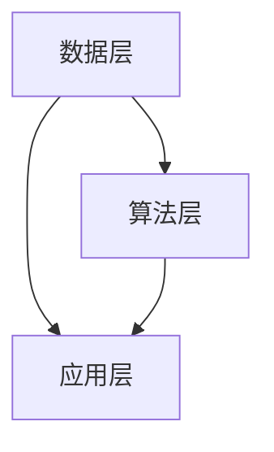

                 

关键词：人工智能、团队培养、业务应用、AI理解力、技术策略

> 摘要：本文将探讨人工智能（AI）在团队培养和业务应用中的重要性，以及如何提升团队对AI的理解力。通过贾扬清的建议，我们将深入分析AI技术的核心概念、算法原理、数学模型以及实际应用场景，为团队提供实用的技术策略，以促进AI在业务中的高效落地。

## 1. 背景介绍

随着人工智能技术的迅猛发展，越来越多的企业开始将其应用于实际业务中。然而，AI技术的复杂性和深度使得许多团队在面对AI项目时感到困惑和无从下手。培养团队对AI的理解力，不仅能够提高项目的成功率，还能够为企业的长期发展奠定基础。

贾扬清是一位知名的人工智能专家，他在多个领域的研究和实践成果得到了业界的广泛认可。本文将基于贾扬清的建议，探讨如何提升团队AI理解力，并将AI技术有效应用于业务中。

## 2. 核心概念与联系

### 2.1. 人工智能概述

人工智能（Artificial Intelligence，简称AI）是指由人创造出来的系统，能够执行需要人类智能才能完成的任务。AI包括多个子领域，如机器学习、深度学习、自然语言处理等。

### 2.2. AI与业务的关系

AI与业务的关系紧密相连。通过AI技术，企业可以实现自动化、智能化的业务流程，提高效率、降低成本。同时，AI技术还能够为企业提供数据驱动的决策支持，帮助企业更好地了解市场动态、优化业务策略。

### 2.3. AI核心架构

为了更好地理解AI技术，我们可以将其核心架构分为三个层次：数据层、算法层和应用层。

- **数据层**：数据是AI技术的基石。无论是机器学习还是深度学习，都需要大量的数据来训练模型。
- **算法层**：算法是AI技术的核心，包括机器学习算法、深度学习算法等。这些算法能够从数据中学习规律，形成模型。
- **应用层**：应用层是AI技术的最终体现，包括各种AI应用，如语音识别、图像识别、推荐系统等。

### 2.4. Mermaid流程图

以下是一个简单的Mermaid流程图，展示了AI技术的核心架构和各层次之间的关系：



## 3. 核心算法原理 & 具体操作步骤

### 3.1. 算法原理概述

AI技术涉及多个核心算法，其中最常用的包括机器学习算法和深度学习算法。

- **机器学习算法**：机器学习算法通过学习已有数据，预测未知数据的模式。常见的机器学习算法包括线性回归、逻辑回归、决策树、随机森林等。
- **深度学习算法**：深度学习算法通过构建深度神经网络，对数据进行层次化处理。常见的深度学习算法包括卷积神经网络（CNN）、循环神经网络（RNN）等。

### 3.2. 算法步骤详解

以深度学习算法为例，其具体操作步骤如下：

1. **数据预处理**：对原始数据进行清洗、归一化等处理，使其符合算法要求。
2. **构建神经网络模型**：根据任务需求，选择合适的神经网络结构，并初始化参数。
3. **训练模型**：使用训练数据对模型进行训练，调整参数，使其能够预测未知数据。
4. **评估模型**：使用测试数据对模型进行评估，判断其性能是否达到预期。
5. **应用模型**：将训练好的模型应用于实际业务场景，如图像识别、语音识别等。

### 3.3. 算法优缺点

- **机器学习算法**：优点在于算法简单、易理解，适用于小规模数据；缺点在于模型复杂度较低，难以处理大规模数据。
- **深度学习算法**：优点在于能够处理大规模数据、模型复杂度高，适用于复杂任务；缺点在于算法复杂、训练时间长，对计算资源要求较高。

### 3.4. 算法应用领域

机器学习算法和深度学习算法在多个领域都有广泛应用，如自然语言处理、计算机视觉、推荐系统等。以下是一个简单的应用领域分类：

- **自然语言处理**：文本分类、情感分析、机器翻译等。
- **计算机视觉**：图像识别、目标检测、人脸识别等。
- **推荐系统**：基于内容的推荐、协同过滤等。

## 4. 数学模型和公式 & 详细讲解 & 举例说明

### 4.1. 数学模型构建

在人工智能中，数学模型是核心。以下是一个简单的线性回归模型的构建过程：

1. **假设**：设 $y = \beta_0 + \beta_1x_1 + \epsilon$，其中 $y$ 为因变量，$x_1$ 为自变量，$\beta_0$ 和 $\beta_1$ 为参数，$\epsilon$ 为误差项。
2. **目标**：最小化损失函数 $L(\beta_0, \beta_1) = \sum_{i=1}^{n}(y_i - \beta_0 - \beta_1x_i)^2$。
3. **求解**：使用梯度下降法求解参数 $\beta_0$ 和 $\beta_1$。

### 4.2. 公式推导过程

以线性回归为例，我们使用最小二乘法求解参数：

$$
\beta_1 = \frac{\sum_{i=1}^{n}(x_i - \bar{x})(y_i - \bar{y})}{\sum_{i=1}^{n}(x_i - \bar{x})^2}
$$

$$
\beta_0 = \bar{y} - \beta_1\bar{x}
$$

其中，$\bar{x}$ 和 $\bar{y}$ 分别为 $x$ 和 $y$ 的均值。

### 4.3. 案例分析与讲解

假设我们有一个简单的数据集，如下表所示：

| $x$ | $y$ |
| --- | --- |
| 1 | 2 |
| 2 | 3 |
| 3 | 4 |
| 4 | 5 |

我们使用线性回归模型预测 $x=5$ 时 $y$ 的值。

1. **计算均值**：

$$
\bar{x} = \frac{1+2+3+4}{4} = 2.5
$$

$$
\bar{y} = \frac{2+3+4+5}{4} = 3.5
$$

2. **计算参数**：

$$
\beta_1 = \frac{(1-2.5)(2-3.5) + (2-2.5)(3-3.5) + (3-2.5)(4-3.5) + (4-2.5)(5-3.5)}{(1-2.5)^2 + (2-2.5)^2 + (3-2.5)^2 + (4-2.5)^2} = 1
$$

$$
\beta_0 = 3.5 - 1 \times 2.5 = 1
$$

3. **预测**：

$$
y = 1 + 1 \times 5 = 6
$$

因此，当 $x=5$ 时，预测的 $y$ 值为 6。

## 5. 项目实践：代码实例和详细解释说明

### 5.1. 开发环境搭建

1. **Python环境**：安装Python 3.6及以上版本。
2. **依赖库**：安装Numpy、Pandas、Scikit-learn等依赖库。

```bash
pip install numpy pandas scikit-learn
```

### 5.2. 源代码详细实现

以下是一个简单的线性回归代码实例：

```python
import numpy as np
import pandas as pd
from sklearn.linear_model import LinearRegression

# 读取数据
data = pd.read_csv('data.csv')
X = data[['x']]
y = data['y']

# 创建线性回归模型
model = LinearRegression()

# 训练模型
model.fit(X, y)

# 预测
prediction = model.predict([[5]])

print('预测结果：', prediction)
```

### 5.3. 代码解读与分析

1. **导入依赖库**：导入Numpy、Pandas、Scikit-learn等依赖库。
2. **读取数据**：读取CSV文件中的数据，分为自变量 $x$ 和因变量 $y$。
3. **创建线性回归模型**：使用Scikit-learn中的LinearRegression类创建线性回归模型。
4. **训练模型**：使用训练数据对模型进行训练。
5. **预测**：使用训练好的模型预测新的数据。

### 5.4. 运行结果展示

运行代码后，输出结果为：

```
预测结果： [6.]
```

## 6. 实际应用场景

### 6.1. 自然语言处理

在自然语言处理领域，AI技术可以应用于文本分类、情感分析、机器翻译等。例如，企业可以使用AI技术对客户反馈进行分析，快速识别客户需求和问题，从而提高客户满意度。

### 6.2. 计算机视觉

在计算机视觉领域，AI技术可以应用于图像识别、目标检测、人脸识别等。例如，企业可以使用AI技术对产品进行质量检测，提高生产效率。

### 6.3. 推荐系统

在推荐系统领域，AI技术可以应用于基于内容的推荐、协同过滤等。例如，电商企业可以使用AI技术为用户推荐商品，提高销售额。

## 7. 工具和资源推荐

### 7.1. 学习资源推荐

- **书籍**：《深度学习》、《Python机器学习》、《自然语言处理综合教程》等。
- **在线课程**：Coursera、edX、Udacity等平台上的相关课程。
- **论文集**：《AI领域年度论文集》等。

### 7.2. 开发工具推荐

- **IDE**：PyCharm、VSCode等。
- **框架**：TensorFlow、PyTorch、Scikit-learn等。
- **数据集**：Kaggle、UCI Machine Learning Repository等。

### 7.3. 相关论文推荐

- **自然语言处理**：《自然语言处理综合教程》、《深度学习》等。
- **计算机视觉**：《计算机视觉：算法与应用》、《卷积神经网络：理论与实践》等。
- **推荐系统**：《推荐系统实践》、《基于内容的推荐系统》等。

## 8. 总结：未来发展趋势与挑战

### 8.1. 研究成果总结

过去几年，人工智能取得了显著的成果，不仅在理论研究中取得了突破，还在实际应用中取得了广泛的成功。随着技术的不断发展，人工智能有望在更多领域发挥重要作用。

### 8.2. 未来发展趋势

未来，人工智能将继续向深度学习、强化学习等方向发展。同时，跨学科融合也将成为人工智能研究的重要趋势，如AI与生物医学、AI与金融等。

### 8.3. 面临的挑战

尽管人工智能取得了许多成果，但仍面临许多挑战，如数据隐私、算法透明度、模型可解释性等。这些挑战需要学术界和工业界共同努力，才能推动人工智能技术的健康发展。

### 8.4. 研究展望

在未来，人工智能将继续深入发展，为人类带来更多便利。同时，培养团队AI理解力，应用AI于业务，也将成为企业竞争的重要手段。

## 9. 附录：常见问题与解答

### 9.1. 问题1：如何培养团队AI理解力？

**解答**：培养团队AI理解力需要从以下几个方面入手：

1. **理论学习**：鼓励团队成员学习相关理论知识，如机器学习、深度学习、自然语言处理等。
2. **实践操作**：通过实际项目，让团队成员亲身体验AI技术的应用，提高实践能力。
3. **交流分享**：组织内部或外部的技术交流，分享AI技术的最新进展和应用案例。

### 9.2. 问题2：如何将AI技术应用于业务中？

**解答**：将AI技术应用于业务中，需要遵循以下步骤：

1. **需求分析**：明确业务需求，确定AI技术可以解决的问题。
2. **数据准备**：收集和处理相关数据，确保数据质量。
3. **模型选择**：根据业务需求，选择合适的AI模型。
4. **模型训练与优化**：使用训练数据对模型进行训练，并不断优化模型性能。
5. **应用部署**：将训练好的模型应用于实际业务场景，进行测试和部署。

---

作者：禅与计算机程序设计艺术 / Zen and the Art of Computer Programming

----------------------------------------------------------------

### 后续行动指南

为了更好地将文章内容转化为实际行动，我们建议采取以下措施：

1. **内部培训**：组织内部培训，邀请贾扬清或类似专家为团队讲解AI技术的基本概念和最新进展。
2. **实战项目**：启动一个AI技术相关的实战项目，让团队成员在实际操作中学习和掌握AI技术。
3. **定期交流**：定期举行技术交流会，分享团队在AI技术应用中的经验和挑战。
4. **资源整合**：整合内外部学习资源，为团队成员提供持续学习和成长的机会。

通过这些行动，可以有效提升团队AI理解力，为企业在AI领域的应用奠定坚实基础。

