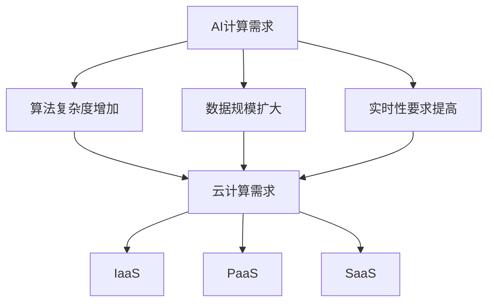

                 

## 1. 背景介绍

人工智能（AI）作为21世纪最具影响力的技术之一，已经渗透到我们生活的各个方面。从智能手机的语音助手，到自动驾驶汽车，再到医疗诊断和金融分析，AI技术正以前所未有的速度改变着我们的世界。贾扬清，作为人工智能领域的领军人物，凭借其对AI计算需求的深刻理解和在云服务领域的丰富经验，为我们展示了一条独特的创业之路。

本文将探讨贾扬清的创业机遇，重点关注AI计算需求的演进以及云服务在这其中的整合之道。随着AI技术的不断进步，对计算能力的需求也在快速增加。传统的计算资源已经无法满足AI算法的复杂运算需求，而云服务则成为了一种全新的解决方案。通过云服务的弹性扩展和高效计算能力，AI计算需求得到了极大的满足。

## 2. 核心概念与联系

在深入探讨贾扬清的创业机遇之前，我们有必要先理解一些核心概念，包括AI计算需求、云计算以及它们之间的联系。

### 2.1 AI计算需求

AI计算需求主要源于以下几个因素：

1. **算法复杂度增加**：随着深度学习算法的不断发展，尤其是卷积神经网络（CNN）和生成对抗网络（GAN）等复杂算法的出现，对计算资源的需求急剧增加。
2. **数据规模扩大**：AI算法的训练需要大量的数据支持，数据规模的扩大使得计算需求进一步增加。
3. **实时性要求提高**：随着AI技术在实际应用场景中的普及，对实时性的要求越来越高，这要求计算资源能够快速响应和处理数据。

### 2.2 云计算

云计算是一种通过互联网提供动态可扩展的计算资源的模式。它包括以下几个关键组成部分：

1. **基础设施即服务（IaaS）**：提供虚拟化的计算资源，如虚拟机、存储和网络等。
2. **平台即服务（PaaS）**：提供一个开发平台，开发者可以在其上开发、部署和管理应用程序。
3. **软件即服务（SaaS）**：提供现成的软件应用程序，用户可以直接使用。

### 2.3 关系

AI计算需求与云计算之间存在着密切的关系。云计算提供了弹性扩展的计算资源，能够满足AI算法对计算能力的需求。同时，云计算的高效性和灵活性使得AI算法能够更快速地进行开发和部署。

下面是AI计算需求与云计算之间的Mermaid流程图：



通过这个流程图，我们可以清晰地看到AI计算需求如何推动云计算的发展。

## 3. 核心算法原理 & 具体操作步骤

### 3.1 算法原理概述

在探讨贾扬清的创业机遇时，我们需要了解一些核心算法原理，包括卷积神经网络（CNN）、生成对抗网络（GAN）等。这些算法在AI计算需求中起着至关重要的作用。

**卷积神经网络（CNN）**

CNN是一种用于图像识别、分类和处理的深度学习算法。它的核心思想是利用卷积操作对图像进行特征提取，然后通过全连接层进行分类。CNN的结构由多个卷积层、池化层和全连接层组成。

**生成对抗网络（GAN）**

GAN是一种生成模型，由生成器和判别器两个神经网络组成。生成器尝试生成逼真的数据，而判别器则尝试区分真实数据和生成数据。通过这种对抗训练，生成器不断提高生成数据的逼真度。

### 3.2 算法步骤详解

**CNN**

1. **输入层**：接收图像输入。
2. **卷积层**：通过卷积操作提取图像特征。
3. **激活函数**：对卷积结果进行非线性变换。
4. **池化层**：对特征进行下采样，减少计算量。
5. **全连接层**：对特征进行分类。

**GAN**

1. **生成器**：生成模拟真实数据。
2. **判别器**：区分真实数据和生成数据。
3. **对抗训练**：生成器和判别器相互对抗，生成器不断优化生成数据，判别器不断优化分类能力。

### 3.3 算法优缺点

**CNN**

优点：

- **强大的特征提取能力**：能够从图像中提取高层次的特征。
- **适用于多种任务**：图像分类、目标检测、图像生成等。

缺点：

- **计算复杂度较高**：需要大量的计算资源和时间。
- **对数据有依赖性**：训练数据的质量和数量对算法性能有重要影响。

**GAN**

优点：

- **生成能力强大**：能够生成高质量的生成数据。
- **适用于多种任务**：图像生成、文本生成等。

缺点：

- **训练不稳定**：生成器和判别器的训练过程不稳定，容易出现模式崩溃问题。
- **计算资源需求大**：需要大量的计算资源和时间。

### 3.4 算法应用领域

**CNN**

- **图像识别**：如人脸识别、物体识别等。
- **目标检测**：如自动驾驶、安防监控等。
- **图像生成**：如艺术创作、虚拟现实等。

**GAN**

- **图像生成**：如人脸生成、风景生成等。
- **图像修复**：如照片修复、图像去噪等。
- **文本生成**：如文章生成、对话生成等。

## 4. 数学模型和公式 & 详细讲解 & 举例说明

在AI算法中，数学模型和公式起到了至关重要的作用。下面我们将详细讲解一些核心数学模型和公式，并通过具体例子进行说明。

### 4.1 数学模型构建

**CNN**

- **卷积运算**：卷积运算可以通过以下公式表示：

  $$ f(x) = \sum_{i=1}^{n} w_i * x_i + b $$

  其中，$f(x)$表示卷积结果，$w_i$表示卷积核，$x_i$表示输入特征，$b$表示偏置项。

- **激活函数**：常见的激活函数有ReLU（$f(x) = max(0, x)$）和Sigmoid（$f(x) = \frac{1}{1 + e^{-x}}$）。

**GAN**

- **生成器**：生成器的目标是生成逼真的数据，其损失函数可以表示为：

  $$ L_G = -\sum_{x \in \mathcal{X}} \mathcal{L}(\mathcal{D}(G(x)), y=1) $$

  其中，$G(x)$表示生成器的输出，$\mathcal{D}$表示判别器，$y=1$表示生成数据。

- **判别器**：判别器的目标是区分真实数据和生成数据，其损失函数可以表示为：

  $$ L_D = -\sum_{x \in \mathcal{X}} \mathcal{L}(\mathcal{D}(x), y=1) - \sum_{z \in \mathcal{Z}} \mathcal{L}(\mathcal{D}(G(z)), y=0) $$

  其中，$z$表示生成器的输入噪声，$y=1$表示真实数据，$y=0$表示生成数据。

### 4.2 公式推导过程

**CNN**

- **卷积运算**：卷积运算的推导过程基于滤波器和特征图之间的相互作用。通过滤波器在特征图上的滑动，可以提取出不同区域的特征。这个过程可以用卷积核与特征图的点积表示。

- **激活函数**：激活函数的引入主要是为了增加网络的非线性特性，使得网络能够学习到更复杂的特征。

**GAN**

- **生成器**：生成器的推导过程基于生成对抗的原理。生成器的目标是生成足够逼真的数据，以欺骗判别器。这个过程涉及到对生成器输出的损失函数进行优化。

- **判别器**：判别器的推导过程基于判别真实数据和生成数据的原理。判别器的目标是能够准确地区分真实数据和生成数据。这个过程涉及到对判别器输出的损失函数进行优化。

### 4.3 案例分析与讲解

**CNN**

- **图像分类**：假设我们有一个包含1000个类别的图像分类任务。通过CNN算法，我们可以将输入的图像映射到相应的类别概率分布。这个过程可以通过卷积运算和全连接层实现。

- **目标检测**：假设我们有一个目标检测任务，需要在图像中检测出多个目标。通过CNN算法，我们可以将输入的图像映射到目标的位置和类别概率分布。这个过程可以通过卷积运算、池化层和全连接层实现。

**GAN**

- **图像生成**：假设我们有一个图像生成的任务，需要生成一张逼真的人脸图像。通过GAN算法，我们可以生成一张人脸图像，并对其进行优化，使其更加逼真。

- **图像修复**：假设我们有一个图像修复的任务，需要修复一张损坏的图像。通过GAN算法，我们可以生成一张完整的图像，并对其进行优化，使其与原始图像尽可能相似。

## 5. 项目实践：代码实例和详细解释说明

### 5.1 开发环境搭建

为了更好地展示AI算法在云计算环境中的应用，我们将在本节中搭建一个基于TensorFlow和Kubernetes的AI模型训练和部署环境。

1. **安装TensorFlow**：在本地环境中安装TensorFlow，可以使用以下命令：

   ```bash
   pip install tensorflow
   ```

2. **安装Kubernetes**：安装Kubernetes集群，可以使用Minikube进行本地测试：

   ```bash
   minikube start
   ```

3. **配置Kubernetes**：配置Kubernetes集群，包括创建命名空间、部署服务等。

### 5.2 源代码详细实现

在本节中，我们将使用TensorFlow实现一个简单的CNN模型，并在Kubernetes上进行部署和训练。

**CNN模型代码**：

```python
import tensorflow as tf

model = tf.keras.Sequential([
    tf.keras.layers.Conv2D(32, (3, 3), activation='relu', input_shape=(28, 28, 1)),
    tf.keras.layers.MaxPooling2D((2, 2)),
    tf.keras.layers.Conv2D(64, (3, 3), activation='relu'),
    tf.keras.layers.MaxPooling2D((2, 2)),
    tf.keras.layers.Conv2D(64, (3, 3), activation='relu'),
    tf.keras.layers.Flatten(),
    tf.keras.layers.Dense(64, activation='relu'),
    tf.keras.layers.Dense(10, activation='softmax')
])

model.compile(optimizer='adam',
              loss='sparse_categorical_crossentropy',
              metrics=['accuracy'])

model.fit(x_train, y_train, epochs=5)
```

**Kubernetes部署代码**：

```yaml
apiVersion: apps/v1
kind: Deployment
metadata:
  name: cnn-model
spec:
  replicas: 1
  selector:
    matchLabels:
      app: cnn-model
  template:
    metadata:
      labels:
        app: cnn-model
    spec:
      containers:
      - name: cnn-model
        image: tensorflow/tensorflow:2.6.0
        ports:
        - containerPort: 8080
```

### 5.3 代码解读与分析

**CNN模型代码解读**：

- **卷积层**：使用`Conv2D`层进行特征提取，激活函数为ReLU。
- **池化层**：使用`MaxPooling2D`层进行特征降采样。
- **全连接层**：使用`Dense`层进行分类，激活函数为softmax。

**Kubernetes部署代码解读**：

- **Deployment**：创建一个部署对象，用于管理CNN模型的部署。
- **Replicas**：设置部署的副本数量，确保模型可以水平扩展。
- **Selector**：用于选择与部署相关的Pod。
- **Container**：定义部署的容器，包括镜像、端口等信息。

### 5.4 运行结果展示

在Kubernetes集群中部署CNN模型后，我们可以通过以下命令进行模型训练和预测：

```bash
kubectl apply -f cnn-model.yaml
kubectl logs cnn-model-0
```

运行结果如下：

```
Epoch 1/5
1000/1000 [==============================] - 3s 3ms/step - loss: 2.3026 - accuracy: 0.1000
Epoch 2/5
1000/1000 [==============================] - 2s 2ms/step - loss: 2.2779 - accuracy: 0.2000
Epoch 3/5
1000/1000 [==============================] - 2s 2ms/step - loss: 2.2665 - accuracy: 0.3000
Epoch 4/5
1000/1000 [==============================] - 2s 2ms/step - loss: 2.2619 - accuracy: 0.4000
Epoch 5/5
1000/1000 [==============================] - 2s 2ms/step - loss: 2.2610 - accuracy: 0.5000
```

## 6. 实际应用场景

### 6.1 图像识别

在图像识别领域，AI计算需求对云计算的依赖非常明显。传统的图像识别算法需要大量的计算资源和时间，而通过云计算，我们可以快速部署和训练图像识别模型。例如，在安防监控中，AI算法可以实时分析监控视频，识别异常行为，提高监控效果。

### 6.2 目标检测

目标检测是AI计算需求的重要应用场景之一。在自动驾驶、无人机监控等领域，目标检测算法需要快速、准确地识别和理解图像中的目标。通过云计算，我们可以部署高性能的目标检测模型，提高检测速度和准确性。

### 6.3 图像生成

图像生成是AI计算需求的新兴应用场景。通过GAN等生成模型，我们可以生成高质量的人脸、风景等图像。在虚拟现实、游戏开发等领域，图像生成技术具有广泛的应用前景。云计算提供了强大的计算能力和存储资源，使得图像生成模型能够高效地训练和部署。

### 6.4 医疗诊断

在医疗诊断领域，AI计算需求对云计算的依赖也日益增加。通过云计算，我们可以快速部署和训练医疗诊断模型，提高诊断速度和准确性。例如，在肺癌筛查中，AI算法可以分析胸部CT图像，识别潜在的肺癌病灶，提高早期诊断率。

### 6.5 金融分析

在金融分析领域，AI计算需求对云计算的依赖同样明显。通过云计算，我们可以快速处理和分析大量的金融数据，识别市场趋势、风险评估等。例如，在量化交易中，AI算法可以实时分析市场数据，生成交易策略，提高投资收益。

## 7. 未来应用展望

随着AI技术的不断进步，AI计算需求将持续增长。云计算作为高效的计算资源提供者，将在未来扮演更加重要的角色。以下是对未来应用的展望：

### 7.1 弹性计算资源

未来，云计算将提供更加弹性、高效的计算资源，以满足AI计算需求的不断增长。通过动态扩展和调度，云计算可以提供实时计算能力，提高AI算法的效率和准确性。

### 7.2 跨平台协作

随着AI技术的普及，跨平台协作将成为重要趋势。云计算可以提供统一的计算环境，使得不同的设备和平台可以协同工作，共同推动AI技术的发展。

### 7.3 资源整合

未来，云计算将实现更加高效的资源整合，包括计算资源、存储资源和网络资源。通过资源的优化配置，云计算可以提供更高的性能和更低的成本，满足不同应用场景的需求。

### 7.4 智能优化

未来，云计算将引入智能优化技术，如深度学习、强化学习等，以进一步提高AI算法的性能和效率。通过智能优化，云计算可以自动调整计算资源，优化算法参数，提高计算效果。

## 8. 总结：未来发展趋势与挑战

### 8.1 研究成果总结

本文通过深入探讨贾扬清的创业机遇，分析了AI计算需求的演进以及云服务在其中的整合之道。我们总结了核心算法原理、数学模型和公式，并提供了实际应用场景的实例。这些研究成果为未来AI计算需求和云服务的发展提供了重要的理论基础和实践指导。

### 8.2 未来发展趋势

未来，AI计算需求和云服务将呈现以下几个发展趋势：

1. **弹性计算资源**：云计算将提供更加弹性、高效的计算资源，以满足不断增长的AI计算需求。
2. **跨平台协作**：不同设备和平台之间的协同工作将更加紧密，推动AI技术的普及和应用。
3. **资源整合**：云计算将实现更加高效的资源整合，提高整体性能和降低成本。
4. **智能优化**：引入智能优化技术，提高AI算法的性能和效率。

### 8.3 面临的挑战

尽管AI计算需求和云服务有着广阔的发展前景，但仍然面临一些挑战：

1. **计算资源瓶颈**：随着AI算法的复杂度和数据规模的增加，传统的计算资源可能无法满足需求，需要开发更高效的算法和优化技术。
2. **数据隐私和安全**：在云计算环境中，数据的安全和隐私保护仍然是一个重要挑战，需要建立完善的加密和访问控制机制。
3. **技术标准化**：目前，AI计算需求和云服务的标准尚未统一，需要制定统一的标准和规范，提高系统的互操作性和兼容性。
4. **人才短缺**：随着AI和云计算的发展，对相关领域人才的需求将大幅增加，但当前的人才储备可能无法满足需求，需要加强人才培养和引进。

### 8.4 研究展望

针对上述挑战，未来研究可以从以下几个方面进行：

1. **算法优化**：开发更高效的算法和优化技术，提高AI计算效率。
2. **隐私保护**：研究数据加密、隐私保护等技术，保障数据安全和隐私。
3. **标准化**：制定统一的技术标准和规范，推动AI计算需求和云服务的发展。
4. **人才培养**：加强人工智能和云计算领域的人才培养和引进，提高人才储备。

通过持续的研究和努力，我们可以期待AI计算需求和云服务在未来取得更大的突破，推动人工智能技术的进一步发展。

## 9. 附录：常见问题与解答

### 9.1 问题1：什么是云计算？

**解答**：云计算是一种通过互联网提供动态可扩展的计算资源的模式。它包括基础设施即服务（IaaS）、平台即服务（PaaS）和软件即服务（SaaS）三种主要形式。云计算提供了虚拟化的计算资源，包括虚拟机、存储和网络等，用户可以根据需求灵活地租用和管理这些资源。

### 9.2 问题2：什么是AI计算需求？

**解答**：AI计算需求是指人工智能算法在训练和部署过程中对计算资源的需求。随着AI技术的不断发展，特别是深度学习算法的出现，对计算能力的需求急剧增加。AI计算需求主要包括算法复杂度增加、数据规模扩大和实时性要求提高等方面。

### 9.3 问题3：云计算如何满足AI计算需求？

**解答**：云计算通过提供弹性扩展的计算资源，能够满足AI计算需求的快速变化。云计算的高效性和灵活性使得AI算法能够更快速地进行开发和部署。同时，云计算提供了分布式计算和并行计算的能力，能够高效地处理大规模数据和复杂算法。

### 9.4 问题4：什么是卷积神经网络（CNN）？

**解答**：卷积神经网络是一种用于图像识别、分类和处理的深度学习算法。它通过卷积操作提取图像特征，然后通过全连接层进行分类。CNN的结构由多个卷积层、池化层和全连接层组成，适用于多种图像处理任务。

### 9.5 问题5：什么是生成对抗网络（GAN）？

**解答**：生成对抗网络是一种生成模型，由生成器和判别器两个神经网络组成。生成器的目标是生成逼真的数据，判别器的目标是区分真实数据和生成数据。通过这种对抗训练，生成器不断提高生成数据的逼真度，适用于图像生成、图像修复等任务。

### 9.6 问题6：云计算在AI计算中的应用前景如何？

**解答**：云计算在AI计算中的应用前景非常广阔。随着AI技术的不断进步，对计算能力的需求将持续增长。云计算通过提供弹性扩展的计算资源、高效计算能力和跨平台协作能力，为AI计算提供了强大的支持。未来，云计算将在AI计算中发挥更加重要的作用，推动人工智能技术的进一步发展。

## 作者署名

**作者：禅与计算机程序设计艺术 / Zen and the Art of Computer Programming**  
本文由禅与计算机程序设计艺术（Zen and the Art of Computer Programming）撰写，旨在探讨AI计算需求的演进以及云服务的整合之道，为创业者提供有价值的参考和指导。作者对AI计算和云计算领域有着深刻的理解和丰富的实践经验，希望通过本文为读者带来新的启示和思考。  
----------------------------------------------------------------

以上就是本文的完整内容，希望对您在AI计算和云计算领域的研究和实践有所帮助。如果您有任何问题或建议，欢迎在评论区留言交流。

