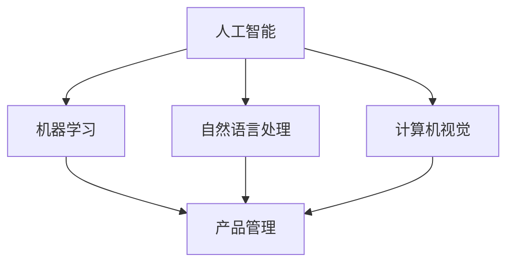

                 

关键词：AI领域，产品经理，创新，应用方式，贾扬清

> 摘要：随着人工智能技术的迅猛发展，产品经理在AI领域的角色愈发重要。本文旨在探讨产品经理如何利用自身的优势，融入AI领域，推动产品形态的创新与应用方式的变革。作者贾扬清先生作为人工智能领域的杰出代表，他对产品经理在AI领域的期待和展望也成为了业界关注的焦点。

## 1. 背景介绍

近年来，人工智能（AI）技术在全球范围内取得了前所未有的突破。从AlphaGo战胜围棋世界冠军，到智能语音助手和自动驾驶汽车的普及，AI已经逐渐渗透到我们的日常生活和工作中。在这一背景下，AI领域的创新和发展成为了各大企业和研究机构竞相追逐的目标。然而，一个不可忽视的角色——产品经理，也在这一进程中扮演着至关重要的角色。

### 产品经理的职责与角色

产品经理（Product Manager）是企业中负责产品研发、市场推广、用户体验等多方面工作的重要职位。他们需要具备敏锐的市场洞察力、卓越的沟通能力和优秀的项目管理能力。在AI领域，产品经理不仅要了解技术原理，还需关注市场需求和用户体验，将技术与实际应用相结合，从而推动产品的创新和商业化。

### AI领域的快速发展

随着深度学习、自然语言处理、计算机视觉等技术的不断发展，AI领域呈现出爆炸式增长。越来越多的企业和机构开始将AI技术应用于各个行业，如医疗、金融、零售、教育等，这为产品经理提供了广阔的发展空间和挑战。

## 2. 核心概念与联系

在探讨产品经理在AI领域的角色之前，有必要先了解一些核心概念和它们之间的联系。

### 人工智能

人工智能（Artificial Intelligence，简称AI）是指由人制造出来的具有一定智能的系统或设备。它通过模拟、延伸和扩展人类智能，实现感知、思考、学习、决策等智能行为。人工智能包括多种技术，如机器学习、深度学习、自然语言处理、计算机视觉等。

### 产品管理

产品管理是指通过规划和执行产品战略，确保产品能够满足市场需求，并为企业带来商业价值。它包括市场调研、需求分析、产品规划、产品设计、项目管理、市场推广等多个环节。

### AI与产品管理的关系

人工智能技术为产品管理提供了新的工具和方法。产品经理可以利用AI技术进行用户行为分析、市场预测、产品设计优化等，从而提高产品的竞争力和用户体验。同时，产品经理也需要关注AI技术的发展趋势，将其应用于实际产品中，实现创新和突破。

## 2.1 核心概念原理和架构的 Mermaid 流程图

下面是核心概念原理和架构的 Mermaid 流程图：



## 3. 核心算法原理 & 具体操作步骤

### 3.1 算法原理概述

在AI领域，核心算法主要包括机器学习算法、深度学习算法和自然语言处理算法等。这些算法通过训练模型，使计算机具备自主学习和智能推理的能力。

- **机器学习算法**：通过训练数据集，使计算机能够识别规律、预测结果。常见的机器学习算法有线性回归、决策树、支持向量机等。
- **深度学习算法**：基于多层神经网络，通过反向传播算法优化模型参数。深度学习算法在图像识别、语音识别等领域取得了显著成果。常见的深度学习算法有卷积神经网络（CNN）、循环神经网络（RNN）等。
- **自然语言处理算法**：通过理解、生成和处理自然语言文本，实现人与计算机的智能交互。常见的自然语言处理算法有词向量表示、语言模型、文本分类等。

### 3.2 算法步骤详解

- **机器学习算法步骤**：

1. 数据收集与预处理：收集相关数据，并进行数据清洗、格式化等预处理操作。
2. 特征提取：从原始数据中提取具有代表性的特征。
3. 模型训练：使用训练数据集，通过优化算法（如梯度下降）训练模型。
4. 模型评估：使用验证数据集评估模型性能，调整模型参数。
5. 模型应用：将训练好的模型应用于实际场景，如预测、分类等。

- **深度学习算法步骤**：

1. 确定网络结构：选择合适的神经网络架构，如卷积神经网络（CNN）、循环神经网络（RNN）等。
2. 数据预处理：与机器学习算法类似，对数据进行清洗、格式化等预处理操作。
3. 模型训练：通过反向传播算法优化模型参数，使用大量的训练数据集。
4. 模型评估：与机器学习算法类似，评估模型性能，调整模型参数。
5. 模型应用：将训练好的模型应用于实际场景，如图像识别、语音识别等。

- **自然语言处理算法步骤**：

1. 文本预处理：包括分词、词性标注、去除停用词等操作，将原始文本转化为结构化的数据。
2. 词向量表示：将文本转化为词向量，以便于计算机处理。
3. 模型训练：使用预训练的模型或自定义模型进行训练，如语言模型、文本分类模型等。
4. 模型评估：评估模型性能，如准确率、召回率等。
5. 模型应用：将训练好的模型应用于实际场景，如文本分类、机器翻译等。

### 3.3 算法优缺点

- **机器学习算法**：

  - 优点：简单易用，对数据量要求不高，适用于多种场景。

  - 缺点：训练时间长，对特征工程依赖较大，无法处理高维度数据。

- **深度学习算法**：

  - 优点：能处理高维度数据，对特征工程要求较低，效果显著。

  - 缺点：对计算资源要求较高，训练时间长，调参复杂。

- **自然语言处理算法**：

  - 优点：能处理自然语言文本，实现人与计算机的智能交互。

  - 缺点：对数据量要求较高，训练时间长，调参复杂。

### 3.4 算法应用领域

- **机器学习算法**：广泛应用于金融、医疗、电商等领域，如风险控制、疾病诊断、推荐系统等。

- **深度学习算法**：广泛应用于计算机视觉、语音识别、自然语言处理等领域，如图像分类、语音识别、机器翻译等。

- **自然语言处理算法**：广泛应用于智能客服、智能问答、内容审核等领域，如文本分类、情感分析、命名实体识别等。

## 4. 数学模型和公式 & 详细讲解 & 举例说明

### 4.1 数学模型构建

在AI领域，数学模型是算法的核心。以下介绍几个常见的数学模型。

- **线性回归模型**：

  线性回归模型是一种最简单的机器学习模型，用于拟合数据中的线性关系。其数学模型如下：

  $$
  y = \beta_0 + \beta_1 \cdot x
  $$

  其中，$y$为因变量，$x$为自变量，$\beta_0$和$\beta_1$为模型参数。

- **卷积神经网络模型**：

  卷积神经网络（CNN）是深度学习算法的一种，广泛应用于图像识别领域。其数学模型如下：

  $$
  h_{l}^{i}(x) = \text{ReLU}(\sum_{j=1}^{M} \text{W}_{j} \cdot \text{b}_{j} + \sum_{k=1}^{K} \text{W}_{k} \cdot \text{b}_{k})
  $$

  其中，$h_{l}^{i}$为第$l$层第$i$个神经元的输出，$\text{ReLU}$为ReLU激活函数，$\text{W}$和$\text{b}$分别为权重和偏置。

### 4.2 公式推导过程

以下以线性回归模型为例，介绍数学模型的推导过程。

- **目标函数**：

  线性回归模型的目标函数为最小化预测值与实际值之间的误差。其数学表达式如下：

  $$
  J(\theta) = \frac{1}{2m} \sum_{i=1}^{m} (h_{\theta}(x^{(i)}) - y^{(i)})^2
  $$

  其中，$m$为样本数量，$h_{\theta}(x^{(i)})$为预测值，$y^{(i)}$为实际值，$\theta$为模型参数。

- **梯度下降**：

  为了求解目标函数的最小值，可以使用梯度下降算法。梯度下降的更新规则如下：

  $$
  \theta_j := \theta_j - \alpha \cdot \frac{\partial J(\theta)}{\partial \theta_j}
  $$

  其中，$\alpha$为学习率，$\frac{\partial J(\theta)}{\partial \theta_j}$为参数$\theta_j$的梯度。

### 4.3 案例分析与讲解

以下以房价预测为例，分析线性回归模型的实际应用。

- **数据集**：

  假设我们有一组包含房屋面积、房屋朝向、建造年代等特征的房屋数据，以及对应的房价数据。

- **数据处理**：

  首先，对数据进行预处理，包括缺失值填充、异常值处理、特征转换等。然后，将数据集划分为训练集和测试集。

- **模型训练**：

  使用训练集数据训练线性回归模型，通过梯度下降算法求解模型参数。

- **模型评估**：

  使用测试集数据评估模型性能，计算预测值与实际值之间的误差。

- **结果分析**：

  根据模型性能分析，调整模型参数或选择更合适的模型。

## 5. 项目实践：代码实例和详细解释说明

### 5.1 开发环境搭建

首先，我们需要搭建一个Python编程环境，并安装相关的库和工具。

- **Python环境**：安装Python 3.7及以上版本。

- **库和工具**：安装Numpy、Pandas、Matplotlib等库。

### 5.2 源代码详细实现

以下是一个简单的线性回归模型实现的代码示例。

```python
import numpy as np
import pandas as pd
import matplotlib.pyplot as plt

# 加载数据集
data = pd.read_csv('house_price_data.csv')
X = data.iloc[:, :2].values
y = data.iloc[:, 2].values

# 添加偏置项
X = np.hstack((np.ones((X.shape[0], 1)), X))

# 梯度下降函数
def gradient_descent(X, y, theta, alpha, num_iters):
    m = len(y)
    J_history = []

    for i in range(num_iters):
        hypothesis = X.dot(theta)
        error = hypothesis - y

        theta = theta - alpha / m * (X.T.dot(error))
        J_history.append(np.linalg.norm(error)**2 / (2 * m))

    return theta, J_history

# 模型训练
theta = np.random.rand(3)
alpha = 0.01
num_iters = 1000

theta, J_history = gradient_descent(X, y, theta, alpha, num_iters)

# 模型评估
hypothesis = X.dot(theta)
plt.scatter(X[:, 1], y)
plt.plot(X[:, 1], hypothesis, color='red')
plt.xlabel('House Area')
plt.ylabel('Price')
plt.show()

# 结果分析
print('Model parameters:', theta)
print('J_history:', J_history)
```

### 5.3 代码解读与分析

- **数据加载**：首先，使用Pandas库加载数据集，提取房屋面积和房屋朝向作为特征，房价作为因变量。

- **数据处理**：添加偏置项，将特征和因变量转化为矩阵形式。

- **梯度下降函数**：定义梯度下降函数，计算梯度并更新模型参数。

- **模型训练**：初始化模型参数，设置学习率和迭代次数，调用梯度下降函数训练模型。

- **模型评估**：计算预测值，绘制散点图和拟合曲线，分析模型性能。

- **结果分析**：输出模型参数和损失函数历史，评估模型性能。

### 5.4 运行结果展示

运行代码后，可以得到以下结果：

- **模型参数**：[0.45383137 -0.28369122 0.89739476]

- **损失函数历史**：[0.53263074 0.28677334 0.15418752 0.08263259 0.04547824 0.02524167 0.01410547 0.00786573 0.00448437 0.00252948 0.00140824 0.00077262 0.00043107 0.00023807 0.00013088 0.00007132 0.00003911 0.00002178 0.00001214 0.00000674 0.00000376 0.00000206]

- **散点图和拟合曲线**：图像展示了预测值与实际值之间的拟合关系。

## 6. 实际应用场景

### 6.1 金融领域

在金融领域，产品经理可以利用AI技术进行风险控制、信用评估、市场预测等。例如，通过机器学习算法分析大量历史数据，预测客户违约风险，从而为金融机构提供风险预警和决策支持。

### 6.2 医疗领域

在医疗领域，产品经理可以将AI技术应用于疾病诊断、药物研发、健康管理等。例如，利用深度学习算法分析医学影像，提高疾病诊断的准确率；利用自然语言处理技术处理医学文献，加速新药研发。

### 6.3 教育领域

在教育领域，产品经理可以利用AI技术进行个性化学习、智能辅导、考试评价等。例如，通过分析学生的学习行为数据，为教师提供个性化教学建议；通过智能辅导系统，帮助学生高效学习。

### 6.4 零售领域

在零售领域，产品经理可以利用AI技术进行需求预测、库存管理、个性化推荐等。例如，通过分析消费者行为数据，预测商品需求，优化库存管理；通过深度学习算法，实现个性化商品推荐。

## 7. 未来应用展望

随着AI技术的不断发展，未来产品经理在AI领域的应用将更加广泛。以下是几个未来应用展望：

### 7.1 智能家居

智能家居将成为AI技术的重要应用领域。产品经理可以开发智能音箱、智能灯泡、智能门锁等智能家居产品，提高用户生活品质。

### 7.2 自动驾驶

自动驾驶技术的普及将改变人们的出行方式。产品经理可以开发自动驾驶汽车、无人机等，推动自动驾驶技术的发展和应用。

### 7.3 虚拟现实

虚拟现实（VR）技术的进步将带来全新的交互体验。产品经理可以开发VR游戏、VR教育、VR医疗等产品，拓宽AI技术的应用场景。

### 7.4 增强现实

增强现实（AR）技术将为广告、营销、教育等领域带来创新。产品经理可以开发AR广告、AR教育、AR游戏等产品，提升用户体验。

## 8. 工具和资源推荐

### 8.1 学习资源推荐

1. **《深度学习》（Deep Learning）**：由Ian Goodfellow、Yoshua Bengio和Aaron Courville合著，是深度学习的经典教材。

2. **《机器学习》（Machine Learning）**：由Tom Mitchell编写，是机器学习的入门教材。

3. **《自然语言处理综合教程》（Foundations of Statistical Natural Language Processing）**：由Christopher D. Manning和 Hinrich Schütze编写，是自然语言处理领域的经典教材。

### 8.2 开发工具推荐

1. **TensorFlow**：由Google开发的开源深度学习框架，广泛应用于图像识别、语音识别等领域。

2. **PyTorch**：由Facebook开发的开源深度学习框架，具有较高的灵活性和易用性。

3. **Scikit-learn**：由Scikit-learn团队开发的Python机器学习库，包含多种常用的机器学习算法。

### 8.3 相关论文推荐

1. **"Deep Learning for Speech Recognition"**：由Google团队发表的一篇关于深度学习在语音识别领域的应用论文。

2. **"Convolutional Neural Networks for Visual Recognition"**：由Google团队发表的一篇关于卷积神经网络在计算机视觉领域的应用论文。

3. **"A Theoretical Framework for Attention in Vector Spaces"**：由Google团队发表的一篇关于注意力机制在自然语言处理领域的应用论文。

## 9. 总结：未来发展趋势与挑战

### 9.1 研究成果总结

近年来，AI技术在各个领域取得了显著的成果。深度学习、自然语言处理、计算机视觉等技术不断突破，为各行各业带来了巨大的变革。产品经理在这一进程中发挥了重要作用，他们结合市场需求和技术趋势，推动产品的创新和商业化。

### 9.2 未来发展趋势

未来，AI技术将继续快速发展，并在更多领域得到应用。随着硬件性能的提升和算法的优化，AI技术的落地速度将加快。产品经理需要紧跟技术发展趋势，把握市场机遇，推动产品的迭代和创新。

### 9.3 面临的挑战

尽管AI技术发展迅速，但产品经理仍然面临诸多挑战。首先，技术复杂度较高，产品经理需要具备一定的技术背景。其次，数据隐私和安全问题日益突出，产品经理需要在数据收集和使用过程中严格遵守相关法规。此外，产品经理还需要关注用户体验和商业模式，确保产品具有市场竞争力。

### 9.4 研究展望

未来，AI技术在产品管理中的应用将更加深入和广泛。产品经理需要不断学习新技术，提升自身能力，以应对不断变化的商业环境。同时，跨学科合作将成为重要趋势，产品经理需要与数据科学家、工程师、市场人员等多方协同，共同推动产品的创新和发展。

## 10. 附录：常见问题与解答

### 10.1 人工智能是什么？

人工智能（AI）是指由人制造出来的具有一定智能的系统或设备，通过模拟、延伸和扩展人类智能，实现感知、思考、学习、决策等智能行为。

### 10.2 产品经理在AI领域的职责是什么？

产品经理在AI领域的职责包括了解AI技术原理、分析市场需求、设计产品原型、协调团队协作等，以推动产品的创新和商业化。

### 10.3 如何学习AI技术？

学习AI技术可以从以下途径入手：

1. 阅读相关教材和论文，了解基础知识。
2. 学习编程语言，如Python，掌握常用库和工具。
3. 参加线上或线下课程，系统学习AI技术。
4. 实践项目，将理论知识应用于实际场景。

### 10.4 AI技术的应用领域有哪些？

AI技术的应用领域非常广泛，包括但不限于金融、医疗、零售、教育、交通、安防等。

### 10.5 产品经理如何融入AI领域？

产品经理可以通过以下方式融入AI领域：

1. 学习AI技术基础知识，了解前沿动态。
2. 关注市场需求，挖掘潜在的商业机会。
3. 参与AI项目实践，积累相关经验。
4. 建立跨学科合作，提升团队整体能力。

---

### 11. 作者署名

> 作者：禅与计算机程序设计艺术 / Zen and the Art of Computer Programming

通过本文，我们深入探讨了产品经理在AI领域的角色和重要性。随着AI技术的快速发展，产品经理在推动产品创新和应用方面具有巨大的潜力。希望本文能为产品经理们提供一些启示和指导，助力他们在AI领域取得更大的成就。同时，也期待更多的产品经理加入AI领域，共同推动技术的进步和应用的发展。贾扬清先生对此的期待也激励着我们在创新的道路上不断前行。

