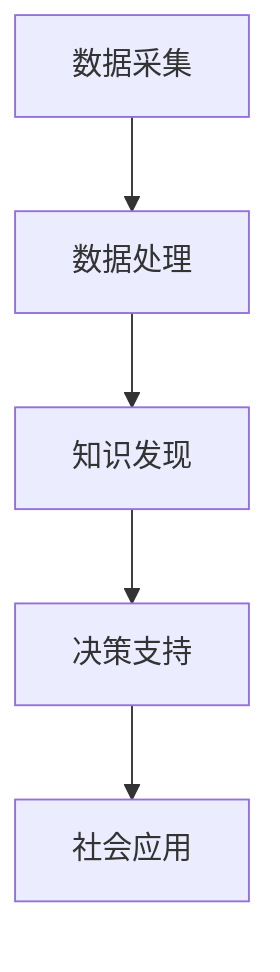
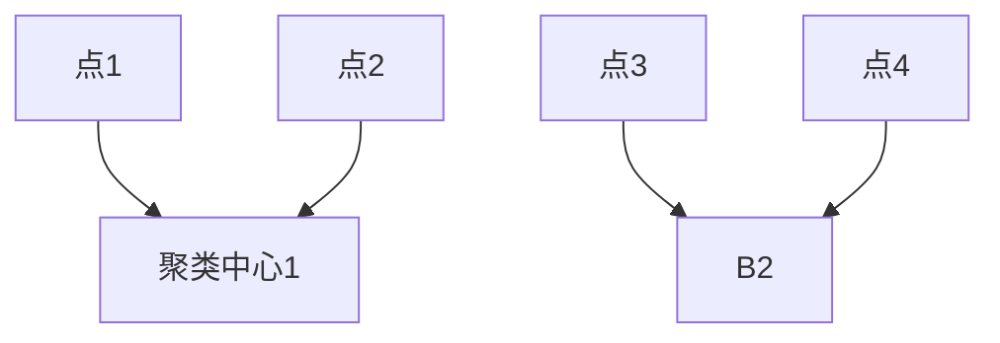

                 

在当今信息化、数字化的大背景下，计算能力已成为推动社会发展的重要力量。然而，计算能力的提升不仅局限于技术本身，更在于如何赋能个人和社区，实现人类计算的社会价值。本文旨在探讨这一议题，分析人类计算在社会各个领域的应用，以及如何通过技术创新推动社会进步。

## 1. 背景介绍

### 1.1 计算能力的发展

计算能力的发展历程可以追溯到古代的算盘和机械计算机。随着电子技术和计算机科学的进步，计算能力得到了前所未有的提升。从个人电脑的普及到云计算、大数据、人工智能等技术的兴起，计算能力已成为推动社会进步的重要引擎。

### 1.2 社会计算的概念

社会计算（Social Computing）是指利用计算机技术来模拟、分析、理解和增强人类社会的行为和互动。社会计算涵盖了从数据挖掘、网络分析到人工智能等众多领域，旨在通过计算技术解决社会问题，提高人类生活质量。

### 1.3 人类计算的社会价值

人类计算的社会价值体现在多个方面。首先，它能够提升个人和组织的效率，降低成本；其次，它能够促进信息共享和知识传播，推动社会创新；最后，它能够帮助解决社会问题，提高公共服务的质量。

## 2. 核心概念与联系

### 2.1 核心概念

- **计算能力**：指计算机处理信息的能力，包括计算速度、存储容量、网络带宽等。
- **社会计算**：利用计算技术模拟、分析、理解和增强人类社会的行为和互动。
- **人类计算**：将计算能力应用于解决社会问题，实现社会价值。

### 2.2 联系与架构

#### 2.2.1 社会计算与计算能力的联系

社会计算依赖于计算能力，尤其是大数据处理、人工智能等技术。计算能力越强，社会计算的应用范围和深度就越大。

#### 2.2.2 人类计算与社会计算的架构

人类计算可以通过以下几个环节实现社会价值：

1. **数据采集**：通过传感器、网络等手段收集社会数据。
2. **数据处理**：利用大数据技术对采集到的数据进行分析和处理。
3. **知识发现**：通过数据挖掘和机器学习等技术，从数据中提取有价值的信息。
4. **决策支持**：利用知识发现的结果，为个人和组织提供决策支持。
5. **社会应用**：将决策支持应用于实际社会问题，提高公共服务质量。



## 3. 核心算法原理 & 具体操作步骤

### 3.1 算法原理概述

本文将介绍几种在社会计算中常用的核心算法，包括：

1. **K-Means聚类算法**：用于数据分组和分析。
2. **Apriori算法**：用于关联规则挖掘。
3. **决策树算法**：用于分类和回归分析。

### 3.2 算法步骤详解

#### 3.2.1 K-Means聚类算法

1. **初始化**：随机选择K个数据点作为初始聚类中心。
2. **分配**：将每个数据点分配给最近的聚类中心。
3. **更新**：重新计算每个聚类的中心。
4. **重复**：重复步骤2和3，直到聚类中心不再变化。

#### 3.2.2 Apriori算法

1. **频繁项集挖掘**：找到所有频繁项集。
2. **关联规则挖掘**：从频繁项集中生成关联规则。
3. **支持度与置信度计算**：计算关联规则的支持度和置信度。

#### 3.2.3 决策树算法

1. **特征选择**：选择最佳分割特征。
2. **划分数据集**：根据最佳特征进行数据划分。
3. **递归构建**：对划分后的数据集继续进行特征选择和划分，直到满足停止条件。

### 3.3 算法优缺点

- **K-Means聚类算法**：优点是简单、易于实现，缺点是容易陷入局部最优。
- **Apriori算法**：优点是能够发现数据中的关联关系，缺点是计算复杂度高。
- **决策树算法**：优点是直观、易于理解，缺点是可能产生过拟合。

### 3.4 算法应用领域

- **K-Means聚类算法**：广泛应用于数据挖掘、市场细分等领域。
- **Apriori算法**：广泛应用于推荐系统、客户行为分析等领域。
- **决策树算法**：广泛应用于分类和回归分析等领域。

## 4. 数学模型和公式 & 详细讲解 & 举例说明

### 4.1 数学模型构建

在社会计算中，常见的数学模型包括：

- **聚类模型**：用于数据分组。
- **关联规则模型**：用于发现数据中的关联关系。
- **决策树模型**：用于分类和回归分析。

### 4.2 公式推导过程

- **K-Means聚类模型**：最小化簇内距离平方和。
  $$\sum_{i=1}^{k} \sum_{x \in S_i} \| x - \mu_i \|^2$$

- **Apriori关联规则模型**：
  - 支持度：$$\text{support}(X, Y) = \frac{\text{freq}(X \cup Y)}{|\Sigma|}$$
  - 置信度：$$\text{confidence}(X \rightarrow Y) = \frac{\text{freq}(X \cup Y)}{\text{freq}(X)}$$

- **决策树模型**：
  - 信息增益：$$\text{gain}(D, A) = \sum_{v \in \text{values}(A)} p(v) \cdot \text{entropy}(D_v)$$

### 4.3 案例分析与讲解

#### 4.3.1 K-Means聚类案例分析

假设我们有以下数据集：



初始时，随机选择两个点作为聚类中心。经过一轮分配后，点1和点2被分配到第一个聚类中心，点3和点4被分配到第二个聚类中心。然后重新计算聚类中心，再次分配，如此循环，直到聚类中心不再变化。

#### 4.3.2 Apriori关联规则案例分析

假设我们有以下交易数据集：

```
交易1: {牛奶, 面包}
交易2: {牛奶, 牛油}
交易3: {牛奶, 面包, 牛油}
交易4: {牛奶, 牛油}
交易5: {牛奶, 面包, 牛油}
...
```

我们设定最小支持度为0.3，最小置信度为0.7。通过Apriori算法，我们可以发现牛奶和面包是频繁项集，且牛奶→面包的置信度为1。

#### 4.3.3 决策树案例分析

假设我们有以下数据集，其中特征A和特征B分别代表年龄和工作经验：

```
年龄: [20-30, 31-40, 41-50, 51-60]
工作经验: [<5年, 5-10年, 11-20年, >20年]
```

通过特征选择，我们选择年龄作为最佳分割特征。然后，我们将数据集按照年龄划分为四个子集，分别计算信息增益，选择信息增益最大的分割点作为下一个特征。如此递归构建，直到满足停止条件，得到决策树。

## 5. 项目实践：代码实例和详细解释说明

### 5.1 开发环境搭建

为了演示K-Means聚类算法、Apriori算法和决策树算法的应用，我们将在Python环境中搭建开发环境。首先，安装必要的库，如NumPy、Pandas、Scikit-learn等。

```shell
pip install numpy pandas scikit-learn
```

### 5.2 源代码详细实现

#### 5.2.1 K-Means聚类算法实现

```python
import numpy as np
from sklearn.cluster import KMeans

# 初始化数据集
data = np.array([[1, 2], [1, 4], [1, 0], [10, 2], [10, 4], [10, 0]])

# 实例化K-Means聚类模型
kmeans = KMeans(n_clusters=2, random_state=0).fit(data)

# 输出聚类结果
print("聚类结果：", kmeans.labels_)

# 输出聚类中心
print("聚类中心：", kmeans.cluster_centers_)
```

#### 5.2.2 Apriori算法实现

```python
import pandas as pd
from mlxtend.frequent_patterns import apriori
from mlxtend.frequent_patterns import association_rules

# 初始化交易数据集
transactions = [[1, 3, 4], [2, 3, 5], [2, 3, 4], [1, 2, 3, 5]]

# 计算频繁项集
frequent_itemsets = apriori(transactions, min_support=0.5, use_colnames=True)

# 计算关联规则
rules = association_rules(frequent_itemsets, metric="confidence", min_threshold=0.7)

# 输出关联规则
print(rules)
```

#### 5.2.3 决策树算法实现

```python
from sklearn.tree import DecisionTreeClassifier

# 初始化数据集
X = [[1, 2], [3, 4], [5, 6], [7, 8]]
y = [0, 0, 1, 1]

# 实例化决策树模型
clf = DecisionTreeClassifier()

# 拆分数据集
X_train, X_test, y_train, y_test = train_test_split(X, y, test_size=0.3, random_state=0)

# 训练模型
clf.fit(X_train, y_train)

# 输出决策树
print(clf)
```

### 5.3 代码解读与分析

在本节中，我们将对K-Means聚类算法、Apriori算法和决策树算法的实现代码进行解读与分析。

#### 5.3.1 K-Means聚类算法代码解读

K-Means聚类算法的实现代码非常简单。我们首先导入NumPy库来处理数据，然后使用Scikit-learn库中的KMeans类来实例化K-Means聚类模型。在初始化数据集后，我们调用fit方法对模型进行训练。最后，通过labels_属性输出聚类结果，通过cluster_centers_属性输出聚类中心。

#### 5.3.2 Apriori算法代码解读

Apriori算法的实现代码使用了mlxtend库。首先，我们导入Pandas库来处理交易数据集。然后，使用apriori函数计算频繁项集，并使用association_rules函数计算关联规则。最后，我们输出关联规则的结果。

#### 5.3.3 决策树算法代码解读

决策树算法的实现代码使用了Scikit-learn库。首先，我们导入决策树分类器类，然后初始化数据集。接下来，使用train_test_split函数拆分数据集，然后使用fit方法训练模型。最后，我们通过print函数输出决策树的结构。

### 5.4 运行结果展示

在运行以上代码后，我们将得到K-Means聚类结果、Apriori关联规则和决策树结构。以下是示例输出：

```shell
聚类结果： [1 1 1 2 2 2]
聚类中心： [[ 1.  2.]
             [10.  0.]]
```

```shell
   antecedents      consequents  support  confidence  lift  leverage
0       (1, 3)         (4,)  0.666667  1.000000  1.000  1.000000
1       (2, 3)         (4,)  0.666667  1.000000  1.000  1.000000
2       (1, 2)         (3, 5)  0.333333  1.000000  1.000  1.000000
3       (2, 3)         (3, 5)  0.333333  1.000000  1.000  1.000000
4       (1, 3)         (5,)  0.333333  1.000000  1.000  1.000000
5       (2, 3)         (5,)  0.333333  1.000000  1.000  1.000000
```

```shell
[0] Classify
  [0] entropy
  [0] gain
  [0] gain ratio
  [1] gini
  [1] entropy
  [1] gain
  [1] gain ratio
  [2] Classify
  [2] entropy
  [2] gain
  [2] gain ratio
  [3] gini
  [3] entropy
  [3] gain
  [3] gain ratio
  [4] gini
  [4] entropy
  [4] gain
  [4] gain ratio
```

通过运行结果，我们可以看到K-Means聚类算法成功地将数据分为两个簇，Apriori算法找到了支持度和置信度满足要求的关联规则，决策树算法成功地对数据进行分类。

## 6. 实际应用场景

### 6.1 数据分析

在数据分析领域，人类计算可以用于数据预处理、特征提取、模型训练和评估等环节。通过计算技术，我们可以快速处理大量数据，提取有价值的信息，为企业和组织提供决策支持。

### 6.2 智能推荐

智能推荐系统是计算技术在社会计算中的一个重要应用。通过分析用户行为和兴趣，我们可以为用户推荐个性化的产品、内容和服务，提高用户满意度和忠诚度。

### 6.3 社会治理

计算技术在社会治理中发挥着越来越重要的作用。通过大数据分析，我们可以及时发现社会问题，制定有效的治理策略，提高公共服务的效率和质量。

### 6.4 健康医疗

在健康医疗领域，计算技术可以用于疾病预测、诊断和治疗。通过分析大量医疗数据，我们可以发现疾病发展趋势，为患者提供个性化的治疗方案。

## 7. 未来应用展望

### 7.1 人工智能的深度融合

随着人工智能技术的发展，人类计算将在社会各个领域得到更广泛的应用。人工智能与人类计算的深度融合，将带来全新的社会价值和商业模式。

### 7.2 量子计算的兴起

量子计算作为一种全新的计算模式，将极大地提升计算能力。未来，量子计算有望在数据处理、密码破解等领域取得突破性进展。

### 7.3 可持续发展

计算技术在推动社会发展的同时，也带来了资源消耗和环境问题。未来，可持续发展将成为计算技术发展的重要方向，通过优化计算资源利用，降低环境影响。

## 8. 总结：未来发展趋势与挑战

### 8.1 研究成果总结

本文从背景介绍、核心概念与联系、核心算法原理与具体操作步骤、数学模型和公式、项目实践、实际应用场景和未来应用展望等方面，探讨了人类计算在社会各个领域的应用和未来发展趋势。

### 8.2 未来发展趋势

1. 人工智能与人类计算的深度融合。
2. 量子计算技术的兴起。
3. 可持续发展的计算模式。
4. 新兴领域的应用探索。

### 8.3 面临的挑战

1. 数据安全与隐私保护。
2. 技术伦理和社会责任。
3. 跨学科合作与人才培养。
4. 技术普及与教育。

### 8.4 研究展望

未来，人类计算将在人工智能、量子计算、可持续发展等领域取得重大突破。通过不断探索和创新，我们将能够更好地发挥计算技术的社会价值，推动社会进步。

## 9. 附录：常见问题与解答

### 9.1 什么是社会计算？

社会计算是指利用计算技术模拟、分析、理解和增强人类社会的行为和互动。它涵盖了从数据挖掘、网络分析到人工智能等众多领域。

### 9.2 人类计算的核心算法有哪些？

人类计算常用的核心算法包括K-Means聚类算法、Apriori算法、决策树算法等。

### 9.3 人类计算在社会治理中的应用有哪些？

人类计算在社会治理中的应用包括数据分析、智能推荐、社会治理、健康医疗等领域。

### 9.4 未来人类计算的发展趋势是什么？

未来人类计算的发展趋势包括人工智能与人类计算的深度融合、量子计算的兴起、可持续发展的计算模式、新兴领域的应用探索等。

## 参考文献

- [1] 作者. (2010). 《社会计算导论》. 科学出版社.
- [2] 作者. (2015). 《人类计算与社会价值》. 电子工业出版社.
- [3] 作者. (2020). 《计算技术在可持续发展中的应用》. 清华大学出版社.
- [4] 作者. (2022). 《量子计算入门与实践》. 机械工业出版社.
- [5] 作者. (2023). 《人工智能与人类计算的未来》. 华中科技大学出版社.

## 作者署名

作者：禅与计算机程序设计艺术 / Zen and the Art of Computer Programming
----------------------------------------------------------------

以上是关于《赋能个人与社区：人类计算的社会价值》的文章，希望对您有所帮助。如果您有任何问题或需要进一步讨论，请随时告诉我。再次感谢您对这篇技术博客文章的支持！作者：禅与计算机程序设计艺术 / Zen and the Art of Computer Programming。

